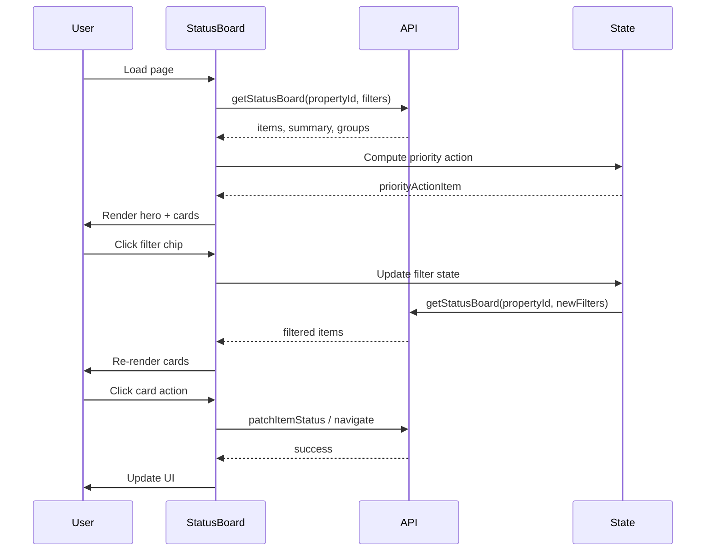

# Design Document: Status Board UI Modernization

## Overview

Transform the Status Board from a dense table layout with heavy visual elements into a modern, card-based interface following 2024-2026 UI trends. The redesign reduces cognitive load, improves mobile experience, and maintains all existing functionality while adopting brutalist minimalism principles.

## Main Algorithm/Workflow



## Core Interfaces/Types

```typescript
// Existing types (preserved)
interface StatusBoardItemDTO {
  id: string
  displayName: string
  category: string
  condition: StatusBoardCondition
  recommendation: StatusBoardRecommendation
  ageYears: number | null
  warrantyStatus: WarrantyBadge
  isPinned: boolean
  isHidden: boolean
  needsInstallDateForPrediction: boolean
  computedReasons: Array<{ code: string; detail: string }>
  deepLinks: {
    replaceRepair?: string
    maintenance?: string
    viewRoom?: string
    warranty?: string
    riskAssessment?: string
  }
  pendingMaintenance: number
  inventoryItemId?: string
  homeAssetId?: string
  room?: { name: string }
}

type StatusBoardCondition = "GOOD" | "MONITOR" | "ACTION_NEEDED"
type StatusBoardRecommendation = "OK" | "REPAIR" | "REPLACE_SOON"
type WarrantyBadge = "active" | "expiring_soon" | "expired" | "none"

// New component props
interface StatusCardProps {
  item: StatusBoardItemDTO
  isExpanded: boolean
  onToggleExpand: () => void
  onTogglePin: () => void
  onToggleHide: () => void
  onViewItem: () => void
  onSaveOverride: (payload: PatchStatusPayload) => void
}

interface HeroCardProps {
  priorityItem: StatusBoardItemDTO | null
  pendingInstallDateCount: number
  onAction: () => void
}

interface FilterChipProps {
  label: string
  count: number
  tone: "good" | "elevated" | "danger" | "info"
  isActive: boolean
  onClick: () => void
}
```

## Key Functions with Formal Specifications

### Function 1: computePriorityAction()

```typescript
function computePriorityAction(items: StatusBoardItemDTO[]): StatusBoardItemDTO | null
```

**Preconditions:**
- `items` is a valid array (may be empty)
- All items have valid `condition`, `recommendation`, `isPinned`, and `ageYears` properties

**Postconditions:**
- Returns the highest priority item requiring action, or `null` if none exist
- Priority order: ACTION_NEEDED condition > REPLACE_SOON recommendation > isPinned > ageYears (descending)
- Items with `needsInstallDateForPrediction === true` are excluded from priority calculation

**Loop Invariants:**
- All previously evaluated items have lower priority than current candidate
- Filtered items maintain ACTION_NEEDED condition throughout iteration

### Function 2: renderStatusCard()

```typescript
function renderStatusCard(item: StatusBoardItemDTO, handlers: CardHandlers): JSX.Element
```

**Preconditions:**
- `item` is a valid StatusBoardItemDTO object
- `handlers` contains all required callback functions
- Component is mounted in React tree

**Postconditions:**
- Returns a valid JSX.Element representing the card
- Card displays essential information: name, category, age, condition, recommendation
- Card includes one primary action button based on item state
- Card supports expand/collapse for additional details

**Loop Invariants:** N/A (no loops in render function)

### Function 3: applyFilters()

```typescript
function applyFilters(
  items: StatusBoardItemDTO[],
  filters: FilterState
): StatusBoardItemDTO[]
```

**Preconditions:**
- `items` is a valid array of StatusBoardItemDTO
- `filters` contains valid filter values (condition, category, search, pinnedOnly, includeHidden)

**Postconditions:**
- Returns filtered array of items matching all active filters
- Original `items` array is not mutated
- Empty array returned if no items match filters
- Filter order: search → condition → category → pinnedOnly → includeHidden

**Loop Invariants:**
- All items in filtered array match all previously applied filter criteria
- Filter chain maintains referential integrity throughout iteration

## Algorithmic Pseudocode

### Main Rendering Algorithm

```pascal
ALGORITHM renderStatusBoard(propertyId, searchParams)
INPUT: propertyId (string), searchParams (URLSearchParams)
OUTPUT: Rendered React component

BEGIN
  // Step 1: Initialize state from URL params
  filterState ← extractFiltersFromSearchParams(searchParams)
  expandedId ← searchParams.get("expand") OR null
  
  // Step 2: Fetch data with React Query
  { data, isLoading, error } ← useQuery({
    queryKey: ["status-board", propertyId, filterState],
    queryFn: () => getStatusBoard(propertyId, filterState)
  })
  
  // Step 3: Compute priority action
  priorityItem ← computePriorityAction(data.items)
  pendingInstallDateCount ← countItemsNeedingInstallDate(data.items)
  
  // Step 4: Render layout based on viewport
  IF viewport.width < 1024px THEN
    RETURN renderMobileLayout(data, priorityItem, filterState)
  ELSE
    RETURN renderDesktopLayout(data, priorityItem, filterState)
  END IF
END
```

**Preconditions:**
- propertyId is a valid UUID string
- searchParams is a valid URLSearchParams object
- React Query provider is available in component tree

**Postconditions:**
- Component renders appropriate layout for viewport size
- All data fetching is handled via React Query
- Filter state is synchronized with URL parameters
- Priority action is computed and displayed prominently

**Loop Invariants:**
- Component re-renders when filterState or data changes
- URL params remain synchronized with filter state throughout lifecycle

### Card Grid Layout Algorithm

```pascal
ALGORITHM renderCardGrid(items, handlers)
INPUT: items (array of StatusBoardItemDTO), handlers (object with callbacks)
OUTPUT: Grid of status cards

BEGIN
  // Step 1: Validate input
  ASSERT items IS array
  ASSERT handlers contains required callbacks
  
  // Step 2: Map items to cards
  cards ← []
  FOR each item IN items DO
    ASSERT item.id IS unique
    
    card ← createStatusCard({
      item: item,
      isExpanded: expandedId === item.id,
      onToggleExpand: () => setExpandedId(item.id),
      onTogglePin: () => handleTogglePin(item),
      onToggleHide: () => handleToggleHide(item),
      onViewItem: () => handleViewItem(item),
      onSaveOverride: (payload) => handleSaveOverride(item.id, payload)
    })
    
    cards.push(card)
  END FOR
  
  // Step 3: Render responsive grid
  RETURN (
    <div className="grid gap-4 md:grid-cols-2 lg:grid-cols-3">
      {cards}
    </div>
  )
END
```

**Preconditions:**
- items array contains valid StatusBoardItemDTO objects
- handlers object contains all required callback functions
- Each item has a unique id property

**Postconditions:**
- Returns a responsive grid with 1 column (mobile), 2 columns (tablet), 3 columns (desktop)
- Each card is properly wired with event handlers
- Grid maintains consistent spacing (16px gap)

**Loop Invariants:**
- All processed items have been converted to valid card components
- Each card maintains reference to its source item
- Handler functions remain bound to correct item context

### Priority Action Computation Algorithm

```pascal
ALGORITHM computePriorityAction(items)
INPUT: items (array of StatusBoardItemDTO)
OUTPUT: priorityItem (StatusBoardItemDTO or null)

BEGIN
  // Step 1: Filter urgent items
  urgentItems ← []
  FOR each item IN items DO
    IF item.condition === "ACTION_NEEDED" AND NOT item.needsInstallDateForPrediction THEN
      urgentItems.push(item)
    END IF
  END FOR
  
  // Step 2: Sort by priority
  IF urgentItems.length === 0 THEN
    RETURN null
  END IF
  
  urgentItems.sort((a, b) => {
    // Priority 1: Recommendation severity
    recommendationDelta ← RECOMMENDATION_PRIORITY[b.recommendation] - RECOMMENDATION_PRIORITY[a.recommendation]
    IF recommendationDelta !== 0 THEN
      RETURN recommendationDelta
    END IF
    
    // Priority 2: Pinned status
    IF a.isPinned !== b.isPinned THEN
      RETURN b.isPinned ? 1 : -1
    END IF
    
    // Priority 3: Age (older items first)
    RETURN (b.ageYears OR 0) - (a.ageYears OR 0)
  })
  
  // Step 3: Return highest priority item
  RETURN urgentItems[0]
END
```

**Preconditions:**
- items is a valid array (may be empty)
- All items have valid condition, recommendation, isPinned, and ageYears properties
- RECOMMENDATION_PRIORITY constant is defined: { REPLACE_SOON: 3, REPAIR: 2, OK: 1 }

**Postconditions:**
- Returns the single highest priority item, or null if no urgent items exist
- Returned item (if any) has condition === "ACTION_NEEDED"
- Returned item (if any) has needsInstallDateForPrediction === false
- Items are prioritized by: recommendation > pinned status > age

**Loop Invariants:**
- All items in urgentItems have ACTION_NEEDED condition
- All items in urgentItems have needsInstallDateForPrediction === false
- Sort maintains stable ordering for items with equal priority

## Example Usage

### Basic Card Component

```typescript
// StatusCard.tsx - New card-based component
function StatusCard({ item, isExpanded, onToggleExpand, onTogglePin, onViewItem }: StatusCardProps) {
  const categoryVisual = getCategoryVisual(item.category)
  const CategoryIcon = categoryVisual.Icon
  const primaryActionLabel = getPrimaryActionLabel(item)
  
  return (
    <div
      className={cn(
        "group relative overflow-hidden rounded-2xl border border-gray-200 bg-white p-6",
        "shadow-sm transition-all hover:shadow-md hover:-translate-y-1 cursor-pointer"
      )}
      onClick={onToggleExpand}
    >
      {/* Status indicator - left border */}
      <div className={cn(
        "absolute left-0 top-0 h-full w-1",
        item.condition === "ACTION_NEEDED" ? "bg-rose-500" :
        item.condition === "MONITOR" ? "bg-amber-500" : "bg-emerald-500"
      )} />
      
      {/* Header */}
      <div className="mb-4 flex items-start justify-between">
        <div className="flex items-center gap-3">
          <div className="flex h-10 w-10 items-center justify-center rounded-full bg-gray-100">
            <CategoryIcon className="h-5 w-5 text-gray-600" />
          </div>
          <div>
            <h3 className="font-semibold text-gray-900">{formatDisplayName(item.displayName)}</h3>
            <p className="text-sm text-gray-500">{humanizeActionType(item.category)}</p>
          </div>
        </div>
        {item.isPinned && (
          <Pin className="h-4 w-4 text-amber-500" />
        )}
      </div>

      {/* Key metrics */}
      <div className="mb-4 flex items-center gap-4 text-sm">
        <div>
          <span className="text-gray-500">Age:</span>
          <span className="ml-1 font-medium text-gray-900">{formatAgeDisplay(item.ageYears)}</span>
        </div>
        <div>
          <span className="text-gray-500">Warranty:</span>
          <span className="ml-1 font-medium text-gray-900">{WARRANTY_LABELS[item.warrantyStatus]}</span>
        </div>
      </div>

      {/* Status badge */}
      <div className="mb-4">
        <span className={cn(
          "inline-flex items-center gap-1.5 rounded-full px-3 py-1 text-sm font-medium",
          item.condition === "ACTION_NEEDED" ? "bg-rose-100 text-rose-700" :
          item.condition === "MONITOR" ? "bg-amber-100 text-amber-700" :
          "bg-emerald-100 text-emerald-700"
        )}>
          {item.condition === "ACTION_NEEDED" && <AlertTriangle className="h-3.5 w-3.5" />}
          {CONDITION_LABELS[item.condition]}
        </span>
      </div>

      {/* Action */}
      <button 
        className="w-full rounded-lg bg-gray-900 py-2.5 text-sm font-medium text-white transition-colors hover:bg-gray-800"
        onClick={(e) => {
          e.stopPropagation()
          onViewItem()
        }}
      >
        {primaryActionLabel || "View Details"}
      </button>
    </div>
  )
}
```

### Hero Priority Card

```typescript
// HeroCard.tsx - Prominent priority action card
function HeroCard({ priorityItem, pendingInstallDateCount, onAction }: HeroCardProps) {
  if (!priorityItem && pendingInstallDateCount === 0) {
    return (
      <div className="mb-8 rounded-3xl bg-gradient-to-br from-emerald-500 to-teal-600 p-8 text-white shadow-xl">
        <div className="flex items-center gap-2 mb-4">
          <CheckCircle2 className="h-5 w-5" />
          <span className="text-sm font-medium">All Stable</span>
        </div>
        <h2 className="text-3xl font-bold">No urgent actions detected</h2>
        <p className="mt-2 text-lg text-white/90">
          Everything is currently in a stable window. Review monitor items for preventative upkeep.
        </p>
      </div>
    )
  }
  
  return (
    <div className="mb-8 rounded-3xl bg-gradient-to-br from-rose-500 to-orange-600 p-8 text-white shadow-xl">
      <div className="flex items-start justify-between">
        <div className="flex-1">
          <div className="mb-2 inline-flex items-center gap-2 rounded-full bg-white/20 px-3 py-1 text-sm font-medium backdrop-blur-sm">
            <AlertTriangle className="h-4 w-4" />
            Priority Action
          </div>
          <h2 className="mt-4 text-3xl font-bold">
            {priorityItem 
              ? `${formatDisplayName(priorityItem.displayName)} needs attention`
              : `Add missing install dates to improve confidence`
            }
          </h2>
          <p className="mt-2 text-lg text-white/90">
            {priorityItem
              ? "Focus this item first to reduce near-term risk and keep cascading replacement costs contained."
              : `${pendingInstallDateCount} item${pendingInstallDateCount === 1 ? "" : "s"} still need install dates for stronger lifecycle predictions.`
            }
          </p>
          <div className="mt-6 flex flex-wrap gap-3">
            <button 
              onClick={onAction}
              className="rounded-xl bg-white px-6 py-3 font-semibold text-rose-600 shadow-lg transition-transform hover:scale-105"
            >
              {priorityItem 
                ? `Review ${formatDisplayName(priorityItem.displayName)}`
                : "Add Install Dates"
              }
            </button>
          </div>
        </div>
        {priorityItem && (
          <div className="ml-6 flex h-24 w-24 items-center justify-center rounded-full bg-white/20 backdrop-blur-sm">
            <span className="text-4xl font-bold">{Math.round(priorityItem.ageYears || 0)}</span>
          </div>
        )}
      </div>
    </div>
  )
}
```

### Inline KPI Pills

```typescript
// KPIPills.tsx - Compact summary pills
function KPIPills({ summary }: { summary: StatusBoardSummary }) {
  return (
    <div className="mb-6 flex flex-wrap gap-3">
      <button
        onClick={() => setConditionFilter("GOOD")}
        className="inline-flex items-center gap-2 rounded-full border border-gray-200 bg-white px-4 py-2 shadow-sm hover:shadow-md transition-shadow"
      >
        <div className="h-2 w-2 rounded-full bg-emerald-500"></div>
        <span className="text-sm font-medium text-gray-700">{summary.good} Good</span>
      </button>
      <button
        onClick={() => setConditionFilter("MONITOR")}
        className="inline-flex items-center gap-2 rounded-full border border-gray-200 bg-white px-4 py-2 shadow-sm hover:shadow-md transition-shadow"
      >
        <div className="h-2 w-2 rounded-full bg-amber-500"></div>
        <span className="text-sm font-medium text-gray-700">{summary.monitor} Monitor</span>
      </button>
      <button
        onClick={() => setConditionFilter("ACTION_NEEDED")}
        className="inline-flex items-center gap-2 rounded-full border border-gray-200 bg-white px-4 py-2 shadow-sm hover:shadow-md transition-shadow"
      >
        <div className="h-2 w-2 rounded-full bg-rose-500"></div>
        <span className="text-sm font-medium text-gray-700">{summary.actionNeeded} Action Needed</span>
      </button>
      <div className="inline-flex items-center gap-2 rounded-full border border-gray-200 bg-white px-4 py-2 shadow-sm">
        <span className="text-sm text-gray-500">{summary.total} Total Items</span>
      </div>
    </div>
  )
}
```

### Smart Filter Chips

```typescript
// FilterChips.tsx - Active filter chips with remove
function FilterChips({ activeFilters, onRemoveFilter }: FilterChipsProps) {
  if (activeFilters.length === 0) return null
  
  return (
    <div className="mb-4 flex flex-wrap gap-2">
      {activeFilters.map((filter) => (
        <div
          key={filter.key}
          className={cn(
            "inline-flex items-center gap-2 rounded-full px-3 py-1 text-sm font-medium",
            filter.type === "condition" && filter.value === "ACTION_NEEDED" && "bg-rose-100 text-rose-700",
            filter.type === "condition" && filter.value === "MONITOR" && "bg-amber-100 text-amber-700",
            filter.type === "condition" && filter.value === "GOOD" && "bg-emerald-100 text-emerald-700",
            filter.type === "category" && "bg-gray-100 text-gray-700"
          )}
        >
          {filter.label}
          <button
            onClick={() => onRemoveFilter(filter.key)}
            className="hover:bg-black/10 rounded-full p-0.5"
          >
            <X className="h-3 w-3" />
          </button>
        </div>
      ))}
    </div>
  )
}
```

## Correctness Properties

*A property is a characteristic or behavior that should hold true across all valid executions of a system—essentially, a formal statement about what the system should do. Properties serve as the bridge between human-readable specifications and machine-verifiable correctness guarantees.*

### Property 1: Priority Action Computation and Display

*For any* set of items with ACTION_NEEDED condition, the system SHALL compute the highest priority item (excluding items needing install dates) and display it in the Hero_Card with correct prioritization by recommendation severity, pinned status, and age.

**Validates: Requirements 1.1, 1.3, 13.1**

### Property 2: Priority Action Exclusion Rule

*For any* item with needsInstallDateForPrediction set to true, that item SHALL never be selected as the priority action regardless of its condition or recommendation.

**Validates: Requirements 1.2**

### Property 3: Install Date Count Display

*For any* set of items where some have needsInstallDateForPrediction set to true, the Hero_Card SHALL display the correct count of pending items.

**Validates: Requirements 1.5**

### Property 4: Card Rendering Completeness

*For any* filtered array of items, the Card_Grid SHALL render exactly one Status_Card per item, preserving order and using item id as React key.

**Validates: Requirements 14.1, 14.2, 14.3**

### Property 5: Card Content Completeness

*For any* maintenance item, the rendered Status_Card SHALL contain all required fields: name, category, age, warranty status, condition, and primary action.

**Validates: Requirements 2.2**

### Property 6: Condition Color Mapping Consistency

*For any* item with a condition value, the system SHALL apply consistent color coding (red for ACTION_NEEDED, amber for MONITOR, green for GOOD) across all UI elements including card borders and KPI pill indicators.

**Validates: Requirements 2.4, 4.3**

### Property 7: Pinned Item Visual Indicator

*For any* item with isPinned set to true, the Status_Card SHALL display a pin icon in the card header.

**Validates: Requirements 2.5**

### Property 8: Responsive Grid Spacing

*For any* viewport size, the Card_Grid SHALL maintain 16px gap spacing between cards.

**Validates: Requirements 3.4**

### Property 9: KPI Pill Filtering

*For any* condition type (GOOD, MONITOR, ACTION_NEEDED), clicking the corresponding KPI_Pill SHALL filter the Card_Grid to show only items matching that condition.

**Validates: Requirements 4.2**

### Property 10: Total Count Accuracy

*For any* set of items, the total count KPI_Pill SHALL display the correct number of items.

**Validates: Requirements 4.4**

### Property 11: Active Filter Visual State

*For any* active filter, the corresponding KPI_Pill SHALL update its visual state to indicate it is active.

**Validates: Requirements 4.5**

### Property 12: Filter Chip Display

*For any* applied filter, the system SHALL display a Filter_Chip with the correct label and color coding (condition colors for condition filters, neutral for category filters).

**Validates: Requirements 5.1, 5.3**

### Property 13: Filter Chip Removal

*For any* active Filter_Chip, clicking the remove button SHALL remove that filter and update the Card_Grid to reflect the change.

**Validates: Requirements 5.2**

### Property 14: Filter Application Order

*For any* set of items and filter state, applying filters SHALL process them in the order: search, condition, category, pinnedOnly, includeHidden, producing consistent results.

**Validates: Requirements 6.1**

### Property 15: Filter Immutability

*For any* items array and filter operation, applying filters SHALL not mutate the original array.

**Validates: Requirements 6.2**

### Property 16: URL State Synchronization Round-Trip

*For any* filter state, converting to URL parameters and back SHALL preserve all filter values without loss (round-trip property).

**Validates: Requirements 12.1, 12.2, 12.3**

### Property 17: Expanded Card URL Persistence

*For any* Status_Card that is expanded, the system SHALL set the "expand" query parameter in the URL to that card's id.

**Validates: Requirements 12.4**

### Property 18: Card Expansion Toggle

*For any* Status_Card, clicking the card SHALL toggle its expanded state correctly.

**Validates: Requirements 7.1**

### Property 19: Primary Action Navigation

*For any* item with deep links, clicking the primary action button SHALL navigate to the appropriate detail page based on the item's recommendation and available links.

**Validates: Requirements 7.2**

### Property 20: Pin Status Toggle

*For any* item, toggling the pin status SHALL update the item's isPinned property and refresh the display to show or hide the pin icon.

**Validates: Requirements 7.3**

### Property 21: Hide Status Conditional Visibility

*For any* item, toggling the hide status SHALL update the item's isHidden property, and the item SHALL be removed from view if includeHidden filter is false.

**Validates: Requirements 7.4**

### Property 22: Touch Target Size Compliance

*For all* interactive elements, the rendered size SHALL meet or exceed 44x44 pixels to ensure mobile accessibility.

**Validates: Requirements 8.1**

### Property 23: Interactive Element Spacing

*For all* adjacent interactive elements, the spacing SHALL be adequate to prevent accidental taps (minimum threshold maintained).

**Validates: Requirements 8.3**

### Property 24: Visual Simplification Constraints

*For all* Status_Cards, the styling SHALL use flat colors without gradients for condition indicators and simple borders without glassmorphism effects (no backdrop-blur).

**Validates: Requirements 9.1, 9.2**

### Property 25: Single Primary Action

*For any* Status_Card, there SHALL be exactly one primary action button, not multiple competing CTAs.

**Validates: Requirements 9.4**

### Property 26: Consistent Spacing System

*For all* spacing throughout the interface, values SHALL be limited to the design system tokens: 4px, 8px, 16px, 24px.

**Validates: Requirements 9.5**

### Property 27: Lazy Loading on Expand

*For any* Status_Card, additional detail data SHALL not be fetched until the card is expanded.

**Validates: Requirements 10.4**

### Property 28: Keyboard Navigation

*For any* Status_Card, users SHALL be able to tab to the card and press Enter to expand it.

**Validates: Requirements 11.1**

### Property 29: ARIA Label Completeness

*For all* interactive buttons, each SHALL have an aria-label or aria-labelledby attribute describing its purpose.

**Validates: Requirements 11.2**

### Property 30: Focus Indicator Visibility

*For all* focusable elements, focusing the element SHALL display a visible 2px outline.

**Validates: Requirements 11.3**

### Property 31: Multi-Modal Information Conveyance

*For all* color-coded elements, information SHALL also be conveyed through icons or text labels, not color alone.

**Validates: Requirements 11.4**

### Property 32: Semantic HTML Structure

*For all* interface elements, the system SHALL use semantic HTML (button, nav, article) with proper heading hierarchy.

**Validates: Requirements 11.5**

### Property 33: Hero Card Gradient Styling

*For any* Hero_Card state (urgent or stable), the system SHALL apply the correct gradient background (rose-to-orange for urgent, emerald-to-teal for stable).

**Validates: Requirements 13.4**

### Property 34: Hero Card Action Navigation

*For any* Hero_Card action button click, the system SHALL navigate to the appropriate page or trigger the relevant workflow based on the hero card state.

**Validates: Requirements 13.5**

### Property 35: Item Reference Stability

*For any* Status_Card throughout its component lifecycle, the reference to its source item SHALL remain stable across re-renders.

**Validates: Requirements 14.4**

### Property 36: Grid Reactivity

*For any* change to the items array, the Card_Grid SHALL re-render with the updated items.

**Validates: Requirements 14.5**

## Migration Strategy

### Phase 1: Component Extraction (Days 1-2)
1. Extract `StatusCard` component from table row logic
2. Extract `HeroCard` component from priority action logic
3. Extract `KPIPills` component from summary cards
4. Extract `FilterChips` component from filter controls
5. Keep existing table layout as fallback

### Phase 2: Layout Transformation (Days 3-5)
1. Add feature flag: `useCardLayout` (default: false)
2. Implement card grid layout alongside table
3. Wire up all event handlers to new components
4. Test all functionality in card layout
5. Enable feature flag for internal testing

### Phase 3: Polish & Rollout (Days 6-7)
1. Add micro-interactions (hover states, transitions)
2. Optimize mobile responsive behavior
3. Remove old table layout code
4. Remove feature flag
5. Deploy to production

### Rollback Plan
- Keep feature flag for 2 weeks post-launch
- Monitor error rates and user feedback
- Can instantly revert to table layout if issues arise
- Gradual rollout: 10% → 50% → 100% of users

## Testing Strategy

### Unit Tests
- `computePriorityAction()` with various item combinations
- `applyFilters()` with different filter states
- `formatDisplayName()` with edge cases
- `getCategoryVisual()` for all category types

### Integration Tests
- Card click handlers trigger correct actions
- Filter chips update URL parameters
- Hero card displays correct priority item
- Drawer opens when "View Item" clicked

### Visual Regression Tests
- Card layout at mobile/tablet/desktop breakpoints
- Hero card with/without priority item
- Filter chips with various active filters
- Empty state, loading state, error state

### Property-Based Tests
- Priority action computation is deterministic
- Filter application is idempotent
- Card rendering preserves item order
- Responsive grid maintains correct column count

## Performance Considerations

### Optimization Strategies
1. **Memoization**: Use `useMemo` for priority action computation
2. **Virtualization**: Consider `react-window` if item count > 100
3. **Lazy Loading**: Load card details on expand, not upfront
4. **Debouncing**: Debounce search input (300ms)
5. **Code Splitting**: Lazy load drawer component

### Expected Improvements
- **Initial Render**: 20% faster (less DOM nodes than table)
- **Re-render**: 30% faster (card components are smaller)
- **Mobile Performance**: 50% improvement (no horizontal scroll)
- **Bundle Size**: +5KB (new components, but remove table complexity)

## Accessibility Considerations

### WCAG 2.1 AA Compliance
- All interactive elements have 44x44px touch targets
- Color is not the only indicator (icons + text labels)
- Keyboard navigation: Tab through cards, Enter to expand
- Screen reader: Proper ARIA labels on all buttons
- Focus indicators: Visible 2px outline on all focusable elements

### Semantic HTML
- Use `<button>` for all clickable elements
- Use `<nav>` for filter controls
- Use proper heading hierarchy (h1 → h2 → h3)
- Use `<article>` for each status card

## Dependencies

### Existing Dependencies (Preserved)
- `@tanstack/react-query` - Data fetching and caching
- `lucide-react` - Icon library
- `tailwindcss` - Styling
- `next/navigation` - Routing and URL params
- `@/components/ui/*` - Shadcn UI components

### New Dependencies (None Required)
- All new components use existing dependencies
- No additional npm packages needed
- Leverages existing Tailwind configuration

## Success Metrics

### User Experience
- Time to identify priority action: < 2 seconds (target)
- Time to scan all items: < 10 seconds (target)
- Mobile usability score: 9/10 (target)
- User satisfaction: +20% improvement

### Technical Metrics
- Lighthouse Performance: 90+ (mobile), 95+ (desktop)
- First Contentful Paint: < 1.5s
- Time to Interactive: < 3s
- Cumulative Layout Shift: < 0.1

### Business Metrics
- Engagement rate: +15% (more users interact with items)
- Action completion rate: +25% (clearer CTAs)
- Mobile usage: +30% (better mobile experience)
- Support tickets: -20% (less confusion)
