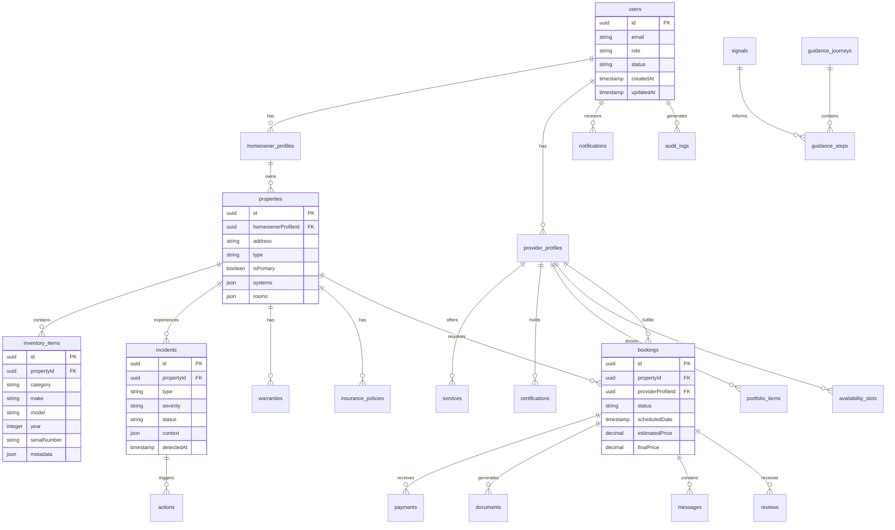
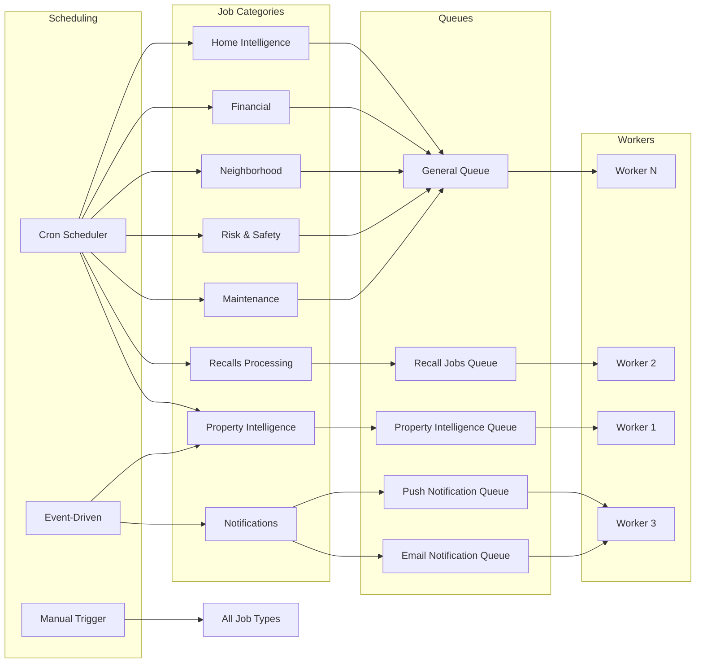
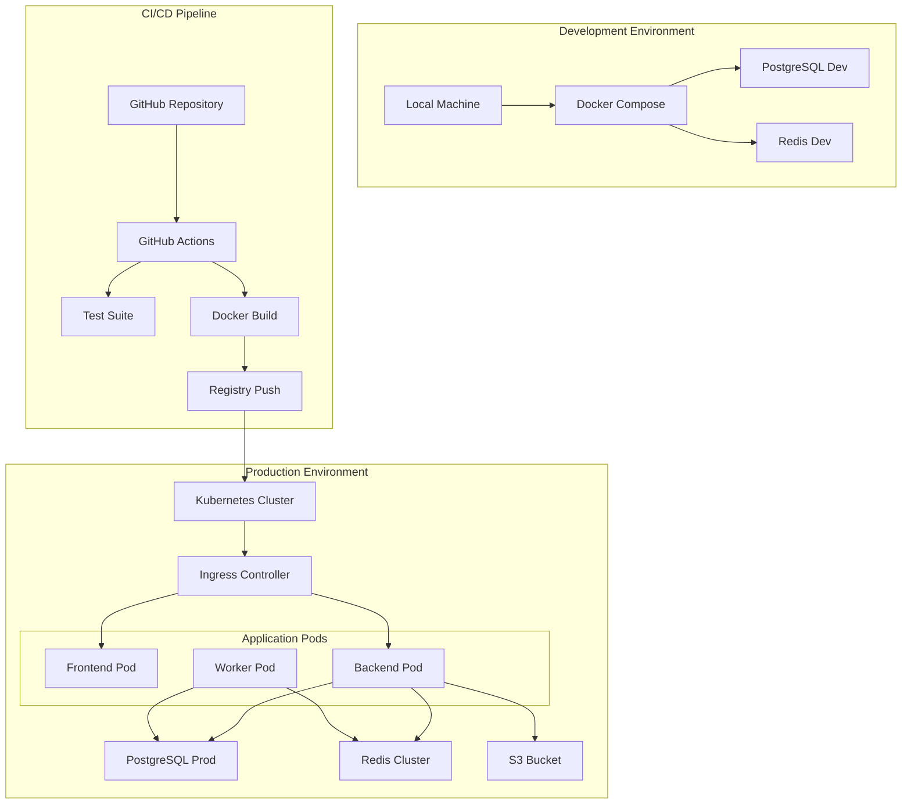

# ContractToCozy Architecture Diagram

## System Overview
ContractToCozy is a comprehensive home management platform connecting homeowners with service providers through data-driven insights, financial analysis, and marketplace functionality.

## High-Level Architecture

```mermaid
graph TB
    subgraph "External Services"
        GEMINI[Google Gemini AI]
        STRIPE[Stripe Payments]
        AWS_S3[AWS S3 Storage]
        CPSC[CPSC API - Recalls]
        FRED[FRED API - Mortgage Rates]
        TICKET[Ticketmaster API]
    end

    subgraph "Frontend Layer"
        NEXT[Next.js 14 App]
        REACT[React 18]
        TWCSS[Tailwind CSS]
        RADIX[Radix UI]
        RQ[React Query]
        SENTRY_F[Sentry]
        
        NEXT --> REACT
        NEXT --> TWCSS
        NEXT --> RADIX
        NEXT --> RQ
        NEXT --> SENTRY_F
    end

    subgraph "Backend Layer"
        EXPRESS[Express.js]
        PRISMA[Prisma ORM]
        BULLMQ[BullMQ]
        REDIS[Redis]
        
        subgraph "API Controllers"
            AUTH[Auth Controller]
            PROP[Property Controller]
            TOOLS[Tools Controller]
            GUID[Guidance Controller]
            ORCH[Orchestration Controller]
            MKT[Marketplace Controller]
        end
        
        subgraph "Service Layer"
            AUTH_S[Auth Service]
            PROP_S[Property Service]
            INV_S[Inventory Service]
            RISK_S[Risk Service]
            FIN_S[Financial Service]
            GUID_S[Guidance Service]
            INC_S[Incident Service]
            AI_S[AI Service]
            MKT_S[Marketplace Service]
            NOTIF_S[Notification Service]
        end
        
        EXPRESS --> AUTH
        EXPRESS --> PROP
        EXPRESS --> TOOLS
        EXPRESS --> GUID
        EXPRESS --> ORCH
        EXPRESS --> MKT
        
        AUTH --> AUTH_S
        PROP --> PROP_S
        TOOLS --> FIN_S
        GUID --> GUID_S
        ORCH --> INC_S
        MKT --> MKT_S
    end

    subgraph "Data Layer"
        POSTGRES[(PostgreSQL)]
        REDIS_CACHE[(Redis Cache)]
        
        subgraph "Database Schema"
            USERS[Users Table]
            PROFILES[Profiles Table]
            PROPERTIES[Properties Table]
            INVENTORY[Inventory Table]
            BOOKINGS[Bookings Table]
            PAYMENTS[Payments Table]
            WARRANTIES[Warranties Table]
            INSURANCE[Insurance Table]
            INCIDENTS[Incidents Table]
            SIGNALS[Signals Table]
            GUIDANCE[Guidance Table]
            DOCUMENTS[Documents Table]
            AUDIT[Audit Logs Table]
        end
        
        POSTGRES --> USERS
        POSTGRES --> PROFILES
        POSTGRES --> PROPERTIES
        POSTGRES --> INVENTORY
        POSTGRES --> BOOKINGS
        POSTGRES --> PAYMENTS
        POSTGRES --> WARRANTIES
        POSTGRES --> INSURANCE
        POSTGRES --> INCIDENTS
        POSTGRES --> SIGNALS
        POSTGRES --> GUIDANCE
        POSTGRES --> DOCUMENTS
        POSTGRES --> AUDIT
    end

    subgraph "Background Workers"
        WORKER[Worker Process]
        
        subgraph "Job Handlers"
            PROP_INT[Property Intelligence]
            RECALLS[Recall Processing]
            NOTIF_J[Notification Jobs]
            MAINT[Maintenance Tasks]
            RISK_J[Risk & Safety Jobs]
            NEIGH[Neighborhood Jobs]
            FIN_J[Financial Jobs]
            HOME_INT[Home Intelligence]
        end
        
        WORKER --> PROP_INT
        WORKER --> RECALLS
        WORKER --> NOTIF_J
        WORKER --> MAINT
        WORKER --> RISK_J
        WORKER --> NEIGH
        WORKER --> FIN_J
        WORKER --> HOME_INT
    end

    subgraph "Infrastructure"
        DOCKER[Docker]
        K8S[Kubernetes k3s]
        GH_ACTIONS[GitHub Actions]
        SENTRY_I[Sentry Infrastructure]
        PROM[Prometheus Metrics]
    end

    %% Connections
    NEXT -- HTTP/REST --> EXPRESS
    EXPRESS -- Prisma Client --> PRISMA
    PRISMA -- SQL --> POSTGRES
    BULLMQ -- Job Queues --> REDIS
    WORKER -- Job Processing --> BULLMQ
    
    %% External Service Connections
    AI_S -- API Calls --> GEMINI
    MKT_S -- Payment Processing --> STRIPE
    PROP_S -- File Storage --> AWS_S3
    RECALLS -- Data Fetch --> CPSC
    FIN_J -- Rate Data --> FRED
    NEIGH -- Event Data --> TICKET
    
    %% Internal Connections
    AUTH_S -- Session Cache --> REDIS_CACHE
    NOTIF_S -- Queue Jobs --> BULLMQ
    INC_S -- Event Detection --> SIGNALS
    GUID_S -- Recommendations --> GUIDANCE
    
    %% Data Flow
    PROP_S -- Manages --> PROPERTIES
    INV_S -- Manages --> INVENTORY
    RISK_S -- Analyzes --> INCIDENTS
    FIN_S -- Calculates --> PAYMENTS
    MKT_S -- Processes --> BOOKINGS
```



## Detailed Component Architecture

### 1. Frontend Architecture

```mermaid
graph LR
    subgraph "Next.js App Router"
        AUTH_ROUTE[(auth)/]
        DASH_ROUTE[(dashboard)/]
        ONBOARD[onboarding/]
        PROVIDERS[providers/]
        REPORTS[reports/]
        KNOWLEDGE[knowledge/]
        VAULT[vault/]
    end
    
    subgraph "Component Library"
        DASH_COMP[dashboard/]
        TOOLS_COMP[tools/]
        GUIDANCE_COMP[guidance/]
        ORCH_COMP[orchestration/]
        MKT_COMP[marketplace/]
        REPORTS_COMP[reports/]
        VAULT_COMP[vault/]
    end
    
    subgraph "Feature Modules"
        PROP_FEAT[Property Management]
        FIN_FEAT[Financial Analysis]
        RISK_FEAT[Risk Assessment]
        GUID_FEAT[Guidance Engine]
        MKT_FEAT[Marketplace]
        DOC_FEAT[Document Management]
        NOTIF_FEAT[Notifications]
    end
    
    subgraph "State Management"
        RQ_STATE[React Query Cache]
        AUTH_STATE[Auth Context]
        PROP_STATE[Property Context]
        TOOL_STATE[Tool State]
    end
    
    AUTH_ROUTE --> AUTH_STATE
    DASH_ROUTE --> DASH_COMP
    ONBOARD --> PROP_FEAT
    PROVIDERS --> MKT_FEAT
    REPORTS --> REPORTS_COMP
    KNOWLEDGE --> GUID_FEAT
    VAULT --> DOC_FEAT
    
    DASH_COMP --> PROP_STATE
    TOOLS_COMP --> TOOL_STATE
    GUIDANCE_COMP --> GUID_FEAT
    ORCH_COMP --> PROP_FEAT
    MKT_COMP --> MKT_FEAT
```

### 2. Backend Service Architecture

```mermaid
graph TB
    subgraph "Core Services"
        AUTH_SERVICE[Authentication Service]
        PROP_SERVICE[Property Service]
        INV_SERVICE[Inventory Service]
        RISK_SERVICE[Risk Assessment Service]
        FIN_SERVICE[Financial Analysis Service]
        GUID_SERVICE[Guidance Service]
        INC_SERVICE[Incident Service]
        AI_SERVICE[AI Integration Service]
        MKT_SERVICE[Marketplace Service]
        NOTIF_SERVICE[Notification Service]
        DOC_SERVICE[Document Service]
        ANALYTICS_SERVICE[Analytics Service]
    end
    
    subgraph "Data Access Layer"
        USER_REPO[User Repository]
        PROP_REPO[Property Repository]
        INV_REPO[Inventory Repository]
        BOOKING_REPO[Booking Repository]
        PAYMENT_REPO[Payment Repository]
        INCIDENT_REPO[Incident Repository]
        SIGNAL_REPO[Signal Repository]
        GUIDANCE_REPO[Guidance Repository]
    end
    
    subgraph "External Integrations"
        GEMINI_INT[Gemini Integration]
        STRIPE_INT[Stripe Integration]
        S3_INT[S3 Integration]
        OCR_INT[OCR Integration]
        API_INT[External APIs]
    end
    
    AUTH_SERVICE --> USER_REPO
    PROP_SERVICE --> PROP_REPO
    INV_SERVICE --> INV_REPO
    RISK_SERVICE --> INCIDENT_REPO
    FIN_SERVICE --> PAYMENT_REPO
    GUID_SERVICE --> GUIDANCE_REPO
    INC_SERVICE --> SIGNAL_REPO
    MKT_SERVICE --> BOOKING_REPO
    
    AI_SERVICE --> GEMINI_INT
    MKT_SERVICE --> STRIPE_INT
    DOC_SERVICE --> S3_INT
    INV_SERVICE --> OCR_INT
    RISK_SERVICE --> API_INT
```



### 3. Data Flow Architecture

```mermaid
graph TD
    subgraph "User Interaction Flow"
        START[User Action]
        API_CALL[API Request]
        SERVICE[Service Processing]
        DB_OPS[Database Operations]
        RESPONSE[API Response]
        UI_UPDATE[UI Update]
        
        START --> API_CALL
        API_CALL --> SERVICE
        SERVICE --> DB_OPS
        DB_OPS --> RESPONSE
        RESPONSE --> UI_UPDATE
    end
    
    subgraph "Background Processing Flow"
        TRIGGER[Event Trigger]
        QUEUE[Job Queue]
        WORKER_HANDLER[Worker Handler]
        DB_UPDATE[Database Update]
        NOTIFICATION[Notification]
        
        TRIGGER --> QUEUE
        QUEUE --> WORKER_HANDLER
        WORKER_HANDLER --> DB_UPDATE
        DB_UPDATE --> NOTIFICATION
    end
    
    subgraph "AI Analysis Flow"
        DOC_UPLOAD[Document Upload]
        OCR_PROC[OCR Processing]
        AI_ANALYSIS[AI Analysis]
        DATA_EXTRACT[Data Extraction]
        DB_STORE[Database Storage]
        RECOMMEND[Recommendation]
        
        DOC_UPLOAD --> OCR_PROC
        OCR_PROC --> AI_ANALYSIS
        AI_ANALYSIS --> DATA_EXTRACT
        DATA_EXTRACT --> DB_STORE
        DB_STORE --> RECOMMEND
    end
    
    subgraph "Incident Response Flow"
        EVENT[Event Detection]
        EVAL[Incident Evaluation]
        ACTION_REC[Action Recommendation]
        NOTIFY[User Notification]
        EXECUTE[Action Execution]
        TRACK[Completion Tracking]
        
        EVENT --> EVAL
        EVAL --> ACTION_REC
        ACTION_REC --> NOTIFY
        NOTIFY --> EXECUTE
        EXECUTE --> TRACK
    end
```



### 4. Database Schema Relationships



### 5. Job Processing Architecture



## Key Architectural Patterns

### 1. Layered Architecture
```
┌─────────────────────────────────┐
│        Presentation Layer        │
│   (Next.js Frontend, API Routes) │
├─────────────────────────────────┤
│        Application Layer         │
│   (Controllers, Services, Logic) │
├─────────────────────────────────┤
│        Domain Layer              │
│   (Business Entities, Rules)    │
├─────────────────────────────────┤
│        Infrastructure Layer      │
│   (Database, Cache, External APIs)│
└─────────────────────────────────┘
```

### 2. Event-Driven Processing
```
┌─────────┐    ┌─────────┐    ┌─────────┐    ┌─────────┐
│  Event  │───▶│  Queue  │───▶│ Worker  │───▶│ Result  │
│ Trigger │    │ (Redis) │    │ Handler │    │ Storage │
└─────────┘    └─────────┘    └─────────┘    └─────────┘
```

### 3. Guidance Engine Pattern
```
┌────────────┐    ┌────────────┐    ┌────────────┐    ┌────────────┐
│   Signal   │───▶│  Journey   │───▶│   Step    │───▶│  Action    │
│ Detection  │    │ Definition │    │ Execution │    │ Completion │
└─────────��──┘    └────────────┘    └────────────┘    └────────────┘
```

### 4. Security Architecture
```
┌─────────────────────────────────┐
│        API Gateway Layer         │
│   (Rate Limiting, CORS, Helmet)  │
├─────────────────────────────────┤
│        Authentication Layer      │
│   (JWT, MFA, Session Management)  │
├─────────────────────────────────┤
│        Authorization Layer       │
│   (RBAC, Permission Checks)      │
├─────────────────────────────────┤
│        Validation Layer          │
│   (Input Sanitization, Zod)      │
└─────────────────────────────────┘
```

## Technology Stack Summary

| Layer | Technology | Purpose |
|-------|------------|---------|
| **Frontend** | Next.js 14, React 18, TypeScript | Modern web application |
| **Styling** | Tailwind CSS, Radix UI | Component library & design system |
| **State Management** | React Query, Context API | Data fetching & state |
| **Backend Framework** | Express.js, TypeScript | API server |
| **ORM** | Prisma | Database access & migrations |
| **Database** | PostgreSQL 15 | Primary data store |
| **Cache/Queue** | Redis 7, BullMQ | Caching & job processing |
| **AI Integration** | Google Gemini | Document analysis & recommendations |
| **Payments** | Stripe | Payment processing |
| **Storage** | AWS S3 | File/document storage |
| **Monitoring** | Sentry, Prometheus | Error tracking & metrics |
| **Infrastructure** | Docker, Kubernetes | Containerization & orchestration |
| **CI/CD** | GitHub Actions | Automated deployment |

## Deployment Architecture



## Key Design Decisions

1. **Monorepo Structure**: Single repository for frontend, backend, and workers
2. **TypeScript Everywhere**: Full type safety across all layers
3. **Prisma ORM**: Type-safe database access with migrations
4. **BullMQ for Background Jobs**: Reliable job processing with Redis
5. **Next.js App Router**: Modern React framework with SSR capabilities
6. **Redis for Caching**: Performance optimization for frequent queries
7. **Docker/Kubernetes**: Containerized deployment for scalability
8. **Sentry for Observability**: Comprehensive error tracking and monitoring
9. **Google Gemini Integration**: AI-powered document analysis
10. **Stripe Connect**: Marketplace payment processing

This architecture provides a scalable, maintainable foundation for the ContractToCozy platform, supporting both immediate needs and future growth.