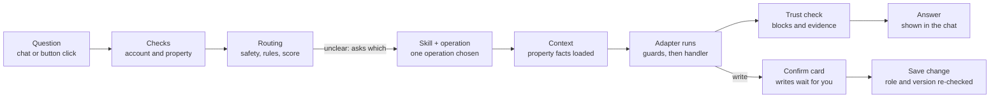

# How Ask Cozy Works: Orchestrator, Adapters, Skills and Friends

An easy-to-read guide to the main moving parts behind Ask Cozy. It was written from reading the code under `apps/backend/src/services/ask/`, `apps/backend/src/services/skills/` and related folders (2026-10-02). It describes how the code is structured, not how it behaves in production.

## The big picture

Ask Cozy is the chat-style front door to a home's record. You type a question or a command, and the backend picks one pre-built, tested "operation" to answer it, instead of letting an AI improvise.

Think of a hotel front desk:

- **The orchestrator** is the concierge. It listens, decides who can help, checks you are allowed to ask, and hands back the answer.
- **Operations** are the individual services on the menu, such as "what maintenance is pending?" or "complete this task". There are 118 of them, grouped into 45 Skills (see the catalog below).
- **Skills** are departments (Maintenance, Coverage, Savings). Each department owns a group of operations and the rules for them.
- **Adapters** (called capability handlers in the code) are the staff who actually do the work by calling the real home-record services.
- **Context providers** fetch the facts staff need first, such as which property this is.
- **The trust validator** is the manager who checks the answer before it is shown.

The main design rule: answers come from deterministic code reading the home record. An AI model is the last resort, not the first step.

## Life of a question

A write takes the extra branch: it stops at a confirm card and changes nothing until the user taps confirm. If routing cannot choose between operations, Ask shows choices instead of guessing.

## The orchestrator

The orchestrator runs one "execution" per question, from receiving it to saving the answer. Its main entry point is `createAskExecution` in `services/ask/execution/createAskExecution.ts`.

`askOrchestrator.service.ts` is now only a thin facade. It once held about 20,000 lines; the logic was split into handlers and lifecycle files, and the facade just imports and re-exports them. Do not add logic there. See `docs/architecture/ASK_ORCHESTRATOR_DECOMPOSITION_REVIEW.md`.

What the orchestrator does, in order:

1. **Checks the account and property.** The user must be an eligible homeowner account with access to the property.
2. **Handles retries.** A repeated `clientRequestId` returns the earlier execution instead of running twice.
3. **Saves the question** as an `AskExecution` row inside an `AskSession`, with status `RECEIVED`, then `ROUTING`/`RUNNING`.
4. **Resolves follow-ups.** A bare "now complete it" is rewritten using the previous typed result so routing can understand it.
5. **Routes the question** (see the routing cascade below) and picks one operation and its Skill.
6. **Executes the operation** through `executeOperation`, or returns a clarification question if routing was ambiguous.
7. **Validates and saves the answer**, records events and metrics, and tries to capture any home facts you mentioned in passing.

### The routing cascade

Routing (`askRoutingCascade.ts`) tries the cheapest and safest method first and only falls through when it is not confident:

| Stage | What it does |
| --- | --- |
| SAFETY | Fixed rules catch emergencies, unsafe requests and out-of-scope questions. This stage always wins. |
| DETERMINISTIC | Pattern rules map clear phrasings straight to an operation. |
| LOCAL_CLASSIFIER | A local semantic index scores candidate operations. High-risk or write operations need a high-confidence match. |
| CLARIFICATION | If two operations are close, Ask asks "which did you mean?" with up to three choices. |
| REMOTE_FALLBACK | Only when nothing matched, the request falls to general guidance. |

A click on a button the app itself showed (a "declared item action") skips guessing: it names its operation, and that choice is authoritative.

## Adapters (capability handlers)

An adapter is the piece that connects an operation to the real code that does the work. Every operation declares an `adapterKey`; for example `MAINTENANCE_STATUS` uses `maintenance.status`.

The registry lives in `services/ask/capabilityHandlerRegistry.ts`. Handlers register themselves by key when the app starts, one file per capability family in `services/ask/handlers/*.handler.ts` (maintenance, coverage, inventory, quotes, refinance and so on).

Before any handler runs, `capabilityInvoke` applies the same guard chain to every caller:

1. Operational kill-switches: Ask as a whole, the operation, its Skill, its adapter, and remote generation can each be turned off.
2. Skill health: the Skill must be enabled and its dependencies available.
3. Property scope: operations that need a property refuse to run without one.
4. Role check: the user's household role (Viewer, Contributor, Owner) must meet the operation's floor. Reads usually need Viewer; writes need more.
5. Handler lookup: a missing handler raises a typed error, never a silent crash.

Startup validation fails if two handlers claim the same key or an operation has no handler. A broken wiring is caught at boot, not by a homeowner.

There are two other adapter families that are easy to confuse with this one:

- **Skill adapter definitions** (`services/skills/adapters/`) describe each adapter's contract: which operations it may serve, its timeout, whether it is a read or a write preparation, and whether retries are safe.
- **Envelope adapters** (`services/intelligenceEnvelope/adapters/`) convert different intelligence producers (signals, recommendations, radar) into one common shape. They serve the Home Actions and intelligence side more than Ask itself.

## Operations and Skills

### Operations

An operation is one registered thing Ask can do. `askOperationRegistry.ts` defines each one with:

- an ID such as `MAINTENANCE_TASK_COMPLETE`;
- a family: record query, status summary, decision analysis, command, monitor and so on;
- whether it needs a property;
- an execution mode: `DETERMINISTIC` (plain code) or `REMOTE_GENERATION` (AI-written);
- a role floor, the minimum household role allowed;
- its adapter key, and the presentation blocks it may return (summary, grouped list, evidence, boundary and so on);
- semantic metadata used for routing: example phrasings, supported jobs, materiality, and whether it reads or writes.

### Skills

A Skill groups related operations into a homeowner-facing capability, such as Maintenance, Coverage or Savings. Each Skill is a package under `services/skills/<name>/` with:

- `SKILL.md`: plain-language rules on when to select it and when not to;
- `skill.manifest.ts`: its operations, adapters, required and optional context providers, risk policy and context budget;
- `skill.evaluation.ts`: test fixtures for routing, ambiguity, policy and degraded modes.

Example: the Maintenance Skill owns six operations (status, create, complete, update, forecast, deadline monitor). It declares which adapters serve them, which context it needs, and that it must not be chosen for repair-or-replace decisions, which belong to another Skill.

Skills add governance on top of routing:

- **Skill routing** (`skillRouter.ts`) maps a question to a Skill first, then to an operation inside it. If two Skills tie, Ask asks for clarification.
- **Risk policy** records whether a Skill reads or writes, how material it is (money, coverage, safety) and whether its actions can be undone.
- **Consumers**: the same Skill can serve Ask, Home Actions, the Concierge home, proactive nudges and notification continuations, each with its own allowed operations.
- **Handoffs** (`skillHandoff.ts`): after an answer, a Skill can suggest a related next question. A handoff never runs anything itself. It drafts a question that goes back through normal routing and permission checks.
- **Execution binding**: each execution stores which Skill version handled it. If that version changes before you confirm a write, the pending confirmation expires.

New Skills are created with `npm run skill:create -- --spec <file>`, which scaffolds the package and validates it. No change to the core router is needed. See `apps/backend/src/services/skills/README.md`.

## Catalog: Skills, Operations and Adapters

This catalog was generated from the live registries (`ASK_OPERATION_DEFINITIONS` and `SKILL_DEFINITIONS`) on 2026-10-02: **118 operations**, **45 Skills** and **118 adapters**. Each operation has exactly one adapter of its own, so the adapter list is shown next to its operation. If you add or rename one, regenerate this section rather than editing it by hand.

How to read the tables:

- **Kind**: READ looks something up, WRITE changes the record (the registry marks it as a command; most go through a confirm card, but this catalog does not check each one), MONITOR sets up a watch or reminder, BOUNDARY is a safety response.
- **Min role**: the lowest household role allowed (Viewer < Contributor < Owner). A dash means no property is involved.
- **Adapter**: the key that `capabilityInvoke` uses to find the handler.

### Skills (45)

| Skill | ID | Domain | Operations | What it covers |
| --- | --- | --- | --- | --- |
| Maintenance | `maintenance` | Home care | 6 | Understand, create, complete, update, and monitor home maintenance work, and see predicted upcoming maintenance for verified home systems. |
| Repair or Replace | `repair-replace` | Home care | 11 | Evaluate whether to repair or replace a recorded home system and continue its governed decision journey. |
| Refinance | `refinance` | Home finance | 2 | Evaluate a recorded mortgage refinance opportunity and manage a governed mortgage-rate monitor. |
| Property Record | `property-record` | Home intelligence | 11 | Summarize the selected home and find recorded appliances, systems, and inventory details. |
| Capital Planning | `capital-planning` | Home care | 1 | Plan major home expenses, reserve needs, and replacement timing from recorded home data. |
| Coverage | `coverage` | Home protection | 2 | Review recorded warranty and insurance coverage gaps and evidence readiness, and check how your current insurance policy compares to alternative quotes or terms. |
| Household | `household` | Household | 1 | Manage governed household invitations and explain membership access boundaries. |
| Ownership Cost | `ownership-cost` | Home finance | 1 | Summarize monthly and annual home ownership costs using recorded household data. |
| Property Tax | `property-tax` | Home finance | 1 | Assess property-tax appeal readiness from recorded assessment, evidence, and deadline context. |
| Quote Comparison | `quote-comparison` | Home projects | 2 | Create a governed quote workspace and compare recorded bids, estimates, and proposals. |
| Renovation | `renovation` | Home projects | 1 | Review renovation and permit readiness, recorded blockers, and required next steps. |
| Savings | `savings` | Home finance | 1 | Find recorded savings, rebate, benefit, and cost-reduction opportunities for the selected home. |
| Sell, Hold, or Rent | `sell-hold-rent` | Home transactions | 1 | Compare governed sell, hold, and rent scenarios from recorded property and financial context. |
| Break-Even | `break-even` | Home finance | 1 | Show when owning this home breaks even, as projected appreciation catches up with cumulative ownership costs, with a conservative-to-optimistic range. |
| Around Your Home | `neighborhood-change-radar` | Home protection | 1 | Review reviewed local changes around this home (planning, development, zoning, infrastructure, land use, flood maps and schools) with their possible relevance and matched geography. |
| Home Risk Replay | `home-risk-replay` | Home protection | 1 | Review this home's past hazard exposure and long-term hazard context from reviewed sources, with any effect the household recorded. |
| Status Board | `status-board` | Home care | 1 | Review the condition of this home's recorded appliances and systems: what needs action, what to monitor, and what is in good shape, with why. |
| Home Habit Coach | `home-habit-coach` | Home care | 1 | Review the small household habits the Home Habit Coach suggests for this home, ranked, with why each was suggested. |
| Home Continuity Plan | `home-digital-will` | Home intelligence | 1 | Review this home's continuity plan: how ready it is to hand off, what each section holds and who the trusted contacts are. |
| Plant Advisor care outlook | `plant-advisor` | Home care | 1 | Review weather-aware care for this home's tracked plants and garden zones: what to change now or soon and why. |
| Negotiation Shield | `negotiation-shield` | Home finance | 1 | Review this home's Negotiation Shield cases: the quote, premium, claim, urgency and inspection negotiations prepared so far and where each one stands. |
| Home Upgrade Planner | `home-digital-twin` | Home care | 1 | Review the upgrade options saved in this home's Home Upgrade Planner, grouped by system, with estimated cost, savings, payback and any decision recorded. |
| DIY Project Center | `diy` | Home care | 1 | Review this home's active DIY projects in planning or in progress, with how many required steps are done. |
| Project Tracker | `project-tracker` | Home projects | 1 | Review this home's contractor projects in Project Tracker: which are active, completed or cancelled, with contract, paid and remaining amounts. |
| Service Price Radar | `service-price-radar` | Home projects | 1 | Review the quote checks run in Service Price Radar for this home: each quoted price against the expected local range, with the verdict. |
| Home Timeline | `home-timeline` | Home care | 1 | Review this home's recorded history on the Home Timeline: repairs, improvements, purchases, inspections and claims, with how verified each event is. |
| Material Specs | `material-specs` | Home care | 1 | Look up the paint colours, tile, flooring, fixtures and suppliers recorded in this home's Material Specs. |
| Property Brief | `property-brief` | Home care | 1 | Review this home's saved Property Briefs: each brief's purpose, snapshot date and sections, and which share links are still live. |
| Guidance Overview | `guidance-overview` | Home care | 4 | Review the guided journeys under way on Guidance Overview: each issue's steps done, the next step and anything blocking it. |
| HOA Compliance | `hoa-compliance` | Home care | 1 | Review this home's HOA records: the association and dues, approval requests with the association's recorded decision, and violations. |
| Price Finalization | `price-finalization` | Home care | 1 | Review the prices and terms recorded in Price Finalization: accepted price against the quote, agreed terms, and whether each was finalized or booked. |
| Do-Nothing Simulator | `do-nothing-simulator` | Home care | 1 | Review the latest Do-Nothing Simulator run: what putting off home upkeep could cost, the risk drivers, the biggest avoidable losses and the saved scenarios. |
| Warranties | `warranties` | Home care | 1 | Review the warranties recorded for this home: provider, category and dates, whether each is active, expiring within 60 days or expired, and the coverage text as recorded, without deciding what is covered. |
| Appliance Oracle | `appliance-oracle` | Home care | 1 | See which appliances and systems are nearing the end of their expected life, with failure risk by age and a replacement estimate. |
| Budget Planner | `budget-planner` | Home care | 1 | See how much to budget for home upkeep: a yearly total, a monthly average, a month-by-month forecast and a split by category. |
| Seller Preparation | `seller-preparation` | Home transactions | 1 | Navigate seller readiness and major home-sale preparation using recorded home context. |
| Seller Prep Checklist | `seller-prep` | Home transactions | 2 | Review the governed seller-prep checklist -- open repairs, records, and presentation work recommended before listing this home for sale -- and record a waive/pursue/reopen decision on an exact item. |
| Buyer & Closing | `buyer-closing` | Home transactions | 18 | Track and progress an active home purchase from contract through closing — deadlines, documents, inspection findings, financing, title/escrow, walkthrough, and closing-day readiness. |
| Claims | `incident-claim` | Home protection | 4 | Review the status of filed insurance and incident claims for this home. |
| Home Operations | `home-operations` | Home intelligence | 3 | Review the canonical ranked feed of recommended, scheduled, active, and completed home work. |
| Inspection Findings | `inspection-findings` | Home care | 2 | Review canonical inspection findings and explicitly accept, dismiss, or resolve an exact finding. |
| Document Review and Promotion | `document-promotion` | Home intelligence | 2 | Review document-derived candidates and confirm or reject an exact candidate through its canonical promotion adapter. |
| Documents | `documents` | Home intelligence | 1 | Look up uploaded documents on file for this home -- inspection reports, estimates, invoices, contracts, permits, and other records -- grouped by type and verification status. |
| Query Intelligence Envelope | `query-envelope` | Home intelligence | 1 | Read a bounded, normalized view of registered intelligence produced for an authorized property. |
| Home Event Radar | `home-event-radar` | Home protection | 6 | Read the canonical feed of monitored home events (weather, air quality, disaster, utility, tax, and insurance signals matched to this property) and their full detail. |

### Operations and adapters, grouped by Skill

#### Maintenance (`maintenance`)

| Operation | Adapter | Kind | Min role | What it does |
| --- | --- | --- | --- | --- |
| `MAINTENANCE_STATUS` | `maintenance.status` | READ | Viewer | Review pending and completed maintenance |
| `MAINTENANCE_TASK_CREATE` | `maintenance.create` | WRITE | Contributor | Create a maintenance task |
| `MAINTENANCE_TASK_COMPLETE` | `maintenance.complete` | WRITE | Contributor | Mark maintenance work complete |
| `MAINTENANCE_TASK_UPDATE` | `maintenance.update` | WRITE | Contributor | Change a maintenance task |
| `MAINTENANCE_FORECAST` | `maintenance.forecast` | READ | Viewer | See predicted upcoming maintenance for home systems |
| `HOME_DEADLINE_MONITOR` | `home-deadline.monitor` | MONITOR | Contributor | Monitor a home deadline or expiration |

#### Repair or Replace (`repair-replace`)

| Operation | Adapter | Kind | Min role | What it does |
| --- | --- | --- | --- | --- |
| `REPLACEMENT_GUIDANCE` | `inventory.replacement` | READ | Viewer | Decide when to repair or replace a home item |
| `HVAC_DECISION_START` | `decision-platform.hvac.start` | READ | Contributor | Start an HVAC repair-or-replace decision |
| `HVAC_DECISION_CONTINUE` | `decision-platform.hvac.continue` | READ | Viewer | Continue an active HVAC repair-or-replace decision |
| `HVAC_SPECIALIST_ENGAGE` | `decision-platform.hvac.specialist-engage` | READ | Contributor | Engage the HVAC Specialist agent on a flagged HVAC repair-or-replace home action |
| `HVAC_DECISION_SCENARIO` | `decision-platform.hvac.scenario` | READ | Contributor | Compare a new HVAC quote or scenario |
| `HVAC_DECISION_ABANDON` | `decision-platform.hvac.abandon` | WRITE | Contributor | Stop an active HVAC decision |
| `HVAC_PREFERENCE_SAVE` | `decision-platform.hvac.preference.save` | WRITE | Contributor | Save an HVAC decision preference |
| `HVAC_PREFERENCE_FORGET` | `decision-platform.hvac.preference.forget` | WRITE | Contributor | Forget a saved HVAC decision preference |
| `HVAC_DECISION_OUTCOME_REPORT` | `decision-platform.hvac.outcome.report` | WRITE | Contributor | Report what happened after an HVAC decision |
| `HVAC_DECISION_OUTCOME_VIEW` | `decision-platform.hvac.outcome.view` | READ | Viewer | Review a recorded HVAC decision outcome |
| `HVAC_DECISION_OUTCOME_UNLINK` | `decision-platform.hvac.outcome.unlink` | WRITE | Contributor | Correct or unlink an HVAC decision outcome |

#### Refinance (`refinance`)

| Operation | Adapter | Kind | Min role | What it does |
| --- | --- | --- | --- | --- |
| `REFINANCE_ANALYSIS` | `refinance.analysis` | READ | Viewer | Evaluate whether refinancing may be worthwhile |
| `REFINANCE_RATE_MONITOR` | `refinance.monitor` | MONITOR | Contributor | Monitor mortgage rates |

#### Property Record (`property-record`)

| Operation | Adapter | Kind | Min role | What it does |
| --- | --- | --- | --- | --- |
| `PROPERTY_SUMMARY` | `property.summary` | READ | Viewer | Review the home record, including missing or incomplete details |
| `INVENTORY_LOOKUP` | `inventory.lookup` | READ | Viewer | Look up appliance, system, or equipment details |
| `HOME_CHANGE_SUMMARY` | `home-change.summary` | READ | Viewer | Review what changed in the home record |
| `INVENTORY_ITEM_CORRECT` | `inventory.item-correct` | WRITE | Contributor | Fix a wrong date recorded on an inventory item |
| `HOME_EVENT_CORRECT` | `home-event.correct` | WRITE | Contributor | Correct the title or date of a recorded home timeline event |
| `HOME_EVENT_VISIBILITY` | `home-event.visibility` | WRITE | Contributor | Change who can see a recorded home timeline event |
| `WARRANTY_CORRECT` | `warranty.correct` | WRITE | Contributor | Fix a wrong provider or date recorded on a warranty you added |
| `ROOM_RENAME` | `room.rename` | WRITE | Contributor | Rename a recorded room |
| `ROOM_CREATE` | `room.create` | WRITE | Contributor | Add a new room to the home record |
| `INVENTORY_ITEM_CREATE` | `inventory.create` | WRITE | Contributor | Add a new item to the home inventory |
| `PROPERTY_CONTEXT_AREA_CAPTURE` | `property-context.area-capture` | WRITE | Contributor | Fill in a missing home record detail for one area of the property summary |

#### Capital Planning (`capital-planning`)

| Operation | Adapter | Kind | Min role | What it does |
| --- | --- | --- | --- | --- |
| `CAPITAL_RESERVE_PLAN` | `capital-reserve.plan` | READ | Viewer | Plan reserves for future home expenses |

#### Coverage (`coverage`)

| Operation | Adapter | Kind | Min role | What it does |
| --- | --- | --- | --- | --- |
| `COVERAGE_GAPS` | `coverage.review` | READ | Viewer | Review insurance and warranty coverage gaps |
| `COVERAGE_COMPARISON_STATUS` | `coverage.comparison-status` | READ | Viewer | Compare my current insurance policy against alternative quotes or terms |

#### Household (`household`)

| Operation | Adapter | Kind | Min role | What it does |
| --- | --- | --- | --- | --- |
| `HOUSEHOLD_INVITATION` | `household.invitation` | WRITE | Owner | Invite a household member |

#### Ownership Cost (`ownership-cost`)

| Operation | Adapter | Kind | Min role | What it does |
| --- | --- | --- | --- | --- |
| `OWNERSHIP_COSTS` | `ownership.costs` | READ | Viewer | Review the cost of owning the home |

#### Property Tax (`property-tax`)

| Operation | Adapter | Kind | Min role | What it does |
| --- | --- | --- | --- | --- |
| `PROPERTY_TAX_APPEAL_READINESS` | `property-tax.appeal-readiness` | READ | Viewer | Review property-tax appeal readiness |

#### Quote Comparison (`quote-comparison`)

| Operation | Adapter | Kind | Min role | What it does |
| --- | --- | --- | --- | --- |
| `QUOTE_COMPARISON_CREATE` | `quote-comparison.create` | WRITE | Contributor | Start a contractor quote comparison |
| `QUOTE_COMPARISON_REVIEW` | `quote-comparison.review` | READ | Viewer | Compare contractor quotes or bids |

#### Renovation (`renovation`)

| Operation | Adapter | Kind | Min role | What it does |
| --- | --- | --- | --- | --- |
| `RENOVATION_PERMIT_READINESS` | `renovation-permit.readiness` | READ | Viewer | Review renovation permit readiness |

#### Savings (`savings`)

| Operation | Adapter | Kind | Min role | What it does |
| --- | --- | --- | --- | --- |
| `SAVINGS_OPPORTUNITIES` | `savings.opportunities` | READ | Viewer | Find ways to lower home costs |

#### Sell, Hold, or Rent (`sell-hold-rent`)

| Operation | Adapter | Kind | Min role | What it does |
| --- | --- | --- | --- | --- |
| `SELL_HOLD_RENT_ANALYSIS` | `sale-case.analysis` | READ | Viewer | Compare selling, holding, or renting the home |

#### Break-Even (`break-even`)

| Operation | Adapter | Kind | Min role | What it does |
| --- | --- | --- | --- | --- |
| `BREAK_EVEN_ANALYSIS` | `break-even.analysis` | READ | Viewer | See when owning this home breaks even, as appreciation catches up with cumulative ownership costs |

#### Around Your Home (`neighborhood-change-radar`)

| Operation | Adapter | Kind | Min role | What it does |
| --- | --- | --- | --- | --- |
| `NEIGHBORHOOD_CHANGE_FEED` | `neighborhood-change.feed` | READ | Viewer | Review reviewed local changes around this home: planning, development, zoning, infrastructure, land use, flood maps and schools |

#### Home Risk Replay (`home-risk-replay`)

| Operation | Adapter | Kind | Min role | What it does |
| --- | --- | --- | --- | --- |
| `PAST_HAZARD_EXPOSURE` | `home-risk-replay.exposure` | READ | Viewer | Review this home's past hazard exposure and long-term hazard context from reviewed sources, with any effect the household recorded |

#### Status Board (`status-board`)

| Operation | Adapter | Kind | Min role | What it does |
| --- | --- | --- | --- | --- |
| `HOME_STATUS_BOARD` | `status-board.read` | READ | Viewer | Review the condition of this home's recorded appliances and systems: what needs action, what to monitor, and what is in good shape |

#### Home Habit Coach (`home-habit-coach`)

| Operation | Adapter | Kind | Min role | What it does |
| --- | --- | --- | --- | --- |
| `HOME_HABITS` | `home-habits.read` | READ | Viewer | Review the small household habits the Home Habit Coach suggests for this home, ranked, with why each was suggested |

#### Home Continuity Plan (`home-digital-will`)

| Operation | Adapter | Kind | Min role | What it does |
| --- | --- | --- | --- | --- |
| `HOME_DIGITAL_WILL` | `home-digital-will.read` | READ | Contributor | Review this home's continuity plan: how ready it is to hand off, what each section holds and who the trusted contacts are |

#### Plant Advisor care outlook (`plant-advisor`)

| Operation | Adapter | Kind | Min role | What it does |
| --- | --- | --- | --- | --- |
| `PLANT_CARE_OUTLOOK` | `plant-advisor.care-outlook` | READ | Viewer | Review weather-aware care for this home's tracked plants and garden zones: what to change now or soon and why |

#### Negotiation Shield (`negotiation-shield`)

| Operation | Adapter | Kind | Min role | What it does |
| --- | --- | --- | --- | --- |
| `NEGOTIATION_SHIELD_CASES` | `negotiation-shield.cases` | READ | Viewer | Review this home's Negotiation Shield cases: the contractor quote, premium, claim settlement and urgency reviews prepared so far and where each one stands |

#### Home Upgrade Planner (`home-digital-twin`)

| Operation | Adapter | Kind | Min role | What it does |
| --- | --- | --- | --- | --- |
| `HOME_UPGRADE_SCENARIOS` | `home-digital-twin.scenarios` | READ | Viewer | Review the upgrade options saved in this home's Home Upgrade Planner, grouped by system, with their estimated cost, savings, payback and any decision recorded |

#### DIY Project Center (`diy`)

| Operation | Adapter | Kind | Min role | What it does |
| --- | --- | --- | --- | --- |
| `DIY_PROJECTS` | `diy.projects` | READ | Viewer | Review this home's active DIY projects in planning or in progress, with how many required steps are done |

#### Project Tracker (`project-tracker`)

| Operation | Adapter | Kind | Min role | What it does |
| --- | --- | --- | --- | --- |
| `PROJECT_TRACKER_PROJECTS` | `project-tracker.projects` | READ | Viewer | Review this home's contractor projects in Project Tracker: which are active, completed or cancelled, with contract, paid and remaining amounts |

#### Service Price Radar (`service-price-radar`)

| Operation | Adapter | Kind | Min role | What it does |
| --- | --- | --- | --- | --- |
| `SERVICE_PRICE_CHECKS` | `service-price-radar.checks` | READ | Owner | Review the quote checks run in Service Price Radar for this home: each quoted price against the expected local range, with the verdict |

#### Home Timeline (`home-timeline`)

| Operation | Adapter | Kind | Min role | What it does |
| --- | --- | --- | --- | --- |
| `HOME_TIMELINE_EVENTS` | `home-timeline.events` | READ | Viewer | Review this home's recorded history on the Home Timeline: repairs, improvements, purchases, inspections and claims, with how verified each event is |

#### Material Specs (`material-specs`)

| Operation | Adapter | Kind | Min role | What it does |
| --- | --- | --- | --- | --- |
| `MATERIAL_SPECS_LIST` | `material-specs.list` | READ | Viewer | Look up the paint colours, tile, flooring, fixtures and suppliers recorded in this home's Material Specs |

#### Property Brief (`property-brief`)

| Operation | Adapter | Kind | Min role | What it does |
| --- | --- | --- | --- | --- |
| `PROPERTY_BRIEFS_LIST` | `property-brief.briefs` | READ | Viewer | Review this home's saved Property Briefs: each brief's purpose, snapshot date and sections, and which share links are still live |

#### Guidance Overview (`guidance-overview`)

| Operation | Adapter | Kind | Min role | What it does |
| --- | --- | --- | --- | --- |
| `GUIDANCE_JOURNEYS_LIST` | `guidance-overview.journeys` | READ | Viewer | Review the guided journeys under way on Guidance Overview: each issue's steps done, the next step and anything blocking it |
| `GUIDANCE_JOURNEY_CONTINUE` | `guidance-overview.continue` | READ | Viewer | See where one guided journey stands: its steps, the current step and why it matters, what blocks it and what has been done |
| `GUIDANCE_STEP_SKIP` | `guidance-overview.step-skip` | WRITE | Contributor | Skip one step of a guided journey after confirmation, when the step's policy allows it |
| `GUIDANCE_JOURNEY_DISMISS` | `guidance-overview.journey-dismiss` | WRITE | Contributor | Dismiss a guided journey you do not want to pursue, after confirmation |

#### HOA Compliance (`hoa-compliance`)

| Operation | Adapter | Kind | Min role | What it does |
| --- | --- | --- | --- | --- |
| `HOA_COMPLIANCE_STATUS` | `hoa-compliance.status` | READ | Viewer | Review this home's HOA records: the association and dues, approval requests with the association's recorded decision, and violations with cure deadlines and fines |

#### Price Finalization (`price-finalization`)

| Operation | Adapter | Kind | Min role | What it does |
| --- | --- | --- | --- | --- |
| `PRICE_FINALIZATIONS_LIST` | `price-finalization.records` | READ | Owner | Review the prices and terms recorded in Price Finalization: each vendor's accepted price against the quote, the agreed scope, payment, warranty and timeline, and whether it was finalized or booked |

#### Do-Nothing Simulator (`do-nothing-simulator`)

| Operation | Adapter | Kind | Min role | What it does |
| --- | --- | --- | --- | --- |
| `DO_NOTHING_SIMULATION` | `do-nothing-simulator.latest` | READ | Owner | Review the latest Do-Nothing Simulator run: what putting off home upkeep for months could cost, the risk drivers, the biggest avoidable losses and the saved scenarios |

#### Warranties (`warranties`)

| Operation | Adapter | Kind | Min role | What it does |
| --- | --- | --- | --- | --- |
| `WARRANTY_LOOKUP` | `warranty.lookup` | READ | Viewer | Review the warranties recorded for this home: provider, category and dates, whether each is active, expiring within 60 days or expired, and the coverage text as recorded, without deciding what is covered |

#### Appliance Oracle (`appliance-oracle`)

| Operation | Adapter | Kind | Min role | What it does |
| --- | --- | --- | --- | --- |
| `APPLIANCE_FAILURE_RISK` | `appliance-oracle.risk` | READ | Owner | See which appliances and systems are nearing the end of their expected life, with failure risk by age, an estimated failure date and a replacement cost estimate |

#### Budget Planner (`budget-planner`)

| Operation | Adapter | Kind | Min role | What it does |
| --- | --- | --- | --- | --- |
| `MAINTENANCE_BUDGET_FORECAST` | `budget-planner.forecast` | READ | Owner | See how much to budget for home upkeep: a yearly total, a monthly average, a month-by-month forecast and a split by category |

#### Seller Preparation (`seller-preparation`)

| Operation | Adapter | Kind | Min role | What it does |
| --- | --- | --- | --- | --- |
| `MAJOR_EVENT_ENTRY` | `major-event.entry` | WRITE | Viewer | Prepare for a major home event |

#### Seller Prep Checklist (`seller-prep`)

| Operation | Adapter | Kind | Min role | What it does |
| --- | --- | --- | --- | --- |
| `SELLER_PREP_CHECKLIST` | `seller-prep.checklist` | READ | Viewer | Review the seller-prep checklist for selling this home |
| `SELLER_PREP_ITEM_DECISION` | `seller-prep.item-decision` | WRITE | Contributor | Waive, pursue, reopen, or unpursue a seller-prep checklist item |

#### Buyer & Closing (`buyer-closing`)

| Operation | Adapter | Kind | Min role | What it does |
| --- | --- | --- | --- | --- |
| `BUYER_PLAN_STATUS` | `buyer.plan.status` | READ | Viewer | Review the Buyer Plan status and next closing action |
| `BUYER_DEADLINES` | `buyer.deadlines` | READ | Viewer | Review upcoming deadlines and closing blockers |
| `BUYER_DOCUMENT_READINESS` | `buyer.document-readiness` | READ | Viewer | Review which transaction documents are missing or unverified before closing |
| `BUYER_INSPECTION_REVIEW` | `buyer.inspection-review` | READ | Viewer | Review inspection findings that still need a decision before closing |
| `BUYER_TASK_COMPLETE` | `buyer.task.complete` | WRITE | Contributor | Check off a closing checklist item |
| `BUYER_TASK_CREATE` | `buyer.task.create` | WRITE | Contributor | Add a custom task to the closing checklist |
| `BUYER_TASK_UPDATE` | `buyer.task.update` | WRITE | Contributor | Reschedule or reassign a closing checklist item |
| `BUYER_MOVE_STATUS` | `buyer.move-status` | READ | Viewer | Review move-in progress for this purchase |
| `BUYER_FINANCING_READINESS` | `buyer.financing-readiness` | READ | Viewer | Review purchase-loan appraisal and underwriting readiness before closing |
| `BUYER_TITLE_ESCROW_READINESS` | `buyer.title-escrow-readiness` | READ | Viewer | Review title, escrow, survey, and HOA readiness before closing |
| `BUYER_WALKTHROUGH_READINESS` | `buyer.walkthrough-readiness` | READ | Viewer | Prepare or review the final walkthrough checklist |
| `BUYER_DISCLOSURE_FUNDS_READINESS` | `buyer.disclosure-funds-readiness` | READ | Viewer | Review Closing Disclosure changes and funds readiness |
| `BUYER_CLOSING_DAY_READINESS` | `buyer.closing-day-readiness` | READ | Viewer | Prepare the closing-day appointment, funds, and access checklist |
| `BUYER_CONTRACT_TIMELINE` | `buyer.contract-timeline` | READ | Viewer | Confirm accepted-contract dates, terms, and contingency deadlines |
| `BUYER_NEGOTIATION_READINESS` | `buyer.negotiation-readiness` | READ | Viewer | Organize inspection negotiation inputs for the agent or seller |
| `BUYER_COST_READINESS` | `buyer.cost-readiness` | READ | Viewer | Explain recorded near-term purchase costs |
| `BUYER_FINDING_DISPOSITION` | `buyer.finding.disposition` | WRITE | Contributor | Classify an inspection finding as negotiation, post-close work, verified fact, or dismissed |
| `BUYER_LIFECYCLE_UPDATE` | `buyer.lifecycle.update` | WRITE | Contributor | Cancel this purchase or change its recorded closing/move-in dates |

#### Claims (`incident-claim`)

| Operation | Adapter | Kind | Min role | What it does |
| --- | --- | --- | --- | --- |
| `INCIDENT_CLAIM_STATUS` | `incident-claim.status` | READ | Viewer | Review recorded incidents and insurance claims |
| `CLAIM_FILE` | `incident-claim.file` | WRITE | Contributor | Start a governed insurance or warranty claim record |
| `CLAIM_TRANSITION` | `incident-claim.transition` | WRITE | Contributor | Advance a recorded claim through its valid lifecycle |
| `INCIDENT_CONTINUATION` | `incident-claim.continuation` | WRITE | Viewer | Continue from an emergency boundary into incident records and claims |

#### Home Operations (`home-operations`)

| Operation | Adapter | Kind | Min role | What it does |
| --- | --- | --- | --- | --- |
| `HOME_ACTIONS` | `home-actions.feed` | READ | Viewer | Prioritize what needs attention next |
| `OPERATIONAL_WORK_UPDATE` | `home-operations.update` | WRITE | Contributor | Accept, defer, snooze, or complete tracked home work |
| `GUIDANCE_JOURNEY_CREATE` | `guidance.journey.create` | WRITE | Contributor | Start a guided home plan |

#### Inspection Findings (`inspection-findings`)

| Operation | Adapter | Kind | Min role | What it does |
| --- | --- | --- | --- | --- |
| `INSPECTION_FINDINGS` | `inspection-findings.review` | READ | Viewer | Review canonical inspection findings for this home |
| `INSPECTION_FINDING_UPDATE` | `inspection-findings.update` | WRITE | Contributor | Accept, dismiss, or resolve a canonical inspection finding |

#### Document Review and Promotion (`document-promotion`)

| Operation | Adapter | Kind | Min role | What it does |
| --- | --- | --- | --- | --- |
| `DOCUMENT_PROMOTION_REVIEW` | `document-promotion.review` | READ | Viewer | Review document-derived candidates awaiting homeowner confirmation |
| `DOCUMENT_PROMOTION_CONFIRM` | `document-promotion.confirm` | WRITE | Contributor | Confirm or reject an exact reviewed document candidate |

#### Documents (`documents`)

| Operation | Adapter | Kind | Min role | What it does |
| --- | --- | --- | --- | --- |
| `DOCUMENT_LOOKUP` | `documents.lookup` | READ | Viewer | Look up uploaded documents |

#### Query Intelligence Envelope (`query-envelope`)

| Operation | Adapter | Kind | Min role | What it does |
| --- | --- | --- | --- | --- |
| `INTELLIGENCE_ENVELOPE_QUERY` | `intelligence-envelope.query` | READ | Viewer | Review normalized intelligence from registered Envelope producers |

#### Home Event Radar (`home-event-radar`)

| Operation | Adapter | Kind | Min role | What it does |
| --- | --- | --- | --- | --- |
| `HOME_EVENT_RADAR_FEED` | `home-event-radar.feed` | READ | Viewer | Review this property's own canonical Home Event Radar feed and monitored-event detail |
| `HOME_EVENT_RADAR_STATE` | `home-event-radar.state` | WRITE | Viewer | Save, unsave, dismiss, or restore one monitored Home Event Radar event for yourself |
| `HOME_EVENT_RADAR_MARK_DONE` | `home-event-radar.mark-done` | WRITE | Contributor | Mark one monitored Home Event Radar event as handled after confirmation |
| `HOME_EVENT_RADAR_FEEDBACK` | `home-event-radar.feedback` | WRITE | Contributor | Send feedback on why one monitored Home Event Radar event is wrong or not useful |
| `HOME_EVENT_RADAR_TASK` | `home-event-radar.task` | WRITE | Contributor | Add or link a maintenance task for one recommended action on a monitored Home Event Radar event |
| `HOME_EVENT_RADAR_PREFERENCES` | `home-event-radar.preferences` | WRITE | Contributor | Change which Home Event Radar notifications reach you and how |

#### Operations that belong to no Skill (12)

These are platform-level operations: safety boundaries, discovery, the general-guidance fallback, and confirmation steps for captured facts. They are not routed through a Skill.

| Operation | Adapter | Kind | Min role | What it does |
| --- | --- | --- | --- | --- |
| `RECALL_REVIEW` | `recalls.review` | READ | Viewer | Review recorded product recall matches for items in this home |
| `RECALL_MATCH_UPDATE` | `recalls.update` | WRITE | Contributor | Confirm, dismiss, or resolve a recorded product recall match |
| `CAPABILITY_DISCOVERY` | `capability.discovery` | READ | - | Find a supported home tool or workflow |
| `EMERGENCY_BOUNDARY` | `boundary.emergency` | BOUNDARY | - | Get immediate emergency safety direction |
| `UNSAFE_RESTRICTED_BOUNDARY` | `boundary.unsafe-restricted` | BOUNDARY | - | Handle an unsafe or restricted home request |
| `OUT_OF_SCOPE_BOUNDARY` | `boundary.out-of-scope` | BOUNDARY | - | Identify a request outside home concierge scope |
| `GROUNDED_GUIDANCE` | `grounded.guidance` | READ | - | Get general educational home guidance (AI-written) |
| `CAPTURE_FACT_CONFIRM` | `capture.fact.confirm` | WRITE | Contributor | Record a fact about the home directly from conversation |
| `CAPTURE_EVENT_CONFIRM` | `capture.event.confirm` | WRITE | Contributor | Record something that happened at the home directly from conversation |
| `CAPTURE_WARRANTY_CONFIRM` | `capture.warranty.confirm` | WRITE | Contributor | Record a warranty for something at the home directly from conversation |
| `CAPTURE_EVIDENCE_CONFIRM` | `capture.evidence.confirm` | WRITE | Contributor | Attach an already-uploaded document as evidence for something reported directly from conversation |
| `SELL_HOLD_RENT_GOAL_CAPTURE` | `sell-hold-rent.goal-capture` | WRITE | Contributor | Attach a durable sell/hold/rent decision thread from a stated intention to sell, directly from conversation |

## Other related components

| Component | Plain-English role | Where |
| --- | --- | --- |
| Context providers | Fetch bounded facts before an operation runs. `property.identity-context` is required for every property Skill; `property.journey-context` adds lifecycle (owner, buyer, seller). Each Skill has a size and latency budget. | `services/skills/context/` |
| Audience policy | Decides which operations make sense for the user's lifecycle stage and trims unusable buttons. It never replaces permission checks or rewrites facts. | `askAudiencePolicy.ts` |
| Entity resolution | Works out which task, appliance or document you mean. | `askEntityResolution.ts` |
| Confirmation flow | Writes never run directly. The operation returns `NEEDS_CONFIRMATION`, the user reviews or edits a card, then `confirmAskExecution` calls a confirm handler that checks role and version again. | `execution/askConfirm.ts`, `confirmCapabilityHandlerRegistry.ts`, `handlers/*Confirm.handler.ts` |
| Clarification | When routing or entities are ambiguous, Ask shows choices instead of guessing. | `execution/askClarification.ts` |
| Answer trust validator | Checks the result before it is saved: allowed block types, evidence, and semantic fit with the question. | `askAnswerTrustValidator.ts` |
| Remote generation (LLM) | Used only for operations marked `REMOTE_GENERATION` or the general-guidance fallback. A control can switch it off, and Ask then says so instead of inventing an answer. | `askOperationalControls`, `askResultSynthesis.service.ts` |
| Conversational capture | Spots home facts mentioned in passing ("I replaced the roof last summer") and offers them as confirmation cards. | `conversationalUnderstanding/` |
| Capability catalog | The product-wide list of features Ask can discover and link to from entry points like the warranties page. | `productFramework/capabilities/` |
| Specialist agents | Longer, stateful helpers (such as the HVAC repair-or-replace specialist). They may only use Skills they declare, within cost and loop budgets, and can only recommend or draft. | `services/agents/` |
| Concierge home | The Ask landing view: priorities, pending work and suggested questions, built from Home Actions. | `execution/askConcierge.ts` |
| Sessions and events | Every turn is stored with an event trail (`RECEIVED`, `CAPABILITY_RESOLVED`, trust validation and telemetry), which supports audit and debugging. | `execution/askSessions.ts` |

### Frontend

The web app renders the typed answer blocks the backend returns. It does not decide what the answer is.

- `components/ask/AskWorkspace.tsx` is the chat workspace, with `components/ask/calm/` for the calmer landing shell.
- `components/ask/blocks/` and `patterns/` render summaries, grouped lists, evidence panels, confirmation cards and clarification choices.
- `features/ask/` holds client logic: result view state, follow-ups, skill handoff chips and conversational capture.

## Worked example and glossary

**Example: "Mark the HVAC filter task complete."**

1. Safety rules pass, and the property and role are checked.
2. Routing resolves `MAINTENANCE_TASK_COMPLETE` and the Maintenance Skill. A write needs a high-confidence match, or Ask asks which task you mean.
3. Context providers load the property identity and task context.
4. `capabilityInvoke` checks the kill-switches and that you are at least a Contributor, then runs the `maintenance.complete` adapter.
5. The adapter prepares the change and returns `NEEDS_CONFIRMATION`. Nothing is written yet.
6. You tap Confirm. The confirm handler re-checks role and task version, completes the task through the maintenance service, and the card refreshes.

**Glossary**

| Term | Meaning |
| --- | --- |
| Execution | One question and its answer, stored as an `AskExecution`. |
| Session | A conversation made of executions. |
| Operation | One registered capability, such as `MAINTENANCE_STATUS`. |
| Skill | A department that owns a group of operations and their policy. |
| Adapter / capability handler | The code that runs an operation against the home record. |
| Context provider | A source of facts composed before an operation runs. |
| Handoff | A suggested next question that goes back through normal routing. |
| Kill-switch | An operational control that disables Ask, a Skill, an operation or an adapter. |

**Where to go deeper:** `apps/backend/src/services/skills/README.md`, `docs/architecture/ASK_ORCHESTRATOR_DECOMPOSITION_REVIEW.md`, and `docs/product/ASK_COZY_INLINE_WORKSPACE_FRD.md`.
