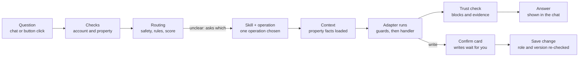

# How Ask Cozy Works: Orchestrator, Adapters, Skills and Friends

An easy-to-read guide to the main moving parts behind Ask Cozy. It was written from reading the code under `apps/backend/src/services/ask/`, `apps/backend/src/services/skills/` and related folders (2026-10-02). It describes how the code is structured, not how it behaves in production.

## The big picture

Ask Cozy is the chat-style front door to a home's record. You type a question or a command, and the backend picks one pre-built, tested "operation" to answer it, instead of letting an AI improvise.

Think of a hotel front desk:

- **The orchestrator** is the concierge. It listens, decides who can help, checks you are allowed to ask, and hands back the answer.
- **Operations** are the individual services on the menu, such as "what maintenance is pending?" or "complete this task". There are about 67 of them.
- **Skills** are departments (Maintenance, Coverage, Savings). Each department owns a group of operations and the rules for them.
- **Adapters** (called capability handlers in the code) are the staff who actually do the work by calling the real home-record services.
- **Context providers** fetch the facts staff need first, such as which property this is.
- **The trust validator** is the manager who checks the answer before it is shown.

The main design rule: answers come from deterministic code reading the home record. An AI model is the last resort, not the first step.

## Life of a question

A write takes the extra branch: it stops at a confirm card and changes nothing until the user taps confirm. If routing cannot choose between operations, Ask shows choices instead of guessing.

## The orchestrator

The orchestrator runs one "execution" per question, from receiving it to saving the answer. Its main entry point is `createAskExecution` in `services/ask/execution/createAskExecution.ts`.

`askOrchestrator.service.ts` is now only a thin facade. It once held about 20,000 lines; the logic was split into handlers and lifecycle files, and the facade just imports and re-exports them. Do not add logic there. See `docs/architecture/ASK_ORCHESTRATOR_DECOMPOSITION_REVIEW.md`.

What the orchestrator does, in order:

1. **Checks the account and property.** The user must be an eligible homeowner account with access to the property.
2. **Handles retries.** A repeated `clientRequestId` returns the earlier execution instead of running twice.
3. **Saves the question** as an `AskExecution` row inside an `AskSession`, with status `RECEIVED`, then `ROUTING`/`RUNNING`.
4. **Resolves follow-ups.** A bare "now complete it" is rewritten using the previous typed result so routing can understand it.
5. **Routes the question** (see the routing cascade below) and picks one operation and its Skill.
6. **Executes the operation** through `executeOperation`, or returns a clarification question if routing was ambiguous.
7. **Validates and saves the answer**, records events and metrics, and tries to capture any home facts you mentioned in passing.

### The routing cascade

Routing (`askRoutingCascade.ts`) tries the cheapest and safest method first and only falls through when it is not confident:

| Stage | What it does |
| --- | --- |
| SAFETY | Fixed rules catch emergencies, unsafe requests and out-of-scope questions. This stage always wins. |
| DETERMINISTIC | Pattern rules map clear phrasings straight to an operation. |
| LOCAL_CLASSIFIER | A local semantic index scores candidate operations. High-risk or write operations need a high-confidence match. |
| CLARIFICATION | If two operations are close, Ask asks "which did you mean?" with up to three choices. |
| REMOTE_FALLBACK | Only when nothing matched, the request falls to general guidance. |

A click on a button the app itself showed (a "declared item action") skips guessing: it names its operation, and that choice is authoritative.

## Adapters (capability handlers)

An adapter is the piece that connects an operation to the real code that does the work. Every operation declares an `adapterKey`; for example `MAINTENANCE_STATUS` uses `maintenance.status`.

The registry lives in `services/ask/capabilityHandlerRegistry.ts`. Handlers register themselves by key when the app starts, one file per capability family in `services/ask/handlers/*.handler.ts` (maintenance, coverage, inventory, quotes, refinance and so on).

Before any handler runs, `capabilityInvoke` applies the same guard chain to every caller:

1. Operational kill-switches: Ask as a whole, the operation, its Skill, its adapter, and remote generation can each be turned off.
2. Skill health: the Skill must be enabled and its dependencies available.
3. Property scope: operations that need a property refuse to run without one.
4. Role check: the user's household role (Viewer, Contributor, Owner) must meet the operation's floor. Reads usually need Viewer; writes need more.
5. Handler lookup: a missing handler raises a typed error, never a silent crash.

Startup validation fails if two handlers claim the same key or an operation has no handler. A broken wiring is caught at boot, not by a homeowner.

There are two other adapter families that are easy to confuse with this one:

- **Skill adapter definitions** (`services/skills/adapters/`) describe each adapter's contract: which operations it may serve, its timeout, whether it is a read or a write preparation, and whether retries are safe.
- **Envelope adapters** (`services/intelligenceEnvelope/adapters/`) convert different intelligence producers (signals, recommendations, radar) into one common shape. They serve the Home Actions and intelligence side more than Ask itself.

## Operations and Skills

### Operations

An operation is one registered thing Ask can do. `askOperationRegistry.ts` defines each one with:

- an ID such as `MAINTENANCE_TASK_COMPLETE`;
- a family: record query, status summary, decision analysis, command, monitor and so on;
- whether it needs a property;
- an execution mode: `DETERMINISTIC` (plain code) or `REMOTE_GENERATION` (AI-written);
- a role floor, the minimum household role allowed;
- its adapter key, and the presentation blocks it may return (summary, grouped list, evidence, boundary and so on);
- semantic metadata used for routing: example phrasings, supported jobs, materiality, and whether it reads or writes.

### Skills

A Skill groups related operations into a homeowner-facing capability, such as Maintenance, Coverage or Savings. Each Skill is a package under `services/skills/<name>/` with:

- `SKILL.md`: plain-language rules on when to select it and when not to;
- `skill.manifest.ts`: its operations, adapters, required and optional context providers, risk policy and context budget;
- `skill.evaluation.ts`: test fixtures for routing, ambiguity, policy and degraded modes.

Example: the Maintenance Skill owns six operations (status, create, complete, update, forecast, deadline monitor). It declares which adapters serve them, which context it needs, and that it must not be chosen for repair-or-replace decisions, which belong to another Skill.

Skills add governance on top of routing:

- **Skill routing** (`skillRouter.ts`) maps a question to a Skill first, then to an operation inside it. If two Skills tie, Ask asks for clarification.
- **Risk policy** records whether a Skill reads or writes, how material it is (money, coverage, safety) and whether its actions can be undone.
- **Consumers**: the same Skill can serve Ask, Home Actions, the Concierge home, proactive nudges and notification continuations, each with its own allowed operations.
- **Handoffs** (`skillHandoff.ts`): after an answer, a Skill can suggest a related next question. A handoff never runs anything itself. It drafts a question that goes back through normal routing and permission checks.
- **Execution binding**: each execution stores which Skill version handled it. If that version changes before you confirm a write, the pending confirmation expires.

New Skills are created with `npm run skill:create -- --spec <file>`, which scaffolds the package and validates it. No change to the core router is needed. See `apps/backend/src/services/skills/README.md`.

## Other related components

| Component | Plain-English role | Where |
| --- | --- | --- |
| Context providers | Fetch bounded facts before an operation runs. `property.identity-context` is required for every property Skill; `property.journey-context` adds lifecycle (owner, buyer, seller). Each Skill has a size and latency budget. | `services/skills/context/` |
| Audience policy | Decides which operations make sense for the user's lifecycle stage and trims unusable buttons. It never replaces permission checks or rewrites facts. | `askAudiencePolicy.ts` |
| Entity resolution | Works out which task, appliance or document you mean. | `askEntityResolution.ts` |
| Confirmation flow | Writes never run directly. The operation returns `NEEDS_CONFIRMATION`, the user reviews or edits a card, then `confirmAskExecution` calls a confirm handler that checks role and version again. | `execution/askConfirm.ts`, `confirmCapabilityHandlerRegistry.ts`, `handlers/*Confirm.handler.ts` |
| Clarification | When routing or entities are ambiguous, Ask shows choices instead of guessing. | `execution/askClarification.ts` |
| Answer trust validator | Checks the result before it is saved: allowed block types, evidence, and semantic fit with the question. | `askAnswerTrustValidator.ts` |
| Remote generation (LLM) | Used only for operations marked `REMOTE_GENERATION` or the general-guidance fallback. A control can switch it off, and Ask then says so instead of inventing an answer. | `askOperationalControls`, `askResultSynthesis.service.ts` |
| Conversational capture | Spots home facts mentioned in passing ("I replaced the roof last summer") and offers them as confirmation cards. | `conversationalUnderstanding/` |
| Capability catalog | The product-wide list of features Ask can discover and link to from entry points like the warranties page. | `productFramework/capabilities/` |
| Specialist agents | Longer, stateful helpers (such as the HVAC repair-or-replace specialist). They may only use Skills they declare, within cost and loop budgets, and can only recommend or draft. | `services/agents/` |
| Concierge home | The Ask landing view: priorities, pending work and suggested questions, built from Home Actions. | `execution/askConcierge.ts` |
| Sessions and events | Every turn is stored with an event trail (`RECEIVED`, `CAPABILITY_RESOLVED`, trust validation and telemetry), which supports audit and debugging. | `execution/askSessions.ts` |

### Frontend

The web app renders the typed answer blocks the backend returns. It does not decide what the answer is.

- `components/ask/AskWorkspace.tsx` is the chat workspace, with `components/ask/calm/` for the calmer landing shell.
- `components/ask/blocks/` and `patterns/` render summaries, grouped lists, evidence panels, confirmation cards and clarification choices.
- `features/ask/` holds client logic: result view state, follow-ups, skill handoff chips and conversational capture.

## Worked example and glossary

**Example: "Mark the HVAC filter task complete."**

1. Safety rules pass, and the property and role are checked.
2. Routing resolves `MAINTENANCE_TASK_COMPLETE` and the Maintenance Skill. A write needs a high-confidence match, or Ask asks which task you mean.
3. Context providers load the property identity and task context.
4. `capabilityInvoke` checks the kill-switches and that you are at least a Contributor, then runs the `maintenance.complete` adapter.
5. The adapter prepares the change and returns `NEEDS_CONFIRMATION`. Nothing is written yet.
6. You tap Confirm. The confirm handler re-checks role and task version, completes the task through the maintenance service, and the card refreshes.

**Glossary**

| Term | Meaning |
| --- | --- |
| Execution | One question and its answer, stored as an `AskExecution`. |
| Session | A conversation made of executions. |
| Operation | One registered capability, such as `MAINTENANCE_STATUS`. |
| Skill | A department that owns a group of operations and their policy. |
| Adapter / capability handler | The code that runs an operation against the home record. |
| Context provider | A source of facts composed before an operation runs. |
| Handoff | A suggested next question that goes back through normal routing. |
| Kill-switch | An operational control that disables Ask, a Skill, an operation or an adapter. |

**Where to go deeper:** `apps/backend/src/services/skills/README.md`, `docs/architecture/ASK_ORCHESTRATOR_DECOMPOSITION_REVIEW.md`, and `docs/product/ASK_COZY_INLINE_WORKSPACE_FRD.md`.
