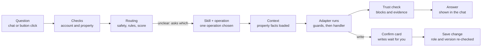

# How Ask Cozy Works: Orchestrator, Adapters, Skills and Friends

An easy-to-read guide to the main moving parts behind Ask Cozy. It was updated from the code under `apps/backend/src/services/ask/`, `apps/backend/src/services/skills/`, `apps/frontend/src/components/ask/` and related folders on 2026-10-04. It describes code-traced behavior and focused static-test evidence, not observed production behavior.

## The big picture

Ask Cozy is the chat-style front door to a home's record. You type a question or a command, and the backend picks one pre-built, tested "operation" to answer it, instead of letting an AI improvise.

Think of a hotel front desk:

- **The orchestrator** is the concierge. It listens, decides who can help, checks you are allowed to ask, and hands back the answer.
- **Operations** are the individual services on the menu, such as "what maintenance is pending?" or "complete this task". There are 118: 106 are grouped into 45 Skills and 12 are platform-owned operations without a Skill (see the catalog below).
- **Skills** are departments (Maintenance, Coverage, Savings). Each department owns a group of operations and the rules for them.
- **Operation adapter keys** identify the capability handler that actually performs an operation. A **capability handler** is the dispatch implementation. A **Skill adapter definition** is the richer governed contract—owner, effect, timeout, retry safety, and idempotency—used by Skill-owned operations. These concepts usually line up, but they are not synonyms.
- **Context providers** fetch the facts staff need first, such as which property this is.
- **The trust validator** is the manager who checks the answer before it is shown.

The main design rule: answers come from deterministic code reading the home record. An AI model is the last resort, not the first step.

## Life of a question



A write takes the extra branch: it stops at a confirm card and changes nothing until the user taps confirm. If routing cannot choose between operations, Ask shows choices instead of guessing.

## The orchestrator

The orchestrator runs one "execution" per question, from receiving it to saving the answer. Its main entry point is `createAskExecution` in `services/ask/execution/createAskExecution.ts`.

`askOrchestrator.service.ts` is now only a thin facade. It once held about 20,000 lines; the logic was split into handlers and lifecycle files, and the facade just imports and re-exports them. Do not add logic there. See `docs/architecture/ASK_ORCHESTRATOR_DECOMPOSITION_REVIEW.md`.

What the orchestrator does, in order:

1. **Checks the account and property.** The user must be an eligible homeowner account with access to the property.
2. **Handles retries.** A repeated `clientRequestId` returns the earlier execution instead of running twice.
3. **Saves the question** as an `AskExecution` row inside an `AskSession`, with status `RECEIVED`, then `ROUTING`/`RUNNING`.
4. **Resolves follow-ups.** A bare "now complete it" is rewritten using the previous typed result so routing can understand it.
5. **Routes the question** (see the routing cascade below) and picks one operation and its Skill.
6. **Executes the operation** through `executeOperation`, or returns a clarification question if routing was ambiguous.
7. **Validates and saves the answer**, records events and metrics, and tries to capture any home facts you mentioned in passing.

### The routing cascade

Routing (`askRoutingCascade.ts`) tries the cheapest and safest method first and only falls through when it is not confident:

| Stage | What it does |
| --- | --- |
| SAFETY | Fixed rules catch emergencies, unsafe requests and out-of-scope questions. This stage always wins. |
| DETERMINISTIC | Pattern rules map clear phrasings straight to an operation. |
| LOCAL_CLASSIFIER | A local semantic index scores candidate operations. High-risk or write operations need a high-confidence match. |
| CLARIFICATION | If two operations are close, Ask asks "which did you mean?" with up to three choices. |
| REMOTE_FALLBACK | Only when nothing matched, the request falls to general guidance. |

A click on a button the app itself showed (a "declared item action") skips guessing: it names its operation, and that choice is authoritative.

## Adapters (capability handlers)

An adapter is the piece that connects an operation to the real code that does the work. Every operation declares an `adapterKey`; for example `MAINTENANCE_STATUS` uses `maintenance.status`.

The registry lives in `services/ask/capabilityHandlerRegistry.ts`. Handlers register themselves by key when the app starts, one file per capability family in `services/ask/handlers/*.handler.ts` (maintenance, coverage, inventory, quotes, refinance and so on).

Before any handler runs, `capabilityInvoke` applies the same guard chain to every caller:

1. Operational kill-switches: Ask as a whole, the operation, its Skill, its adapter, and remote generation can each be turned off.
2. Skill health: the Skill must be enabled and its dependencies available.
3. Property scope: operations that need a property refuse to run without one.
4. Role check: the user's household role (Viewer, Contributor, Owner) must meet the operation's floor. Reads usually need Viewer; writes need more.
5. Handler lookup: a missing handler raises a typed error, never a silent crash.

Startup validation fails if two handlers claim the same key or an operation has no handler. A broken wiring is caught at boot, not by a homeowner.

There are two other adapter families that are easy to confuse with this one:

- **Skill adapter definitions** (`services/skills/adapters/`) describe each adapter's contract: which operations it may serve, its timeout, whether it is a read or a write preparation, and whether retries are safe.
- **Envelope adapters** (`services/intelligenceEnvelope/adapters/`) convert different intelligence producers (signals, recommendations, radar) into one common shape. They serve the Home Actions and intelligence side more than Ask itself.

## Operations and Skills

### Operations

An operation is one registered thing Ask can do. `askOperationRegistry.ts` defines each one with:

- an ID such as `MAINTENANCE_TASK_COMPLETE`;
- a family: record query, status summary, decision analysis, command, monitor and so on;
- whether it needs a property;
- an execution mode: `DETERMINISTIC` (plain code) or `REMOTE_GENERATION` (AI-written);
- a role floor, the minimum household role allowed;
- its adapter key, and the presentation blocks it may return (summary, grouped list, evidence, boundary and so on);
- semantic metadata used for routing: example phrasings, supported jobs, materiality, and whether it reads or writes.

### Skills

A Skill groups related operations into a homeowner-facing capability, such as Maintenance, Coverage or Savings. Each Skill is a package under `services/skills/<name>/` with:

- `SKILL.md`: plain-language rules on when to select it and when not to;
- `skill.manifest.ts`: its operations, adapters, required and optional context providers, risk policy and context budget;
- `skill.evaluation.ts`: test fixtures for routing, ambiguity, policy and degraded modes.

Example: the Maintenance Skill owns six operations (status, create, complete, update, forecast, deadline monitor). It declares which adapters serve them, which context it needs, and that it must not be chosen for repair-or-replace decisions, which belong to another Skill.

Skills add governance on top of routing:

- **Skill routing** (`skillRouter.ts`) maps a question to a Skill first, then to an operation inside it. If two Skills tie, Ask asks for clarification.
- **Risk policy** records whether a Skill reads or writes, how material it is (money, coverage, safety) and whether its actions can be undone.
- **Consumers**: the same Skill can serve Ask, Home Actions, the Concierge home, proactive nudges and notification continuations, each with its own allowed operations.
- **Handoffs** (`skillHandoff.ts`): after an answer, a Skill can suggest a related next question. A handoff never runs anything itself. It drafts a question that goes back through normal routing and permission checks.
- **Execution binding**: each execution stores which Skill version handled it. If that version changes before you confirm a write, the pending confirmation expires.

New Skills are created with `npm run skill:create -- --spec <file>`, which scaffolds the package and validates it. No change to the core router is needed. See `apps/backend/src/services/skills/README.md`.

## Catalog: Skills, Operations and Adapters

This catalog was checked against the live registries (`ASK_OPERATION_DEFINITIONS`, `SKILL_DEFINITIONS`, `SKILL_ADAPTER_DEFINITIONS`, and the capability-handler registry) on 2026-10-04: **118 operations**, **45 Skills**, **118 unique operation adapter keys / registered capability handlers**, and **106 governed Skill adapter definitions**. Each operation declares exactly one adapter key, but the 12 platform operations listed below are intentionally outside a Skill and therefore do not have a `SkillAdapterDefinition`. If a registry entry changes, regenerate and parity-check this section rather than editing counts by hand.

How to read the tables:

- **Kind**: a simplified homeowner-visible behavior label. READ looks something up or performs non-mutating guidance, WRITE creates or changes a governed record, MONITOR sets up a watch or reminder, and BOUNDARY is a safety response. This is not a substitute for the adapter effect: some decision operations prepare durable workflow state even though their primary result is an analysis, while monitor adapters use mutation preparation to create the watch.
- **Min role**: the lowest household role allowed (Viewer < Contributor < Owner). A dash means no property is involved.
- **Adapter**: the operation adapter key that `capabilityInvoke` uses to find the handler. For Skill-owned operations the same key resolves to a versioned `SkillAdapterDefinition`; platform operations currently have only the handler binding.

### Skills (45)

| Skill | ID | Domain | Operations | What it covers |
| --- | --- | --- | --- | --- |
| Maintenance | `maintenance` | Home care | 6 | Understand, create, complete, update, and monitor home maintenance work, and see predicted upcoming maintenance for verified home systems. |
| Repair or Replace | `repair-replace` | Home care | 11 | Evaluate whether to repair or replace a recorded home system and continue its governed decision journey. |
| Refinance | `refinance` | Home finance | 2 | Evaluate a recorded mortgage refinance opportunity and manage a governed mortgage-rate monitor. |
| Property Record | `property-record` | Home intelligence | 11 | Summarize the selected home and find recorded appliances, systems, and inventory details. |
| Capital Planning | `capital-planning` | Home care | 1 | Plan major home expenses, reserve needs, and replacement timing from recorded home data. |
| Coverage | `coverage` | Home protection | 2 | Review recorded warranty and insurance coverage gaps and evidence readiness, and check how your current insurance policy compares to alternative quotes or terms. |
| Household | `household` | Household | 1 | Manage governed household invitations and explain membership access boundaries. |
| Ownership Cost | `ownership-cost` | Home finance | 1 | Summarize monthly and annual home ownership costs using recorded household data. |
| Property Tax | `property-tax` | Home finance | 1 | Assess property-tax appeal readiness from recorded assessment, evidence, and deadline context. |
| Quote Comparison | `quote-comparison` | Home projects | 2 | Create a governed quote workspace and compare recorded bids, estimates, and proposals. |
| Renovation | `renovation` | Home projects | 1 | Review renovation and permit readiness, recorded blockers, and required next steps. |
| Savings | `savings` | Home finance | 1 | Find recorded savings, rebate, benefit, and cost-reduction opportunities for the selected home. |
| Sell, Hold, or Rent | `sell-hold-rent` | Home transactions | 1 | Compare governed sell, hold, and rent scenarios from recorded property and financial context. |
| Break-Even | `break-even` | Home finance | 1 | Show when owning this home breaks even, as projected appreciation catches up with cumulative ownership costs, with a conservative-to-optimistic range. |
| Around Your Home | `neighborhood-change-radar` | Home protection | 1 | Review reviewed local changes around this home (planning, development, zoning, infrastructure, land use, flood maps and schools) with their possible relevance and matched geography. |
| Home Risk Replay | `home-risk-replay` | Home protection | 1 | Review this home's past hazard exposure and long-term hazard context from reviewed sources, with any effect the household recorded. |
| Status Board | `status-board` | Home care | 1 | Review the condition of this home's recorded appliances and systems: what needs action, what to monitor, and what is in good shape, with why. |
| Home Habit Coach | `home-habit-coach` | Home care | 1 | Review the small household habits the Home Habit Coach suggests for this home, ranked, with why each was suggested. |
| Home Continuity Plan | `home-digital-will` | Home intelligence | 1 | Review this home's continuity plan: how ready it is to hand off, what each section holds and who the trusted contacts are. |
| Plant Advisor care outlook | `plant-advisor` | Home care | 1 | Review weather-aware care for this home's tracked plants and garden zones: what to change now or soon and why. |
| Negotiation Shield | `negotiation-shield` | Home finance | 1 | Review this home's Negotiation Shield cases: the quote, premium, claim, urgency and inspection negotiations prepared so far and where each one stands. |
| Home Upgrade Planner | `home-digital-twin` | Home care | 1 | Review the upgrade options saved in this home's Home Upgrade Planner, grouped by system, with estimated cost, savings, payback and any decision recorded. |
| DIY Project Center | `diy` | Home care | 1 | Review this home's active DIY projects in planning or in progress, with how many required steps are done. |
| Project Tracker | `project-tracker` | Home projects | 1 | Review this home's contractor projects in Project Tracker: which are active, completed or cancelled, with contract, paid and remaining amounts. |
| Service Price Radar | `service-price-radar` | Home projects | 1 | Review the quote checks run in Service Price Radar for this home: each quoted price against the expected local range, with the verdict. |
| Home Timeline | `home-timeline` | Home care | 1 | Review this home's recorded history on the Home Timeline: repairs, improvements, purchases, inspections and claims, with how verified each event is. |
| Material Specs | `material-specs` | Home care | 1 | Look up the paint colours, tile, flooring, fixtures and suppliers recorded in this home's Material Specs. |
| Property Brief | `property-brief` | Home care | 1 | Review this home's saved Property Briefs: each brief's purpose, snapshot date and sections, and which share links are still live. |
| Guidance Overview | `guidance-overview` | Home care | 4 | Review the guided journeys under way on Guidance Overview: each issue's steps done, the next step and anything blocking it. |
| HOA Compliance | `hoa-compliance` | Home care | 1 | Review this home's HOA records: the association and dues, approval requests with the association's recorded decision, and violations. |
| Price Finalization | `price-finalization` | Home care | 1 | Review the prices and terms recorded in Price Finalization: accepted price against the quote, agreed terms, and whether each was finalized or booked. |
| Do-Nothing Simulator | `do-nothing-simulator` | Home care | 1 | Review the latest Do-Nothing Simulator run: what putting off home upkeep could cost, the risk drivers, the biggest avoidable losses and the saved scenarios. |
| Warranties | `warranties` | Home care | 1 | Review the warranties recorded for this home: provider, category and dates, whether each is active, expiring within 60 days or expired, and the coverage text as recorded, without deciding what is covered. |
| Appliance Oracle | `appliance-oracle` | Home care | 1 | See which appliances and systems are nearing the end of their expected life, with failure risk by age and a replacement estimate. |
| Budget Planner | `budget-planner` | Home care | 1 | See how much to budget for home upkeep: a yearly total, a monthly average, a month-by-month forecast and a split by category. |
| Seller Preparation | `seller-preparation` | Home transactions | 1 | Navigate seller readiness and major home-sale preparation using recorded home context. |
| Seller Prep Checklist | `seller-prep` | Home transactions | 2 | Review the governed seller-prep checklist -- open repairs, records, and presentation work recommended before listing this home for sale -- and record a waive/pursue/reopen decision on an exact item. |
| Buyer & Closing | `buyer-closing` | Home transactions | 18 | Track and progress an active home purchase from contract through closing — deadlines, documents, inspection findings, financing, title/escrow, walkthrough, and closing-day readiness. |
| Claims | `incident-claim` | Home protection | 4 | Review the status of filed insurance and incident claims for this home. |
| Home Operations | `home-operations` | Home intelligence | 3 | Review the canonical ranked feed of recommended, scheduled, active, and completed home work. |
| Inspection Findings | `inspection-findings` | Home care | 2 | Review canonical inspection findings and explicitly accept, dismiss, or resolve an exact finding. |
| Document Review and Promotion | `document-promotion` | Home intelligence | 2 | Review document-derived candidates and confirm or reject an exact candidate through its canonical promotion adapter. |
| Documents | `documents` | Home intelligence | 1 | Look up uploaded documents on file for this home -- inspection reports, estimates, invoices, contracts, permits, and other records -- grouped by type and verification status. |
| Query Intelligence Envelope | `query-envelope` | Home intelligence | 1 | Read a bounded, normalized view of registered intelligence produced for an authorized property. |
| Home Event Radar | `home-event-radar` | Home protection | 6 | Read the canonical feed of monitored home events (weather, air quality, disaster, utility, tax, and insurance signals matched to this property) and their full detail. |

### Operations and adapters, grouped by Skill

#### Maintenance (`maintenance`)

| Operation | Adapter | Kind | Min role | What it does |
| --- | --- | --- | --- | --- |
| `MAINTENANCE_STATUS` | `maintenance.status` | READ | Viewer | Review pending and completed maintenance |
| `MAINTENANCE_TASK_CREATE` | `maintenance.create` | WRITE | Contributor | Create a maintenance task |
| `MAINTENANCE_TASK_COMPLETE` | `maintenance.complete` | WRITE | Contributor | Mark maintenance work complete |
| `MAINTENANCE_TASK_UPDATE` | `maintenance.update` | WRITE | Contributor | Change a maintenance task |
| `MAINTENANCE_FORECAST` | `maintenance.forecast` | READ | Viewer | See predicted upcoming maintenance for home systems |
| `HOME_DEADLINE_MONITOR` | `home-deadline.monitor` | MONITOR | Contributor | Monitor a home deadline or expiration |

#### Repair or Replace (`repair-replace`)

| Operation | Adapter | Kind | Min role | What it does |
| --- | --- | --- | --- | --- |
| `REPLACEMENT_GUIDANCE` | `inventory.replacement` | READ | Viewer | Decide when to repair or replace a home item |
| `HVAC_DECISION_START` | `decision-platform.hvac.start` | READ | Contributor | Start an HVAC repair-or-replace decision |
| `HVAC_DECISION_CONTINUE` | `decision-platform.hvac.continue` | READ | Viewer | Continue an active HVAC repair-or-replace decision |
| `HVAC_SPECIALIST_ENGAGE` | `decision-platform.hvac.specialist-engage` | READ | Contributor | Engage the HVAC Specialist agent on a flagged HVAC repair-or-replace home action |
| `HVAC_DECISION_SCENARIO` | `decision-platform.hvac.scenario` | READ | Contributor | Compare a new HVAC quote or scenario |
| `HVAC_DECISION_ABANDON` | `decision-platform.hvac.abandon` | WRITE | Contributor | Stop an active HVAC decision |
| `HVAC_PREFERENCE_SAVE` | `decision-platform.hvac.preference.save` | WRITE | Contributor | Save an HVAC decision preference |
| `HVAC_PREFERENCE_FORGET` | `decision-platform.hvac.preference.forget` | WRITE | Contributor | Forget a saved HVAC decision preference |
| `HVAC_DECISION_OUTCOME_REPORT` | `decision-platform.hvac.outcome.report` | WRITE | Contributor | Report what happened after an HVAC decision |
| `HVAC_DECISION_OUTCOME_VIEW` | `decision-platform.hvac.outcome.view` | READ | Viewer | Review a recorded HVAC decision outcome |
| `HVAC_DECISION_OUTCOME_UNLINK` | `decision-platform.hvac.outcome.unlink` | WRITE | Contributor | Correct or unlink an HVAC decision outcome |

#### Refinance (`refinance`)

| Operation | Adapter | Kind | Min role | What it does |
| --- | --- | --- | --- | --- |
| `REFINANCE_ANALYSIS` | `refinance.analysis` | READ | Viewer | Evaluate whether refinancing may be worthwhile |
| `REFINANCE_RATE_MONITOR` | `refinance.monitor` | MONITOR | Contributor | Monitor mortgage rates |

#### Property Record (`property-record`)

| Operation | Adapter | Kind | Min role | What it does |
| --- | --- | --- | --- | --- |
| `PROPERTY_SUMMARY` | `property.summary` | READ | Viewer | Review the home record, including missing or incomplete details |
| `INVENTORY_LOOKUP` | `inventory.lookup` | READ | Viewer | Look up inventory details and select an incomplete canonical record before adding or correcting supported fields |
| `HOME_CHANGE_SUMMARY` | `home-change.summary` | READ | Viewer | Review what changed in the home record |
| `INVENTORY_ITEM_CORRECT` | `inventory.item-correct` | WRITE | Contributor | Correct one confirmed inventory field: name, lifecycle dates, condition, brand, model, serial number, costs, notes, category, or room |
| `HOME_EVENT_CORRECT` | `home-event.correct` | WRITE | Contributor | Correct the title or date of a recorded home timeline event |
| `HOME_EVENT_VISIBILITY` | `home-event.visibility` | WRITE | Contributor | Change who can see a recorded home timeline event |
| `WARRANTY_CORRECT` | `warranty.correct` | WRITE | Contributor | Fix a wrong provider or date recorded on a warranty you added |
| `ROOM_RENAME` | `room.rename` | WRITE | Contributor | Correct one confirmed room field: name, room type, or floor level |
| `ROOM_CREATE` | `room.create` | WRITE | Contributor | Add a room with a confirmed name, type, and optional floor level, without leaving Ask |
| `INVENTORY_ITEM_CREATE` | `inventory.create` | WRITE | Contributor | Add a new item to the home inventory |
| `PROPERTY_CONTEXT_AREA_CAPTURE` | `property-context.area-capture` | WRITE | Contributor | Fill in a missing home record detail for one area of the property summary |

#### Capital Planning (`capital-planning`)

| Operation | Adapter | Kind | Min role | What it does |
| --- | --- | --- | --- | --- |
| `CAPITAL_RESERVE_PLAN` | `capital-reserve.plan` | READ | Viewer | Plan reserves for future home expenses |

#### Coverage (`coverage`)

| Operation | Adapter | Kind | Min role | What it does |
| --- | --- | --- | --- | --- |
| `COVERAGE_GAPS` | `coverage.review` | READ | Viewer | Review insurance and warranty coverage gaps |
| `COVERAGE_COMPARISON_STATUS` | `coverage.comparison-status` | READ | Viewer | Compare my current insurance policy against alternative quotes or terms |

#### Household (`household`)

| Operation | Adapter | Kind | Min role | What it does |
| --- | --- | --- | --- | --- |
| `HOUSEHOLD_INVITATION` | `household.invitation` | WRITE | Owner | Invite a household member |

#### Ownership Cost (`ownership-cost`)

| Operation | Adapter | Kind | Min role | What it does |
| --- | --- | --- | --- | --- |
| `OWNERSHIP_COSTS` | `ownership.costs` | READ | Viewer | Review the cost of owning the home |

#### Property Tax (`property-tax`)

| Operation | Adapter | Kind | Min role | What it does |
| --- | --- | --- | --- | --- |
| `PROPERTY_TAX_APPEAL_READINESS` | `property-tax.appeal-readiness` | READ | Viewer | Review property-tax appeal readiness |

#### Quote Comparison (`quote-comparison`)

| Operation | Adapter | Kind | Min role | What it does |
| --- | --- | --- | --- | --- |
| `QUOTE_COMPARISON_CREATE` | `quote-comparison.create` | WRITE | Contributor | Start a contractor quote comparison |
| `QUOTE_COMPARISON_REVIEW` | `quote-comparison.review` | READ | Viewer | Compare contractor quotes or bids |

#### Renovation (`renovation`)

| Operation | Adapter | Kind | Min role | What it does |
| --- | --- | --- | --- | --- |
| `RENOVATION_PERMIT_READINESS` | `renovation-permit.readiness` | READ | Viewer | Review renovation permit readiness |

#### Savings (`savings`)

| Operation | Adapter | Kind | Min role | What it does |
| --- | --- | --- | --- | --- |
| `SAVINGS_OPPORTUNITIES` | `savings.opportunities` | READ | Viewer | Find ways to lower home costs |

#### Sell, Hold, or Rent (`sell-hold-rent`)

| Operation | Adapter | Kind | Min role | What it does |
| --- | --- | --- | --- | --- |
| `SELL_HOLD_RENT_ANALYSIS` | `sale-case.analysis` | READ | Viewer | Compare selling, holding, or renting the home |

#### Break-Even (`break-even`)

| Operation | Adapter | Kind | Min role | What it does |
| --- | --- | --- | --- | --- |
| `BREAK_EVEN_ANALYSIS` | `break-even.analysis` | READ | Viewer | See when owning this home breaks even, as appreciation catches up with cumulative ownership costs |

#### Around Your Home (`neighborhood-change-radar`)

| Operation | Adapter | Kind | Min role | What it does |
| --- | --- | --- | --- | --- |
| `NEIGHBORHOOD_CHANGE_FEED` | `neighborhood-change.feed` | READ | Viewer | Review reviewed local changes around this home: planning, development, zoning, infrastructure, land use, flood maps and schools |

#### Home Risk Replay (`home-risk-replay`)

| Operation | Adapter | Kind | Min role | What it does |
| --- | --- | --- | --- | --- |
| `PAST_HAZARD_EXPOSURE` | `home-risk-replay.exposure` | READ | Viewer | Review this home's past hazard exposure and long-term hazard context from reviewed sources, with any effect the household recorded |

#### Status Board (`status-board`)

| Operation | Adapter | Kind | Min role | What it does |
| --- | --- | --- | --- | --- |
| `HOME_STATUS_BOARD` | `status-board.read` | READ | Viewer | Review the condition of this home's recorded appliances and systems: what needs action, what to monitor, and what is in good shape |

#### Home Habit Coach (`home-habit-coach`)

| Operation | Adapter | Kind | Min role | What it does |
| --- | --- | --- | --- | --- |
| `HOME_HABITS` | `home-habits.read` | READ | Viewer | Review the small household habits the Home Habit Coach suggests for this home, ranked, with why each was suggested |

#### Home Continuity Plan (`home-digital-will`)

| Operation | Adapter | Kind | Min role | What it does |
| --- | --- | --- | --- | --- |
| `HOME_DIGITAL_WILL` | `home-digital-will.read` | READ | Contributor | Review this home's continuity plan: how ready it is to hand off, what each section holds and who the trusted contacts are |

#### Plant Advisor care outlook (`plant-advisor`)

| Operation | Adapter | Kind | Min role | What it does |
| --- | --- | --- | --- | --- |
| `PLANT_CARE_OUTLOOK` | `plant-advisor.care-outlook` | READ | Viewer | Review weather-aware care for this home's tracked plants and garden zones: what to change now or soon and why |

#### Negotiation Shield (`negotiation-shield`)

| Operation | Adapter | Kind | Min role | What it does |
| --- | --- | --- | --- | --- |
| `NEGOTIATION_SHIELD_CASES` | `negotiation-shield.cases` | READ | Viewer | Review this home's Negotiation Shield cases: the contractor quote, premium, claim settlement and urgency reviews prepared so far and where each one stands |

#### Home Upgrade Planner (`home-digital-twin`)

| Operation | Adapter | Kind | Min role | What it does |
| --- | --- | --- | --- | --- |
| `HOME_UPGRADE_SCENARIOS` | `home-digital-twin.scenarios` | READ | Viewer | Review the upgrade options saved in this home's Home Upgrade Planner, grouped by system, with their estimated cost, savings, payback and any decision recorded |

#### DIY Project Center (`diy`)

| Operation | Adapter | Kind | Min role | What it does |
| --- | --- | --- | --- | --- |
| `DIY_PROJECTS` | `diy.projects` | READ | Viewer | Review this home's active DIY projects in planning or in progress, with how many required steps are done |

#### Project Tracker (`project-tracker`)

| Operation | Adapter | Kind | Min role | What it does |
| --- | --- | --- | --- | --- |
| `PROJECT_TRACKER_PROJECTS` | `project-tracker.projects` | READ | Viewer | Review this home's contractor projects in Project Tracker: which are active, completed or cancelled, with contract, paid and remaining amounts |

#### Service Price Radar (`service-price-radar`)

| Operation | Adapter | Kind | Min role | What it does |
| --- | --- | --- | --- | --- |
| `SERVICE_PRICE_CHECKS` | `service-price-radar.checks` | READ | Owner | Review the quote checks run in Service Price Radar for this home: each quoted price against the expected local range, with the verdict |

#### Home Timeline (`home-timeline`)

| Operation | Adapter | Kind | Min role | What it does |
| --- | --- | --- | --- | --- |
| `HOME_TIMELINE_EVENTS` | `home-timeline.events` | READ | Viewer | Review this home's recorded history on the Home Timeline: repairs, improvements, purchases, inspections and claims, with how verified each event is |

#### Material Specs (`material-specs`)

| Operation | Adapter | Kind | Min role | What it does |
| --- | --- | --- | --- | --- |
| `MATERIAL_SPECS_LIST` | `material-specs.list` | READ | Viewer | Look up the paint colours, tile, flooring, fixtures and suppliers recorded in this home's Material Specs |

#### Property Brief (`property-brief`)

| Operation | Adapter | Kind | Min role | What it does |
| --- | --- | --- | --- | --- |
| `PROPERTY_BRIEFS_LIST` | `property-brief.briefs` | READ | Viewer | Review this home's saved Property Briefs: each brief's purpose, snapshot date and sections, and which share links are still live |

#### Guidance Overview (`guidance-overview`)

| Operation | Adapter | Kind | Min role | What it does |
| --- | --- | --- | --- | --- |
| `GUIDANCE_JOURNEYS_LIST` | `guidance-overview.journeys` | READ | Viewer | Review the guided journeys under way on Guidance Overview: each issue's steps done, the next step and anything blocking it |
| `GUIDANCE_JOURNEY_CONTINUE` | `guidance-overview.continue` | READ | Viewer | See where one guided journey stands: its steps, the current step and why it matters, what blocks it and what has been done |
| `GUIDANCE_STEP_SKIP` | `guidance-overview.step-skip` | WRITE | Contributor | Skip one step of a guided journey after confirmation, when the step's policy allows it |
| `GUIDANCE_JOURNEY_DISMISS` | `guidance-overview.journey-dismiss` | WRITE | Contributor | Dismiss a guided journey you do not want to pursue, after confirmation |

#### HOA Compliance (`hoa-compliance`)

| Operation | Adapter | Kind | Min role | What it does |
| --- | --- | --- | --- | --- |
| `HOA_COMPLIANCE_STATUS` | `hoa-compliance.status` | READ | Viewer | Review this home's HOA records: the association and dues, approval requests with the association's recorded decision, and violations with cure deadlines and fines |

#### Price Finalization (`price-finalization`)

| Operation | Adapter | Kind | Min role | What it does |
| --- | --- | --- | --- | --- |
| `PRICE_FINALIZATIONS_LIST` | `price-finalization.records` | READ | Owner | Review the prices and terms recorded in Price Finalization: each vendor's accepted price against the quote, the agreed scope, payment, warranty and timeline, and whether it was finalized or booked |

#### Do-Nothing Simulator (`do-nothing-simulator`)

| Operation | Adapter | Kind | Min role | What it does |
| --- | --- | --- | --- | --- |
| `DO_NOTHING_SIMULATION` | `do-nothing-simulator.latest` | READ | Owner | Review the latest Do-Nothing Simulator run: what putting off home upkeep for months could cost, the risk drivers, the biggest avoidable losses and the saved scenarios |

#### Warranties (`warranties`)

| Operation | Adapter | Kind | Min role | What it does |
| --- | --- | --- | --- | --- |
| `WARRANTY_LOOKUP` | `warranty.lookup` | READ | Viewer | Review the warranties recorded for this home: provider, category and dates, whether each is active, expiring within 60 days or expired, and the coverage text as recorded, without deciding what is covered |

#### Appliance Oracle (`appliance-oracle`)

| Operation | Adapter | Kind | Min role | What it does |
| --- | --- | --- | --- | --- |
| `APPLIANCE_FAILURE_RISK` | `appliance-oracle.risk` | READ | Owner | See which appliances and systems are nearing the end of their expected life, with failure risk by age, an estimated failure date and a replacement cost estimate |

#### Budget Planner (`budget-planner`)

| Operation | Adapter | Kind | Min role | What it does |
| --- | --- | --- | --- | --- |
| `MAINTENANCE_BUDGET_FORECAST` | `budget-planner.forecast` | READ | Owner | See how much to budget for home upkeep: a yearly total, a monthly average, a month-by-month forecast and a split by category |

#### Seller Preparation (`seller-preparation`)

| Operation | Adapter | Kind | Min role | What it does |
| --- | --- | --- | --- | --- |
| `MAJOR_EVENT_ENTRY` | `major-event.entry` | READ | Viewer | Prepare for a major home event |

#### Seller Prep Checklist (`seller-prep`)

| Operation | Adapter | Kind | Min role | What it does |
| --- | --- | --- | --- | --- |
| `SELLER_PREP_CHECKLIST` | `seller-prep.checklist` | READ | Viewer | Review the seller-prep checklist for selling this home |
| `SELLER_PREP_ITEM_DECISION` | `seller-prep.item-decision` | WRITE | Contributor | Waive, pursue, reopen, or unpursue a seller-prep checklist item |

#### Buyer & Closing (`buyer-closing`)

| Operation | Adapter | Kind | Min role | What it does |
| --- | --- | --- | --- | --- |
| `BUYER_PLAN_STATUS` | `buyer.plan.status` | READ | Viewer | Review the Buyer Plan status and next closing action |
| `BUYER_DEADLINES` | `buyer.deadlines` | READ | Viewer | Review upcoming deadlines and closing blockers |
| `BUYER_DOCUMENT_READINESS` | `buyer.document-readiness` | READ | Viewer | Review which transaction documents are missing or unverified before closing |
| `BUYER_INSPECTION_REVIEW` | `buyer.inspection-review` | READ | Viewer | Review inspection findings that still need a decision before closing |
| `BUYER_TASK_COMPLETE` | `buyer.task.complete` | WRITE | Contributor | Check off a closing checklist item |
| `BUYER_TASK_CREATE` | `buyer.task.create` | WRITE | Contributor | Add a custom task to the closing checklist |
| `BUYER_TASK_UPDATE` | `buyer.task.update` | WRITE | Contributor | Reschedule or reassign a closing checklist item |
| `BUYER_MOVE_STATUS` | `buyer.move-status` | READ | Viewer | Review move-in progress for this purchase |
| `BUYER_FINANCING_READINESS` | `buyer.financing-readiness` | READ | Viewer | Review purchase-loan appraisal and underwriting readiness before closing |
| `BUYER_TITLE_ESCROW_READINESS` | `buyer.title-escrow-readiness` | READ | Viewer | Review title, escrow, survey, and HOA readiness before closing |
| `BUYER_WALKTHROUGH_READINESS` | `buyer.walkthrough-readiness` | READ | Viewer | Prepare or review the final walkthrough checklist |
| `BUYER_DISCLOSURE_FUNDS_READINESS` | `buyer.disclosure-funds-readiness` | READ | Viewer | Review Closing Disclosure changes and funds readiness |
| `BUYER_CLOSING_DAY_READINESS` | `buyer.closing-day-readiness` | READ | Viewer | Prepare the closing-day appointment, funds, and access checklist |
| `BUYER_CONTRACT_TIMELINE` | `buyer.contract-timeline` | READ | Viewer | Confirm accepted-contract dates, terms, and contingency deadlines |
| `BUYER_NEGOTIATION_READINESS` | `buyer.negotiation-readiness` | READ | Viewer | Organize inspection negotiation inputs for the agent or seller |
| `BUYER_COST_READINESS` | `buyer.cost-readiness` | READ | Viewer | Explain recorded near-term purchase costs |
| `BUYER_FINDING_DISPOSITION` | `buyer.finding.disposition` | WRITE | Contributor | Classify an inspection finding as negotiation, post-close work, verified fact, or dismissed |
| `BUYER_LIFECYCLE_UPDATE` | `buyer.lifecycle.update` | WRITE | Contributor | Cancel this purchase or change its recorded closing/move-in dates |

#### Claims (`incident-claim`)

| Operation | Adapter | Kind | Min role | What it does |
| --- | --- | --- | --- | --- |
| `INCIDENT_CLAIM_STATUS` | `incident-claim.status` | READ | Viewer | Review recorded incidents and insurance claims |
| `CLAIM_FILE` | `incident-claim.file` | WRITE | Contributor | Start a governed insurance or warranty claim record |
| `CLAIM_TRANSITION` | `incident-claim.transition` | WRITE | Contributor | Advance a recorded claim through its valid lifecycle |
| `INCIDENT_CONTINUATION` | `incident-claim.continuation` | READ | Viewer | Continue from an emergency boundary into incident records and claims |

#### Home Operations (`home-operations`)

| Operation | Adapter | Kind | Min role | What it does |
| --- | --- | --- | --- | --- |
| `HOME_ACTIONS` | `home-actions.feed` | READ | Viewer | Prioritize what needs attention next |
| `OPERATIONAL_WORK_UPDATE` | `home-operations.update` | WRITE | Contributor | Accept, defer, snooze, or complete tracked home work |
| `GUIDANCE_JOURNEY_CREATE` | `guidance.journey.create` | WRITE | Contributor | Start a guided home plan |

#### Inspection Findings (`inspection-findings`)

| Operation | Adapter | Kind | Min role | What it does |
| --- | --- | --- | --- | --- |
| `INSPECTION_FINDINGS` | `inspection-findings.review` | READ | Viewer | Review canonical inspection findings for this home |
| `INSPECTION_FINDING_UPDATE` | `inspection-findings.update` | WRITE | Contributor | Accept, dismiss, or resolve a canonical inspection finding |

#### Document Review and Promotion (`document-promotion`)

| Operation | Adapter | Kind | Min role | What it does |
| --- | --- | --- | --- | --- |
| `DOCUMENT_PROMOTION_REVIEW` | `document-promotion.review` | READ | Viewer | Review document-derived candidates awaiting homeowner confirmation |
| `DOCUMENT_PROMOTION_CONFIRM` | `document-promotion.confirm` | WRITE | Contributor | Confirm or reject an exact reviewed document candidate |

#### Documents (`documents`)

| Operation | Adapter | Kind | Min role | What it does |
| --- | --- | --- | --- | --- |
| `DOCUMENT_LOOKUP` | `documents.lookup` | READ | Viewer | Look up uploaded documents |

#### Query Intelligence Envelope (`query-envelope`)

| Operation | Adapter | Kind | Min role | What it does |
| --- | --- | --- | --- | --- |
| `INTELLIGENCE_ENVELOPE_QUERY` | `intelligence-envelope.query` | READ | Viewer | Review normalized intelligence from registered Envelope producers |

#### Home Event Radar (`home-event-radar`)

| Operation | Adapter | Kind | Min role | What it does |
| --- | --- | --- | --- | --- |
| `HOME_EVENT_RADAR_FEED` | `home-event-radar.feed` | READ | Viewer | Review this property's own canonical Home Event Radar feed and monitored-event detail |
| `HOME_EVENT_RADAR_STATE` | `home-event-radar.state` | WRITE | Viewer | Save, unsave, dismiss, or restore one monitored Home Event Radar event for yourself |
| `HOME_EVENT_RADAR_MARK_DONE` | `home-event-radar.mark-done` | WRITE | Contributor | Mark one monitored Home Event Radar event as handled after confirmation |
| `HOME_EVENT_RADAR_FEEDBACK` | `home-event-radar.feedback` | WRITE | Contributor | Send feedback on why one monitored Home Event Radar event is wrong or not useful |
| `HOME_EVENT_RADAR_TASK` | `home-event-radar.task` | WRITE | Contributor | Add or link a maintenance task for one recommended action on a monitored Home Event Radar event |
| `HOME_EVENT_RADAR_PREFERENCES` | `home-event-radar.preferences` | WRITE | Contributor | Change which Home Event Radar notifications reach you and how |

#### Operations that belong to no Skill (12)

These are platform-level operations: safety boundaries, discovery, the general-guidance fallback, recall workflows, captured-record confirmation, and goal attachment. They have operation adapter keys and registered capability handlers, but no Skill owner or governed Skill adapter definition. That distinction is architectural, not merely documentation: `skillRuntimeUnavailableReason` has no Skill policy to enforce for them. Recall, capture, and goal operations are candidates for explicit domain ownership; safety, discovery, and general guidance should remain platform-owned but should gain an equally explicit platform-adapter contract.

| Operation | Adapter | Kind | Min role | What it does |
| --- | --- | --- | --- | --- |
| `RECALL_REVIEW` | `recalls.review` | READ | Viewer | Review recorded product recall matches for items in this home |
| `RECALL_MATCH_UPDATE` | `recalls.update` | WRITE | Contributor | Confirm, dismiss, or resolve a recorded product recall match |
| `CAPABILITY_DISCOVERY` | `capability.discovery` | READ | - | Find a supported home tool or workflow |
| `EMERGENCY_BOUNDARY` | `boundary.emergency` | BOUNDARY | - | Get immediate emergency safety direction |
| `UNSAFE_RESTRICTED_BOUNDARY` | `boundary.unsafe-restricted` | BOUNDARY | - | Handle an unsafe or restricted home request |
| `OUT_OF_SCOPE_BOUNDARY` | `boundary.out-of-scope` | BOUNDARY | - | Identify a request outside home concierge scope |
| `GROUNDED_GUIDANCE` | `grounded.guidance` | READ | - | Get general educational home guidance (AI-written) |
| `CAPTURE_FACT_CONFIRM` | `capture.fact.confirm` | WRITE | Contributor | Record a fact about the home directly from conversation |
| `CAPTURE_EVENT_CONFIRM` | `capture.event.confirm` | WRITE | Contributor | Record something that happened at the home directly from conversation |
| `CAPTURE_WARRANTY_CONFIRM` | `capture.warranty.confirm` | WRITE | Contributor | Record a warranty for something at the home directly from conversation |
| `CAPTURE_EVIDENCE_CONFIRM` | `capture.evidence.confirm` | WRITE | Contributor | Attach an already-uploaded document as evidence for something reported directly from conversation |
| `SELL_HOLD_RENT_GOAL_CAPTURE` | `sell-hold-rent.goal-capture` | WRITE | Contributor | Attach a durable sell/hold/rent decision thread from a stated intention to sell, directly from conversation |

## Suggested next actions

After an answer, Ask can show several kinds of actions. The homeowner may always ignore them and type any question in the composer. Suggested actions are a precision and convenience layer, never an input allowlist.

The current implementation has more than three action surfaces:

1. **Operation suggestion chips.** A handler returns a `suggestions` list of prompts. Clicking one currently sends a new question through normal routing. The calm frontend docks at most four from the latest answer and removes questions already asked. Backend repeat suppression separately removes the current or recently completed question through `askSuggestionPolicy.ts`.
2. **Boundary and platform-state suggestions.** Permission, property-required, unavailable, lifecycle-mismatch, cancellation, expiration, retry, and safety results can suggest recovery without belonging to one domain handler branch.
3. **Typed entity and block actions.** Item actions already carry an operation, interaction type, and exact entity identity; block actions may continue in conversation, open structured capture, refresh, or navigate.
4. **Confirmation-receipt continuations.** A completed write can offer the most relevant next record action after canonical reconciliation.
5. **Skill handoffs.** A nine-entry allowlist can recommend a next Skill after an eligible result. It never executes that Skill automatically.
6. **Dynamic next actions.** `askNextActions.ts` fetches up to ten governed capability candidates, excludes the current and recently completed capabilities, promotes explicitly related capabilities and active-goal matches, and renders at most five. A `NEEDS_CONTEXT` candidate qualifies only when its missing fact has a supported capture definition; at most one missing-fact capture request is appended.
7. **Landing starters.** The no-turn launch state can offer property-aware starter prompts independently of the latest answer.

The per-operation table below catalogs operation-produced conversational suggestions. It is not, by itself, a complete inventory of every visible action surface. Cross-cutting states and typed actions must be documented and validated separately.

**How this list was built.** It was extracted from the source by parsing each handler and following the functions it calls (static analysis, updated 2026-10-03). Nothing was executed against real data, so treat it as the set of prompts an operation *can* offer, not what a given user sees:

- Each operation lists prompts from every branch of its handler, including empty states, errors and permission messages.
- A prompt shown as ‹…› contains a value filled in at runtime, such as a task or appliance name.
- Where a handler also builds some prompts at runtime from a list it did not spell out, the row says "plus prompts built at runtime".
- Prompts reached through a shared helper can appear under more than one operation. Operations that share a helper (for example the capability discovery card) show its prompts too.
- Generic messages shared by every operation (feature switched off, property needed, permission denied) are left out.
- "After confirming" lists prompts from the confirm step of a write operation.
- Boundary operations list safety instructions in this field instead of questions.

### Inventory missing-details continuation

The inventory follow-up is a useful example of why a suggestion is not automatically a write:

1. `inventory.handler.ts` emits **Add or update missing details** only when the current result contains an incomplete matching record and the household role is Contributor or Owner. Viewers can still read the result but receive no write-oriented suggestion.
2. The exact first-party phrase has a dedicated deterministic routing rule ahead of inventory creation. It resolves to the read operation `INVENTORY_LOOKUP` with high confidence; the word “Add” therefore cannot accidentally start `INVENTORY_ITEM_CREATE`.
3. `isIncompleteInventoryRequest` treats the continuation as the incomplete-record view. The handler returns canonical `INVENTORY_ITEM` ids, and the homeowner selects an item before any field-level operation is offered.
4. For this continuation, item actions are narrowed to fields that are both absent and supported by `INVENTORY_ITEM_CORRECT`: brand, model, serial number and purchase date. Ordinary inventory detail may still offer the operation's wider correction set.
5. Opening item detail re-reads the canonical inventory record. Selecting a correction starts the existing review-and-confirm path; `INVENTORY_ITEM_CORRECT` performs the write only after role and record version are checked again.
6. Documents and coverage use different owners. A missing document uses the existing evidence attachment control and `CAPTURE_EVIDENCE_CONFIRM`. Coverage evidence cannot be edited through `INVENTORY_ITEM_CORRECT`, so the answer discloses the Home Inventory boundary instead of pretending the generic follow-up can complete it.

This is a bounded read → identity selection → declared write sequence. The suggestion text supplies intent, while typed entity identity, authorization and confirmation still govern the consequential action.

### Room workflows stay inside Ask

Rooms use `PROPERTY_SUMMARY` for the read surface and two confirmation-gated Property Record operations for writes:

1. **Focused room read.** “Show my rooms” deterministically routes to `PROPERTY_SUMMARY` and returns the focused room map, not a semantic clarification or an automatic trip to the Rooms page. The map groups canonical `INVENTORY_ROOM` records by stored floor, shows item and open-task counts, and can switch to a list without issuing another request.
2. **Live room detail.** Opening a room re-reads its canonical room insights inline. Contributor-and-up users receive three declared actions—**Rename room**, **Change room type**, and **Change floor level**—plus **Add an item** pinned to that room. Viewers receive the read result without these write controls.
3. **Correcting a room.** All three field actions use the existing `ROOM_RENAME` operation. The operation name is historical; its proposal now records a `field` of `name`, `type`, or `floorLevel`. A missing or ambiguous room produces a bounded canonical-room selection before Ask prepares a change.
4. **Field rules.** A name is trimmed, limited to 80 characters, and unique within the property. Type is selected from the ten canonical room types. Floor level is a whole number from −5 through 50; `0` is ground level and negative values are below ground. Floor level cannot currently be cleared inline.
5. **Confirmed canonical write.** The proposal writes nothing. Confirmation rechecks the Contributor role, the room's `id:updatedAt` freshness version and the field value, then sends a patch containing only that field through `inventoryService.updateRoom`. A replay whose value is already present is reported as already corrected rather than written again.
6. **Adding a room.** `ROOM_CREATE` collects the name, canonical type and optional floor level, then shows a review card and requires confirmation. Its form, duplicate-name response, review and receipt do not use an “Open Rooms” escape hatch. The completion and viewer boundary instead suggest **Show my rooms**, returning to the focused inline room map.
7. **Reconciliation and boundaries.** Room creation and correction reconcile both `PROPERTY_SUMMARY` and `INVENTORY_LOOKUP`, because inventory rows can display room names. The traditional room record remains available as a secondary detail link. Deleting a room, changing sort order, editing its profile or hero image, and clearing floor level are outside these Ask operations.

This follows the same read → exact entity → declared operation → review → confirm pattern as inventory corrections, while keeping the normal room journey inside the conversation.

### Suggestions by operation

#### Maintenance

| Operation | Suggested follow-ups |
| --- | --- |
| `MAINTENANCE_STATUS` | “Show overdue tasks only”<br>“What maintenance is due soon?”<br>“Create a maintenance task”<br>“Try this seasonal question again”<br>“Show completed ‹…› tasks”<br>“Show dismissed ‹…› tasks”<br>“What ‹…› tasks are pending?” |
| `MAINTENANCE_TASK_CREATE` | “What maintenance is pending?”<br>“Open Maintenance instead”<br>**After confirming:** “What maintenance is still pending?” · “Create another maintenance task” |
| `MAINTENANCE_TASK_COMPLETE` | “What maintenance is pending?”<br>“Create a maintenance task”<br>“Open Maintenance instead”<br>**After confirming:** “What maintenance is still pending?” · “Show maintenance completed this year” |
| `MAINTENANCE_TASK_UPDATE` | “Update ‹…› (one per item)”<br>“Assign ‹…› to ‹…› (one per item)”<br>“Snooze reminders for ‹…› for one week”<br>**After confirming:** “What maintenance is pending?” · “Reopen ‹…›” |
| `MAINTENANCE_FORECAST` | “What maintenance is pending?” |
| `HOME_DEADLINE_MONITOR` | “Remind me when ‹…› is due (one per item)”<br>**After confirming:** “Reschedule ‹…›” · “Archive ‹…›” · “What maintenance is still pending?” |

#### Repair or Replace

| Operation | Suggested follow-ups |
| --- | --- |
| `REPLACEMENT_GUIDANCE` | “Should I repair or replace ‹…›? (one per item)”<br>“How much should I reserve for ‹…› replacement?”<br>“Show my capital timeline”<br>“Should I repair or replace my ‹…›? (one per item)”<br>“What changed about this decision?” |
| `HVAC_DECISION_START` | “Should I repair or replace my ‹…›? (one per item)”<br>“What changed about this decision?” |
| `HVAC_DECISION_CONTINUE` | “Show my active home decisions”<br>“Compare a new quote for this decision”<br>“Abandon this decision”<br>“What's the status of my ‹…› decision? (one per item)”<br>“Should I repair or replace my ‹…›?” |
| `HVAC_SPECIALIST_ENGAGE` | “Should I repair or replace my furnace?”<br>“Help me decide about ‹…› from my Home Actions (one per item)”<br>“Open my Home Actions”<br>“What needs my attention?”<br>When a recommendation is ready: “What changed about this decision?” · “Compare a new quote for this decision”<br>When context is needed: “My HVAC condition is good” · “It was installed in 2012” · “The replacement estimate is $8,000” |
| `HVAC_DECISION_SCENARIO` | “Should I repair or replace my ‹…›?” |
| `HVAC_DECISION_ABANDON` | None listed |
| `HVAC_PREFERENCE_SAVE` | “Save that we plan to sell in about 18 months”<br>“Remember I want to minimize long-term cost”<br>**After confirming:** “Should I repair or replace my HVAC?” |
| `HVAC_PREFERENCE_FORGET` | “Forget my ownership horizon”<br>“Forget my repair/replace approach”<br>**After confirming:** “Should I repair or replace my HVAC?” |
| `HVAC_DECISION_OUTCOME_REPORT` | “Should I repair or replace my ‹…›?” |
| `HVAC_DECISION_OUTCOME_VIEW` | “Should I repair or replace my ‹…›?”<br>“I replaced my ‹…›”<br>“That outcome is wrong for my ‹…›” |
| `HVAC_DECISION_OUTCOME_UNLINK` | None listed |

#### Refinance

| Operation | Suggested follow-ups |
| --- | --- |
| `REFINANCE_ANALYSIS` | “Show other home savings opportunities”<br>“Use the full Financing Profile instead”<br>“What rate would make refinancing worth reviewing?”<br>“Is refinancing worth it right now?”<br>“Notify me when rates reach this level”<br>“What rate would open a stronger opportunity?”<br>“Show me the Mortgage Refinance Radar” |
| `REFINANCE_RATE_MONITOR` | “Notify me when 30-year rates reach 5.5%”<br>“Notify me when 15-year rates reach 4.75%”<br>“Is refinancing worth reviewing now?” |

#### Property Record

| Operation | Suggested follow-ups |
| --- | --- |
| `PROPERTY_SUMMARY` | “Summarize my home record”<br>“Show incomplete inventory records”<br>“List pending maintenance tasks”<br>“What details are missing?”<br>“Show me my home by room.”<br>“What changed recently?” |
| `INVENTORY_LOOKUP` | “Add or update missing details” (Contributor or Owner only, and only when a matching record is incomplete)<br>“Open home inventory”<br>“List all inventory items”<br>“Show incomplete inventory records”<br>“Which systems are nearing end of life?”<br>“List all appliances” |
| `HOME_CHANGE_SUMMARY` | “Summarize my home record”<br>“What should I do next?” |
| `INVENTORY_ITEM_CORRECT` | Ordinary item detail can declare corrections for name, install/purchase/service dates, condition, brand, model, serial number, purchase/replacement costs, notes, category and room. The missing-details continuation narrows these to “Add brand”, “Add model”, “Add serial number” and “Add purchase date” only when each field is absent.<br>**After confirming:** “Show my home inventory” |
| `HOME_EVENT_CORRECT` | “Correct the title of the timeline event ‹…› (one per item)”<br>“Correct the title of the timeline event ‹…›”<br>“Correct the date of the timeline event ‹…›” |
| `HOME_EVENT_VISIBILITY` | “Change the visibility of the timeline event ‹…› (one per item)”<br>**After confirming:** “Show my home timeline” |
| `WARRANTY_CORRECT` | “Correct the expiry date of the ‹…› warranty (one per item)”<br>“Correct the provider of the ‹…› warranty”<br>“Correct the expiry date of the ‹…› warranty”<br>**After confirming:** “Show my warranties” |
| `ROOM_RENAME` | Declared room actions: “Rename this room.”, “Change the type of this room.”, and “Change the floor level of this room.” If no exact room is resolved, Ask suggests up to three canonical-room prompts such as “Rename Kitchen” or “Change the floor level of Guest room”.<br>**After confirming:** “Show my rooms” |
| `ROOM_CREATE` | Viewer permission boundary and completion receipt: “Show my rooms”. The form and review steps keep the workflow inline and declare no traditional-page suggestion. |
| `INVENTORY_ITEM_CREATE` | Before confirmation or from a boundary: “Show my inventory”<br>**After confirming:** “Set the purchase date for this inventory item” · “Update the condition of this inventory item” · “Update the model of this inventory item” or “Update the brand of this inventory item” |
| `PROPERTY_CONTEXT_AREA_CAPTURE` | “How complete is my home record?” |

#### Capital Planning

| Operation | Suggested follow-ups |
| --- | --- |
| `CAPITAL_RESERVE_PLAN` | “Show my home inventory”<br>“Show my capital timeline with the earliest expense first.”<br>“Should I repair or replace ‹…›?” |

#### Coverage

| Operation | Suggested follow-ups |
| --- | --- |
| `COVERAGE_GAPS` | “Which gaps have the largest exposure?”<br>“Show warranties expiring soon”<br>“Which items are missing coverage evidence?” |
| `COVERAGE_COMPARISON_STATUS` | “Which items have missing coverage?”<br>“Open coverage comparison” |

#### Household

| Operation | Suggested follow-ups |
| --- | --- |
| `HOUSEHOLD_INVITATION` | “What can my current household role do?”<br>“Open household settings instead”<br>**After confirming:** “Who currently has access to this home?” |

#### Ownership Cost

| Operation | Suggested follow-ups |
| --- | --- |
| `OWNERSHIP_COSTS` | “Add this detail and retry automatically”<br>“Open Ownership Costs”<br>“Show operating expenses only”<br>“Which category costs the most?”<br>“Where could I save money?”<br>“Show cash outflow including mortgage principal” |

#### Property Tax

| Operation | Suggested follow-ups |
| --- | --- |
| `PROPERTY_TAX_APPEAL_READINESS` | “Show my recorded property-tax facts”<br>“Which tax facts are missing?”<br>“Open Property Tax Center” |

#### Quote Comparison

| Operation | Suggested follow-ups |
| --- | --- |
| `QUOTE_COMPARISON_CREATE` | “Create a quote comparison for roofing”<br>“Create a quote comparison for plumbing” |
| `QUOTE_COMPARISON_REVIEW` | “Create a quote comparison workspace for roofing bids”<br>“What makes these quotes incomparable?”<br>“Open quote comparison” |

#### Renovation

| Operation | Suggested follow-ups |
| --- | --- |
| `RENOVATION_PERMIT_READINESS` | “What permits are already recorded?”<br>“Is ‹…› ready to start? (one per item)”<br>“What is blocking this renovation?” |

#### Savings

| Operation | Suggested follow-ups |
| --- | --- |
| `SAVINGS_OPPORTUNITIES` | “Ask a household owner or contributor to improve the savings context”<br>“Which opportunity has the fastest payback?”<br>“Open Savings and Benefits to add installed systems”<br>“Where else could I save money?”<br>“What savings have I already realized?” |

#### Sell, Hold, or Rent

| Operation | Suggested follow-ups |
| --- | --- |
| `SELL_HOLD_RENT_ANALYSIS` | “Ask a household owner or contributor to improve the property context”<br>“Open Sell / Hold / Rent”<br>“What assumptions matter most?”<br>“How much does this home cost each month?” |

#### Break-Even

| Operation | Suggested follow-ups |
| --- | --- |
| `BREAK_EVEN_ANALYSIS` | “Should I sell, hold, or rent this home?”<br>“What does this home cost me each year?” |

#### Around Your Home

| Operation | Suggested follow-ups |
| --- | --- |
| `NEIGHBORHOOD_CHANGE_FEED` | “What is happening near my home?”<br>“Show my home event radar feed” |

#### Home Risk Replay

| Operation | Suggested follow-ups |
| --- | --- |
| `PAST_HAZARD_EXPOSURE` | “What is happening near my home?”<br>“Which of my systems are unprotected?” |

#### Status Board

| Operation | Suggested follow-ups |
| --- | --- |
| `HOME_STATUS_BOARD` | “What maintenance is due?”<br>“Should I repair or replace my oldest appliance?” |

#### Home Habit Coach

| Operation | Suggested follow-ups |
| --- | --- |
| `HOME_HABITS` | “What maintenance is due?”<br>“Show my status board” |

#### Home Continuity Plan

| Operation | Suggested follow-ups |
| --- | --- |
| `HOME_DIGITAL_WILL` | “What home records do I have?”<br>“What maintenance is due?” |

#### Plant Advisor care outlook

| Operation | Suggested follow-ups |
| --- | --- |
| `PLANT_CARE_OUTLOOK` | “What maintenance is due?” |

#### Negotiation Shield

| Operation | Suggested follow-ups |
| --- | --- |
| `NEGOTIATION_SHIELD_CASES` | “Compare my service quotes” |

#### Home Upgrade Planner

| Operation | Suggested follow-ups |
| --- | --- |
| `HOME_UPGRADE_SCENARIOS` | “What maintenance is due?” |

#### DIY Project Center

| Operation | Suggested follow-ups |
| --- | --- |
| `DIY_PROJECTS` | “What maintenance is due?” |

#### Project Tracker

| Operation | Suggested follow-ups |
| --- | --- |
| `PROJECT_TRACKER_PROJECTS` | “What maintenance is due?” |

#### Service Price Radar

| Operation | Suggested follow-ups |
| --- | --- |
| `SERVICE_PRICE_CHECKS` | “Compare my service quotes” |

#### Home Timeline

| Operation | Suggested follow-ups |
| --- | --- |
| `HOME_TIMELINE_EVENTS` | “What changed at my home recently?” |

#### Material Specs

| Operation | Suggested follow-ups |
| --- | --- |
| `MATERIAL_SPECS_LIST` | “Summarize my home record” |

#### Property Brief

| Operation | Suggested follow-ups |
| --- | --- |
| `PROPERTY_BRIEFS_LIST` | “Summarize my home record” |

#### Guidance Overview

| Operation | Suggested follow-ups |
| --- | --- |
| `GUIDANCE_JOURNEYS_LIST` | “Start a step-by-step plan for this home project” |
| `GUIDANCE_JOURNEY_CONTINUE` | “Show my guided journeys” |
| `GUIDANCE_STEP_SKIP` | “Show my guided journeys” |
| `GUIDANCE_JOURNEY_DISMISS` | “Show my guided journeys” |

#### HOA Compliance

| Operation | Suggested follow-ups |
| --- | --- |
| `HOA_COMPLIANCE_STATUS` | “Is my renovation ready to start?” |

#### Price Finalization

| Operation | Suggested follow-ups |
| --- | --- |
| `PRICE_FINALIZATIONS_LIST` | “Compare my service quotes” |

#### Do-Nothing Simulator

| Operation | Suggested follow-ups |
| --- | --- |
| `DO_NOTHING_SIMULATION` | “What coverage gaps does my home have?”<br>“What are my monthly ownership costs?” |

#### Warranties

| Operation | Suggested follow-ups |
| --- | --- |
| `WARRANTY_LOOKUP` | “Show my warranties”<br>“Which warranties expire within 60 days?” |

#### Appliance Oracle

| Operation | Suggested follow-ups |
| --- | --- |
| `APPLIANCE_FAILURE_RISK` | “Show my inventory”<br>“When should I replace my water heater?” |

#### Budget Planner

| Operation | Suggested follow-ups |
| --- | --- |
| `MAINTENANCE_BUDGET_FORECAST` | “What are my monthly ownership costs?” |

#### Seller Preparation

| Operation | Suggested follow-ups |
| --- | --- |
| `MAJOR_EVENT_ENTRY` | “Should I sell, hold, or rent?”<br>“Check sale readiness”<br>“Is my renovation ready to start?”<br>“Do I need a permit?”<br>“Summarize my home record”<br>“What should I do next?”<br>“Show me another available option”<br>“What can help with this goal instead?”<br>“Help me compare contractor quotes”<br>“I want to plan future replacements”<br>“Can you monitor refinance rates?”<br>“Help me narrow these options”<br>“Show only tools ready for this home”<br>“What information does this tool need?”<br>“What result will I get?”<br>“Show another option” |

#### Seller Prep Checklist

| Operation | Suggested follow-ups |
| --- | --- |
| `SELLER_PREP_CHECKLIST` | “Should I sell, hold, or rent this home?”<br>“What should I prioritize first?”<br>“Open seller prep”<br>“Open Sell / Hold / Rent” |
| `SELLER_PREP_ITEM_DECISION` | None listed<br>**After confirming:** “Check my sale readiness” |

#### Buyer & Closing

| Operation | Suggested follow-ups |
| --- | --- |
| `BUYER_PLAN_STATUS` | “What is due before closing?”<br>“Which transaction documents are missing?”<br>“What should I do next for this home?” |
| `BUYER_DEADLINES` | “What should I do next for this purchase?”<br>“Which transaction documents are missing?”<br>“What should I do next for this home?” |
| `BUYER_DOCUMENT_READINESS` | “What is due before closing?”<br>“Which inspection findings still need a decision?”<br>“What should I do next for this home?” |
| `BUYER_INSPECTION_REVIEW` | “What should I do next for this purchase?”<br>“What is due before closing?”<br>“What should I do next for this home?” |
| `BUYER_TASK_COMPLETE` | “What should I do next for this purchase?”<br>“What is due before closing?”<br>“Mark the ‹…› buyer plan task complete (one per item)” |
| `BUYER_TASK_CREATE` | “What should I do next for this purchase?”<br>“Add final walkthrough photos to my buyer plan” |
| `BUYER_TASK_UPDATE` | “What should I do next for this purchase?”<br>“Reschedule the ‹…› buyer plan task (one per item)”<br>“Assign ‹…› to ‹…› (one per item)” |
| `BUYER_MOVE_STATUS` | “What should I do next for this purchase?”<br>“What is due before closing?”<br>“What should I do next for this home?” |
| `BUYER_FINANCING_READINESS` | “What should I do next for this purchase?”<br>“What is due before closing?”<br>“What should I do next for this home?” |
| `BUYER_TITLE_ESCROW_READINESS` | “What should I do next for this purchase?”<br>“What is due before closing?”<br>“What should I do next for this home?” |
| `BUYER_WALKTHROUGH_READINESS` | “What should I do next for this purchase?”<br>“What is due before closing?”<br>“What should I do next for this home?” |
| `BUYER_DISCLOSURE_FUNDS_READINESS` | “What should I do next for this purchase?”<br>“What is due before closing?”<br>“What do I need for closing day?”<br>“What should I do next for this home?” |
| `BUYER_CLOSING_DAY_READINESS` | “What is due before closing?”<br>“What should I do next for this purchase?”<br>“What should I do next for this home?” |
| `BUYER_CONTRACT_TIMELINE` | “What should I do next for this purchase?”<br>“What is due before closing?”<br>“What should I do next for this home?” |
| `BUYER_NEGOTIATION_READINESS` | “Which inspection findings still need a decision?”<br>“What is due before closing?”<br>“What should I do next for this home?” |
| `BUYER_COST_READINESS` | “What is due before closing?”<br>“What should I do next for this purchase?”<br>“What should I do next for this home?” |
| `BUYER_FINDING_DISPOSITION` | “Which inspection findings still need a decision?”<br>“Move the ‹…› finding into my post-close plan (one per item)”<br>**After confirming:** “What should I do next for this purchase?” |
| `BUYER_LIFECYCLE_UPDATE` | “What do I need for closing day?”<br>“What should I do next for this purchase?”<br>“Cancel this purchase: financing fell through” |

#### Claims

| Operation | Suggested follow-ups |
| --- | --- |
| `INCIDENT_CLAIM_STATUS` | “What do I need for an insurance claim?”<br>“What should I do next?” |
| `CLAIM_FILE` | None listed<br>**After confirming:** “What should I gather for this claim?” |
| `CLAIM_TRANSITION` | “Review the claim and choose its next valid lifecycle step.”<br>“Show my open claims” |
| `INCIDENT_CONTINUATION` | “File a water damage claim”<br>“What is the status of my open claim?” |

#### Home Operations

| Operation | Suggested follow-ups |
| --- | --- |
| `HOME_ACTIONS` | “Summarize my home record”<br>“What maintenance is pending?”<br>“What else needs my attention?”<br>“Ask again to retry”<br>“Anything urgent?”<br>“What should I plan?”<br>“What can wait?”<br>“Summarize this home record before closing.”<br>“What are the ownership costs for this home after purchase?” |
| `OPERATIONAL_WORK_UPDATE` | “Complete ‹…›; it is working as expected”<br>“Complete ‹…›; it still needs attention”<br>“Complete ‹…›; it failed again”<br>**After confirming:** “What needs my attention next?” |
| `GUIDANCE_JOURNEY_CREATE` | “Start a guided plan for ‹…› (one per item)” |

#### Inspection Findings

| Operation | Suggested follow-ups |
| --- | --- |
| `INSPECTION_FINDINGS` | “Accept ‹…› finding ‹…› as work (one per item)” |
| `INSPECTION_FINDING_UPDATE` | “Show remaining inspection findings” |

#### Document Review and Promotion

| Operation | Suggested follow-ups |
| --- | --- |
| `DOCUMENT_PROMOTION_REVIEW` | “Confirm document candidate ‹…› (one per item)” |
| `DOCUMENT_PROMOTION_CONFIRM` | None listed<br>**After confirming:** “Show remaining document reviews” |

#### Documents

| Operation | Suggested follow-ups |
| --- | --- |
| `DOCUMENT_LOOKUP` | “Show my documents”<br>“Open Home Records” |

#### Query Intelligence Envelope

| Operation | Suggested follow-ups |
| --- | --- |
| `INTELLIGENCE_ENVELOPE_QUERY` | “Summarize my home record”<br>“Try the query again”<br>“Show more intelligence”<br>“Ask about a specific intelligence domain” |

#### Home Event Radar

| Operation | Suggested follow-ups |
| --- | --- |
| `HOME_EVENT_RADAR_FEED` | “Ask again later”<br>“Show more monitored events” |
| `HOME_EVENT_RADAR_STATE` | “Show my home event radar feed” |
| `HOME_EVENT_RADAR_MARK_DONE` | “Show my home event radar feed” |
| `HOME_EVENT_RADAR_FEEDBACK` | “Show my home event radar feed” |
| `HOME_EVENT_RADAR_TASK` | “Show my home event radar feed” |
| `HOME_EVENT_RADAR_PREFERENCES` | “Show my home event radar feed” |

#### Operations that belong to no Skill

| Operation | Suggested follow-ups |
| --- | --- |
| `RECALL_REVIEW` | “Open Recalls & Safety Alerts” |
| `RECALL_MATCH_UPDATE` | None listed<br>**After confirming:** “Show remaining recall matches” · “Show my open recall matches” |
| `CAPABILITY_DISCOVERY` | “Show me another available option”<br>“What can help with this goal instead?”<br>“Help me compare contractor quotes”<br>“I want to plan future replacements”<br>“Can you monitor refinance rates?”<br>“Help me narrow these options”<br>“Show only tools ready for this home”<br>“What information does this tool need?”<br>“What result will I get?”<br>“Show another option” |
| `EMERGENCY_BOUNDARY` | “Follow instructions from emergency responders or the utility.”<br>“Do not wait for an app assessment when there may be immediate danger.” |
| `UNSAFE_RESTRICTED_BOUNDARY` | “Review the safe permit, inspection, or policy-verification path.”<br>“Open only the records available for your selected home.”<br>“Consult the appropriate authority or qualified professional for a controlling determination.”<br>“What is required before my renovation can start?”<br>“Which home records should I verify?” |
| `OUT_OF_SCOPE_BOUNDARY` | “What maintenance is pending?”<br>“Which items are missing coverage?”<br>“Is there a tool to help with refinancing?” |
| `GROUNDED_GUIDANCE` | “What maintenance is pending?”<br>_plus prompts built at runtime_ |
| `CAPTURE_FACT_CONFIRM` | None listed |
| `CAPTURE_EVENT_CONFIRM` | None listed |
| `CAPTURE_WARRANTY_CONFIRM` | None listed |
| `CAPTURE_EVIDENCE_CONFIRM` | None listed |
| `SELL_HOLD_RENT_GOAL_CAPTURE` | “Open Sell / Hold / Rent”<br>“What would help me get ready to sell?” |

### Skill handoffs (suggested next Skill)

Eligible only when the source operation finishes with one of the listed statuses. A handler can also pick which allowlisted handoff to show for a given result (`AskFollowUpNomination`).

| After this operation | Suggest | Goal | When |
| --- | --- | --- | --- |
| `PROPERTY_SUMMARY` | `MAINTENANCE_STATUS` (maintenance) | `understand-maintenance-status` | answered or ready with limitations |
| `BUYER_PLAN_STATUS` | `PROPERTY_SUMMARY` (property-record) | `summarize-property-record` | answered or ready with limitations |
| `HOME_ACTIONS` | `MAINTENANCE_STATUS` (maintenance) | `understand-maintenance-status` | answered or ready with limitations |
| `INCIDENT_CLAIM_STATUS` | `COVERAGE_GAPS` (coverage) | `review-coverage-gaps` | answered or ready with limitations |
| `CLAIM_FILE` | `HOME_ACTIONS` (home-operations) | `review-home-actions-feed` | completed |
| `CLAIM_TRANSITION` | `COVERAGE_GAPS` (coverage) | `review-coverage-gaps` | completed |
| `INSPECTION_FINDING_UPDATE` | `HOME_ACTIONS` (home-operations) | `review-home-actions-feed` | completed |
| `DOCUMENT_PROMOTION_CONFIRM` | `PROPERTY_SUMMARY` (property-record) | `summarize-property-record` | completed |
| `BUYER_LIFECYCLE_UPDATE` | `PROPERTY_SUMMARY` (property-record) | `summarize-property-record` | completed |

### Cross-cutting platform-state suggestions

These do not belong in every operation row because they are emitted by shared execution policy:

| State | Examples | Purpose |
| --- | --- | --- |
| Capability unavailable | “What maintenance is pending?”, “Summarize my home record”, “Which items are missing coverage?” | Recover toward deterministic, available reads |
| Property required | “You can also ask a general home-care question without selecting a property.” | Preserve a useful no-property path |
| Permission required | “Ask a read-only question about this home” | Recover without advertising an unauthorized write |
| Audience/lifecycle mismatch | “Summarize my home record”, “What maintenance is pending?”, “What should I plan for next?” | Move to an applicable operation |
| Skill binding expired | “Ask this question again” | Re-resolve current policy and versions |
| Pending request cancelled | “Ask a new question” | Return to unrestricted conversation |

### Recommended evolution: high-precision Suggested Next Actions

The target is not to restrict the composer. The target is to make the most likely useful continuations accurate enough that homeowners rarely need to formulate the next request themselves.

Replace `suggestions: string[]` with a common typed recommendation contract after an additive migration:

```ts
interface SuggestedNextAction {
  id: string;
  outcomeKey: SuggestedNextActionOutcomeKey;
  label: string;
  message: string;
  operationId: AskOperationId;
  interactionType: 'CONVERSATION_CONTINUE' | 'MUTATE_RECORD' | 'START_WORKFLOW';
  entityContext?: {
    propertyId: string;
    entityType?: string;
    entityId?: string;
    contextVersion?: string;
  };
  eligibility: {
    state: 'ELIGIBLE' | 'NEEDS_CONTEXT' | 'UNAVAILABLE';
    reasonCodes: string[];
    missingFactKeys?: string[];
  };
  provenance: {
    source: 'OPERATION_RESULT' | 'ENTITY_ACTION' | 'MISSING_DETAIL' | 'SKILL_HANDOFF' | 'CAPABILITY_RECOMMENDATION' | 'ACTIVE_GOAL' | 'PLATFORM_STATE' | 'LANDING_STARTER';
    sourceOperationId?: AskOperationId;
    sourceExecutionId?: string;
    reasonCodes: string[];
  };
  createdAt: string;
  expiresAt: string;
  priority: {
    tier: 'CONTINUE' | 'RECORD_ACTION' | 'RELATED' | 'DISCOVERY';
    score: number;
  };
}
```

The server should collect candidates from the current result, exact entity actions, missing details, unfinished work, Skill handoffs, active goals, and capability recommendations. It should then apply hard eligibility filters for property access, household role, lifecycle applicability, Skill/operation health, entity existence and freshness, required context, recent completion, duplication, and pending interaction conflicts. Missing-context candidates must resolve through a registered `missingFactKey -> captureKey -> operationId` mapping. Emergency, restricted, unavailable, expired, and cancellation results use a safe-recovery-only policy that excludes discovery and promotional actions.

Rank immediate continuation first, then exact record action, related analysis, and broad discovery. Prefer concrete labels such as “Add the microwave brand” or “Change the guest room floor” over “Add details” or “Learn more”. Show at most three or four high-confidence actions in the calm follow-up row; leaving a slot empty is better than filling it with a weak recommendation.

Clicking a typed action sends its natural-language `message`, action id, and source execution id. The persisted source execution is the offered-action ledger: the backend loads it under the current user/session/property, verifies the exact action is unexpired, requires the submitted message to match, and copies the authoritative message, operation, entity context, outcome key, and provenance from server-stored data. Expiry is capped by the fixed source-execution expiry; mutation/workflow actions default to 30 minutes and conversational reads to 24 hours. Purged sources and invalid, stale, or mismatched selections return typed recovery rather than silently falling back to semantic routing. The ordinary client request id provides idempotency.

Landing starters have no source execution and therefore use a 15-minute HMAC-SHA-256 token bound to user, session, property, starter id, registry versions, a preallocated `clientRequestId`, issued-at time, and expiry. The dedicated `ASK_SUGGESTED_ACTION_SIGNING_SECRET` is separate from JWT signing; the request must use the token-bound request id, so an identical replay returns the same execution and a changed id fails verification. Rich entity item actions keep their existing operation/entity launch contract and card lifetime; only a compact promoted equivalent becomes ledger-backed, and expiry of that compact copy does not disable the rich button. Navigation links and result-local filters stay in their own allowlisted/link or result-control contracts and participate only by publishing semantic identity for deduplication. Arbitrary homeowner text continues through the normal routing and clarification cascade.

Deduplication must operate across suggestion chips, entity actions, block actions, Skill handoffs, capability recommendations, and landing starters rather than inside each source independently. Identity uses registered operation, interaction type, property/entity, and `outcomeKey`; it is never inferred from display copy. Rich result-card actions publish the same identity so response finalization can suppress an equivalent compact chip. The winning action should retain provenance explaining why it was shown.

Action ids are deterministic version-prefixed hashes of source execution, operation, interaction type, property/entity, and outcome key. Copy, score, producer, timestamps, and array position are excluded. Refresh atomically replaces the stored offered-action ledger with regenerated stable ids; an id removed by refresh is immediately stale.

One shared `finalizeSuggestedNextActions` service runs from `executeOperation.ts`'s `finalize()` seam before answer-trust validation and from `askConfirm.ts` before confirmed-completion validation. Confirmation expiry/conflict, retryable/terminal failure, cancellation, and every other branch that persists recovery actions must use the same service. No persistence seam may produce compact actions independently. It uses a bounded, batch-loaded evaluation context; producer failures drop and report that producer rather than crashing startup or the answer. Ranking uses versioned integer weights, non-overlapping tier ranges, a minimum display threshold, and a documented stable tie-break. Domain freshness is explicit in a matrix: use an authoritative context version where one exists and a current-record requery rule otherwise. An injected clock makes creation, expiry, and deterministic-order tests stable.

Measure suggestion coverage, click-to-intended-operation precision, click-to-completion, clarification after click, stale-action rejection, duplicate suppression, abandonment, and the manual-input escape rate. A distinct selection id links the verified offered action to the resulting execution through existing execution-event/analytics infrastructure; do not overload Skill-handoff or source-refresh identifiers. Optimize for click-to-success precision rather than click-through rate.

There are no real customers or production customer data, so this increment has no feature flag, cohort, canary, pilot, or runtime kill switch. Migration uses the additive typed/string compatibility boundary. Rollback before string removal is a code revert plus rebuild and redeploy, not an instant switch.

The documentation catalog should be generated from registries and statically declared action definitions, with CI parity checks for operation ids, Skill ownership, adapter bindings/effects, handoffs, and typed suggestion producers. Dynamic values should be documented as templates and scenario branches rather than copied examples.

Ownership should also become explicit. A dedicated Recalls Skill is the clearest owner for `RECALL_REVIEW` and `RECALL_MATCH_UPDATE`; `SELL_HOLD_RENT_GOAL_CAPTURE` should be evaluated for ownership by the existing Sell, Hold, or Rent Skill; and the four `CAPTURE_*` operations should either belong to a governed conversational-capture Skill or to their canonical domain Skills. Discovery, safety boundaries, and general guidance should remain platform-owned but gain a versioned platform-adapter definition with governance equivalent to a Skill adapter. These ownership changes require deliberate policy review because assigning a Skill changes runtime health and authorization enforcement.

## Other related components

| Component | Plain-English role | Where |
| --- | --- | --- |
| Context providers | Fetch bounded facts before an operation runs. `property.identity-context` is required for every property Skill; `property.journey-context` adds lifecycle (owner, buyer, seller). Each Skill has a size and latency budget. | `services/skills/context/` |
| Audience policy | Decides which operations make sense for the user's lifecycle stage and trims unusable buttons. It never replaces permission checks or rewrites facts. | `askAudiencePolicy.ts` |
| Entity resolution | Works out which task, appliance or document you mean. | `askEntityResolution.ts` |
| Confirmation flow | Writes never run directly. The operation returns `NEEDS_CONFIRMATION`, the user reviews or edits a card, then `confirmAskExecution` calls a confirm handler that checks role and version again. | `execution/askConfirm.ts`, `confirmCapabilityHandlerRegistry.ts`, `handlers/*Confirm.handler.ts` |
| Clarification | When routing or entities are ambiguous, Ask shows choices instead of guessing. | `execution/askClarification.ts` |
| Answer trust validator | Checks the result before it is saved: allowed block types, evidence, and semantic fit with the question. | `askAnswerTrustValidator.ts` |
| Remote generation (LLM) | Used only for operations marked `REMOTE_GENERATION` or the general-guidance fallback. A control can switch it off, and Ask then says so instead of inventing an answer. | `askOperationalControls`, `askResultSynthesis.service.ts` |
| Conversational capture | Spots home facts mentioned in passing ("I replaced the roof last summer") and offers them as confirmation cards. | `conversationalUnderstanding/` |
| Capability catalog | The product-wide list of features Ask can discover and link to from entry points like the warranties page. | `productFramework/capabilities/` |
| Specialist agents | Longer, stateful helpers (such as the HVAC repair-or-replace specialist). They may only use Skills they declare, within cost and loop budgets, and can only recommend or draft. | `services/agents/` |
| Concierge home | The Ask landing view: priorities, pending work and suggested questions, built from Home Actions. | `execution/askConcierge.ts` |
| Sessions and events | Every turn is stored with an event trail (`RECEIVED`, `CAPABILITY_RESOLVED`, trust validation and telemetry), which supports audit and debugging. | `execution/askSessions.ts` |

### Frontend

The web app renders the typed answer blocks the backend returns. It does not decide what the answer is.

- `components/ask/AskWorkspace.tsx` is the chat workspace, with `components/ask/calm/` for the calmer landing shell.
- `components/ask/blocks/` and `patterns/` render summaries, grouped lists, evidence panels, confirmation cards and clarification choices.
- `components/ask/InventoryResultList.tsx` opens canonical item detail inline. In an incomplete-record continuation it receives only missing supported correction actions, still exposes document attachment for authorized users even when no scalar field is missing, and leaves coverage-link editing to Home Inventory.
- `components/ask/RoomResultList.tsx` renders the focused room map or list, re-fetches canonical room detail inline, dispatches the three server-declared room corrections with exact room identity, and starts item creation already scoped to the selected room.
- `features/ask/` holds client logic: result view state, follow-ups, skill handoff chips and conversational capture.

## Worked example and glossary

**Example: "Mark the HVAC filter task complete."**

1. Safety rules pass, and the property and role are checked.
2. Routing resolves `MAINTENANCE_TASK_COMPLETE` and the Maintenance Skill. A write needs a high-confidence match, or Ask asks which task you mean.
3. Context providers load the property identity and task context.
4. `capabilityInvoke` checks the kill-switches and that you are at least a Contributor, then runs the `maintenance.complete` adapter.
5. The adapter prepares the change and returns `NEEDS_CONFIRMATION`. Nothing is written yet.
6. You tap Confirm. The confirm handler re-checks role and task version, completes the task through the maintenance service, and the card refreshes.

**Example: “Add or update missing details.”**

1. The previous inventory answer must contain at least one incomplete matching record, and only a Contributor or Owner receives this suggested question.
2. Deterministic routing chooses `INVENTORY_LOOKUP`, not item creation or a blind correction.
3. The inventory handler returns the incomplete collection with canonical item ids. The homeowner opens the intended record inline.
4. Ask offers only that record's missing supported fields. Choosing “Add brand”, for example, declares `INVENTORY_ITEM_CORRECT` with the exact item id.
5. The correction card re-reads the item, shows the current and proposed value, and writes nothing until confirmation.
6. Missing documents use evidence attachment. Missing coverage evidence is disclosed as a Home Inventory task because it is outside the correction operation's contract.

**Example: “Change the floor level of the guest room.”**

1. Deterministic routing chooses `ROOM_RENAME`; a read-only question such as “What floor is the guest room on?” does not.
2. Ask resolves the canonical room by id from the declared room action or by exact room name. If it cannot, it returns a room-selection question and changes nothing.
3. The proposal starts with the recorded floor value and accepts a whole number from −5 through 50. It normalizes equivalent input such as `01` to `1`.
4. The review card names the room, current value and proposed value. Nothing is saved before confirmation.
5. Confirmation rechecks room existence, freshness and validation, writes only `{ floorLevel }`, and marks dependent analyses for refresh.
6. Property Summary and Inventory results reconcile, and the receipt offers “Show my rooms” to return to the inline room map.

**Glossary**

| Term | Meaning |
| --- | --- |
| Execution | One question and its answer, stored as an `AskExecution`. |
| Session | A conversation made of executions. |
| Operation | One registered capability, such as `MAINTENANCE_STATUS`. |
| Skill | A department that owns a group of operations and their policy. |
| Adapter / capability handler | The code that runs an operation against the home record. |
| Context provider | A source of facts composed before an operation runs. |
| Handoff | A suggested next question that goes back through normal routing. |
| Kill-switch | An operational control that disables Ask, a Skill, an operation or an adapter. |

**Where to go deeper:** `apps/backend/src/services/skills/README.md`, `docs/architecture/ASK_ORCHESTRATOR_DECOMPOSITION_REVIEW.md`, and `docs/product/ASK_COZY_INLINE_WORKSPACE_FRD.md`.
