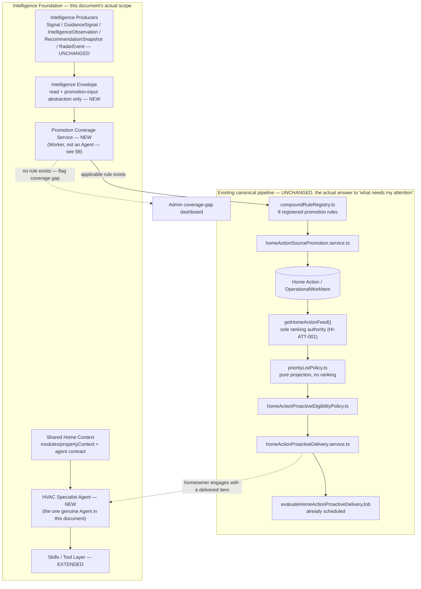
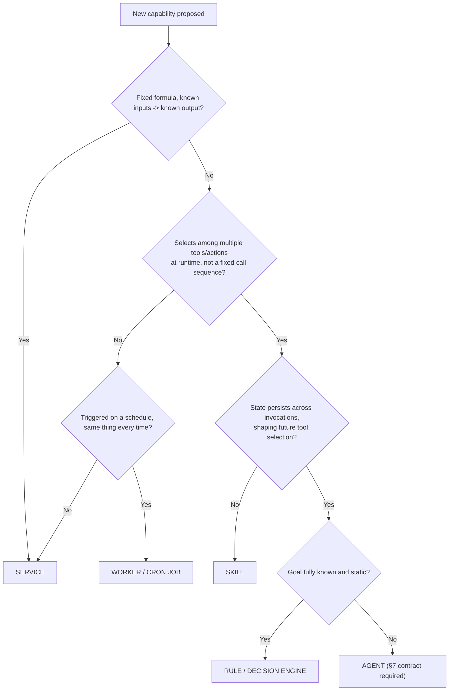
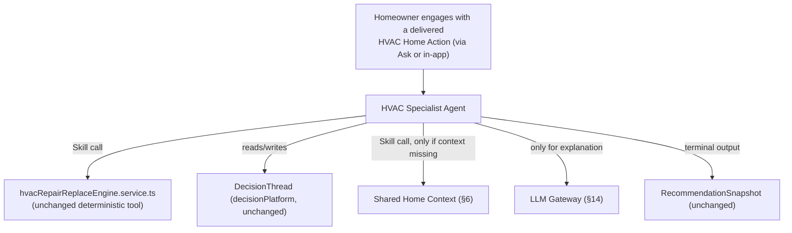
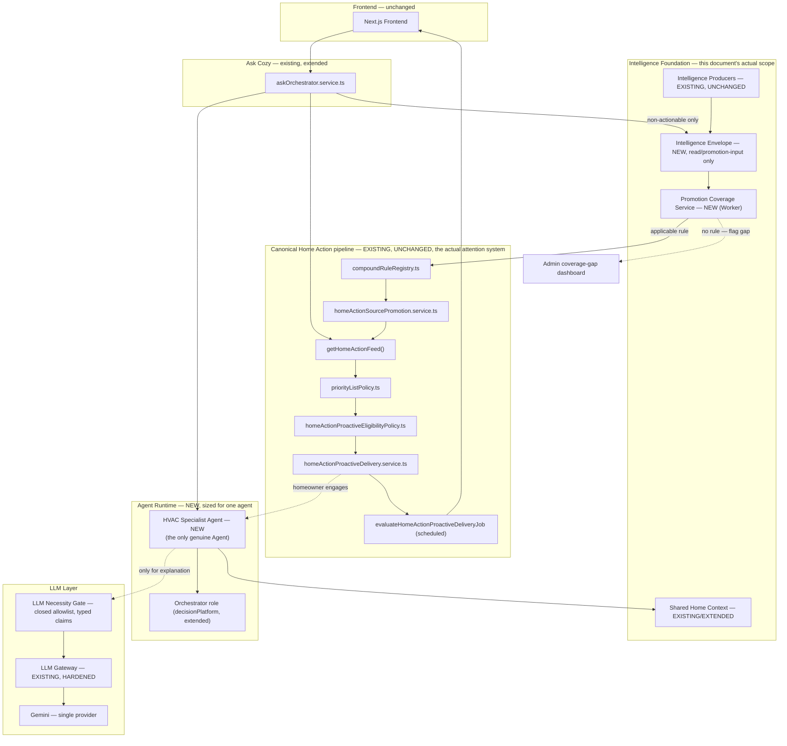
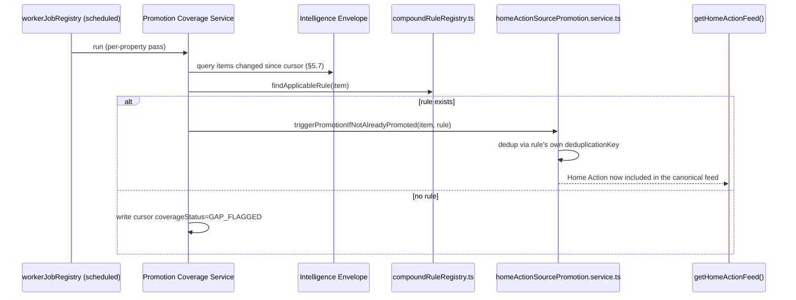
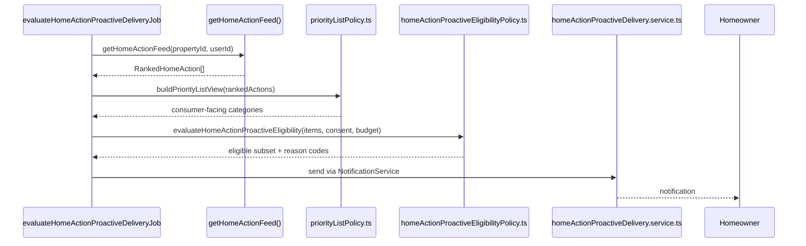
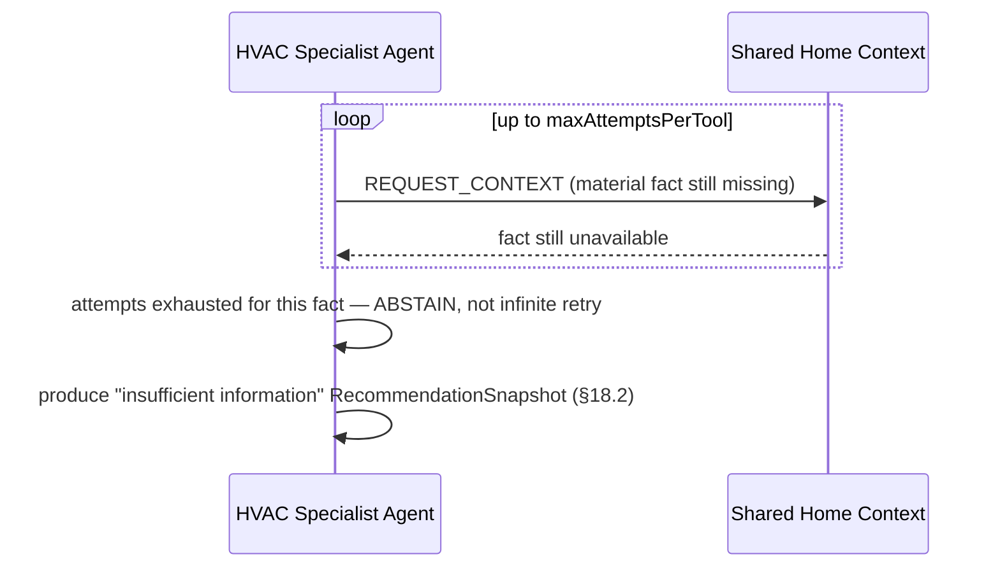
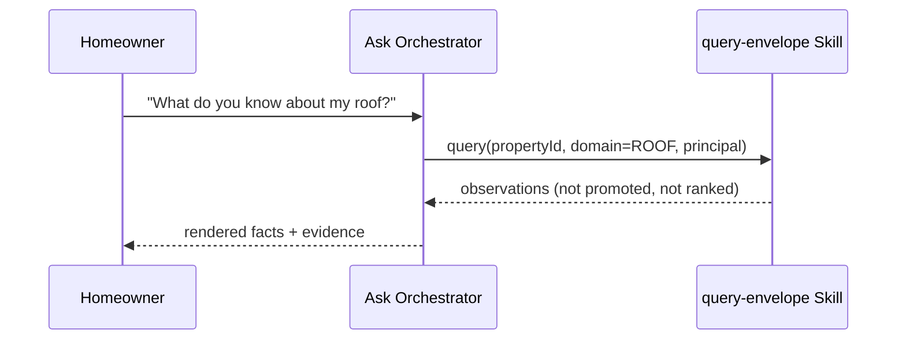

# C2C Intelligence & Agentic Evolution Architecture (Stage 3)

**Date:** 2026-08-26
**Status:** Draft target architecture — third revision, not yet build-approved.
**Grounding evidence:** [`docs/audits/AGENTIC_READINESS_AUDIT.md`](../audits/AGENTIC_READINESS_AUDIT.md) is the evidence base for architectural patterns and gaps at the time it was written. It is not an authoritative product-requirements source, and — critically for this revision — it is not exhaustive: a third external review found that this document had, twice, designed net-new proactive-attention infrastructure that duplicates or bypasses a real, already-shipped canonical pipeline the audit's evidence-density sampling didn't surface. See §1.1 for the requirements this revision is now grounded in, and the box below for what changed.
**Scope:** This document is the requested Stage 3 exercise. It is a target architecture and phased evolution plan, not an implementation. No code changes accompany this document.

> **What this revision corrects, and why it's the most consequential round yet.** C2C already has a live, shipped, cron-scheduled canonical pipeline that does most of what this document's first two drafts proposed building from scratch: `compoundRuleRegistry.ts`'s 8 registered rules promote qualifying intelligence into canonical Home Actions via `homeActionSourcePromotion.service.ts`; `getHomeActionFeed()` (`homeActions.service.ts`) is the sole homeowner-facing ranking authority, already consumed identically by Home, Fix, and Resolution Center per a 2026-08-25 convergence (`HOME_INTELLIGENCE_FUNCTIONAL_COMPLETENESS_FRD_AND_IMPLEMENTATION_PLAN.md`); `priorityListPolicy.ts` is a pure, non-ranking projection over that feed; `homeActionProactiveEligibilityPolicy.ts` and `homeActionProactiveDelivery.service.ts` already gate and send proactive notifications with real consent/budget/escalation logic; and `evaluateHomeActionProactiveDeliveryJob` **already runs on a schedule today**, registered in `workerJobRegistry.ts`. This is, concretely, an already-shipped answer to "tell me what needs my attention" for canonical Home Actions. Prior drafts of this document built a parallel `unifiedPriorityRanking.service.ts` and an "Attention Watcher Service" that either duplicated this pipeline or would have competed with it for ranking authority — both directly forbidden by `HI-ATT-001` and `ASK-INT-019` (§1.1). This revision retires both, narrows the Envelope to an upstream read/promotion-input role, and narrows this document's genuine net-new contribution to what the shipped pipeline does not yet do: closing intelligence-to-Home-Action coverage gaps, and adding multi-step decision support (the Specialist Agent) on top of an already-ranked, already-delivered item.

## 1.1 Requirements traceability

| Decision area | Authoritative source | What it requires |
|---|---|---|
| Single ranking authority | `docs/product/HOME_INTELLIGENCE_FUNCTIONAL_COMPLETENESS_FRD_AND_IMPLEMENTATION_PLAN.md`, HI-ATT-001 | "`getHomeActionFeed()` shall be the sole homeowner-facing ranking authority... [consumers] shall consume its ranked results or a shared lower-level canonical read service that produces the same results" — binding on §5, §10, §15; this document does not introduce a second ranker |
| Proactive delivery source | Same FRD, HI-ATT-004 | "Proactive delivery shall select from the canonical ranked feed and add only consent, fatigue, delivery-channel, quiet-hours, and escalation gates" — already implemented by `homeActionProactiveEligibilityPolicy.ts`/`homeActionProactiveDelivery.service.ts`; §11 does not re-implement this |
| Canonical projection rule | Same FRD, §7.1 | "[Surfaces] may apply channel-specific presentation limits and eligibility gates, but they shall not independently rescore or recreate the underlying recommendation" |
| Canonical identity rule | Same FRD, §7.2 | Every Home Action resolves to a stable `lineageId`, a stable source entity + version, an optional `OperationalWorkItem.workKey`, an optional `RecommendationSnapshot` — binding on §5.2's Envelope identity redesign |
| Ask ranking constraint | `docs/product/AI_HOME_CONCIERGE_ASK_INTELLIGENCE_INCREMENTAL_FRD.md`, ASK-INT-019 | "Rank only the canonical Home Actions feed using a versioned explainable policy" — Ask never ranks raw Envelope items |
| Guidance-priority scope | `HOME_INTELLIGENCE_FUNCTIONAL_COMPLETENESS_FRD_AND_IMPLEMENTATION_PLAN.md`, 2026-08-25 completion update | "The remaining `guidance-priority` registration explicitly describes its bounded use for Guidance-only journey deduplication... it does not re-rank canonical Home Actions" — this document does not retire or consolidate it further; it was never a competitor to `getHomeActionFeed()` after this convergence |
| Property/context authorization | `docs/product/AI_HOME_CONCIERGE_ASK_TRUST_ARCHITECTURE_ADDENDUM_FRD.md`, parent principle 2 | "Authentication, property access, household authorization, and audience applicability remain deterministic" — binding on §6 |
| Confirmation / material actions | Same FRD, parent principle 5 | "Material actions retain typed input, confirmation, authorization recheck, idempotency, and audit requirements" — binding on §19 |
| Canonical ownership | Same FRD, parent principle 4 | "Canonical services own facts, calculations, decisions, and mutations" — binding on §5's promotion-only write model |
| Rollout / cohort posture | Same FRD, §2.1 | "No rollout, migration, compatibility, or backfill plan is required for existing users because no real users exist" — binding on §7.2, §26 |
| Skill/agent capability boundaries | `docs/product/CONTRACTTOCOZY_SKILL_PLATFORM_FRD.md` | Skill admission rubric and confirmation/authorization preservation — binding on §9 |

---

## Table of Contents

1. [Executive Summary](#1-executive-summary)
2. [Architectural Principles](#2-architectural-principles)
3. [Current → Target Mapping](#3-current--target-mapping)
4. [C2C Intelligence Foundation](#4-c2c-intelligence-foundation)
5. [Intelligence Envelope Specification](#5-intelligence-envelope-specification)
6. [Shared Context Architecture](#6-shared-context-architecture)
7. [Agent Definition & Agent Contract](#7-agent-definition--agent-contract)
8. [Agent vs Service vs Skill Decision Framework](#8-agent-vs-service-vs-skill-decision-framework)
9. [Skills / Tool Architecture](#9-skills--tool-architecture)
10. [Orchestrator Architecture](#10-orchestrator-architecture)
11. [Attention Layer: The Promotion Coverage Service](#11-attention-layer-the-promotion-coverage-service)
12. [Specialist Agent Pattern](#12-specialist-agent-pattern)
13. [Agent Interaction Patterns](#13-agent-interaction-patterns)
14. [LLM Gateway & LLM Necessity Gate](#14-llm-gateway--llm-necessity-gate)
15. [Ranking & Interruption Architecture](#15-ranking--interruption-architecture)
16. [Trigger/Event Architecture](#16-triggerevent-architecture)
17. [State & Memory](#17-state--memory)
18. [Conflict Resolution](#18-conflict-resolution)
19. [Governance & Safety](#19-governance--safety)
20. [Observability](#20-observability)
21. [Learning & Outcome Feedback](#21-learning--outcome-feedback)
22. [Ask Cozy Integration](#22-ask-cozy-integration)
23. [Target Architecture Diagram](#23-target-architecture-diagram)
24. [Runtime Sequence Diagrams](#24-runtime-sequence-diagrams)
25. [Database / Persistence Changes](#25-database--persistence-changes)
26. [Implementation Phases](#26-implementation-phases)
27. [Migration / Refactoring Matrix](#27-migration--refactoring-matrix)
28. [Risks & Mitigations](#28-risks--mitigations)
29. [Success Metrics](#29-success-metrics)
30. [Final Recommendation](#30-final-recommendation)
31. [Critical Design Test](#31-critical-design-test)

---

## 1. Executive Summary

**What C2C should become architecturally:** a system where the intelligence C2C already computes reaches the homeowner through exactly one canonical path — `compoundRuleRegistry.ts` promotion → `getHomeActionFeed()` ranking → `priorityListPolicy.ts` projection → eligibility/delivery — and where this document's job is to widen what feeds *into* that path and deepen what happens *after* a homeowner engages with what it surfaces, never to build a second path alongside it.

**The central correction this revision makes:** the first two drafts of this document treated "build proactive attention" as greenfield work. It isn't. `evaluateHomeActionProactiveDeliveryJob` already runs on a schedule, already reads `getHomeActionFeed()`, already applies consent/budget/escalation gates, and already sends notifications — for every Home Action that a `compoundRuleRegistry.ts` rule has promoted. The genuine gap is narrower and less glamorous than "build an Attention Agent": **not every intelligence producer has a promotion rule yet**, and **once a homeowner engages with a promoted, ranked item, nothing today walks them through a multi-step decision** (compare options, explain tradeoffs, maintain a decision thread) the way `decisionPlatform` already can for HVAC specifically. Those two gaps — promotion coverage, and post-engagement decision depth — are what this document now scopes.

**What ships, in order:** an Intelligence Envelope, narrowed to a read/promotion-input abstraction over the 5 intelligence producers, with no ranking authority of its own (Phase 0) → a **Promotion Coverage Service** — not an agent, not a ranker, a scheduled Worker that evaluates Envelope items against `compoundRuleRegistry.ts` and flags (or, where a registered rule already exists, triggers) promotion, closing coverage gaps without inventing a second Home Action pipeline (Phase 1) → the HVAC Repair/Replace Specialist Agent, reusing the existing scoring engine and `DecisionThread` machinery, triggered when a homeowner engages with an already-ranked, already-delivered HVAC Home Action (Phase 2) → Ask Cozy wired to the same Envelope and canonical feed as its evidence source (Phase 3) → the extension pattern for additional specialists and additional promotion coverage (Phase 4).

**What this is not, still:** a plan to add a second LLM provider, an event bus, a vector database, or — now explicitly — a second ranking, eligibility, or delivery pipeline alongside the one C2C already ships. Every one of those is directly forbidden by an authoritative requirement (§1.1), not merely undesirable.

---

## 2. Architectural Principles

1. **Context-first, deterministic-first, LLM-last.** Unchanged from prior revisions — every agent exhausts C2C context, existing intelligence, deterministic rules/Skills, and agent coordination before an LLM call.
2. **C2C is the intelligent system; agents are controlled components inside it.**
3. **One ranking authority, full stop.** `getHomeActionFeed()` (or a shared lower-level canonical read service producing identical results, per HI-ATT-001) is the sole homeowner-facing ranking authority. No new component in this document ranks, re-ranks, or produces a competing priority score for anything that is or could be a canonical Home Action. This principle did not exist in prior revisions of this document, and its absence was the root cause this revision corrects.
4. **The Envelope promotes; it does not deliver.** Actionable intelligence reaches a homeowner only by being promoted into a canonical Home Action (via `compoundRuleRegistry.ts` + `homeActionSourcePromotion.service.ts`) and then flowing through the existing, unmodified ranking/eligibility/delivery pipeline. Non-actionable intelligence stays queryable through the Envelope (Ask, Home Briefing) without ever needing promotion.
5. **Adapters before schema migration; still no physical merge of the 5 native stores.**
6. **"Agent" is a specific claim, not a label.** Adaptive goal pursuit under bounded, governed autonomy over a genuinely unknown tool space — not scheduling, not background execution, not a fixed branch set. §8 is the enforcement mechanism.
7. **No LLM output becomes authoritative C2C state without validation and provenance.**
8. **Reuse before rebuild.** Every component in §27's matrix is EXISTING, EXTEND, REFACTOR, or WRAP AS TOOL unless a specific justification for NEW is given — and, per this revision, "NEW" is scrutinized hardest of all, because the last two drafts got this wrong for the single largest component in the document.
9. **No autonomy beyond what's earned.** Every agent targets Level 0–2 (§9.2 of the audit).
10. **Minimum necessary infrastructure.** No event bus, no second LLM provider, no vector database — and, as of this revision, no second ranking/eligibility/delivery pipeline either.
11. **An agent identity is attribution, never authority.** Every property read/write carries a real `ExecutionPrincipal`, re-authorized via the unchanged `resolvePropertyAccess`/`getPropertyContext` path.
12. **Every side effect is idempotent, and it reuses an existing idempotency mechanism before inventing a new one.** Home Action promotion already has deduplication keys (per `compoundRuleRegistry.ts`'s `deduplicationKey` field); proactive delivery already has its own budget/consent checks. This document does not build a parallel idempotency system for effects an existing canonical service already makes safe.

---

## 3. Current → Target Mapping

| Existing component | Current role | Target role | Change required |
|---|---|---|---|
| `compoundRuleRegistry.ts` (8 registered rules) + `homeActionSourcePromotion.service.ts` | Canonical promotion of qualifying intelligence into Home Actions | Unchanged authority; gains new rule entries as coverage gaps close (§11) | None to the mechanism; add rules for newly-covered producers |
| `homeActions.service.ts`'s `getHomeActionFeed()` | Sole homeowner-facing ranking authority (HI-ATT-001), already consumed identically by Home/Fix/Resolution Center | Unchanged — remains the only ranker in this architecture | None |
| `priorityListPolicy.ts` | Pure, non-ranking projection of the feed into consumer categories (DO_NOW/PLAN_SOON/WATCH/OPTIONAL/NO_ACTION) | Unchanged | None |
| `homeActionProactiveEligibilityPolicy.ts` + `homeActionProactiveDelivery.service.ts` + `evaluateHomeActionProactiveDeliveryJob` | Already-shipped, cron-scheduled proactive notification pipeline with consent/budget/escalation gates | Unchanged — this **is** the "Attention" system for canonical Home Actions | None |
| `modules/propertyContext` | Assembles ~20 typed fact scopes; 27+ callers | Agent-facing context contract (§6) | Add a stable, versioned, budget-aware read wrapper — no internal rewrite |
| `Signal`, `GuidanceSignal`, `IntelligenceObservation`, `RecommendationSnapshot`, `RadarEvent` | 5 disjoint intelligence schemas | Read-only through the Intelligence Envelope (§5); their existing promotion paths into `compoundRuleRegistry.ts` inputs (where they have one) are unchanged | 5 read adapters; no schema change, no new write path |
| `decisionPlatform` (DecisionThread, RecommendationSnapshot, `decisionFamilyAdapterRegistry`) | Real lifecycle machinery, 1 of 7 families (HVAC) does real composition | Backing for the HVAC Specialist Agent's decision-support conversation (§12) | Extend, don't replace |
| Two disagreeing HVAC verdict engines | Acknowledged divergence, `SOURCE_CARD_VERDICT_DIVERGENCE` | One authoritative verdict | Reconcile in Phase 0 — a data-quality fix |
| `services/skills/` (19 manifests) | Closest existing analog to an agent-tool manifest | The Skill/Tool layer agents call (§9) | Add an autonomy-level tag; no runtime rewrite |
| `aiRequestGovernance.service.ts` | Routes all 25 Gemini invocation sites | LLM Gateway (§14) | Harden the interface; no second provider |
| `askOrchestrator.service.ts` | Deterministic NLU router; `REMOTE_FALLBACK` unwired | Ask Cozy's entry point into the Envelope + canonical feed (§22) | Wire `REMOTE_FALLBACK`; add Specialist Agent as a routable target |
| BullMQ + node-cron + `workerJobRegistry.ts` + `CronJobLock` | Most mature layer in the codebase; already runs `evaluateHomeActionProactiveDeliveryJob` on schedule | Execution substrate for the new Promotion Coverage Service job and Specialist Agent runs | Add one new job type to the existing registry |
| pino/Loki + Prometheus + OpenTelemetry | Structured logging, worker/AI cost metrics | End-to-end observability for the Coverage Service and Specialist Agent (§20) | Extend metric namespaces |

---

## 4. C2C Intelligence Foundation



| Foundation piece | Existing seed | What's new |
|---|---|---|
| Canonical Home Action pipeline | `compoundRuleRegistry.ts` → `getHomeActionFeed()` → `priorityListPolicy.ts` → eligibility → delivery → cron | **Nothing.** Documented here as the authority everything else in this document defers to. |
| Intelligence Envelope | 5 disjoint schemas | A read + promotion-input contract with no ranking authority (§5) |
| Promotion Coverage Service | None | New scheduled Worker; evaluates Envelope items against the existing rule registry; never ranks, never delivers (§11) |
| Skills / Tool layer | `services/skills/` | Autonomy-level tag; HVAC engine wrapped as a callable tool |
| HVAC Specialist Agent | `decisionPlatform`, `hvacRepairReplaceEngine.service.ts` | The genuine multi-step decision-support conversation (§12) |

---

## 5. Intelligence Envelope Specification

### 5.1 Design stance, narrowed twice now

Two corrections compound here. First (round 2): no generic cross-model write contract survives the schema — `Signal` has no status, `RecommendationSnapshot` is immutable, `RadarEvent` is global while dismissal is property-scoped. Second (round 3, this revision): **the Envelope has no ranking or delivery authority at all.** It is a read abstraction over the 5 native producers, used for exactly two purposes:

1. Giving `compoundRuleRegistry.ts`-style promotion rules one uniform input contract to evaluate against, instead of each rule needing bespoke per-producer wiring.
2. Giving Ask Cozy and Home Briefing a uniform way to surface non-actionable observations that have not been (and may never need to be) promoted into a Home Action.

It has no write-back to producers beyond what §5.5 describes, no consumer-facing dismissal/snooze state (Home Actions already have a full lifecycle — `homeActionUsefulnessFeedback.service.ts`, `getSuppressedHomeActionIds`, and the HI-ATT-005 command policy — and this document does not build a second one), and no per-user overlay. What it needs instead is much smaller: a per-item **evaluation cursor**, tracking whether the Promotion Coverage Service has already evaluated a given native record's current revision against the rule registry.

### 5.2 Envelope identity — lineage, revision, and content change, kept separate

Round 2 conflated identity with revision: `EnvelopeKey` embedded `sourceRecordId`, but an immutable revision's successor (a new `RecommendationSnapshot` row via `supersedesSnapshotId`, a new `Signal` row at a bumped `version`) has a *different* record ID and therefore a *different* key under that scheme — supersession became undetectable by construction. The Home Action canonical identity rule already solves this correctly (§1.1: "a stable `lineageId`... a stable source entity and version") — reused here rather than reinvented:

```ts
type LineageKey = string;    // stable across every revision of the same logical recommendation/signal —
                              // reuses the native lineageId where the producer has one (RecommendationSnapshot's
                              // supersession chain, GuidanceSignal's duplicateGroupKey), or is derived the same
                              // way a promotion rule already derives it (compoundRuleRegistry.ts's own
                              // deduplicationKey field is exactly this concept, per-rule) where it doesn't
type RevisionKey = string;   // `${sourceModel}:${sourceRecordId}` — identifies the exact native row/revision
type EnvelopeKey = string;   // `${type}:${propertyId}:${RevisionKey}` — this specific revision's Envelope identity
```

`nativeRevisionToken` (§5.7) detects in-place changes *to a given revision* (e.g. a mutable field on a row that doesn't create a new record) — a narrower, complementary concern to `LineageKey`'s cross-revision stability. Supersession is detected by comparing `LineageKey`s across reads, not by comparing `EnvelopeKey`s, which are expected to change on every new revision.

### 5.3 Field contract

```ts
interface IntelligenceEnvelopeItem {
  envelopeKey: EnvelopeKey;
  lineageKey: LineageKey;
  nativeRevisionToken: string;
  semanticCorrelationKey?: string;   // for §18 reconciliation only — see 18.1's tightened rule

  type: EnvelopeType;
  domain: EnvelopeDomain;
  subject: { propertyId: string; userId?: string; entityRef?: string };

  source: { producer: string; sourceModel: string; sourceRecordId: string };
  provenance: { generatedBy: "DETERMINISTIC" | "LLM" | "EXTERNAL_INGEST" | "HYBRID"; method: string; modelVersion?: string };

  confidence: number | null;
  evidence: EvidenceRef[];
  severity: Severity | null;

  // No importanceScore, no priorityScore, no ranking field of any kind (Principle 3).
  // Ranking happens only after promotion, only inside getHomeActionFeed().

  freshness: { computedAt: string; ttl: string | null; staleAfter: string | null };
  nativeStatus: string | null;   // read-through only, per producer (§5.6)

  // Promotion surface — OPTIONAL, and this is the only "action-adjacent" field the Envelope carries
  promotionCandidate?: {
    applicableRuleId?: string;      // set once the Coverage Service (§11) finds a matching compoundRuleRegistry entry
    coverageStatus: "COVERED" | "GAP_FLAGGED" | "NOT_APPLICABLE";
  };

  createdAt: string;
  updatedAt: string;
}
```

### 5.4 Mandatory vs optional

| Field group | Mandatory? | Rationale |
|---|---|---|
| `envelopeKey`, `lineageKey`, classification, subject | Mandatory | Identity and supersession both require it, per §5.2 |
| `source` / `provenance` | Mandatory | Provenance is structurally required (Principle 7) |
| `confidence` / `evidence` | Mandatory field, nullable value | Preserves §18.2's abstention requirement |
| `severity` | Mandatory field, nullable value | Not every item is severity-typed |
| `freshness` | Mandatory | Reuses `IntelligenceConsumerCurrentness` |
| `nativeStatus` | Mandatory field, nullable value | Read-through only, `null` for producers with no status (`Signal`) |
| `promotionCandidate` | Optional | Populated by the Coverage Service, never by the producer |

### 5.5 Per-subsystem adapter mapping

| Native store | Envelope `type` | `nativeStatus` source | Fidelity note |
|---|---|---|---|
| `Signal` | `SIGNAL` | Always `null` (no status field) | 9 hardcoded keys map to a fixed `domain` subset |
| `GuidanceSignal` | `GUIDANCE` | `GuidanceSignal.status` (read-through) | `severity` derived from `severityScore` (Int, 0–100) + `confidenceScore` (Decimal(5,4)) — corrected mapping |
| `IntelligenceObservation` | `OBSERVATION` | Its own status field | Often `confidence: null` pre-scoring |
| `RecommendationSnapshot` | `RECOMMENDATION` | Always `null` (immutable) | Supersession is a new `LineageKey`-sharing item, never a status change |
| `RadarEvent` | `RADAR_EVENT` | `PropertyRadarMatch.lifecycleStatus`, **never** the global `RadarEvent.status` | Identity anchored to `PropertyRadarMatch`/`PropertyRadarCompoundInsight` (property-scoped), not the global row |

### 5.6 What the Envelope does NOT do (this revision's binding constraint)

- It does not rank. It does not compute anything resembling `importanceScore`. `getHomeActionFeed()` does that, for canonical Home Actions, exclusively (Principle 3).
- It does not deliver, notify, or track per-homeowner dismissal/snooze. `homeActionProactiveEligibilityPolicy.ts`/`homeActionProactiveDelivery.service.ts`/the existing lifecycle-command policy (HI-ATT-005) do that, exclusively.
- It does not write producer state beyond what an existing domain-owned command already permits (unchanged from round 2's finding — `Signal`/`RecommendationSnapshot` have no lifecycle to transition at all).

### 5.7 Evaluation cursor (replaces round 2's `EnvelopeConsumerState`)

The only new persistence the Envelope itself requires — narrower than round 2's overlay because there is no per-user consumer workflow to track anymore:

```ts
interface EnvelopeEvaluationCursor {
  envelopeKey: EnvelopeKey;
  lastEvaluatedRevisionToken: string;   // nativeRevisionToken at last Coverage Service pass
  lastEvaluatedAt: string;
  coverageStatus: "COVERED" | "GAP_FLAGGED" | "NOT_APPLICABLE";
  applicableRuleId: string | null;
}
```

One row per `envelopeKey`, no `userId`, no nullable-uniqueness problem (round 2's finding is moot here because there is no household/user dimension to this cursor at all — coverage evaluation is per-property-intelligence-item, not per-homeowner). No idempotency-key machinery is needed either: re-evaluating an already-covered item is a harmless no-op read, and triggering promotion for an already-promoted item is guarded by `compoundRuleRegistry.ts`'s own existing `deduplicationKey` semantics on the promotion side (unchanged, reused, not reinvented — Principle 12).

---

## 6. Shared Context Architecture

### 6.1 Why this, not direct Prisma access

Unchanged from prior revisions: `modules/propertyContext` already does the hard part; the gap is contract stability for a new class of caller (the Specialist Agent), not capability.

### 6.2 The agent-facing contract

```ts
type ExecutionPrincipal =
  | { kind: "HOMEOWNER_SESSION"; userId: string }
  | { kind: "SYSTEM_PURPOSE"; grantedByUserId: string; purpose: "PROMOTION_COVERAGE_EVALUATION"; grantedAt: string };

interface AgentContextRequest {
  propertyId: string;
  principal: ExecutionPrincipal;     // resolves to getPropertyContext's actor.userId — the real authorization gate
  requestingAgentId: string;          // attribution only, never authority
  scopes: PropertyContextScope[];
  maxFacts?: number;
  maxLatencyMs?: number;
}
```

**[verified]** `getPropertyContext(propertyId, actor: PropertyContextActor, request, ...)` calls `dependencies.authorize(actor.userId, propertyId)` (→ `resolvePropertyAccess`) before reading a single fact, throwing `PropertyContextAccessDeniedError` on failure — this wrapper is passed straight through, never bypassed.

### 6.3 What agents must NOT do

- Import Prisma clients directly for property/homeowner facts.
- Request unscoped context.
- Treat `requestingAgentId` as authorization.
- Rank anything (Principle 3) or send a homeowner-facing notification outside the existing delivery pipeline (Principle 4).

---

## 7. Agent Definition & Agent Contract

### 7.1 Formal definition

> **A C2C Agent is a component that pursues a bounded, stated goal by adaptively selecting among multiple registered tools or actions, against subject state that is not fully known when it starts, with every state transition logged, budgeted, and revocable.**

### 7.2 Agent Contract

```ts
interface AgentDefinition {
  agentId: string;
  name: string;
  responsibility: string;
  supportedDomains: EnvelopeDomain[];
  acceptedTriggers: AgentTrigger[];     // USER_INITIATED | HOME_ACTION_ENGAGEMENT | SPECIALIST_HANDOFF

  requiredContext: PropertyContextScope[];
  allowedSkills: string[];
  prohibitedSkills?: string[];

  executionMode: "SYNC" | "ASYNC_LONG_RUNNING";
  stateRequirements: { persistsAcrossInvocations: boolean; stateShape?: string };

  outputContract: {
    producerCommandsAllowed: string[];  // domain-owned commands this agent may call — never a generic writer
    producesRecommendation: boolean;    // via RecommendationSnapshot — never a new ranking or delivery record
    maxAutonomyLevel: 0 | 1 | 2;
  };

  budgets: { maxContextFactsPerRun: number; maxLLMInvocationsPerRun: number; maxLLMCostPerRunUsd: number; maxExecutionMsPerRun: number; maxLoopIterations: number };

  killSwitch: string;
  featureFlag: string;
  releaseState: "DEV" | "EVAL_APPROVED" | "ENABLED" | "DISABLED";

  retryPolicy: { maxAttempts: number; backoffMs: number };
  timeoutMs: number;
  escalationPolicy: { onLowConfidence: "ABSTAIN" | "ASK_HOMEOWNER"; onToolFailure: "RETRY" | "ABSTAIN" | "ESCALATE_TO_HUMAN_REVIEW"; onLoopBudgetExhausted: "ABSTAIN_WITH_PARTIAL_RESULT" };

  auditRequirements: { logEveryToolCall: true; logEveryStateTransition: true };
  safetyLevel: "RECOMMEND" | "DRAFT";
  evaluationSuiteId: string;
}
```

`maxLoopIterations` and `onLoopBudgetExhausted` are new in this revision (§12.3 explains why). `acceptedTriggers` dropped `ENVELOPE_CHANGE`/`SPECIALIST_DISCOVERY` — the only agent in this document (§12) is triggered by homeowner engagement with an already-delivered canonical item, not by an Envelope event.

### 7.3 What's reused vs. new

Unchanged from round 2: risk policy, context budget, kill-switch/feature-flag convention, and evaluation-suite requirement are all reused from `services/skills/skill.contract.ts`; `releaseGate.service.ts`'s cohort mechanism remains available but not required (§1.1's rollout-posture citation).

---

## 8. Agent vs Service vs Skill Decision Framework



| Kind | C2C examples |
|---|---|
| **Service** | `getHomeActionFeed()`, `hvacRepairReplaceEngine.service.ts`, `priorityListPolicy.ts`, any Envelope adapter |
| **Worker / cron job** | `evaluateHomeActionProactiveDeliveryJob` (existing), the **Promotion Coverage Service** (new, §11) — both fixed evaluate-against-registry logic, no adaptive judgment |
| **Skill / Tool** | Any of the 19 existing `SkillDefinition`s |
| **Rule / decision engine** | `compoundRuleRegistry.ts`'s 8 promotion rules |
| **Agent** | The HVAC Specialist Agent (§12) — the only one this document ships |

**Explicit non-agents this document is careful not to mislabel, having mislabeled the Promotion Coverage Service's predecessor twice already:** the Coverage Service evaluates a fixed rule registry — it does not decide *whether* to promote (the registry does), only whether a rule currently applies. That is Rule-adjacent Worker behavior, not Agent behavior, even though it runs continuously and touches every intelligence producer.

---

## 9. Skills / Tool Architecture

Unchanged in substance from round 2: `services/skills/` is extended with an `autonomyLevel` field; existing manifests (HVAC repair/replace, coverage, maintenance, document-promotion, refinance, ownership-cost, property-record, household/seller-preparation/buyer-closing) are reused directly by the Specialist Agent. **Agent → Skill/Tool → Domain Service, never Agent → Prisma.** The one Skill this document adds is `query-envelope` (read-only, for Ask's non-actionable-observation use case, §22) — there is no `query-canonical-feed` Skill, because Ask calls `getHomeActionFeed()` the same way every other canonical surface already does, not through a Skill indirection.

---

## 10. Orchestrator Architecture

### 10.1 Scope, narrowed

The orchestrator's footprint shrinks further this revision: it no longer routes Envelope-detected items to specialists (there is no Attention Agent doing that routing anymore — see §11). Its entire remaining job is the HVAC Specialist Agent's own multi-step workflow:

| Belongs to orchestration | Does NOT belong to orchestration |
|---|---|
| Sequencing the Specialist Agent's `selectNextTool` loop (§12.3) | Domain scoring (stays in `hvacRepairReplaceEngine.service.ts`) |
| Managing the loop's execution/iteration budget | Home Action ranking (stays in `getHomeActionFeed()`) |
| Handling tool-call failures and retries | Promotion (stays in `compoundRuleRegistry.ts`/`homeActionSourcePromotion.service.ts`) |
| Detecting the loop's completion or abstention | Notification transport (stays in the existing delivery pipeline) |

### 10.2 Reuse of `decisionPlatform`

Unchanged: `DecisionThread` lifecycle becomes the Specialist Agent's execution record; `decisionFamilyAdapterRegistry` gains an eighth family for agent-driven handoffs, once a second specialist exists (§26 Phase 4).

---

## 11. Attention Layer: The Promotion Coverage Service

### 11.1 What this section is not, anymore

Rounds 1 and 2 designed an "Attention Watcher Service"/"Attention Agent" that ranked Envelope items and proposed them for interruption. That entire responsibility is retired in this revision — it already exists, unmodified, as `getHomeActionFeed()` → `priorityListPolicy.ts` → `homeActionProactiveEligibilityPolicy.ts` → `homeActionProactiveDelivery.service.ts` → `evaluateHomeActionProactiveDeliveryJob`. This document does not rebuild it, extend it, or sit in front of it.

### 11.2 What remains: closing promotion-coverage gaps

The one real gap the canonical pipeline has: it only ever sees intelligence that a `compoundRuleRegistry.ts` rule has already promoted into a Home Action. If a producer's output has no covering rule, it is invisible to `getHomeActionFeed()` — not wrong, just not yet connected. The Promotion Coverage Service's entire job:

```ts
async function evaluatePromotionCoverage(propertyId: string): Promise<void> {
  const items = await queryEnvelope({ propertyId, changedSince: /* per-item cursor, §5.7 */ });
  for (const item of items) {
    const rule = findApplicableRule(item, COMPOUND_RULE_REGISTRY);   // pure lookup against the existing registry
    if (rule) {
      await triggerPromotionIfNotAlreadyPromoted(item, rule);         // delegates to homeActionSourcePromotion.service.ts,
                                                                        // which owns its own dedup via the rule's deduplicationKey
      await writeCursor(item.envelopeKey, { coverageStatus: "COVERED", applicableRuleId: rule.ruleId });
    } else {
      await writeCursor(item.envelopeKey, { coverageStatus: "GAP_FLAGGED", applicableRuleId: null });
    }
  }
}
```

This is a **Worker**, not an Agent, per §8: it evaluates a fixed registry, makes no adaptive judgment, and holds no cross-invocation goal beyond "keep the cursor current." It runs on a schedule — the same poll-based pattern the audit already found sufficient for every domain examined (weather, refinance, maintenance; nothing needs sub-minute reaction time) — via a new entry in `workerJobRegistry.ts`, exactly like `evaluateHomeActionProactiveDeliveryJob` already does. No `DomainEvent`/transactional-outbox machinery is needed for this, unlike round 2's design, because there is no real-time side effect to make safe — promotion triggering delegates entirely to `homeActionSourcePromotion.service.ts`'s own existing dedup, and a duplicate scheduled pass is a harmless no-op re-evaluation by construction (Principle 12).

### 11.3 `GAP_FLAGGED` items are a product decision, not an automatic promotion

The Coverage Service never invents a promotion rule. A `GAP_FLAGGED` item surfaces on an admin dashboard (§20) for a human to decide whether it warrants a new `compoundRuleRegistry.ts` entry — consistent with Principle 4 (canonical services own promotion) and with the registry's own existing extension model (each entry already documents `applicability`, `materiality`, `safetyTier`; a human-authored rule, not an inferred one, is what the registry format itself demands).

---

## 12. Specialist Agent Pattern

### 12.1 Trigger, corrected

The HVAC Specialist Agent is no longer handed an item by an Attention Agent (there isn't one). It is triggered when a homeowner engages with an already-ranked, already-delivered HVAC-domain Home Action — via Ask Cozy ("why are you recommending replacement?", "help me decide"), or a "get help deciding" affordance on the Home Action itself. This is Pattern B-shaped (§13), not Pattern A.



### 12.2 Reusable pattern — dynamic tool selection, unchanged from round 2

The `selectNextTool` loop (REQUEST_CONTEXT / REQUEST_DOCUMENT / SCORE / EXPLAIN / SCHEDULE_FOLLOW_UP) is retained from round 2 — it genuinely satisfies §7.1's adaptive-tool-selection test, which the retired Attention layer never did.

### 12.3 Loop safety — new in this revision, per external review

Round 2's loop had no termination guarantee: `REQUEST_CONTEXT` could re-fire indefinitely while a fact stays missing, and `homeownerDisputedInput`/`homeownerNeedsTime` had no clearing transition, risking a livelock. Fixed:

```ts
interface SpecialistRunState {
  toolAttempts: Record<SpecialistTool, number>;
  maxAttemptsPerTool: number;              // e.g. 2 — a fact that's still missing after 2 requests is "attempted but unresolved," not silently retried forever
  loopIterations: number;
  maxLoopIterations: number;               // from AgentDefinition.budgets.maxLoopIterations
  homeownerDisputedInput: boolean;         // cleared explicitly by the SCORE transition once re-run
  homeownerNeedsTime: boolean;             // cleared explicitly when the scheduled follow-up tick actually fires
}

function selectNextTool(state: SpecialistRunState): SpecialistTool | "DONE" | "ABSTAIN" {
  if (state.loopIterations >= state.maxLoopIterations) return "ABSTAIN";
  if (state.missingFacts.some((f) => isMaterialToScoring(f) && state.toolAttempts.REQUEST_CONTEXT < state.maxAttemptsPerTool))
    return "REQUEST_CONTEXT";
  if (state.missingFacts.some((f) => isDocumentDerivable(f) && state.toolAttempts.REQUEST_DOCUMENT < state.maxAttemptsPerTool))
    return "REQUEST_DOCUMENT";
  if (state.missingFacts.some(isMaterialToScoring)) return "ABSTAIN";  // attempted, still unresolved — §18.2's abstention, not an infinite retry
  if (!state.latestScore || state.homeownerDisputedInput) return "SCORE";  // SCORE's own handler clears homeownerDisputedInput on completion
  if (!state.narrated) return "EXPLAIN";
  if (state.homeownerNeedsTime) return "SCHEDULE_FOLLOW_UP";           // the follow-up job itself clears homeownerNeedsTime when it fires
  return "DONE";
}
```

### 12.4 `SCHEDULE_FOLLOW_UP` and the autonomy ceiling

A reviewer correctly flagged that scheduling a future re-evaluation is a reversible *internal* action — arguably Level 3 (Execute-reversible), not the Level 0–2 ceiling this document holds every agent to. Resolution: `SCHEDULE_FOLLOW_UP` is reclassified as a **Draft** action (Level 2) — the agent prepares the scheduled tick but a homeowner-visible confirmation ("we'll check back with you in a week — sound good?") is required before it's committed, via the same confirmation-recheck requirement the Ask Trust FRD's parent principle 5 already mandates for material actions (§1.1). This keeps the agent inside its declared ceiling rather than quietly exceeding it.

---

## 13. Agent Interaction Patterns

### Pattern A — Promotion coverage (Worker, not agent-mediated)
```
Property/Event Change → Intelligence Producer → Intelligence Envelope
  → Promotion Coverage Service (scheduled, §11) → compoundRuleRegistry.ts (if applicable)
  → homeActionSourcePromotion.service.ts → Home Action → [unchanged canonical pipeline] → Homeowner
```

### Pattern B — User-initiated engagement (the Specialist Agent's actual trigger)
```
Homeowner engages with a delivered Home Action (via Ask Cozy or in-app)
  → HVAC Specialist Agent → selectNextTool loop (§12) → deterministic scoring + LLM explanation (only if needed)
  → Answer / DecisionThread
```

### Pattern C — Ask Cozy, non-actionable observation
```
User → Ask Cozy → query-envelope Skill (read-only) → rendered observation
  (never enters the Home Action ranking — Principle 3/4)
```

### Pattern D — Direct deterministic execution
```
Trigger → deterministic service/worker → result
```
Unchanged — this is the default for the large majority of C2C's existing services, and now explicitly includes the entire canonical Home Action pipeline and the Promotion Coverage Service itself.

### Pattern E — Multi-specialist decision (Phase 4+, only when a second specialist exists)
```
Orchestrator → multiple Specialist Agents produce independent RecommendationSnapshots
  → orchestrator reconciles via §18's precedence rules → one final recommendation
```

No free-form agent-to-agent conversation anywhere in this document.

---

## 14. LLM Gateway & LLM Necessity Gate

### 14.1 Gateway design

Unchanged from round 2: extends `aiRequestGovernance.service.ts`; hardens structured-output verification, adds distributed rate limits, caching, safety filtering, a prompt/version registry, per-agent budgets, and generalized response validation (14.2 below). No second provider.

### 14.2 The Necessity Gate, and a correction to "traces to evidence"

Round 2's closed-`LLMPurpose`-allowlist design is retained, updated for the surviving purposes:

```ts
enum LLMPurpose {
  EXPLAIN_SPECIALIST_TRADEOFF,           // §12's EXPLAIN tool — the primary use case now
  ASK_COZY_CLARIFICATION,
  ASK_COZY_REMOTE_FALLBACK_SYNTHESIS,
}
```
(`NARRATE_MULTI_ITEM_ATTENTION_SUMMARY` is retired along with the Attention layer it served — no component in this document narrates across multiple Envelope items anymore.)

**A reviewer correctly identified a remaining gap: checking that an LLM-supplied `evidenceRef` was among the refs passed into the prompt proves the reference is *real*, not that the generated *text* is actually supported by it — a model can attach a legitimate reference to a false claim, and a `COMPARISON` claim can't be reconstructed from a single reference alone.** Fixed by moving from "validate generated text against a reference" to "the LLM never generates the claim's substance at all":

```ts
interface TypedClaim {
  claimType: "SEVERITY_STATEMENT" | "DEADLINE_STATEMENT" | "COST_COMPARISON";
  factRefs: EvidenceRef[];              // 2 for COST_COMPARISON, 1 otherwise — enforced by claimType
  comparisonOperator?: "GREATER_THAN" | "LESS_THAN" | "APPROXIMATELY_EQUAL";  // required for COST_COMPARISON
}
```

The LLM's structured-output schema constrains it to return `TypedClaim[]` — `claimType`, `factRefs`, and (where applicable) `comparisonOperator` — never prose, and never a value. The Gateway resolves each `factRef` to its actual stored value and **computes the comparison and the rendered text deterministically**, from the resolved facts, using the LLM's role limited to *selecting which claim shape and which facts are relevant to explain* — not to stating what the facts say or what the comparison result is. If a claim's substance cannot be reconstructed from resolved evidence without trusting model-generated prose or a model-generated number, the Gateway does not accept that `claimType` into the allowlist at all. This is the concrete difference between "referential" validation (round 2, insufficient) and this revision's design, where the model never has the opportunity to assert an unsupported fact because it never asserts facts — it selects and points.

---

## 15. Ranking & Interruption Architecture

**This section is now almost entirely "reused, unchanged" rather than "designed."** `getHomeActionFeed()` is the sole ranking authority (Principle 3, HI-ATT-001); this document introduces no `unifiedPriorityRanking.service.ts`, no `importanceScore`, no second ranking factor set. `priorityListPolicy.ts` remains a pure, non-ranking projection (`buildPriorityListView`), confirmed unchanged. `homeActionProactiveEligibilityPolicy.ts` and `homeActionProactiveDelivery.service.ts` remain the sole owners of consent, channel policy, budgets, and delivery eligibility — this document does not expand `priorityListPolicy.ts` into a second eligibility owner, correcting round 2's error of assigning `computeDeliveryEligibility()` to it.

The only ranking-adjacent decision left in this document is the Coverage Service's `findApplicableRule` lookup (§11.2) — a fixed registry match, not a scored ranking, and it never produces anything that reaches a homeowner directly; it only ever triggers the existing promotion path, after which `getHomeActionFeed()` ranks the resulting Home Action exactly as it ranks every other one.

---

## 16. Trigger/Event Architecture

| Requirement | Mechanism | Evidence |
|---|---|---|
| Promotion Coverage Service must periodically re-evaluate | Scheduled Worker job, same pattern as the existing `evaluateHomeActionProactiveDeliveryJob` | **[verified]** that job is already registered in `workerJobRegistry.ts` and runs on a schedule today |
| Promotion triggering must be safe to re-run | Delegates to `homeActionSourcePromotion.service.ts`'s own dedup, keyed by each rule's `deduplicationKey` | **[verified]** every `compoundRuleRegistry.ts` entry already declares one |
| `DomainEventType` — does this document add a new enum value? | **No.** **[verified]** `DomainEventType` (`schema.prisma`) is a fixed enum of domain-specific values with no `ENVELOPE_CHANGE`; this document no longer needs one, since the Coverage Service is poll-based, not event-triggered | Round 2 proposed adding this trigger and using `DomainEvent` as a transactional outbox — both retired along with the real-time Attention design they served |

No Kafka, no Redis Streams, no new event infrastructure, no `DomainEvent` schema change. This document's event/trigger footprint is now smaller than round 2's, not larger — a direct consequence of discovering that the delivery side was never this document's job to build.

---

## 17. State & Memory

| State category | Where it lives |
|---|---|
| **C2C authoritative state** | Unchanged — existing 506 Prisma models |
| **Intelligence state** | Unchanged native subsystems + the Envelope's read adapters |
| **Promotion evaluation cursor** | New, narrow: `EnvelopeEvaluationCursor` (§5.7) — no per-user dimension |
| **Home Action lifecycle state** (dismissal, snooze, completion) | Unchanged — already fully owned by the existing Home Action command policy (HI-ATT-005); this document does not duplicate it |
| **Specialist Agent execution state** | New: `AgentRun`/`AgentState`, scoped to the one genuine agent (§25) |
| **Conversation context** | Unchanged — Ask's existing session state |
| **Historical outcomes** | Unchanged — `OutcomeObservation` |

No vector database — unchanged reasoning from prior revisions.

---

## 18. Conflict Resolution

### 18.1 Conflict detection, tightened to avoid false positives

A reviewer correctly identified that round 2's rule — same `subject`+`domain`, no shared `semanticCorrelationKey`, therefore `CONFLICTED` — would falsely flag, say, an HVAC maintenance-due item and an HVAC warranty-expiration item as conflicting, when they address entirely different propositions and simply share a domain. Fixed: conflict requires a shared **claim identity**, not merely a shared domain.

```ts
interface QualifiedClaim {
  claimKey: string;   // e.g. "hvac-repair-replace-verdict" — a specific proposition, not a domain
  verdict: string;
}
```

Two items are `CONFLICTED` only when they share a `claimKey` (the same proposition — e.g. both are "the" HVAC repair/replace verdict for this property) and their verdicts are incompatible. Absence of a shared `claimKey` means **relationship unknown**, not conflicted — items with no correlation simply coexist as independent, unrelated intelligence. This is a narrower, more conservative rule than round 2's, and it is the one that actually matches the audit's original HVAC example (two engines computing *the same* repair/replace verdict and disagreeing) rather than over-generalizing from it.

### 18.2 Abstention remains first-class

Unchanged: **"C2C does not currently have enough reliable information to recommend this"** is a valid, structurally supported outcome — now additionally reached by the Specialist Agent's loop-budget-exhaustion path (§12.3) and the Coverage Service's `GAP_FLAGGED` state (§11.3), both new, explicit non-answers rather than forced ones.

---

## 19. Governance & Safety

Unchanged in substance from round 2 — kill switch/feature-flag convention, risk classification, capability allow-list, budgets (now including `maxLoopIterations`), evaluation-suite gate before `ENABLED`, `releaseGate.service.ts` available-but-not-required, audit log, `CalibrationRelease`-style versioning. Scoped now to exactly one `AgentDefinition` (the HVAC Specialist Agent) plus one Worker (the Coverage Service, governed as a Worker per §8 — feature-flagged, not `AgentDefinition`-registered).

---

## 20. Observability

Unchanged trace shape from round 2 (correlation ID, agent/tick run ID, per-span tool/LLM/outcome logging), narrowed in scope to the Coverage Service's evaluation passes and the Specialist Agent's runs. New: the admin coverage-gap dashboard (§11.3), reusing `adminIntelligenceRecompute.service.ts`'s existing dashboard conventions.

---

## 21. Learning & Outcome Feedback

Unchanged: `OutcomeObservation` → `CalibrationRelease`, governed, versioned. Scoped now to the Specialist Agent's own recommendations only — there is no separate "Attention-surfaced-item outcome" category anymore, since every outcome this document tracks is already a canonical Home Action outcome the existing pipeline already attributes.

---

## 22. Ask Cozy Integration

Unchanged shape from round 2, corrected for what Ask now actually ranks against:

```
Ask Cozy → existing deterministic routing (unchanged) →
  {Skill call | HVAC Specialist Agent | query-envelope Skill (non-actionable observations only)} →
  optional LLM synthesis (typed claims, §14.2) → Answer
```

Per ASK-INT-019 (§1.1): **Ask ranks only the canonical `getHomeActionFeed()` output, using the same versioned, explainable `priorityListPolicy.ts` categories every other surface uses.** It never ranks raw Envelope items. The 8 example homeowner questions from prior revisions still apply, with "Show me the evidence" now also covering non-actionable Envelope observations surfaced via `query-envelope`.

---

## 23. Target Architecture Diagram



---

## 24. Runtime Sequence Diagrams

### 24.1 Promotion coverage evaluation (Worker, scheduled)



### 24.2 Canonical delivery (existing, unmodified — shown for completeness)



### 24.3 Homeowner engagement → HVAC Specialist Agent

```mermaid
sequenceDiagram
  participant HO as Homeowner
  participant Ask as Ask Orchestrator
  participant Spec as HVAC Specialist Agent
  participant Engine as hvacRepairReplaceEngine.service.ts
  participant NGate as LLM Necessity Gate

  HO->>Ask: "Why are you recommending replacement?"
  Ask->>Ask: SAFETY -> DETERMINISTIC -> LOCAL_CLASSIFIER
  Ask->>Spec: route(intent, propertyId, principal=HOMEOWNER_SESSION)
  Spec->>Spec: selectNextTool -> SCORE
  Spec->>Engine: getScoringComparison()
  Engine-->>Spec: structured comparison + confidence + evidence
  Spec->>Spec: selectNextTool -> EXPLAIN
  Spec->>NGate: assessLLMNecessity({purpose: EXPLAIN_SPECIALIST_TRADEOFF})
  NGate-->>Spec: allow
  Spec->>Spec: LLM selects claimType+factRefs only; Gateway computes/renders text
  Spec-->>Ask: answer
  Ask-->>HO: answer + evidence links
```

### 24.4 Specialist loop hitting its budget and abstaining



### 24.5 Ask Cozy, non-actionable observation (no promotion, no ranking)



---

## 25. Database / Persistence Changes

| New model | Purpose | Notes |
|---|---|---|
| `EnvelopeEvaluationCursor` (§5.7) | Per-item promotion-coverage evaluation state | No `userId`, no idempotency-key machinery needed (§5.7) |
| `IntelligenceEnvelopeIndex` (conditional) | Thin materialized index, only if query-time fan-out proves insufficient | Unchanged concept from round 2, narrower now (no `importanceScore` field — nothing to cache there anymore) |
| `AgentDefinition`, `AgentRun`, `AgentState` | Registry and execution state for the one genuine agent | Scoped to the HVAC Specialist Agent |
| `ToolInvocation`, `LLMInvocation` | Per-call logs | Unchanged from round 2 |
| One new `compoundRuleRegistry.ts` entry per closed coverage gap | Whenever a `GAP_FLAGGED` item is promoted to a real rule (§11.3) | Not a schema change — the registry is a TypeScript array, per the existing pattern |

**Explicitly not changed:** everything round 2 already listed, plus — this revision's addition — `homeActions.service.ts`, `priorityListPolicy.ts`, `homeActionProactiveEligibilityPolicy.ts`, `homeActionProactiveDelivery.service.ts`, `compoundRuleRegistry.ts`'s existing 8 entries, and `DomainEventType`. None of this document's new work touches any of them.

---

## 26. Implementation Phases

### Phase 0 — Intelligence Envelope (read/promotion-input only)

| | |
|---|---|
| **Objective** | Build the read abstraction; explicitly do NOT build a ranker |
| **New code** | 5 read adapters, `EnvelopeKey`/`LineageKey` types, `query-envelope` Skill |
| **Reused code** | All 5 native stores; `compoundRuleRegistry.ts` (untouched) |
| **Risks** | The temptation to add a ranking field "just in case" — mitigated by Principle 3 being a review checklist item |
| **Exit criteria** | All 5 subsystems queryable through one Envelope contract with correct lineage/revision separation; zero ranking fields anywhere in the type |

### Phase 1 — Promotion Coverage Service

| | |
|---|---|
| **Objective** | Close intelligence-to-Home-Action coverage gaps without a second promotion pipeline |
| **New code** | `evaluatePromotionCoverage` job, `EnvelopeEvaluationCursor`, admin coverage-gap dashboard |
| **Reused code** | `compoundRuleRegistry.ts`, `homeActionSourcePromotion.service.ts` (both untouched), `workerJobRegistry.ts` |
| **Dependencies** | Phase 0 |
| **Exit criteria** | A previously-uncovered producer's output is either promoted through an existing rule or visibly `GAP_FLAGGED` on the admin dashboard — no silent gaps |

### Phase 2 — HVAC Specialist Agent

| | |
|---|---|
| **Objective** | Ship the one genuine agent in this document |
| **New code** | `AgentDefinition`/`AgentRun`/`AgentState`, the `selectNextTool` loop with its budget/abstention fixes (§12.3), the LLM Necessity Gate's typed-claims mechanism (§14.2) |
| **Reused code** | `hvacRepairReplaceEngine.service.ts`, `DecisionThread`/`RecommendationSnapshot` |
| **Dependencies** | Phase 0's HVAC-verdict reconciliation (unchanged prerequisite from earlier revisions) |
| **Tests** | Loop-budget/abstention tests (fact never resolves after `maxAttemptsPerTool`); the all-facts-known skip path; the homeowner-dispute re-entry path clearing `homeownerDisputedInput`; typed-claim rendering tests proving no LLM-generated number reaches a homeowner unverified |
| **Exit criteria** | A homeowner engaging with a delivered HVAC Home Action receives a decision-support conversation grounded in the existing scoring engine, with a demonstrated abstention path when facts can't be resolved |

### Phase 3 — Ask Cozy integration

| | |
|---|---|
| **Objective** | Wire `REMOTE_FALLBACK`; add the Specialist Agent and `query-envelope` as routable Ask targets |
| **Dependencies** | Phases 0–2 |
| **Exit criteria** | Ask ranks only `getHomeActionFeed()` output (verified by a test that fails if any new ranking path is introduced); non-actionable questions resolve via `query-envelope` without touching promotion |

### Phase 4 — Additional specialists and coverage rules

Pattern only, per §12/§11 — no build order committed. A second specialist is what would first create genuine domain ambiguity and justify an orchestrator-mediated Pattern E; until then, each new specialist and each new coverage rule is added independently, following the patterns above.

---

## 27. Migration / Refactoring Matrix

| Component | Classification | Notes |
|---|---|---|
| `compoundRuleRegistry.ts`, `homeActionSourcePromotion.service.ts`, `getHomeActionFeed()`, `priorityListPolicy.ts`, `homeActionProactiveEligibilityPolicy.ts`, `homeActionProactiveDelivery.service.ts`, `evaluateHomeActionProactiveDeliveryJob` | **EXISTING** | Zero changes. This is the correction this revision makes concrete — every one of these was previously at risk of being duplicated or bypassed |
| `Signal`, `GuidanceSignal`, `IntelligenceObservation`, `RecommendationSnapshot`, `RadarEvent` | WRAP AS TOOL (read adapter only) | No schema change, no write path added |
| Two HVAC verdict engines | CONSOLIDATE | Unchanged prerequisite |
| `decisionPlatform` | EXTEND | Backing for the Specialist Agent |
| `services/skills/` | EXTEND | `autonomyLevel` field; new `query-envelope` Skill |
| `aiRequestGovernance.service.ts` | REFACTOR (interface hardening) | Typed-claims response mechanism (§14.2) |
| `askOrchestrator.service.ts` | EXTEND | Wire `REMOTE_FALLBACK` |
| `workerJobRegistry.ts` | EXTEND | One new job type (Coverage Service) |
| Intelligence Envelope, `EnvelopeEvaluationCursor`, HVAC Specialist Agent, Agent runtime | NEW | The only genuinely new components |
| `unifiedPriorityRanking.service.ts`, "Attention Watcher Service" / "Attention Agent" (prior revisions) | **RETIRED FROM THIS DESIGN** — never built | Would have violated HI-ATT-001/ASK-INT-019 |
| A second LLM provider, event bus, vector database, second ranking/eligibility/delivery pipeline | NOT BUILT | No evidence justifies any of them; the last is now explicitly forbidden by requirement, not merely undesirable |

---

## 28. Risks & Mitigations

| Risk | Mitigation |
|---|---|
| **Building a second ranking/delivery pipeline** — this document's own demonstrated, repeated failure mode across two prior drafts | Principle 3 + HI-ATT-001/ASK-INT-019 citations in §1.1; any future PR touching ranking or delivery is checked against this table first |
| **Coverage Service becomes a hidden second promotion authority** if it ever gains inference logic instead of pure registry lookup | §11.3's binding constraint: it flags, a human authors the rule; it never invents one |
| **Specialist loop livelock** (round 3 finding) | §12.3's bounded attempts, loop budget, and explicit abstention path |
| **Agent silently exceeding its autonomy ceiling** via `SCHEDULE_FOLLOW_UP` | §12.4's reclassification to Draft (Level 2) with required confirmation |
| **LLM evidence validation being referential instead of semantic** | §14.2's typed-claims mechanism — the model selects, it never asserts |
| **False conflict detection demoting unrelated items** | §18.1's `claimKey`-based tightening |
| **Repeating this document's own pattern of designing net-new infrastructure without checking for an existing canonical answer first** | This revision's very existence is the mitigation on record; future sections proposing "new" components should search for a canonical existing owner before assuming one doesn't exist |

---

## 29. Success Metrics

### Architecture

| Metric | Target |
|---|---|
| % of intelligence producers with `compoundRuleRegistry.ts` coverage | Rising from today's baseline (8 rules across several but not all producer types) |
| `GAP_FLAGGED` items resolved (rule authored) vs. accumulating unaddressed | Resolved, trending toward zero backlog |
| Specialist Agent loop-abstention rate | Low, but nonzero (proves the abstention path is real, not decorative) |
| % Specialist Agent runs resolved without an LLM call | High |
| Duplicate Home Actions created by Coverage Service triggering | Zero — proves `homeActionSourcePromotion.service.ts`'s existing dedup is being respected, not bypassed |

### Product intelligence

Unchanged from round 2's framing (recommendation acceptance/dismissal, homeowner interruption rate, time-to-recommendation) — all now measured against the pre-existing canonical pipeline's own metrics, not a new parallel one.

**Core strategic metric, revised:** *the number of intelligence producers with zero promotion coverage, trending to zero* — this is the concrete, measurable form of "how much useful homeowner intelligence C2C generates independently of manual per-feature wiring," and it is the one metric this document's actual scope (Phases 0–1) directly moves.

---

## 30. Final Recommendation

**What should be built first:** Phase 0 (Envelope, read-only) and Phase 1 (Promotion Coverage Service). Both are additive to an already-shipped canonical pipeline and carry near-zero risk of duplicating it, provided Principle 3 is enforced in review.

**What should NOT be built:** anything resembling a second `getHomeActionFeed()`, a second `priorityListPolicy.ts`, or a second delivery pipeline — not "not yet," but structurally excluded by this document going forward, since two independent drafts of this same document built exactly that before an external review caught it each time.

**What should remain deterministic:** the entire canonical Home Action pipeline (unchanged), the Coverage Service's rule lookup, and the HVAC scoring engine.

**What should become an agent:** exactly one — the HVAC Specialist Agent, triggered by homeowner engagement with an already-delivered item, not by a bespoke attention-routing mechanism this document no longer builds.

**What role the orchestrator plays:** sequencing the Specialist Agent's own loop only — no cross-domain routing responsibility remains, because there is no longer a component in this document that would need to route across domains before Phase 4.

**How Ask Cozy fits:** as a caller of the exact same `getHomeActionFeed()` every other canonical surface calls, plus a read-only path into the Envelope for non-actionable observations — never a second ranking consumer.

**How much LLM dependency C2C should tolerate:** less than round 2 proposed — the Necessity Gate's surviving purposes are down to three, and the typed-claims mechanism removes even the possibility of the LLM asserting an unverified fact, not just the likelihood.

**Does this architecture preserve incremental evolution?** More so than either prior revision — §27's matrix now lists the *majority* of the previously-central "ranking convergence" and "attention agent" work as EXISTING, not NEW, because it already shipped independently of this document.

**Does this architecture make C2C meaningfully more intelligent for homeowners?** Only to the extent Phase 1 actually closes coverage gaps — which is a smaller, more honest claim than rounds 1–2 made, and a more accurate one.

---

## 31. Critical Design Test

*A homeowner does nothing and asks nothing for seven days. During those seven days: new weather information arrives, an insurance renewal gets closer, maintenance becomes due, a property fact changes, and refinance rates move.*

| Requirement | How this satisfies it, and who actually does the work |
|---|---|
| **1–2. Understand changes; determine which matter** | Each change lands in its native producer, exposed through the Envelope (Phase 0); **`getHomeActionFeed()` ranks whichever of these were promoted into Home Actions** — this was already true before this document existed, for every domain with `compoundRuleRegistry.ts` coverage |
| **3. Suppress noise** | `priorityListPolicy.ts` + the existing lifecycle/suppression state — unchanged, already shipped |
| **4. Invoke specialist intelligence where needed** | If the maintenance item is HVAC and the homeowner engages with it (via Ask or in-app), the Specialist Agent runs (Pattern B) — this is the one part of the scenario this document's own work actually adds |
| **5. Identify the single most important next action** | `getHomeActionFeed()`'s existing ranking — unchanged |
| **6. Explain why it matters** | `priorityListPolicy.ts`'s existing category/reason-code rendering for the simple case; the Specialist Agent's typed-claim explanation only on engagement |
| **7. Show evidence** | Existing Home Action evidence fields; Envelope `evidence` for non-actionable items via Ask |
| **8. Communicate at the appropriate time** | `homeActionProactiveEligibilityPolicy.ts`/`homeActionProactiveDelivery.service.ts` — already shipped, unchanged |
| **9. Do most of this without an LLM** | Steps 1–3, 5, 7, 8 involve zero LLM calls today, already, independent of this document. Only step 6, on engagement, may invoke the Gateway — and only for typed-claim selection, never fact assertion |
| **10. Later learn whether the recommendation was useful** | `OutcomeObservation`/`CalibrationRelease` — already shipped for HVAC, unchanged |

**The honest conclusion this revision reaches:** this scenario was already substantially satisfied by C2C's shipped code *before this document's Phase 0 or Phase 1 exists* — for every domain with existing `compoundRuleRegistry.ts` coverage. This document's actual, scoped contribution to the scenario is narrower than any prior draft claimed: closing coverage gaps for domains that don't yet have a promotion rule (Phase 1), and adding decision-support depth once a homeowner engages with what the existing pipeline already surfaced (Phase 2). That is a smaller claim than "C2C independently recognizes what matters" — because C2C, largely, already does.

---

*Contract to Cozy — Stage 3: C2C Intelligence & Agentic Evolution Architecture. Third revision — narrowed after discovering that most of the second revision's "new" attention infrastructure duplicated an already-shipped canonical pipeline. Draft — not yet build-approved.*
