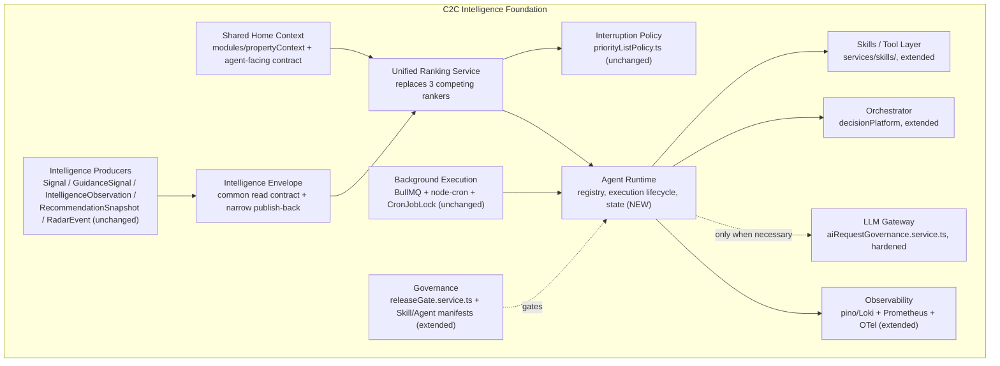
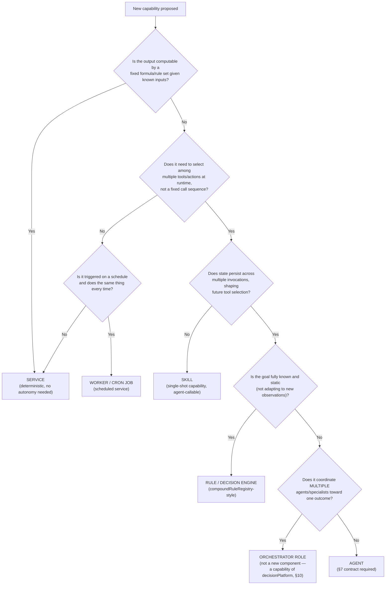
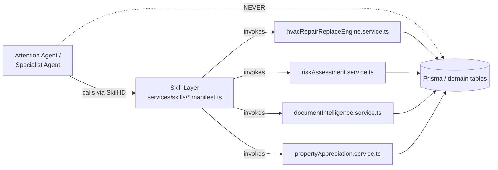
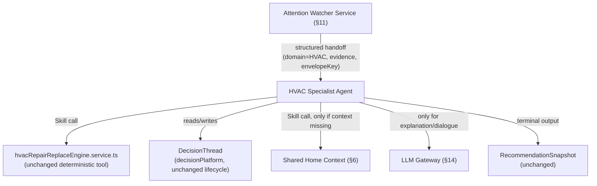
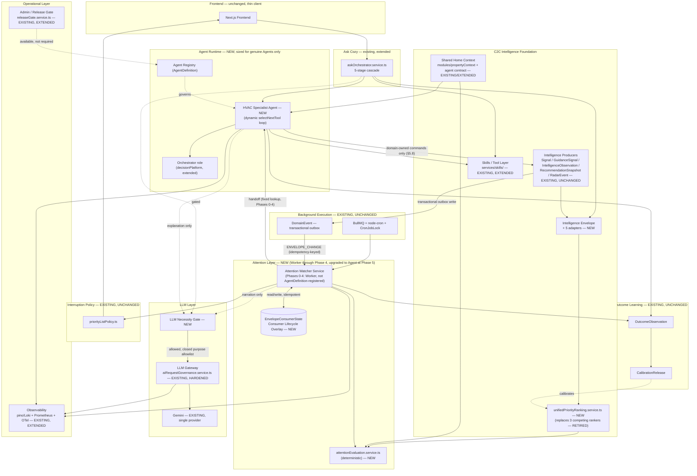
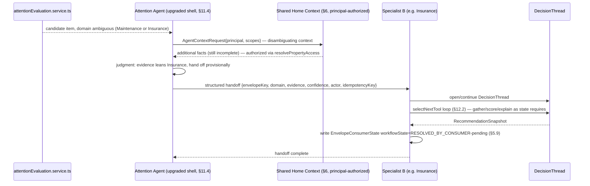

# C2C Intelligence & Agentic Evolution Architecture (Stage 3)

**Date:** 2026-08-26
**Status:** Draft target architecture — first pass, not yet build-approved.
**Grounding evidence:** [`docs/audits/AGENTIC_READINESS_AUDIT.md`](../audits/AGENTIC_READINESS_AUDIT.md) (Stage 1/2, confirmed ready for Stage 3 input after 6 external-review rounds) is the evidence base for *current* C2C state — what exists, what's duplicated, what's dormant. It is not itself an authoritative product-requirements source; where a design decision in this document has requirements consequences (authorization, confirmation, rollout posture), the authoritative FRD is cited directly, per §1.1. Every claim about current C2C state is inherited from the audit and not re-derived here; where a Stage 3 decision required narrow verification against the codebase or schema, that is called out inline as **[verified]**, with the specific file/line checked.
**Scope:** This document is the requested Stage 3 exercise — *Current C2C → Intelligence Foundation → Initial Agents → Orchestrator → Mature Agent Ecosystem*. It is a target architecture and phased evolution plan, not an implementation. No code changes accompany this document.

### 1.1 Requirements traceability

| Decision area | Authoritative source | What it requires |
|---|---|---|
| Property/context authorization | `docs/product/AI_HOME_CONCIERGE_ASK_TRUST_ARCHITECTURE_ADDENDUM_FRD.md`, parent principle 2 | "Authentication, property access, household authorization, and audience applicability remain deterministic" — binding on §6's agent-facing context contract |
| Confirmation / material actions | Same FRD, parent principle 5 | "Material actions retain typed input, confirmation, authorization recheck, idempotency, and audit requirements" — binding on §5.7/§5.9 (Envelope writes), §16.4 (idempotency), §19 (governance) |
| Canonical ownership | Same FRD, parent principle 4 | "Canonical services own facts, calculations, decisions, and mutations" — binding on §5.7's domain-owned-commands requirement |
| Rollout / cohort posture | Same FRD, §2.1 Development posture | "No rollout, migration, compatibility, or backfill plan is required for existing users because no real users exist" — binding on §7.2 and §26's phase exit criteria; safety controls (kill switches, evaluation, authorization) are kept regardless, since they are not rollout ceremony |
| Skill/agent capability boundaries | `docs/product/CONTRACTTOCOZY_SKILL_PLATFORM_FRD.md` | Skill admission rubric and confirmation/authorization preservation — binding on §9 |

---

## Table of Contents

1. [Executive Summary](#1-executive-summary) (incl. [1.1 Requirements traceability](#11-requirements-traceability))
2. [Architectural Principles](#2-architectural-principles)
3. [Current → Target Mapping](#3-current--target-mapping)
4. [C2C Intelligence Foundation](#4-c2c-intelligence-foundation)
5. [Intelligence Envelope Specification](#5-intelligence-envelope-specification)
6. [Shared Context Architecture](#6-shared-context-architecture)
7. [Agent Definition & Agent Contract](#7-agent-definition--agent-contract)
8. [Agent vs Service vs Skill Decision Framework](#8-agent-vs-service-vs-skill-decision-framework)
9. [Skills / Tool Architecture](#9-skills--tool-architecture)
10. [Orchestrator Architecture](#10-orchestrator-architecture)
11. [Attention Agent Detailed Design](#11-attention-agent-detailed-design)
12. [Specialist Agent Pattern](#12-specialist-agent-pattern)
13. [Agent Interaction Patterns](#13-agent-interaction-patterns)
14. [LLM Gateway & LLM Necessity Gate](#14-llm-gateway--llm-necessity-gate)
15. [Ranking & Interruption Architecture](#15-ranking--interruption-architecture)
16. [Trigger/Event Architecture](#16-triggerevent-architecture) (incl. [16.4 Atomicity, idempotency, and per-property serialization](#164-atomicity-idempotency-and-per-property-serialization))
17. [State & Memory](#17-state--memory)
18. [Conflict Resolution](#18-conflict-resolution)
19. [Governance & Safety](#19-governance--safety)
20. [Observability](#20-observability)
21. [Learning & Outcome Feedback](#21-learning--outcome-feedback)
22. [Ask Cozy Integration](#22-ask-cozy-integration)
23. [Target Architecture Diagram](#23-target-architecture-diagram)
24. [Runtime Sequence Diagrams](#24-runtime-sequence-diagrams)
25. [Database / Persistence Changes](#25-database--persistence-changes)
26. [Implementation Phases](#26-implementation-phases)
27. [Migration / Refactoring Matrix](#27-migration--refactoring-matrix)
28. [Risks & Mitigations](#28-risks--mitigations)
29. [Success Metrics](#29-success-metrics)
30. [Final Recommendation](#30-final-recommendation)
31. [Critical Design Test](#31-critical-design-test)

---

## 1. Executive Summary

**What C2C should become architecturally:** not a product with agents bolted on, but a system where the *existing* intelligence C2C already computes — five parallel producers, three ranking engines, one decision-lineage engine, one governed LLM chokepoint — is unified behind one read contract, ranked by one deterministic service, and watched by one thin coordination layer that decides what's worth a homeowner's attention. Agents are the mechanism that makes that watching and handing-off *adaptive* where deterministic policy genuinely can't cover the case. Everywhere deterministic policy *can* cover the case, it should, and it already mostly does.

The audit's central finding — fragmentation, not absence — sets the whole shape of this design. C2C does not need new intelligence-generating capability to answer "what needs my attention." It needs the five things it already knows to be queryable through one contract, ranked by one formula, and watched by one process instead of zero.

**The one deliberate departure from a naive reading of "build the Attention Agent first":** the audit's own honest-gap finding (§10.1) is that, as commonly described, the Attention Agent is fully expressible as a deterministic service — nothing in "rank, threshold, hand off" requires adaptive goal pursuit. A first draft of this document tried to resolve that by wrapping a deterministic Attention Service in a thin "shell" and pointing to specialist-selection-under-ambiguity as its one adaptive act — but this document's own phasing ships at most one specialist through Phase 4, so that ambiguity never actually occurs before Phase 5. §11.1 takes the fully honest option instead: Phases 0–4 ship the **Attention Watcher Service** (a stateful Worker, not registered as an Agent), and the **Attention Agent** designation — with its own governance track — is earned starting Phase 5, exactly when a second specialist first creates a real domain-ambiguity case. Section 11 specifies this precisely, including the five things (persistent goal, tool selection, replanning trigger, stop condition, a non-deterministic-policy decision) an external review found unanswered in the earlier draft.

**What ships, in order:** Intelligence Envelope + ranking convergence + HVAC verdict reconciliation (Phase 0, no agents yet) → agent runtime primitives sized to what the HVAC Specialist Agent concretely needs, not a speculative framework (Phase 1) → the Attention Watcher Service, a Worker, not yet an Agent (Phase 2, proves Job 1: *notice before being asked*) → the HVAC Specialist Agent — the first genuine Agent in this document — reusing the existing DecisionThread/scoring engine as a tool (Phase 3, proves hand-off) → Ask Cozy wired into the same Envelope and Specialist layer instead of a parallel path (Phase 4, proves one intelligence architecture, not two) → a second specialist creates the first real domain-ambiguity case, at which point the Watcher is upgraded into the genuine Attention Agent (Phase 5).

**What this is not:** a plan to add a second LLM provider, an event bus, a vector database, or a central orchestrator that contains business logic. None of those are justified by anything the audit found, and each is explicitly ruled out below with the evidence that rules it out.

---

## 2. Architectural Principles

These are binding constraints on every subsequent section, not aspirations.

1. **Context-first, deterministic-first, LLM-last.** Every agent exhausts, in order: C2C context (Property Context, documents, personalization) → existing intelligence (Envelope, scoring/decision engines) → deterministic rules/Skills/domain services → agent coordination/reasoning → LLM, only as an escalation capability. This is verbatim the audit's §9.1 rule, generalized from the pattern already live in `askResultSynthesis.service.ts`. It is not new; it is the one existing pattern this whole architecture is built to extend, not loosen.
2. **C2C is the intelligent system; agents are controlled components inside it.** No agent is a standalone product surface. Every agent's output lands in the same Envelope, the same ranking, the same interruption policy, and the same Ask Cozy conversation path that non-agentic C2C features already use.
3. **Adapters before schema migration.** The five intelligence subsystems (`Signal`, `GuidanceSignal`/`SignalProvenance`, `IntelligenceObservation`, `RecommendationSnapshot`/`OutcomeObservation`, `RadarEvent`) are **not** merged into one physical table. Each gets a thin read adapter into the Intelligence Envelope; writes back to native models go through domain-owned commands, never a generic cross-model setter (§5.7). Physical consolidation is revisited only if a concrete adapter-layer limitation is found in Phase 0 build-out — none is predicted, per the audit's explicit finding that the five schemas differ in real, fidelity-bearing ways (e.g. `GuidanceSignal`'s Int `severityScore`/Decimal `confidenceScore` pair vs. `RadarEvent`'s correlation shape — **[verified]** `schema.prisma:6623-6629`).
4. **Ranking and interruption are two different questions, answered by two different components.** "How important is this?" (deterministic ranking) is never conflated with "should the homeowner be bothered right now?" (`priorityListPolicy.ts`, reused unchanged as the interruption gate).
5. **"Agent" is a specific claim, not a label.** Per the audit's §3.2 definition, adopted verbatim: an agent exists only where there is adaptive goal pursuit under bounded, governed autonomy — dynamic tool/action selection against state that isn't fully known upfront, with logged, budgeted, revocable state transitions. Scheduling, background execution, or "runs continuously" are not sufficient conditions. Section 8's decision framework is the enforcement mechanism.
6. **No LLM output becomes authoritative C2C state without validation and provenance.** Every persisted AI-derived record carries provenance, evidence, confidence, generation method, and freshness — the Envelope's mandatory fields (§5) exist specifically to make this structurally impossible to skip, not just policy-enforced.
7. **Reuse before rebuild, adapters before rewrites, extension before replacement.** Consistent with the audit's Q3 conclusion (incremental evolution, not redesign): every component in §27's migration matrix is EXISTING, EXTEND, REFACTOR, or WRAP AS TOOL unless a specific justification for NEW is given.
8. **No autonomy beyond what's earned.** Every agent is scored against the audit's §9.2 autonomy ladder (Observe → Recommend → Draft → Execute-reversible → Execute-consequential). Every agent designed in this document targets Level 0–2. Level 3+ requires the composed agent-runtime safety contract in §19 — which does not exist yet and is not built in the phases this document scopes.
9. **Minimum necessary infrastructure.** No event bus, no second LLM provider, no vector database, no new orchestration platform unless a concrete requirement demonstrates the existing BullMQ/`DomainEvent`/`aiRequestGovernance`/`decisionPlatform` substrate cannot meet it. Sections 14 and 16 document the specific tests that would flip these defaults.
10. **An agent identity is attribution, never authority.** Every agent-initiated property read or consequential action carries an explicit execution principal — a live user/household session, or a narrowly-scoped system-purpose grant that still resolves to a real, authorized `userId` — and is re-authorized at read time and at write time through the existing `resolvePropertyAccess`/`getPropertyContext` path, unchanged. No agent bypasses this by virtue of being an agent. **[verified]** `getPropertyContext.ts:46-52` already throws `PropertyContextAccessDeniedError` when `dependencies.authorize(actor.userId, propertyId)` fails; §6.2.1 defines how agents supply that `actor`.
11. **Every side effect is idempotent and every producer-to-consumer trigger is transactional.** "A duplicate tick is harmless because it recomputes current state" is true only for read-side recomputation. Every write side effect (notification, handoff, lifecycle transition, recommendation) carries its own idempotency key; every producer write that must trigger downstream evaluation writes its trigger in the same database transaction as the write, using the existing `DomainEvent.idempotencyKey` uniqueness as the deduplication mechanism (§16.4) — never a best-effort post-commit call.

---

## 3. Current → Target Mapping

| Existing component | Current role (per audit) | Target role | Change required |
|---|---|---|---|
| `modules/propertyContext` | Assembles ~20 typed fact scopes; 27+ callers | Canonical agent-facing Shared Home Context (§6) | Add a stable, versioned, budget-aware read contract on top — no internal rewrite |
| `Signal`, `GuidanceSignal`, `IntelligenceObservation`, `RecommendationSnapshot`, `RadarEvent` | 5 disjoint intelligence schemas | 5 native stores, each exposed through the Intelligence Envelope via adapter (§5) | Write one adapter per store; no schema change |
| `radarPriority.ts`, `guidancePriority.service.ts`, `homeActions.service.ts`'s ranker | 3 competing ranking formulas, wrapped by `priorityListPolicy.ts` | One `unifiedPriorityRanking.service.ts` (§15) | Consolidate; retire the 2 losing implementations after parity validation |
| `priorityListPolicy.ts` + eligibility/suppression/snooze/kill-switch stack | Interruption gate | Unchanged — the interruption gate for agent output too | None |
| `decisionPlatform` (DecisionThread, RecommendationSnapshot, `decisionFamilyAdapterRegistry`) | Real lifecycle machinery, 1 of 7 families (HVAC) does real composition | Orchestration substrate for Specialist Agents (§10, §12) | Extend, don't replace; HVAC family becomes the first Specialist's decision-thread backing |
| Two disagreeing HVAC verdict engines (`decisionThreadService.ts` vs. `homeActionSourcePromotion.service.ts`) | Acknowledged divergence, surfaced via `SOURCE_CARD_VERDICT_DIVERGENCE` | One authoritative verdict, or explicit ranked precedence | Reconcile in Phase 0 — a data-quality fix, not an architecture change |
| `services/skills/` (19 `SkillDefinition`s) | Closest existing analog to an agent-tool manifest; kill-switches confirmed live at runtime | The Skill/Tool layer agents call (§9) | Extend the manifest schema with an autonomy-level tag; no runtime rewrite |
| `aiRequestGovernance.service.ts` | Routes all 25 Gemini invocation sites (18 route IDs); single-provider, no caching, no distributed rate-limit state, trusts a caller-asserted structured-output flag | LLM Gateway (§14) | Harden the interface: independent output verification, caching, distributed rate limits, safety filtering, LLM Necessity Gate. Provider abstraction added as an interface, not because a second provider ships |
| `askOrchestrator.service.ts` + 5-stage cascade | Deterministic NLU router; `REMOTE_FALLBACK` stage unwired; only real LLM touchpoint is `askResultSynthesis.service.ts` | Ask Cozy's entry point into the same Intelligence Foundation (§22) | Wire `REMOTE_FALLBACK` to the LLM Gateway under the Necessity Gate; add Specialist Agent as a routable target alongside existing Skills |
| BullMQ + node-cron + `workerJobRegistry.ts` + `CronJobLock` | Most mature layer in the codebase; durable, leased, parity-checked | Execution substrate for agent ticks and tool invocations (§16) | Add agent-specific job types to the existing registry; no new scheduling system |
| `DomainEvent` poller (30s CAS-claim) | Real consumers, poll-based; existing `idempotencyKey`/lease fields | Transactional-outbox trigger for the Attention Watcher Service (§16.4) | Use as-is as an outbox — no schema change, no new event infrastructure |
| pino/Loki + Prometheus + OpenTelemetry (already initialized per audit §1.2) | Structured logging, worker/AI cost metrics | End-to-end agent/Watcher observability backbone (§20) | Extend metric namespaces and trace propagation; no new observability stack |
| `releaseGate.service.ts` + Tool Discovery's kill-switches | KPI-gated cohort rollout, proven on tool rollout | Available governance tool (§19), not a default requirement | Kept as-is for any future real-user-cohort case; `AgentDefinition.releaseState` does not assume it's used (§7.2, §1.1) |
| `homeIntelligenceGraph.ts` | Dormant, zero call sites | Not activated in this design | Left dormant; revisit only if a specific cross-entity graph query need emerges that Property Context can't serve |
| Frontend (`lib/api/client.ts`, thin REST wrapper) | ~0 business logic | Unchanged | Agent-generated recommendations surface through the same existing REST contract; no client-side intelligence added |

---

## 4. C2C Intelligence Foundation

The foundation is the set of components every agent and every conventional feature share. Nothing in this layer is agent-specific; agents are simply the newest consumers of it.



| Foundation piece | Existing seed | What's new |
|---|---|---|
| Shared Home Context | `modules/propertyContext` | Versioned, budgeted, agent-facing contract wrapping it (§6) |
| Intelligence Envelope | 5 disjoint schemas + `IntelligenceConsumerCurrentness` freshness ledger | The common contract + 5 read adapters + domain-owned write commands + a Consumer Lifecycle Overlay (§5) |
| Intelligence producers | `signal.service.ts`, guidance engine, `propertyIntelligence.service.ts`, `decisionPlatform`, Home Event Radar | Unchanged — they keep writing to their own native tables, through their own existing commands |
| Deterministic ranking | 3 competing formulas | One `unifiedPriorityRanking.service.ts`, computing `importanceScore` only — delivery eligibility stays with `priorityListPolicy.ts` (§15) |
| Skills / Tool layer | `services/skills/`, 19 manifests | Autonomy-level tag added to each manifest; HVAC engine and other deterministic services wrapped as callable tools (§9) |
| Agent runtime | None | `AgentDefinition` registry + `AgentRun`/`AgentState` persistence, sized for the HVAC Specialist Agent (Phase 3) — the Attention Watcher Service (Phase 2) is a Worker and does not use this runtime until its Phase 5 upgrade (§7, §11, §25) |
| Orchestration | `decisionPlatform` (1 of 7 families composing) | Generalized decision-thread orchestration for Specialist Agents (§10) |
| Background execution | BullMQ + node-cron + `workerJobRegistry.ts` | New job types registered in the existing registry; no new scheduler |
| Interruption policy | `priorityListPolicy.ts` | Unchanged |
| LLM Gateway | `aiRequestGovernance.service.ts` | Hardened interface + Necessity Gate (§14) |
| Observability | pino/Loki, Prometheus, OpenTelemetry | Correlation/trace propagation through agent runs (§20) |
| Governance | `releaseGate.service.ts`, Skills kill-switches | Extended to agent definitions (§19) |

---

## 5. Intelligence Envelope Specification

### 5.1 Design stance

**Read contract now, no physical merge, and — the correction this section makes — no generic cross-model write contract either.** An earlier draft of this design proposed a single `transitionStatus()` method every adapter would implement identically. That does not survive contact with the actual schemas: `Signal` has no lifecycle status at all **[verified]** (`schema.prisma:6355-6389`); `RecommendationSnapshot` is explicitly immutable — "no update path is expected... a changed recommendation always creates a new row linked via `supersedesSnapshotId`, never an in-place edit" **[verified]** (`schema.prisma:8427-8429`); and `RadarEvent` is "canonical... independent of any single property" **[verified]** (`schema.prisma:13554`) — its `status` is shared across every property matched to that event, so a status write triggered by one homeowner's dismissal would corrupt state for every other property watching the same event. Property-specific relevance and dismissal for Radar already live in separate, property-scoped models, `PropertyRadarMatch` and `PropertyRadarState` **[verified]** (`schema.prisma:13637`, `13731`).

The fix is to stop treating "did a consumer act on this" as if it were always the producer's own field. It usually isn't:

1. **Read adapters** (one per native store) populate the Envelope, unchanged from the original design.
2. **A Consumer Lifecycle Overlay** (§5.9), keyed by `(envelopeKey, propertyId, userId?)`, is the *only* place "surfaced / dismissed / handed off / resolved-by-consumer" lives. It never mutates a native producer row.
3. **Domain-owned commands**, not a generic setter, are the only way an agent changes a producer's own state (e.g. calling the Guidance engine's own resolution command for `GuidanceSignal.status`, which *does* exist natively — **[verified]** `schema.prisma:6619`). No agent calls a cross-model `transitionStatus(anyModel, ...)`.

This is still "no physical schema migration" (Principle 3) — it is a correction to how *writes* work, not a reversal of the read-side adapter design.

### 5.2 Envelope key, identity, and revision

Producer-side dedup keys are not uniform enough to serve as the Envelope's own identity: `Signal` has none dedicated to this purpose **[verified]** (its only uniqueness constraint is a 6-column composite, `schema.prisma:6378`); `GuidanceSignal.dedupeKey` is nullable and unique only *within a property* (`@@unique([propertyId, dedupeKey])` — **[verified]** `schema.prisma:6644,6676`), not globally; `RadarEvent.dedupeKey` is a real global unique key but identifies the *canonical event*, not a property's relationship to it. So the Envelope defines its own identity, independent of what each producer happens to call its own key:

```ts
type EnvelopeKey = string; // `${type}:${propertyId}:${sourceModel}:${sourceRecordId}`
```

This is namespaced by type, property, native model, and native record — always constructible from what an adapter already has, never dependent on a producer having its own cross-comparable key. A separate, optional field carries the producer's own semantic key when one exists, for cross-producer reconciliation (§18), not identity:

```ts
semanticCorrelationKey?: string; // e.g. GuidanceSignal.dedupeKey, RadarEvent.dedupeKey — informational, not the Envelope's identity
```

### 5.3 Field contract

```ts
interface IntelligenceEnvelopeItem {
  // Identity
  envelopeKey: EnvelopeKey;          // see 5.2 — the Envelope's own namespaced identity
  semanticCorrelationKey?: string;   // producer's own key, if any — for §18 reconciliation, not identity
  nativeRevisionToken: string;       // see 5.8 — replaces an invented monotonic counter

  // Classification — MANDATORY
  type: EnvelopeType;         // SIGNAL | GUIDANCE | OBSERVATION | RECOMMENDATION | RADAR_EVENT
  domain: EnvelopeDomain;     // HVAC | ROOF | INSURANCE | FINANCE | REGULATORY | WEATHER | MAINTENANCE | ...
  subject: {
    propertyId: string;
    userId?: string;
    entityRef?: string;       // e.g. a specific appliance or document ID, when the item is that granular
  };

  // Provenance — MANDATORY, structurally required (Principle 6)
  source: {
    producer: string;         // e.g. "signal.service.ts", "decisionPlatform/decisionThreadService.ts"
    sourceModel: string;      // e.g. "Signal", "GuidanceSignal", "RecommendationSnapshot"
    sourceRecordId: string;   // pointer back to the native row — the Envelope never copies payload
  };
  provenance: {
    generatedBy: "DETERMINISTIC" | "LLM" | "EXTERNAL_INGEST" | "HYBRID";
    method: string;           // e.g. "hvacRepairReplaceEngine.service.ts v3", "askResultSynthesis narration"
    modelVersion?: string;    // set only when generatedBy includes LLM
  };

  // Confidence / evidence — MANDATORY where the native record supports it, else explicit null
  confidence: number | null;       // 0–1; null is a real, renderable state, not a default
  evidence: EvidenceRef[];         // pointers (factKey | documentId | snapshotId), never inlined blobs
  severity: Severity | null;       // INFO | ADVISORY | IMPORTANT | URGENT | SAFETY_EMERGENCY

  // Ranking — OPTIONAL, populated by the ranking service, never by the producer
  importanceScore: number | null;  // renamed from priorityScore — see §15.1 for why the split matters
  importanceComputedAt: string | null;

  // Freshness — MANDATORY
  freshness: {
    computedAt: string;
    ttl: string | null;             // ISO 8601 duration; null = producer manages its own staleness
    staleAfter: string | null;      // absolute timestamp, derived from ttl at write time
  };

  // Producer-native lifecycle — MANDATORY where the native record has one, else explicit null (5.1)
  nativeStatus: string | null;      // read-through of the producer's own status field, if any (e.g. GuidanceSignal.status) — never written by the Envelope

  // Action surface — OPTIONAL
  recommendation?: {
    actionType: string;
    summary: string;               // structured, not free text — rendered by the consumer, not embedded prose
    decisionThreadId?: string;      // link into decisionPlatform when a decision-grade recommendation exists
  };

  createdAt: string;
  updatedAt: string;
}
```

Effective lifecycle is computed from two independent sources, not one status field: **intrinsic status** (`ACTIVE` | `SUPERSEDED` | `CONFLICTED`) is derived at query time purely from the Envelope's own item set — `SUPERSEDED` when a newer `nativeRevisionToken` exists for the same `envelopeKey`, `CONFLICTED` when another producer's item overlaps `subject`+`domain` with no shared `semanticCorrelationKey` (§5.6, §18) — and needs no per-consumer state. **Consumer workflow status** (`SURFACED` | `DISMISSED` | `SNOOZED` | `HANDED_OFF_TO_SPECIALIST` | `ACKNOWLEDGED` | `RESOLVED_BY_CONSUMER`) comes from joining against the Consumer Lifecycle Overlay (§5.9) for the specific `(propertyId, userId)` asking. The same Envelope item can be intrinsically `CONFLICTED` for every household regardless of any individual's overlay state, while simultaneously `ACTIVE`+un-surfaced for one household member and `ACTIVE`+`DISMISSED` for another.

### 5.4 Mandatory vs optional, and why

| Field group | Mandatory? | Rationale |
|---|---|---|
| `envelopeKey`, classification, subject | Mandatory | Nothing downstream (ranking, dedup, Attention layer) can function without knowing what a thing is and whose home it's about |
| `source` / `provenance` | Mandatory | Principle 6 — this is what makes "LLM output never becomes authoritative state without provenance" structurally true rather than a lint rule |
| `confidence` / `evidence` | Mandatory *field*, nullable *value* | A producer that genuinely has no confidence figure (e.g. a raw external ingest before scoring) must say so explicitly — `null` is renderable ("unscored") and preserves §18's abstention requirement |
| `severity` | Mandatory field, nullable value | Same reasoning; not every item is severity-typed (e.g. a neutral informational observation) |
| `importanceScore` | Optional, ranking-owned | Producers never self-rank — this is the structural enforcement of §15's "ranking is one service" rule |
| `freshness` | Mandatory | Directly reuses the existing, audit-confirmed `IntelligenceConsumerCurrentness` staleness pattern |
| `nativeStatus` | Mandatory field, nullable value | Read-through only; `null` for producers with no native status (e.g. `Signal`) is itself meaningful, not an error |
| `recommendation` | Optional | Not every envelope item is actionable (e.g. a pure observation) |

### 5.5 Per-subsystem adapter mapping

| Native store | Adapter maps to Envelope as | `nativeStatus` source | Notable fidelity note |
|---|---|---|---|
| `Signal` | `type: SIGNAL` | Always `null` — no status field exists on `Signal` **[verified]** | 9 hardcoded keys map to a fixed `domain` enum subset; confidence uses the existing 5-factor blend directly |
| `GuidanceSignal` / `SignalProvenance` | `type: GUIDANCE` | `GuidanceSignal.status` (`GuidanceSignalStatus`, defaults `ACTIVE`) — read-through, not Envelope-written **[verified]** `schema.prisma:6619` | Richest native shape; `severity` is derived from the *pair* of `severityScore` (Int, 0–100) and `confidenceScore` (Decimal(5,4)) — **not** "decimal severity," a mapping error corrected here **[verified]** `schema.prisma:6623-6629` |
| `IntelligenceObservation` | `type: OBSERVATION` | Its own status field, read-through | Often `confidence: null` pre-scoring — this is the adapter's primary reason for existing as a *thin* mapper rather than a physical merge |
| `RecommendationSnapshot` / `OutcomeObservation` | `type: RECOMMENDATION` | Always `null` — immutable, no status field; supersession is represented via `supersedesSnapshotId`, surfaced as a *new* Envelope item, not a status change on the old one **[verified]** `schema.prisma:8427-8451` | `recommendation.decisionThreadId` populated directly |
| `RadarEvent` | `type: RADAR_EVENT` | `PropertyRadarMatch.lifecycleStatus` for the specific property — **never** the global `RadarEvent.status`, which is shared across every matched property **[verified]** `schema.prisma:13554-13600`, `13637+` | The Envelope item's identity for this type is anchored to `PropertyRadarMatch`/`PropertyRadarCompoundInsight` (property-scoped), not the global `RadarEvent` row; `RadarEvent`'s own fields (title, severity, global dedup key) are read through for shared context only |

### 5.6 Deduplication

Dedup is per-producer and explicitly non-uniform — the table above is the honest version of what the audit already found (each subsystem already computes its own dedup/idempotency key, in its own way): `GuidanceSignal`'s property-scoped `dedupeKey`, `RecommendationSnapshot`'s content-addressed `inputDigest`, `RadarEvent`'s global `dedupeKey` paired with the property-scoped `PropertyRadarMatch`. The Envelope does not force these into one dedup algorithm; `envelopeKey` (§5.2) already guarantees identity uniqueness regardless. The one rule the Envelope adds: **when two different `sourceModel`s produce items with overlapping `subject` + `domain` and no shared `semanticCorrelationKey`, that is a cross-producer conflict, not a duplicate** — handled by §18, not silently collapsed.

### 5.7 Read path vs. materialization

Two viable implementations, in order of preference:

1. **Query-time fan-out (default).** The Envelope query service calls all five adapters in parallel (mirroring how `modules/propertyContext` already runs ~20 fact scopes in parallel) and merges results. No new persistence. Acceptable as long as query volume stays in the range Property Context already handles today.
2. **Thin materialized index (fallback, only if query-time fan-out proves too slow under agent-driven polling volume).** A single new narrow table, `IntelligenceEnvelopeIndex` (`envelopeKey`, type, domain, subject, `importanceScore`, `nativeStatus`, freshness pointers — no payload), refreshed by the same adapters on a write-triggered basis. This is the only *producer-side* new persistence §5 requires, and only conditionally (see §25). §5.9's Consumer Lifecycle Overlay is unconditional, separate persistence regardless of which read path is chosen.

### 5.8 Domain-owned write commands (replaces the generic write-back contract)

There is no `EnvelopeAdapter.transitionStatus(anyModel, ...)`. Instead, each producer that has a genuine native lifecycle exposes its **own**, already-domain-owned command, called directly — the Envelope adapter layer does not intermediate producer writes at all:

```ts
// Example: Guidance engine already owns this state transition natively.
guidanceSignalService.resolve(guidanceSignalId: string, actor: ExecutionPrincipal, reason: string): Promise<void>;

// Example: Radar match dismissal is already property-scoped natively — no cross-property risk.
propertyRadarMatchService.dismissForProperty(propertyRadarMatchId: string, actor: ExecutionPrincipal, reason: string): Promise<void>;
```

Every such command requires, uniformly:

| Parameter | Purpose |
|---|---|
| `expectedRevision` | Optimistic concurrency — rejects a write against a record that changed since the caller last read it |
| `actor: ExecutionPrincipal` | Real authorization, per §6.2.1 — never a bare agent ID |
| `idempotencyKey` | Safe retry (§16.4) |
| Domain-specific `allowedTransitions` check | Enforced inside the domain service itself, not invented generically at the Envelope layer |
| `reasonCode` | Audit trail (§20) |

`Signal` and `RecommendationSnapshot` have **no** write command exposed here, because neither has a native lifecycle to transition — an agent that needs to "retire" a stale `Signal` or supersede a `RecommendationSnapshot` does so by writing a *new* record through the producer's existing creation path (which is exactly how `RecommendationSnapshot` already works today via `supersedesSnapshotId`), never by mutating the old one.

**"Specialist accepted handoff" is not a producer-lifecycle transition at all** — it is a Consumer Lifecycle Overlay workflow state (`HANDED_OFF_TO_SPECIALIST`, §5.9), because a handoff describes what *this* Attention pass did with the item for *this* property, not a fact about the native record.

### 5.9 Consumer Lifecycle Overlay

New, narrowly-scoped persistence (`EnvelopeConsumerState`, one row per `(envelopeKey, propertyId, userId?)`):

```ts
interface EnvelopeConsumerState {
  envelopeKey: EnvelopeKey;
  propertyId: string;
  userId: string | null;             // null = household-level state; set = per-member state (e.g. individual dismissal)
  workflowState: "SURFACED" | "DISMISSED" | "SNOOZED" | "HANDED_OFF_TO_SPECIALIST" | "ACKNOWLEDGED" | "RESOLVED_BY_CONSUMER";
  snoozedUntil: string | null;
  lastTransitionAt: string;
  lastTransitionBy: ExecutionPrincipal;
  lastTransitionReasonCode: string;
  idempotencyKey: string;            // one per transition attempt — safe retry
  stateVersion: number;              // optimistic concurrency (§16.4)
}
```

This is the **only** place "did this homeowner act on this" lives, decoupled entirely from whichever of the five producers happens (or doesn't happen) to have its own status field. It is what the Attention layer's watch-session state (§11) actually reads and writes on every tick, and it is what makes a `RESOLVED_BY_CONSUMER` distinguishable from a `HANDED_OFF_TO_SPECIALIST` distinguishable from a native-producer-side `RESOLVED` (which, per §5.8, may not even exist for that producer).

### 5.10 Versioning and staleness

`nativeRevisionToken` replaces an earlier design that invented a monotonic Envelope-level version counter — that cannot be implemented on the default query-time-fan-out path (§5.7) without persistent state to remember "what version did we last see," which defeats the point of a stateless read adapter. Instead:

- Where the native model already carries its own revision marker (`Signal.version`, `RadarEventRevision.revisionIdentity`, `RecommendationSnapshot`'s implicit immutability), the adapter surfaces that value directly as `nativeRevisionToken`.
- Where none exists, the adapter computes a deterministic content hash of the fields it read, so two reads of an unchanged record always produce the same token, and a changed record always produces a different one — without either side needing to remember prior state.

A consumer that cached an item at an older `nativeRevisionToken` treats it as changed on next read. This reuses the same "compare and recompute" shape `IntelligenceConsumerCurrentness` already implements today — generalized across producers, not reinvented.

---

## 6. Shared Context Architecture

### 6.1 Why this, not direct Prisma access

`modules/propertyContext` already does the hard part: ~20 typed fact scopes, KNOWN/UNKNOWN/STALE/CONFLICTED marking per fact, authorization, parallel scope resolution, a version hash — and 27+ real callers already depend on it. The gap the audit identified is not capability, it's *contract stability for a new class of caller (agents)* that shouldn't be allowed to grow direct, ad hoc Prisma dependencies the way 15% of controllers already have.

### 6.2 The agent-facing contract

An earlier draft of this contract carried `requestingAgentId` as the only identity on the request — that is attribution, not authority, and it silently dropped the authorization step every real caller of `getPropertyContext` is required to make today. **[verified]** `getPropertyContext(propertyId, actor: PropertyContextActor, request, ...)` calls `dependencies.authorize(actor.userId, propertyId)` (→ `resolvePropertyAccess`) before reading a single fact, and throws `PropertyContextAccessDeniedError` on failure (`getPropertyContext.ts:46-52`; `PropertyContextActor` requires `userId`, `contracts.ts:88-90`). The fix: every `AgentContextRequest` carries a real `ExecutionPrincipal` that resolves to a `userId`, and is passed straight through to the unchanged `getPropertyContext` call — agents never get a code path that skips `resolvePropertyAccess`.

#### 6.2.1 Execution principal

```ts
type ExecutionPrincipal =
  | { kind: "HOMEOWNER_SESSION"; userId: string }
      // a live, user-initiated request — Ask Cozy (Pattern B), or a homeowner-triggered re-evaluation
  | { kind: "SYSTEM_PURPOSE"; grantedByUserId: string; purpose: "PROACTIVE_INTELLIGENCE_WATCH"; grantedAt: string };
      // a background tick (e.g. the Attention layer's scheduled/event-driven evaluation) — narrowly scoped
      // to one declared purpose, explicitly granted when the property's household enabled proactive
      // intelligence, and still resolving to a real userId with a real household role — never a standing
      // bypass of authorization
```

`resolvePropertyAccess` is already free of Express types specifically so it can run from the workers process without pulling in the web framework **[verified]** (`propertyAccess.service.ts:1-7`) — a `SYSTEM_PURPOSE` principal calls the identical function, with `grantedByUserId` as the `userId` argument, from a background job exactly as a live request would from a controller. Nothing new is built here; the principal type is new, the authorization call it feeds is not.

```ts
interface AgentContextRequest {
  propertyId: string;
  principal: ExecutionPrincipal;    // authority — resolves to a real userId, checked via resolvePropertyAccess
  requestingAgentId: string;         // attribution only, for budget/audit (§7, §20) — never authority
  scopes: PropertyContextScope[];    // explicit allow-list, not "give me everything"
  maxFacts?: number;                 // context budget ceiling (reuses the Skills' context-budget concept)
  maxLatencyMs?: number;
  includeHistory?: boolean;          // relevant history, opt-in, bounded
}

interface AgentContextResponse {
  contextVersion: string;          // the existing propertyContext version hash
  facts: {
    key: string;
    value: unknown;
    status: "KNOWN" | "UNKNOWN" | "STALE" | "CONFLICTED";
    evidence: EvidenceRef[];
    freshness: { computedAt: string; source: string };
  }[];
  personalization?: PersonalizationSnapshot;   // from modules/personalization, scope-gated
  missingFacts: string[];          // explicit — an agent must be able to see what it doesn't know
}
```

This is not a new context engine; it is a typed request/response wrapper around the existing `getPropertyContext` call, adding: (a) a mandatory `principal` resolved to `getPropertyContext`'s existing `actor.userId` — the actual authorization gate, unchanged; (b) `requestingAgentId` for budget/audit attribution only; (c) an explicit `scopes` allow-list instead of unscoped access; (d) a `maxFacts`/`maxLatencyMs` budget ceiling enforced the same way Skills already enforce context budgets. Every consequential write this document specifies (§5.8's domain commands, §5.9's overlay transitions) reauthorizes the same way at write time — a revoked or stale grant cannot be used after the fact.

### 6.3 What agents must NOT do

- Import Prisma clients or domain models directly for property/homeowner facts.
- Request unscoped context ("give me everything about this property").
- Bypass the `missingFacts` signal by inferring unknown facts from LLM world knowledge (this is the specific failure mode Principle 6 and the audit's §9.1 rule exist to prevent).
- Treat `requestingAgentId` as sufficient authorization for a property read or write — it never is (Principle 10).

### 6.4 Domain-specific views

The five existing context wrappers (financial / projectCompliance / aggregation / planning / protection) remain feature-scoped views over `propertyContext`, per the audit's §4 recommendation to extract their near-identical `reconciliation.ts` staleness checks into one shared utility. Agents consume either the general `AgentContextRequest` or a domain-specific view when one already exists — they do not get a sixth view built just for agents.

---

## 7. Agent Definition & Agent Contract

### 7.1 Formal definition

> **A C2C Agent is a component that pursues a bounded, stated goal by adaptively selecting among multiple registered tools or actions, against subject state that is not fully known when it starts, with every state transition logged, budgeted, and revocable.**

This is the audit's §3.2 definition, made binding. A component that satisfies this is an Agent, tagged and governed as one. A component that does not — no matter how it's named, how often it runs, or how sophisticated its output looks — is a Service, a Rule, a Worker, or an Orchestrator, and is built and reviewed as one (§8).

### 7.2 Agent Contract

Modeled directly on `services/skills/skill.contract.ts`'s `SkillDefinition` — reusing its risk-policy, context-budget, evaluation-suite, and kill-switch concepts rather than inventing a parallel manifest shape.

```ts
interface AgentDefinition {
  agentId: string;                       // e.g. "attention-agent", "hvac-specialist-agent"
  name: string;
  responsibility: string;                // one sentence, matches the "why an agent" test in §8
  supportedDomains: EnvelopeDomain[];
  acceptedTriggers: AgentTrigger[];       // ENVELOPE_CHANGE | SCHEDULED_TICK | USER_INITIATED | SPECIALIST_HANDOFF

  requiredContext: PropertyContextScope[];
  allowedSkills: string[];                // Skill IDs this agent may invoke
  prohibitedSkills?: string[];            // explicit denials, for defense-in-depth over the allow-list

  executionMode: "SYNC" | "ASYNC_TICK" | "ASYNC_LONG_RUNNING";
  stateRequirements: {
    persistsAcrossTicks: boolean;
    stateShape?: string;                  // reference to an AgentState schema
  };

  outputContract: {
    producerCommandsAllowed: string[];    // domain-owned command names this agent may call (§5.8) — never a generic writer
    envelopeOverlayWrite: boolean;         // may write Consumer Lifecycle Overlay transitions (§5.9)?
    producesRecommendation: boolean;
    maxAutonomyLevel: 0 | 1 | 2;          // hard ceiling — see §9.2 of the audit; no agent in this document exceeds 2
  };

  budgets: {
    maxContextFactsPerRun: number;
    maxLLMInvocationsPerRun: number;
    maxLLMCostPerRunUsd: number;
    maxExecutionMsPerRun: number;
    maxRunsPerHourPerSubject: number;     // rate ceiling per property, prevents runaway ticking
  };

  killSwitch: string;                     // env var name, same convention as Skills' killSwitch
  featureFlag: string;
  releaseState: "DEV" | "EVAL_APPROVED" | "ENABLED" | "DISABLED";
  // Deliberately not a staged-rollout enum (no DEV → COHORT → GA ladder): the Ask Trust FRD's
  // development posture states "no rollout, migration, compatibility, or backfill plan is required
  // for existing users because no real users exist" [verified] (AI_HOME_CONCIERGE_ASK_TRUST_ARCHITECTURE_
  // ADDENDUM_FRD.md §2.1). Safety gates (kill switch, evaluation suite) are kept regardless — they are
  // not rollout ceremony, they are the same safety control Skills already require before any release.

  retryPolicy: { maxAttempts: number; backoffMs: number };
  timeoutMs: number;
  escalationPolicy: {
    onLowConfidence: "ABSTAIN" | "HAND_OFF" | "ASK_HOMEOWNER";
    onToolFailure: "RETRY" | "ABSTAIN" | "ESCALATE_TO_HUMAN_REVIEW";
  };

  auditRequirements: { logEveryToolCall: true; logEveryStatusTransition: true };
  safetyLevel: "OBSERVE_ONLY" | "RECOMMEND" | "DRAFT";  // mirrors autonomy ceiling, human-readable
  evaluationSuiteId: string;              // required before ENABLED, same as Skills
}
```

### 7.3 What's reused vs. new

| Concept | Source | Reused as-is? |
|---|---|---|
| Risk policy (effects, materiality, reversibility) | `skill.contract.ts` | Yes — `escalationPolicy` + `safetyLevel` are the agent-level equivalent |
| Context budget | `skill.contract.ts` | Yes — `budgets.maxContextFactsPerRun` |
| Kill-switch / feature-flag pair, read at runtime | `askOperationalControls.ts`'s `skillEnabled()` | Yes — same env-var convention, same runtime enforcement path, extended to agents |
| Evaluation suite requirement before enabling | Skills registry release process | Yes |
| `releaseGate.service.ts` | Existing KPI/cohort-gated rollout mechanism | Kept available as a *tool* (§19) for any future case with real user cohorts, but not required by `AgentDefinition` itself — `releaseState` no longer assumes a staged-rollout program exists |
| `AgentRun`, `AgentState` persistence | — | New (§25) |

---

## 8. Agent vs Service vs Skill Decision Framework

This is the proliferation gate. Every proposed new component answers these questions before it is allowed to be called an agent.



| Kind | Decisive test | C2C examples |
|---|---|---|
| **Service** | Fixed formula, known inputs → known output shape | `hvacRepairReplaceEngine.service.ts`, `unifiedPriorityRanking.service.ts`, any *Reconciliation.service.ts |
| **Worker / cron job** | Same action, every tick, or choosing among a fixed, small branch set with no unknown tool space | The 66-entry `workerJobRegistry.ts`, and the **Attention Watcher Service** (§11, Phases 0–4) — cross-tick state alone doesn't clear this bar into Agent |
| **Skill / Tool** | Single-shot capability an agent (or Ask) calls once per invocation, no cross-call state | Any of the 19 existing `SkillDefinition`s |
| **Rule / decision engine** | Goal is static and fully known; only the *inputs* vary | `compoundRuleRegistry.ts`'s Home Action promotion rules |
| **Orchestrator role** | Coordinates multiple specialists toward one outcome using structured handoffs | A capability `decisionPlatform` gains, not a new standalone service (§10) |
| **Agent** | Adaptive tool selection over a genuinely unknown tool space + persistent cross-invocation state + a goal that isn't fully specified upfront | HVAC Specialist Agent (§12, its dynamic `selectNextTool` loop) — the only Agent this document ships before Phase 5, when the **Attention Agent** (the Watcher's upgrade, §11.4) becomes the second |

**Explicit non-agents, by this framework, even though they will be tempting to rename:** the unified ranking service (fixed formula → Service), the Envelope adapters (fixed mapping → Service), the LLM Necessity Gate (fixed decision tree → Rule), `priorityListPolicy.ts` (fixed policy evaluation → Rule), and — the one that a prior draft of this document itself got wrong — the Attention Watcher Service through Phase 4 (§11.1), whose cross-tick state and small branch set are Worker-shaped, not Agent-shaped, until Phase 5's ambiguity case exists. This framework is the direct answer to the audit's finding that the codebase's "strong conventions... make adding an N+1th instance of a pattern easy" — it is the gate that stops "agent" from becoming that N+1th overused pattern, including inside this document.

---

## 9. Skills / Tool Architecture

### 9.1 Principle: Agent → Skill/Tool → Domain Service, never Agent → Prisma

Every domain capability an agent needs already exists as a domain service. The Skills layer (`services/skills/`) is not rebuilt — its 19 `SkillDefinition`s are extended with one new manifest field (`autonomyLevel: 0 | 1 | 2`, per the audit's §9 item 6 recommendation) and become the uniform calling convention for agents, exactly as they already are for Ask.



### 9.2 Capability → Skill mapping

| Capability | Existing service (unchanged) | Skill wrapper status |
|---|---|---|
| Property context | `modules/propertyContext` | New: `property-context` Skill wrapping §6's `AgentContextRequest` |
| HVAC repair/replace | `hvacRepairReplaceEngine.service.ts` | Existing `repairReplace` Skill manifest — reused directly, per audit's exemplar classification |
| Risk assessment | `riskAssessment.service.ts` | New thin Skill wrapper (service itself untouched) |
| Maintenance intelligence | Guidance engine, `compoundRuleRegistry.ts` | Existing `maintenance` Skill manifest |
| Insurance analysis | `coverage/` subfolder services | Existing `coverage` Skill manifest |
| Document extraction | `documentIntelligence.service.ts`, `ExtractionEnvelope` | Existing `document-promotion` Skill manifest |
| Financial calculations | `ownershipCosts/` services | Existing `ownership-cost` Skill manifest |
| Refinance intelligence | `refinanceRadar` | Existing `refinance` Skill manifest |
| Weather/environmental | Bespoke weather/AQI adapters | New thin Skill wrapper (adapters untouched; see §27 for the separate adapter-generalization work, not required for this) |
| Warranty analysis | `homeOperations`/property record services | Existing `property-record` Skill manifest, extended |
| Local/regulatory intelligence | `IntelligenceObservation` (USGS, NYC ZAP) | New thin Skill wrapper over Envelope query, not the raw ingestion pipeline |
| Lifecycle guidance | `services/skills/household`, `seller-preparation`, `buyer-closing` manifests | Existing, reused directly |
| Service/provider discovery | `servicePriceRadar` | New thin Skill wrapper |
| Recommendation retrieval | Intelligence Envelope query (§5) | New Skill: `query-envelope` — the one Skill every agent in this document calls most often |

No domain logic is rewritten inside any agent. Where a "Skill wrapper" is marked new, it is a thin manifest + adapter registration — the underlying service is untouched, matching the audit's `hvacRepairReplaceEngine.service.ts` exemplar pattern ("None beyond a thin agent-facing wrapper").

---

## 10. Orchestrator Architecture

### 10.1 What the Orchestrator is (and is not)

The Orchestrator is **not** a new standalone service and **not** a central intelligence engine. It is a generalization of `decisionPlatform`'s existing DecisionThread lifecycle machinery — which today does real composition for exactly one of seven registered families (HVAC) — into a reusable substrate any Specialist Agent's multi-step workflow can run on.

| Belongs to orchestration | Does NOT belong to orchestration (stays in domain services) |
|---|---|
| Routing a detected item to the right Specialist Agent | Domain scoring (HVAC weights, risk formulas) |
| Sequencing a specialist's multi-step workflow (gather context → compare → explain → decision thread) | Property fact assembly (stays in Property Context) |
| Managing execution budgets across a run | Business rules (stay in `compoundRuleRegistry.ts` and domain services) |
| Resolving "is more context needed before proceeding?" | Data ingestion (stays in `propertyIntelligence.service.ts`, Radar pipelines) |
| Handling tool-call failures and retries | Notification transport (stays in the existing notification stack) |
| Detecting workflow completion / stop conditions | Envelope adapter logic (stays with each of the 5 native subsystems) |
| Escalating unresolved conflicts (§18) | LLM prompt content (stays in the Gateway + agent-specific prompt registry) |
| Deciding when to ask the homeowner for missing information | — |

### 10.2 Reuse of `decisionPlatform`

- `DecisionThread` lifecycle → becomes the generic multi-step execution record for any Specialist Agent's workflow, not just HVAC.
- `decisionFamilyAdapterRegistry` → gains an eighth "family": Attention-Agent-initiated specialist handoffs, registered the same way the other 7 families are, with the same thin-vs-real-composition distinction the audit already applies.
- `RecommendationSnapshot` / `OutcomeObservation` → unchanged; every Specialist Agent's terminal output is a `RecommendationSnapshot`, so the outcome-learning loop (§21) requires zero new plumbing.

### 10.3 What's explicitly NOT built

A central "AgentOrchestrator" god-service that contains business logic for every domain. The orchestrator's entire footprint is: (a) the extended `decisionFamilyAdapterRegistry` entry, (b) a new, narrow `AgentRun` state machine (§25) tracking *where in the workflow* a Specialist Agent is, and (c) the handoff contract between the Attention Watcher Service (or, from Phase 5, the Attention Agent) and a Specialist Agent (§13, Pattern A). Nothing else.

---

## 11. Attention Agent Detailed Design

### 11.1 A second correction: the shell doesn't earn "Agent" status until Phase 5, and this document says so

The prior draft split a deterministic Attention Service from a thin "Attention Agent shell," and pointed to specialist-selection-under-domain-ambiguity as the shell's one irreducibly adaptive decision. That claim does not survive this document's own phasing: **Phase 2 ships with exactly zero specialists registered (the first, HVAC, doesn't ship until Phase 3), and Phase 3 ships exactly one.** Domain ambiguity — choosing among *more than one* plausible specialist — cannot occur until a second specialist with an overlapping domain exists, which this document does not build before Phase 5. Cross-tick state and choosing among a fixed, small set of branches (narrate or don't; hand off to the one registered specialist or don't) do not, by themselves, satisfy §7.1's definition — a stateful branch is not the same thing as adaptive goal pursuit over an unknown tool set.

This document takes the honest option the review offered, matching the audit's own practice of naming an inconvenient conclusion rather than asserting agency it hasn't earned (compare the audit's own "Property Health Score Reconciler... weakest near-term candidate, named to make the not-yet-ready case visible"):

| Phases | What ships | Classification (per §8) | Registered as an `AgentDefinition`? |
|---|---|---|---|
| **0–4** | `attentionEvaluation.service.ts` (deterministic ranking/threshold logic) **+ a stateful Attention Watcher Worker** around it | **Worker** — persists a watch session across ticks, but selects among a fixed, small branch set (narrate/don't, hand off to the one available specialist/don't), which §8's Q2/Q5 resolves to Rule/Worker, not Agent | No — governed as a Worker: `workerJobRegistry.ts` entry, feature-flagged, kill-switched the same way any Skill is, but not an `AgentDefinition` |
| **5+** | The Watcher is **upgraded** to the **Attention Agent** once a second specialist creates a real domain-ambiguity case (§11.4) | **Agent** — the specialist-selection judgment in 11.4 becomes real, not hypothetical | Yes, from that point forward |

This does not weaken what ships in Phases 0–4 — the Attention Watcher Service does everything §7 of the Stage 3 brief asked for (continuously observe, rank, suppress noise, narrate when needed, respect interruption budgets) and satisfies the Critical Design Test in §31 on its own. It changes only the *label* and the *governance track* applied to it, so that "Agent" stays a claim this document only makes when it's earned, per Principle 5.

### 11.2 Attention Watcher Service — full specification (Phases 0–4)

| Aspect | Design |
|---|---|
| **Triggers** | `ENVELOPE_CHANGE` (event-driven, transactional — §16.4), and a bounded `SCHEDULED_TICK` fallback (e.g. every 4 hours per property) to catch any missed event-driven trigger — not a substitute for event-driven detection, a safety net |
| **Execution model** | Runs as a BullMQ job, reusing the existing queue infrastructure, one job per (property, trigger) pair; registered in `workerJobRegistry.ts` like any other job |
| **Inputs** | Current Envelope state for the property (via §5's query path), the property's `EnvelopeConsumerState` rows (§5.9) for its watch session, the property's interruption budget remaining (`priorityListPolicy.ts`) |
| **State** | The watch session **is** `EnvelopeConsumerState` (§5.9) — no separate state table. `lastEvaluatedNativeRevisionTokens` (map of `envelopeKey → nativeRevisionToken` last seen, for change detection), plus whatever `workflowState` rows already exist per item |
| **Ranking interaction** | Calls `unifiedPriorityRanking.service.ts` (§15) for `importanceScore`; calls `priorityListPolicy.ts` for `deliveryEligibility` — never recomputes either itself |
| **Specialist handoff (Phases 0–4 only)** | A fixed lookup: at most one registered specialist per domain exists in this range, so "handoff" is a Rule (domain → specialist ID), not a judgment call. Writes `workflowState: HANDED_OFF_TO_SPECIALIST` to the overlay (§5.9) — never a native-model status write |
| **Outputs** | Zero or more `EnvelopeConsumerState` transitions (§5.9, each idempotency-keyed — §16.4), zero or one homeowner-facing recommendation surfaced through the interruption policy, a structured `AttentionRunResult` (items evaluated, items surfaced, items suppressed, specialist handoffs, LLM calls made) |
| **User interruption rules** | The Watcher never bypasses `priorityListPolicy.ts` — it *proposes* candidates for interruption; the existing policy layer (unchanged) makes the final "bother them now?" call, exactly per Principle 4 |
| **Failure behavior** | A failed tick is a no-op for the homeowner (nothing surfaced) — `EnvelopeConsumerState` transitions only commit on successful, idempotent completion of the specific side effect they represent (§16.4); retried per the job's retry policy |
| **Retry behavior** | Consistent with the existing `WorkerRunResult` retry conventions in `workerJobRegistry.ts` |
| **Observability** | Every tick emits structured logs correlated by a `tickRunId`; Prometheus counters for items-evaluated, items-surfaced, specialist-handoffs, LLM-calls-made (feeds §29's "resolved without LLM" metric directly) |
| **Cost budget** | At most 1 LLM call per tick (narration only, and only when the Necessity Gate approves — §14), cost-capped conservatively since narration is the only permitted LLM use case here |
| **LLM escalation rules** | Per §14's Necessity Gate — narration is requested only when more than one surfaced item needs a combined "why now" explanation; a single surfaced item uses a fixed, pre-approved narration template (no LLM call at all) |

### 11.3 What genuine adaptivity would require, named explicitly per the review's five questions — deferred to §11.4/Phase 5, not claimed now

| Question | Where the honest answer lives today (Phases 0–4) |
|---|---|
| What goal or plan persists between ticks? | A fixed goal (§5.9's `EnvelopeConsumerState`), not an adaptive one — the Watcher doesn't revise its own goal based on what it observes, it applies the same fixed policy every tick |
| Which tools does it choose among? | At most two branches (narrate / don't; hand off to the one registered specialist / don't) — not a genuine tool-selection space until §11.4 |
| What new observation changes its plan? | None — a new observation changes the *ranking output*, not the Watcher's own plan, which doesn't exist as a separate thing from its fixed policy |
| Stop condition / execution budget? | Fixed (interruption budget exhausted, or nothing crosses threshold) — a real budget, but not evidence of adaptivity by itself |
| A decision that cannot be a deterministic policy? | None exists in Phases 0–4, by construction (at most one specialist is ever registered) |

### 11.4 The upgrade path: Attention Agent, Phase 5+

Once a second specialist is registered for an overlapping domain (§26 Phase 5), the Watcher is wrapped in a thin shell that owns exactly one new judgment: **specialist selection under domain ambiguity** — when a detected item's `domain` and `evidence` plausibly implicate more than one registered specialist (e.g., a moisture-related maintenance item that could route to either a Maintenance specialist or an Insurance specialist depending on evidence not yet gathered), the shell decides whether to hand off to one specialist provisionally, request disambiguating context first (via §6's `AgentContextRequest`), or surface without a specialist at all. This is not expressible as a static routing table without becoming exactly the routing table the audit already found duplicated three times (§2.4's Radar naming collision is the cautionary precedent) — which is what makes it a genuine Agent decision rather than a Rule. At that point, and not before, the component is registered as an `AgentDefinition` (§7.2) and governed on the Agent track (§19), not the Worker track.

---

## 12. Specialist Agent Pattern

### 12.1 HVAC Repair/Replace Advisor as the concrete instance

The audit is explicit: do not rebuild `hvacRepairReplaceEngine.service.ts`, and do not rebuild `DecisionThread`/`RecommendationSnapshot`. The Specialist Agent is a thin coordination layer around infrastructure that already exists and is already the audit's "exemplar" classification.



### 12.2 Reusable pattern (not HVAC-specific) — genuinely dynamic, not a fixed pipeline

A prior draft listed these as a linear sequence, which reads as a fixed workflow rather than tool selection. The correction: **which of these the Specialist Agent invokes, and in what order, depends on state that isn't known when the run starts** — specifically, the current `AgentContextRequest`'s `missingFacts`, the scoring engine's own confidence output, and whether the homeowner disputes an input. The agent's actual decision loop, each iteration choosing one of five tools based on current state:

```ts
type SpecialistTool =
  | "REQUEST_CONTEXT"       // AgentContextRequest scoped to the domain
  | "REQUEST_DOCUMENT"      // e.g. ask for an HVAC nameplate photo via the document-promotion Skill
  | "SCORE"                 // call the domain scoring engine (hvacRepairReplaceEngine.service.ts)
  | "EXPLAIN"               // LLM Gateway narration over the scoring engine's structured output
  | "SCHEDULE_FOLLOW_UP";   // re-invoke this loop later via BullMQ, if the homeowner needs time

function selectNextTool(state: SpecialistRunState): SpecialistTool | "DONE" {
  if (state.missingFacts.some(isMaterialToScoring)) return "REQUEST_CONTEXT";
  if (state.missingFacts.some(isDocumentDerivable))  return "REQUEST_DOCUMENT";
  if (!state.latestScore || state.homeownerDisputedInput) return "SCORE";
  if (!state.narrated) return "EXPLAIN";
  if (state.homeownerNeedsTime) return "SCHEDULE_FOLLOW_UP";
  return "DONE";
}
```

If all facts are already `KNOWN` (Property Context) when the run starts, `REQUEST_CONTEXT`/`REQUEST_DOCUMENT` are skipped entirely and the loop goes straight to `SCORE` → `EXPLAIN`. If the homeowner disputes the recommendation, the loop re-enters at `SCORE` with updated inputs and re-runs `EXPLAIN`. This branching, driven by state not knowable in advance, is what satisfies §7.1's "adaptively selecting among multiple registered tools" — not the mere existence of five named steps.

| Tool | What it does | What it reuses unchanged |
|---|---|---|
| `REQUEST_CONTEXT` | Calls `AgentContextRequest` (§6) scoped to the domain; if `missingFacts` is non-empty and material, asks the homeowner via Ask Cozy or a structured prompt — never infers via LLM | `modules/propertyContext` |
| `REQUEST_DOCUMENT` | Requests a specific document upload via the existing document-promotion Skill when a missing fact is document-derivable | `documentIntelligence.service.ts`, `ExtractionEnvelope` |
| `SCORE` | Calls the domain Skill (e.g. `hvacRepairReplaceEngine.service.ts`) — never recomputes scoring itself; writes/updates the `DecisionThread` | The scoring engine, `decisionPlatform` |
| `EXPLAIN` | LLM Gateway call, narration-only, over the scoring engine's structured output — same discipline as `askResultSynthesis.service.ts`; every claim traces to `evidence` (§14.2) | The existing verified-synthesis pattern |
| `SCHEDULE_FOLLOW_UP` | Schedules a re-evaluation via the existing BullMQ substrate if the homeowner needs time to decide | `workerJobRegistry.ts` conventions |

Uncertainty is never hidden: at any point in the loop, the agent renders the scoring engine's own confidence and evidence rather than inventing certainty, and `DONE` is reached with an explicit "insufficient evidence" outcome (§18.2) if scoring confidence never clears its documented threshold.

Any future specialist (External Signal Watcher, Document Intelligence, Property Health Reconciler — §26 Phase 5) instantiates this same `selectNextTool` pattern with its own domain scoring engine in the `SCORE` branch. Nothing else in the pattern changes.

### 12.3 Prerequisite specific to this specialist

Per the audit's §9 item 5: the two disagreeing HVAC verdict engines must be reconciled (Phase 0) before this Specialist Agent reasons over "the" HVAC answer. This is a data-quality fix, not a new architectural component — see §26.

---

## 13. Agent Interaction Patterns

All five patterns are supported; none is the only route. This directly implements the audit's §12 topology caveat ("not a fixed topology — open for Stage 3").

### Pattern A — Proactive detection
```
Property/Event Change → Intelligence Producer → Intelligence Envelope
  → Attention Watcher Service (§11; upgraded to Attention Agent once Phase 5's
    domain-ambiguous handoff case exists) → [Specialist Agent]
  → Priority/Interruption Policy → Recommendation/Action
```

### Pattern B — User-initiated Ask Cozy
```
User → Ask Cozy (existing deterministic routing) → Skill or Specialist Agent
  → deterministic C2C intelligence (Envelope + domain services) → optional LLM synthesis
  → Answer
```
See §22 for the full Ask Cozy wiring.

### Pattern C — Specialist discovery
```
Specialist Agent (mid-workflow) discovers new material intelligence
  → writes back to its own native producer (via a domain-owned command, §5.8 — never a
    generic Envelope setter) → Intelligence Envelope reflects it on next read
  → Attention Watcher Service / Agent (next tick, ENVELOPE_CHANGE trigger) → prioritization → homeowner
```
This is the one pattern that requires the transactional-outbox trigger (§16.4) to fire on Specialist-Agent-driven writes through the same domain services, not just producer-driven ones — no separate mechanism, since the write goes through the identical domain command path either way.

### Pattern D — Direct deterministic execution
```
Trigger → deterministic service/worker → result
```
No agent involved. This remains the default for anything that clears §8's decision framework as a Service or Worker — the large majority of C2C's existing 600+ services stay exactly here, unchanged. Per §11.1, the Attention Watcher Service itself is Pattern D's most consequential resident through Phase 4, not Pattern A's "agent" — it becomes Pattern A's agent only from Phase 5.

### Pattern E — Multi-specialist decision (rare, only when genuinely needed; Phase 5+)
```
Orchestrator (decisionPlatform, extended, §10) → multiple Specialist Agents produce
  structured RecommendationSnapshots independently → orchestrator reconciles via §18's
  precedence rules → one final recommendation
```
No free-form agent-to-agent conversation anywhere in this document. Every handoff (Pattern A, C, E) is a typed contract: `{ envelopeKey, domain, evidence, confidence, actor: ExecutionPrincipal, requestingAgentId, targetAgentId, idempotencyKey }` — never a prompt string passed between agents.

---

## 14. LLM Gateway & LLM Necessity Gate

### 14.1 Gateway design (extends `aiRequestGovernance.service.ts`, does not replace it)

| Capability | Status today (per audit) | Target |
|---|---|---|
| Route allow-list, per-route rate limiting, circuit breaker, retry/backoff, USD cost tracking | Real, all 25 invocation sites routed through it | Unchanged — this is the seed, kept |
| Provider abstraction | Single-provider (Gemini) | Interface added (so a second provider is a config change, not a rewrite); **no second provider added** — no measured need per the audit |
| Structured output verification | Trusts a caller-supplied `structuredOutputConfigured` flag | **Hardened**: independently inspect the actual request config (schema/`responseMimeType`) rather than trusting the caller's assertion — closes the one concrete gap the audit found |
| Distributed rate-limit state | Not present | Added — needed once multiple agent instances (across k8s replicas) can call the Gateway concurrently |
| Caching | Not present | Added for narration calls with identical structured input (common case: re-narrating an unchanged surfaced item) |
| Safety/content filtering | Not present | Added as a Gateway-level hook, not per-agent |
| PII handling | Implicit today | Made explicit: the Gateway strips/redacts any homeowner PII fields not required by the specific prompt template before the call, logged as a redaction event |
| Prompt/version registry | Ad hoc per service | New: every prompt template (including `askResultSynthesis`'s existing one) gets a registered ID + version, so a prompt change is auditable the same way a `CalibrationRelease` is |
| Token/cost budgets | Per-route cost tracking exists | Extended to per-agent and per-property budgets (ties into `AgentDefinition.budgets`) |
| Agent-specific quotas | Not present | Added — enforced at the Gateway, not trusted to the calling agent |
| Response validation | `askResultSynthesis`'s hallucination guard exists for one call site | Generalized into a Gateway-level post-call validator — see 14.2's structured-claims mechanism for exactly how "traces to evidence" is enforced, rather than validated as arbitrary prose |
| Observability/audit | Prometheus cost metrics exist | Extended with `agentRunId` correlation (§20) |

**Agents never import a provider SDK.** This is enforced structurally: the Agent Contract (§7.2) has no field that would let an agent hold Gemini credentials, and the only LLM-reachable path from an agent is through the Skill layer's `llm-narration` Skill, which itself only calls the Gateway.

### 14.2 The LLM Necessity Gate

An earlier draft's fallback allowed a request through on a caller-supplied `necessityReason` once the deterministic checks failed — exactly the caller-trust problem this Gate exists to eliminate (`aiRequestGovernance.service.ts`'s own `structuredOutputConfigured` flag is trusted the same way today, per the audit, and that's the gap the Gateway is hardening in 14.1). The fix: the Gate's final branch is never "trust what the caller says it needs" — it's a closed, Gateway-owned allowlist.

```ts
enum LLMPurpose {
  NARRATE_MULTI_ITEM_ATTENTION_SUMMARY,  // 2+ surfaced items need a combined "why now"
  EXPLAIN_SPECIALIST_TRADEOFF,           // §12's EXPLAIN tool
  ASK_COZY_CLARIFICATION,
  ASK_COZY_REMOTE_FALLBACK_SYNTHESIS,
}

// Gateway-owned, not caller-supplied. Adding a purpose or an allowed agent is a Gateway
// config change, reviewed the same way a new Skill manifest is reviewed — never something
// a calling agent can expand by asserting a new necessityReason string.
const PURPOSE_ALLOWLIST: Record<LLMPurpose, {
  allowedAgentIds: string[];
  promptId: string;              // registered prompt/version (14.1) — this purpose has exactly one prompt
  requiredEvidenceMinCount: number;
  permittedClaimTypes: ClaimType[];  // the closed set of claim shapes this purpose's response may contain
}> = {
  [LLMPurpose.NARRATE_MULTI_ITEM_ATTENTION_SUMMARY]: {
    allowedAgentIds: ["attention-watcher-service"],
    promptId: "attention-narration-v1",
    requiredEvidenceMinCount: 2,
    permittedClaimTypes: ["SEVERITY_STATEMENT", "DEADLINE_STATEMENT", "COMPARISON"],
  },
  // ...one entry per purpose, never a wildcard
};

interface LLMCandidateRequest {
  purpose: LLMPurpose;             // closed enum — not free text
  agentId: string;
  evidence: EvidenceRef[];         // structured, resolved facts — never prose
}

function assessLLMNecessity(request: LLMCandidateRequest): NecessityDecision {
  const allowed = PURPOSE_ALLOWLIST[request.purpose];
  if (!allowed || !allowed.allowedAgentIds.includes(request.agentId)) {
    return { allow: false, reason: "PURPOSE_NOT_REGISTERED_FOR_AGENT" };
  }
  if (request.evidence.length < allowed.requiredEvidenceMinCount) {
    return { allow: false, reason: "INSUFFICIENT_EVIDENCE_SUPPLIED" };
  }
  if (contextAnswersIt(request))           return { allow: false, reason: "CONTEXT_SUFFICIENT" };
  if (skillCanAnswerIt(request))           return { allow: false, reason: "SKILL_SUFFICIENT" };
  if (scoringEngineCanAnswerIt(request))   return { allow: false, reason: "DETERMINISTIC_ENGINE_SUFFICIENT" };
  if (envelopeAlreadyHasIt(request))       return { allow: false, reason: "ENVELOPE_SUFFICIENT" };
  if (moreContextWouldResolveIt(request))  return { allow: false, reason: "NEEDS_MORE_CONTEXT_FIRST" };
  return { allow: true, reason: request.purpose, promptId: allowed.promptId };
}
```

This is a direct implementation of the audit's §9.1 four-level escalation ladder and the six-question test the Stage 3 brief specifies. A caller cannot expand what it's allowed to ask for by describing a purpose more broadly — `purpose` is one of a small, Gateway-owned enum, and every entry names which specific agents may use it, which registered prompt it maps to, and which claim types its response is permitted to contain.

**How "every claim traces to evidence" is actually enforced.** The LLM never returns freeform prose that is shown to a homeowner directly. It returns a list of typed claim objects (`{ claimType: ClaimType; text: string; evidenceRef: EvidenceRef }`), constrained to `permittedClaimTypes` by the prompt's own response schema (structured output, per 14.1). The Gateway rejects any response containing a `claimType` outside the purpose's allowlist, or an `evidenceRef` that doesn't resolve to one of the `EvidenceRef`s actually passed into the request. **Deterministic C2C code — not the LLM — renders the final homeowner-facing text** from the validated claim objects, using a fixed per-`claimType` template. This is what makes response validation a structural check on typed objects rather than an attempt to parse arbitrary prose for hallucinated facts.

**Logging for every gate evaluation** (allowed or denied) is mandatory and feeds directly into §29's headline metric:

| Logged field | Purpose |
|---|---|
| `agentRunId`, `agentId` | Attribution |
| `decision`, `reason` | Which rung of the ladder resolved it, or why it escalated |
| `propertyId` | Cost-per-property rollups |
| `outcomeIfDenied` | What the agent did instead (used a Skill, abstained, asked homeowner) — proves denial isn't silently ignored |

---

## 15. Ranking & Interruption Architecture

### 15.1 Convergence, and a factor the prior draft misplaced

`radarPriority.ts`, `guidancePriority.service.ts`, and `homeActions.service.ts`'s ranker are retired in favor of one `unifiedPriorityRanking.service.ts`, consuming Envelope items directly (not the five native schemas separately — this is the concrete reason the Envelope must exist before ranking convergence can complete).

An earlier draft put `notificationFatigue` inside the same `RankingFactors` type used to compute intrinsic importance, then separately claimed "ranking never examines snooze state" — a direct contradiction, and a real category error: fatigue and snooze state are properties of *this homeowner's delivery history*, not of the item's *intrinsic* importance. The same weather alert is exactly as important whether or not this specific homeowner has dismissed three notifications this week. The fix is two separate scores:

```ts
// Intrinsic — computed once per Envelope item, ignorant of any specific homeowner's history
interface ImportanceFactors {
  severity: Severity | null;              // nullable, matches the Envelope field — see below for the missing-value policy
  confidence: number | null;
  financialImpact: number | null;         // dollar-normalized where known
  safetyImpact: boolean;
  reversibility: "REVERSIBLE" | "IRREVERSIBLE" | "UNKNOWN";
  deadline: string | null;                 // ISO date, if the item has a hard deadline
  lifecyclePhase: HomeownerLifecyclePhase;
  freshness: number;                       // decays toward 0 as staleAfter approaches
  actionability: "ACTIONABLE" | "INFORMATIONAL";
  evidenceQuality: "STRONG" | "MODERATE" | "WEAK" | "NONE";
}
function computeImportanceScore(item: IntelligenceEnvelopeItem, factors: ImportanceFactors): number;

// Homeowner-specific — computed by priorityListPolicy.ts (unchanged), never by the ranker
interface DeliveryFactors {
  importanceScore: number;                 // the ranker's output — the only cross-over, one direction only
  notificationFatigue: number;             // from this homeowner's recent dismissal/snooze history
  consentState: ConsentState;
  snoozedUntil: string | null;             // from EnvelopeConsumerState (§5.9)
  interruptionBudgetRemaining: number;
}
function computeDeliveryEligibility(factors: DeliveryFactors): boolean;
```

**Missing-value policy.** `severity`/`confidence` are nullable in the Envelope, so `ImportanceFactors` must accept `null` rather than assume a value always exists (a prior draft's `severity: Severity` was non-nullable, which cannot be satisfied by every Envelope item per §5.4). `null` severity contributes a documented low-weighted default (not zero, not the average) — a raw, unscored `IntelligenceObservation` should rank below a scored item of any severity, but shouldn't be invisible to ranking altogether.

**Per-producer factor-derivation contract.** Not every Envelope type populates every `ImportanceFactor` — a versioned table, checked in CI whenever a new Envelope type is added, documents the derivation or the explicit default for each `(envelopeType, factor)` pair:

| Envelope type | `financialImpact` | `deadline` | `reversibility` |
|---|---|---|---|
| `RECOMMENDATION` (from `RecommendationSnapshot`) | Derived from the domain engine's cost estimate, when present | From the decision family's own deadline field, if any | From the domain engine's own classification |
| `RADAR_EVENT` | Often `null` (raw external signal, pre-scoring) | From `RadarEvent.endAt` when present | `UNKNOWN` by default |
| `GUIDANCE` | Derived from `severityScore` (Int, 0–100) / `confidenceScore` (Decimal(5,4)) per the corrected mapping (§5.5) | `null` unless the guidance journey defines one | Per `issueDomain` |

Weights are DB-calibratable, following the exact precedent `hvacRepairReplaceEngine.service.ts` already established (the audit's "governed release process" pattern) — weight changes go through the same `CalibrationRelease` mechanism, not ad hoc code edits.

**Cutover criteria, revised.** The audit itself found the 3 existing rankers to be "intentionally different domain rankers" — exact output parity between old and new is therefore not a meaningful bar, and a prior draft was wrong to propose it as the cutover test. Cutover for each domain instead requires a reviewed, versioned calibration fixture set (representative inputs + an approved expected relative ordering) signed off through the existing `CalibrationRelease` governance — the same bar `hvacRepairReplaceEngine.service.ts`'s own weight changes already clear, not a new invented process.

### 15.2 Ranking vs. interruption — kept structurally separate

| Question | Owner | Never the other's job |
|---|---|---|
| "How important is this, intrinsically?" | `unifiedPriorityRanking.service.ts` via `computeImportanceScore` | Never examines snooze state, consent, or notification budget — those live only in `DeliveryFactors` |
| "Should the homeowner be bothered now?" | `priorityListPolicy.ts` (unchanged) via `computeDeliveryEligibility` | Never recomputes importance — it only ever consumes `importanceScore` as one input among several homeowner-specific ones |

This separation is load-bearing for §18 (a `CONFLICTED` item can rank high but still be suppressed from interruption pending resolution) and for testability (importance is a pure function of the item alone; delivery eligibility is already independently tested today, per the audit, and stays that way).

---

## 16. Trigger/Event Architecture

### 16.1 Evaluation against existing infrastructure

| Requirement | Can BullMQ + `DomainEvent` meet it? | Evidence |
|---|---|---|
| Attention layer must react to new Envelope items | Yes — a `DomainEvent` row, written transactionally with the producer's own write (§16.4), enqueues a BullMQ job on the existing property-intelligence queue; latency matches the existing 10–30s poll/queue characteristics already proven in production | Audit: BullMQ radar pipeline already degrades to a 10s poller at final handoff without issue |
| Specialist-to-Attention writeback (Pattern C) | Yes — a Specialist Agent's domain-owned command (§5.8) writes through the identical producer path, so the identical transactional trigger fires | No new mechanism needed |
| Cross-replica dedup of ticks | Yes — `CronJobLock`'s existing CAS-based distributed lease, extended to per-property tick job keys (§16.4) | Audit: already proven across 2 k8s replicas |
| `SAFETY_EMERGENCY`-tier latency (the one case the audit flags as a possible exception) | **Not yet demonstrated either way** — no `SAFETY_EMERGENCY` item has been observed in this audit's evidence base | This is the one deferred decision (16.2) |

### 16.2 What is explicitly NOT added

No Kafka, no Redis Streams, no new pub/sub system. The audit's own revision (its §9 item 3) already downgraded this to conditional, and nothing in this Stage 3 exercise surfaces a concrete unmet requirement. **Decision deferred, not defaulted-in:** if a future `SAFETY_EMERGENCY` domain is added (none exists in this document's scope) and its measured end-to-end latency through BullMQ/`DomainEvent` fails a documented SLA, that is the trigger to revisit — not before.

### 16.3 Semantics

| Property | Behavior |
|---|---|
| Delivery | At-least-once (existing BullMQ guarantee) |
| Ordering | Not guaranteed across properties (fine — ranking is per-property); per-property ordering is enforced explicitly, not assumed from FIFO queue behavior (§16.4) |
| Retry | Existing `retryPolicy` conventions (`workerJobRegistry.ts`) |
| Idempotency | The *read* side (ranking recomputation from current Envelope state) is idempotent by construction. The *write* side (notifications, handoffs, lifecycle transitions, recommendations) is not automatically idempotent just because the read is — §16.4 is the binding mechanism |
| Dead-letter | Existing dead-letter-after-N-attempts convention (audit: 8 attempts for `DomainEvent`) reused unchanged |
| Replay | A tick's *ranking* can always be safely re-run manually; replaying its *side effects* is safe only because of §16.4's per-side-effect idempotency keys, not because the tick as a whole is a pure function |

### 16.4 Atomicity, idempotency, and per-property serialization

A prior draft's claim that "duplicate ticks are harmless because they recompute current state" is true only for ranking recomputation and false for the side effects a tick produces along the way (notifications, specialist handoffs, `EnvelopeConsumerState` transitions, recommendations) — those can execute before a tick's own bookkeeping is considered "complete," so a crash or a redelivered event between a side effect and that bookkeeping can repeat the side effect on retry. This section is binding, and reuses only mechanisms that already exist:

1. **Transactional outbox.** Every producer write that must trigger downstream Envelope re-evaluation writes its `DomainEvent` row in the *same database transaction* as the producer write — the standard outbox pattern — using `DomainEvent`'s existing `idempotencyKey` uniqueness. **[verified]** `DomainEvent` already has `idempotencyKey String? @unique` plus durable lease fields (`leaseExpiresAt`, `processingStartedAt`, `availableAt`) built specifically to make a `PROCESSING` event reclaimable after a worker crash (`schema.prisma:9463-9490`) — this is the exact shape a transactional outbox needs, already built for a different original purpose.
2. **Tick identity.** Each Attention/Specialist tick is keyed by `(agentOrWorkerId, propertyId, latestNativeRevisionTokenObserved)`, mapped onto `DomainEvent.idempotencyKey` — a duplicate delivery for an unchanged state is deduped by the existing unique constraint before a tick even starts, not by trusting the tick's own logic to no-op correctly.
3. **Side-effect idempotency.** Every notification, handoff, `EnvelopeConsumerState` transition (§5.9), and recommendation write carries its own idempotency key, derived from `(tickRunId, sideEffectType, targetId)`, checked-and-recorded before executing — a retried tick that partially completed does not repeat completed side effects. `EnvelopeConsumerState.idempotencyKey` (§5.9) is exactly this mechanism for overlay writes specifically.
4. **Optimistic concurrency.** `EnvelopeConsumerState.stateVersion` (§5.9) is supplied as an `expectedVersion` on every write and rejected (and retried against fresh state) on mismatch — the same optimistic-concurrency shape, not new machinery.
5. **Per-property serialization.** BullMQ FIFO ordering is not assumed to prevent two concurrently-dequeued jobs for the same property from racing. A `CronJobLock`-style CAS claim, keyed as `attention-tick:{propertyId}`, is held for the duration of a tick — the identical mechanism that already prevents the 2 k8s worker replicas from double-processing the same cron tick today **[verified]** `CronJobLock` (`schema.prisma:9637-9645`).

None of this is new infrastructure — every mechanism reuses `DomainEvent`'s existing idempotency/lease fields and `CronJobLock`'s existing CAS-claim pattern, per Principle 9 and Principle 11.

---

## 17. State & Memory

No vector database, no embeddings, no generic "AI memory" table. Every state category maps to an existing or narrowly-new structured model.

| State category | Definition | Where it lives |
|---|---|---|
| **C2C authoritative state** | Persistent product facts (property records, documents, financial data) | Unchanged — existing 506 Prisma models |
| **Intelligence state** | Signals, recommendations, confidence, evidence, outcomes | Unchanged native subsystems (`Signal`, `GuidanceSignal`, etc.) + the Envelope's thin index if materialized (§5.7) |
| **Consumer lifecycle state** (per-property, per-homeowner "did we act on this") | Surfaced/dismissed/snoozed/handed-off/resolved, decoupled from whether the native producer has its own status field | New: `EnvelopeConsumerState` (§5.9, §25) — this is what the Attention Watcher Service's watch session actually is; not a separate agent-state table |
| **Agent execution state** (genuine Agents only — HVAC Specialist from Phase 3, Attention Agent from Phase 5) | Current workflow/execution lifecycle for a specific agent run | New: `AgentRun`, `AgentState` (§25) |
| **Conversation context** | Temporary user interaction context | Unchanged — Ask's existing session state |
| **Historical outcomes** | What happened after a recommendation/action | Unchanged — `OutcomeObservation` (Decision Platform), extended to cover Attention-surfaced-item outcomes |

**Why no vector DB:** the audit found Ask's routing already works via feature-hashed lexical/trigram/synonym similarity, not embeddings, and every context need identified in this document (Property Context scopes, Envelope queries, Skill manifests) is structured and typed, not free-text semantic search. If a future specialist (e.g. Document Intelligence, §26 Phase 5) needs semantic retrieval over unstructured document text that structured extraction can't serve, that is a narrowly scoped, specialist-specific decision made when that specialist is actually designed — not a platform-wide default introduced now.

---

## 18. Conflict Resolution

### 18.1 Precedence rules

| Conflict type | Resolution |
|---|---|
| Two producers disagree on the same subject+domain | Both items compute intrinsic status `CONFLICTED` (§5.3); ranking demotes `CONFLICTED` items below equivalent-severity `ACTIVE` items; the Attention layer (Watcher, or Agent from Phase 5) routes to the relevant Specialist Agent for reconciliation rather than surfacing either verdict directly (this is exactly the HVAC case — Phase 0 fixes the specific existing instance; this rule handles any future instance generically) |
| Stale vs. fresh intelligence | The Envelope's `freshness.staleAfter` is authoritative; a stale item is demoted in ranking and flagged, never silently treated as current |
| Deterministic vs. LLM-derived conclusions | Deterministic always wins where both exist for the same question; an LLM-derived conclusion is only ever narration *of* a deterministic conclusion in this document's scope — there is no case in Phases 0–4 where an LLM conclusion competes with a deterministic one for authority |
| Specialist-agent disagreement (Pattern E) | Orchestrator applies domain-specific precedence (e.g., the reconciled HVAC verdict engine is authoritative for HVAC once Phase 0 completes); where no precedence exists, both are surfaced with their independent confidence and evidence, not merged into a false consensus |
| Missing context | Item stays `status: ACTIVE` with `confidence: null`; not blocked, not force-scored |
| Low confidence | Ranking factors in `evidenceQuality`/`confidence`; a low-confidence item can still surface but ranks lower and is labeled as such, never silently upgraded |
| Multiple valid recommendations | Both surface, ranked independently; C2C does not force a single answer where genuinely more than one reasonable option exists (e.g. repair-vs-replace at similar scores) |

### 18.2 Abstention is a first-class outcome

An agent is explicitly allowed to produce: **"C2C does not currently have enough reliable information to recommend this."** This is not a failure state — it is a valid `RecommendationSnapshot`/Envelope item with `confidence: null` or below a documented threshold, `status: ACTIVE`, and `missingFacts` populated. The Necessity Gate (§14.2) and the Specialist Agent pattern (§12.2, "surface uncertainty") both structurally support this; nothing in this architecture forces a confident answer out of insufficient evidence.

---

## 19. Governance & Safety

| Mechanism | Reused from | Applied to agents as |
|---|---|---|
| Kill switch + feature flag, runtime-enforced | `askOperationalControls.ts`'s `skillEnabled()` pattern | `AgentDefinition.killSwitch`/`featureFlag`, same env-var convention, same enforcement point |
| Risk classification | Skills' risk policy (effects, materiality, reversibility) | `AgentDefinition.safetyLevel` + `escalationPolicy` |
| Capability allow-list | Skills manifests | `AgentDefinition.allowedSkills` (+ explicit `prohibitedSkills` denial list) |
| Context/LLM/execution budgets | Skills' context budget concept | `AgentDefinition.budgets` (§7.2) |
| Evaluation-suite gate before enabling | Skills registry release process | `AgentDefinition.evaluationSuiteId` required before `releaseState: ENABLED` — a safety gate, not a staged-cohort rollout program (§7.2, §1.1) |
| `releaseGate.service.ts` (available, not required) | Proven KPI/cohort-gated rollout on tool rollout | Kept as an available mechanism for a future case with real user cohorts; not invoked by default agent enablement, per the beta/no-real-users development posture |
| Drill-tested kill-switch monitoring pattern | Tool Discovery's kill-switch drills | Applied to agent kill-switches specifically once agents reach Level 3+ execution (not needed for the Level 0–2 agents in this document, but the pattern is adopted now so it's ready) |
| Startup registry-parity enforcement | `workerJobRegistry.ts` (fails startup if registry/handler drift) | `AgentDefinition` registry gets the identical parity check — an agent registered without a matching handler fails startup, not silently no-ops |
| Audit log | pino/Loki + `AuditLog` with signature hashes | Every `AgentRun`, every tool call, every status transition, every LLM Necessity Gate decision |
| Versioning / rollback | `CalibrationRelease`'s governed release model | Ranking-weight changes and prompt-template changes both version through this model |
| Manual disable | Kill switch (above) | Same mechanism, no separate "pause" concept needed |
| Incident tracking | `modules/personalization`'s `RecommendationIncident`/`RecommendationGovernanceReview` pattern | Generalized as the incident model for agent-surfaced recommendations too |

**Nothing here is new governance machinery.** Every row is an extension of a pattern the audit already found live and working somewhere in the codebase — the explicit intent, per Principle 7, is that agent governance looks unsurprising to an engineer who already understands Skills rollout.

---

## 20. Observability

### 20.1 End-to-end trace shape

```
correlationId (per homeowner-visible outcome)
  └─ agentRunId (per Attention/Specialist execution)
       ├─ contextRetrievalSpan (Property Context call, §6)
       ├─ envelopeQuerySpan (§5)
       ├─ toolInvocationSpan[] (one per Skill call, §9)
       ├─ llmNecessityGateSpan (allow/deny + reason, §14.2)
       ├─ llmInvocationSpan? (only if the gate allowed it)
       ├─ rankingSpan (§15)
       └─ outcomeSpan (recommendation surfaced / suppressed / handed off)
```

### 20.2 What's reused vs. added

| Layer | Reused | Added |
|---|---|---|
| Structured logging | pino/Loki (already fixed the earlier stdout-blind-spot issue, per audit) | `agentRunId` as a mandatory structured field on every agent-related log line |
| Metrics | Prometheus (already tracks worker outcomes and AI cost per route) | New counters/histograms: agent latency, tool invocations per run, LLM Necessity Gate outcomes, recommendations generated vs. acted upon |
| Tracing | OpenTelemetry (already initialized in `index.ts`, per audit §1.2) | Trace propagation through the full span shape above — this closes the audit's explicitly named gap ("no trace-level visibility across a full `DomainEvent → job → service` chain") |
| Admin visibility | `adminWorkerJobs.service.ts`, `adminIntelligenceRecompute.service.ts` | New admin surface for agent run health, reusing the exact same dashboard conventions |

---

## 21. Learning & Outcome Feedback

```
Recommendation (RecommendationSnapshot, from a Specialist Agent or Attention-surfaced item)
  → homeowner action/inaction (existing UI event tracking)
  → observed outcome → OutcomeObservation (existing model, unchanged)
  → analytics/calibration (existing calibration pipeline pattern)
  → governed model/rule update → CalibrationRelease (existing model, unchanged, versioned)
```

**No online self-modification.** Ranking weights, prompt templates, and specialist-handoff thresholds all change through the identical `CalibrationRelease` governance already proven for HVAC scoring — human-approved, versioned, rollback-capable. This closes the one loop the audit explicitly flagged as still open (outcomes captured but not yet fed back into calibration, "Phase 10B unbuilt per code comment") — the mechanism to close it already exists; it has simply never been wired for anything but HVAC, and this document generalizes it to Attention-surfaced-item outcomes as a Phase 0/1 concern, not a new invention.

---

## 22. Ask Cozy Integration

### 22.1 One intelligence architecture, not two

Ask Cozy's existing 5-stage deterministic cascade (`SAFETY → DETERMINISTIC → LOCAL_CLASSIFIER → CLARIFICATION → REMOTE_FALLBACK`) is extended, not replaced:

```
Ask Cozy → existing deterministic routing (unchanged) →
  {Skill call | Specialist Agent (new routable target) | Envelope query (new routable target)} →
  optional LLM synthesis (existing askResultSynthesis pattern, extended to cover Specialist Agent output) →
  Answer
```

`REMOTE_FALLBACK` — named but unwired today, per the audit — is wired to the LLM Gateway, gated by the same Necessity Gate (§14.2) every agent uses. This is the concrete fix for the audit's identified gap, using the infrastructure this document already built for agents rather than a separate Ask-specific LLM path.

### 22.2 Homeowner questions, answered from structure

| Question | Answered from |
|---|---|
| "Why is this important?" | The surfaced Envelope item's `severity`/`importanceScore`/ranking factors — rendered, not narrated, unless multiple items need synthesis |
| "What should I do?" | The item's `recommendation` field, or a Specialist Agent's `DecisionThread` output if one exists |
| "Can this wait?" | `deadline` + `severity` ranking factors |
| "Why did this change?" | `version` history + the producing event, via `source.sourceRecordId` |
| "What happens if I ignore it?" | The Specialist Agent's tradeoff explanation (§12.2), if a specialist workflow exists for the domain; otherwise the deterministic severity/risk framing already in the Envelope item |
| "Show me the evidence." | `evidence: EvidenceRef[]` — resolved to the actual fact/document/snapshot, never an LLM restatement |
| "What do you know about my roof?" | `AgentContextRequest` scoped to the roof-relevant Property Context scopes |
| "Why are you recommending replacement?" | The domain scoring engine's structured comparison output (e.g. `hvacRepairReplaceEngine.service.ts`), narrated per the exemplar `askResultSynthesis` pattern — never generic LLM domain knowledge |

Every one of these answers is structurally required to trace to Envelope/Context/Skill data by the Necessity Gate and the response-validation hook in §14.1 — an LLM cannot answer these from its own training-data knowledge of HVAC systems or roofing in general, because the Gateway's response validator rejects any factual claim that doesn't trace to the `evidence` passed into the prompt.

---

## 23. Target Architecture Diagram



---

## 24. Runtime Sequence Diagrams

### 24.1 Proactive detection (Attention Watcher Service, Phases 0–4)

```mermaid
sequenceDiagram
  participant Producer as Intelligence Producer (domain service)
  participant DE as DomainEvent (transactional outbox)
  participant Att as Attention Watcher Service
  participant AttSvc as attentionEvaluation.service.ts
  participant Overlay as EnvelopeConsumerState
  participant Pol as Interruption Policy
  participant HO as Homeowner

  Producer->>Producer: write native record + DomainEvent row (same DB transaction, §16.4)
  DE->>Att: ENVELOPE_CHANGE, idempotencyKey=(propertyId, latestRevisionToken)
  Att->>Att: acquire CronJobLock "attention-tick:{propertyId}" (§16.4 serialization)
  Att->>AttSvc: evaluate(propertyId, overlayState)
  AttSvc->>AttSvc: query current Envelope items; compute importanceScore via unifiedPriorityRanking
  AttSvc-->>Att: ranked candidates + threshold crossings
  Att->>Att: fixed domain→specialist lookup (no ambiguity in this phase range, §11.1)
  Att->>Pol: proposeForDelivery(item, importanceScore)
  Pol->>Overlay: check snoozedUntil, consent, interruption budget
  Pol-->>HO: notification (if approved)
  Att->>Overlay: write workflowState=SURFACED, idempotencyKey=(tickRunId, "surface", envelopeKey)
  Att->>Att: release CronJobLock
```

### 24.2 Attention Agent → Specialist handoff under domain ambiguity (Phase 5+, once a second specialist exists)



### 24.3 Ask Cozy → Specialist Agent

```mermaid
sequenceDiagram
  participant U as Homeowner
  participant Ask as Ask Orchestrator (5-stage cascade)
  participant Spec as HVAC Specialist Agent
  participant Engine as hvacRepairReplaceEngine.service.ts
  participant NGate as LLM Necessity Gate
  participant Gate as LLM Gateway

  U->>Ask: "Why are you recommending replacement?"
  Ask->>Ask: SAFETY → DETERMINISTIC → LOCAL_CLASSIFIER (resolves to HVAC intent)
  Ask->>Spec: route(intent, propertyId, principal=HOMEOWNER_SESSION)
  Spec->>Spec: selectNextTool → SCORE
  Spec->>Engine: getScoringComparison() [Skill call]
  Engine-->>Spec: structured comparison + confidence + evidence
  Spec->>Spec: selectNextTool → EXPLAIN
  Spec->>NGate: assessLLMNecessity({purpose: EXPLAIN_SPECIALIST_TRADEOFF, agentId, evidence})
  NGate-->>Spec: allow — purpose registered for this agent, evidence sufficient
  Spec->>Gate: request narration (registered promptId, evidence)
  Gate->>Gate: LLM returns typed claims; reject any claim outside permitted types or unresolved evidenceRef
  Gate-->>Spec: validated claims
  Spec->>Spec: render homeowner-facing text from claims via fixed templates (14.2)
  Spec-->>Ask: answer
  Ask-->>U: answer + evidence links
```

### 24.4 Attention Watcher requiring the LLM

```mermaid
sequenceDiagram
  participant Att as Attention Watcher Service
  participant NGate as LLM Necessity Gate
  participant Gate as LLM Gateway

  Att->>Att: 3 surfaced items this window, no single template covers a combined "why now"
  Att->>NGate: assessLLMNecessity({purpose: NARRATE_MULTI_ITEM_ATTENTION_SUMMARY, agentId: "attention-watcher-service", evidence: [3 refs]})
  NGate->>NGate: check purpose allowlist — agent registered for this purpose; evidence count sufficient
  NGate-->>Att: allow — genuine synthesis need across sources
  Att->>Gate: request narration (registered promptId, 3 evidence refs)
  Gate-->>Att: validated typed claims
  Att->>Att: render final text from claims via fixed templates
```

### 24.5 Attention Watcher resolving entirely without the LLM

```mermaid
sequenceDiagram
  participant Att as Attention Watcher Service
  participant AttSvc as attentionEvaluation.service.ts
  participant NGate as LLM Necessity Gate
  participant Pol as Interruption Policy

  Att->>AttSvc: evaluate()
  AttSvc-->>Att: 1 surfaced item, fixed template applies
  Att->>NGate: assessLLMNecessity({purpose: NARRATE_MULTI_ITEM_ATTENTION_SUMMARY, evidence: [1 ref]})
  NGate-->>Att: deny — SKILL_SUFFICIENT (fixed template covers single-item case; also below requiredEvidenceMinCount)
  Att->>Pol: proposeForDelivery(item, importanceScore, templatedExplanation)
  Note over Att,Pol: Zero LLM calls this tick
```

---

## 25. Database / Persistence Changes

**Principle:** narrowly scoped new platform tables, no modification to the 506 existing domain models beyond what Phase 0's HVAC reconciliation already requires independently of this document.

| New model | Purpose | Notes |
|---|---|---|
| `EnvelopeConsumerState` (§5.9) | Consumer Lifecycle Overlay — the *only* place per-property, per-homeowner "surfaced/dismissed/handed-off/resolved" lives | `envelopeKey`, `propertyId`, `userId?`, `workflowState`, `snoozedUntil`, `stateVersion` (optimistic concurrency), `idempotencyKey` per transition. This is the Attention Watcher Service's watch session — unconditional, not the fallback described below |
| `IntelligenceEnvelopeIndex` (conditional — §5.7) | Thin materialized index of Envelope items, only if query-time fan-out proves insufficient | `envelopeKey`, type, domain, subject refs, `importanceScore`, `nativeStatus`, freshness pointers — no payload |
| `AgentDefinition` | Registry for genuine Agents only (HVAC Specialist from Phase 3; Attention Agent from Phase 5) — the Attention Watcher Service (Phases 0–4) is a Worker and is not registered here | Mirrors `SkillDefinition`'s existing shape |
| `AgentRun` | One row per genuine-Agent execution | agentId, propertyId, trigger, principal (§6.2.1), status, startedAt, completedAt, budgetsConsumed |
| `AgentState` | Durable cross-invocation state for genuine Agents (e.g. the HVAC Specialist's `selectNextTool` loop position) | agentId, subjectId (propertyId), stateBlob (typed per agent), `stateVersion` (optimistic concurrency) |
| `ToolInvocation` | One row per Skill/domain-command call from within an `AgentRun` | agentRunId, skillOrCommandId, inputRef, outputRef, idempotencyKey, latencyMs, status |
| `LLMInvocation` | One row per Gateway call, correlated to `agentRunId` or the Watcher's `tickRunId` | Extends the existing per-route cost-tracking data with agent/purpose attribution — may be a new table or an added FK column on an existing governance log, decided at implementation time based on the actual shape of current cost-tracking storage |
| `AgentIncident` | Generalization of `modules/personalization`'s `RecommendationIncident` pattern | agentRunId, severity, description, resolvedAt |

**Explicitly not changed:** `Signal`, `GuidanceSignal`, `IntelligenceObservation`, `RecommendationSnapshot`, `RadarEvent`, `PropertyRadarMatch`, `PropertyRadarState`, `DecisionThread`, `CalibrationRelease`, `OutcomeObservation`, `PropertyContext`'s underlying fact tables, `DomainEvent`, `CronJobLock`. All existing intelligence, event, and lease persistence is reused unmodified, consistent with Principle 3 and Principle 7 — the transactional-outbox and per-property-serialization mechanisms in §16.4 are usage patterns on top of these existing tables, not schema changes to them.

---

## 26. Implementation Phases

### Phase 0 — Intelligence convergence *(no agents built)*

| | |
|---|---|
| **Objective** | Make the existing intelligence coherent before anything watches it |
| **Architectural changes** | Intelligence Envelope contract + 5 read adapters + domain-owned write commands (§5.8) + `EnvelopeConsumerState` overlay (§5.9); `unifiedPriorityRanking.service.ts` computing `importanceScore` only; formal Property Context agent-facing contract with `ExecutionPrincipal` (§6.2) |
| **Reused code** | All 5 native intelligence stores, `priorityListPolicy.ts`, `modules/propertyContext` internals, `resolvePropertyAccess` |
| **New code** | Envelope types + adapters, unified ranker, `AgentContextRequest`/`ExecutionPrincipal` wrapper, `EnvelopeConsumerState` |
| **Refactoring** | Retire `radarPriority.ts`/`guidancePriority.service.ts`/`homeActions.service.ts`'s ranker after calibration-fixture sign-off (§15.1) — not a parity gate, since the audit found these "intentionally different" |
| **DB changes** | `EnvelopeConsumerState` (unconditional, §5.9); `IntelligenceEnvelopeIndex` only if query-time fan-out proves insufficient |
| **Dependencies** | None — this phase has no agent dependency |
| **Risks** | A generic cross-model status setter looks tempting to build here and doesn't survive contact with the schema (§5.1) — mitigate by reviewing every producer write path against the domain-owned-commands rule (§5.8) before merging any Envelope adapter |
| **Tests** | Adapter fidelity tests per subsystem (including the `nativeStatus` read-through and the `PropertyRadarMatch`-not-`RadarEvent` identity anchor); ranking calibration-fixture tests; HVAC-verdict-reconciliation regression tests; `EnvelopeConsumerState` idempotency/concurrency tests |
| **Exit criteria** | All 5 subsystems queryable through one Envelope contract; one ranking service producing `importanceScore`; the two HVAC verdict engines reconciled to one authoritative answer; a consumer can dismiss an item for one property without any effect on another property sharing the same `RadarEvent` |

### Phase 1 — Agent runtime foundation, sized for the HVAC Specialist Agent *(no agent ships yet)*

A prior draft scoped this phase to serve a still-hypothetical Attention Agent. Per §11.1, the Attention layer through Phase 4 is a Worker, not an `AgentDefinition`-registered Agent — building the full Agent runtime to serve it would be exactly the over-engineering risk this phase already flagged. This phase now exists to serve Phase 3's HVAC Specialist Agent specifically, the one component in Phases 0–4 that genuinely needs it.

| | |
|---|---|
| **Objective** | Build the substrate the HVAC Specialist Agent concretely needs, provable without that specific agent's business logic existing yet |
| **Architectural changes** | `AgentDefinition` contract + registry, `AgentRun`/`AgentState` persistence, LLM Gateway hardening + Necessity Gate (closed purpose allowlist, §14.2), observability trace propagation, transactional-outbox/idempotency mechanics (§16.4) |
| **Reused code** | `askOperationalControls.ts` kill-switch pattern, `aiRequestGovernance.service.ts`, `DomainEvent`'s existing idempotency/lease fields, `CronJobLock`, pino/Loki/Prometheus/OTel |
| **New code** | Registry parity check (mirroring `workerJobRegistry.ts`), Necessity Gate with its closed `LLMPurpose` allowlist, Gateway hardening (independent structured-output verification, distributed rate limits, caching, structured-claims response validation) |
| **DB changes** | `AgentDefinition`, `AgentRun`, `AgentState`, `ToolInvocation`, `LLMInvocation` |
| **Dependencies** | Phase 0's Envelope and unified ranker (the runtime is built against them) |
| **Risks** | Building governance for a component that doesn't exist yet risks over-engineering — mitigate by building only what Phase 3's HVAC Specialist concretely needs, verified against its actual `selectNextTool` loop (§12.2), not a speculative full framework |
| **Tests** | Registry parity enforcement test (startup fails on drift, mirroring `workerJobRegistry.ts`); Necessity Gate unit tests against the closed purpose allowlist and the six-question ladder; kill-switch runtime-enforcement test (mirroring the existing Skills test); transactional-outbox and per-property-lock tests (§16.4) |
| **Exit criteria** | An agent *could* be registered, executed, budgeted, killed, and observed end-to-end using a no-op test agent, before Phase 3's real agent ships |

### Phase 2 — Attention Watcher Service *(proves: C2C can independently recognize what matters — as a Worker, not yet an Agent)*

| | |
|---|---|
| **Objective** | Ship `attentionEvaluation.service.ts` (deterministic) plus the stateful Attention Watcher Worker around it — governed and registered as a Worker (§8, §11.1), not an `AgentDefinition` |
| **Architectural changes** | `attentionEvaluation.service.ts`; `EnvelopeConsumerState`-backed watch session; fixed domain→specialist lookup (there is at most one specialist to look up — Phase 3 hasn't shipped yet) |
| **Reused code** | Unified ranker, `priorityListPolicy.ts`, BullMQ/`CronJobLock`, `DomainEvent`'s transactional-outbox pattern (§16.4) — **not** Phase 1's `AgentDefinition`/`AgentRun` machinery, which this Worker does not use |
| **New code** | Watcher job registration in `workerJobRegistry.ts`, narration-necessity logic against the closed `LLMPurpose` allowlist (§11.2) |
| **DB changes** | Populate `EnvelopeConsumerState` for real (schema from Phase 0, first real data) — no `AgentState` row is created for this Worker |
| **Dependencies** | Phase 0 (Envelope, ranker, overlay); the LLM Gateway/Necessity Gate piece of Phase 1 (the Watcher calls it for narration even though it isn't itself Agent-registered) |
| **Risks** | Notification fatigue if ranking/interruption tuning is off — mitigate with a conservative initial interruption budget, validated against dev/test properties first (no live-user cohort rollout is required or assumed, per the beta development posture, §1.1) |
| **Tests** | `attentionEvaluation.service.ts` unit tests (pure function, fixed Envelope states in, fixed surfaced-items out); Watcher integration tests for the `EnvelopeConsumerState` transitions and idempotency; end-to-end test of the full Pattern A flow, including a duplicate-delivery retry test proving no double-notification (§16.4) |
| **Exit criteria** | Against representative test/dev properties, C2C surfaces at least one materially important item without any user query, end-to-end, with full observability, and a forced duplicate-event-delivery test proves no duplicate notification is sent |

### Phase 3 — First specialist and first genuine Agent: HVAC Repair/Replace Advisor *(proves: hand-off to a specialist while reusing deterministic intelligence)*

| | |
|---|---|
| **Objective** | Ship the Specialist Agent pattern (§12) with HVAC as the concrete instance — the first component in this document actually registered as an `AgentDefinition` |
| **Architectural changes** | HVAC Specialist Agent's `selectNextTool` loop (§12.2), orchestrator role extension (`decisionFamilyAdapterRegistry`'s 8th family) |
| **Reused code** | `hvacRepairReplaceEngine.service.ts` (unchanged), `DecisionThread`/`RecommendationSnapshot` (unchanged), Phase 1's Agent runtime |
| **New code** | The dynamic tool-selection loop itself, handoff contract consumer (receiving from the Phase 2 Watcher's fixed lookup) |
| **Dependencies** | Phase 0's HVAC-verdict reconciliation (hard prerequisite, per audit §9 item 5), Phase 1's Agent runtime, Phase 2's Watcher (hands off to this specialist) |
| **Risks** | Specialist scope creep into reimplementing scoring logic — mitigate with a code-review rule: no domain scoring logic inside the Specialist Agent, only Skill calls; a second risk is the loop degenerating back into a fixed sequence — mitigate by testing the branching cases explicitly (all-facts-known skip path, homeowner-dispute re-entry path) |
| **Tests** | Specialist workflow integration tests against the reconciled HVAC engine, including both branching paths above; DecisionThread lifecycle regression tests |
| **Exit criteria** | A Watcher-surfaced HVAC item successfully hands off, and the homeowner receives a decision-support conversation grounded in the existing scoring engine, not a new one, with the loop demonstrably taking different paths for different missing-fact states |

### Phase 4 — Ask Cozy integration *(proves: proactive and conversational intelligence share one architecture)*

| | |
|---|---|
| **Objective** | Wire `REMOTE_FALLBACK` to the LLM Gateway under the Necessity Gate; make the HVAC Specialist Agent and Envelope queries routable Ask targets |
| **New code** | Ask-to-Specialist routing target, Ask-to-Envelope query target, `ASK_COZY_CLARIFICATION`/`ASK_COZY_REMOTE_FALLBACK_SYNTHESIS` purposes added to the Necessity Gate's allowlist (§14.2) |
| **Dependencies** | Phases 1–3 |
| **Risks** | Ask's deterministic-first discipline eroding once an LLM path is easy to reach — mitigate by routing every Ask LLM call through the same Necessity Gate metrics dashboard as agents, so erosion is visible immediately |
| **Tests** | Regression tests confirming Ask's existing 5-stage cascade behavior is unchanged for all currently-served intents; new tests for the 8 example homeowner questions in §22.2 |
| **Exit criteria** | All 8 example questions in §22.2 answered from structured evidence, end-to-end, in the running system |

### Phase 5 — The Watcher's upgrade to Attention Agent, plus the extension pattern for additional specialists *(pattern only — none built)*

This is the phase where "Attention Agent" first becomes an accurate label rather than an aspirational one (§11.4): a second specialist with an overlapping domain creates the first real specialist-selection-under-ambiguity case, at which point the Watcher is wrapped in the thin adaptive shell and registered as an `AgentDefinition` for the first time. Additional specialist candidates, per the audit: External Signal Watcher, Document Intelligence, Maintenance, Insurance, Financial opportunities, Lifecycle events, Property Health Reconciliation — each instantiates §12.2's `selectNextTool` pattern with its own domain scoring engine. **This document defines the pattern and the upgrade trigger, not the build order or timeline for these five** — that decision is deferred to whoever prioritizes Phase 5, informed by real Phase 2–4 production data (which domains actually generate the most Watcher-surfaced items, per §29's metrics).

---

## 27. Migration / Refactoring Matrix

| Component | Classification | Notes |
|---|---|---|
| `modules/propertyContext` | EXTEND | Add agent-facing contract wrapper; internals untouched |
| `Signal`, `GuidanceSignal`, `IntelligenceObservation`, `RecommendationSnapshot`, `RadarEvent` | WRAP AS TOOL (via Envelope read adapter) | No schema change; writes stay behind each producer's own domain-owned commands (§5.8), never a generic setter |
| `radarPriority.ts`, `guidancePriority.service.ts`, `homeActions.service.ts`'s ranker | CONSOLIDATE → RETIRE | Consolidate into `unifiedPriorityRanking.service.ts`, retire originals after calibration-fixture sign-off (§15.1) — not a parity gate |
| Two HVAC verdict engines | CONSOLIDATE | One authoritative verdict or explicit ranked precedence |
| `priorityListPolicy.ts` | EXTEND | Consumes `importanceScore` + `EnvelopeConsumerState`'s snooze/consent fields (§15.2) — its own logic otherwise unchanged |
| `decisionPlatform` | EXTEND | Generalize beyond HVAC as the orchestration substrate |
| `services/skills/` (19 manifests) | EXTEND | Add `autonomyLevel` field; no runtime rewrite |
| `aiRequestGovernance.service.ts` | REFACTOR (interface hardening) | Independent output verification, caching, distributed rate limits, safety filtering, closed-allowlist Necessity Gate |
| `askOrchestrator.service.ts` | EXTEND | Wire `REMOTE_FALLBACK`; add Specialist/Envelope as routable targets |
| BullMQ + node-cron + `workerJobRegistry.ts` + `CronJobLock` | EXTEND | Add agent job types and the Watcher's Worker job type to the registry; reuse `CronJobLock`'s CAS pattern for per-property tick serialization (§16.4) |
| `DomainEvent` | EXTEND | Used as a transactional outbox (§16.4) for Envelope-change triggers — its existing `idempotencyKey`/lease fields, not new ones |
| pino/Loki + Prometheus + OTel | EXTEND | Add agent trace/metric namespaces |
| `releaseGate.service.ts` | EXISTING (available, not required) | Kept as a tool for any future real-user-cohort case; not part of default `AgentDefinition` enablement (§7.2, §19) |
| `homeIntelligenceGraph.ts` | RETIRE candidate, not actioned | Left dormant; revisit only on concrete need |
| `homeIntelligenceGraph.ts`'s two overlapping ownership tables (per audit's coordination-tax finding) | REFACTOR (future) | Not required for Phases 0–4; flagged for future cleanup |
| `google.search()` dead path in `propertyAppreciation.service.ts` | REPLACE/RETIRE | Independent bug fix, not part of this architecture's critical path |
| `attentionEvaluation.service.ts` + Attention Watcher Service (Worker, Phases 0–4), `EnvelopeConsumerState`, HVAC Specialist Agent (the only genuine Agent before Phase 5), Agent runtime (sized for it) | NEW | Only genuinely new components this document introduces before Phase 5 |
| A second LLM provider | NOT BUILT | No evidence justifies it (§14.1) |
| Event bus (Kafka/Redis Streams) | NOT BUILT | No evidence justifies it (§16.2) |
| Vector database | NOT BUILT | No evidence justifies it (§17) |

---

## 28. Risks & Mitigations

| Risk | Likelihood given the audit's evidence | Mitigation |
|---|---|---|
| **Complexity** — the Agent Runtime becomes its own source of duplication | Moderate — the codebase's own pattern is "strong conventions make an N+1th instance easy" | §8's decision framework is the explicit gate; Phase 1's exit criteria requires proving the runtime with a no-op agent before any real one, forcing minimalism |
| **Duplication** — a 4th ranking engine emerges instead of extending the unified one | Moderate — this exact failure mode already happened 3 times | Registry parity check (§19) fails startup on an unregistered ranking path; code review checklist references §8 explicitly |
| **LLM dependence creep** — agents start leaning on the LLM once the Gateway makes it easy | Low today (audit found disciplined usage), but the audit itself flags this as the one real emerging risk if agent expansion abandons the discipline | Necessity Gate logging (§14.2) makes every LLM call visible and attributable; §29's headline metric makes creep immediately measurable, not a lagging indicator |
| **Agent proliferation** — every feature request becomes "let's add an agent" | Moderate — organizational pressure, not a code-level risk | §8's decision framework is mandatory review criteria; this document ships exactly 2 agents, not the 6 candidates the audit named, specifically to avoid pre-approving a roster |
| **Envelope adapter drift** — 5 adapters diverge from their native schemas over time | Low-moderate — same class of risk as the existing 11 divergent `*Reconciliation.service.ts` files the audit found | Adapter fidelity tests (Phase 0 exit criteria) run in CI against schema changes to the 5 native models |
| **Specialist ambiguity logic becomes a hidden routing table** (the exact Radar-naming-collision failure mode) | Moderate once Phase 5 adds specialists | The ambiguity-resolution judgment (§11.4) is explicitly scoped to the Attention Agent shell at its Phase 5 upgrade, logged and auditable per decision — not reimplemented per specialist |
| **Over-building governance before it's earned** | Moderate — Phase 1 risk noted above | Phase 1 is explicitly sized for Phase 3's HVAC Specialist Agent, not a speculative Attention Agent that doesn't exist until Phase 5 (§11.1, §26); Phase 1's exit criteria requires proving with a minimal no-op agent, not a speculative framework |
| **Claiming "Agent" status before it's earned** — this document's own first draft did this for the Attention layer | Real, demonstrated within this document itself | §11.1's Watcher/Agent split and §8's decision framework are the standing correction; any future proposal to register a new `AgentDefinition` is checked against §8 before being accepted |

---

## 29. Success Metrics

### Architecture

| Metric | Target direction |
|---|---|
| % Watcher ticks and agent executions resolved without an LLM call | High, and rising over time (Necessity Gate logging, §14.2, covers both — it is not agent-exclusive) |
| Average tools invoked per Specialist Agent execution | Stable, low (favors deterministic composition over LLM reasoning) |
| LLM cost per Watcher tick / per agent execution | Low, bounded by the Watcher job's own budget / `AgentDefinition.budgets` respectively |
| Duplicated intelligence producers | Zero net-new (down from the audit's baseline of 5 disjoint + 1 personalization + 4 risk paths) |
| Conflicting recommendations (`SOURCE_CARD_VERDICT_DIVERGENCE`-class incidents) | Zero for HVAC post-Phase 0; tracked platform-wide via §18's intrinsic `CONFLICTED` status count |
| Execution failure rate | Low, matching existing `WorkerRunResult` failure-rate norms |
| Retry rate | Low |
| Duplicate-side-effect rate under redelivery | Zero, verified by the forced-duplicate-delivery test in Phase 2's exit criteria (§16.4, §26) |
| Attention Watcher tick latency (trigger to interruption-policy decision) | Bounded by the tick's own execution budget |
| Context retrieval latency | At or below current `getPropertyContext` baseline |
| Stale intelligence rate | Tracked via `IntelligenceConsumerCurrentness`, generalized across the Envelope |

### Product intelligence

| Metric | Target direction |
|---|---|
| Important items detected before user inquiry | Rising from a near-zero baseline (the audit found no proactive watcher exists today) |
| Recommendation acceptance | Tracked via `OutcomeObservation` |
| Recommendation dismissal | Tracked; feeds `notificationFatigue` ranking factor |
| Actionable vs. informational ratio | Monitored, not target-forced — both are valid |
| Homeowner interruption rate | Bounded by the existing interruption budget, unchanged |
| False-positive attention items | Low, tracked via dismissal-without-action rate |
| Missed high-priority events | Tracked via post-hoc audit of `SAFETY_EMERGENCY`/`URGENT` items not surfaced within their `deadline` |
| Time from signal → useful homeowner recommendation | Reduced from today's baseline of "not proactively surfaced at all" |

**Core strategic metric:** *the ratio of Necessity-Gate-denied to Necessity-Gate-allowed decisions, weighted by the value of the resulting recommendation (acceptance rate).* This directly operationalizes "high intelligence generated with low LLM dependence" as a single trackable number, computed entirely from data this architecture already logs by construction (§14.2, §20).

---

## 30. Final Recommendation

**What should be built first:** Phase 0 (Intelligence Envelope, ranking convergence, HVAC reconciliation) and Phase 1 (agent runtime foundation, LLM Gateway hardening, Necessity Gate). Neither phase requires an agent to exist, both are independently valuable even if Stage 4 never happens, and both directly retire the audit's four Critical gaps.

**What should NOT be built yet:** a second LLM provider, an event bus, a vector database, a general-purpose orchestrator service, or any of the four Phase 5 specialists beyond HVAC. None are justified by evidence in the audit or this design exercise; each has an explicit, documented condition under which the decision should be revisited (§14.1, §16.2, §17, §26 Phase 5).

**What should remain deterministic:** ranking, the Envelope adapters, the Necessity Gate's decision tree, `priorityListPolicy.ts`, every domain scoring engine (HVAC and beyond), and the majority of C2C's 600+ existing services — untouched by this document.

**What should become agents:** exactly one, before Phase 5 — the HVAC Specialist Agent (its `selectNextTool` loop genuinely selects among tools over unknown-in-advance state, wrapping the existing scoring engine and `DecisionThread` machinery). The Attention layer ships first as a Worker (the Attention Watcher Service), earning the "Agent" label and its own `AgentDefinition` only at Phase 5, when a second specialist first creates a genuine domain-ambiguity case (§11.1, §11.4). Every other candidate the audit named is a documented future extension of the same specialist pattern, not a parallel invention.

**What role the orchestrator plays:** routing, sequencing, and budget/failure handling for multi-step specialist workflows — implemented as an extension of `decisionPlatform`'s existing DecisionThread machinery, not a new central service, and explicitly excluded from holding any domain business logic.

**How Ask Cozy fits:** as the conversational entry point into the exact same Foundation, Envelope, Skills, and Specialist layer that proactive detection uses — never a second intelligence architecture. Its existing deterministic-first discipline is the template the rest of this document is built to match, not loosen.

**How much LLM dependency C2C should tolerate:** as little as the Necessity Gate's six-question ladder allows, measured continuously via §29's core strategic metric, with narration/explanation as the only LLM use case in Phases 0–4 — no case in this document's scope has the LLM originating a conclusion rather than explaining one already reached deterministically.

**Does the proposed architecture preserve incremental evolution?** Yes — §27's matrix shows exactly one genuine NEW Agent before Phase 5 (the HVAC Specialist), one new Worker (the Attention Watcher Service), one unconditionally-new narrow table (`EnvelopeConsumerState`) and one conditionally-new table (`IntelligenceEnvelopeIndex`); everything else is EXISTING, EXTEND, REFACTOR, WRAP AS TOOL, or CONSOLIDATE. No component is replaced wholesale.

**Does this architecture make C2C meaningfully more intelligent for homeowners?** Only if Phase 2 actually ships and is measured against §31 below — a foundation with no watcher is not yet more intelligent than today's C2C, it is merely tidier. The test that matters is the one that follows, and it is satisfied by the Watcher alone, before any Agent exists.

---

## 31. Critical Design Test

*A homeowner does nothing and asks nothing for seven days. During those seven days: new weather information arrives, an insurance renewal gets closer, maintenance becomes due, a property fact changes, and refinance rates move.*

| Requirement | How this architecture satisfies it |
|---|---|
| **1. Understand those changes in the context of that specific home** | Each change lands in its native producer (weather → `IntelligenceObservation`, insurance/maintenance → Guidance/`compoundRuleRegistry.ts`, property fact → `modules/propertyContext` version bump, refinance → `refinanceRadar`) and is exposed uniformly through the Envelope, scoped to `subject.propertyId` |
| **2. Determine which ones actually matter** | `unifiedPriorityRanking.service.ts` scores all five against the same factor set (severity, financial impact, deadline, lifecycle phase, evidence quality, etc.), producing `importanceScore` — a genuinely cross-domain comparison that doesn't exist in current C2C (three separate rankers can't compare across each other's domains today) |
| **3. Suppress irrelevant noise** | The Attention Watcher's threshold check + `priorityListPolicy.ts`'s existing suppression/snooze/fatigue logic (now reading `EnvelopeConsumerState`, §5.9); low-ranked items stay intrinsically `ACTIVE` in the Envelope (queryable via Ask) without ever reaching interruption |
| **4. Invoke specialist intelligence where needed** | If the maintenance item is HVAC-domain and crosses the specialist-handoff threshold, the Attention Watcher Service hands off per its fixed lookup (§11.2/§13 Pattern A — no ambiguity judgment is needed or claimed at this phase); the refinance and weather items, having no registered specialist in Phases 0–4, surface directly through the ranking + interruption path (Pattern D-adjacent — no agent invoked where none is needed, per Principle 9) |
| **5. Identify the single most important next action** | The highest-`importanceScore` intrinsically-`ACTIVE` item within the interruption budget window, per `EnvelopeConsumerState` (§11.2) |
| **6. Explain why it matters** | Ranking factors rendered directly (severity, deadline, financial impact) for the single-item case; LLM narration only if multiple items need synthesized explanation, per §11.2/§14.2 — and even then, only structured claims the Gateway validated against supplied evidence, rendered by deterministic templates, not LLM prose shown directly |
| **7. Show supporting evidence** | `evidence: EvidenceRef[]` on the surfaced item, resolved to the actual fact/document/observation — this is structurally mandatory, not optional (§5.4) |
| **8. Communicate at the appropriate time** | `priorityListPolicy.ts`, unchanged in its own logic, already handles this today — this architecture adds nothing here because nothing needed adding |
| **9. Do most of this without an LLM** | Steps 1–5, 7, and 8 involve zero LLM calls in this scenario; only step 6 may invoke the Gateway, and only if the Necessity Gate's closed-allowlist check isn't satisfied by a fixed single-item template — the expected common case (one clearly dominant item among five, e.g. a safety-relevant maintenance issue outranking a refinance-rate move) resolves entirely without an LLM call, matching §24.5's sequence exactly |
| **10. Later learn whether its recommendation was useful** | The surfaced item's outcome (acted on / dismissed / ignored) feeds `OutcomeObservation`, and ranking-weight recalibration happens through the existing `CalibrationRelease` governance (§21) — generalized from HVAC-only today to every domain the ranker scores |

**This scenario is satisfied by Phases 0–2 alone** (Envelope, ranking, the Attention Watcher Service — no Agent yet) — Phase 3's HVAC Specialist Agent only changes the outcome for domains where deep multi-step reasoning is warranted; the other four signal types in the scenario are handled by ranking + interruption policy directly, exactly as Principle 9 intends: no agent is introduced where a deterministic pattern already suffices. This is also the concrete proof that §11.1's Watcher/Agent split costs nothing functionally — the scenario the whole exercise was designed around does not require a single genuine Agent to clear.

---

*Contract to Cozy — Stage 3: C2C Intelligence & Agentic Evolution Architecture. Grounded in `docs/audits/AGENTIC_READINESS_AUDIT.md` (Stage 1/2, 6 review rounds, confirmed ready for Stage 3 input). Draft — not yet build-approved.*
