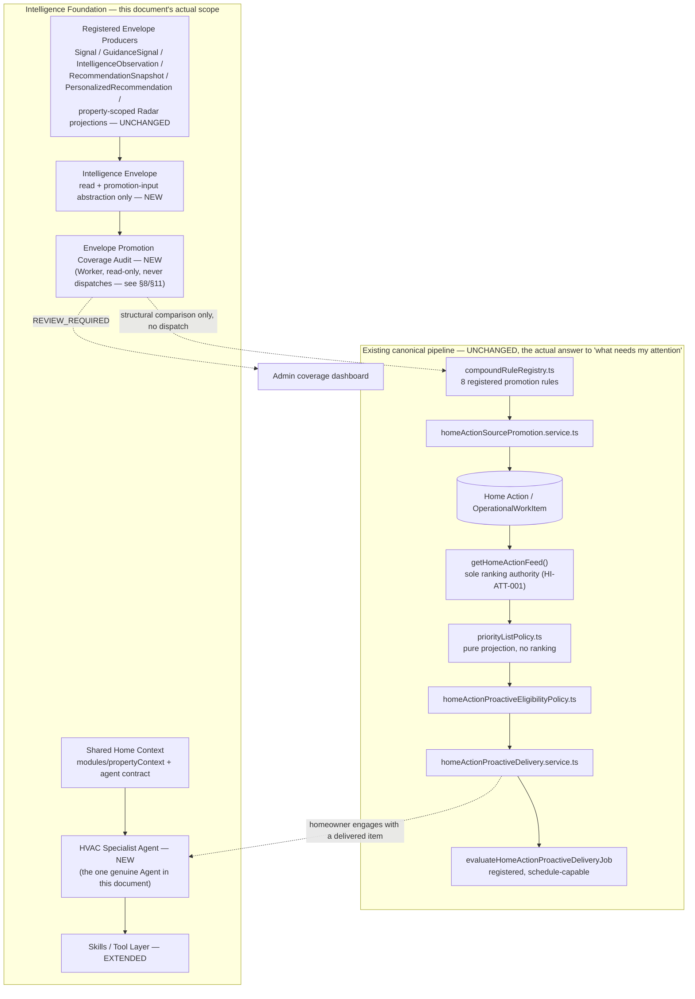
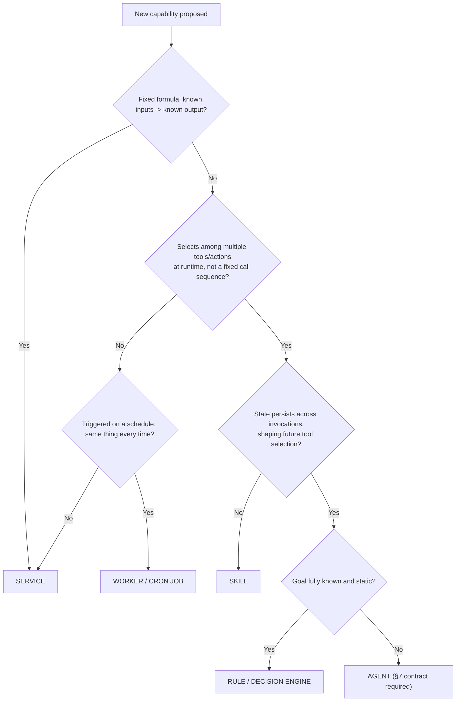
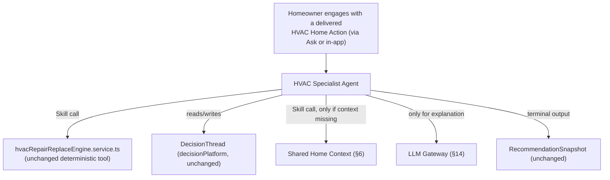
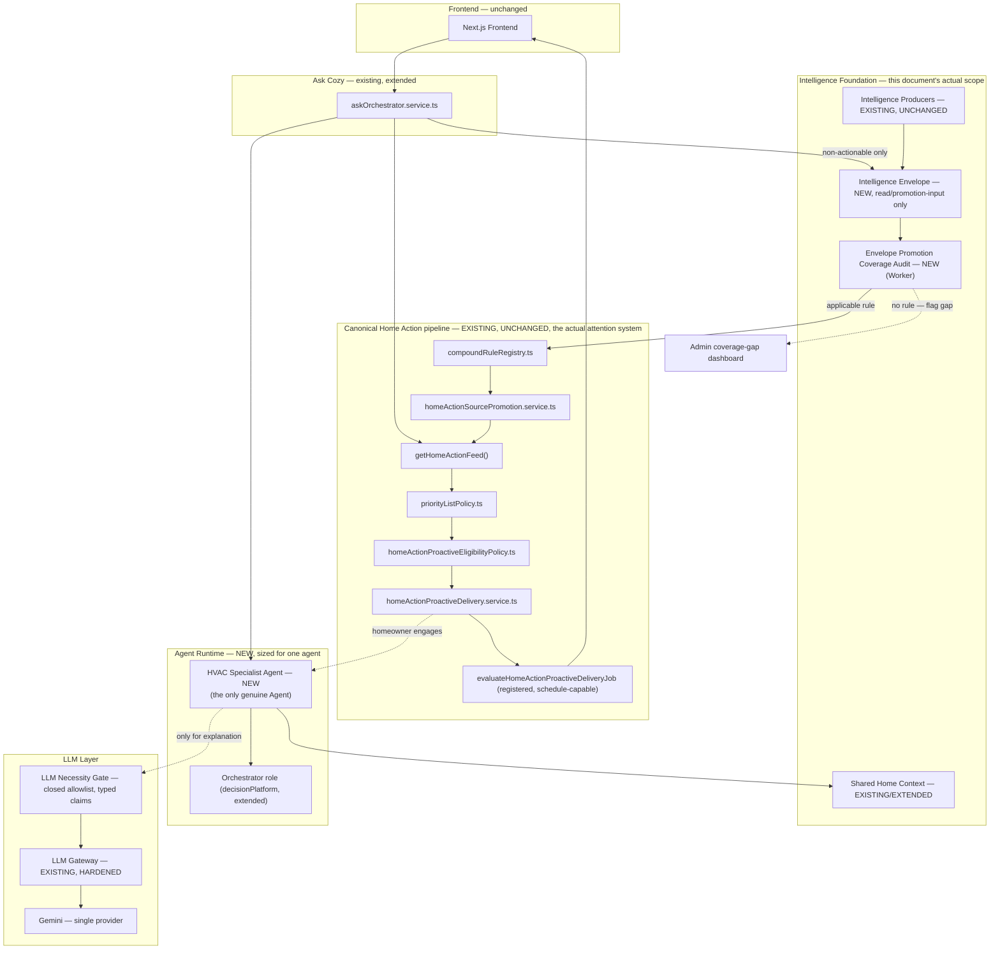
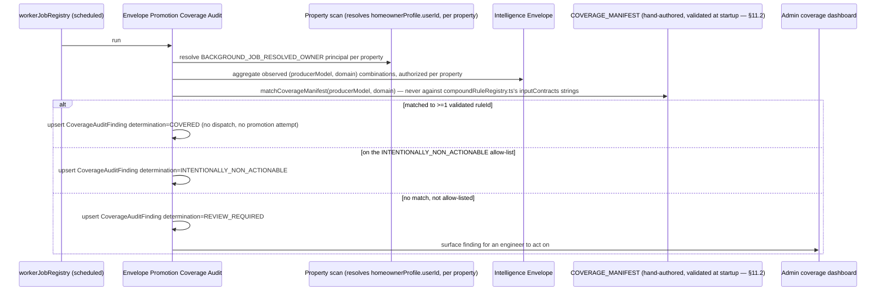
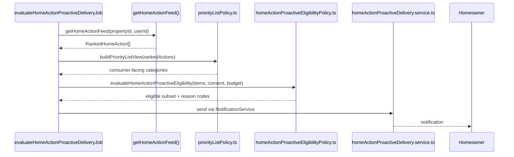
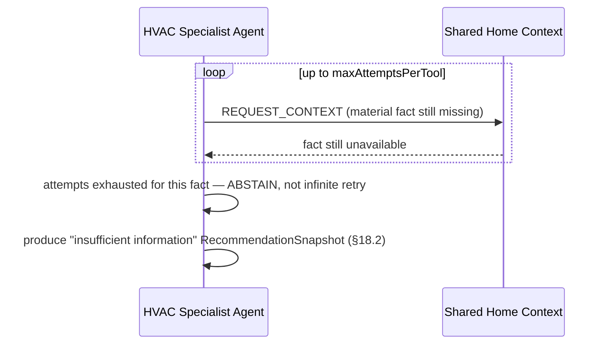
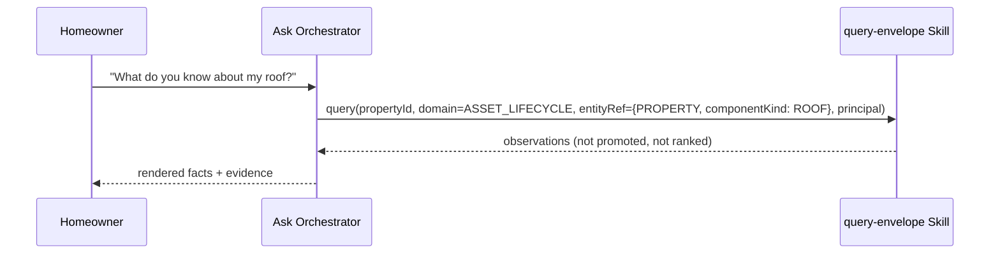

# C2C Intelligence & Agentic Evolution Architecture (Stage 3)

**Date:** 2026-08-26
**Status:** Draft target architecture — third revision, not yet build-approved.
**Grounding evidence:** [`docs/audits/AGENTIC_READINESS_AUDIT.md`](../audits/AGENTIC_READINESS_AUDIT.md) is the evidence base for architectural patterns and gaps at the time it was written. It is not an authoritative product-requirements source, and — critically for this revision — it is not exhaustive: a third external review found that this document had, twice, designed net-new proactive-attention infrastructure that duplicates or bypasses a real, already-shipped canonical pipeline the audit's evidence-density sampling didn't surface. See §1.1 for the requirements this revision is now grounded in, and the box below for what changed.
**Scope:** This document is the requested Stage 3 exercise. It is a target architecture and phased evolution plan, not an implementation. No code changes accompany this document.

> **What this revision corrects, and why it's the most consequential round yet.** C2C already has a fully-implemented canonical pipeline that does most of what this document's first two drafts proposed building from scratch: `compoundRuleRegistry.ts`'s 8 registered rules promote qualifying intelligence into canonical Home Actions via `homeActionSourcePromotion.service.ts`; `getHomeActionFeed()` (`homeActions.service.ts`) is the sole homeowner-facing ranking authority, already consumed identically by Home, Fix, and Resolution Center per a 2026-08-25 convergence (`HOME_INTELLIGENCE_FUNCTIONAL_COMPLETENESS_FRD_AND_IMPLEMENTATION_PLAN.md`); `priorityListPolicy.ts` is a pure, non-ranking projection over that feed; and `homeActionProactiveEligibilityPolicy.ts`/`homeActionProactiveDelivery.service.ts` implement real consent/budget/escalation-gated proactive notification logic, invoked by `evaluateHomeActionProactiveDeliveryJob`, which is registered in `workerJobRegistry.ts` and cron-schedule-capable. **Precisely, not overstated: this pipeline is implemented and schedule-capable, not necessarily active** — `isHomeActionProactiveDeliveryActive()` requires both `HOME_ACTION_PROACTIVE_DELIVERY_ENABLED=true` and a DB kill switch to be off, and the job's own source comment says it is "safe to register even while the feature stays disabled by default." Whether or not it is flipped on in any given environment, it is the canonical, complete, already-built answer to "tell me what needs my attention" for canonical Home Actions — this document does not need to build another one regardless of the flag's current value. Prior drafts of this document built a parallel `unifiedPriorityRanking.service.ts` and an "Attention Watcher Service" that either duplicated this pipeline or would have competed with it for ranking authority — both directly forbidden by `HI-ATT-001` and `ASK-INT-019` (§1.1). This revision retires both, narrows the Envelope to an upstream read/promotion-input role, and narrows this document's genuine net-new contribution to what the shipped pipeline does not yet do: closing intelligence-to-Home-Action coverage gaps, and adding multi-step decision support (the Specialist Agent) on top of an already-ranked, already-delivered item.

## 1.1 Requirements traceability

| Decision area | Authoritative source | What it requires |
|---|---|---|
| Single ranking authority | `docs/product/HOME_INTELLIGENCE_FUNCTIONAL_COMPLETENESS_FRD_AND_IMPLEMENTATION_PLAN.md`, HI-ATT-001 | "`getHomeActionFeed()` shall be the sole homeowner-facing ranking authority... [consumers] shall consume its ranked results or a shared lower-level canonical read service that produces the same results" — binding on §5, §10, §15; this document does not introduce a second ranker |
| Proactive delivery source | Same FRD, HI-ATT-004 | "Proactive delivery shall select from the canonical ranked feed and add only consent, fatigue, delivery-channel, quiet-hours, and escalation gates" — already implemented by `homeActionProactiveEligibilityPolicy.ts`/`homeActionProactiveDelivery.service.ts`; §11 does not re-implement this |
| Canonical projection rule | Same FRD, §7.1 | "[Surfaces] may apply channel-specific presentation limits and eligibility gates, but they shall not independently rescore or recreate the underlying recommendation" |
| Canonical identity rule | Same FRD, §7.2 | Every Home Action resolves to a stable `lineageId`, a stable source entity + version, an optional `OperationalWorkItem.workKey`, an optional `RecommendationSnapshot` — binding on §5.2's Envelope identity redesign |
| Ask ranking constraint | `docs/product/AI_HOME_CONCIERGE_ASK_INTELLIGENCE_INCREMENTAL_FRD.md`, ASK-INT-019 | "Rank only the canonical Home Actions feed using a versioned explainable policy" — Ask never ranks raw Envelope items |
| Guidance-priority scope | `HOME_INTELLIGENCE_FUNCTIONAL_COMPLETENESS_FRD_AND_IMPLEMENTATION_PLAN.md`, 2026-08-25 completion update | "The remaining `guidance-priority` registration explicitly describes its bounded use for Guidance-only journey deduplication... it does not re-rank canonical Home Actions" — this document does not retire or consolidate it further; it was never a competitor to `getHomeActionFeed()` after this convergence |
| Property/context authorization | `docs/product/AI_HOME_CONCIERGE_ASK_TRUST_ARCHITECTURE_ADDENDUM_FRD.md`, parent principle 2 | "Authentication, property access, household authorization, and audience applicability remain deterministic" — binding on §6 |
| Confirmation / material actions | Same FRD, parent principle 5 | "Material actions retain typed input, confirmation, authorization recheck, idempotency, and audit requirements" — binding on §19 |
| Canonical ownership | Same FRD, parent principle 4 | "Canonical services own facts, calculations, decisions, and mutations" — binding on §5's promotion-only write model |
| Rollout / cohort posture | Same FRD, §2.1 | "No rollout, migration, compatibility, or backfill plan is required for existing users because no real users exist" — binding on §7.2, §26 |
| Skill/agent capability boundaries | `docs/product/CONTRACTTOCOZY_SKILL_PLATFORM_FRD.md` | Skill admission rubric and confirmation/authorization preservation — binding on §9 |

## 1.2 Implementation-readiness decision log

This revision is not build-approved until the material decisions below are confirmed by the accountable product/architecture owner. Repository evidence can narrow these choices, but it cannot make the product decisions on the owner's behalf. An implementation PR must cite the resulting decision IDs rather than silently selecting an interpretation.

| ID | Decision required | Evidence-constrained recommendation | Status |
|---|---|---|---|
| `ARD-001` | Envelope producer boundary | The Envelope is the registered read abstraction for property-scoped derived-intelligence artifacts. The initial registry contains the five named producer families—`Signal`, `GuidanceSignal`, `IntelligenceObservation`, `RecommendationSnapshot`, and Radar—plus `PersonalizedRecommendation`; Radar is exposed only through property-scoped `PropertyRadarMatch` / `PropertyRadarCompoundInsight` projections, with global `RadarEvent` retained as evidence. Ordinary domain facts and workflow records remain outside the Envelope. Envelope promotion coverage and comprehensive Home Action producer completeness are separate audits. | **APPROVED — 2026-08-27** |
| `ARD-002` | `EnvelopeDomain` taxonomy | Extract the existing closed `GuidanceIssueDomain` vocabulary into a shared, versioned `IntelligenceIssueDomain` contract and alias both `GuidanceIssueDomain` and `EnvelopeDomain` to it. A domain classifies issue/decision intent; specific assets such as roof, HVAC, or appliance belong in typed `entityRef` metadata. Every adapter mapping is explicit, and unknown values fail certification rather than silently becoming `OTHER`. | **APPROVED — 2026-08-27** |
| `ARD-003` | Authoritative HVAC verdict | For HVAC, `hvacRepairReplaceEngine.service.ts` is the sole computation authority and the current, non-stale Decision Platform `RecommendationSnapshot` is the sole published verdict. `ReplaceRepairAnalysis` may trigger evaluation and supply typed evidence/approved context inputs, but its HVAC verdict is non-authoritative and is never displayed or used as a scoring input. For non-HVAC appliances, `ReplaceRepairAnalysis` remains authoritative and its Decision Platform snapshot is a provenance-preserving projection, not an independent recomputation. | **APPROVED — 2026-08-27** |
| `ARD-004` | Coverage universe | Evaluate declared adapter capabilities as well as combinations observed in fixture/property data; otherwise an empty or narrow beta database can pass vacuously. | **OWNER CONFIRMATION REQUIRED** |
| `ARD-005` | Agent-definition source of truth | Prefer a code-owned immutable registry with startup parity validation, while persisting runs/state only; use a database-owned definition only if runtime administration is an explicit requirement. | **OWNER CONFIRMATION REQUIRED BEFORE PHASE 2** |

The following gaps are resolved and binding in the sections below: `ARD-001` establishes a registered Envelope boundary distinct from the complete Home Action producer inventory; `ARD-002` establishes the shared issue-domain taxonomy and keeps asset identity orthogonal to it; `ARD-003` establishes the HVAC computation/published-verdict authority split and preserves `ReplaceRepairAnalysis` authority only for non-HVAC appliances; Envelope evidence reuses the canonical Home Action evidence shape; conflict identity uses one `QualifiedClaim` contract rather than both `semanticCorrelationKey` and `claimKey`; the coverage worker does not reuse notification-consent filtering; and coverage findings have active/retired reconciliation.

---

## Table of Contents

1. [Executive Summary](#1-executive-summary)
2. [Architectural Principles](#2-architectural-principles)
3. [Current → Target Mapping](#3-current--target-mapping)
4. [C2C Intelligence Foundation](#4-c2c-intelligence-foundation)
5. [Intelligence Envelope Specification](#5-intelligence-envelope-specification)
6. [Shared Context Architecture](#6-shared-context-architecture)
7. [Agent Definition & Agent Contract](#7-agent-definition--agent-contract)
8. [Agent vs Service vs Skill Decision Framework](#8-agent-vs-service-vs-skill-decision-framework)
9. [Skills / Tool Architecture](#9-skills--tool-architecture)
10. [Orchestrator Architecture](#10-orchestrator-architecture)
11. [Attention Layer: The Envelope Promotion Coverage Audit](#11-attention-layer-the-envelope-promotion-coverage-audit)
12. [Specialist Agent Pattern](#12-specialist-agent-pattern)
13. [Agent Interaction Patterns](#13-agent-interaction-patterns)
14. [LLM Gateway & LLM Necessity Gate](#14-llm-gateway--llm-necessity-gate)
15. [Ranking & Interruption Architecture](#15-ranking--interruption-architecture)
16. [Trigger/Event Architecture](#16-triggerevent-architecture)
17. [State & Memory](#17-state--memory)
18. [Conflict Resolution](#18-conflict-resolution)
19. [Governance & Safety](#19-governance--safety)
20. [Observability](#20-observability)
21. [Learning & Outcome Feedback](#21-learning--outcome-feedback)
22. [Ask Cozy Integration](#22-ask-cozy-integration)
23. [Target Architecture Diagram](#23-target-architecture-diagram)
24. [Runtime Sequence Diagrams](#24-runtime-sequence-diagrams)
25. [Database / Persistence Changes](#25-database--persistence-changes)
26. [Implementation Phases](#26-implementation-phases)
27. [Migration / Refactoring Matrix](#27-migration--refactoring-matrix)
28. [Risks & Mitigations](#28-risks--mitigations)
29. [Success Metrics](#29-success-metrics)
30. [Final Recommendation](#30-final-recommendation)
31. [Critical Design Test](#31-critical-design-test)

---

## 1. Executive Summary

**What C2C should become architecturally:** a system where the intelligence C2C already computes reaches the homeowner through exactly one canonical path — `compoundRuleRegistry.ts` promotion → `getHomeActionFeed()` ranking → `priorityListPolicy.ts` projection → eligibility/delivery — and where this document's job is to widen what feeds *into* that path and deepen what happens *after* a homeowner engages with what it surfaces, never to build a second path alongside it.

**The central correction this revision makes:** the first two drafts of this document treated "build proactive attention" as greenfield work. It isn't. `evaluateHomeActionProactiveDeliveryJob` is implemented, registered, and schedule-capable — it reads `getHomeActionFeed()`, applies consent/budget/escalation gates, and sends notifications, for every Home Action that a `compoundRuleRegistry.ts` rule has promoted, whenever its env flag and DB kill switch permit it to run. The genuine gap is narrower and less glamorous than "build an Attention Agent": **not every registered Envelope producer has promotion coverage yet**, and **once a homeowner engages with a promoted, ranked item, nothing today walks them through a multi-step decision** (compare options, explain tradeoffs, maintain a decision thread) the way `decisionPlatform` already can for HVAC specifically. Those two gaps — Envelope promotion coverage, and post-engagement decision depth — are what this document now scopes. Comprehensive Home Action producer completeness remains a separate concern owned by `HOME_ACTION_PRODUCER_OWNERSHIP`.

**What ships, in order:** an Intelligence Envelope, narrowed to the registered property-scoped derived-intelligence producer boundary approved in `ARD-001` and enumerated in §5.5, with no ranking authority of its own (Phase 0) → an **Envelope Promotion Coverage Audit** — not an agent, not a ranker, not a runtime dispatcher; a scheduled Worker that structurally compares which registered Envelope producer/domain combinations `compoundRuleRegistry.ts` already covers against which it doesn't, and surfaces the gap for an engineer to close by hand-authoring a new rule, exactly as the existing 8 were authored (Phase 1) → the HVAC Repair/Replace Specialist Agent, reusing the existing scoring engine and `DecisionThread` machinery, triggered when a homeowner engages with an already-ranked, already-delivered HVAC Home Action (Phase 2) → Ask Cozy wired to the same Envelope and canonical feed as its evidence source (Phase 3) → the extension pattern for additional specialists and additional promotion coverage (Phase 4).

**What this is not, still:** a plan to add a second LLM provider, an event bus, a vector database, or — now explicitly — a second ranking, eligibility, or delivery pipeline alongside the one C2C already ships. Every one of those is directly forbidden by an authoritative requirement (§1.1), not merely undesirable.

---

## 2. Architectural Principles

1. **Context-first, deterministic-first, LLM-last.** Unchanged from prior revisions — every agent exhausts C2C context, existing intelligence, deterministic rules/Skills, and agent coordination before an LLM call.
2. **C2C is the intelligent system; agents are controlled components inside it.**
3. **One ranking authority, full stop.** `getHomeActionFeed()` (or a shared lower-level canonical read service producing identical results, per HI-ATT-001) is the sole homeowner-facing ranking authority. No new component in this document ranks, re-ranks, or produces a competing priority score for anything that is or could be a canonical Home Action. This principle did not exist in prior revisions of this document, and its absence was the root cause this revision corrects.
4. **The Envelope promotes; it does not deliver.** Actionable intelligence reaches a homeowner only by being promoted into a canonical Home Action (via `compoundRuleRegistry.ts` + `homeActionSourcePromotion.service.ts`) and then flowing through the existing, unmodified ranking/eligibility/delivery pipeline. Non-actionable intelligence stays queryable through the Envelope (Ask, Home Briefing) without ever needing promotion.
5. **Adapters before schema migration; no physical merge of registered native producer stores.**
6. **"Agent" is a specific claim, not a label.** Adaptive goal pursuit under bounded, governed autonomy over a genuinely unknown tool space — not scheduling, not background execution, not a fixed branch set. §8 is the enforcement mechanism.
7. **No LLM output becomes authoritative C2C state without validation and provenance.**
8. **Reuse before rebuild.** Every component in §27's matrix is EXISTING, EXTEND, REFACTOR, or WRAP AS TOOL unless a specific justification for NEW is given — and, per this revision, "NEW" is scrutinized hardest of all, because the last two drafts got this wrong for the single largest component in the document.
9. **No autonomy beyond what's earned.** Every agent targets Level 0–2 (§9.2 of the audit).
10. **Minimum necessary infrastructure.** No event bus, no second LLM provider, no vector database — and, as of this revision, no second ranking/eligibility/delivery pipeline either.
11. **An agent identity is attribution, never authority.** Every property read/write carries a real `ExecutionPrincipal`, re-authorized via the unchanged `resolvePropertyAccess`/`getPropertyContext` path.
12. **Every side effect is idempotent, and it reuses an existing idempotency mechanism before inventing a new one.** Home Action promotion already has deduplication keys (per `compoundRuleRegistry.ts`'s `deduplicationKey` field); proactive delivery already has its own budget/consent checks. This document does not build a parallel idempotency system for effects an existing canonical service already makes safe.

---

## 3. Current → Target Mapping

| Existing component | Current role | Target role | Change required |
|---|---|---|---|
| `compoundRuleRegistry.ts` (8 registered rules) + `homeActionSourcePromotion.service.ts` | Canonical promotion of qualifying intelligence into Home Actions | Unchanged authority; gains new rule entries as coverage gaps close (§11) | None to the mechanism; add rules for newly-covered producers |
| `homeActions.service.ts`'s `getHomeActionFeed()` | Sole homeowner-facing ranking authority (HI-ATT-001), already consumed identically by Home/Fix/Resolution Center | Unchanged — remains the only ranker in this architecture | None |
| `priorityListPolicy.ts` | Pure, non-ranking projection of the feed into consumer categories (DO_NOW/PLAN_SOON/WATCH/OPTIONAL/NO_ACTION) | Unchanged | None |
| `homeActionProactiveEligibilityPolicy.ts` + `homeActionProactiveDelivery.service.ts` + `evaluateHomeActionProactiveDeliveryJob` | Already-shipped, registered, schedule-capable proactive notification pipeline with consent/budget/escalation gates | Unchanged — this **is** the "Attention" system for canonical Home Actions | None |
| `modules/propertyContext` | Assembles ~20 typed fact scopes; 27+ callers | Agent-facing context contract (§6) | Add a stable, versioned, budget-aware read wrapper — no internal rewrite |
| `Signal`, `GuidanceSignal`, `IntelligenceObservation`, `RecommendationSnapshot`, `PersonalizedRecommendation`, and property-scoped `PropertyRadarMatch` / `PropertyRadarCompoundInsight` projections | Registered property-scoped derived-intelligence producer families | Read-only through the Intelligence Envelope (§5); their existing promotion paths into `compoundRuleRegistry.ts` inputs (where they have one) are unchanged | Registered read adapters; no schema change, no new write path |
| Ordinary domain facts/workflow records, including inspections, warranties, permits, incidents, inventory, and documents | Canonical domain state, evidence, Property Context, and/or direct Home Action producer inputs | Remain outside the Envelope unless a registered producer derives an Envelope artifact from them | No Envelope adapter; comprehensive direct-producer ownership remains governed by `HOME_ACTION_PRODUCER_OWNERSHIP` |
| `decisionPlatform` (DecisionThread, RecommendationSnapshot, `decisionFamilyAdapterRegistry`) | Real lifecycle machinery, 1 of 7 families (HVAC) does real composition | Backing for the HVAC Specialist Agent's decision-support conversation (§12) | Extend, don't replace |
| `hvacRepairReplaceEngine.service.ts` and HVAC-category `ReplaceRepairAnalysis` | Two independently computed HVAC verdicts can reach different surfaces; `SOURCE_CARD_VERDICT_DIVERGENCE` merely discloses the conflict | HVAC engine is the sole computation authority; the current, non-stale Decision Platform snapshot is the sole published verdict; HVAC `ReplaceRepairAnalysis` is screening/evidence only | Phase 0 removes the generic HVAC verdict from Home Action copy, priority, and scoring; before a snapshot exists the action is neutral, and after one exists it renders only that snapshot |
| Non-HVAC `ReplaceRepairAnalysis` | Existing general-purpose appliance evaluation | Remains the authoritative non-HVAC evaluation; `APPLIANCE_REPAIR_REPLACE` snapshots preserve and project it without recomputation | Phase 4 adds the snapshot adapter and category-aware lineage described in §12.7 |
| `services/skills/` (19 manifests) | Closest existing analog to an agent-tool manifest | The Skill/Tool layer agents call (§9) | Add an autonomy-level tag; no runtime rewrite |
| `aiRequestGovernance.service.ts` | Routes all 25 Gemini invocation sites | LLM Gateway (§14) | Harden the interface; no second provider |
| `askOrchestrator.service.ts` | Deterministic NLU router; `REMOTE_FALLBACK` unwired | Ask Cozy's entry point into the Envelope + canonical feed (§22) | Wire `REMOTE_FALLBACK`; add Specialist Agent as a routable target |
| BullMQ + node-cron + `workerJobRegistry.ts` + `CronJobLock` | Most mature layer in the codebase; already registers the schedule-capable `evaluateHomeActionProactiveDeliveryJob` | Execution substrate for the new Envelope Promotion Coverage Audit job and Specialist Agent runs | Add one new job type to the existing registry |
| pino/Loki + Prometheus + OpenTelemetry | Structured logging, worker/AI cost metrics | End-to-end observability for the Coverage Audit and Specialist Agent (§20) | Extend metric namespaces |

---

## 4. C2C Intelligence Foundation



| Foundation piece | Existing seed | What's new |
|---|---|---|
| Canonical Home Action pipeline | `compoundRuleRegistry.ts` → `getHomeActionFeed()` → `priorityListPolicy.ts` → eligibility → delivery → cron | **Nothing.** Documented here as the authority everything else in this document defers to. |
| Intelligence Envelope | Registered property-scoped derived-intelligence producer families | A read + promotion-input contract with no ranking authority (§5) |
| Envelope Promotion Coverage Audit | None | New scheduled Worker; structurally compares registered Envelope producer/domain combinations against the registry — never dispatches a rule, never promotes anything itself (§11) |
| Skills / Tool layer | `services/skills/` | Autonomy-level tag; HVAC engine wrapped as a callable tool |
| HVAC Specialist Agent | `decisionPlatform`, `hvacRepairReplaceEngine.service.ts` | The genuine multi-step decision-support conversation (§12) |

---

## 5. Intelligence Envelope Specification

### 5.1 Design stance, narrowed twice now

Two corrections compound here. First (round 2): no generic cross-model write contract survives the schema — `Signal` has no status, `RecommendationSnapshot` is immutable, and a global `RadarEvent` cannot itself be a property-scoped Envelope item. Second (round 3, this revision): **the Envelope has no ranking or delivery authority at all.** Per approved `ARD-001`, it is the registered read abstraction for property-scoped derived-intelligence artifacts; §5.5 defines the initial registry. It is used for exactly two purposes:

1. Giving the Envelope Promotion Coverage Audit (§11) one uniform surface to enumerate registered producer/domain combinations from, so it can structurally compare them against `compoundRuleRegistry.ts`'s declared coverage — a read-only comparison, never a runtime rule dispatch (§11.1 explains why the registry cannot be dispatched against at runtime).
2. Giving Ask Cozy and Home Briefing a uniform way to surface non-actionable observations that have not been (and may never need to be) promoted into a Home Action.

It has no write-back to producers beyond what §5.5 describes, no consumer-facing dismissal/snooze state (Home Actions already have a full lifecycle — `homeActionUsefulnessFeedback.service.ts`, `getSuppressedHomeActionIds`, and the HI-ATT-005 command policy — and this document does not build a second one), and no per-user overlay, and — per §5.7 — no per-item cursor either, since coverage is evaluated at the coarser producer/domain level, not per Envelope item.

### 5.2 Envelope identity — lineage, revision, and content change, kept separate

Round 2 conflated identity with revision: `EnvelopeKey` embedded `sourceRecordId`, but an immutable revision's successor (a new `RecommendationSnapshot` row via `supersedesSnapshotId`, a new `Signal` row at a bumped `version`) has a *different* record ID and therefore a *different* key under that scheme — supersession became undetectable by construction. The Home Action canonical identity rule already solves this correctly (§1.1: "a stable `lineageId`... a stable source entity and version") — reused here rather than reinvented:

```ts
type LineageKey = string;    // stable across every revision of the same logical recommendation/signal —
                              // reuses the native lineageId where the producer has one (RecommendationSnapshot's
                              // supersession chain, GuidanceSignal's duplicateGroupKey), or is derived the same
                              // way a promotion rule already derives it (compoundRuleRegistry.ts's own
                              // deduplicationKey field is exactly this concept, per-rule) where it doesn't
type RevisionKey = string;   // `${sourceModel}:${sourceRecordId}` — identifies the exact native row/revision
type EnvelopeKey = string;   // `${type}:${propertyId}:${RevisionKey}` — this specific revision's Envelope identity
```

`nativeRevisionToken` (§5.7) detects in-place changes *to a given revision* (e.g. a mutable field on a row that doesn't create a new record) — a narrower, complementary concern to `LineageKey`'s cross-revision stability. Supersession is detected by comparing `LineageKey`s across reads, not by comparing `EnvelopeKey`s, which are expected to change on every new revision.

### 5.3 Field contract

```ts
const ENVELOPE_TYPES = ["SIGNAL", "GUIDANCE", "OBSERVATION", "RECOMMENDATION", "RADAR_INSIGHT"] as const;
type EnvelopeType = typeof ENVELOPE_TYPES[number];

const ENVELOPE_PRODUCER_MODELS = [
  "Signal",
  "GuidanceSignal",
  "IntelligenceObservation",
  "RecommendationSnapshot",
  "PersonalizedRecommendation",
  "PropertyRadarMatch",
  "PropertyRadarCompoundInsight",
] as const;
type EnvelopeProducerModel = typeof ENVELOPE_PRODUCER_MODELS[number];

// ARD-002: this shared product-framework contract is extracted from guidanceTypes.ts;
// neither the Envelope nor Guidance owns a private copy of the vocabulary.
const INTELLIGENCE_ISSUE_DOMAINS = [
  "SAFETY", "MAINTENANCE", "INSURANCE", "FINANCIAL", "COMPLIANCE",
  "MARKET_VALUE", "ASSET_LIFECYCLE", "CLAIMS", "PRICING", "NEGOTIATION",
  "BOOKING", "DOCUMENTATION", "NEIGHBORHOOD", "ONBOARDING", "WEATHER",
  "ENERGY", "OTHER",
] as const;
const INTELLIGENCE_ISSUE_DOMAIN_TAXONOMY_VERSION = "1.0";
type IntelligenceIssueDomain = typeof INTELLIGENCE_ISSUE_DOMAINS[number];
type GuidanceIssueDomain = IntelligenceIssueDomain;
type EnvelopeDomain = IntelligenceIssueDomain;

type EntityRefKey = string; // canonical `${entityType}:${entityId}` key
type RegisteredPropertyComponentKind = keyof typeof PROPERTY_COMPONENT_KIND_REGISTRY; // e.g. ROOF, FOUNDATION
type RegisteredAssetKind = keyof typeof ASSET_KIND_REGISTRY; // closed shared registry beneath InventoryItemCategory
type EnvelopeEntityRef =
  | { entityType: "PROPERTY"; entityId: string; componentKind?: RegisteredPropertyComponentKind }
  | { entityType: "INVENTORY_ITEM"; entityId: string; assetCategory: InventoryItemCategory; assetKind?: RegisteredAssetKind }
  | { entityType: "DOCUMENT" | "INCIDENT" | "SERVICE" | "DECISION_THREAD"; entityId: string };

// Extracted into a shared product-framework contract from HomeAction's existing
// EvidenceReferenceSchema; the Envelope must not create a second evidence vocabulary.
interface EvidenceRef {
  id: string;
  type: "PROPERTY_FACT" | "DOCUMENT" | "HOME_EVENT" | "USER_INPUT" | "EXTERNAL_SOURCE" | "SYSTEM_DERIVATION";
  label: string;
  source: string;
  observedAt: string | null;
  freshness: "CURRENT" | "STALE" | "UNKNOWN";
  confidence: number | null; // normalized 0..1
}

type EnvelopeSeverity = "INFO" | "LOW" | "MEDIUM" | "HIGH" | "CRITICAL" | "UNKNOWN";

interface QualifiedClaim {
  claimKey: {
    propertyId: string;
    entityRef: EntityRefKey | null;
    propositionType: string;          // closed registry value, never caller-authored free text
    assessmentHorizonVersion: string;
  };
  verdict: string;                    // native verdict retained; compatibility is decided by a domain-owned table
}

interface IntelligenceEnvelopeItem {
  envelopeKey: EnvelopeKey;
  lineageKey: LineageKey;
  nativeRevisionToken: string;
  qualifiedClaim?: QualifiedClaim;   // present only for verdict-bearing items; see §18.1

  type: EnvelopeType;
  domain: EnvelopeDomain;             // one primary issue/decision domain; never an asset type
  relatedDomains?: EnvelopeDomain[];  // optional secondary facets; excluded from coverage-key matching
  domainTaxonomyVersion: typeof INTELLIGENCE_ISSUE_DOMAIN_TAXONOMY_VERSION;
  subject: { propertyId: string; userId?: string; entityRef?: EnvelopeEntityRef };

  source: { producer: string; sourceModel: EnvelopeProducerModel; sourceRecordId: string };
  provenance: { generatedBy: "DETERMINISTIC" | "LLM" | "EXTERNAL_INGEST" | "HYBRID"; method: string; modelVersion?: string };

  confidence: number | null;
  evidence: EvidenceRef[];
  severity: EnvelopeSeverity | null;

  // No importanceScore, no priorityScore, no ranking field of any kind (Principle 3).
  // Ranking happens only after promotion, only inside getHomeActionFeed().

  freshness: { computedAt: string; ttl: string | null; staleAfter: string | null };
  nativeStatus: string | null;   // read-through only, per producer (§5.6)

  // No promotion/coverage field on the item itself — per §11.2, coverage is determined at the
  // coarser (producerModel, domain) level, not per item, and lives in CoverageAuditFinding (§25),
  // not on IntelligenceEnvelopeItem. An earlier draft carried a per-item coverageStatus field here;
  // it implied a per-item evaluation this document's mechanism doesn't actually perform.

  createdAt: string;
  updatedAt: string;
}
```

`IntelligenceIssueDomain` and `EvidenceRef` are shared product-framework contracts. `GuidanceIssueDomain` and `EnvelopeDomain` alias the former; Home Actions and the Envelope import the latter rather than copying its schema. Domain means the issue or decision intent—`ASSET_LIFECYCLE`, `MAINTENANCE`, `WEATHER`, and so on—not the affected asset. A roof lifecycle item therefore uses `domain: "ASSET_LIFECYCLE"` with a property-component `entityRef`; an HVAC item uses the same issue vocabulary with an inventory-item `entityRef` whose `assetCategory` is `HVAC`.

Each adapter declares exactly one primary-domain mapping for every native subtype/key. Optional `relatedDomains` may preserve genuine cross-cutting facets, but §11 coverage keys use only the primary `domain`. An unknown native value is an `UNMAPPED_NATIVE_VALUE` diagnostic and certification failure. `OTHER` remains in the inherited Guidance vocabulary for compatibility but may be emitted by an Envelope adapter only through an explicit, reviewed mapping—never as a fallback.

### 5.4 Mandatory vs optional

| Field group | Mandatory? | Rationale |
|---|---|---|
| `envelopeKey`, `lineageKey`, classification, `domainTaxonomyVersion`, subject | Mandatory | Identity, supersession, and interpretation of a versioned domain mapping require them |
| `source` / `provenance` | Mandatory | Provenance is structurally required (Principle 7) |
| `confidence` / `evidence` | Mandatory field, nullable value | Preserves §18.2's abstention requirement |
| `severity` | Mandatory field, nullable value | Not every item is severity-typed |
| `freshness` | Mandatory | Reuses `IntelligenceConsumerCurrentness` |
| `nativeStatus` | Mandatory field, nullable value | Read-through only, `null` for producers with no status (`Signal`) |
| — | — | No promotion/coverage field exists on this type (§5.3's note) — coverage is tracked separately, at the `(producerModel, domain)` level, in `CoverageAuditFinding` (§25) |

### 5.5 Per-subsystem adapter mapping

| Native store | Envelope `type` | `nativeStatus` source | Fidelity note |
|---|---|---|---|
| `Signal` | `SIGNAL` | Always `null` (no status field) | 9 hardcoded keys map to a fixed `domain` subset |
| `GuidanceSignal` | `GUIDANCE` | `GuidanceSignal.status` (read-through) | `issueDomain` maps identically to the shared vocabulary; `severity` derives from `severityScore` + `confidenceScore` |
| `IntelligenceObservation` | `OBSERVATION` | Its own status field | A closed observation-type mapping supplies the primary domain; often `confidence: null` pre-scoring |
| `RecommendationSnapshot` | `RECOMMENDATION` | Always `null` (immutable) | A closed `recommendationDefinitionId` mapping supplies the primary domain; supersession is a new `LineageKey`-sharing item |
| `PersonalizedRecommendation` | `RECOMMENDATION` | `PersonalizedRecommendation.status` (read-through) | A reviewed definition-code/category mapping supplies the primary domain; preserve versions, confidence, expiry, and explanations while omitting native `score`/`priorityBand` |
| `PropertyRadarMatch` / `PropertyRadarCompoundInsight` | `RADAR_INSIGHT` | Property-scoped match/insight lifecycle status, **never** the global `RadarEvent.status` | A closed match/compound-rule mapping supplies the primary issue domain; affected assets stay in `entityRef`; global `RadarEvent` is evidence only |

Every adapter must also publish a static descriptor containing its `producerModel`, supported `EnvelopeType`s, supported primary `EnvelopeDomain`s, complete native subtype/key mapping, `domainTaxonomyVersion`, lineage derivation version, revision-token algorithm, and freshness policy. The mapping table—not an asset-name heuristic—assigns the primary issue domain. An unmapped native subtype is returned in adapter diagnostics and fails the coverage certification fixture; it is never silently emitted as `OTHER` or dropped.

#### 5.5.1 Admission rubric and exclusion boundary

A producer may enter the Envelope registry only when its output:

1. is a derived observation, signal, recommendation, match, or compound insight rather than an ordinary domain record;
2. is scoped to one property or authorized household;
3. has stable lineage and a distinguishable native revision;
4. can provide provenance, evidence, freshness/currentness, and nullable confidence without fabricating them;
5. is independently meaningful to Ask Cozy, Home Briefing, or promotion-gap analysis;
6. requires no generic Envelope write semantics or duplicate lifecycle;
7. maps every native subtype/key to the approved issue-domain taxonomy while keeping asset identity in typed `entityRef` metadata; and
8. does not introduce ranking authority into the Envelope.

`DerivedTrait` remains supporting context/evidence rather than a separately registered Envelope producer. Inspections, warranties, permits, incidents, inventory, documents, and similar canonical records remain outside the Envelope unless they enter one of the registered producers above. They may still feed Property Context, appear as evidence, or produce Home Actions directly.

This boundary creates two deliberately separate controls: the **Envelope Promotion Coverage Audit** (§11) checks only registered Envelope producers, while the existing `HOME_ACTION_PRODUCER_OWNERSHIP` registry and its validation remain the comprehensive inventory for every canonical Home Action producer. Passing one audit does not imply passing the other.

### 5.6 What the Envelope does NOT do (this revision's binding constraint)

- It does not rank. It does not compute anything resembling `importanceScore`. `getHomeActionFeed()` does that, for canonical Home Actions, exclusively (Principle 3).
- It does not deliver, notify, or track per-homeowner dismissal/snooze. `homeActionProactiveEligibilityPolicy.ts`/`homeActionProactiveDelivery.service.ts`/the existing lifecycle-command policy (HI-ATT-005) do that, exclusively.
- It does not write producer state beyond what an existing domain-owned command already permits (unchanged from round 2's finding — `Signal`/`RecommendationSnapshot` have no lifecycle to transition at all).

### 5.7 No per-item cursor — the Envelope itself needs no additional persistence for coverage purposes

An earlier draft of this section proposed a per-item `EnvelopeEvaluationCursor`, on the assumption that closing a coverage gap meant re-evaluating individual Envelope items against a live rule dispatcher. §11 replaces that mechanism with a structural audit comparing *producer/domain combinations* (not individual items) against the registry, recomputed fresh on every run rather than cached incrementally — so there is no per-item state for the Envelope to track at all. The one new persisted model this document introduces for coverage purposes, `CoverageAuditFinding`, is keyed by `(producerModel, domain)`, not by `envelopeKey`, and is defined in §11.2/§25, not here.

### 5.8 Query and adapter contract

The Envelope is a backend read service and a governed `query-envelope` Skill, not a public unbounded table scan. Both callers use the same service contract:

```ts
interface IntelligenceEnvelopeQuery {
  propertyId: string;
  principal: ExecutionPrincipal;
  types?: EnvelopeType[];
  domains?: EnvelopeDomain[];
  entityRefs?: EnvelopeEntityRef[];
  sourceModels?: EnvelopeProducerModel[];
  currentness?: Array<"CURRENT" | "STALE" | "UNKNOWN">;
  createdAfter?: string;
  createdBefore?: string;
  cursor?: string;
  limit: number;                 // 1..100; default 50 at the API/Skill boundary
}

interface IntelligenceEnvelopePage {
  items: IntelligenceEnvelopeItem[];
  nextCursor: string | null;
  diagnostics: Array<{
    producerModel: EnvelopeProducerModel;
    code: "ADAPTER_FAILED" | "UNMAPPED_NATIVE_VALUE" | "AUTHORIZATION_DENIED" | "TIME_BUDGET_EXHAUSTED";
    count: number;
  }>;
  contextVersion: string;
  generatedAt: string;
}
```

Ordering is deterministic: `createdAt DESC`, then `envelopeKey ASC`. The cursor encodes both values and the query-shape digest; a cursor cannot be reused with different filters. The service authorizes through the real property principal before invoking any adapter, applies a total latency budget, isolates an individual adapter failure into diagnostics, and returns no item from an adapter that could not construct mandatory identity, provenance, evidence, or freshness fields. Ask may summarize only returned items; it may not turn a diagnostic or absent row into a negative factual claim.

---

## 6. Shared Context Architecture

### 6.1 Why this, not direct Prisma access

Unchanged from prior revisions: `modules/propertyContext` already does the hard part; the gap is contract stability for a new class of caller (the Specialist Agent), not capability.

### 6.2 The agent-facing contract

An earlier draft's `SYSTEM_PURPOSE` principal (a bare `grantedByUserId`/`purpose`/`grantedAt` tuple) was an invented authorization primitive with no backing grant record — no grant ID, no property scope, no expiration, no revocation state, and nothing that could actually be checked or revoked. It also wasn't consistently threaded through: the Coverage Audit's own pseudocode called `queryEnvelope()` with no principal argument at all. The fix is to invent nothing: **[verified]** `evaluateHomeActionProactiveDeliveryJob` already solves this exact problem — for each property it reads `property.homeownerProfile.userId` and passes that real, resolved user ID into the property-scoped work it does. Every background job in this document reuses that identical pattern instead of a new grant type:

```ts
type ExecutionPrincipal =
  | { kind: "HOMEOWNER_SESSION"; userId: string }              // a live, user-initiated request (Ask Cozy)
  | { kind: "BACKGROUND_JOB_RESOLVED_OWNER"; userId: string };  // a background job resolves the property's own
                                                                  // homeownerProfile.userId (the same field
                                                                  // evaluateHomeActionProactiveDeliveryJob already
                                                                  // reads) and authorizes as that real user —
                                                                  // not a new grant type, no invented authority

interface AgentContextRequest {
  propertyId: string;
  principal: ExecutionPrincipal;     // resolves to getPropertyContext's actor.userId — the real authorization gate
  requestingAgentId: string;          // attribution only, never authority
  scopes: PropertyContextScope[];
  maxFacts?: number;
  maxLatencyMs?: number;
}
```

**[verified]** `getPropertyContext(propertyId, actor: PropertyContextActor, request, ...)` calls `dependencies.authorize(actor.userId, propertyId)` (→ `resolvePropertyAccess`) before reading a single fact, throwing `PropertyContextAccessDeniedError` on failure — this wrapper is passed straight through, never bypassed. Every call site that constructs an `AgentContextRequest` — including the Coverage Audit's own property-scoped reads, where it needs them — supplies a `principal` explicitly; there is no code path that queries property-scoped data without one.

### 6.3 What agents must NOT do

- Import Prisma clients directly for property/homeowner facts.
- Request unscoped context.
- Treat `requestingAgentId` as authorization.
- Rank anything (Principle 3) or send a homeowner-facing notification outside the existing delivery pipeline (Principle 4).

---

## 7. Agent Definition & Agent Contract

### 7.1 Formal definition

> **A C2C Agent is a component that pursues a bounded, stated goal by adaptively selecting among multiple registered tools or actions, against subject state that is not fully known when it starts, with every state transition logged, budgeted, and revocable.**

### 7.2 Agent Contract

```ts
interface AgentDefinition {
  agentId: string;
  name: string;
  responsibility: string;
  supportedDomains: EnvelopeDomain[];
  acceptedTriggers: AgentTrigger[];     // USER_INITIATED | HOME_ACTION_ENGAGEMENT | SPECIALIST_HANDOFF

  requiredContext: PropertyContextScope[];
  allowedSkills: string[];
  prohibitedSkills?: string[];

  executionMode: "SYNC" | "ASYNC_LONG_RUNNING";
  stateRequirements: { persistsAcrossInvocations: boolean; stateShape?: string };

  outputContract: {
    producerCommandsAllowed: string[];  // domain-owned commands this agent may call — never a generic writer
    producesRecommendation: boolean;    // via RecommendationSnapshot — never a new ranking or delivery record
    maxAutonomyLevel: 0 | 1 | 2;
  };

  budgets: { maxContextFactsPerRun: number; maxLLMInvocationsPerRun: number; maxLLMCostPerRunUsd: number; maxExecutionMsPerRun: number; maxLoopIterations: number };

  killSwitch: string;
  featureFlag: string;
  releaseState: "DEV" | "EVAL_APPROVED" | "ENABLED" | "DISABLED";

  retryPolicy: { maxAttempts: number; backoffMs: number };
  timeoutMs: number;
  escalationPolicy: { onLowConfidence: "ABSTAIN" | "ASK_HOMEOWNER"; onToolFailure: "RETRY" | "ABSTAIN" | "ESCALATE_TO_HUMAN_REVIEW"; onLoopBudgetExhausted: "ABSTAIN_WITH_PARTIAL_RESULT" };

  auditRequirements: { logEveryToolCall: true; logEveryStateTransition: true };
  safetyLevel: "RECOMMEND" | "DRAFT";
  evaluationSuiteId: string;
}
```

`maxLoopIterations` and `onLoopBudgetExhausted` are new in this revision (§12.3 explains why). `acceptedTriggers` dropped `ENVELOPE_CHANGE`/`SPECIALIST_DISCOVERY` — the only agent in this document (§12) is triggered by homeowner engagement with an already-delivered canonical item, not by an Envelope event.

### 7.3 What's reused vs. new

Unchanged from round 2: risk policy, context budget, kill-switch/feature-flag convention, and evaluation-suite requirement are all reused from `services/skills/skill.contract.ts`; `releaseGate.service.ts`'s cohort mechanism remains available but not required (§1.1's rollout-posture citation).

---

## 8. Agent vs Service vs Skill Decision Framework



| Kind | C2C examples |
|---|---|
| **Service** | `getHomeActionFeed()`, `hvacRepairReplaceEngine.service.ts`, `priorityListPolicy.ts`, any Envelope adapter |
| **Worker / cron job** | `evaluateHomeActionProactiveDeliveryJob` (existing), the **Envelope Promotion Coverage Audit** (new, §11) — both fixed evaluate-against-registry logic, no adaptive judgment |
| **Skill / Tool** | Any of the 19 existing `SkillDefinition`s |
| **Rule / decision engine** | `compoundRuleRegistry.ts`'s 8 promotion rules |
| **Agent** | The HVAC Specialist Agent (§12) — the only one this document ships |

**Explicit non-agents this document is careful not to mislabel, having mislabeled the Envelope Promotion Coverage Audit's predecessor twice already:** the Coverage Audit evaluates a fixed rule registry — it does not decide *whether* to promote (the registry does), only whether registered Envelope producer/domain coverage is declared. That is Rule-adjacent Worker behavior, not Agent behavior, even though it periodically examines every registered Envelope producer.

---

## 9. Skills / Tool Architecture

Unchanged in substance from round 2: `services/skills/` is extended with an `autonomyLevel` field; existing manifests (HVAC repair/replace, coverage, maintenance, document-promotion, refinance, ownership-cost, property-record, household/seller-preparation/buyer-closing) are reused directly by the Specialist Agent. **Agent → Skill/Tool → Domain Service, never Agent → Prisma.** The one Skill this document adds is `query-envelope` (read-only, for Ask's non-actionable-observation use case, §22) — there is no `query-canonical-feed` Skill, because Ask calls `getHomeActionFeed()` the same way every other canonical surface already does, not through a Skill indirection.

---

## 10. Orchestrator Architecture

### 10.1 Scope, narrowed

The orchestrator's footprint shrinks further this revision: it no longer routes Envelope-detected items to specialists (there is no Attention Agent doing that routing anymore — see §11). Its entire remaining job is the HVAC Specialist Agent's own multi-step workflow:

| Belongs to orchestration | Does NOT belong to orchestration |
|---|---|
| Sequencing the Specialist Agent's `selectNextTool` loop (§12.3) | Domain scoring (stays in `hvacRepairReplaceEngine.service.ts`) |
| Managing the loop's execution/iteration budget | Home Action ranking (stays in `getHomeActionFeed()`) |
| Handling tool-call failures and retries | Promotion (stays in `compoundRuleRegistry.ts`/`homeActionSourcePromotion.service.ts`) |
| Detecting the loop's completion or abstention | Notification transport (stays in the existing delivery pipeline) |

### 10.2 Reuse of `decisionPlatform`

Corrected twice over in this revision. First, terminology: per §12.5's hierarchy, `DecisionThread` remains the business-facing decision-lineage record the Specialist Agent reads/writes — it is not the agent's own execution/audit record, which is `AgentRun` (append-only, one per invocation) with `AgentState` only for a paused/resumable run.

Second, a category error: **[verified]** `decisionFamilyAdapterRegistry.ts` maps a `DecisionDefinitionId` (`HVAC_REPAIR_REPLACE`, `REFINANCE_OPPORTUNITY`, `HOME_CAPITAL_TIMELINE_WINDOW`, ...) to the adapter that resolves *that decision's* `DecisionThread` lineage — it is keyed by decision *definitions* (a business question with a canonical answer shape), not by orchestration mechanisms. "Agent-driven handoff" is not a decision definition and has no lineage of its own to resolve; it does not belong in this registry at all. A future family — e.g. `APPLIANCE_REPAIR_REPLACE`, covering non-HVAC appliances per §12.6 (HVAC itself keeps its own `HVAC_REPAIR_REPLACE` definition, unchanged) — would earn its own registry entry the same way `HVAC_REPAIR_REPLACE` already has one, because it is itself a decision definition with a canonical verdict shape. Handoff routing (which specialist a homeowner's engagement reaches) is entirely an Agent/Orchestrator-contract concern (§7, §13), never a `decisionFamilyAdapterRegistry` entry.

---

## 11. Attention Layer: The Envelope Promotion Coverage Audit

### 11.1 What this section is not, anymore (twice over now)

Rounds 1–2 designed an "Attention Watcher Service"/"Attention Agent" that ranked Envelope items and proposed them for interruption — retired in round 3, because `getHomeActionFeed()` → `priorityListPolicy.ts` → `homeActionProactiveEligibilityPolicy.ts` → `homeActionProactiveDelivery.service.ts` → `evaluateHomeActionProactiveDeliveryJob` already does that job. Round 3's own first pass at this section then designed a live runtime dispatcher — internally called "Promotion Coverage Service" at the time — that would call `findApplicableRule()` and `triggerPromotionIfNotAlreadyPromoted()` at runtime, per property, per Envelope item. **That design is what this section replaces with the read-only Coverage Audit below**, because the runtime-dispatch design doesn't survive contact with `compoundRuleRegistry.contract.ts`'s own header comment: the registry is explicitly declarative — "a rule's actual evaluation lives in a real, independently testable function, not a stored callback here... turning this registry into a runtime dispatcher over arbitrary stored callbacks is exactly the 'generic registry becomes a rules engine' risk the FRD's own risk table (§18) warns against." `applicability` and `deduplicationKey` are documentation strings for audit purposes, not executable predicates a service can evaluate against an Envelope item at runtime. And **[verified]** `getPromotedHomeActions()` (`homeActionSourcePromotion.service.ts:4962`) doesn't work the way a "trigger promotion" call would need it to, either — it's a *read-time projection*: `getHomeActionFeed()` calls it, and it in turn calls one hardcoded producer-loader function per registry entry (`loadIncidentActions`, `loadCompoundRadarInsightActions`, `loadInspectionCoverageActions`, ...) fresh on every read. There is no persisted "promotion event" to trigger and no generic dispatch surface to call it through — each rule's evaluation logic is bespoke, hand-written, and wired directly into the read path when the rule is authored. Closing a coverage gap is a code change (a new loader function + a new registry entry + a new call site in `getPromotedHomeActions()`), not something a generic service can do by "evaluating" an item at runtime.

### 11.2 What this document actually contributes instead: a structural coverage audit, not a live dispatcher

This audit's universe is the closed `ENVELOPE_ADAPTERS` registry approved by `ARD-001`: the five named producer families (`Signal`, `GuidanceSignal`, `IntelligenceObservation`, `RecommendationSnapshot`, and Radar) plus `PersonalizedRecommendation`. The Radar family contributes only property-scoped `PropertyRadarMatch` / `PropertyRadarCompoundInsight` projections; global `RadarEvent` is evidence, not a registered Envelope item. The audit does **not** claim to inventory every Home Action source. Comprehensive producer completeness—including direct producers backed by inspections, warranties, permits, incidents, inventory, documents, and other ordinary domain records—continues to be enforced by `HOME_ACTION_PRODUCER_OWNERSHIP` and its validation. The two audits may share reporting conventions, but neither substitutes for the other.

Given the above, the only honest, buildable version of this idea is a **read-only, structural comparison** between what the Envelope's adapters declare/observe and what `compoundRuleRegistry.ts` already declares coverage for — a report for an engineer to act on, never a component that promotes anything itself. Subject to `ARD-004`, the audit compares two inputs: static producer/domain capabilities declared by the adapter descriptors (§5.5), and combinations actually observed in authorized fixture/property reads. Keeping them separate prevents an empty or narrow beta database from passing coverage merely because it happened not to contain a supported combination.

Observed combinations are gathered with a coverage-specific paginated property query. The job reuses only `evaluateHomeActionProactiveDeliveryJob`'s proven pattern of resolving each property's real `homeownerProfile.userId`; it **does not** reuse that job's notification-consent filter, because consent to external delivery has no bearing on whether an internal producer/domain combination exists. For each property, it constructs a `BACKGROUND_JOB_RESOLVED_OWNER` principal (§6.2), performs an authorized Envelope read, and aggregates distinct pairs. Properties with no resolvable homeowner are counted as `OWNER_UNRESOLVED` diagnostics and skipped rather than read under fabricated authority.

```ts
type CoverageDetermination = "COVERED" | "INTENTIONALLY_NON_ACTIONABLE" | "REVIEW_REQUIRED";
// NOT_APPLICABLE from earlier drafts is gone — every combination gets an explicit determination;
// "no matching rule" alone is never sufficient to conclude a gap (see the INTENTIONALLY_NON_ACTIONABLE
// case below), so the binary COVERED/GAP_FLAGGED split from the prior draft is retired.

interface CoverageAuditFinding {
  producerModel: EnvelopeProducerModel;
  domain: EnvelopeDomain;
  auditInputsDigest: string;          // hash of rule IDs + manifest + non-actionable declarations +
                                        // adapter primary-domain declarations + taxonomy version; see §11.3
  determination: CoverageDetermination;
  matchedRuleIds: string[];           // ruleIds from COVERAGE_MANIFEST for this (producerModel, domain) pair —
                                        // never derived from inputContracts (11.2's matching correction)
  evidenceBasis: "DECLARED_AND_OBSERVED" | "DECLARED_ONLY" | "OBSERVED_ONLY";
  active: boolean;
  firstObservedAt: string | null;
  lastObservedAt: string | null;
  lastAuditedAt: string;
  retiredAt: string | null;
}

// A short, human-maintained allow-list — NOT inferred, NOT the audit's own judgment call — of
// producer/domain combinations that are known-and-intended to stay informational-only (e.g. raw
// ambient Signal readings with no actionable threshold). Anything not on this list and not matched
// to a registry entry is REVIEW_REQUIRED, never silently dropped.
const INTENTIONALLY_NON_ACTIONABLE: ReadonlySet<`${EnvelopeProducerModel}:${EnvelopeDomain}`> = new Set([/* ... */]);

function auditCoverage(
  declaredCombinations: { producerModel: EnvelopeProducerModel; domain: EnvelopeDomain }[],
  observedCombinations: { producerModel: EnvelopeProducerModel; domain: EnvelopeDomain }[],
): CoverageAuditFinding[] {
  const auditInputsDigest = hashAuditInputs(
    COMPOUND_RULE_REGISTRY,
    COVERAGE_MANIFEST,
    INTENTIONALLY_NON_ACTIONABLE,
    ENVELOPE_ADAPTERS,
    INTELLIGENCE_ISSUE_DOMAIN_TAXONOMY_VERSION,
  );
  const combinations = unionWithEvidenceBasis(declaredCombinations, observedCombinations);
  return combinations.map(({ producerModel, domain, evidenceBasis }) => {
    const matchedRuleIds = matchCoverageManifest(producerModel, domain);   // see below — never a string heuristic
    const determination: CoverageDetermination =
      matchedRuleIds.length > 0 ? "COVERED"
      : INTENTIONALLY_NON_ACTIONABLE.has(`${producerModel}:${domain}`) ? "INTENTIONALLY_NON_ACTIONABLE"
      : "REVIEW_REQUIRED";
    return {
      producerModel, domain, auditInputsDigest, determination, matchedRuleIds, evidenceBasis,
      active: true,
      firstObservedAt: /* upsert-preserved; unset for DECLARED_ONLY until first observed */ '',
      lastObservedAt: /* updated only when present in observedCombinations */ '',
      lastAuditedAt: new Date().toISOString(),
      retiredAt: null,
    };
  });
}
```

After each successful full audit, the worker reconciles—not merely upserts—the result set. A previously persisted natural key absent from both current adapter declarations and current observations becomes `active=false` with `retiredAt` set; historical timestamps and determinations remain available for audit. A partial run never retires findings. The dashboard defaults to active `REVIEW_REQUIRED` findings and provides a separate retired-history view.

The worker processes properties in stable ID order with a persisted run cursor and configurable batch size. Each adapter has an individual timeout; one adapter/property failure increments diagnostics without preventing other adapters from running. A run is `COMPLETE` only after the final page succeeds, `PARTIAL` when any page or adapter fails, and only a `COMPLETE` run may retire missing findings. The implementation publishes examined/skipped/failed counts through the existing `WorkerRunResult` and worker metrics conventions.

**Matching correction.** A prior draft matched `producerModel` against `compoundRuleRegistry.ts`'s `inputContracts` strings with `rule.inputContracts.some((c) => c.startsWith(producerModel))` — this is unreliable in both directions. `inputContracts` entries are free-form descriptive strings at a different abstraction layer than the Envelope's `producerModel` (e.g. `"PropertyRadarCompoundInsight (radarCompoundRules.ts rule, HEAVY_RAIN_UNRESOLVED_GUTTER_DRAINAGE)"`, `"ReplaceRepairAnalysis"`, `"InspectionFinding"` — none of which reliably prefix-match every registered Envelope `producerModel`), so legitimate coverage would routinely surface as a false `REVIEW_REQUIRED`. It also ignores `domain` entirely — a single string match would mark *every* domain a producer emits as covered, even domains no matched rule actually addresses.

Fixed with a separate, explicitly reviewed coverage manifest — hand-authored alongside each `compoundRuleRegistry.ts` entry, exactly as `deduplicationKey`/`applicability` already are, rather than inferred from the registry's existing free-form strings:

```ts
interface CoverageManifestEntry {
  producerModel: EnvelopeProducerModel;
  domain: EnvelopeDomain;   // e.g. "WEATHER"; affected roof/HVAC/appliance belongs in entityRef metadata
  ruleIds: string[];        // compoundRuleRegistry.ts ruleIds this (producerModel, domain) pair is actually covered by
}

// One entry per rule the registry author confirms actually reads this producer for this domain —
// reviewed and updated in the same PR that adds or changes a compoundRuleRegistry.ts entry, never
// derived automatically from inputContracts' free-form text.
const COVERAGE_MANIFEST: readonly CoverageManifestEntry[] = [
  { producerModel: "PropertyRadarCompoundInsight", domain: "WEATHER", ruleIds: ["RADAR_COMPOUND_INSIGHT_PROMOTION"] },
  // ...
];

function matchCoverageManifest(producerModel: EnvelopeProducerModel, domain: EnvelopeDomain): string[] {
  return COVERAGE_MANIFEST
    .filter((entry) => entry.producerModel === producerModel && entry.domain === domain)
    .flatMap((entry) => entry.ruleIds);
}
```

**A manifest with a stale `ruleId` is worse than no manifest** — a typo'd or since-deleted `ruleId` would still make `matchedRuleIds.length > 0` true, silently reporting `COVERED` for a combination with no real coverage at all. `matchCoverageManifest` alone doesn't catch this; a separate validation does, run the same way `workerJobRegistry.ts`'s own startup parity check already works:

A follow-up review found the first version of this validator incomplete: it caught duplicate manifest keys and stale `ruleId`s, but not a key declared in *both* `COVERAGE_MANIFEST` and `INTENTIONALLY_NON_ACTIONABLE` — since `auditCoverage` checks `matchedRuleIds.length > 0` first, `COVERED` silently wins that contradiction with no validation ever surfacing it. Extended to check every input this section's matching depends on, not just the two most obvious ones:

```ts
const KNOWN_ENVELOPE_SOURCE_MODELS = new Set(ENVELOPE_ADAPTERS.map((adapter) => adapter.producerModel));
// The approved adapter registry is the closed producerModel vocabulary (§5.5/ARD-001) — a manifest
// entry naming anything outside it is a typo or an unregistered producer, either way a build-time error.

function validateCoverageManifest(): string[] {
  const issues: string[] = [];
  const knownRuleIds = new Set(COMPOUND_RULE_REGISTRY.map((r) => r.ruleId));
  const seenManifestKeys = new Set<string>();
  const manifestKeys = new Set<string>();

  for (const entry of COVERAGE_MANIFEST) {
    const key = `${entry.producerModel}:${entry.domain}`;
    if (seenManifestKeys.has(key)) issues.push(`COVERAGE_MANIFEST: duplicate entry for ${key} — merge into one entry's ruleIds instead of two entries`);
    seenManifestKeys.add(key);
    manifestKeys.add(key);

    if (!KNOWN_ENVELOPE_SOURCE_MODELS.has(entry.producerModel)) issues.push(`COVERAGE_MANIFEST: ${key} names producerModel "${entry.producerModel}", which is not one of the Envelope's known source models`);
    if (entry.ruleIds.length === 0) issues.push(`COVERAGE_MANIFEST: ${key} has an empty ruleIds array — remove the entry entirely if nothing covers it yet, don't leave a vacuous one`);
    if (new Set(entry.ruleIds).size !== entry.ruleIds.length) issues.push(`COVERAGE_MANIFEST: ${key} lists the same ruleId more than once`);
    for (const ruleId of entry.ruleIds) {
      if (!knownRuleIds.has(ruleId)) issues.push(`COVERAGE_MANIFEST: ${key} references ruleId "${ruleId}", which does not exist in COMPOUND_RULE_REGISTRY`);
    }
  }

  for (const nonActionableKey of INTENTIONALLY_NON_ACTIONABLE) {
    if (manifestKeys.has(nonActionableKey)) issues.push(`Contradiction: ${nonActionableKey} appears in both COVERAGE_MANIFEST and INTENTIONALLY_NON_ACTIONABLE — a combination cannot be both "covered by a rule" and "intentionally never covered." Remove it from whichever list is wrong.`);
  }

  return issues;   // non-empty -> fail startup/CI, exactly like validateDecisionFamilyAdapterRegistry's own pattern
}

// hashAuditInputs's canonicalization is narrower than "fully canonical" — an earlier draft's comment
// overstated it. What this normalizes: top-level array order (rule IDs, manifest entries,
// non-actionable keys, declared adapter combinations) and manifest ruleIds order. What it does NOT normalize: object-key order within
// each CompoundRuleDefinition/CoverageManifestEntry, or any nested array inside a registry entry beyond
// ruleIds (e.g. inputContracts, evidenceRequirements) — a formatter- or refactor-driven key/field reorder
// inside those objects could still change JSON.stringify's output and therefore the digest, even though
// nothing about coverage semantics changed. Two honest ways to close that gap for a real implementation:
// (a) run every input through an established canonical-JSON serializer (stable key ordering, recursively)
// before hashing, rather than the ad hoc top-level sort below, or (b) hash only the specific fields
// auditCoverage() actually reads (producerModel, domain, ruleIds) instead of the full object, so fields
// irrelevant to matching can't perturb the digest at all. Option (b) is preferable here, since the digest
// only needs to prove "the fields that affect matching changed," not "the source file's bytes changed."
function hashAuditInputs(
  registry: typeof COMPOUND_RULE_REGISTRY,
  manifest: typeof COVERAGE_MANIFEST,
  nonActionable: typeof INTENTIONALLY_NON_ACTIONABLE,
  adapters: typeof ENVELOPE_ADAPTERS,
  taxonomyVersion: string,
): string {
  const canonical = {
    // Only the fields matching actually depends on — not the full registry entry — so an unrelated
    // field (e.g. a rule's evidenceRequirements prose) can't perturb the digest at all (option (b) above).
    ruleIds: [...registry.map((r) => r.ruleId)].sort(),
    manifest: [...manifest].sort((a, b) => `${a.producerModel}:${a.domain}`.localeCompare(`${b.producerModel}:${b.domain}`))
      .map((e) => ({ producerModel: e.producerModel, domain: e.domain, ruleIds: [...e.ruleIds].sort() })),
    nonActionable: [...nonActionable].sort(),
    declaredCombinations: adapters.flatMap((adapter) => adapter.supportedDomains.map((domain) => `${adapter.producerModel}:${domain}`)).sort(),
    taxonomyVersion,
  };
  return hash(JSON.stringify(canonical));
}
```

This runs at the same startup/CI point as the existing registry-parity checks (`workerJobRegistry.ts`, `decisionFamilyAdapterRegistry.ts`'s `validateDecisionFamilyAdapterRegistry`) — a manifest referencing a deleted or misspelled `ruleId` fails the build, it does not silently report false coverage in production.

This is a **Worker**, not an Agent, per §8 — a fixed comparison against a registry, no runtime dispatch, no adaptive judgment. It runs periodically (or on-demand from the admin dashboard), via a new entry in `workerJobRegistry.ts`. Only `REVIEW_REQUIRED` findings surface on the coverage dashboard (§20) — `COVERED` and `INTENTIONALLY_NON_ACTIONABLE` are both closed, non-actionable states, correcting the prior draft's error of flagging every unmatched item regardless of whether "unmatched" actually meant "gap" or just "not meant to be a Home Action."

**Note what this section explicitly does not include, compared to the prior draft:** no `triggerPromotionIfNotAlreadyPromoted` call, no per-property live evaluation loop, no attempt to promote anything. Closing a `REVIEW_REQUIRED` finding always means an engineer writes a new producer-loader function, a new `compoundRuleRegistry.ts` entry, **and a new `COVERAGE_MANIFEST` entry** — following the exact pattern the existing 8 rules already establish — this document documents that pattern (§9, §27) as the standard extension path, and treats the audit purely as the tool that tells an engineer where to look next.

**What `(producerModel, domain)` coverage actually proves, and what it doesn't.** A matched manifest entry means *at least one* rule reads this registered Envelope producer for this primary issue domain — it does not mean every proposition or affected asset that producer could raise for that domain is covered. A single `PropertyRadarCompoundInsight`:`WEATHER` rule addressing "severe weather plus an unresolved roof issue" would mark the whole pair `COVERED`, even though a different weather proposition or a different affected asset could stay invisible to this audit. This is a deliberate scoping choice, not an oversight: **the audit's actual, honest claim is "this registered Envelope producer/domain pair has zero rule coverage" (a `REVIEW_REQUIRED` finding), not "every proposition or asset this producer could raise for this domain is covered."** It also makes no claim about producers outside the Envelope registry; `HOME_ACTION_PRODUCER_OWNERSHIP` owns that broader completeness question. A finer-grained third dimension (e.g. `propositionType` or typed `entityRef` facet on `CoverageManifestEntry`) is a legitimate future refinement once a concrete case shows the coarser granularity is hiding a real gap—not built now, per Principle 8, until that evidence exists. §29's metric is worded to match this narrower, honest claim rather than overstating what the audit proves.

### 11.3 A new rule is recognized only once its manifest entry is added — not from the registry alone

Because coverage matching reads `COVERAGE_MANIFEST`, not `COMPOUND_RULE_REGISTRY` directly (11.2's matching correction), **authoring a new `compoundRuleRegistry.ts` rule alone does not close a `REVIEW_REQUIRED` finding** — the manifest entry naming that rule's `ruleId` for the relevant `(producerModel, domain)` pair must be added in the same change. `validateCoverageManifest` (above) is what makes forgetting this loud rather than silent: a rule with no manifest entry doesn't cause a validation failure by itself (a rule can legitimately serve a combination the audit hasn't observed yet), but a manifest entry naming a rule that doesn't exist does. `auditInputsDigest` covers the rule IDs, coverage manifest, non-actionable declarations, adapter primary-domain declarations, and `ARD-002` taxonomy version so changes to either matching or the declared coverage universe are reflected in the finding's audit trail.

---

## 12. Specialist Agent Pattern

### 12.1 Trigger, corrected

The HVAC Specialist Agent is no longer handed an item by an Attention Agent (there isn't one). It is triggered when a homeowner engages with an already-ranked, already-delivered HVAC-domain Home Action — via Ask Cozy ("why are you recommending replacement?", "help me decide"), or a "get help deciding" affordance on the Home Action itself. This is Pattern B-shaped (§13), not Pattern A.



### 12.2 Reusable pattern — dynamic tool selection, unchanged from round 2

The `selectNextTool` loop (REQUEST_CONTEXT / REQUEST_DOCUMENT / SCORE / EXPLAIN / SCHEDULE_FOLLOW_UP) is retained from round 2 — it genuinely satisfies §7.1's adaptive-tool-selection test, which the retired Attention layer never did.

### 12.3 Loop safety — new in this revision, per external review

Round 2's loop had no termination guarantee: `REQUEST_CONTEXT` could re-fire indefinitely while a fact stays missing, and `homeownerDisputedInput`/`homeownerNeedsTime` had no clearing transition, risking a livelock. Fixed:

```ts
interface SpecialistRunState {
  toolAttempts: Record<SpecialistTool, number>;
  maxAttemptsPerTool: number;              // e.g. 2 — a fact that's still missing after 2 requests is "attempted but unresolved," not silently retried forever
  loopIterations: number;
  maxLoopIterations: number;               // from AgentDefinition.budgets.maxLoopIterations
  homeownerDisputedInput: boolean;         // cleared explicitly by the SCORE transition once re-run
  homeownerNeedsTime: boolean;             // cleared explicitly when the scheduled follow-up tick actually fires
}

function selectNextTool(state: SpecialistRunState): SpecialistTool | "DONE" | "ABSTAIN" {
  if (state.loopIterations >= state.maxLoopIterations) return "ABSTAIN";
  if (state.missingFacts.some((f) => isMaterialToScoring(f) && state.toolAttempts.REQUEST_CONTEXT < state.maxAttemptsPerTool))
    return "REQUEST_CONTEXT";
  if (state.missingFacts.some((f) => isDocumentDerivable(f) && state.toolAttempts.REQUEST_DOCUMENT < state.maxAttemptsPerTool))
    return "REQUEST_DOCUMENT";
  if (state.missingFacts.some(isMaterialToScoring)) return "ABSTAIN";  // attempted, still unresolved — §18.2's abstention, not an infinite retry
  if (!state.latestScore || state.homeownerDisputedInput) return "SCORE";  // SCORE's own handler clears homeownerDisputedInput on completion
  if (!state.narrated) return "EXPLAIN";
  if (state.homeownerNeedsTime) return "SCHEDULE_FOLLOW_UP";           // the follow-up job itself clears homeownerNeedsTime when it fires
  return "DONE";
}
```

### 12.4 `SCHEDULE_FOLLOW_UP` and the autonomy ceiling

A reviewer correctly flagged that scheduling a future re-evaluation is a reversible *internal* action — arguably Level 3 (Execute-reversible), not the Level 0–2 ceiling this document holds every agent to. Resolution: `SCHEDULE_FOLLOW_UP` is reclassified as a **Draft** action (Level 2) — the agent prepares the scheduled tick but a homeowner-visible confirmation ("we'll check back with you in a week — sound good?") is required before it's committed, via the same confirmation-recheck requirement the Ask Trust FRD's parent principle 5 already mandates for material actions (§1.1). This keeps the agent inside its declared ceiling rather than quietly exceeding it.

### 12.5 Three records, one hierarchy — not two sources of truth

A reviewer correctly flagged that calling `DecisionThread` "the Specialist Agent's execution record" in §12.1's diagram, while separately introducing `AgentRun`/`AgentState` for what reads as the same lifecycle, leaves it ambiguous which one is authoritative for what. They are not competing sources of truth — they answer three different questions, in a strict reference hierarchy:

| Record | Answers | Owner | Lifecycle |
|---|---|---|---|
| `DecisionThread` (existing, `decisionPlatform`, unchanged) | "What is the homeowner's decision journey and recommendation history for this HVAC question?" | Canonical, business-facing | Persists across the homeowner's entire decision, independent of any single agent invocation |
| `AgentRun` (new, §25) | "What happened the last time the Specialist Agent executed?" | Execution/audit | Append-only — one row per invocation, referencing `decisionThreadId`; never mutated after creation |
| `AgentState` (new, §25) | "Where exactly in its `selectNextTool` loop was a *paused* run, so it can resume?" | Orchestration-only | Exists only for a run awaiting a `SCHEDULE_FOLLOW_UP` confirmation or a homeowner response — a run that completes in one pass never creates one |

The Specialist Agent reads and writes `DecisionThread` for the business-facing recommendation itself (unchanged from every prior revision); it separately writes exactly one `AgentRun` row per invocation for observability/audit (§20); and it writes an `AgentState` row only in the one case where its loop genuinely needs to resume later. `DecisionThread` remains the only source of truth a homeowner-facing surface ever reads from — `AgentRun`/`AgentState` are internal to the agent runtime and never rendered as the decision itself.

#### 12.5.1 HVAC verdict authority (`ARD-003`)

HVAC has one authority at each layer, not two competing verdict owners:

| Layer | Authority | Binding rule |
|---|---|---|
| Computation | `evaluateHvacRepairReplace()` in `hvacRepairReplaceEngine.service.ts` | The only function allowed to calculate an HVAC repair/replace verdict |
| Durable publication | The active `HVAC_REPAIR_REPLACE` `DecisionThread`'s current, non-stale `RecommendationSnapshot` | The only HVAC verdict Ask, Home Actions, Home Briefing, or the Specialist may present as current |
| Supporting screening/evidence | HVAC-category `ReplaceRepairAnalysis` | May establish that review is warranted and contribute provenance or typed evidence; its verdict is never displayed, ranked from, or supplied as an HVAC scoring input |

Before a current HVAC snapshot exists, `loadRepairReplaceDecisionActions` may emit a neutral, decision-required action such as “Review repair or replace for this HVAC system.” It must not translate `ReplaceRepairAnalysis.verdict` into “repair” or “replace” copy or use that verdict to assign priority. Neutral urgency may be derived from canonical non-verdict evidence such as recurring failures, age, safety facts, or an explicit due condition. Once a current snapshot exists, the Home Action renders only the snapshot's verdict and lineage; a stale snapshot is not presented as current and instead routes through the existing recomputation path.

For HVAC, `ReplaceRepairAnalysis` inputs are admitted only through typed, versioned evidence/context contracts. Its stored verdict is specifically excluded to prevent circular scoring. If a numeric estimate derived by `ReplaceRepairAnalysis` is useful, an approved context enhancer must identify the exact field, source, freshness, and limitation; the HVAC engine remains free to weigh that input under its own versioned calibration.

`SOURCE_CARD_VERDICT_DIVERGENCE` is transitional observability, not a permanent homeowner-facing limitation. During Phase 0 it measures legacy generic-HVAC and canonical-engine disagreement while surfaces are converted. It is retired from homeowner output once no surface publishes the generic HVAC verdict; an internal shadow-comparison metric may remain for evaluation.

### 12.6 Generalization: HVAC is the reference implementation of a Repair-or-Replace Specialist, not a permanent scope boundary

Naming §12 around "the HVAC Specialist Agent" throughout, with Phase 4 (§26) only saying "add specialists independently," leaves the generalization path unspecified — an implementer could reasonably read this as license to build one bespoke specialist per appliance, or to treat the architecture as permanently HVAC-only. Neither is intended. This section makes the actual model explicit:

**What is HVAC, architecturally?** The first certified reference implementation of a reusable pattern: the **Repair-or-Replace Specialist** — any decision shaped as "repair this failing system, or replace it," backed by a deterministic scoring engine.

**Which decision definition does HVAC itself keep?** A prior draft's diagram put HVAC under a shared `APPLIANCE_REPAIR_REPLACE` definition — wrong, and unnecessary. HVAC's existing certified identity, `HVAC_REPAIR_REPLACE`, already has its own `DecisionThread` lineage, its own dedicated engine (`hvacRepairReplaceEngine.service.ts`), and a context contract and professional boundary (licensed HVAC technician) that are already HVAC-specific — migrating it into a generic appliance definition would be higher-impact for no benefit. **HVAC keeps `HVAC_REPAIR_REPLACE`, unchanged.** The generalization question below is about *other* appliances, not about moving HVAC anywhere.

**What generalizes across similar appliances (water heater, major kitchen appliances, similar-shaped repair/replace decisions)? Two separate registries, not one — and one of them may already exist.** **[verified]** `replaceRepairAnalysis.service.ts`'s `ReplaceRepairService` is already a real, general-purpose, non-HVAC repair/replace engine — it already classifies by inventory category/name (`inferDefaults()` already handles water heater, dishwasher, fridge, washer/dryer with their own lifespan/cost defaults) and already computes a verdict (`REPLACE_NOW`/`REPLACE_SOON`/`REPAIR_AND_MONITOR`/`REPAIR_ONLY`) against the `ReplaceRepairAnalysis` model. **This document does not build a second, competing appliance-classification catalog.** The generalization is:

```
RepairReplaceSpecialist (the agent + its selectNextTool loop, §12.2-§12.4 — unchanged per appliance)
└── RepairReplaceProfileRegistry (NEW, agent-internal — not decisionPlatform, not a classification catalog)
    ├── HVAC profile              — decisionDefinitionId: HVAC_REPAIR_REPLACE
    │                                scoringSkillId: wraps hvacRepairReplaceEngine.service.ts (unchanged)
    └── GENERIC_APPLIANCE profile — decisionDefinitionId: APPLIANCE_REPAIR_REPLACE
                                     scoringSkillId: wraps replaceRepairAnalysis.service.ts's ReplaceRepairService
                                     (unchanged) — this single profile covers water heater, dishwasher, fridge,
                                     washer/dryer, and anything else that service already classifies; the profile
                                     registry does not re-implement its category/name matching

decisionFamilyAdapterRegistry.ts (existing, decisionPlatform — unchanged mechanism)
├── HVAC_REPAIR_REPLACE       (existing, unchanged)
└── APPLIANCE_REPAIR_REPLACE  (new entry, one DecisionThread-lineage adapter shared by every non-HVAC appliance
                                ReplaceRepairService already scores)
```

Two profiles at launch, not one per appliance — `replaceRepairAnalysis.service.ts` is the single existing owner of non-HVAC appliance classification and numeric defaults, and the profile registry defers to it entirely rather than duplicating it. A future appliance needing genuinely different treatment than `ReplaceRepairService` already provides is a decision for whoever extends that service, not a reason to add a third profile here.

**`RepairReplaceProfileRegistry`'s minimal executable contract** — an earlier draft named the registry without specifying what a profile actually is:

A prior draft used an arbitrary `inventoryMatcher: (item) => boolean` predicate and claimed startup validation would prove every pair of predicates "mutually exclusive for any real `InventoryItem`" — that's not checkable: startup validation can't exhaust every item an arbitrary function might someday receive, and `resolveProfile()` only ever detects ambiguity for the one item actually being evaluated at runtime, not every item that could exist. The fix is to stop matching on a function at all and match on the same closed, statically-known vocabulary the schema already provides:

```ts
// InventoryItemCategory is a real, closed Prisma enum (schema.prisma) — HVAC and APPLIANCE are already
// two distinct values in it, so matching against it is provably exhaustive and exclusive by construction,
// not by testing arbitrary predicates against hypothetical inputs.
interface RepairReplaceProfile {
  profileId: string;                                  // stable, e.g. "HVAC", "GENERIC_APPLIANCE"
  eligibleCategories: readonly InventoryItemCategory[];  // declarative — a closed enum, not a predicate function
  decisionDefinitionId: DecisionDefinitionId;          // HVAC_REPAIR_REPLACE | APPLIANCE_REPAIR_REPLACE
  scoringSkillId: string;                              // the Skill (§9) wrapping the profile's scoring engine
  requiredFacts: PropertyContextScope[];               // what REQUEST_CONTEXT (§12.2) asks for
  supportedDocuments: string[];                        // what REQUEST_DOCUMENT (§12.2) can request
  professionalBoundary: string;                        // e.g. "licensed HVAC technician" vs. "general appliance repair" —
                                                         // rendered in EXPLAIN's narration, never asserted beyond this string
  evaluationSuiteId: string;                           // required before this profile is enabled, same bar as an AgentDefinition
}

const REPAIR_REPLACE_PROFILES: readonly RepairReplaceProfile[] = [
  { profileId: "HVAC", eligibleCategories: ["HVAC"], decisionDefinitionId: "HVAC_REPAIR_REPLACE", scoringSkillId: "hvac-repair-replace", requiredFacts: [/* ... */], supportedDocuments: ["hvac-nameplate-photo"], professionalBoundary: "licensed HVAC technician", evaluationSuiteId: "hvac-repair-replace-eval" },
  { profileId: "GENERIC_APPLIANCE", eligibleCategories: ["APPLIANCE"], decisionDefinitionId: "APPLIANCE_REPAIR_REPLACE", scoringSkillId: "replace-repair-analysis", requiredFacts: [/* ... */], supportedDocuments: [], professionalBoundary: "general appliance repair", evaluationSuiteId: "appliance-repair-replace-eval" },
];

function resolveProfile(item: InventoryItem): RepairReplaceProfile | "NO_MATCH" | "AMBIGUOUS" {
  const matches = REPAIR_REPLACE_PROFILES.filter((p) => p.eligibleCategories.includes(item.category));
  if (matches.length === 0) return "NO_MATCH";      // the Specialist Agent abstains (§18.2) — no profile means no scoring engine to call
  if (matches.length > 1) return "AMBIGUOUS";        // cannot happen if validateRepairReplaceProfiles (below) passed — a defensive runtime fail-closed, not the primary guarantee
  return matches[0];
}

// Category overlap is a finite, statically enumerable check — not an attempt to exhaust arbitrary inputs.
function validateRepairReplaceProfiles(): string[] {
  const issues: string[] = [];
  const seen = new Map<InventoryItemCategory, string>();
  for (const profile of REPAIR_REPLACE_PROFILES) {
    for (const category of profile.eligibleCategories) {
      const owner = seen.get(category);
      if (owner) issues.push(`RepairReplaceProfileRegistry: category "${category}" claimed by both "${owner}" and "${profile.profileId}"`);
      seen.set(category, profile.profileId);
    }
  }
  return issues;   // non-empty -> fail startup/CI
}
```

If a future profile genuinely needs a finer match than category alone (e.g. a specific asset type or capability within `APPLIANCE`), the fix is to add another **typed, statically enumerable** match dimension to `RepairReplaceProfile` — never to bring back an arbitrary predicate function.

**When does a new appliance/domain warrant a genuinely new *decision definition* (`decisionFamilyAdapterRegistry` entry) — and, separately, when does it warrant a genuinely new *specialist* instead of a new profile?**

- **New decision definition:** only when the canonical verdict shape, lifecycle, context contract, or professional/licensing boundary materially differs from both `HVAC_REPAIR_REPLACE` and `APPLIANCE_REPAIR_REPLACE` — never merely because the appliance type differs. Most non-HVAC appliances stay under `APPLIANCE_REPAIR_REPLACE`, backed by `ReplaceRepairService`.
- **New specialist:** only when the decision *shape itself* is materially different from repair-or-replace — a different tool set (not gather/score/explain), a different safety tier the family adapter's Level 0–2 ceiling doesn't cover, or evidence/evaluation requirements the shared loop can't express.

**What about higher-risk families — electrical, plumbing, roofing, structural?** Explicitly out of scope for this document, not silently included. These carry safety and liability profiles the Repair-or-Replace family adapter's Level 0–2, narration-only ceiling was not evaluated against. Admission requires, at minimum: a documented safety-tier review, an explicit autonomy-ceiling re-justification (§7.1/§9.2 of the audit), and its own evaluation suite before any `AgentDefinition` is registered — the same bar `hvacRepairReplaceEngine.service.ts` itself already cleared for HVAC specifically, not an assumption that clearing it once clears it for every home system.

§26 Phase 4 is revised accordingly: it adds appliance profiles routinely, and applies the new-decision-definition / new-specialist tests above independently of each other — not by unstructured per-domain judgment call.

### 12.7 What `APPLIANCE_REPAIR_REPLACE` actually requires — a registry entry alone is not a Decision Platform family

An earlier draft treated adding one `decisionFamilyAdapterRegistry.ts` entry as sufficient to stand up `APPLIANCE_REPAIR_REPLACE`. **[verified]** it is not — `decisionDefinitionRegistry.ts`'s own imports show the platform requires several artifacts together, not one:

| Artifact | What it is | What `APPLIANCE_REPAIR_REPLACE` needs |
|---|---|---|
| `DecisionDefinitionId` | A string-literal union type (`decisionDefinitionRegistry.ts`) — currently 7 values, none of them appliance-shaped | Add `'APPLIANCE_REPAIR_REPLACE'` to the union |
| `DECISION_DEFINITIONS` entry | A `DecisionDefinition` record: `decisionDefinitionId`, `version`, `primaryDomain`, `title`, `contextContractId`, `allowedPreferenceDefinitionIds`, `professionalBoundaryCode`, `evalSuite` | A new entry — `allowedPreferenceDefinitionIds: []` is defensible (no preference definition exists for this domain yet, matching the existing pattern for the 5 snapshot-style families) |
| `DecisionContextContract` entry (`DECISION_CONTEXT_CONTRACTS`) | The typed context shape a thread of this family reads | A new contract — likely thin, since `ReplaceRepairService` already assembles what it needs from the inventory item directly |
| A concrete `DecisionFamilyAdapter` | Implements the real contract (`decisionFamilyAdapter.ts`): thread selection, create/resume behavior, `DecisionFamilyThreadLineage`, `DecisionFamilyAmbiguousThreadError` handling | **[verified, corrected]** `createSnapshotDecisionFamilyAdapter` (`snapshotDecisionFamilyAdapter.ts`) — not a hand-rolled adapter and not `hvacDecisionFamilyAdapter`'s shape (see correction below) |
| `decisionFamilyAdapterRegistry.ts` entry | Maps the ID to the adapter | The one artifact the earlier draft already named |
| Category-aware ingress in `homeActionDecisionLineage.ts` and its producer | Routes a repair-replace Home Action/work item to the *correct* decision definition by inventory-item category | **New in this round** — see "Ingress" below; omitted from the earlier draft entirely |

**Correcting which existing adapter this actually resembles.** An earlier draft of this section claimed `applianceDecisionFamilyAdapter` follows "the same shape `hvacDecisionFamilyAdapter` already establishes... wrap an authoritative external evaluation, don't recompute it." **[verified]** That is backwards: `hvacDecisionFamilyAdapter` (`decisionThreadService.ts`) calls `composeHvacDecisionContext` then `evaluateHvacRepairReplace(context, weights)`, calculating the authoritative HVAC verdict fresh from Property Context facts and calibration weights before publishing it as a new immutable snapshot (§12.5.1). It does not wrap a previously persisted evaluation. The real precedent for wrapping an already-persisted authoritative record is the five existing snapshot-style families in `domainSnapshotAdapters.ts` (refinance opportunity, home-capital-timeline window, ownership-cost change, savings-benefit match, coverage question) — each is a thin `loadXSourceState(propertyId, primaryEntityId): Promise<SnapshotSourceState | null>` function passed to the shared `createSnapshotDecisionFamilyAdapter` factory (`snapshotDecisionFamilyAdapter.ts`), whose own header comment states the distinction explicitly: domains here "already have a persisted, authoritative evaluation... this factory turns into a DecisionThread/RecommendationSnapshot by snapshotting its current state, not by re-deriving a recommendation" — exactly non-HVAC `ReplaceRepairAnalysis`'s shape, not HVAC's.

**The bridge from non-HVAC `ReplaceRepairAnalysis` to `RecommendationSnapshot`**, corrected to reuse that factory rather than invent a new adapter shape. For eligible non-HVAC appliances, `ReplaceRepairService` persists the authoritative `ReplaceRepairAnalysis` row with its own `verdict`/`confidence`/`impactLevel`; it does not itself produce Decision Platform lineage, supersession, or limitation codes. The bridge therefore projects that same evaluation into an immutable snapshot and preserves its provenance—it never recomputes an independent verdict. HVAC is explicitly excluded by the adapter eligibility predicate because §12.5.1 assigns HVAC computation to `evaluateHvacRepairReplace()` instead. The bridge follows `domainSnapshotAdapters.ts`'s existing pattern:

```ts
// applianceDecisionFamilyAdapter.ts — same file shape as domainSnapshotAdapters.ts's
// six existing configs, not a new kind of component.

async function loadApplianceRepairReplaceSourceState(
  propertyId: string,
  primaryEntityId: string, // an InventoryItem id — same identity HVAC's adapter uses
): Promise<SnapshotSourceState | null> {
  const analysis = await prisma.replaceRepairAnalysis.findFirst({
    where: {
      propertyId,
      inventoryItemId: primaryEntityId,
      status: 'READY',
      // Eligibility is the GENERIC_APPLIANCE profile's own eligibleCategories (§12.6) —
      // defined once there, read here, never duplicated: an item HVAC already owns
      // must never also resolve non-null under APPLIANCE_REPAIR_REPLACE.
      inventoryItem: { category: { in: GENERIC_APPLIANCE_PROFILE.eligibleCategories } },
    },
    orderBy: { computedAt: 'desc' },
    select: {
      id: true, verdict: true, confidence: true, impactLevel: true, summary: true,
      ageYears: true, remainingYears: true, estimatedNextRepairCostCents: true,
      estimatedReplacementCostCents: true, breakEvenMonths: true, updatedAt: true,
    },
  });
  if (!analysis) return null;

  // Explicit table, not an inferred 1:1 — the two vocabularies are not identical,
  // and a silent assumption here would be exactly the kind of unreviewed mapping
  // this document elsewhere insists on avoiding (§14.2's typed-claims discipline).
  const verdictCode = analysis.verdict === 'REPLACE_NOW' || analysis.verdict === 'REPLACE_SOON' ? 'REPLACE' : 'REPAIR';

  return {
    title: 'Repair or replace this appliance',
    goalCode: 'APPLIANCE_REPAIR_REPLACE_DECISION',
    verdictCode,
    reasonCodes: [`SOURCE_VERDICT_${analysis.verdict}`, `CONFIDENCE_${analysis.confidence}`, `IMPACT_${analysis.impactLevel ?? 'UNKNOWN'}`],
    confidenceBreakdown: {
      label: analysis.confidence, impactLevel: analysis.impactLevel,
      remainingYears: analysis.remainingYears, breakEvenMonths: analysis.breakEvenMonths,
    },
    // Only the fields a changed recommendation would actually change — same field-scoped
    // rationale as §11.2's hashAuditInputs fix, not a full-object hash.
    inputDigest: hashSourceState({
      id: analysis.id, verdict: analysis.verdict, confidence: analysis.confidence, impactLevel: analysis.impactLevel,
      ageYears: analysis.ageYears, remainingYears: analysis.remainingYears,
      estimatedNextRepairCostCents: analysis.estimatedNextRepairCostCents,
      estimatedReplacementCostCents: analysis.estimatedReplacementCostCents,
      breakEvenMonths: analysis.breakEvenMonths, updatedAt: analysis.updatedAt.toISOString(),
    }),
    // ReplaceRepairAnalysis.id is preserved as durable snapshot provenance via canonicalFactReferences,
    // the same way homeCapitalTimelineWindowDecisionFamilyAdapter (domainSnapshotAdapters.ts) points
    // canonicalFactReferences at the inventory item it derives from.
    canonicalFactReferences: [
      { entityType: 'REPLACE_REPAIR_ANALYSIS', entityId: analysis.id },
      { entityType: 'INVENTORY_ITEM', entityId: primaryEntityId, fieldPath: 'condition' },
    ],
  };
}

export const applianceDecisionFamilyAdapter = createSnapshotDecisionFamilyAdapter({
  decisionDefinitionId: 'APPLIANCE_REPAIR_REPLACE',
  primaryEntityType: 'InventoryItem',
  recommendationDefinitionVersion: '1.0',
  engineVersion: 'replace-repair-analysis-v1',
  contextContractVersion: '1.0',
  loadSourceState: loadApplianceRepairReplaceSourceState,
});
```

`createSnapshotDecisionFamilyAdapter` already gives this for free, with no new logic to write: `isEligiblePrimaryEntity` (`loadSourceState(...) !== null`), staleness via `inputDigest` comparison on resume (a changed digest supersedes with a new snapshot and a `RecommendationChangeDiff`; an unchanged digest is a no-op read), and thread create/resume/ambiguity handling identical to the other five snapshot families. Its own evaluation suite (named in the `GENERIC_APPLIANCE` profile's `evaluationSuiteId`) is still required before this family is enabled, per §19's governance bar.

**Ingress: a Home Action still needs to reach `APPLIANCE_REPAIR_REPLACE`, not just have somewhere to land.** **[verified]** Adding the family above is necessary but not sufficient — `homeActionDecisionLineage.ts` currently routes *every* repair-replace Home Action and work item to `HVAC_REPAIR_REPLACE` unconditionally, regardless of the underlying item's category:

- `PREFIX_TO_DECISION_DEFINITION` (`homeActionDecisionLineage.ts:60`) maps the single `repair-replace:` prefix to `HVAC_REPAIR_REPLACE` — the only prefix `loadRepairReplaceDecisionActions` (`homeActionSourcePromotion.service.ts`) ever attaches, for every category `ReplaceRepairAnalysis` covers, not just HVAC.
- `resolveWorkItemDecisionFamilyRefs`'s `GUIDANCE` branch (`homeActionDecisionLineage.ts:246`) hard-codes `decisionDefinitionId: 'HVAC_REPAIR_REPLACE'` when resolving a work item's source `ReplaceRepairAnalysis`, again independent of category.

A non-HVAC appliance would therefore still resolve to `HVAC_REPAIR_REPLACE`, hit `hvacDecisionFamilyAdapter.isEligiblePrimaryEntity`'s `category: 'HVAC'` gate, and get `NOT_APPLICABLE` back — the new family above would simply never be reached. The fix, kept minimal and consistent with how this file already gives every other decision family its own dedicated `lineageId` prefix (`REFINANCE_OPPORTUNITY_ID_PREFIX`, `HOME_CAPITAL_TIMELINE_WINDOW_ID_PREFIX`, etc. — one prefix per family is the existing convention, not a new one introduced here):

1. **`loadRepairReplaceDecisionActions`** (`homeActionSourcePromotion.service.ts`) selects `inventoryItem.category` alongside the fields it already selects, and picks the `lineageId` prefix per analysis: `repair-replace:` (unchanged) when `category === 'HVAC'`, a new `appliance-repair-replace:` prefix otherwise. `id` (`repair-replace:${analysis.id}`, used for evidence/href construction only) is untouched.
2. **`PREFIX_TO_DECISION_DEFINITION`** gains one entry: `{ prefix: APPLIANCE_REPAIR_REPLACE_ID_PREFIX, decisionDefinitionId: 'APPLIANCE_REPAIR_REPLACE' }`. `resolveDecisionFamilyRef` itself needs no logic change — it already dispatches on whichever prefix a `lineageId` actually starts with; the fix is that the producer above now attaches the correct one instead of always the HVAC prefix.
3. **`resolveWorkItemDecisionFamilyRefs`'s `GUIDANCE` branch** additionally selects `inventoryItem: { select: { category: true } }` on its `ReplaceRepairAnalysis` lookup and picks `decisionDefinitionId` the same way: `category === 'HVAC' ? 'HVAC_REPAIR_REPLACE' : 'APPLIANCE_REPAIR_REPLACE'`.

This is a small, local change to one producer function and one lineage resolver — it does not touch `getHomeActionFeed()`, ranking, eligibility, or delivery, so it does not reopen the "duplicated ranking authority" concern earlier rounds closed. `homeActionSourcePromotion.service.ts` is accordingly no longer "zero changes" in §27's matrix (below) for this one function; every other producer in that file is still untouched.

### 12.8 Phase 2 execution, persistence, and idempotency contract

Phase 2 does not begin until `ARD-005` selects the `AgentDefinition` source of truth. Whichever source is selected, definitions are immutable by `(agentId, version)`, startup validation proves every allowed Skill and evaluation suite exists, and an enabled version cannot be edited in place.

The runtime records have non-overlapping ownership:

- `AgentRun` is created once with a terminal outcome after an invocation completes or pauses. It is append-only and contains the definition version, trigger identity, principal user ID, property ID, `decisionThreadId`, originating Home Action/Ask execution references, budget usage, terminal outcome, and correlation ID.
- `AgentState` exists only while a run is paused. It is keyed by `runId`, carries a monotonic version for compare-and-swap resume, an expiry, the serialized state shape/version, and the next expected homeowner/system event. Successful resume consumes the prior version exactly once; duplicate or concurrent resumes return the already-recorded result.
- `ToolInvocation` and `LLMInvocation` are append-only children of the run correlation ID. They store bounded metadata, hashes and references—not unrestricted property context, raw documents, secrets, or an unredacted prompt transcript. Retention and purge use the existing Ask minimization/retention conventions and must be fixed in the Phase 2 schema specification before migration work.

Every trigger has an idempotency key derived from the immutable trigger identity plus agent-definition version: Home Action engagement uses `(userId, propertyId, homeAction.lineageId, agentVersion, engagementNonce)`, and Ask handoff additionally records `askExecutionId`. A repeated request returns the existing run/thread result; it does not start a second loop.

### 12.9 Homeowner engagement and follow-up contract

The API/Skill boundary exposes typed operations for `START_OR_RESUME`, `SUBMIT_CONTEXT`, `DISPUTE_INPUT`, `CONFIRM_FOLLOW_UP`, `CANCEL_FOLLOW_UP`, and `GET_STATUS`. Each operation re-authorizes property access, verifies the expected `AgentState` version, and returns the canonical `DecisionThread` plus a bounded run-status projection; homeowner surfaces never render raw `AgentRun` or `AgentState` rows.

`SCHEDULE_FOLLOW_UP` remains a draft until `CONFIRM_FOLLOW_UP` succeeds. Confirmation creates one idempotent delayed BullMQ job through a registered worker handler and records its job identity on the paused state. Cancellation removes or tombstones that job through the same domain command. When the delayed job fires it atomically consumes the expected paused-state version, clears `homeownerNeedsTime`, and starts one new invocation; retries return the previously recorded invocation result. If this confirmed delayed-job contract is not implemented in Phase 2, `SCHEDULE_FOLLOW_UP` is removed from the enabled tool set rather than simulated in memory.

The homeowner interaction must render five explicit states: working, needs context/document, recommendation ready, abstained with missing/conflicted facts, and paused awaiting confirmed follow-up. Missing inventory identity, multiple eligible Decision Threads, expired state, authorization failure, or tool-budget exhaustion fail closed with a correction or retry path; none silently starts a new thread.

---

## 13. Agent Interaction Patterns

### Pattern A — Promotion coverage, and the pipeline it does not trigger (Worker, not agent-mediated)
```
Property/Event Change → Intelligence Producer → Intelligence Envelope
  → Envelope Promotion Coverage Audit (scheduled, §11) compares registered producer/domain
    combinations against compoundRuleRegistry.ts — a report, not a dispatch
      ├─ COVERED / INTENTIONALLY_NON_ACTIONABLE → no action; the existing rule's own
      │    hardcoded producer-loader function (already wired into getPromotedHomeActions())
      │    keeps promoting this combination on every canonical feed read, exactly as it
      │    always has — the Audit changes nothing about that path
      └─ REVIEW_REQUIRED → surfaced on the admin dashboard; an engineer authors a new
           compoundRuleRegistry.ts entry + producer-loader function, which then joins the
           same unchanged canonical pipeline (getHomeActionFeed() → ... → homeowner)
```

### Pattern B — User-initiated engagement (the Specialist Agent's actual trigger)
```
Homeowner engages with a delivered Home Action (via Ask Cozy or in-app)
  → HVAC Specialist Agent → selectNextTool loop (§12) → deterministic scoring + LLM explanation (only if needed)
  → Answer / DecisionThread
```

### Pattern C — Ask Cozy, non-actionable observation
```
User → Ask Cozy → query-envelope Skill (read-only) → rendered observation
  (never enters the Home Action ranking — Principle 3/4)
```

### Pattern D — Direct deterministic execution
```
Trigger → deterministic service/worker → result
```
Unchanged — this is the default for the large majority of C2C's existing services, and now explicitly includes the entire canonical Home Action pipeline and the Envelope Promotion Coverage Audit itself.

### Pattern E — Multi-specialist decision (Phase 4+, only when a second specialist exists)
```
Orchestrator → multiple Specialist Agents produce independent RecommendationSnapshots
  → orchestrator reconciles via §18's precedence rules → one final recommendation
```

No free-form agent-to-agent conversation anywhere in this document.

---

## 14. LLM Gateway & LLM Necessity Gate

### 14.1 Gateway design

Unchanged from round 2: extends `aiRequestGovernance.service.ts`; hardens structured-output verification, adds distributed rate limits, caching, safety filtering, a prompt/version registry, per-agent budgets, and generalized response validation (14.2 below). No second provider.

### 14.2 The Necessity Gate, and a correction to "traces to evidence"

Round 2's closed-`LLMPurpose`-allowlist design is retained, updated for the surviving purposes:

```ts
enum LLMPurpose {
  EXPLAIN_SPECIALIST_TRADEOFF,           // §12's EXPLAIN tool — the primary use case now
  ASK_COZY_CLARIFICATION,
  ASK_COZY_REMOTE_FALLBACK_SYNTHESIS,
}
```
(`NARRATE_MULTI_ITEM_ATTENTION_SUMMARY` is retired along with the Attention layer it served — no component in this document narrates across multiple Envelope items anymore.)

**A reviewer correctly identified a remaining gap: checking that an LLM-supplied `evidenceRef` was among the refs passed into the prompt proves the reference is *real*, not that the generated *text* is actually supported by it — a model can attach a legitimate reference to a false claim, and a `COMPARISON` claim can't be reconstructed from a single reference alone.** Fixed by moving from "validate generated text against a reference" to "the LLM never generates the claim's substance at all":

```ts
interface TypedClaim {
  claimType: "SEVERITY_STATEMENT" | "DEADLINE_STATEMENT" | "COST_COMPARISON";
  factRefs: EvidenceRef[];              // 2 for COST_COMPARISON, 1 otherwise — enforced by claimType
  comparisonOperator?: "GREATER_THAN" | "LESS_THAN" | "APPROXIMATELY_EQUAL";  // required for COST_COMPARISON
}
```

The LLM's structured-output schema constrains it to return `TypedClaim[]` — `claimType`, `factRefs`, and (where applicable) `comparisonOperator` — never prose, and never a value. The Gateway resolves each `factRef` to its actual stored value and **computes the comparison and the rendered text deterministically**, from the resolved facts, using the LLM's role limited to *selecting which claim shape and which facts are relevant to explain* — not to stating what the facts say or what the comparison result is. If a claim's substance cannot be reconstructed from resolved evidence without trusting model-generated prose or a model-generated number, the Gateway does not accept that `claimType` into the allowlist at all. This is the concrete difference between "referential" validation (round 2, insufficient) and this revision's design, where the model never has the opportunity to assert an unsupported fact because it never asserts facts — it selects and points.

---

## 15. Ranking & Interruption Architecture

**This section is now almost entirely "reused, unchanged" rather than "designed."** `getHomeActionFeed()` is the sole ranking authority (Principle 3, HI-ATT-001); this document introduces no `unifiedPriorityRanking.service.ts`, no `importanceScore`, no second ranking factor set. `priorityListPolicy.ts` remains a pure, non-ranking projection (`buildPriorityListView`), confirmed unchanged. `homeActionProactiveEligibilityPolicy.ts` and `homeActionProactiveDelivery.service.ts` remain the sole owners of consent, channel policy, budgets, and delivery eligibility — this document does not expand `priorityListPolicy.ts` into a second eligibility owner, correcting round 2's error of assigning `computeDeliveryEligibility()` to it.

The only ranking-adjacent thing left in this document is the Coverage Audit's structural comparison (§11.2) — a read-only report, not a scored ranking, and not even a dispatch: it never triggers a promotion itself, and it never produces anything a homeowner sees directly. Whatever an engineer builds in response to a `REVIEW_REQUIRED` finding joins the canonical pipeline the same way every existing rule already does; `getHomeActionFeed()` ranks it exactly as it ranks every other Home Action.

---

## 16. Trigger/Event Architecture

| Requirement | Mechanism | Evidence |
|---|---|---|
| Envelope Promotion Coverage Audit must periodically re-evaluate | Scheduled Worker job, same pattern as the existing `evaluateHomeActionProactiveDeliveryJob` | **[verified]** that job is already registered in `workerJobRegistry.ts` and is schedule-capable (its own execution is gated by an env flag + DB kill switch, disabled by default — §1's opening note) |
| Promotion triggering must be safe to re-run | Delegates to `homeActionSourcePromotion.service.ts`'s own dedup, keyed by each rule's `deduplicationKey` | **[verified]** every `compoundRuleRegistry.ts` entry already declares one |
| `DomainEventType` — does this document add a new enum value? | **No.** **[verified]** `DomainEventType` (`schema.prisma`) is a fixed enum of domain-specific values with no `ENVELOPE_CHANGE`; this document no longer needs one, since the Coverage Audit is poll-based, not event-triggered | Round 2 proposed adding this trigger and using `DomainEvent` as a transactional outbox — both retired along with the real-time Attention design they served |

No Kafka, no Redis Streams, no new event infrastructure, no `DomainEvent` schema change. This document's event/trigger footprint is now smaller than round 2's, not larger — a direct consequence of discovering that the delivery side was never this document's job to build.

---

## 17. State & Memory

| State category | Where it lives |
|---|---|
| **C2C authoritative state** | Unchanged — existing 506 Prisma models |
| **Intelligence state** | Unchanged native subsystems + the Envelope's read adapters |
| **Coverage audit findings** | New, narrow: `CoverageAuditFinding` (§11.2/§25), keyed by `(producerModel, domain)` — no per-item, no per-user dimension |
| **Home Action lifecycle state** (dismissal, snooze, completion) | Unchanged — already fully owned by the existing Home Action command policy (HI-ATT-005); this document does not duplicate it |
| **Specialist Agent execution state** | New: `AgentRun` (append-only, per invocation) / `AgentState` (only for a paused, resumable run) — see §12.5 for why these are two different records, not two sources of truth |
| **Conversation context** | Unchanged — Ask's existing session state |
| **Historical outcomes** | Unchanged — `OutcomeObservation` |

No vector database — unchanged reasoning from prior revisions.

---

## 18. Conflict Resolution

### 18.1 Conflict detection, tightened to avoid false positives

A reviewer correctly identified that round 2's rule — same `subject`+`domain`, no shared correlation identity, therefore `CONFLICTED` — would falsely flag, say, an HVAC maintenance-due item and an HVAC warranty-expiration item as conflicting, when they address entirely different propositions and simply share a domain. A follow-up review then correctly noted that a bare key like `"hvac-repair-replace-verdict"` was itself under-scoped: the same string would collide across properties and HVAC units. The single binding solution is now §5.3's composite `QualifiedClaim`; `semanticCorrelationKey` is removed from the Envelope contract rather than retained as a second, ambiguous mechanism.

**Only the adapters for decision-grade, verdict-bearing Envelope types populate `qualifiedClaim` at all** — concretely, `RecommendationSnapshot`'s adapter (which already carries `recommendationDefinitionId`, `scenarioId`, and the decision family, giving it everything needed to construct a `propositionType`+`assessmentHorizonVersion` deterministically from data the native record already has) and, where a `GuidanceSignal` represents a comparable verdict rather than a raw observation, its adapter. Purely observational types (`Signal`, most `IntelligenceObservation` rows) never populate `qualifiedClaim` — they have no verdict to conflict over, and §18.1's "relationship unknown, not conflicted" default already covers them correctly.

Two items are `CONFLICTED` only when their `qualifiedClaim.claimKey`s match on every field (same property, same entity, same proposition, same assessment horizon) and their verdicts are incompatible according to a domain-owned compatibility table. A mismatch on any field — including a different `entityRef` or assessment horizon — means **relationship unknown**, not conflicted. If either item lacks `qualifiedClaim`, the relationship is also unknown; absence is never evidence of agreement or conflict.

### 18.2 Abstention remains first-class

Unchanged: **"C2C does not currently have enough reliable information to recommend this"** is a valid, structurally supported outcome — now additionally reached by the Specialist Agent's loop-budget-exhaustion path (§12.3) and the Coverage Audit's `REVIEW_REQUIRED` determination (§11.2), both new, explicit non-answers rather than forced ones.

---

## 19. Governance & Safety

Unchanged in substance from round 2 — kill switch/feature-flag convention, risk classification, capability allow-list, budgets (now including `maxLoopIterations`), evaluation-suite gate before `ENABLED`, `releaseGate.service.ts` available-but-not-required, audit log, `CalibrationRelease`-style versioning. Scoped now to exactly one `AgentDefinition` (the HVAC Specialist Agent) plus one Worker (the Coverage Audit, governed as a Worker per §8 — feature-flagged, not `AgentDefinition`-registered).

---

## 20. Observability

Unchanged trace shape from round 2 (correlation ID, agent/tick run ID, per-span tool/LLM/outcome logging), narrowed in scope to the Coverage Audit's evaluation passes and the Specialist Agent's runs. New: the admin coverage dashboard (§11.2), reusing `adminIntelligenceRecompute.service.ts`'s existing dashboard conventions.

---

## 21. Learning & Outcome Feedback

Unchanged: `OutcomeObservation` → `CalibrationRelease`, governed, versioned. Scoped now to the Specialist Agent's own recommendations only — there is no separate "Attention-surfaced-item outcome" category anymore, since every outcome this document tracks is already a canonical Home Action outcome the existing pipeline already attributes.

---

## 22. Ask Cozy Integration

Unchanged shape from round 2, corrected for what Ask now actually ranks against:

```
Ask Cozy → existing deterministic routing (unchanged) →
  {Skill call | HVAC Specialist Agent | query-envelope Skill (non-actionable observations only)} →
  optional LLM synthesis (typed claims, §14.2) → Answer
```

Per ASK-INT-019 (§1.1): **Ask ranks only the canonical `getHomeActionFeed()` output, using the same versioned, explainable `priorityListPolicy.ts` categories every other surface uses.** It never ranks raw Envelope items. The 8 example homeowner questions from prior revisions still apply, with "Show me the evidence" now also covering non-actionable Envelope observations surfaced via `query-envelope`.

---

## 23. Target Architecture Diagram



---

## 24. Runtime Sequence Diagrams

### 24.1 Promotion coverage evaluation (Worker, scheduled)



### 24.2 Canonical delivery (existing, unmodified — shown for completeness)



### 24.3 Homeowner engagement → HVAC Specialist Agent

```mermaid
sequenceDiagram
  participant HO as Homeowner
  participant Ask as Ask Orchestrator
  participant Spec as HVAC Specialist Agent
  participant Engine as hvacRepairReplaceEngine.service.ts
  participant NGate as LLM Necessity Gate

  HO->>Ask: "Why are you recommending replacement?"
  Ask->>Ask: SAFETY -> DETERMINISTIC -> LOCAL_CLASSIFIER
  Ask->>Spec: route(intent, propertyId, principal=HOMEOWNER_SESSION)
  Spec->>Spec: selectNextTool -> SCORE
  Spec->>Engine: getScoringComparison()
  Engine-->>Spec: structured comparison + confidence + evidence
  Spec->>Spec: selectNextTool -> EXPLAIN
  Spec->>NGate: assessLLMNecessity({purpose: EXPLAIN_SPECIALIST_TRADEOFF})
  NGate-->>Spec: allow
  Spec->>Spec: LLM selects claimType+factRefs only; Gateway computes/renders text
  Spec-->>Ask: answer
  Ask-->>HO: answer + evidence links
```

### 24.4 Specialist loop hitting its budget and abstaining



### 24.5 Ask Cozy, non-actionable observation (no promotion, no ranking)



---

## 25. Database / Persistence Changes

| New model | Purpose | Notes |
|---|---|---|
| `CoverageAuditFinding` (§11.2) | Coverage determination per `(producerModel, domain)` combination — `COVERED` / `INTENTIONALLY_NON_ACTIONABLE` / `REVIEW_REQUIRED`, with evidence basis, `auditInputsDigest`, matched rule IDs, observation timestamps, and active/retired lifecycle | No `userId` and no per-item dimension. Reconciled by natural key `(producerModel, domain)` after a complete run; partial runs may update observations but may not retire missing keys |
| `IntelligenceEnvelopeIndex` (conditional) | Thin materialized index, only if query-time fan-out proves insufficient | No ranking field of any kind — the Envelope carries none |
| `AgentDefinition`, `AgentRun`, `AgentState` | Registry and execution records for the one genuine agent (§12.5) | Scoped to the HVAC Specialist Agent; `AgentState` rows exist only for a paused, resumable run |
| `ToolInvocation`, `LLMInvocation` | Per-call logs | Unchanged from round 2 |
| One new `compoundRuleRegistry.ts` entry + producer-loader function + `COVERAGE_MANIFEST` entry per closed coverage finding | Whenever an engineer decides a `REVIEW_REQUIRED` finding warrants a rule (§11.2/§11.3) | Not a schema change — both the registry and the manifest are TypeScript arrays; the new function follows the exact pattern the existing 8 entries already establish |
| `COVERAGE_MANIFEST`, `INTENTIONALLY_NON_ACTIONABLE` (§11.2) | Hand-authored coverage declarations, not a persisted table | TypeScript source, validated at startup/CI by `validateCoverageManifest` — not runtime-mutable |
| `RepairReplaceProfileRegistry` (§12.6) | `HVAC` profile at Phase 2; `GENERIC_APPLIANCE` profile added at Phase 4 — each naming a `decisionDefinitionId` + `scoringSkillId` + `eligibleCategories` | TypeScript source, not a persisted table; category-overlap uniqueness validated at startup/CI via `validateRepairReplaceProfiles` |
| `APPLIANCE_REPAIR_REPLACE`'s full decision-platform family (§12.7, Phase 4) — `DecisionDefinitionId` union entry, `DECISION_DEFINITIONS` entry, `DecisionContextContract`, `applianceDecisionFamilyAdapter.ts`, `decisionFamilyAdapterRegistry.ts` entry | Backs the `GENERIC_APPLIANCE` profile's `DecisionThread` lineage — a registry entry alone was insufficient (§12.7) | Existing registry mechanisms (§10.2), five artifacts together, not one — `HVAC_REPAIR_REPLACE` untouched; the adapter is a `createSnapshotDecisionFamilyAdapter` config (`domainSnapshotAdapters.ts`'s shape), not a bespoke implementation |
| HVAC authority correction in `loadRepairReplaceDecisionActions` (§12.5.1, Phase 0), then category-aware ingress via `PREFIX_TO_DECISION_DEFINITION`, `resolveWorkItemDecisionFamilyRefs`, and prefix selection (§12.7, Phase 4) | Phase 0 prevents generic `ReplaceRepairAnalysis.verdict` from competing with the authoritative HVAC snapshot; Phase 4 makes the existing non-HVAC authority reachable through `APPLIANCE_REPAIR_REPLACE` | No schema change; scoped edits to one producer function and the lineage resolver—no ranking, eligibility, or delivery authority changes |

**Explicitly not changed:** everything round 2 already listed, plus `homeActions.service.ts`, `priorityListPolicy.ts`, `homeActionProactiveEligibilityPolicy.ts`, `homeActionProactiveDelivery.service.ts`, `compoundRuleRegistry.ts`'s existing 8 entries, and `DomainEventType`. `homeActionSourcePromotion.service.ts` changes only inside `loadRepairReplaceDecisionActions`: Phase 0 applies the HVAC authority/presentation rule in §12.5.1, and Phase 4 adds category-aware lineage prefix selection from §12.7. Every other producer in that file remains untouched.

---

## 26. Implementation Phases

### Phase 0 — Intelligence Envelope (read/promotion-input only)

| | |
|---|---|
| **Objective** | Build the read abstraction, establish the shared issue-domain contract, and remove the generic HVAC verdict from homeowner-facing authority; explicitly do NOT build a ranker |
| **New code** | Adapter descriptors/read adapters for the `ARD-001` boundary; `EnvelopeKey`/`LineageKey` and typed `EnvelopeEntityRef`; shared `IntelligenceIssueDomain` and evidence contracts; explicit versioned native-domain mappings; `query-envelope` Skill; and the `ARD-003` HVAC authority/presentation correction in `loadRepairReplaceDecisionActions` |
| **Reused code** | All native stores inside the `ARD-001` boundary; `compoundRuleRegistry.ts` (untouched) |
| **Risks** | The temptation to add a ranking field "just in case" — mitigated by Principle 3 being a review checklist item |
| **Tests** | Shared taxonomy parity and version tests; exhaustive adapter mapping fixtures; rejection of implicit `OTHER`; asset-type-vs-domain separation; HVAC action before/current/stale snapshot states; proof that HVAC `ReplaceRepairAnalysis.verdict` cannot affect copy, priority, or engine input |
| **Exit criteria** | Every producer in the `ARD-001` boundary is queryable through §5.8; `GuidanceIssueDomain` and `EnvelopeDomain` alias one shared, versioned vocabulary; adapter fixtures cover every declared native subtype/domain mapping and fail on unmapped or fallback-`OTHER` values; asset kinds appear only in typed `entityRef` metadata; lineage/revision behavior is certified; zero Envelope ranking fields exist; an HVAC Home Action is neutral before a current snapshot exists and renders only that snapshot afterward; no homeowner-facing path uses `ReplaceRepairAnalysis.verdict` as the HVAC verdict |

### Phase 1 — Envelope Promotion Coverage Audit

| | |
|---|---|
| **Objective** | Surface intelligence-to-Home-Action coverage gaps for an engineer to close by hand — never dispatch or promote anything automatically |
| **New code** | `auditCoverage` job (structural comparison, §11.2), `CoverageAuditFinding` table, `COVERAGE_MANIFEST` + `INTENTIONALLY_NON_ACTIONABLE` (hand-authored), `validateCoverageManifest` (startup/CI parity check), `hashAuditInputs`, admin coverage dashboard |
| **Reused code** | `compoundRuleRegistry.ts` (read-only, untouched), `homeActionSourcePromotion.service.ts` (untouched — this phase never calls it), `workerJobRegistry.ts`, the `property.homeownerProfile.userId`-resolution pattern from `evaluateHomeActionProactiveDeliveryJob`, `validateDecisionFamilyAdapterRegistry`'s startup-validation pattern (reused for `validateCoverageManifest`) |
| **Dependencies** | Phase 0 |
| **Exit criteria** | Every combination in the `ARD-004`-approved declared/observed universe has an explicit determination, including declared-but-unobserved combinations; a zero-row fixture database cannot pass vacuously; `validateCoverageManifest` fails CI on a stale `ruleId`, a manifest/non-actionable contradiction, or an unknown `producerModel`; complete-run reconciliation retires removed keys while partial runs retire none; a previously-`REVIEW_REQUIRED` combination disappears from the active dashboard **only** once both a covering rule and its `COVERAGE_MANIFEST` entry are authored (§11.3) — with no automated promotion involved |

### Phase 2 — HVAC Specialist Agent (HVAC-only — `GENERIC_APPLIANCE` moved to Phase 4)

A prior draft shipped the `GENERIC_APPLIANCE` profile, a new `APPLIANCE_REPAIR_REPLACE` decision family, and its adapter in this same phase, while naming the phase "HVAC Specialist Agent" and writing exit criteria that validate HVAC only — a scope/exit-criteria mismatch with no generic-appliance tests to back the extra scope. Fixed: this phase is HVAC-only, full stop. §12.7's full decision-platform-family build-out for `APPLIANCE_REPAIR_REPLACE` (new `DecisionDefinitionId`, `DECISION_DEFINITIONS` entry, `DecisionContextContract`, `applianceDecisionFamilyAdapter`, the bridge from `ReplaceRepairAnalysis` to `RecommendationSnapshot`) moves to Phase 4, where it belongs as the first concrete instance of "add a profile," not folded into the phase that proves the agent runtime works at all.

| | |
|---|---|
| **Objective** | Ship the one genuine agent in this document |
| **New code** | The `ARD-005`-approved definition registry/model; `AgentRun`/`AgentState`/invocation records and CAS/idempotency rules (§12.8); typed engagement/resume/follow-up operations and homeowner state projection (§12.9); the `selectNextTool` loop with its budget/abstention fixes (§12.3); `RepairReplaceProfileRegistry` with its `HVAC` profile only + validation (§12.6); the LLM Necessity Gate's typed-claims mechanism (§14.2) |
| **Reused code** | `hvacRepairReplaceEngine.service.ts`, `DecisionThread`/`RecommendationSnapshot`, `HVAC_REPAIR_REPLACE`'s existing `decisionFamilyAdapterRegistry.ts` entry |
| **Dependencies** | Phase 0's approved HVAC authority correction (§12.5.1) |
| **Tests** | Loop-budget/abstention tests; all-facts-known skip path; homeowner-dispute re-entry; duplicate and concurrent start/resume idempotency; authorization recheck on every operation; expired/ambiguous-state failure; confirmed/cancelled/retried follow-up; retention/redaction; typed-claim rendering proving no LLM-generated number reaches a homeowner unverified |
| **Exit criteria** | A homeowner engaging with a delivered HVAC Home Action receives a decision-support conversation grounded in the single authoritative engine; duplicate/concurrent engagement cannot create competing runs or threads; all paused states have an explicit resume/cancel/expiry path; abstention works when facts cannot be resolved; the quantitative Phase 2 evaluation contract in §29 passes |

### Phase 3 — Ask Cozy integration

| | |
|---|---|
| **Objective** | Wire `REMOTE_FALLBACK`; add the Specialist Agent and `query-envelope` as routable Ask targets |
| **Dependencies** | Phases 0–2 |
| **Exit criteria** | Ask ranks only `getHomeActionFeed()` output (verified by a test that fails if any new ranking path is introduced); non-actionable questions resolve via `query-envelope` without touching promotion |

### Phase 4 — `GENERIC_APPLIANCE`, additional specialists, and coverage rules

The first concrete instance of §12.6's extension pattern, not pattern-only prose. Extending the Repair-or-Replace family adapter with a new appliance profile is a routine addition once its own decision-platform family exists — a profile is a deterministic configuration selected by the property's inventory item type, not a second agent producing an independent recommendation, so **adding profiles never by itself creates the domain ambiguity Pattern E exists for.**

| | |
|---|---|
| **Objective** | Stand up `APPLIANCE_REPAIR_REPLACE` as a real Decision Platform family (§12.7) and add the `GENERIC_APPLIANCE` profile to `RepairReplaceProfileRegistry` |
| **New code** | `APPLIANCE_REPAIR_REPLACE` added to `DecisionDefinitionId` + its `DECISION_DEFINITIONS` entry + its `DecisionContextContract`; `applianceDecisionFamilyAdapter.ts` (§12.7's bridge — a `createSnapshotDecisionFamilyAdapter` config, verdict/confidence mapping, `ReplaceRepairAnalysis.id` provenance, supersession); the `decisionFamilyAdapterRegistry.ts` entry; the `GENERIC_APPLIANCE` `RepairReplaceProfile` entry; category-aware ingress — a new `APPLIANCE_REPAIR_REPLACE_ID_PREFIX` entry in `PREFIX_TO_DECISION_DEFINITION` and a category branch in `resolveWorkItemDecisionFamilyRefs`'s `GUIDANCE` case (both `homeActionDecisionLineage.ts`) |
| **Reused code** | `replaceRepairAnalysis.service.ts`'s `ReplaceRepairService`, unmodified, as the profile's scoring engine — no new classification logic; `createSnapshotDecisionFamilyAdapter`/`hashSourceState` (`snapshotDecisionFamilyAdapter.ts`), unmodified |
| **Modified** | `loadRepairReplaceDecisionActions` (`homeActionSourcePromotion.service.ts`) — selects `inventoryItem.category` and picks the `repair-replace:` vs. `appliance-repair-replace:` `lineageId` prefix accordingly; no other producer in that file changes |
| **Dependencies** | Phase 2 (the agent runtime and `RepairReplaceProfileRegistry` shape already exist) |
| **Tests** | A `GENERIC_APPLIANCE` `DecisionThread` create/resume test; all 4 `ReplaceRepairVerdict` mappings; proof that snapshot creation projects rather than recomputes the non-HVAC verdict; `ReplaceRepairAnalysis.id` provenance round-trips; an abstention case; **HVAC/non-HVAC routing tests**—HVAC resolves only to `HVAC_REPAIR_REPLACE`, non-HVAC resolves only to `APPLIANCE_REPAIR_REPLACE`, and neither adapter accepts the other's category |
| **Exit criteria** | A homeowner engaging with a delivered non-HVAC appliance Home Action (e.g. a water heater) receives the same decision-support conversation shape HVAC already gets, backed by `ReplaceRepairService` and a real `APPLIANCE_REPAIR_REPLACE` `DecisionThread` reached through category-aware ingress — not just a registry entry with nothing behind it and no way to get there |

Building a genuinely new specialist (a materially different decision shape, per §12.6's test) or admitting a higher-risk family (electrical, plumbing, roofing) requires the explicit review §12.6 describes before any new `AgentDefinition` is registered, independent of this phase's `GENERIC_APPLIANCE` work — no build order beyond that is committed for further profiles, rules, or specialists. Pattern E's precondition is narrower than "a second thing exists": it activates only when one homeowner decision genuinely spans **multiple decision shapes or multiple distinct specialists** producing independently-reasoned recommendations that must be reconciled — e.g., a structural issue that is simultaneously a repair-or-replace question and an insurance-coverage question, not two appliances each cleanly handled by their own profile.

---

## 27. Migration / Refactoring Matrix

| Component | Classification | Notes |
|---|---|---|
| `compoundRuleRegistry.ts`, `getHomeActionFeed()`, `priorityListPolicy.ts`, `homeActionProactiveEligibilityPolicy.ts`, `homeActionProactiveDelivery.service.ts`, `evaluateHomeActionProactiveDeliveryJob` | **EXISTING** | Zero changes. This is the correction this revision makes concrete — every one of these was previously at risk of being duplicated or bypassed |
| `GUIDANCE_ISSUE_DOMAINS` / `GuidanceIssueDomain` | EXTRACT TO SHARED CONTRACT | Move the vocabulary to a shared versioned `IntelligenceIssueDomain` contract; Guidance and Envelope use type aliases, with no duplicate enum or database migration |
| `homeActionSourcePromotion.service.ts` | EXTEND (`loadRepairReplaceDecisionActions`, Phases 0 and 4) | Phase 0 makes HVAC actions neutral until a current authoritative snapshot exists and then renders only that snapshot (§12.5.1); Phase 4 adds category-aware lineage prefixes (§12.7). No other producer or ranking/eligibility/delivery path changes |
| `Signal`, `GuidanceSignal`, `IntelligenceObservation`, `RecommendationSnapshot`, `PersonalizedRecommendation`, `PropertyRadarMatch`, `PropertyRadarCompoundInsight` | WRAP AS TOOL (registered read adapters only) | No schema change, no write path added; global `RadarEvent` remains evidence rather than an Envelope item |
| `hvacRepairReplaceEngine.service.ts` + HVAC `RecommendationSnapshot` | AUTHORITATIVE | Engine owns computation; the active thread's current, non-stale snapshot owns publication (§12.5.1) |
| HVAC-category `ReplaceRepairAnalysis` | RECLASSIFY AS SUPPORTING INPUT/EVIDENCE | May trigger neutral review and contribute approved typed evidence; its verdict is not displayed, ranked from, or used as HVAC scoring input |
| Non-HVAC `ReplaceRepairAnalysis` | EXISTING AUTHORITATIVE EVALUATION / WRAP AS TOOL | Remains the appliance evaluation authority and is projected unchanged into `APPLIANCE_REPAIR_REPLACE` snapshots (§12.7) |
| `decisionPlatform`, `decisionDefinitionRegistry.ts`, `decisionFamilyAdapterRegistry.ts`, `DECISION_CONTEXT_CONTRACTS`, `homeActionDecisionLineage.ts` | EXTEND | Backing for the Specialist Agent; a new `APPLIANCE_REPAIR_REPLACE` family (§12.7, Phase 4) — definition, context contract, adapter, registry entry together — alongside the unchanged `HVAC_REPAIR_REPLACE`; `homeActionDecisionLineage.ts` gains one `PREFIX_TO_DECISION_DEFINITION` entry and a category branch in `resolveWorkItemDecisionFamilyRefs` (§12.7's ingress fix) |
| `replaceRepairAnalysis.service.ts`'s `ReplaceRepairService` | WRAP AS TOOL | Reused unmodified as the `GENERIC_APPLIANCE` profile's scoring engine (§12.6) — its existing category/name classification and numeric defaults are not duplicated |
| `snapshotDecisionFamilyAdapter.ts`'s `createSnapshotDecisionFamilyAdapter`/`hashSourceState` | WRAP AS TOOL | Reused unmodified as the factory backing `applianceDecisionFamilyAdapter` (§12.7) — the same factory the five existing snapshot families already use |
| `services/skills/` | EXTEND | `autonomyLevel` field; new `query-envelope` Skill |
| `aiRequestGovernance.service.ts` | REFACTOR (interface hardening) | Typed-claims response mechanism (§14.2) |
| `askOrchestrator.service.ts` | EXTEND | Wire `REMOTE_FALLBACK` |
| `workerJobRegistry.ts` | EXTEND | One new job type (Coverage Audit) |
| Intelligence Envelope, `CoverageAuditFinding`, `COVERAGE_MANIFEST`, `RepairReplaceProfileRegistry`, HVAC Specialist Agent, Agent runtime | NEW | The only genuinely new components |
| `unifiedPriorityRanking.service.ts`, "Attention Watcher Service" / "Attention Agent" (prior revisions) | **RETIRED FROM THIS DESIGN** — never built | Would have violated HI-ATT-001/ASK-INT-019 |
| A second LLM provider, event bus, vector database, second ranking/eligibility/delivery pipeline | NOT BUILT | No evidence justifies any of them; the last is now explicitly forbidden by requirement, not merely undesirable |

---

## 28. Risks & Mitigations

| Risk | Mitigation |
|---|---|
| **Building a second ranking/delivery pipeline** — this document's own demonstrated, repeated failure mode across two prior drafts | Principle 3 + HI-ATT-001/ASK-INT-019 citations in §1.1; any future PR touching ranking or delivery is checked against this table first |
| **Coverage Audit becomes a hidden second promotion authority** if it ever gains inference logic instead of pure structural comparison | §11.2's binding constraint: it flags, a human authors the rule; it never invents or dispatches one |
| **Specialist loop livelock** (round 3 finding) | §12.3's bounded attempts, loop budget, and explicit abstention path |
| **Agent silently exceeding its autonomy ceiling** via `SCHEDULE_FOLLOW_UP` | §12.4's reclassification to Draft (Level 2) with required confirmation |
| **LLM evidence validation being referential instead of semantic** | §14.2's typed-claims mechanism — the model selects, it never asserts |
| **False conflict detection demoting unrelated items** | §18.1's `claimKey`-based tightening |
| **Issue taxonomy drifts into an asset taxonomy** (`ROOF`, `HVAC`, appliance names added as domains) | `ARD-002`: one shared issue-domain vocabulary; typed `entityRef` metadata owns the affected asset; exhaustive adapter mapping and taxonomy-version tests fail drift |
| **Generic HVAC analysis resurfaces as a competing verdict** through Home Action copy, priority, or Specialist input | `ARD-003` + §12.5.1: neutral pre-snapshot action, current snapshot as sole published verdict, explicit tests that exclude `ReplaceRepairAnalysis.verdict` from HVAC presentation and scoring |
| **Repeating this document's own pattern of designing net-new infrastructure without checking for an existing canonical answer first** | This revision's very existence is the mitigation on record; future sections proposing "new" components should search for a canonical existing owner before assuming one doesn't exist |

---

## 29. Success Metrics

Qualitative words in this section (`high`, `low`, `rising`, `trending`) describe direction, not enablement criteria. Before Phase 1 is scheduled or the Phase 2 agent reaches `EVAL_APPROVED`, the accountable owner must check in a versioned evaluation contract containing: the fixture corpus version, baseline measurement, numeric threshold, sample-size minimum, measurement window, and failure action for every applicable metric. A missing baseline is reported as `NOT_MEASURED`, never treated as passing. Threshold values are product/evaluation decisions and are not invented by this architecture document.

### Architecture

| Metric | Target |
|---|---|
| Registered native subtype/key mappings certified against the shared `IntelligenceIssueDomain` taxonomy version, with no implicit `OTHER` fallback | 100% before Phase 0 exit |
| Homeowner-facing HVAC verdicts sourced from a current Decision Platform snapshot; generic HVAC `ReplaceRepairAnalysis.verdict` presentation occurrences | 100%; zero occurrences |
| % of the `ARD-004`-approved declared/observed universe with at least one manifest-matched rule — **not** a claim that every proposition within a covered pair is addressed (§11.2) | Numeric baseline and target recorded before Phase 1 scheduling |
| `REVIEW_REQUIRED` findings resolved (rule authored) vs. accumulating unaddressed | Resolved, trending toward zero backlog |
| Specialist Agent loop-abstention rate | Numeric acceptable band, including a nonzero certified abstention fixture, recorded before `EVAL_APPROVED` |
| % Specialist Agent runs resolved without an LLM call | Numeric minimum recorded before `EVAL_APPROVED` |
| Coverage manifest precision (findings later found to be false positives — a `REVIEW_REQUIRED` that turns out to already be covered by a rule the manifest missed) | Low, trending toward zero as `COVERAGE_MANIFEST` entries are reviewed alongside registry changes (§11.2) |
| Median time from a finding first becoming `REVIEW_REQUIRED` to an engineer resolving it (rule authored, or explicitly accepted as `INTENTIONALLY_NON_ACTIONABLE`) | Tracked; the Audit's entire value is realized only if findings are actually acted on, not just generated |

### Product intelligence

Unchanged from round 2's framing (recommendation acceptance/dismissal, homeowner interruption rate, time-to-recommendation) — all now measured against the pre-existing canonical pipeline's own metrics, not a new parallel one.

**Core strategic metric, revised:** *the number of registered Envelope producers with zero promotion coverage, trending to zero* — this is the concrete, measurable form of how much registered derived intelligence lacks a canonical Home Action promotion path, and it is the one metric this document's actual scope (Phases 0–1) directly moves. It is explicitly not a measure of comprehensive Home Action source completeness, which remains owned by `HOME_ACTION_PRODUCER_OWNERSHIP`.

---

## 30. Final Recommendation

**What should be built first:** Phase 0 (Envelope plus the approved HVAC authority correction) and Phase 1 (Envelope Promotion Coverage Audit). The Envelope and audit are additive; Phase 0's one behavioral correction is deliberately narrow but must be regression-tested because it changes HVAC Home Action presentation from a generic verdict to neutral-before-snapshot / canonical-snapshot-afterward. Neither phase adds ranking or delivery authority.

**What should NOT be built:** anything resembling a second `getHomeActionFeed()`, a second `priorityListPolicy.ts`, or a second delivery pipeline — not "not yet," but structurally excluded by this document going forward, since two independent drafts of this same document built exactly that before an external review caught it each time.

**What should remain deterministic:** the canonical Home Action ranking/eligibility/delivery pipeline, the Coverage Audit's rule lookup, taxonomy mappings, and the authoritative HVAC scoring engine. The only promotion-layer behavior change is §12.5.1's removal of the generic HVAC verdict from homeowner-facing authority.

**What should become an agent:** exactly one — the HVAC Specialist Agent, triggered by homeowner engagement with an already-delivered item, not by a bespoke attention-routing mechanism this document no longer builds.

**What role the orchestrator plays:** sequencing the Specialist Agent's own loop only — no cross-domain routing responsibility remains, because there is no longer a component in this document that would need to route across domains before Phase 4.

**How Ask Cozy fits:** as a caller of the exact same `getHomeActionFeed()` every other canonical surface calls, plus a read-only path into the Envelope for non-actionable observations — never a second ranking consumer.

**How much LLM dependency C2C should tolerate:** less than round 2 proposed — the Necessity Gate's surviving purposes are down to three, and the typed-claims mechanism removes even the possibility of the LLM asserting an unverified fact, not just the likelihood.

**Does this architecture preserve incremental evolution?** More so than either prior revision — §27's matrix now lists the *majority* of the previously-central "ranking convergence" and "attention agent" work as EXISTING, not NEW, because it already shipped independently of this document.

**Does this architecture make C2C meaningfully more intelligent for homeowners?** Only to the extent Phase 1 actually closes coverage gaps — which is a smaller, more honest claim than rounds 1–2 made, and a more accurate one.

---

## 31. Critical Design Test

*A homeowner does nothing and asks nothing for seven days. During those seven days: new weather information arrives, an insurance renewal gets closer, maintenance becomes due, a property fact changes, and refinance rates move.*

| Requirement | How this satisfies it, and who actually does the work |
|---|---|
| **1–2. Understand changes; determine which matter** | Each change lands in its native producer, exposed through the Envelope (Phase 0); **`getHomeActionFeed()` ranks whichever of these were promoted into Home Actions** — this was already true before this document existed, for every domain with `compoundRuleRegistry.ts` coverage |
| **3. Suppress noise** | `priorityListPolicy.ts` + the existing lifecycle/suppression state — unchanged, already shipped |
| **4. Invoke specialist intelligence where needed** | If the maintenance item is HVAC and the homeowner engages with it (via Ask or in-app), the Specialist Agent runs (Pattern B) — this is the one part of the scenario this document's own work actually adds |
| **5. Identify the single most important next action** | `getHomeActionFeed()`'s existing ranking — unchanged |
| **6. Explain why it matters** | `priorityListPolicy.ts`'s existing category/reason-code rendering for the simple case; the Specialist Agent's typed-claim explanation only on engagement |
| **7. Show evidence** | Existing Home Action evidence fields; Envelope `evidence` for non-actionable items via Ask |
| **8. Communicate at the appropriate time** | `homeActionProactiveEligibilityPolicy.ts`/`homeActionProactiveDelivery.service.ts` — already shipped, unchanged |
| **9. Do most of this without an LLM** | Steps 1–3, 5, 7, 8 involve zero LLM calls today, already, independent of this document. Only step 6, on engagement, may invoke the Gateway — and only for typed-claim selection, never fact assertion |
| **10. Later learn whether the recommendation was useful** | `OutcomeObservation`/`CalibrationRelease` — already shipped for HVAC, unchanged |

**The honest conclusion this revision reaches:** this scenario was already substantially satisfied by C2C's shipped code *before this document's Phase 0 or Phase 1 exists* — for every domain with existing `compoundRuleRegistry.ts` coverage. This document's actual, scoped contribution to the scenario is narrower than any prior draft claimed: closing coverage gaps for domains that don't yet have a promotion rule (Phase 1), and adding decision-support depth once a homeowner engages with what the existing pipeline already surfaced (Phase 2). That is a smaller claim than "C2C independently recognizes what matters" — because C2C, largely, already does.

---

*Contract to Cozy — Stage 3: C2C Intelligence & Agentic Evolution Architecture. Third revision — narrowed after discovering that most of the second revision's "new" attention infrastructure duplicated an already-shipped canonical pipeline. Draft — not yet build-approved.*
