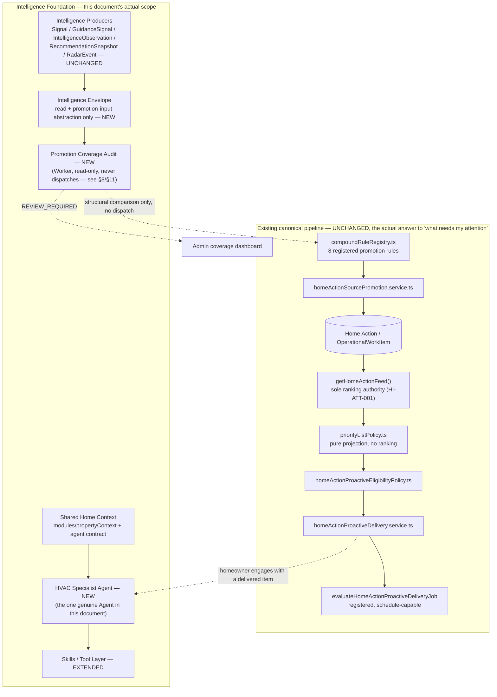
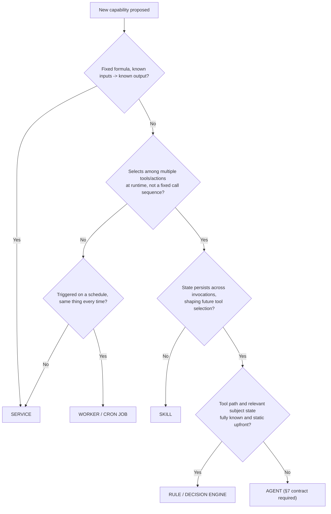
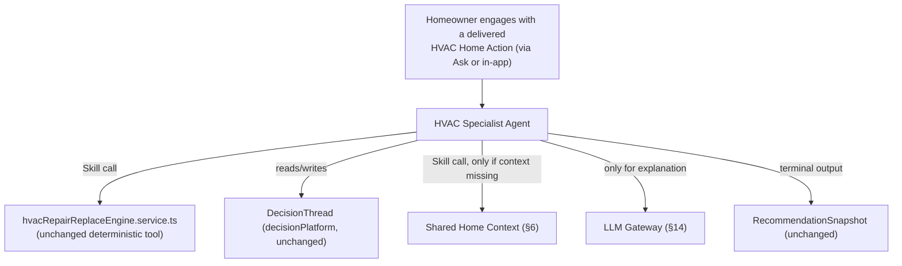
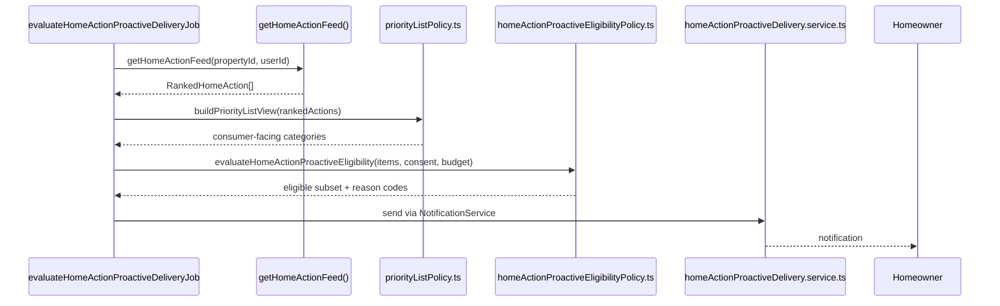
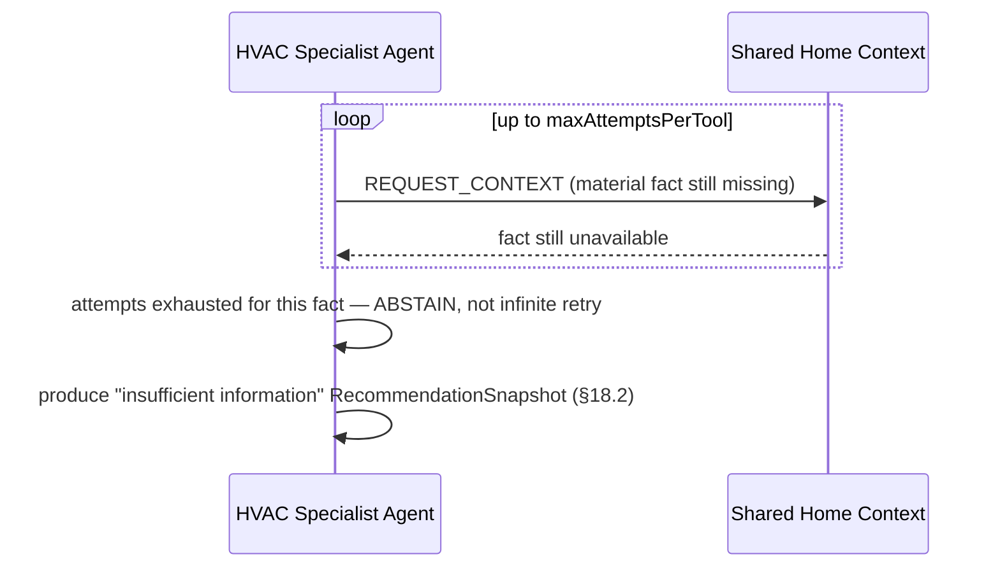

# C2C Intelligence & Agentic Evolution Architecture (Stage 3)

**Date:** 2026-08-26
**Status:** Draft target architecture — third revision with full-review corrections incorporated; implementation approval still requires the phase-specific exit evidence in §26.
**Grounding evidence:** [`docs/audits/AGENTIC_READINESS_AUDIT.md`](../audits/AGENTIC_READINESS_AUDIT.md) is the evidence base for architectural patterns and gaps at the time it was written. It is not an authoritative product-requirements source, and — critically for this revision — it is not exhaustive: a third external review found that this document had, twice, designed net-new proactive-attention infrastructure that duplicates or bypasses a real, already-shipped canonical pipeline the audit's evidence-density sampling didn't surface. See §1.1 for the requirements this revision is now grounded in, and the box below for what changed.
**Scope:** This document is the requested Stage 3 exercise. It is a target architecture and phased evolution plan, not an implementation. No code changes accompany this document.

> **What this revision corrects, and why it's the most consequential round yet.** C2C already has a fully-implemented canonical pipeline that does most of what this document's first two drafts proposed building from scratch: `compoundRuleRegistry.ts`'s 8 registered rules promote qualifying intelligence into canonical Home Actions via `homeActionSourcePromotion.service.ts`; `getHomeActionFeed()` (`homeActions.service.ts`) is the sole homeowner-facing ranking authority, already consumed identically by Home, Fix, and Resolution Center per a 2026-08-25 convergence (`HOME_INTELLIGENCE_FUNCTIONAL_COMPLETENESS_FRD_AND_IMPLEMENTATION_PLAN.md`); `priorityListPolicy.ts` is a pure, non-ranking projection over that feed; and `homeActionProactiveEligibilityPolicy.ts`/`homeActionProactiveDelivery.service.ts` implement real consent/budget/escalation-gated proactive notification logic, invoked by `evaluateHomeActionProactiveDeliveryJob`, which is registered in `workerJobRegistry.ts` and cron-schedule-capable. **Precisely, not overstated: this pipeline is implemented and schedule-capable, not necessarily active** — `isHomeActionProactiveDeliveryActive()` requires both `HOME_ACTION_PROACTIVE_DELIVERY_ENABLED=true` and a DB kill switch to be off, and the job's own source comment says it is "safe to register even while the feature stays disabled by default." Whether or not it is flipped on in any given environment, it is the canonical, complete, already-built answer to "tell me what needs my attention" for canonical Home Actions — this document does not need to build another one regardless of the flag's current value. Prior drafts of this document built a parallel `unifiedPriorityRanking.service.ts` and an "Attention Watcher Service" that either duplicated this pipeline or would have competed with it for ranking authority — both directly forbidden by `HI-ATT-001` and `ASK-INT-019` (§1.1). This revision retires both, narrows the Envelope to an upstream read/promotion-input role, and narrows this document's genuine net-new contribution to what the shipped pipeline does not yet do: closing intelligence-to-Home-Action coverage gaps, and adding multi-step decision support (the Specialist Agent) on top of an already-ranked, already-delivered item.

## 1.1 Requirements traceability

| Decision area | Authoritative source | What it requires |
|---|---|---|
| Single ranking authority | `docs/product/HOME_INTELLIGENCE_FUNCTIONAL_COMPLETENESS_FRD_AND_IMPLEMENTATION_PLAN.md`, HI-ATT-001 | "`getHomeActionFeed()` shall be the sole homeowner-facing ranking authority... [consumers] shall consume its ranked results or a shared lower-level canonical read service that produces the same results" — binding on §5, §10, §15; this document does not introduce a second ranker |
| Proactive delivery source | Same FRD, HI-ATT-004 | "Proactive delivery shall select from the canonical ranked feed and add only consent, fatigue, delivery-channel, quiet-hours, and escalation gates" — already implemented by `homeActionProactiveEligibilityPolicy.ts`/`homeActionProactiveDelivery.service.ts`; §11 does not re-implement this |
| Canonical projection rule | Same FRD, §7.1 | "[Surfaces] may apply channel-specific presentation limits and eligibility gates, but they shall not independently rescore or recreate the underlying recommendation" |
| Canonical identity rule | Same FRD, §7.2 | Every Home Action resolves to a stable `lineageId`, a stable source entity + version, an optional `OperationalWorkItem.workKey`, an optional `RecommendationSnapshot` — binding on §5.2's Envelope identity redesign |
| Ask ranking constraint | `docs/product/AI_HOME_CONCIERGE_ASK_INTELLIGENCE_INCREMENTAL_FRD.md`, ASK-INT-019 | "Rank only the canonical Home Actions feed using a versioned explainable policy" — Ask never ranks raw Envelope items |
| Guidance-priority scope | `HOME_INTELLIGENCE_FUNCTIONAL_COMPLETENESS_FRD_AND_IMPLEMENTATION_PLAN.md`, 2026-08-25 completion update | "The remaining `guidance-priority` registration explicitly describes its bounded use for Guidance-only journey deduplication... it does not re-rank canonical Home Actions" — this document does not retire or consolidate it further; it was never a competitor to `getHomeActionFeed()` after this convergence |
| Property/context authorization | `docs/product/AI_HOME_CONCIERGE_ASK_TRUST_ARCHITECTURE_ADDENDUM_FRD.md`, parent principle 2 | "Authentication, property access, household authorization, and audience applicability remain deterministic" — binding on §6 |
| Confirmation / material actions | Same FRD, parent principle 5 | "Material actions retain typed input, confirmation, authorization recheck, idempotency, and audit requirements" — binding on §19 |
| Canonical ownership | Same FRD, parent principle 4 | "Canonical services own facts, calculations, decisions, and mutations" — binding on §5's promotion-only write model |
| Rollout / cohort posture | Same FRD, §2.1 | "No rollout, migration, compatibility, or backfill plan is required for existing users because no real users exist" — binding on §7.2, §26 |
| Skill/agent capability boundaries | `docs/product/CONTRACTTOCOZY_SKILL_PLATFORM_FRD.md` | Skill admission rubric and confirmation/authorization preservation — binding on §9 |

---

## Table of Contents

1. [Executive Summary](#1-executive-summary)
2. [Architectural Principles](#2-architectural-principles)
3. [Current → Target Mapping](#3-current--target-mapping)
4. [C2C Intelligence Foundation](#4-c2c-intelligence-foundation)
5. [Intelligence Envelope Specification](#5-intelligence-envelope-specification)
6. [Shared Context Architecture](#6-shared-context-architecture)
7. [Agent Definition & Agent Contract](#7-agent-definition--agent-contract)
8. [Agent vs Service vs Skill Decision Framework](#8-agent-vs-service-vs-skill-decision-framework)
9. [Skills / Tool Architecture](#9-skills--tool-architecture)
10. [Orchestrator Architecture](#10-orchestrator-architecture)
11. [Attention Layer: The Promotion Coverage Audit](#11-attention-layer-the-promotion-coverage-audit)
12. [Specialist Agent Pattern](#12-specialist-agent-pattern)
13. [Agent Interaction Patterns](#13-agent-interaction-patterns)
14. [LLM Gateway & LLM Necessity Gate](#14-llm-gateway--llm-necessity-gate)
15. [Ranking & Interruption Architecture](#15-ranking--interruption-architecture)
16. [Trigger/Event Architecture](#16-triggerevent-architecture)
17. [State & Memory](#17-state--memory)
18. [Conflict Resolution](#18-conflict-resolution)
19. [Governance & Safety](#19-governance--safety)
20. [Observability](#20-observability)
21. [Learning & Outcome Feedback](#21-learning--outcome-feedback)
22. [Ask Cozy Integration](#22-ask-cozy-integration)
23. [Target Architecture Diagram](#23-target-architecture-diagram)
24. [Runtime Sequence Diagrams](#24-runtime-sequence-diagrams)
25. [Database / Persistence Changes](#25-database--persistence-changes)
26. [Implementation Phases](#26-implementation-phases)
27. [Migration / Refactoring Matrix](#27-migration--refactoring-matrix)
28. [Risks & Mitigations](#28-risks--mitigations)
29. [Success Metrics](#29-success-metrics)
30. [Final Recommendation](#30-final-recommendation)
31. [Critical Design Test](#31-critical-design-test)

---

## 1. Executive Summary

**What C2C should become architecturally:** a system where the intelligence C2C already computes reaches the homeowner through exactly one canonical path — `compoundRuleRegistry.ts` promotion → `getHomeActionFeed()` ranking → `priorityListPolicy.ts` projection → eligibility/delivery — and where this document's job is to widen what feeds *into* that path and deepen what happens *after* a homeowner engages with what it surfaces, never to build a second path alongside it.

**The central correction this revision makes:** the first two drafts of this document treated "build proactive attention" as greenfield work. It isn't. `evaluateHomeActionProactiveDeliveryJob` is implemented, registered, and schedule-capable — it reads `getHomeActionFeed()`, applies consent/budget/escalation gates, and sends notifications, for every Home Action that a `compoundRuleRegistry.ts` rule has promoted, whenever its env flag and DB kill switch permit it to run. The genuine gap is narrower and less glamorous than "build an Attention Agent": **not every intelligence producer has a promotion rule yet**, and **once a homeowner engages with a promoted, ranked item, nothing today walks them through a multi-step decision** (compare options, explain tradeoffs, maintain a decision thread) the way `decisionPlatform` already can for HVAC specifically. Those two gaps — promotion coverage, and post-engagement decision depth — are what this document now scopes.

**What ships, in order:** an Intelligence Envelope with proposition-level presentation admission plus consolidation onto one canonical HVAC base-verdict engine (Phase 0) → a **Promotion Coverage Audit** — not an agent, ranker, or runtime dispatcher; a scheduled Worker that reports uncovered producer/domain combinations for an engineer to close by hand (Phase 1) → the least-privilege HVAC Repair/Replace Specialist Agent, including its confirmed resumable follow-up lifecycle (Phase 2) → Ask Cozy wired to the same Envelope and canonical feed under the admission policy (Phase 3) → the generic-appliance profile/family and additional reviewed coverage (Phase 4).

**What this is not, still:** a plan to add a second LLM provider, an event bus, a vector database, or — now explicitly — a second ranking, eligibility, or delivery pipeline alongside the one C2C already ships. Every one of those is directly forbidden by an authoritative requirement (§1.1), not merely undesirable.

---

## 2. Architectural Principles

1. **Context-first, deterministic-first, LLM-last.** Unchanged from prior revisions — every agent exhausts C2C context, existing intelligence, deterministic rules/Skills, and agent coordination before an LLM call.
2. **C2C is the intelligent system; agents are controlled components inside it.**
3. **One ranking authority, full stop.** `getHomeActionFeed()` (or a shared lower-level canonical read service producing identical results, per HI-ATT-001) is the sole homeowner-facing ranking authority. No new component in this document ranks, re-ranks, or produces a competing priority score for anything that is or could be a canonical Home Action. This principle did not exist in prior revisions of this document, and its absence was the root cause this revision corrects.
4. **The Envelope promotes; it does not deliver.** Actionable intelligence reaches a homeowner only by being promoted into a canonical Home Action (via `compoundRuleRegistry.ts` + `homeActionSourcePromotion.service.ts`) and then flowing through the existing, unmodified ranking/eligibility/delivery pipeline. Non-actionable intelligence stays queryable through the Envelope (Ask, Home Briefing) without ever needing promotion.
5. **Adapters before schema migration; still no physical merge of the 5 native stores.**
6. **"Agent" is a specific claim, not a label.** Adaptive goal pursuit under bounded, governed autonomy over a genuinely unknown tool space — not scheduling, not background execution, not a fixed branch set. §8 is the enforcement mechanism.
7. **No LLM output becomes authoritative C2C state without validation and provenance.**
8. **Reuse before rebuild.** Every component in §27's matrix is EXISTING, EXTEND, REFACTOR, or WRAP AS TOOL unless a specific justification for NEW is given — and, per this revision, "NEW" is scrutinized hardest of all, because the last two drafts got this wrong for the single largest component in the document.
9. **No autonomy beyond what's earned.** Every agent targets Level 0–2 (§9.2 of the audit).
10. **Minimum necessary infrastructure.** No event bus, no second LLM provider, no vector database — and, as of this revision, no second ranking/eligibility/delivery pipeline either.
11. **An agent identity is attribution, never authority.** Every property read/write carries a real `ExecutionPrincipal`, re-authorized via the unchanged `resolvePropertyAccess`/`getPropertyContext` path.
12. **Every side effect is idempotent, and it reuses an existing idempotency mechanism before inventing a new one.** Home Action promotion already has deduplication keys (per `compoundRuleRegistry.ts`'s `deduplicationKey` field); proactive delivery already has its own budget/consent checks. This document does not build a parallel idempotency system for effects an existing canonical service already makes safe.

---

## 3. Current → Target Mapping

| Existing component | Current role | Target role | Change required |
|---|---|---|---|
| `compoundRuleRegistry.ts` (8 registered rules) + `homeActionSourcePromotion.service.ts` | Canonical promotion of qualifying intelligence into Home Actions | Unchanged authority; gains new rule entries as coverage gaps close (§11) | None to the mechanism; add rules for newly-covered producers |
| `homeActions.service.ts`'s `getHomeActionFeed()` | Sole homeowner-facing ranking authority (HI-ATT-001), already consumed identically by Home/Fix/Resolution Center | Unchanged — remains the only ranker in this architecture | None |
| `priorityListPolicy.ts` | Pure, non-ranking projection of the feed into consumer categories (DO_NOW/PLAN_SOON/WATCH/OPTIONAL/NO_ACTION) | Unchanged | None |
| `homeActionProactiveEligibilityPolicy.ts` + `homeActionProactiveDelivery.service.ts` + `evaluateHomeActionProactiveDeliveryJob` | Already-shipped, registered, schedule-capable proactive notification pipeline with consent/budget/escalation gates | Unchanged — this **is** the "Attention" system for canonical Home Actions | None |
| `modules/propertyContext` | Assembles ~20 typed fact scopes; 27+ callers | Agent-facing context contract (§6) | Add a stable, versioned, budget-aware read wrapper — no internal rewrite |
| `Signal`, `GuidanceSignal`, `IntelligenceObservation`, `RecommendationSnapshot`, `RadarEvent` | 5 disjoint intelligence schemas | Read-only through the Intelligence Envelope (§5); their existing promotion paths into `compoundRuleRegistry.ts` inputs (where they have one) are unchanged | 5 read adapters; no schema change, no new write path |
| `decisionPlatform` (DecisionThread, RecommendationSnapshot, `decisionFamilyAdapterRegistry`) | Real lifecycle machinery, 1 of 7 families (HVAC) does real composition | Backing for the HVAC Specialist Agent's decision-support conversation (§12) | Extend, don't replace |
| Two disagreeing HVAC verdict engines | Acknowledged divergence, `SOURCE_CARD_VERDICT_DIVERGENCE` | One authoritative verdict | Reconcile in Phase 0 — a data-quality fix |
| `services/skills/` (19 manifests) | Closest existing analog to an agent-tool manifest | Least-privilege Skill layer agents call (§9) | Add autonomy-level metadata and validate each Agent's positive Skill/tool allow-list against the registries |
| `aiRequestGovernance.service.ts` | Routes all 25 Gemini invocation sites | LLM Gateway (§14) | Harden the interface; no second provider |
| `askOrchestrator.service.ts` | Deterministic NLU router; `REMOTE_FALLBACK` unwired | Ask Cozy's entry point into the Envelope + canonical feed (§22) | Wire `REMOTE_FALLBACK`; add Specialist Agent as a routable target |
| BullMQ + node-cron + `workerJobRegistry.ts` + `CronJobLock` | Most mature layer in the codebase; already registers the schedule-capable `evaluateHomeActionProactiveDeliveryJob` | Execution substrate for the Promotion Coverage Audit and confirmed Specialist follow-ups | Add two governed job types to the existing registry, in Phases 1 and 2 respectively |
| pino/Loki + Prometheus + OpenTelemetry | Structured logging, worker/AI cost metrics | End-to-end observability for the Coverage Audit and Specialist Agent (§20) | Extend metric namespaces |

---

## 4. C2C Intelligence Foundation



| Foundation piece | Existing seed | What's new |
|---|---|---|
| Canonical Home Action pipeline | `compoundRuleRegistry.ts` → `getHomeActionFeed()` → `priorityListPolicy.ts` → eligibility → delivery → cron | **Nothing.** Documented here as the authority everything else in this document defers to. |
| Intelligence Envelope | 5 disjoint schemas | A read + promotion-input contract with no ranking authority (§5) |
| Promotion Coverage Audit | None | New scheduled Worker; structurally compares producer/domain combinations against the registry — never dispatches a rule, never promotes anything itself (§11) |
| Skills / Tool layer | `services/skills/` | Autonomy-level tag; HVAC engine wrapped as a callable tool |
| HVAC Specialist Agent | `decisionPlatform`, `hvacRepairReplaceEngine.service.ts` | The genuine multi-step decision-support conversation (§12) |

---

## 5. Intelligence Envelope Specification

### 5.1 Design stance, narrowed twice now

Two corrections compound here. First (round 2): no generic cross-model write contract survives the schema — `Signal` has no status, `RecommendationSnapshot` is immutable, `RadarEvent` is global while dismissal is property-scoped. Second (round 3, this revision): **the Envelope has no ranking or delivery authority at all.** It is a read abstraction over the 5 native producers, used for exactly two purposes:

1. Giving the Promotion Coverage Audit (§11) one uniform surface to enumerate observed producer/domain combinations from, so it can structurally compare them against `compoundRuleRegistry.ts`'s declared coverage — a read-only comparison, never a runtime rule dispatch (§11.1 explains why the registry cannot be dispatched against at runtime).
2. Giving Ask Cozy and Home Briefing a uniform way to surface non-actionable observations that have not been (and may never need to be) promoted into a Home Action.

It has no write-back to producers beyond what §5.5 describes, no consumer-facing dismissal/snooze state (Home Actions already have a full lifecycle — `homeActionUsefulnessFeedback.service.ts`, `getSuppressedHomeActionIds`, and the HI-ATT-005 command policy — and this document does not build a second one), and no per-user overlay, and — per §5.7 — no per-item cursor either, since coverage is evaluated at the coarser producer/domain level, not per Envelope item.

### 5.2 Envelope identity — lineage, revision, and content change, kept separate

Round 2 conflated identity with revision: `EnvelopeKey` embedded `sourceRecordId`, but an immutable revision's successor (a new `RecommendationSnapshot` row via `supersedesSnapshotId`, a new `Signal` row at a bumped `version`) has a *different* record ID and therefore a *different* key under that scheme — supersession became undetectable by construction. The Home Action canonical identity rule already solves this correctly (§1.1: "a stable `lineageId`... a stable source entity and version") — reused here rather than reinvented:

```ts
type LineageKey = string;    // stable across every revision of the same logical recommendation/signal —
                              // reuses the native lineageId where the producer has one (RecommendationSnapshot's
                              // supersession chain, GuidanceSignal's duplicateGroupKey), or is derived the same
                              // way a promotion rule already derives it (compoundRuleRegistry.ts's own
                              // deduplicationKey field is exactly this concept, per-rule) where it doesn't
type RevisionKey = string;   // `${sourceModel}:${sourceRecordId}` — identifies the exact native row/revision
type EnvelopeKey = string;   // `${type}:${propertyId}:${RevisionKey}` — this specific revision's Envelope identity
```

`nativeRevisionToken` (§5.7) detects in-place changes *to a given revision* (e.g. a mutable field on a row that doesn't create a new record) — a narrower, complementary concern to `LineageKey`'s cross-revision stability. Supersession is detected by comparing `LineageKey`s across reads, not by comparing `EnvelopeKey`s, which are expected to change on every new revision.

### 5.3 Field contract

```ts
interface IntelligenceEnvelopeItem {
  envelopeKey: EnvelopeKey;
  lineageKey: LineageKey;
  nativeRevisionToken: string;
  semanticCorrelationKey?: string;   // for §18 reconciliation only — see 18.1's tightened rule

  type: EnvelopeType;
  domain: EnvelopeDomain;
  subject: { propertyId: string; userId?: string; entityRef?: string };

  source: { producer: string; sourceModel: string; sourceRecordId: string };
  provenance: { generatedBy: "DETERMINISTIC" | "LLM" | "EXTERNAL_INGEST" | "HYBRID"; method: string; modelVersion?: string };

  confidence: number | null;
  evidence: EvidenceRef[];
  severity: Severity | null;

  // No importanceScore, no priorityScore, no ranking field of any kind (Principle 3).
  // Ranking happens only after promotion, only inside getHomeActionFeed().

  freshness: { computedAt: string; ttl: string | null; staleAfter: string | null };
  nativeStatus: string | null;   // read-through only, per producer (§5.6)

  // No promotion/coverage field on the item itself — per §11.2, coverage is determined at the
  // coarser (producerModel, domain) level, not per item, and lives in CoverageAuditFinding (§25),
  // not on IntelligenceEnvelopeItem. An earlier draft carried a per-item coverageStatus field here;
  // it implied a per-item evaluation this document's mechanism doesn't actually perform.

  createdAt: string;
  updatedAt: string;
}
```

### 5.4 Mandatory vs optional

| Field group | Mandatory? | Rationale |
|---|---|---|
| `envelopeKey`, `lineageKey`, classification, subject | Mandatory | Identity and supersession both require it, per §5.2 |
| `source` / `provenance` | Mandatory | Provenance is structurally required (Principle 7) |
| `confidence` / `evidence` | Mandatory field, nullable value | Preserves §18.2's abstention requirement |
| `severity` | Mandatory field, nullable value | Not every item is severity-typed |
| `freshness` | Mandatory | Reuses `IntelligenceConsumerCurrentness` |
| `nativeStatus` | Mandatory field, nullable value | Read-through only, `null` for producers with no status (`Signal`) |
| — | — | No promotion/coverage field exists on this type (§5.3's note) — coverage is tracked separately, at the `(producerModel, domain)` level, in `CoverageAuditFinding` (§25) |

### 5.5 Per-subsystem adapter mapping

| Native store | Envelope `type` | `nativeStatus` source | Fidelity note |
|---|---|---|---|
| `Signal` | `SIGNAL` | Always `null` (no status field) | 9 hardcoded keys map to a fixed `domain` subset |
| `GuidanceSignal` | `GUIDANCE` | `GuidanceSignal.status` (read-through) | `severity` derived from `severityScore` (Int, 0–100) + `confidenceScore` (Decimal(5,4)) — corrected mapping |
| `IntelligenceObservation` | `OBSERVATION` | Its own status field | Often `confidence: null` pre-scoring |
| `RecommendationSnapshot` | `RECOMMENDATION` | Always `null` (immutable) | Supersession is a new `LineageKey`-sharing item, never a status change |
| `RadarEvent` | `RADAR_EVENT` | `PropertyRadarMatch.lifecycleStatus`, **never** the global `RadarEvent.status` | Identity anchored to `PropertyRadarMatch`/`PropertyRadarCompoundInsight` (property-scoped), not the global row |

### 5.6 What the Envelope does NOT do (this revision's binding constraint)

- It does not rank. It does not compute anything resembling `importanceScore`. `getHomeActionFeed()` does that, for canonical Home Actions, exclusively (Principle 3).
- It does not deliver, notify, or track per-homeowner dismissal/snooze. `homeActionProactiveEligibilityPolicy.ts`/`homeActionProactiveDelivery.service.ts`/the existing lifecycle-command policy (HI-ATT-005) do that, exclusively.
- It does not write producer state beyond what an existing domain-owned command already permits (unchanged from round 2's finding — `Signal`/`RecommendationSnapshot` have no lifecycle to transition at all).

### 5.7 No per-item cursor — the Envelope itself needs no additional persistence for coverage purposes

An earlier draft of this section proposed a per-item `EnvelopeEvaluationCursor`, on the assumption that closing a coverage gap meant re-evaluating individual Envelope items against a live rule dispatcher. §11 replaces that mechanism with a structural audit comparing *producer/domain combinations* (not individual items) against the registry, recomputed fresh on every run rather than cached incrementally — so there is no per-item state for the Envelope to track at all. The one new persisted model this document introduces for coverage purposes, `CoverageAuditFinding`, is keyed by `(producerModel, domain)`, not by `envelopeKey`, and is defined in §11.2/§25, not here.

### 5.8 `query-envelope` presentation admission — "non-actionable only" is an enforced policy, not a caller promise

The Envelope intentionally carries no ranking or promotion status (§5.3), so neither the presence nor absence of a `CoverageAuditFinding` can establish that an individual item is safe to present through Ask's non-actionable path. In particular, `COVERED` is only a producer/domain-level statement, while `REVIEW_REQUIRED` may identify intelligence that is actionable but has not yet received a reviewed promotion rule. Neither determination admits an item to `query-envelope`.

Admission uses a separate, typed, hand-reviewed presentation registry at the proposition level:

```ts
// Generated from the five registered adapter manifests, each of which declares a literal
// producerModel, supported domains, and supported propositionTypes. These are closed unions;
// callers cannot introduce an arbitrary producer/proposition string at runtime.
type EnvelopeSourceModel = (typeof ENVELOPE_ADAPTER_MANIFESTS)[number]["producerModel"];
type EnvelopePropositionType = (typeof ENVELOPE_ADAPTER_MANIFESTS)[number]["propositionTypes"][number];
const ENVELOPE_DOMAINS = Object.values(EnvelopeDomain) as readonly EnvelopeDomain[];

interface EnvelopeQueryPresentationRule {
  producerModel: EnvelopeSourceModel;     // the closed §11.2 vocabulary
  domain: EnvelopeDomain;
  propositionType: EnvelopePropositionType; // adapter-owned closed value, never inferred by an LLM
  disposition: "INFORMATIONAL_ONLY" | "CANONICAL_HOME_ACTION_ONLY";
  rendererId: string;                     // deterministic renderer; no raw payload passthrough
}

type EnvelopeQueryAdmission =
  | { status: "ADMITTED_INFORMATIONAL"; rendererId: string }
  | { status: "EXCLUDED_CANONICAL_ACTION"; homeActionId: string }
  | { status: "DENIED_UNREVIEWED" };
```

`evaluateEnvelopeQueryAdmission(item, principal)` applies, in order:

1. The unchanged property/household authorization check from §6.
2. Currentness and native lifecycle applicability.
3. Correlation against the current canonical Home Action feed by stable source/lineage identity; a matching Home Action returns `EXCLUDED_CANONICAL_ACTION`, so Ask uses that canonical action instead of duplicating it as an observation.
4. An exact `(producerModel, domain, propositionType)` registry match. Only `INFORMATIONAL_ONLY` is admitted. Missing rules, `CANONICAL_HOME_ACTION_ONLY`, and every `REVIEW_REQUIRED` gap fail closed as `DENIED_UNREVIEWED`.
5. Deterministic rendering through `rendererId`; raw producer payloads are never sent directly to the homeowner or to an LLM.

`validateEnvelopeQueryPresentationRegistry()` rejects duplicate keys, unknown source models/domains/proposition types, and missing renderers at startup/CI. This registry is deliberately separate from `COVERAGE_MANIFEST`: the manifest asks whether a producer/domain has any promotion coverage; this policy asks whether one specific proposition is approved for informational presentation. One cannot safely stand in for the other.

---

## 6. Shared Context Architecture

### 6.1 Why this, not direct Prisma access

Unchanged from prior revisions: `modules/propertyContext` already does the hard part; the gap is contract stability for a new class of caller (the Specialist Agent), not capability.

### 6.2 The agent-facing contract

An earlier draft's `SYSTEM_PURPOSE` principal (a bare `grantedByUserId`/`purpose`/`grantedAt` tuple) was an invented authorization primitive with no backing grant record — no grant ID, no property scope, no expiration, no revocation state, and nothing that could actually be checked or revoked. It also wasn't consistently threaded through: the Coverage Audit's own pseudocode called `queryEnvelope()` with no principal argument at all. The fix is to invent nothing: **[verified]** `evaluateHomeActionProactiveDeliveryJob` already solves this exact problem — for each property it reads `property.homeownerProfile.userId` and passes that real, resolved user ID into the property-scoped work it does. Every background job in this document reuses that identical pattern instead of a new grant type:

```ts
type ExecutionPrincipal =
  | { kind: "HOMEOWNER_SESSION"; userId: string }              // a live, user-initiated request (Ask Cozy)
  | { kind: "BACKGROUND_JOB_RESOLVED_OWNER"; userId: string };  // a background job resolves the property's own
                                                                  // homeownerProfile.userId (the same field
                                                                  // evaluateHomeActionProactiveDeliveryJob already
                                                                  // reads) and authorizes as that real user —
                                                                  // not a new grant type, no invented authority

interface AgentContextRequest {
  propertyId: string;
  principal: ExecutionPrincipal;     // resolves to getPropertyContext's actor.userId — the real authorization gate
  requestingAgentId: string;          // attribution only, never authority
  scopes: PropertyContextScope[];
  maxFacts?: number;
  maxLatencyMs?: number;
}
```

**[verified]** `getPropertyContext(propertyId, actor: PropertyContextActor, request, ...)` calls `dependencies.authorize(actor.userId, propertyId)` (→ `resolvePropertyAccess`) before reading a single fact, throwing `PropertyContextAccessDeniedError` on failure — this wrapper is passed straight through, never bypassed. Every call site that constructs an `AgentContextRequest` — including the Coverage Audit's own property-scoped reads, where it needs them — supplies a `principal` explicitly; there is no code path that queries property-scoped data without one.

### 6.3 What agents must NOT do

- Import Prisma clients directly for property/homeowner facts.
- Request unscoped context.
- Treat `requestingAgentId` as authorization.
- Rank anything (Principle 3) or send a homeowner-facing notification outside the existing delivery pipeline (Principle 4).

---

## 7. Agent Definition & Agent Contract

### 7.1 Formal definition

> **A C2C Agent is a component that pursues a bounded, stated goal by adaptively selecting among multiple registered tools or actions, against subject state that is not fully known when it starts, with every state transition logged, budgeted, and revocable.**

### 7.2 Agent Contract

```ts
interface AgentDefinition {
  agentId: string;
  name: string;
  responsibility: string;
  supportedDomains: EnvelopeDomain[];
  acceptedTriggers: AgentTrigger[];     // USER_INITIATED | HOME_ACTION_ENGAGEMENT | SPECIALIST_HANDOFF

  requiredContext: PropertyContextScope[];
  allowedSkills: string[];
  allowedTools: string[];                 // runtime/platform tools that are not Skill manifests
  prohibitedSkills?: string[];

  executionMode: "SYNC" | "ASYNC_LONG_RUNNING";
  stateRequirements: { persistsAcrossInvocations: boolean; stateShape?: string };

  outputContract: {
    producerCommandsAllowed: string[];  // domain-owned commands this agent may call — never a generic writer
    producesRecommendation: boolean;    // via RecommendationSnapshot — never a new ranking or delivery record
    maxAutonomyLevel: 0 | 1 | 2;
  };

  budgets: { maxContextFactsPerRun: number; maxLLMInvocationsPerRun: number; maxLLMCostPerRunUsd: number; maxExecutionMsPerRun: number; maxLoopIterations: number };

  killSwitch: string;
  featureFlag: string;
  releaseState: "DEV" | "EVAL_APPROVED" | "ENABLED" | "DISABLED";

  retryPolicy: { maxAttempts: number; backoffMs: number };
  timeoutMs: number;
  escalationPolicy: { onLowConfidence: "ABSTAIN" | "ASK_HOMEOWNER"; onToolFailure: "RETRY" | "ABSTAIN" | "ESCALATE_TO_HUMAN_REVIEW"; onLoopBudgetExhausted: "ABSTAIN_WITH_PARTIAL_RESULT" };

  auditRequirements: { logEveryToolCall: true; logEveryStateTransition: true };
  safetyLevel: "RECOMMEND" | "DRAFT";
  evaluationSuiteId: string;
}
```

`maxLoopIterations` and `onLoopBudgetExhausted` are new in this revision (§12.3 explains why). `acceptedTriggers` dropped `ENVELOPE_CHANGE`/`SPECIALIST_DISCOVERY` — the only agent in this document (§12) is triggered by homeowner engagement with an already-delivered canonical item, not by an Envelope event.

### 7.3 What's reused vs. new

Unchanged from round 2: risk policy, context budget, kill-switch/feature-flag convention, and evaluation-suite requirement are all reused from `services/skills/skill.contract.ts`; `releaseGate.service.ts`'s cohort mechanism remains available but not required (§1.1's rollout-posture citation).

---

## 8. Agent vs Service vs Skill Decision Framework



| Kind | C2C examples |
|---|---|
| **Service** | `getHomeActionFeed()`, `hvacRepairReplaceEngine.service.ts`, `priorityListPolicy.ts`, any Envelope adapter |
| **Worker / cron job** | `evaluateHomeActionProactiveDeliveryJob` (existing), the **Promotion Coverage Audit** (new, §11) — both fixed evaluate-against-registry logic, no adaptive judgment |
| **Skill / Tool** | Any of the 19 existing `SkillDefinition`s |
| **Rule / decision engine** | `compoundRuleRegistry.ts`'s 8 promotion rules |
| **Agent** | The HVAC Specialist Agent (§12) — the only one this document ships |

**Explicit non-agents this document is careful not to mislabel, having mislabeled the Promotion Coverage Audit's predecessor twice already:** the Coverage Audit evaluates a fixed rule registry — it does not decide *whether* to promote (the registry does), only whether a rule currently applies. That is Rule-adjacent Worker behavior, not Agent behavior, even though it runs continuously and touches every intelligence producer.

---

## 9. Skills / Tool Architecture

`services/skills/` is extended with an `autonomyLevel` field, but the existence of a Skill in the platform catalog does **not** make it callable by every Agent. **Agent → admitted Skill/Tool → Domain Service, never Agent → Prisma.** Each concrete `AgentDefinition` carries a least-privilege allow-list, validated against the Skill and tool registries at startup/CI.

The Phase 2 HVAC Specialist's executable boundary is deliberately small:

```ts
const HVAC_SPECIALIST_CAPABILITIES = {
  allowedSkills: ["repair-replace"],
  allowedTools: [
    "property-context.read",          // REQUEST_CONTEXT; actor-authorized through §6
    "property-record.request-document", // REQUEST_DOCUMENT; creates only the bounded homeowner request
    "llm.typed-claim-explain",        // EXPLAIN; §14.2's verified typed-claim path
    "agent-follow-up.draft",          // SCHEDULE_FOLLOW_UP; draft only until §12.4 confirmation
  ],
  prohibitedSkills: [
    "coverage", "refinance", "ownership-cost", "seller-preparation", "buyer-closing",
  ],
} as const;
```

The prohibited list is defense-in-depth; the binding control is positive admission through `allowedSkills`/`allowedTools`. A future profile may change scoring configuration without gaining more tools. A genuinely new decision shape must justify its own capability set under §12.6's new-specialist test. The one Skill this document adds is `query-envelope` (read-only, governed by §5.8's presentation policy) for Ask — there is no `query-canonical-feed` Skill, because Ask calls `getHomeActionFeed()` through its existing canonical service path.

---

## 10. Orchestrator Architecture

### 10.1 Scope, narrowed

The orchestrator's footprint shrinks further this revision: it no longer routes Envelope-detected items to specialists (there is no Attention Agent doing that routing anymore — see §11). Its entire remaining job is the HVAC Specialist Agent's own multi-step workflow:

| Belongs to orchestration | Does NOT belong to orchestration |
|---|---|
| Sequencing the Specialist Agent's `selectNextTool` loop (§12.3) | Domain scoring (stays in `hvacRepairReplaceEngine.service.ts`) |
| Managing the loop's execution/iteration budget | Home Action ranking (stays in `getHomeActionFeed()`) |
| Handling tool-call failures and retries | Promotion (stays in `compoundRuleRegistry.ts`/`homeActionSourcePromotion.service.ts`) |
| Detecting the loop's completion or abstention | Notification transport (stays in the existing delivery pipeline) |

### 10.2 Reuse of `decisionPlatform`

Corrected twice over in this revision. First, terminology: per §12.5's hierarchy, `DecisionThread` remains the business-facing decision-lineage record the Specialist Agent reads/writes — it is not the agent's execution/audit record. That responsibility is split between an immutable `AgentRun` header, append-only `AgentRunEvent` transitions, and a versioned `AgentState` checkpoint only while a run is paused/resumable.

Second, a category error: **[verified]** `decisionFamilyAdapterRegistry.ts` maps a `DecisionDefinitionId` (`HVAC_REPAIR_REPLACE`, `REFINANCE_OPPORTUNITY`, `HOME_CAPITAL_TIMELINE_WINDOW`, ...) to the adapter that resolves *that decision's* `DecisionThread` lineage — it is keyed by decision *definitions* (a business question with a canonical answer shape), not by orchestration mechanisms. "Agent-driven handoff" is not a decision definition and has no lineage of its own to resolve; it does not belong in this registry at all. A future family — e.g. `APPLIANCE_REPAIR_REPLACE`, covering non-HVAC appliances per §12.6 (HVAC itself keeps its own `HVAC_REPAIR_REPLACE` definition, unchanged) — would earn its own registry entry the same way `HVAC_REPAIR_REPLACE` already has one, because it is itself a decision definition with a canonical verdict shape. Handoff routing (which specialist a homeowner's engagement reaches) is entirely an Agent/Orchestrator-contract concern (§7, §13), never a `decisionFamilyAdapterRegistry` entry.

---

## 11. Attention Layer: The Promotion Coverage Audit

### 11.1 What this section is not, anymore (twice over now)

Rounds 1–2 designed an "Attention Watcher Service"/"Attention Agent" that ranked Envelope items and proposed them for interruption — retired in round 3, because `getHomeActionFeed()` → `priorityListPolicy.ts` → `homeActionProactiveEligibilityPolicy.ts` → `homeActionProactiveDelivery.service.ts` → `evaluateHomeActionProactiveDeliveryJob` already does that job. Round 3's own first pass at this section then designed a live runtime dispatcher — internally called "Promotion Coverage Service" at the time — that would call `findApplicableRule()` and `triggerPromotionIfNotAlreadyPromoted()` at runtime, per property, per Envelope item. **That design is what this section replaces with the read-only Coverage Audit below**, because the runtime-dispatch design doesn't survive contact with `compoundRuleRegistry.contract.ts`'s own header comment: the registry is explicitly declarative — "a rule's actual evaluation lives in a real, independently testable function, not a stored callback here... turning this registry into a runtime dispatcher over arbitrary stored callbacks is exactly the 'generic registry becomes a rules engine' risk the FRD's own risk table (§18) warns against." `applicability` and `deduplicationKey` are documentation strings for audit purposes, not executable predicates a service can evaluate against an Envelope item at runtime. And **[verified]** `getPromotedHomeActions()` (`homeActionSourcePromotion.service.ts:4962`) doesn't work the way a "trigger promotion" call would need it to, either — it's a *read-time projection*: `getHomeActionFeed()` calls it, and it in turn calls one hardcoded producer-loader function per registry entry (`loadIncidentActions`, `loadCompoundRadarInsightActions`, `loadInspectionCoverageActions`, ...) fresh on every read. There is no persisted "promotion event" to trigger and no generic dispatch surface to call it through — each rule's evaluation logic is bespoke, hand-written, and wired directly into the read path when the rule is authored. Closing a coverage gap is a code change (a new loader function + a new registry entry + a new call site in `getPromotedHomeActions()`), not something a generic service can do by "evaluating" an item at runtime.

### 11.2 What this document actually contributes instead: a structural coverage audit, not a live dispatcher

Given the above, the only honest, buildable version of this idea is a **read-only, structural comparison** between what the Envelope's adapters observe and what `compoundRuleRegistry.ts` already declares coverage for — a report for an engineer to act on, never a component that promotes anything itself. `observedCombinations` below is gathered by iterating properties the same way `evaluateHomeActionProactiveDeliveryJob` already does (a property scan resolving each property's own `homeownerProfile.userId`), constructing a `BACKGROUND_JOB_RESOLVED_OWNER` principal (§6.2) for each `AgentContextRequest`/Envelope read the audit performs, and aggregating the distinct `(producerModel, domain)` pairs observed — no read happens without a real, resolved principal.

```ts
type CoverageDetermination = "COVERED" | "INTENTIONALLY_NON_ACTIONABLE" | "REVIEW_REQUIRED";
// NOT_APPLICABLE from earlier drafts is gone — every combination gets an explicit determination;
// "no matching rule" alone is never sufficient to conclude a gap (see the INTENTIONALLY_NON_ACTIONABLE
// case below), so the binary COVERED/GAP_FLAGGED split from the prior draft is retired.

interface CoverageAuditFinding {
  producerModel: string;              // e.g. "Signal", "GuidanceSignal" — the Envelope's own source.sourceModel
  domain: EnvelopeDomain;
  auditInputsDigest: string;          // hash of COMPOUND_RULE_REGISTRY + COVERAGE_MANIFEST + INTENTIONALLY_NON_ACTIONABLE
                                        // together — see 11.3; a manifest-only or registry-only hash would miss a
                                        // change to whichever input it excluded
  determination: CoverageDetermination;
  matchedRuleIds: string[];           // ruleIds from COVERAGE_MANIFEST for this (producerModel, domain) pair —
                                        // never derived from inputContracts (11.2's matching correction)
  firstObservedAt: string;
  lastObservedAt: string;
  lastAuditedAt: string;
  lastAuditRunId: string;
  currentlyObserved: boolean;         // dashboard eligibility; false when absent from the latest complete audit
}

// A short, human-maintained allow-list — NOT inferred, NOT the audit's own judgment call — of
// producer/domain combinations that are known-and-intended to stay informational-only (e.g. raw
// ambient Signal readings with no actionable threshold). Anything not on this list and not matched
// to a registry entry is REVIEW_REQUIRED, never silently dropped.
const INTENTIONALLY_NON_ACTIONABLE: ReadonlySet<`${string}:${EnvelopeDomain}`> = new Set([/* ... */]);

function auditCoverage(
  auditRunId: string,
  observedCombinations: { producerModel: string; domain: EnvelopeDomain }[],
): CoverageAuditFinding[] {
  const auditInputsDigest = hashAuditInputs(COMPOUND_RULE_REGISTRY, COVERAGE_MANIFEST, INTENTIONALLY_NON_ACTIONABLE);
  return observedCombinations.map(({ producerModel, domain }) => {
    const matchedRuleIds = matchCoverageManifest(producerModel, domain);   // see below — never a string heuristic
    const determination: CoverageDetermination =
      matchedRuleIds.length > 0 ? "COVERED"
      : INTENTIONALLY_NON_ACTIONABLE.has(`${producerModel}:${domain}`) ? "INTENTIONALLY_NON_ACTIONABLE"
      : "REVIEW_REQUIRED";
    const observedAt = new Date().toISOString();
    return {
      producerModel, domain, auditInputsDigest, determination, matchedRuleIds,
      firstObservedAt: /* upsert-preserved */ '', lastObservedAt: observedAt,
      lastAuditedAt: observedAt, lastAuditRunId: auditRunId, currentlyObserved: true,
    };
  });
}
```

The Worker persists a `CoverageAuditRun(status=SCANNING)` and uses its ID as `auditRunId`. It upserts the observed rows above, and only after every property scan and upsert succeeds performs this reconciliation in the same transaction that marks the run `COMPLETED`:

```ts
await tx.coverageAuditFinding.updateMany({
  where: { lastAuditRunId: { not: auditRunId }, currentlyObserved: true },
  data: { currentlyObserved: false, lastAuditedAt: completedAt },
});
```

A failed or partial scan never deactivates prior findings. The admin dashboard shows only `currentlyObserved=true AND determination=REVIEW_REQUIRED` by default, while retaining inactive rows for audit history. If a combination later reappears, its natural-key upsert sets `currentlyObserved=true`, preserves the original `firstObservedAt`, and advances `lastObservedAt`.

**Matching correction.** A prior draft matched `producerModel` against `compoundRuleRegistry.ts`'s `inputContracts` strings with `rule.inputContracts.some((c) => c.startsWith(producerModel))` — this is unreliable in both directions. `inputContracts` entries are free-form descriptive strings at a different abstraction layer than the Envelope's `producerModel` (e.g. `"PropertyRadarCompoundInsight (radarCompoundRules.ts rule, HEAVY_RAIN_UNRESOLVED_GUTTER_DRAINAGE)"`, `"ReplaceRepairAnalysis"`, `"InspectionFinding"` — none of which are, or reliably prefix-match, an Envelope `producerModel` like `Signal` or `RadarEvent`), so legitimate coverage would routinely surface as a false `REVIEW_REQUIRED`. It also ignores `domain` entirely — a single string match would mark *every* domain a producer emits as covered, even domains no matched rule actually addresses.

Fixed with a separate, explicitly reviewed coverage manifest — hand-authored alongside each `compoundRuleRegistry.ts` entry, exactly as `deduplicationKey`/`applicability` already are, rather than inferred from the registry's existing free-form strings:

```ts
interface CoverageManifestEntry {
  producerModel: string;    // an Envelope source.sourceModel value, e.g. "RadarEvent"
  domain: EnvelopeDomain;   // e.g. "ROOF"
  ruleIds: string[];        // compoundRuleRegistry.ts ruleIds this (producerModel, domain) pair is actually covered by
}

// One entry per rule the registry author confirms actually reads this producer for this domain —
// reviewed and updated in the same PR that adds or changes a compoundRuleRegistry.ts entry, never
// derived automatically from inputContracts' free-form text.
const COVERAGE_MANIFEST: readonly CoverageManifestEntry[] = [
  { producerModel: "RadarEvent", domain: "ROOF", ruleIds: ["RADAR_COMPOUND_INSIGHT_PROMOTION"] },
  // ...
];

function matchCoverageManifest(producerModel: string, domain: EnvelopeDomain): string[] {
  return COVERAGE_MANIFEST
    .filter((entry) => entry.producerModel === producerModel && entry.domain === domain)
    .flatMap((entry) => entry.ruleIds);
}
```

**A manifest with a stale `ruleId` is worse than no manifest** — a typo'd or since-deleted `ruleId` would still make `matchedRuleIds.length > 0` true, silently reporting `COVERED` for a combination with no real coverage at all. `matchCoverageManifest` alone doesn't catch this; a separate validation does, run the same way `workerJobRegistry.ts`'s own startup parity check already works:

A follow-up review found the first version of this validator incomplete: it caught duplicate manifest keys and stale `ruleId`s, but not a key declared in *both* `COVERAGE_MANIFEST` and `INTENTIONALLY_NON_ACTIONABLE` — since `auditCoverage` checks `matchedRuleIds.length > 0` first, `COVERED` silently wins that contradiction with no validation ever surfacing it. Extended to check every input this section's matching depends on, not just the two most obvious ones:

```ts
const KNOWN_ENVELOPE_SOURCE_MODELS = new Set(["Signal", "GuidanceSignal", "IntelligenceObservation", "RecommendationSnapshot", "RadarEvent"]);
// The Envelope's closed producerModel vocabulary (§5.5) — a manifest entry naming anything outside
// this set is a typo or a model the Envelope doesn't actually wrap, either way a build-time error.

function validateCoverageManifest(): string[] {
  const issues: string[] = [];
  const knownRuleIds = new Set(COMPOUND_RULE_REGISTRY.map((r) => r.ruleId));
  const seenManifestKeys = new Set<string>();
  const manifestKeys = new Set<string>();

  for (const entry of COVERAGE_MANIFEST) {
    const key = `${entry.producerModel}:${entry.domain}`;
    if (seenManifestKeys.has(key)) issues.push(`COVERAGE_MANIFEST: duplicate entry for ${key} — merge into one entry's ruleIds instead of two entries`);
    seenManifestKeys.add(key);
    manifestKeys.add(key);

    if (!KNOWN_ENVELOPE_SOURCE_MODELS.has(entry.producerModel)) issues.push(`COVERAGE_MANIFEST: ${key} names producerModel "${entry.producerModel}", which is not one of the Envelope's known source models`);
    if (entry.ruleIds.length === 0) issues.push(`COVERAGE_MANIFEST: ${key} has an empty ruleIds array — remove the entry entirely if nothing covers it yet, don't leave a vacuous one`);
    if (new Set(entry.ruleIds).size !== entry.ruleIds.length) issues.push(`COVERAGE_MANIFEST: ${key} lists the same ruleId more than once`);
    for (const ruleId of entry.ruleIds) {
      if (!knownRuleIds.has(ruleId)) issues.push(`COVERAGE_MANIFEST: ${key} references ruleId "${ruleId}", which does not exist in COMPOUND_RULE_REGISTRY`);
    }
  }

  for (const nonActionableKey of INTENTIONALLY_NON_ACTIONABLE) {
    const [producerModel, domain] = nonActionableKey.split(":");
    if (!KNOWN_ENVELOPE_SOURCE_MODELS.has(producerModel)) issues.push(`INTENTIONALLY_NON_ACTIONABLE: ${nonActionableKey} names an unknown producerModel`);
    if (!ENVELOPE_DOMAINS.includes(domain as EnvelopeDomain)) issues.push(`INTENTIONALLY_NON_ACTIONABLE: ${nonActionableKey} names an unknown domain`);
    if (manifestKeys.has(nonActionableKey)) issues.push(`Contradiction: ${nonActionableKey} appears in both COVERAGE_MANIFEST and INTENTIONALLY_NON_ACTIONABLE — a combination cannot be both "covered by a rule" and "intentionally never covered." Remove it from whichever list is wrong.`);
  }

  return issues;   // non-empty -> fail startup/CI, exactly like validateDecisionFamilyAdapterRegistry's own pattern
}

// hashAuditInputs's canonicalization is narrower than "fully canonical" — an earlier draft's comment
// overstated it. What this normalizes: top-level array order (registry entries, manifest entries,
// non-actionable keys) and manifest ruleIds order. What it does NOT normalize: object-key order within
// each CompoundRuleDefinition/CoverageManifestEntry, or any nested array inside a registry entry beyond
// ruleIds (e.g. inputContracts, evidenceRequirements) — a formatter- or refactor-driven key/field reorder
// inside those objects could still change JSON.stringify's output and therefore the digest, even though
// nothing about coverage semantics changed. Two honest ways to close that gap for a real implementation:
// (a) run every input through an established canonical-JSON serializer (stable key ordering, recursively)
// before hashing, rather than the ad hoc top-level sort below, or (b) hash only the specific fields
// auditCoverage() actually reads (producerModel, domain, ruleIds) instead of the full object, so fields
// irrelevant to matching can't perturb the digest at all. Option (b) is preferable here, since the digest
// only needs to prove "the fields that affect matching changed," not "the source file's bytes changed."
function hashAuditInputs(registry: typeof COMPOUND_RULE_REGISTRY, manifest: typeof COVERAGE_MANIFEST, nonActionable: typeof INTENTIONALLY_NON_ACTIONABLE): string {
  const canonical = {
    // Only the fields matching actually depends on — not the full registry entry — so an unrelated
    // field (e.g. a rule's evidenceRequirements prose) can't perturb the digest at all (option (b) above).
    ruleIds: [...registry.map((r) => r.ruleId)].sort(),
    manifest: [...manifest].sort((a, b) => `${a.producerModel}:${a.domain}`.localeCompare(`${b.producerModel}:${b.domain}`))
      .map((e) => ({ producerModel: e.producerModel, domain: e.domain, ruleIds: [...e.ruleIds].sort() })),
    nonActionable: [...nonActionable].sort(),
  };
  return hash(JSON.stringify(canonical));
}
```

This runs at the same startup/CI point as the existing registry-parity checks (`workerJobRegistry.ts`, `decisionFamilyAdapterRegistry.ts`'s `validateDecisionFamilyAdapterRegistry`) — a manifest referencing a deleted or misspelled `ruleId` fails the build, it does not silently report false coverage in production.

This is a **Worker**, not an Agent, per §8 — a fixed comparison against a registry, no runtime dispatch, no adaptive judgment. It runs periodically (or on-demand from the admin dashboard), via a new entry in `workerJobRegistry.ts`. Only currently-observed `REVIEW_REQUIRED` findings surface on the default coverage dashboard (§20); inactive findings remain queryable as history. `COVERED` and `INTENTIONALLY_NON_ACTIONABLE` are both closed, non-actionable states, correcting the prior draft's error of flagging every unmatched item regardless of whether "unmatched" actually meant "gap" or just "not meant to be a Home Action."

**Note what this section explicitly does not include, compared to the prior draft:** no `triggerPromotionIfNotAlreadyPromoted` call, no per-property live evaluation loop, no attempt to promote anything. Closing a `REVIEW_REQUIRED` finding always means an engineer writes a new producer-loader function, a new `compoundRuleRegistry.ts` entry, **and a new `COVERAGE_MANIFEST` entry** — following the exact pattern the existing 8 rules already establish — this document documents that pattern (§9, §27) as the standard extension path, and treats the audit purely as the tool that tells an engineer where to look next.

**What `(producerModel, domain)` coverage actually proves, and what it doesn't.** A matched manifest entry means *at least one* rule reads this producer for this domain — it does not mean every proposition that producer could raise for that domain is covered. A single `RadarEvent`:`ROOF` rule addressing "severe weather plus an unresolved roof issue" would mark the whole pair `COVERED`, even though an unrelated roof-event proposition the same producer could also raise stays invisible to this audit. This is a deliberate scoping choice, not an oversight: **the audit's actual, honest claim is "this producer/domain pair has zero rule coverage" (a `REVIEW_REQUIRED` finding), not "every proposition this producer could raise for this domain is covered."** A finer-grained third dimension (e.g. a `propositionType`/`signalKind` key on `CoverageManifestEntry`) is a legitimate future refinement once a concrete case shows the coarser granularity is hiding a real gap — not built now, per Principle 8, until that evidence exists. §29's metric is worded to match this narrower, honest claim rather than overstating what the audit proves.

### 11.3 A new rule is recognized only once its manifest entry is added — not from the registry alone

Because coverage matching reads `COVERAGE_MANIFEST`, not `COMPOUND_RULE_REGISTRY` directly (11.2's matching correction), **authoring a new `compoundRuleRegistry.ts` rule alone does not close a `REVIEW_REQUIRED` finding** — the manifest entry naming that rule's `ruleId` for the relevant `(producerModel, domain)` pair must be added in the same change. `validateCoverageManifest` (above) is what makes forgetting this loud rather than silent: a rule with no manifest entry doesn't cause a validation failure by itself (a rule can legitimately serve a combination the audit hasn't observed yet), but a manifest entry naming a rule that doesn't exist does. `auditInputsDigest` hashes `COMPOUND_RULE_REGISTRY`, `COVERAGE_MANIFEST`, and `INTENTIONALLY_NON_ACTIONABLE` together specifically so a change to any of the three — not just the registry — is reflected in a finding's audit trail, since matching depends on all three, not the registry alone.

---

## 12. Specialist Agent Pattern

### 12.1 Trigger, corrected

The HVAC Specialist Agent is no longer handed an item by an Attention Agent (there isn't one). It is triggered when a homeowner engages with an already-ranked, already-delivered HVAC-domain Home Action — via Ask Cozy ("why are you recommending replacement?", "help me decide"), or a "get help deciding" affordance on the Home Action itself. This is Pattern B-shaped (§13), not Pattern A.



### 12.2 Reusable pattern — dynamic tool selection, unchanged from round 2

The `selectNextTool` loop (REQUEST_CONTEXT / REQUEST_DOCUMENT / SCORE / EXPLAIN / SCHEDULE_FOLLOW_UP) is retained from round 2 — it genuinely satisfies §7.1's adaptive-tool-selection test, which the retired Attention layer never did.

### 12.3 Loop safety — new in this revision, per external review

Round 2's loop had no termination guarantee: `REQUEST_CONTEXT` could re-fire indefinitely while a fact stays missing, and `homeownerDisputedInput`/`homeownerNeedsTime` had no clearing transition, risking a livelock. Fixed:

```ts
interface SpecialistRunState {
  toolAttempts: Record<SpecialistTool, number>;
  maxAttemptsPerTool: number;              // e.g. 2 — a fact that's still missing after 2 requests is "attempted but unresolved," not silently retried forever
  loopIterations: number;
  maxLoopIterations: number;               // from AgentDefinition.budgets.maxLoopIterations
  missingFacts: MissingFact[];
  latestScore: RepairReplaceScore | null;
  narrated: boolean;
  homeownerDisputedInput: boolean;         // cleared explicitly by the SCORE transition once re-run
  homeownerNeedsTime: boolean;             // cleared explicitly when the scheduled follow-up tick actually fires
}

function selectNextTool(state: SpecialistRunState): SpecialistTool | "DONE" | "ABSTAIN" {
  if (state.loopIterations >= state.maxLoopIterations) return "ABSTAIN";
  if (state.missingFacts.some((f) => isMaterialToScoring(f) && state.toolAttempts.REQUEST_CONTEXT < state.maxAttemptsPerTool))
    return "REQUEST_CONTEXT";
  if (state.missingFacts.some((f) => isDocumentDerivable(f) && state.toolAttempts.REQUEST_DOCUMENT < state.maxAttemptsPerTool))
    return "REQUEST_DOCUMENT";
  if (state.missingFacts.some(isMaterialToScoring)) return "ABSTAIN";  // attempted, still unresolved — §18.2's abstention, not an infinite retry
  if (!state.latestScore || state.homeownerDisputedInput) return "SCORE";  // SCORE's own handler clears homeownerDisputedInput on completion
  if (!state.narrated) return "EXPLAIN";
  if (state.homeownerNeedsTime) return "SCHEDULE_FOLLOW_UP";           // the follow-up job itself clears homeownerNeedsTime when it fires
  return "DONE";
}
```

### 12.4 `SCHEDULE_FOLLOW_UP` and the autonomy ceiling

A reviewer correctly flagged that scheduling a future re-evaluation is a reversible *internal* action — arguably Level 3 (Execute-reversible), not the Level 0–2 ceiling this document holds every agent to. Resolution: `SCHEDULE_FOLLOW_UP` is reclassified as a **Draft** action (Level 2) — the agent prepares the scheduled tick but a homeowner-visible confirmation ("we'll check back with you in a week — sound good?") is required before it's committed, via the same confirmation-recheck requirement the Ask Trust FRD's parent principle 5 already mandates for material actions (§1.1). This keeps the agent inside its declared ceiling rather than quietly exceeding it.

The confirmation is an executable domain command, not conversational state inferred from a later message:

```ts
interface AgentFollowUpDraft {
  id: string;
  agentRunId: string;
  decisionThreadId: string;
  propertyId: string;
  requestedByUserId: string;
  dueAt: string;
  reasonCode: "HOMEOWNER_NEEDS_TIME";
  status: "DRAFT" | "CONFIRMED" | "SCHEDULED" | "FIRED" | "CANCELLED" | "EXPIRED";
  confirmationExpiresAt: string;
  idempotencyKey: string;             // unique: decisionThreadId + dueAt + reasonCode
  version: number;                    // optimistic concurrency for confirm/cancel/fire transitions
  createdAt: string;
  confirmedAt?: string;
  firedAt?: string;
}

interface ConfirmAgentFollowUpCommand {
  draftId: string;
  expectedVersion: number;
  idempotencyKey: string;
  confirmedBy: { kind: "HOMEOWNER_SESSION"; userId: string };
}
```

`SCHEDULE_FOLLOW_UP` creates or returns the idempotent `DRAFT`; it does not enqueue anything. The homeowner-visible confirmation command rechecks property access, household authorization, decision-thread applicability, current draft version, expiry, and the agent/feature kill switches before atomically transitioning `DRAFT → CONFIRMED → SCHEDULED` and enqueueing the existing worker substrate's new `agent-specialist-follow-up` job with the draft ID as its deduplication key. Duplicate confirmations return the existing scheduled record.

When the job fires, its handler obtains the same lock/dedup guarantee as other registered worker jobs, reloads the draft and Decision Thread, and resolves the property's current owner principal using §6.2's trusted worker pattern. The resolved owner must still equal the user who confirmed the draft and remain an authorized participant in the Decision Thread; an ownership/authorization change is a no-op, never authority transferred to the new owner. The handler also reapplies applicability, kill-switch, current-context, and cancellation checks. Only then does it atomically transition `SCHEDULED → FIRED`, clear `homeownerNeedsTime` in the versioned `AgentState`, and resume the loop. A stale, unauthorized, cancelled, expired, or already-fired job is recorded as a no-op. `CANCELLED` and `EXPIRED` are terminal. No notification bypass is created: any homeowner-facing delivery still uses the canonical notification policy stack.

### 12.5 Three records, one hierarchy — not two sources of truth

A reviewer correctly flagged that calling `DecisionThread` "the Specialist Agent's execution record" in §12.1's diagram, while separately introducing `AgentRun`/`AgentState` for what reads as the same lifecycle, leaves it ambiguous which one is authoritative for what. They are not competing sources of truth — they answer three different questions, in a strict reference hierarchy:

| Record | Answers | Owner | Lifecycle |
|---|---|---|---|
| `DecisionThread` (existing, `decisionPlatform`, unchanged) | "What is the homeowner's decision journey and recommendation history for this HVAC question?" | Canonical, business-facing | Persists across the homeowner's entire decision, independent of any single agent invocation |
| `AgentRun` (new, §25) | "Which governed invocation owns this execution history?" | Execution/audit identity | Immutable header inserted before the first tool call, one row per invocation, referencing `decisionThreadId`; completion is represented by an appended `AgentRunEvent`, not by mutating this row |
| `AgentRunEvent` (new, §25) | "Which state transitions, pause/resume, and terminal outcome occurred?" | Append-only execution ledger | One append-only row per transition; a terminal event is required for completed/abstained/failed runs, while a paused run ends its current tick with `PAUSED` |
| `AgentState` (new, §25) | "Where exactly in its `selectNextTool` loop was a *paused* run, so it can resume?" | Orchestration-only checkpoint | Versioned mutable checkpoint for a paused run; created/updated transactionally with the corresponding `PAUSED`/`RESUMED` event and deleted after a terminal event |

The Specialist Agent reads and writes `DecisionThread` for the business-facing recommendation itself (unchanged from every prior revision); it inserts exactly one immutable `AgentRun` header before execution, appends `AgentRunEvent` rows for observable lifecycle transitions, and maintains `AgentState` only while the loop is genuinely paused. `ToolInvocation` and `LLMInvocation` reference both `agentRunId` and the causative `AgentRunEvent`. A resumed tick performs an optimistic-version claim on `AgentState`, so two confirmations/jobs cannot run the same transition concurrently. `DecisionThread` remains the only source of truth a homeowner-facing surface ever reads from — execution records are internal and never rendered as the decision itself.

### 12.6 Generalization: HVAC is the reference implementation of a Repair-or-Replace Specialist, not a permanent scope boundary

Naming §12 around "the HVAC Specialist Agent" throughout, with Phase 4 (§26) only saying "add specialists independently," leaves the generalization path unspecified — an implementer could reasonably read this as license to build one bespoke specialist per appliance, or to treat the architecture as permanently HVAC-only. Neither is intended. This section makes the actual model explicit:

**What is HVAC, architecturally?** The first certified reference implementation of a reusable pattern: the **Repair-or-Replace Specialist** — any decision shaped as "repair this failing system, or replace it," backed by a deterministic scoring engine.

**Which decision definition does HVAC itself keep?** A prior draft's diagram put HVAC under a shared `APPLIANCE_REPAIR_REPLACE` definition — wrong, and unnecessary. HVAC's existing certified identity, `HVAC_REPAIR_REPLACE`, already has its own `DecisionThread` lineage, its own dedicated engine (`hvacRepairReplaceEngine.service.ts`), and a context contract and professional boundary (licensed HVAC technician) that are already HVAC-specific — migrating it into a generic appliance definition would be higher-impact for no benefit. **HVAC keeps `HVAC_REPAIR_REPLACE`, unchanged.** The generalization question below is about *other* appliances, not about moving HVAC anywhere.

**What generalizes across major kitchen/laundry appliances with the same repair-or-replace decision shape? Two separate registries, not one — and one of them may already exist.** **[verified]** `replaceRepairAnalysis.service.ts`'s `ReplaceRepairService` is already a real, general-purpose repair/replace engine — for `InventoryItemCategory.APPLIANCE`, `inferDefaults()` already handles dishwasher, fridge, and washer/dryer names with their own lifespan/cost defaults and computes a verdict (`REPLACE_NOW`/`REPLACE_SOON`/`REPAIR_AND_MONITOR`/`REPAIR_ONLY`) against the `ReplaceRepairAnalysis` model. **This document does not build a second, competing appliance-classification catalog.** The generalization is:

```
RepairReplaceSpecialist (the agent + its selectNextTool loop, §12.2-§12.4 — unchanged per appliance)
└── RepairReplaceProfileRegistry (NEW, agent-internal — not decisionPlatform, not a classification catalog)
    ├── HVAC profile              — decisionDefinitionId: HVAC_REPAIR_REPLACE
    │                                scoringSkillId: wraps hvacRepairReplaceEngine.service.ts (unchanged)
    └── GENERIC_APPLIANCE profile — decisionDefinitionId: APPLIANCE_REPAIR_REPLACE
                                     scoringSkillId: wraps replaceRepairAnalysis.service.ts's ReplaceRepairService
                                     (`APPLIANCE` branch unchanged by Phase 4) — this profile covers items such as dishwasher,
                                     fridge, and washer/dryer; the profile registry does not re-implement the service's
                                     name-level defaults within that admitted category

decisionFamilyAdapterRegistry.ts (existing, decisionPlatform — unchanged mechanism)
├── HVAC_REPAIR_REPLACE       (existing, unchanged)
└── APPLIANCE_REPAIR_REPLACE  (new entry, one DecisionThread-lineage adapter shared by admitted
                                `APPLIANCE`-category inventory items)
```

Two profiles in the completed Phase 4 architecture, not one per appliance — `replaceRepairAnalysis.service.ts` is the single existing owner of admitted appliance name-level classification and numeric defaults, and the profile registry defers to it entirely rather than duplicating it. A future appliance needing genuinely different treatment than `ReplaceRepairService` already provides is a decision for whoever extends that service, not a reason to add a third profile here.

**`RepairReplaceProfileRegistry`'s minimal executable contract** — an earlier draft named the registry without specifying what a profile actually is:

A prior draft used an arbitrary `inventoryMatcher: (item) => boolean` predicate and claimed startup validation would prove every pair of predicates "mutually exclusive for any real `InventoryItem`" — that's not checkable: startup validation can't exhaust every item an arbitrary function might someday receive, and `resolveProfile()` only ever detects ambiguity for the one item actually being evaluated at runtime, not every item that could exist. The fix is to stop matching on a function at all and match on the same closed, statically-known vocabulary the schema already provides:

```ts
// InventoryItemCategory is a real, closed Prisma enum (schema.prisma) — HVAC and APPLIANCE are already
// two distinct values in it, so matching against it is provably exhaustive and exclusive by construction,
// not by testing arbitrary predicates against hypothetical inputs.
interface RepairReplaceProfile {
  profileId: string;                                  // stable, e.g. "HVAC", "GENERIC_APPLIANCE"
  eligibleCategories: readonly InventoryItemCategory[];  // declarative — a closed enum, not a predicate function
  decisionDefinitionId: DecisionDefinitionId;          // HVAC_REPAIR_REPLACE | APPLIANCE_REPAIR_REPLACE
  scoringSkillId: string;                              // the Skill (§9) wrapping the profile's scoring engine
  requiredFacts: PropertyContextScope[];               // what REQUEST_CONTEXT (§12.2) asks for
  supportedDocuments: string[];                        // what REQUEST_DOCUMENT (§12.2) can request
  professionalBoundary: string;                        // e.g. "licensed HVAC technician" vs. "general appliance repair" —
                                                         // rendered in EXPLAIN's narration, never asserted beyond this string
  evaluationSuiteId: string;                           // required before this profile is enabled, same bar as an AgentDefinition
}

const REPAIR_REPLACE_PROFILES: readonly RepairReplaceProfile[] = [
  { profileId: "HVAC", eligibleCategories: categoriesForRepairReplaceDecisionFamily("HVAC_REPAIR_REPLACE"), decisionDefinitionId: "HVAC_REPAIR_REPLACE", scoringSkillId: "hvac-repair-replace", requiredFacts: [/* ... */], supportedDocuments: ["hvac-nameplate-photo"], professionalBoundary: "licensed HVAC technician", evaluationSuiteId: "hvac-repair-replace-eval" },
  { profileId: "GENERIC_APPLIANCE", eligibleCategories: categoriesForRepairReplaceDecisionFamily("APPLIANCE_REPAIR_REPLACE"), decisionDefinitionId: "APPLIANCE_REPAIR_REPLACE", scoringSkillId: "replace-repair-analysis", requiredFacts: [/* ... */], supportedDocuments: [], professionalBoundary: "general appliance repair", evaluationSuiteId: "appliance-repair-replace-eval" },
];

function resolveProfile(item: InventoryItem): RepairReplaceProfile | "NO_MATCH" | "AMBIGUOUS" {
  const matches = REPAIR_REPLACE_PROFILES.filter((p) => p.eligibleCategories.includes(item.category));
  if (matches.length === 0) return "NO_MATCH";      // the Specialist Agent abstains (§18.2) — no profile means no scoring engine to call
  if (matches.length > 1) return "AMBIGUOUS";        // cannot happen if validateRepairReplaceProfiles (below) passed — a defensive runtime fail-closed, not the primary guarantee
  return matches[0];
}

// Category overlap is a finite, statically enumerable check — not an attempt to exhaust arbitrary inputs.
function validateRepairReplaceProfiles(): string[] {
  const issues: string[] = [];
  const seen = new Map<InventoryItemCategory, string>();
  for (const profile of REPAIR_REPLACE_PROFILES) {
    for (const category of profile.eligibleCategories) {
      const owner = seen.get(category);
      if (owner) issues.push(`RepairReplaceProfileRegistry: category "${category}" claimed by both "${owner}" and "${profile.profileId}"`);
      seen.set(category, profile.profileId);
    }
  }
  return issues;   // non-empty -> fail startup/CI
}
```

If a future profile genuinely needs a finer match than category alone (e.g. a specific asset type or capability within `APPLIANCE`), the fix is to add another **typed, statically enumerable** match dimension to `RepairReplaceProfile` — never to bring back an arbitrary predicate function.

**One neutral eligibility authority, not an Agent → Decision Platform dependency cycle.** `RepairReplaceProfileRegistry` remains agent-internal, so Decision Platform adapters and canonical Home Action producers must not import `GENERIC_APPLIANCE_PROFILE` from it. Phase 2 introduces a neutral `repairReplaceDecisionEligibility.ts` contract beside the Decision Platform/domain integration; Phase 4 extends it with `APPLIANCE`. The profile registry, adapter, Home Action producer, and work-item lineage resolver all consume this same closed map:

```ts
export const REPAIR_REPLACE_DECISION_FAMILY_BY_CATEGORY:
  Readonly<Partial<Record<InventoryItemCategory, DecisionDefinitionId>>> = Object.freeze({
    HVAC: 'HVAC_REPAIR_REPLACE',
    APPLIANCE: 'APPLIANCE_REPAIR_REPLACE', // added only when the Phase 4 family is registered
  });

export function resolveRepairReplaceDecisionFamily(
  category: InventoryItemCategory,
): DecisionDefinitionId | 'NO_MATCH' {
  return REPAIR_REPLACE_DECISION_FAMILY_BY_CATEGORY[category] ?? 'NO_MATCH';
}

export function categoriesForRepairReplaceDecisionFamily(
  decisionDefinitionId: DecisionDefinitionId,
): readonly InventoryItemCategory[] {
  return Object.entries(REPAIR_REPLACE_DECISION_FAMILY_BY_CATEGORY)
    .filter(([, familyId]) => familyId === decisionDefinitionId)
    .map(([category]) => category as InventoryItemCategory);
}
```

Each profile derives `eligibleCategories` from `categoriesForRepairReplaceDecisionFamily(profile.decisionDefinitionId)` rather than declaring a second list. Startup/CI validation still rejects duplicate profile claims and additionally verifies that every enabled profile's derived category set is non-empty. `NO_MATCH` is an intentional abstention state, not shorthand for `APPLIANCE_REPAIR_REPLACE`.

**When does a new appliance/domain warrant a genuinely new *decision definition* (`decisionFamilyAdapterRegistry` entry) — and, separately, when does it warrant a genuinely new *specialist* instead of a new profile?**

- **New decision definition:** only when the canonical verdict shape, lifecycle, context contract, or professional/licensing boundary materially differs from both `HVAC_REPAIR_REPLACE` and `APPLIANCE_REPAIR_REPLACE` — never merely because the appliance type differs. Most non-HVAC appliances stay under `APPLIANCE_REPAIR_REPLACE`, backed by `ReplaceRepairService`.
- **New specialist:** only when the decision *shape itself* is materially different from repair-or-replace — a different tool set (not gather/score/explain), a different safety tier the family adapter's Level 0–2 ceiling doesn't cover, or evidence/evaluation requirements the shared loop can't express.

**What about higher-risk families — electrical, plumbing, roofing, structural?** Explicitly out of scope for this document, not silently included. These carry safety and liability profiles the Repair-or-Replace family adapter's Level 0–2, narration-only ceiling was not evaluated against. This includes water heaters in the current repository: the canonical seed records `Water Heater` as `InventoryItemCategory.PLUMBING`, not `APPLIANCE`, so Phase 4 does **not** claim water-heater coverage. A future water-heater admission must add a typed, statically enumerable eligibility dimension that distinguishes it from arbitrary plumbing assets and must complete the documented safety-tier review, autonomy-ceiling re-justification (§7.1/§9.2 of the audit), and its own evaluation suite before registration. The same bar applies to every higher-risk family; clearing it once for HVAC does not clear it for every home system.

§26 Phase 4 is revised accordingly: it adds appliance profiles routinely, and applies the new-decision-definition / new-specialist tests above independently of each other — not by unstructured per-domain judgment call.

### 12.7 What `APPLIANCE_REPAIR_REPLACE` actually requires — a registry entry alone is not a Decision Platform family

An earlier draft treated adding one `decisionFamilyAdapterRegistry.ts` entry as sufficient to stand up `APPLIANCE_REPAIR_REPLACE`. **[verified]** it is not — `decisionDefinitionRegistry.ts`'s own imports show the platform requires several artifacts together, not one:

| Artifact | What it is | What `APPLIANCE_REPAIR_REPLACE` needs |
|---|---|---|
| `DecisionDefinitionId` | A string-literal union type (`decisionDefinitionRegistry.ts`) — currently 7 values, none of them appliance-shaped | Add `'APPLIANCE_REPAIR_REPLACE'` to the union |
| `DECISION_DEFINITIONS` entry | A `DecisionDefinition` record: `decisionDefinitionId`, `version`, `primaryDomain`, `title`, `contextContractId`, `allowedPreferenceDefinitionIds`, `professionalBoundaryCode`, `evalSuite` | A new entry — `allowedPreferenceDefinitionIds: []` is defensible (no preference definition exists for this domain yet, matching the existing pattern for the 6 snapshot-style families) |
| `DecisionContextContract` entry (`DECISION_CONTEXT_CONTRACTS`) | The typed context shape a thread of this family reads | A new contract — likely thin, since `ReplaceRepairService` already assembles what it needs from the inventory item directly |
| A concrete `DecisionFamilyAdapter` | Implements the real contract (`decisionFamilyAdapter.ts`): thread selection, create/resume behavior, `DecisionFamilyThreadLineage`, `DecisionFamilyAmbiguousThreadError` handling | **[verified, corrected]** `createSnapshotDecisionFamilyAdapter` (`snapshotDecisionFamilyAdapter.ts`) — not a hand-rolled adapter and not `hvacDecisionFamilyAdapter`'s shape (see correction below) |
| `decisionFamilyAdapterRegistry.ts` entry | Maps the ID to the adapter | The one artifact the earlier draft already named |
| Category-aware ingress in `homeActionDecisionLineage.ts` and its producer | Routes a repair-replace Home Action/work item to the *correct* decision definition by inventory-item category | **New in this round** — see "Ingress" below; omitted from the earlier draft entirely |

**Correcting which existing adapter this actually resembles.** An earlier draft of this section claimed `applianceDecisionFamilyAdapter` follows "the same shape `hvacDecisionFamilyAdapter` already establishes... wrap an authoritative external evaluation, don't recompute it." **[verified]** That is backwards: `hvacDecisionFamilyAdapter` (`decisionThreadService.ts`) does the opposite — `createHvacDecisionThread` calls `composeHvacDecisionContext` then `evaluateHvacRepairReplace(context, weights)`, *recomputing* a verdict fresh from Property Context facts and calibration weights every time. There is no persisted "authoritative HVAC evaluation" it wraps. The real precedent for wrapping an already-persisted authoritative record is the six existing snapshot-style families in `domainSnapshotAdapters.ts` (refinance opportunity, home-capital-timeline window, ownership-cost change, savings-benefit match, coverage question, sell/hold/rent) — each is a thin `loadXSourceState(propertyId, primaryEntityId): Promise<SnapshotSourceState | null>` function passed to the shared `createSnapshotDecisionFamilyAdapter` factory (`snapshotDecisionFamilyAdapter.ts`), whose own header comment states the distinction explicitly: domains here "already have a persisted, authoritative evaluation... this factory turns into a DecisionThread/RecommendationSnapshot by snapshotting its current state, not by re-deriving a recommendation" — exactly `ReplaceRepairAnalysis`'s shape, not HVAC's.

**The bridge from `ReplaceRepairAnalysis` to `RecommendationSnapshot`**, corrected to reuse that factory rather than invent a new adapter shape. `ReplaceRepairService` already persists an authoritative `ReplaceRepairAnalysis` row with its own `verdict`/`confidence`/`impactLevel` — it does not itself produce a `RecommendationSnapshot`, decision-platform lineage, staleness handling, supersession, or limitation codes. Without an explicit bridge, two independent recommendation records for the same appliance (a `ReplaceRepairAnalysis` row and a `RecommendationSnapshot`) could diverge with no declared authority between them — precisely the `SOURCE_CARD_VERDICT_DIVERGENCE` failure mode `decisionThreadService.ts`'s own code comments already document happening for HVAC today, between its `ReplaceRepairAnalysis` "Lifespan Engine" row and `evaluateHvacRepairReplace`'s independent verdict. The bridge, made explicit rather than assumed, following `domainSnapshotAdapters.ts`'s exact existing pattern:

```ts
// applianceDecisionFamilyAdapter.ts — same file shape as domainSnapshotAdapters.ts's
// six existing configs, not a new kind of component.

async function loadApplianceRepairReplaceSourceState(
  propertyId: string,
  primaryEntityId: string, // an InventoryItem id — same identity HVAC's adapter uses
): Promise<SnapshotSourceState | null> {
  const analysis = await prisma.replaceRepairAnalysis.findFirst({
    where: {
      propertyId,
      inventoryItemId: primaryEntityId,
      status: 'READY',
      // Eligibility comes from the neutral closed category-to-family contract (§12.6),
      // not from the agent-internal profile registry. An item HVAC already owns must
      // never also resolve non-null under APPLIANCE_REPAIR_REPLACE.
      inventoryItem: {
        category: { in: categoriesForRepairReplaceDecisionFamily('APPLIANCE_REPAIR_REPLACE') },
      },
    },
    orderBy: { computedAt: 'desc' },
    select: {
      id: true, verdict: true, confidence: true, impactLevel: true, summary: true,
      ageYears: true, remainingYears: true, estimatedNextRepairCostCents: true,
      estimatedReplacementCostCents: true, breakEvenMonths: true, updatedAt: true,
    },
  });
  if (!analysis) return null;

  // Preserve the source engine's four material states as the canonical verdict.
  // Collapsing NOW/SOON or ONLY/MONITOR would cause compareRecommendationSnapshots()
  // to misclassify a material urgency/lifecycle transition as CONFIDENCE_ONLY.
  const verdictCode: ReplaceRepairVerdict = analysis.verdict;

  return {
    title: 'Repair or replace this appliance',
    goalCode: 'APPLIANCE_REPAIR_REPLACE_DECISION',
    verdictCode,
    reasonCodes: [`CONFIDENCE_${analysis.confidence}`, `IMPACT_${analysis.impactLevel ?? 'UNKNOWN'}`],
    confidenceBreakdown: {
      label: analysis.confidence, impactLevel: analysis.impactLevel,
      remainingYears: analysis.remainingYears, breakEvenMonths: analysis.breakEvenMonths,
    },
    // Only the fields a changed recommendation would actually change — same field-scoped
    // rationale as §11.2's hashAuditInputs fix, not a full-object hash.
    inputDigest: hashSourceState({
      id: analysis.id, verdict: analysis.verdict, confidence: analysis.confidence, impactLevel: analysis.impactLevel,
      ageYears: analysis.ageYears, remainingYears: analysis.remainingYears,
      estimatedNextRepairCostCents: analysis.estimatedNextRepairCostCents,
      estimatedReplacementCostCents: analysis.estimatedReplacementCostCents,
      breakEvenMonths: analysis.breakEvenMonths, updatedAt: analysis.updatedAt.toISOString(),
    }),
    // ReplaceRepairAnalysis.id is preserved as durable snapshot provenance via canonicalFactReferences,
    // the same way homeCapitalTimelineWindowDecisionFamilyAdapter (domainSnapshotAdapters.ts) points
    // canonicalFactReferences at the inventory item it derives from.
    canonicalFactReferences: [
      { entityType: 'REPLACE_REPAIR_ANALYSIS', entityId: analysis.id },
      { entityType: 'INVENTORY_ITEM', entityId: primaryEntityId, fieldPath: 'condition' },
    ],
  };
}

export const applianceDecisionFamilyAdapter = createSnapshotDecisionFamilyAdapter({
  decisionDefinitionId: 'APPLIANCE_REPAIR_REPLACE',
  primaryEntityType: 'InventoryItem',
  recommendationDefinitionVersion: '1.0',
  engineVersion: 'replace-repair-analysis-v1',
  contextContractVersion: '1.0',
  loadSourceState: loadApplianceRepairReplaceSourceState,
});
```

`APPLIANCE_REPAIR_REPLACE` therefore declares the same four verdict codes as `ReplaceRepairVerdict`: `REPLACE_NOW`, `REPLACE_SOON`, `REPAIR_AND_MONITOR`, and `REPAIR_ONLY`. Its evaluation suite verifies that `REPLACE_SOON ↔ REPLACE_NOW` and `REPAIR_ONLY ↔ REPAIR_AND_MONITOR` produce `RecommendationChangeCategory.MATERIAL`, because timing and monitoring obligations are part of the homeowner-facing decision, not confidence-only metadata.

`createSnapshotDecisionFamilyAdapter` already gives this for free, with no new logic to write: `isEligiblePrimaryEntity` (`loadSourceState(...) !== null`), staleness via `inputDigest` comparison on resume (a changed digest supersedes with a new snapshot and a `RecommendationChangeDiff`; an unchanged digest is a no-op read), and thread create/resume/ambiguity handling identical to the other six snapshot families. Its own evaluation suite (named in the `GENERIC_APPLIANCE` profile's `evaluationSuiteId`) is still required before this family is enabled, per §19's governance bar.

**Ingress: a Home Action still needs to reach `APPLIANCE_REPAIR_REPLACE`, not just have somewhere to land.** **[verified]** Adding the family above is necessary but not sufficient — `homeActionDecisionLineage.ts` currently routes *every* repair-replace Home Action and work item to `HVAC_REPAIR_REPLACE` unconditionally, regardless of the underlying item's category:

- `PREFIX_TO_DECISION_DEFINITION` (`homeActionDecisionLineage.ts:60`) maps the single `repair-replace:` prefix to `HVAC_REPAIR_REPLACE` — the only prefix `loadRepairReplaceDecisionActions` (`homeActionSourcePromotion.service.ts`) ever attaches, for every category `ReplaceRepairAnalysis` covers, not just HVAC.
- `resolveWorkItemDecisionFamilyRefs`'s `GUIDANCE` branch (`homeActionDecisionLineage.ts:246`) hard-codes `decisionDefinitionId: 'HVAC_REPAIR_REPLACE'` when resolving a work item's source `ReplaceRepairAnalysis`, again independent of category.

A non-HVAC appliance would therefore still resolve to `HVAC_REPAIR_REPLACE`, hit `hvacDecisionFamilyAdapter.isEligiblePrimaryEntity`'s `category: 'HVAC'` gate, and get `NOT_APPLICABLE` back — the new family above would simply never be reached. The fix uses §12.6's neutral closed category-to-family resolver, not a binary `HVAC`/`otherwise` branch, while preserving the canonical identity rule: **inventory category is mutable, so it must select a decision family but must never select a new lineage ID for the same physical item.**

1. **`loadRepairReplaceDecisionActions` remains unchanged.** Every repair/replace Home Action keeps the stable `lineageId: repair-replace:${inventoryItemId}` it already emits. The analysis-row `id` (`repair-replace:${analysis.id}`) also remains unchanged. No `appliance-repair-replace:` or `repair-replace-unadmitted:` lineage prefixes are introduced.
2. **`homeActionDecisionLineage.ts` separates identity from routing.** The static `PREFIX_TO_DECISION_DEFINITION` entry for `repair-replace:` is replaced by an async, property-scoped `resolveHomeActionDecisionFamilyRef(propertyId, action, db)` branch. For a `repair-replace:` lineage it loads that `InventoryItem`'s current category, calls `resolveRepairReplaceDecisionFamily(category)`, and returns one of `MATCHED` (family + stable `primaryEntityId`), `UNADMITTED` (known item/category with no admitted family), or `MISSING_PRIMARY_ENTITY`. Other fixed-prefix families continue through the existing synchronous table. The Home Action lineage policy converts both non-match states into its existing fail-closed `UNAVAILABLE` result, with no invented decision family.
3. **Every asynchronous Home Action lineage caller** — the feed's decision-lineage enrichment and the command/commitment guard — awaits the same resolver. This is a narrow extension to `homeActions.service.ts`; it does not alter ranking, eligibility, or delivery. A caller must not cache a family independently of inventory revision/context because an authorized category correction can legitimately change which family handles the next decision while the underlying Home Action lineage remains stable.
4. **`resolveWorkItemDecisionFamilyRefs`'s `GUIDANCE` branch** additionally selects `inventoryItem: { select: { category: true } }` on its `ReplaceRepairAnalysis` lookup and calls the same neutral category resolver. It adds a ref only for `HVAC_REPAIR_REPLACE` or `APPLIANCE_REPAIR_REPLACE`. On `NO_MATCH`, it throws the existing `DecisionLineageRequiredForAcceptanceError` with an unadmitted-category message rather than returning no ref, because the acceptance guard iterates returned refs and omission would bypass lineage enforcement.

If an inventory category correction moves an item between admitted families after a Decision Thread already exists, the resolver does not mutate or silently reuse that old family's thread. It marks the prior thread's context stale through the existing inventory `PropertyChange`, opens/resumes the thread belonging to the newly eligible family using the same stable `InventoryItem` primary entity, and preserves the former thread/snapshots as historical lineage. The Home Action's stable lineage remains unchanged throughout.

The routing invariant is therefore explicit: **only categories present in `REPAIR_REPLACE_DECISION_FAMILY_BY_CATEGORY` can enter a Specialist decision family.** `PLUMBING`, `ELECTRICAL`, `ROOF_EXTERIOR`, and every other absent category never fall through to `APPLIANCE_REPAIR_REPLACE` merely because they are not HVAC.

This is a bounded change to the lineage resolver and the existing asynchronous enrichment/guard call sites in `homeActions.service.ts`; it does not change `getHomeActionFeed()`'s ranking calculation, eligibility, promotion, or delivery. `homeActionSourcePromotion.service.ts` remains unchanged, and stable action identity is preserved rather than encoded with mutable classification.

---

## 13. Agent Interaction Patterns

### Pattern A — Promotion coverage, and the pipeline it does not trigger (Worker, not agent-mediated)
```
Property/Event Change → Intelligence Producer → Intelligence Envelope
  → Promotion Coverage Audit (scheduled, §11) compares observed producer/domain
    combinations against compoundRuleRegistry.ts — a report, not a dispatch
      ├─ COVERED / INTENTIONALLY_NON_ACTIONABLE → no action; the existing rule's own
      │    hardcoded producer-loader function (already wired into getPromotedHomeActions())
      │    keeps promoting this combination on every canonical feed read, exactly as it
      │    always has — the Audit changes nothing about that path
      └─ REVIEW_REQUIRED → surfaced on the admin dashboard; an engineer authors a new
           compoundRuleRegistry.ts entry + producer-loader function, which then joins the
           same unchanged canonical pipeline (getHomeActionFeed() → ... → homeowner)
```

### Pattern B — User-initiated engagement (the Specialist Agent's actual trigger)
```
Homeowner engages with a delivered Home Action (via Ask Cozy or in-app)
  → HVAC Specialist Agent → selectNextTool loop (§12) → deterministic scoring + LLM explanation (only if needed)
  → Answer / DecisionThread
```

### Pattern C — Ask Cozy, non-actionable observation
```
User → Ask Cozy → query-envelope Skill (read-only) → §5.8 presentation admission
  ├─ ADMITTED_INFORMATIONAL → deterministic renderer → observation
  ├─ EXCLUDED_CANONICAL_ACTION → Ask uses the matching canonical Home Action
  └─ DENIED_UNREVIEWED → safe refusal/clarification; no raw producer payload
```

### Pattern D — Direct deterministic execution
```
Trigger → deterministic service/worker → result
```
Unchanged — this is the default for the large majority of C2C's existing services, and now explicitly includes the entire canonical Home Action pipeline and the Promotion Coverage Audit itself.

### Pattern E — Multi-specialist decision (Phase 4+, only when a second specialist exists)
```
Orchestrator → multiple Specialist Agents produce independent RecommendationSnapshots
  → orchestrator reconciles via §18's precedence rules → one final recommendation
```

No free-form agent-to-agent conversation anywhere in this document.

---

## 14. LLM Gateway & LLM Necessity Gate

### 14.1 Gateway design

Unchanged from round 2: extends `aiRequestGovernance.service.ts`; hardens structured-output verification, adds distributed rate limits, caching, safety filtering, a prompt/version registry, per-agent budgets, and generalized response validation (14.2 below). No second provider.

### 14.2 The Necessity Gate, and a correction to "traces to evidence"

Round 2's closed-`LLMPurpose`-allowlist design is retained, updated for the surviving purposes:

```ts
enum LLMPurpose {
  EXPLAIN_SPECIALIST_TRADEOFF,           // §12's EXPLAIN tool — the primary use case now
  ASK_COZY_CLARIFICATION,
  ASK_COZY_REMOTE_FALLBACK_SYNTHESIS,
}
```

(`NARRATE_MULTI_ITEM_ATTENTION_SUMMARY` is retired along with the Attention layer it served — no component in this document narrates across multiple Envelope items anymore.)

**A reviewer correctly identified a remaining gap: checking that an LLM-supplied `evidenceRef` was among the refs passed into the prompt proves the reference is *real*, not that the generated *text* is actually supported by it — a model can attach a legitimate reference to a false claim, and a `COMPARISON` claim can't be reconstructed from a single reference alone.** Fixed by moving from "validate generated text against a reference" to "the LLM never generates the claim's substance at all":

```ts
interface TypedClaim {
  claimType: "SEVERITY_STATEMENT" | "DEADLINE_STATEMENT" | "COST_COMPARISON";
  factRefs: EvidenceRef[];              // 2 for COST_COMPARISON, 1 otherwise — enforced by claimType
  comparisonOperator?: "GREATER_THAN" | "LESS_THAN" | "APPROXIMATELY_EQUAL";  // required for COST_COMPARISON
}
```

The LLM's structured-output schema constrains it to return `TypedClaim[]` — `claimType`, `factRefs`, and (where applicable) `comparisonOperator` — never prose, and never a value. The Gateway resolves each `factRef` to its actual stored value and **computes the comparison and the rendered text deterministically**, from the resolved facts, using the LLM's role limited to *selecting which claim shape and which facts are relevant to explain* — not to stating what the facts say or what the comparison result is. If a claim's substance cannot be reconstructed from resolved evidence without trusting model-generated prose or a model-generated number, the Gateway does not accept that `claimType` into the allowlist at all. This is the concrete difference between "referential" validation (round 2, insufficient) and this revision's design, where the model never has the opportunity to assert an unsupported fact because it never asserts facts — it selects and points.

---

## 15. Ranking & Interruption Architecture

**This section is now almost entirely "reused, unchanged" rather than "designed."** `getHomeActionFeed()` is the sole ranking authority (Principle 3, HI-ATT-001); this document introduces no `unifiedPriorityRanking.service.ts`, no `importanceScore`, no second ranking factor set. `priorityListPolicy.ts` remains a pure, non-ranking projection (`buildPriorityListView`), confirmed unchanged. `homeActionProactiveEligibilityPolicy.ts` and `homeActionProactiveDelivery.service.ts` remain the sole owners of consent, channel policy, budgets, and delivery eligibility — this document does not expand `priorityListPolicy.ts` into a second eligibility owner, correcting round 2's error of assigning `computeDeliveryEligibility()` to it.

The only ranking-adjacent thing left in this document is the Coverage Audit's structural comparison (§11.2) — a read-only report, not a scored ranking, and not even a dispatch: it never triggers a promotion itself, and it never produces anything a homeowner sees directly. Whatever an engineer builds in response to a `REVIEW_REQUIRED` finding joins the canonical pipeline the same way every existing rule already does; `getHomeActionFeed()` ranks it exactly as it ranks every other Home Action.

---

## 16. Trigger/Event Architecture

| Requirement | Mechanism | Evidence |
|---|---|---|
| Promotion Coverage Audit must periodically re-evaluate | Scheduled Worker job, same pattern as the existing `evaluateHomeActionProactiveDeliveryJob` | **[verified]** that job is already registered in `workerJobRegistry.ts` and is schedule-capable (its own execution is gated by an env flag + DB kill switch, disabled by default — §1's opening note) |
| Promotion triggering must be safe to re-run | Delegates to `homeActionSourcePromotion.service.ts`'s own dedup, keyed by each rule's `deduplicationKey` | **[verified]** every `compoundRuleRegistry.ts` entry already declares one |
| `DomainEventType` — does this document add a new enum value? | **No.** **[verified]** `DomainEventType` (`schema.prisma`) is a fixed enum of domain-specific values with no `ENVELOPE_CHANGE`; this document no longer needs one, since the Coverage Audit is poll-based, not event-triggered | Round 2 proposed adding this trigger and using `DomainEvent` as a transactional outbox — both retired along with the real-time Attention design they served |

No Kafka, no Redis Streams, no new event infrastructure, no `DomainEvent` schema change. This document's event/trigger footprint is now smaller than round 2's, not larger — a direct consequence of discovering that the delivery side was never this document's job to build.

---

## 17. State & Memory

| State category | Where it lives |
|---|---|
| **C2C authoritative state** | Unchanged — existing 506 Prisma models |
| **Intelligence state** | Unchanged native subsystems + the Envelope's read adapters |
| **Coverage audit findings** | New, narrow: `CoverageAuditFinding` (§11.2/§25), keyed by `(producerModel, domain)`, with complete-run current/inactive reconciliation — no per-item, no per-user dimension |
| **Home Action lifecycle state** (dismissal, snooze, completion) | Unchanged — already fully owned by the existing Home Action command policy (HI-ATT-005); this document does not duplicate it |
| **Specialist Agent execution state** | New: immutable `AgentRun` header + append-only `AgentRunEvent` ledger + versioned `AgentState` only while paused; `AgentFollowUpDraft` owns the confirmed scheduled-action lifecycle (§12.4/§12.5) |
| **Conversation context** | Unchanged — Ask's existing session state |
| **Historical outcomes** | Unchanged — `OutcomeObservation` |

No vector database — unchanged reasoning from prior revisions.

---

## 18. Conflict Resolution

### 18.1 Conflict detection, tightened to avoid false positives

A reviewer correctly identified that round 2's rule — same `subject`+`domain`, no shared `semanticCorrelationKey`, therefore `CONFLICTED` — would falsely flag, say, an HVAC maintenance-due item and an HVAC warranty-expiration item as conflicting, when they address entirely different propositions and simply share a domain. A follow-up review then correctly noted that round 3's fix, a bare `claimKey` string like `"hvac-repair-replace-verdict"`, was itself under-scoped: the same string would collide across different properties and different HVAC units on the same property, and nothing explained how an Envelope adapter would actually produce one. Fixed with a composite, adapter-derived identity:

```ts
interface QualifiedClaim {
  claimKey: {
    propertyId: string;
    entityRef: string | null;          // e.g. a specific HVAC unit's ID, when a property has more than one
    propositionType: string;            // a closed, small vocabulary — e.g. "REPAIR_REPLACE_VERDICT" — not a free string
    assessmentHorizon: {
      basis: "PROPERTY_CONTEXT_VERSION" | "SHARED_SOURCE_CORRELATION";
      value: string;                    // a value both producers actually received, never either producer's own row/run id
      evaluationWindow: string;         // governed time bucket/contract version, identical across compared producers
    };
  };
  verdict: string;
}
```

**Only adapters for decision-grade, verdict-bearing Envelope types populate `claimKey` at all.** `propertyId`, `entityRef`, and `propositionType` are necessary but not sufficient: independent producers must also prove they evaluated the same horizon through a value shared before either result was created. Valid bases are the exact `PropertyContextSnapshot.versionHash` both engines consumed, or an orchestration-issued source-correlation ID stamped into both outputs when they are intentionally evaluated together. A producer's own snapshot ID, scenario ID, definition version, row ID, source run ID, or generated-at timestamp is never a valid shared horizon — those values differ by construction and would hide real conflicts.

`RecommendationSnapshot` and a comparable verdict-bearing `GuidanceSignal` populate this key only when their durable provenance carries the same shared horizon value and evaluation-window contract. If either side lacks it, the relationship is `UNKNOWN`, never inferred from timestamp proximity. Phase 0's HVAC reconciliation either stamps the shared horizon on both evaluations during the transitional comparison or removes the second verdict authority entirely; the conflict layer does not pretend independently-derived native versions are comparable. Purely observational types (`Signal`, most `IntelligenceObservation` rows) never populate `claimKey` because they have no verdict to reconcile.

Two items are `CONFLICTED` only when their `claimKey`s match on every field (same property, entity, proposition, shared horizon basis/value, and evaluation window) and their verdicts are incompatible. A mismatch or missing shared horizon means **relationship unknown**, not conflicted. Contract tests construct two different producer records stamped with the same shared horizon and prove disagreement is detected, then prove records with different horizons are not compared.

### 18.2 Abstention remains first-class

Unchanged: **"C2C does not currently have enough reliable information to recommend this"** is a valid, structurally supported outcome — now additionally reached by the Specialist Agent's loop-budget-exhaustion path (§12.3) and the Coverage Audit's `REVIEW_REQUIRED` determination (§11.2), both new, explicit non-answers rather than forced ones.

---

## 19. Governance & Safety

The round-2 controls remain: kill switches/feature flags, risk classification, budgets (including `maxLoopIterations`), evaluation-suite gate before `ENABLED`, audit logging, and `CalibrationRelease`-style versioning. This revision makes capability admission concrete through §9's positive Skill/tool allow-list and treats the confirmed follow-up worker as part of the HVAC Agent's governed capability, not as independent authority. Every confirm/resume path reapplies authorization, applicability, current context, and kill-switch state. Scope remains one `AgentDefinition` plus two deterministic Workers: the Coverage Audit and the follow-up tick handler.

---

## 20. Observability

The trace shape retains correlation ID, agent/tick run ID, and per-span tool/LLM/outcome logging. `AgentRunEvent` is the durable lifecycle ledger; every `ToolInvocation`/`LLMInvocation` references its causative event. Follow-up draft/confirm/cancel/fire/no-op transitions carry the same correlation and decision-thread IDs. Coverage Audit telemetry distinguishes complete, partial, and failed scans plus active/inactive finding counts, preventing a partial scan from looking like successful disappearance. The admin coverage dashboard (§11.2) reuses `adminIntelligenceRecompute.service.ts`'s conventions and defaults to currently-observed gaps.

---

## 21. Learning & Outcome Feedback

Unchanged: `OutcomeObservation` → `CalibrationRelease`, governed, versioned. Scoped now to the Specialist Agent's own recommendations only — there is no separate "Attention-surfaced-item outcome" category anymore, since every outcome this document tracks is already a canonical Home Action outcome the existing pipeline already attributes.

---

## 22. Ask Cozy Integration

Unchanged shape from round 2, corrected for what Ask now actually ranks against:

```
Ask Cozy → existing deterministic routing (unchanged) →
  {Skill call | HVAC Specialist Agent | query-envelope Skill (§5.8-admitted informational observations only)} →
  optional LLM synthesis (typed claims, §14.2) → Answer
```

Per ASK-INT-019 (§1.1): **Ask ranks only the canonical `getHomeActionFeed()` output, using the same versioned, explainable `priorityListPolicy.ts` categories every other surface uses.** It never ranks raw Envelope items. `query-envelope` returns only §5.8's explicitly admitted informational propositions, excludes any item correlated to a current canonical Home Action, and denies unreviewed propositions. The 8 example homeowner questions from prior revisions still apply, with "Show me the evidence" covering only those admitted observations.

---

## 23. Target Architecture Diagram


---

## 24. Runtime Sequence Diagrams

### 24.1 Promotion coverage evaluation (Worker, scheduled)

```mermaid
sequenceDiagram
  participant Cron as workerJobRegistry (scheduled)
  participant Cov as Promotion Coverage Audit
  participant Prop as Property scan (resolves homeownerProfile.userId, per property)
  participant Env as Intelligence Envelope
  participant Manifest as COVERAGE_MANIFEST (hand-authored, validated at startup — §11.2)
  participant Dash as Admin coverage dashboard

  Cron->>Cov: run
  Cov->>Prop: resolve BACKGROUND_JOB_RESOLVED_OWNER principal per property
  Cov->>Env: aggregate observed (producerModel, domain) combinations, authorized per property
  Cov->>Manifest: matchCoverageManifest(producerModel, domain) — never against compoundRuleRegistry.ts's inputContracts strings
  alt matched to >=1 validated ruleId
    Cov->>Cov: upsert CoverageAuditFinding determination=COVERED (no dispatch, no promotion attempt)
  else on the INTENTIONALLY_NON_ACTIONABLE allow-list
    Cov->>Cov: upsert CoverageAuditFinding determination=INTENTIONALLY_NON_ACTIONABLE
  else no match, not allow-listed
    Cov->>Cov: upsert CoverageAuditFinding determination=REVIEW_REQUIRED
  end
  Cov->>Cov: after complete successful scan, set currentlyObserved=false where lastAuditRunId differs
  Cov->>Dash: surface currentlyObserved REVIEW_REQUIRED findings; retain inactive history
```

### 24.2 Canonical delivery (existing, unmodified — shown for completeness)



### 24.3 Homeowner engagement → HVAC Specialist Agent

```mermaid
sequenceDiagram
  participant HO as Homeowner
  participant Ask as Ask Orchestrator
  participant Spec as HVAC Specialist Agent
  participant Engine as hvacRepairReplaceEngine.service.ts
  participant NGate as LLM Necessity Gate

  HO->>Ask: "Why are you recommending replacement?"
  Ask->>Ask: SAFETY -> DETERMINISTIC -> LOCAL_CLASSIFIER
  Ask->>Spec: route(intent, propertyId, principal=HOMEOWNER_SESSION)
  Spec->>Spec: selectNextTool -> SCORE
  Spec->>Engine: getScoringComparison()
  Engine-->>Spec: structured comparison + confidence + evidence
  Spec->>Spec: selectNextTool -> EXPLAIN
  Spec->>NGate: assessLLMNecessity({purpose: EXPLAIN_SPECIALIST_TRADEOFF})
  NGate-->>Spec: allow
  Spec->>Spec: LLM selects claimType+factRefs only; Gateway computes/renders text
  Spec-->>Ask: answer
  Ask-->>HO: answer + evidence links
```

### 24.4 Specialist loop hitting its budget and abstaining



### 24.5 Ask Cozy, non-actionable observation (no promotion, no ranking)

```mermaid
sequenceDiagram
  participant U as Homeowner
  participant Ask as Ask Orchestrator
  participant Env as query-envelope Skill
  participant Policy as Envelope presentation policy (§5.8)
  participant Feed as Canonical Home Action feed

  U->>Ask: "What do you know about my roof?"
  Ask->>Env: query(propertyId, domain=ROOF, principal)
  Env->>Policy: authorize + classify proposition + correlate lineage
  Policy->>Feed: find current canonical action with same source/lineage
  alt exact INFORMATIONAL_ONLY rule and no canonical action
    Policy-->>Env: ADMITTED_INFORMATIONAL(rendererId)
    Env-->>Ask: deterministically rendered facts + evidence
    Ask-->>U: informational observation
  else matching canonical Home Action
    Policy-->>Ask: EXCLUDED_CANONICAL_ACTION(homeActionId)
    Ask-->>U: canonical Home Action response
  else unreviewed/actionable-only
    Policy-->>Ask: DENIED_UNREVIEWED
    Ask-->>U: safe bounded response; no raw payload
  end
```

### 24.6 Confirmed Specialist follow-up

```mermaid
sequenceDiagram
  participant HO as Homeowner
  participant Spec as Specialist Agent
  participant Cmd as Follow-up confirmation command
  participant Job as agent-specialist-follow-up worker
  participant Auth as Property authorization/applicability
  participant State as AgentState + AgentRunEvent

  Spec->>State: append FOLLOW_UP_DRAFTED; persist idempotent DRAFT
  Spec-->>HO: "We'll check back in a week — sound good?"
  HO->>Cmd: confirm(draftId, expectedVersion, idempotencyKey)
  Cmd->>Auth: recheck user/property/thread/kill switches/expiry
  Auth-->>Cmd: authorized and applicable
  Cmd->>State: atomically CONFIRMED → SCHEDULED + append event
  Cmd->>Job: enqueue(draftId, dedupKey=draftId)
  Job->>Auth: on due date, reload and recheck current authority/applicability
  alt current, authorized, not cancelled, first fire
    Job->>State: claim AgentState version; SCHEDULED → FIRED; clear homeownerNeedsTime; append RESUMED
    Job->>Spec: resume selectNextTool loop
  else stale/cancelled/expired/duplicate
    Job->>State: append governed no-op outcome
  end
```

---

## 25. Database / Persistence Changes

| New model | Purpose | Notes |
|---|---|---|
| `CoverageAuditRun` | Durable complete/partial/failed scan identity and counts | Reconciliation occurs only in the transaction that marks a run `COMPLETED`; failed/abandoned runs cannot deactivate findings |
| `CoverageAuditFinding` (§11.2) | Coverage determination per `(producerModel, domain)` combination — `COVERED` / `INTENTIONALLY_NON_ACTIONABLE` / `REVIEW_REQUIRED`, with `auditInputsDigest`, matched rule IDs, `lastAuditRunId`, `lastObservedAt`, and `currentlyObserved` | No `userId` or per-item dimension; natural-key upsert plus successful-run reconciliation deactivates combinations absent from the latest complete scan without erasing history |
| `IntelligenceEnvelopeIndex` (conditional) | Thin materialized index, only if query-time fan-out proves insufficient | No ranking field of any kind — the Envelope carries none |
| `AgentDefinition`, `AgentRun`, `AgentRunEvent`, `AgentState` | Registry, immutable run identity, append-only execution transitions, and paused checkpoint (§12.5) | Scoped initially to the HVAC Specialist; `AgentState` is versioned and exists only while resumable; terminal state lives in `AgentRunEvent` |
| `AgentFollowUpDraft` | Confirmable, cancellable, idempotent follow-up lifecycle (§12.4/§24.6) | Unique `idempotencyKey`, optimistic `version`, explicit DRAFT/CONFIRMED/SCHEDULED/FIRED/CANCELLED/EXPIRED states; worker job deduplicates by draft ID |
| `ToolInvocation`, `LLMInvocation` | Per-call logs | Reference `agentRunId` and causative `agentRunEventId` |
| One new `compoundRuleRegistry.ts` entry + producer-loader function + `COVERAGE_MANIFEST` entry per closed coverage finding | Whenever an engineer decides a `REVIEW_REQUIRED` finding warrants a rule (§11.2/§11.3) | Not a schema change — both the registry and the manifest are TypeScript arrays; the new function follows the exact pattern the existing 8 entries already establish |
| `COVERAGE_MANIFEST`, `INTENTIONALLY_NON_ACTIONABLE` (§11.2) | Hand-authored coverage declarations, not a persisted table | TypeScript source, validated at startup/CI by `validateCoverageManifest` — not runtime-mutable |
| `EnvelopeQueryPresentationRegistry` (§5.8) | Proposition-level admission for Ask's informational Envelope path | TypeScript source, validated at startup/CI; deliberately separate from coarse promotion coverage |
| `RepairReplaceProfileRegistry` (§12.6) | `HVAC` profile at Phase 2; `GENERIC_APPLIANCE` profile added at Phase 4 — each naming a `decisionDefinitionId` + `scoringSkillId` + `eligibleCategories` | TypeScript source, not a persisted table; category-overlap uniqueness validated at startup/CI via `validateRepairReplaceProfiles` |
| `APPLIANCE_REPAIR_REPLACE`'s full decision-platform family (§12.7, Phase 4) — `DecisionDefinitionId` union entry, `DECISION_DEFINITIONS` entry, `DecisionContextContract`, `applianceDecisionFamilyAdapter.ts`, `decisionFamilyAdapterRegistry.ts` entry | Backs the `GENERIC_APPLIANCE` profile's `DecisionThread` lineage — a registry entry alone was insufficient (§12.7) | Existing registry mechanisms (§10.2), five artifacts together, not one — `HVAC_REPAIR_REPLACE` untouched; the adapter is a `createSnapshotDecisionFamilyAdapter` config (`domainSnapshotAdapters.ts`'s shape), not a bespoke implementation |
| Closed repair/replace eligibility + category-aware routing: `repairReplaceDecisionEligibility.ts`; async repair/replace branch in `homeActionDecisionLineage.ts`; awaited enrichment/guard call sites in `homeActions.service.ts`; `resolveWorkItemDecisionFamilyRefs`'s `GUIDANCE` branch (§12.6/§12.7, Phase 4) | Routes by current category without putting mutable classification into canonical identity | Not a schema change; every repair/replace action retains `repair-replace:${inventoryItemId}` while the neutral resolver selects or rejects the family at access/commit time |

**Explicitly not changed:** ranking logic inside `getHomeActionFeed()`, `priorityListPolicy.ts`, `homeActionProactiveEligibilityPolicy.ts`, `homeActionProactiveDelivery.service.ts`, `compoundRuleRegistry.ts`'s existing 8 entries, `homeActionSourcePromotion.service.ts`, and `DomainEventType`. `homeActions.service.ts` changes only where its existing asynchronous enrichment/command paths await the category-aware lineage resolver; candidate generation, scoring, ranking, suppression, eligibility, and delivery remain untouched.

---

## 26. Implementation Phases

### Phase 0 — Intelligence Envelope and HVAC verdict convergence

| | |
|---|---|
| **Objective** | Build the read abstraction and eliminate the known two-engine HVAC verdict divergence; explicitly do NOT build a ranker |
| **New code** | 5 read adapters, `EnvelopeKey`/`LineageKey` types, `query-envelope` Skill, `EnvelopeQueryPresentationRegistry` + validator (§5.8), and the shared HVAC evaluation adapter described below |
| **Reused/modified code** | All 5 native stores; `compoundRuleRegistry.ts` untouched. `hvacRepairReplaceEngine.service.ts` becomes the sole HVAC base-verdict authority (`REPAIR`/`MONITOR`/`REPLACE`). `ReplaceRepairService`'s HVAC branch delegates to it using a versioned default-preference context, then applies the explicit schema-projection table below; Decision Threads use the same engine with authorized preferences. Both persist engine/context versions and shared horizon provenance. Non-HVAC formulas remain unchanged. |
| **Tests** | Same HVAC facts + same preference/weight context produce semantically equivalent source-card and DecisionThread verdicts through the projection table; the urgency modifier never changes REPAIR/MONITOR into REPLACE or vice versa; a preference-driven difference is labeled changed decision context; §5.8 deny/redirect tests; shared-horizon conflict fixtures detect same-horizon disagreement and ignore different horizons |
| **Risks** | Accidentally retaining a second HVAC verdict formula, or adding a ranking field "just in case" — mitigated by module-import/contract tests and Principle 3's review check |
| **Exit criteria** | All 5 subsystems are queryable through one Envelope contract with correct lineage/revision separation and zero ranking fields; `hvacRepairReplaceEngine.service.ts` is the only HVAC verdict computation; the existing `SOURCE_CARD_VERDICT_DIVERGENCE` limitation is removed only after parity tests pass; only §5.8-admitted informational propositions can leave `query-envelope` |

The HVAC source record and Decision Platform currently require different verdict vocabularies, so consolidation does not pretend they are a 1:1 enum. The only allowed projection is:

```ts
function projectHvacVerdictToReplaceRepairAnalysis(
  verdict: HvacRepairReplaceVerdict,
  urgency: "CURRENT_SAFETY_OR_FAILURE" | "PLANNING_HORIZON",
): ReplaceRepairVerdict {
  if (verdict === "REPAIR") return "REPAIR_ONLY";
  if (verdict === "MONITOR") return "REPAIR_AND_MONITOR";
  return urgency === "CURRENT_SAFETY_OR_FAILURE" ? "REPLACE_NOW" : "REPLACE_SOON";
}

function normalizeAnalysisVerdictForHvacComparison(verdict: ReplaceRepairVerdict): HvacRepairReplaceVerdict {
  if (verdict === "REPAIR_ONLY") return "REPAIR";
  if (verdict === "REPAIR_AND_MONITOR") return "MONITOR";
  return "REPLACE";
}
```

The urgency input is a typed, deterministic modifier derived from explicit current failure/safety evidence and may only choose `NOW` versus `SOON` after the canonical engine has returned `REPLACE`; it cannot change the base decision. This preserves HVAC's existing certified three-state Decision Platform contract while eliminating the independent second repair/replace formula.

### Phase 1 — Promotion Coverage Audit

| | |
|---|---|
| **Objective** | Surface intelligence-to-Home-Action coverage gaps for an engineer to close by hand — never dispatch or promote anything automatically |
| **New code** | `auditCoverage` job, `CoverageAuditRun`, `CoverageAuditFinding` with complete-run observation reconciliation, hand-authored manifest/non-actionable registries and validator, `hashAuditInputs`, admin coverage dashboard |
| **Reused code** | `compoundRuleRegistry.ts` (read-only, untouched), `homeActionSourcePromotion.service.ts` (untouched — this phase never calls it), `workerJobRegistry.ts`, the `property.homeownerProfile.userId`-resolution pattern from `evaluateHomeActionProactiveDeliveryJob`, `validateDecisionFamilyAdapterRegistry`'s startup-validation pattern (reused for `validateCoverageManifest`) |
| **Dependencies** | Phase 0 |
| **Exit criteria** | Every currently observed producer/domain combination has an explicit determination; validation fails on stale rule IDs, contradictions, or unknown producer/domain keys; a resolved gap closes only when both rule and manifest exist; a no-longer-observed combination becomes inactive only after a successful complete audit and remains in history; a failed/partial audit cannot deactivate findings |

### Phase 2 — HVAC Specialist Agent (HVAC-only — `GENERIC_APPLIANCE` moved to Phase 4)

A prior draft shipped the `GENERIC_APPLIANCE` profile, a new `APPLIANCE_REPAIR_REPLACE` decision family, and its adapter in this same phase, while naming the phase "HVAC Specialist Agent" and writing exit criteria that validate HVAC only — a scope/exit-criteria mismatch with no generic-appliance tests to back the extra scope. Fixed: this phase is HVAC-only, full stop. §12.7's full decision-platform-family build-out for `APPLIANCE_REPAIR_REPLACE` (new `DecisionDefinitionId`, `DECISION_DEFINITIONS` entry, `DecisionContextContract`, `applianceDecisionFamilyAdapter`, the bridge from `ReplaceRepairAnalysis` to `RecommendationSnapshot`) moves to Phase 4, where it belongs as the first concrete instance of "add a profile," not folded into the phase that proves the agent runtime works at all.

| | |
|---|---|
| **Objective** | Ship the one genuine agent in this document |
| **New code** | `AgentDefinition`/`AgentRun`/`AgentRunEvent`/`AgentState`; the concrete least-privilege HVAC capability set (§9); `AgentFollowUpDraft`, confirmation/cancellation commands, and `agent-specialist-follow-up` worker (§12.4/§24.6); the bounded loop (§12.3); `repairReplaceDecisionEligibility.ts` with `HVAC → HVAC_REPAIR_REPLACE`; HVAC-only `RepairReplaceProfileRegistry`; typed-claims mechanism (§14.2) |
| **Reused code** | `hvacRepairReplaceEngine.service.ts`, `DecisionThread`/`RecommendationSnapshot`, `HVAC_REPAIR_REPLACE`'s existing `decisionFamilyAdapterRegistry.ts` entry |
| **Dependencies** | Phase 0's HVAC-verdict reconciliation (unchanged prerequisite from earlier revisions) |
| **Tests** | Loop budget/abstention, all-facts-known skip, dispute re-entry, typed-claim rendering, concrete allow-list rejection of every unrelated Skill, immutable run header + append-only transition ledger, optimistic resume collision, duplicate confirmation/job delivery, cancellation/expiry, and authorization/applicability/kill-switch rechecks at confirmation and fire time |
| **Exit criteria** | A homeowner engaging with a delivered HVAC Home Action receives grounded decision support with demonstrated abstention; unrelated domain Skills are uncallable; a follow-up cannot be scheduled without typed confirmation and cannot fire twice or resume under stale authority |

### Phase 3 — Ask Cozy integration

| | |
|---|---|
| **Objective** | Wire `REMOTE_FALLBACK`; add the Specialist Agent and `query-envelope` as routable Ask targets |
| **Dependencies** | Phases 0–2 |
| **Exit criteria** | Ask ranks only `getHomeActionFeed()` output; `query-envelope` admits only exact `INFORMATIONAL_ONLY` proposition rules, redirects canonical-lineage matches to the Home Action path, and denies unreviewed/actionable-only items without exposing raw payloads |

### Phase 4 — `GENERIC_APPLIANCE` and additional coverage rules

The first concrete instance of §12.6's extension pattern, not pattern-only prose. Extending the Repair-or-Replace family adapter with a new appliance profile is a routine addition once its own decision-platform family exists — a profile is a deterministic configuration selected by the property's inventory item type, not a second agent producing an independent recommendation, so **adding profiles never by itself creates the domain ambiguity Pattern E exists for.**

| | |
|---|---|
| **Objective** | Stand up `APPLIANCE_REPAIR_REPLACE` as a real Decision Platform family (§12.7) and add the `GENERIC_APPLIANCE` profile to `RepairReplaceProfileRegistry` |
| **New code** | `APPLIANCE_REPAIR_REPLACE` definition/context/adapter/registry artifacts; four-state verdict-preserving `applianceDecisionFamilyAdapter.ts`; `GENERIC_APPLIANCE` profile; async repair/replace branch in `homeActionDecisionLineage.ts`; shared-resolver handling in `resolveWorkItemDecisionFamilyRefs`'s `GUIDANCE` case |
| **Reused code** | `ReplaceRepairService`'s existing `APPLIANCE` behavior, unchanged by Phase 4, as the profile's scoring engine — no new classification logic; `createSnapshotDecisionFamilyAdapter`/`hashSourceState`, unmodified |
| **Modified** | `repairReplaceDecisionEligibility.ts` gains `APPLIANCE → APPLIANCE_REPAIR_REPLACE`; existing asynchronous lineage-enrichment/commitment call sites in `homeActions.service.ts` await the resolver. `loadRepairReplaceDecisionActions` stays unchanged and every item retains `repair-replace:${inventoryItemId}`. |
| **Dependencies** | Phase 2 (the agent runtime and `RepairReplaceProfileRegistry` shape already exist) |
| **Tests** | Generic-appliance thread create/resume; all four verdicts round-trip unchanged; NOW/SOON and ONLY/MONITOR transitions are material; analysis provenance round-trips; abstention; closed routing for HVAC/APPLIANCE/unadmitted categories; work-item rejection for unadmitted categories; changing one item's category changes family routing without changing its `lineageId`, and never silently reuses the former family's active thread |
| **Exit criteria** | A homeowner engaging with an `APPLIANCE` Home Action receives the certified conversation backed by `ReplaceRepairService` and a real appliance Decision Thread; all four verdict states and material changes survive snapshotting; HVAC/APPLIANCE/unadmitted routing is closed and category-aware; category correction never changes the Home Action lineage; plumbing remains explicitly unadmitted and fail-closed |

Building a genuinely new specialist (a materially different decision shape, per §12.6's test) or admitting a higher-risk family (electrical, plumbing, roofing) requires the explicit review §12.6 describes before any new `AgentDefinition` is registered, independent of this phase's `GENERIC_APPLIANCE` work — no build order beyond that is committed for further profiles, rules, or specialists. Pattern E's precondition is narrower than "a second thing exists": it activates only when one homeowner decision genuinely spans **multiple decision shapes or multiple distinct specialists** producing independently-reasoned recommendations that must be reconciled — e.g., a structural issue that is simultaneously a repair-or-replace question and an insurance-coverage question, not two appliances each cleanly handled by their own profile.

---

## 27. Migration / Refactoring Matrix

| Component | Classification | Notes |
|---|---|---|
| `compoundRuleRegistry.ts`, ranking logic in `getHomeActionFeed()`, `priorityListPolicy.ts`, `homeActionProactiveEligibilityPolicy.ts`, `homeActionProactiveDelivery.service.ts`, `evaluateHomeActionProactiveDeliveryJob` | **EXISTING** | Ranking/eligibility/delivery behavior remains unchanged; existing async Home Action lineage enrichment is extended separately below |
| `homeActionSourcePromotion.service.ts` | EXISTING | Repair/replace keeps its stable `repair-replace:${inventoryItemId}` lineage; no category-selected prefix is added |
| `Signal`, `GuidanceSignal`, `IntelligenceObservation`, `RecommendationSnapshot`, `RadarEvent` | WRAP AS TOOL (read adapter only) | No schema change, no write path added |
| Two HVAC verdict engines | CONSOLIDATE (Phase 0) | `hvacRepairReplaceEngine.service.ts` becomes the sole HVAC verdict computation; the HVAC analysis/source-card path delegates to it with explicit context/version provenance |
| `decisionPlatform`, `decisionDefinitionRegistry.ts`, `decisionFamilyAdapterRegistry.ts`, `DECISION_CONTEXT_CONTRACTS`, `repairReplaceDecisionEligibility.ts`, `homeActionDecisionLineage.ts`, existing lineage call sites in `homeActions.service.ts` | EXTEND | New appliance family plus category-aware, stable-identity routing; mutable inventory category never becomes part of `lineageId` |
| `replaceRepairAnalysis.service.ts`'s `ReplaceRepairService` | REFACTOR in Phase 0; WRAP AS TOOL in Phase 4 | Its HVAC verdict branch delegates to the canonical HVAC engine; its existing `APPLIANCE` classification/defaults/formula remain the generic-appliance profile's single owner and are not duplicated |
| `snapshotDecisionFamilyAdapter.ts`'s `createSnapshotDecisionFamilyAdapter`/`hashSourceState` | WRAP AS TOOL | Reused unmodified as the factory backing `applianceDecisionFamilyAdapter` (§12.7) — the same factory the six existing snapshot families already use |
| `services/skills/` | EXTEND | `autonomyLevel`; concrete per-Agent Skill/tool allow-lists; `query-envelope` with §5.8 admission policy |
| `aiRequestGovernance.service.ts` | REFACTOR (interface hardening) | Typed-claims response mechanism (§14.2) |
| `askOrchestrator.service.ts` | EXTEND | Wire `REMOTE_FALLBACK` |
| `workerJobRegistry.ts` | EXTEND | Coverage Audit and confirmed Specialist follow-up job types |
| Intelligence Envelope, `EnvelopeQueryPresentationRegistry`, `CoverageAuditRun`/`CoverageAuditFinding`, `COVERAGE_MANIFEST`, `RepairReplaceProfileRegistry`, HVAC Specialist Agent, Agent runtime, `AgentFollowUpDraft` | NEW | Narrow components with explicit contracts above; none owns ranking or delivery |
| `unifiedPriorityRanking.service.ts`, "Attention Watcher Service" / "Attention Agent" (prior revisions) | **RETIRED FROM THIS DESIGN** — never built | Would have violated HI-ATT-001/ASK-INT-019 |
| A second LLM provider, event bus, vector database, second ranking/eligibility/delivery pipeline | NOT BUILT | No evidence justifies any of them; the last is now explicitly forbidden by requirement, not merely undesirable |

---

## 28. Risks & Mitigations

| Risk | Mitigation |
|---|---|
| **Building a second ranking/delivery pipeline** — this document's own demonstrated, repeated failure mode across two prior drafts | Principle 3 + HI-ATT-001/ASK-INT-019 citations in §1.1; any future PR touching ranking or delivery is checked against this table first |
| **Coverage Audit becomes a hidden second promotion authority** if it ever gains inference logic instead of pure structural comparison | §11.2's binding constraint: it flags, a human authors the rule; it never invents or dispatches one |
| **Stale coverage findings remain indefinitely actionable** after a producer/domain combination disappears | Complete-run `lastAuditRunId` reconciliation and `currentlyObserved`; partial runs never deactivate prior findings |
| **Specialist loop livelock** (round 3 finding) | §12.3's bounded attempts, loop budget, and explicit abstention path |
| **Agent silently exceeding its autonomy ceiling or scheduling twice** via `SCHEDULE_FOLLOW_UP` | §12.4's typed Draft/confirmation lifecycle, unique idempotency key, versioned state, deduplicated worker, cancellation, and authorization/applicability rechecks |
| **Specialist gains unrelated domain capabilities** through the global Skill catalog | §9's positive `allowedSkills`/`allowedTools` admission and explicit HVAC deny tests |
| **Ask duplicates a canonical action or exposes unreviewed actionable intelligence through the Envelope** | §5.8's proposition-level admission, canonical-lineage exclusion, and deny-by-default deterministic rendering |
| **Mutable inventory classification splits canonical history** | Stable `repair-replace:${inventoryItemId}` identity; category affects only the async family-resolution result |
| **Appliance urgency changes are demoted to confidence-only** | Four source verdicts remain canonical; transition tests require NOW/SOON and ONLY/MONITOR changes to be material |
| **LLM evidence validation being referential instead of semantic** | §14.2's typed-claims mechanism — the model selects, it never asserts |
| **False conflict detection or undetected cross-engine disagreement** | §18.1 requires a shared pre-result horizon value; native row/run IDs are invalid horizons; missing correlation yields UNKNOWN |
| **Repeating this document's own pattern of designing net-new infrastructure without checking for an existing canonical answer first** | This revision's very existence is the mitigation on record; future sections proposing "new" components should search for a canonical existing owner before assuming one doesn't exist |

---

## 29. Success Metrics

### Architecture

| Metric | Target |
|---|---|
| % of observed `(producerModel, domain)` combinations with at least one manifest-matched rule — **not** a claim that every proposition within a covered pair is addressed (§11.2) | Rising from today's baseline (8 rules across several but not all producer/domain combinations) |
| Currently-observed `REVIEW_REQUIRED` findings resolved (rule + manifest authored) vs. accumulating unaddressed | Resolved, trending toward zero backlog; inactive findings reported separately, never counted as live gaps |
| Specialist Agent loop-abstention rate | Low, but nonzero (proves the abstention path is real, not decorative) |
| % Specialist Agent runs resolved without an LLM call | High |
| Duplicate Specialist follow-up executions / unauthorized or stale resumes | Zero; safe no-op attempts tracked separately |
| `query-envelope` denied-unreviewed and canonical-action-redirect rate | Tracked by proposition type; zero raw-payload bypasses |
| Repair/replace lineage changes caused solely by inventory-category correction | Zero |
| Coverage manifest precision (findings later found to be false positives — a `REVIEW_REQUIRED` that turns out to already be covered by a rule the manifest missed) | Low, trending toward zero as `COVERAGE_MANIFEST` entries are reviewed alongside registry changes (§11.2) |
| Median time from a finding first becoming `REVIEW_REQUIRED` to an engineer resolving it (rule authored, or explicitly accepted as `INTENTIONALLY_NON_ACTIONABLE`) | Tracked; the Audit's entire value is realized only if findings are actually acted on, not just generated |

### Product intelligence

Unchanged from round 2's framing (recommendation acceptance/dismissal, homeowner interruption rate, time-to-recommendation) — all now measured against the pre-existing canonical pipeline's own metrics, not a new parallel one.

**Core strategic metric, revised:** *the number of intelligence producers with zero promotion coverage, trending to zero* — this is the concrete, measurable form of "how much useful homeowner intelligence C2C generates independently of manual per-feature wiring," and it is the one metric this document's actual scope (Phases 0–1) directly moves.

---

## 30. Final Recommendation

**What should be built first:** Phase 0 has two explicitly-tested workstreams: the additive Envelope/presentation-admission foundation and the targeted HVAC verdict-authority consolidation. Phase 1 may proceed once the Envelope contract is stable; Phase 2 may not proceed until the HVAC parity exit criterion is met. The Envelope and Coverage Audit remain additive and low-risk to ranking/delivery; the HVAC consolidation is a correctness refactor and receives the stronger parity/change-classification test bar in §26.

**What should NOT be built:** anything resembling a second `getHomeActionFeed()`, a second `priorityListPolicy.ts`, or a second delivery pipeline — not "not yet," but structurally excluded by this document going forward, since two independent drafts of this same document built exactly that before an external review caught it each time.

**What should remain deterministic:** the entire canonical Home Action pipeline (unchanged), the Coverage Audit's rule lookup, and the HVAC scoring engine.

**What should become an agent:** exactly one — the HVAC Specialist Agent, triggered by homeowner engagement with an already-delivered item, not by a bespoke attention-routing mechanism this document no longer builds.

**What role the orchestrator plays:** sequencing the Specialist Agent's own loop only — no cross-domain routing responsibility remains, because there is no longer a component in this document that would need to route across domains before Phase 4.

**How Ask Cozy fits:** as a caller of the same canonical feed every other surface calls, plus a read-only Envelope path limited by §5.8's proposition-level informational admission and canonical-action redirect — never a second ranking consumer and never a raw-payload escape hatch.

**How much LLM dependency C2C should tolerate:** less than round 2 proposed — the Necessity Gate's surviving purposes are down to three, and the typed-claims mechanism removes even the possibility of the LLM asserting an unverified fact, not just the likelihood.

**Does this architecture preserve incremental evolution?** More so than either prior revision — §27's matrix now lists the *majority* of the previously-central "ranking convergence" and "attention agent" work as EXISTING, not NEW, because it already shipped independently of this document.

**Does this architecture make C2C meaningfully more intelligent for homeowners?** Only to the extent Phase 1 actually closes coverage gaps — which is a smaller, more honest claim than rounds 1–2 made, and a more accurate one.

---

## 31. Critical Design Test

*A homeowner does nothing and asks nothing for seven days. During those seven days: new weather information arrives, an insurance renewal gets closer, maintenance becomes due, a property fact changes, and refinance rates move.*

| Requirement | How this satisfies it, and who actually does the work |
|---|---|
| **1–2. Understand changes; determine which matter** | Each change lands in its native producer, exposed through the Envelope (Phase 0); **`getHomeActionFeed()` ranks whichever of these were promoted into Home Actions** — this was already true before this document existed, for every domain with `compoundRuleRegistry.ts` coverage |
| **3. Suppress noise** | `priorityListPolicy.ts` + the existing lifecycle/suppression state — unchanged, already shipped |
| **4. Invoke specialist intelligence where needed** | If the maintenance item is HVAC and the homeowner engages with it (via Ask or in-app), the Specialist Agent runs (Pattern B) — this is the one part of the scenario this document's own work actually adds |
| **5. Identify the single most important next action** | `getHomeActionFeed()`'s existing ranking — unchanged |
| **6. Explain why it matters** | `priorityListPolicy.ts`'s existing category/reason-code rendering for the simple case; the Specialist Agent's typed-claim explanation only on engagement |
| **7. Show evidence** | Existing Home Action evidence fields; Envelope evidence only for §5.8-admitted informational propositions via Ask |
| **8. Communicate at the appropriate time** | `homeActionProactiveEligibilityPolicy.ts`/`homeActionProactiveDelivery.service.ts` — already shipped, unchanged |
| **9. Do most of this without an LLM** | Steps 1–3, 5, 7, 8 involve zero LLM calls today, already, independent of this document. Only step 6, on engagement, may invoke the Gateway — and only for typed-claim selection, never fact assertion |
| **10. Later learn whether the recommendation was useful** | `OutcomeObservation`/`CalibrationRelease` — already shipped for HVAC, unchanged |

**The honest conclusion this revision reaches:** this scenario was already substantially satisfied by C2C's shipped code *before this document's Phase 0 or Phase 1 exists* — for every domain with existing `compoundRuleRegistry.ts` coverage. This document's actual, scoped contribution to the scenario is narrower than any prior draft claimed: closing coverage gaps for domains that don't yet have a promotion rule (Phase 1), and adding decision-support depth once a homeowner engages with what the existing pipeline already surfaced (Phase 2). That is a smaller claim than "C2C independently recognizes what matters" — because C2C, largely, already does.

---

*Contract to Cozy — Stage 3: C2C Intelligence & Agentic Evolution Architecture. Third revision with full-review corrections — canonical routing identity, verdict fidelity, resumable-agent execution, Envelope presentation admission, audit reconciliation, and shared conflict horizons are now specified. Draft implementation plan; approval remains phase-exit-evidence based.*
