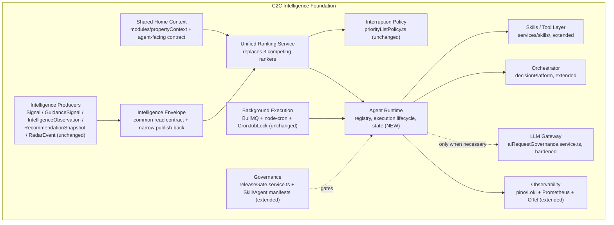
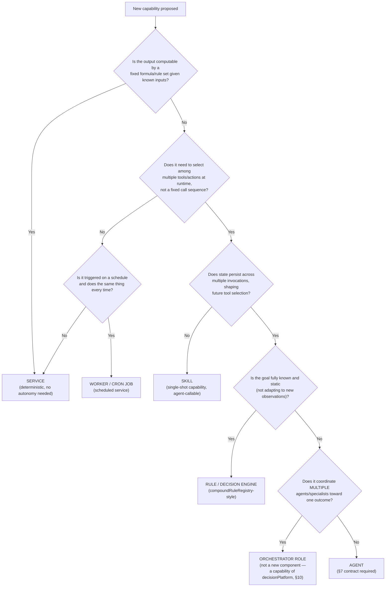
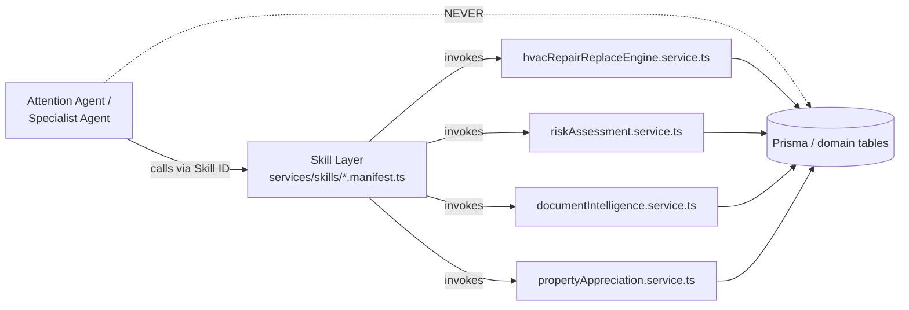
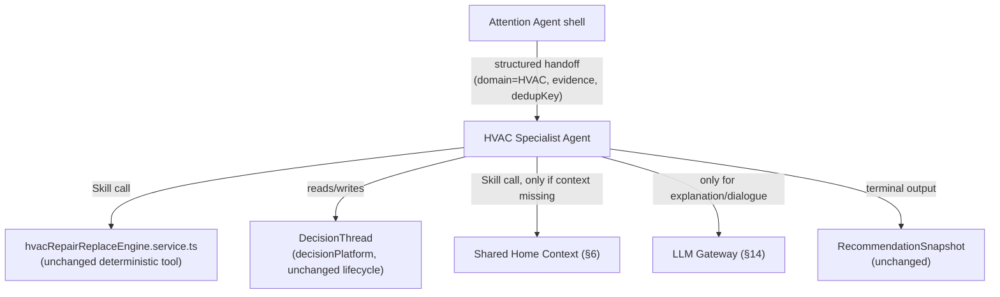
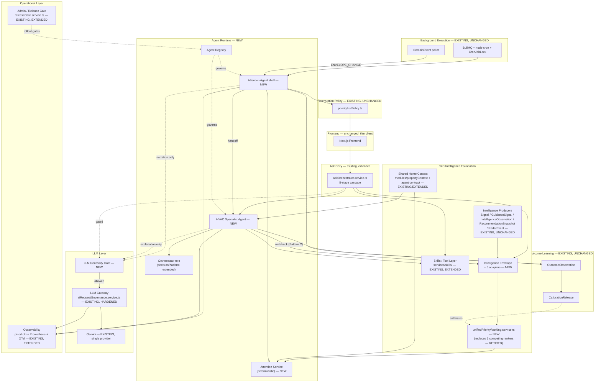
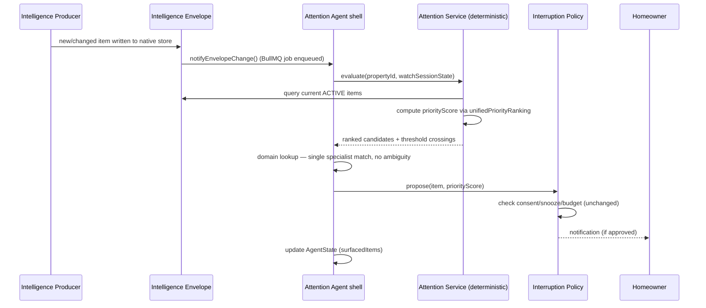
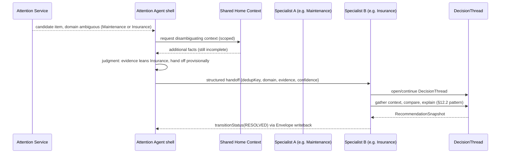
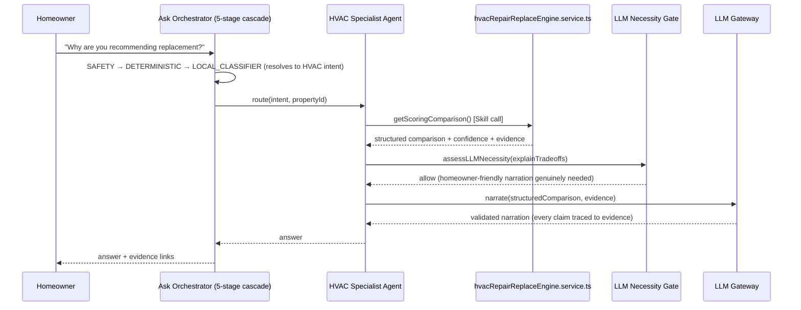
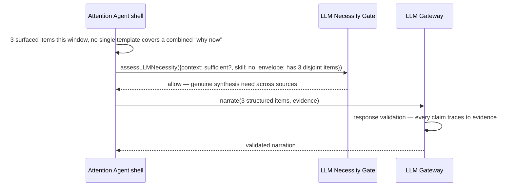
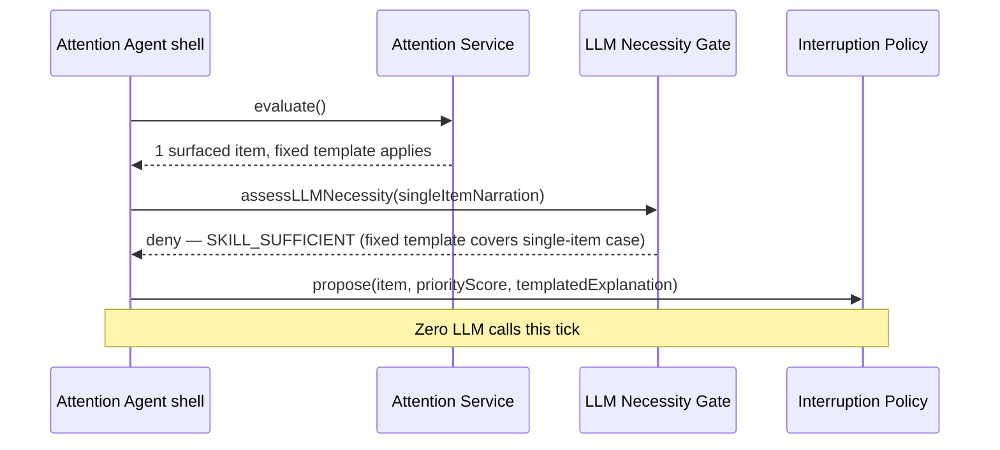

# C2C Intelligence & Agentic Evolution Architecture (Stage 3)

**Date:** 2026-08-26
**Status:** Draft target architecture — first pass, not yet build-approved.
**Source of truth:** [`docs/audits/AGENTIC_READINESS_AUDIT.md`](../audits/AGENTIC_READINESS_AUDIT.md) (Stage 1/2, confirmed ready for Stage 3 input after 6 external-review rounds). Every claim about *current* C2C state in this document is inherited from that audit and is not re-derived here; where a Stage 3 decision required narrow verification against the codebase, that is called out inline as **[verified]**.
**Scope:** This document is the requested Stage 3 exercise — *Current C2C → Intelligence Foundation → Initial Agents → Orchestrator → Mature Agent Ecosystem*. It is a target architecture and phased evolution plan, not an implementation. No code changes accompany this document.

---

## Table of Contents

1. [Executive Summary](#1-executive-summary)
2. [Architectural Principles](#2-architectural-principles)
3. [Current → Target Mapping](#3-current--target-mapping)
4. [C2C Intelligence Foundation](#4-c2c-intelligence-foundation)
5. [Intelligence Envelope Specification](#5-intelligence-envelope-specification)
6. [Shared Context Architecture](#6-shared-context-architecture)
7. [Agent Definition & Agent Contract](#7-agent-definition--agent-contract)
8. [Agent vs Service vs Skill Decision Framework](#8-agent-vs-service-vs-skill-decision-framework)
9. [Skills / Tool Architecture](#9-skills--tool-architecture)
10. [Orchestrator Architecture](#10-orchestrator-architecture)
11. [Attention Agent Detailed Design](#11-attention-agent-detailed-design)
12. [Specialist Agent Pattern](#12-specialist-agent-pattern)
13. [Agent Interaction Patterns](#13-agent-interaction-patterns)
14. [LLM Gateway & LLM Necessity Gate](#14-llm-gateway--llm-necessity-gate)
15. [Ranking & Interruption Architecture](#15-ranking--interruption-architecture)
16. [Trigger/Event Architecture](#16-triggerevent-architecture)
17. [State & Memory](#17-state--memory)
18. [Conflict Resolution](#18-conflict-resolution)
19. [Governance & Safety](#19-governance--safety)
20. [Observability](#20-observability)
21. [Learning & Outcome Feedback](#21-learning--outcome-feedback)
22. [Ask Cozy Integration](#22-ask-cozy-integration)
23. [Target Architecture Diagram](#23-target-architecture-diagram)
24. [Runtime Sequence Diagrams](#24-runtime-sequence-diagrams)
25. [Database / Persistence Changes](#25-database--persistence-changes)
26. [Implementation Phases](#26-implementation-phases)
27. [Migration / Refactoring Matrix](#27-migration--refactoring-matrix)
28. [Risks & Mitigations](#28-risks--mitigations)
29. [Success Metrics](#29-success-metrics)
30. [Final Recommendation](#30-final-recommendation)
31. [Critical Design Test](#31-critical-design-test)

---

## 1. Executive Summary

**What C2C should become architecturally:** not a product with agents bolted on, but a system where the *existing* intelligence C2C already computes — five parallel producers, three ranking engines, one decision-lineage engine, one governed LLM chokepoint — is unified behind one read contract, ranked by one deterministic service, and watched by one thin coordination layer that decides what's worth a homeowner's attention. Agents are the mechanism that makes that watching and handing-off *adaptive* where deterministic policy genuinely can't cover the case. Everywhere deterministic policy *can* cover the case, it should, and it already mostly does.

The audit's central finding — fragmentation, not absence — sets the whole shape of this design. C2C does not need new intelligence-generating capability to answer "what needs my attention." It needs the five things it already knows to be queryable through one contract, ranked by one formula, and watched by one process instead of zero.

**The one deliberate departure from a naive reading of "build the Attention Agent first":** the audit's own honest-gap finding (§10.1) is that, as commonly described, the Attention Agent is fully expressible as a deterministic service — nothing in "rank, threshold, hand off" requires adaptive goal pursuit. This document does not paper over that. It splits the capability into an **Attention Service** (Phase 2, deterministic, ships first, independently testable with fixed inputs/outputs) and a thin **Attention Agent shell** around it that owns exactly the parts that are genuinely adaptive: cross-tick watch-session state, ambiguous specialist selection when more than one domain could plausibly own a detected item, and the LLM-necessity decision for narration. Section 11 specifies that split precisely, including the five things (persistent goal, tool selection, replanning trigger, stop condition, a non-deterministic-policy decision) the audit said were unspecified.

**What ships, in order:** Intelligence Envelope + ranking convergence + HVAC verdict reconciliation (Phase 0, no agents yet) → agent runtime primitives that don't depend on any specific agent existing (Phase 1) → the Attention Service + thin Attention Agent shell (Phase 2, proves Job 1: *notice before being asked*) → the HVAC Specialist Agent reusing the existing DecisionThread/scoring engine as a tool (Phase 3, proves hand-off) → Ask Cozy wired into the same Envelope and Specialist layer instead of a parallel path (Phase 4, proves one intelligence architecture, not two) → an explicit, not-yet-built extension pattern for the next five specialists (Phase 5).

**What this is not:** a plan to add a second LLM provider, an event bus, a vector database, or a central orchestrator that contains business logic. None of those are justified by anything the audit found, and each is explicitly ruled out below with the evidence that rules it out.

---

## 2. Architectural Principles

These are binding constraints on every subsequent section, not aspirations.

1. **Context-first, deterministic-first, LLM-last.** Every agent exhausts, in order: C2C context (Property Context, documents, personalization) → existing intelligence (Envelope, scoring/decision engines) → deterministic rules/Skills/domain services → agent coordination/reasoning → LLM, only as an escalation capability. This is verbatim the audit's §9.1 rule, generalized from the pattern already live in `askResultSynthesis.service.ts`. It is not new; it is the one existing pattern this whole architecture is built to extend, not loosen.
2. **C2C is the intelligent system; agents are controlled components inside it.** No agent is a standalone product surface. Every agent's output lands in the same Envelope, the same ranking, the same interruption policy, and the same Ask Cozy conversation path that non-agentic C2C features already use.
3. **Adapters before schema migration.** The five intelligence subsystems (`Signal`, `GuidanceSignal`/`SignalProvenance`, `IntelligenceObservation`, `RecommendationSnapshot`/`OutcomeObservation`, `RadarEvent`) are **not** merged into one physical table. Each gets a thin read (and narrow write-back) adapter into the Intelligence Envelope. Physical consolidation is revisited only if a concrete adapter-layer limitation is found in Phase 0 build-out — none is predicted, per the audit's explicit finding that the five schemas differ in real, fidelity-bearing ways (e.g. `GuidanceSignal`'s decimal severity vs. `RadarEvent`'s correlation shape).
4. **Ranking and interruption are two different questions, answered by two different components.** "How important is this?" (deterministic ranking) is never conflated with "should the homeowner be bothered right now?" (`priorityListPolicy.ts`, reused unchanged as the interruption gate).
5. **"Agent" is a specific claim, not a label.** Per the audit's §3.2 definition, adopted verbatim: an agent exists only where there is adaptive goal pursuit under bounded, governed autonomy — dynamic tool/action selection against state that isn't fully known upfront, with logged, budgeted, revocable state transitions. Scheduling, background execution, or "runs continuously" are not sufficient conditions. Section 8's decision framework is the enforcement mechanism.
6. **No LLM output becomes authoritative C2C state without validation and provenance.** Every persisted AI-derived record carries provenance, evidence, confidence, generation method, and freshness — the Envelope's mandatory fields (§5) exist specifically to make this structurally impossible to skip, not just policy-enforced.
7. **Reuse before rebuild, adapters before rewrites, extension before replacement.** Consistent with the audit's Q3 conclusion (incremental evolution, not redesign): every component in §27's migration matrix is EXISTING, EXTEND, REFACTOR, or WRAP AS TOOL unless a specific justification for NEW is given.
8. **No autonomy beyond what's earned.** Every agent is scored against the audit's §9.2 autonomy ladder (Observe → Recommend → Draft → Execute-reversible → Execute-consequential). Every agent designed in this document targets Level 0–2. Level 3+ requires the composed agent-runtime safety contract in §19 — which does not exist yet and is not built in the phases this document scopes.
9. **Minimum necessary infrastructure.** No event bus, no second LLM provider, no vector database, no new orchestration platform unless a concrete requirement demonstrates the existing BullMQ/`DomainEvent`/`aiRequestGovernance`/`decisionPlatform` substrate cannot meet it. Sections 14 and 16 document the specific tests that would flip these defaults.

---

## 3. Current → Target Mapping

| Existing component | Current role (per audit) | Target role | Change required |
|---|---|---|---|
| `modules/propertyContext` | Assembles ~20 typed fact scopes; 27+ callers | Canonical agent-facing Shared Home Context (§6) | Add a stable, versioned, budget-aware read contract on top — no internal rewrite |
| `Signal`, `GuidanceSignal`, `IntelligenceObservation`, `RecommendationSnapshot`, `RadarEvent` | 5 disjoint intelligence schemas | 5 native stores, each exposed through the Intelligence Envelope via adapter (§5) | Write one adapter per store; no schema change |
| `radarPriority.ts`, `guidancePriority.service.ts`, `homeActions.service.ts`'s ranker | 3 competing ranking formulas, wrapped by `priorityListPolicy.ts` | One `unifiedPriorityRanking.service.ts` (§15) | Consolidate; retire the 2 losing implementations after parity validation |
| `priorityListPolicy.ts` + eligibility/suppression/snooze/kill-switch stack | Interruption gate | Unchanged — the interruption gate for agent output too | None |
| `decisionPlatform` (DecisionThread, RecommendationSnapshot, `decisionFamilyAdapterRegistry`) | Real lifecycle machinery, 1 of 7 families (HVAC) does real composition | Orchestration substrate for Specialist Agents (§10, §12) | Extend, don't replace; HVAC family becomes the first Specialist's decision-thread backing |
| Two disagreeing HVAC verdict engines (`decisionThreadService.ts` vs. `homeActionSourcePromotion.service.ts`) | Acknowledged divergence, surfaced via `SOURCE_CARD_VERDICT_DIVERGENCE` | One authoritative verdict, or explicit ranked precedence | Reconcile in Phase 0 — a data-quality fix, not an architecture change |
| `services/skills/` (19 `SkillDefinition`s) | Closest existing analog to an agent-tool manifest; kill-switches confirmed live at runtime | The Skill/Tool layer agents call (§9) | Extend the manifest schema with an autonomy-level tag; no runtime rewrite |
| `aiRequestGovernance.service.ts` | Routes all 25 Gemini invocation sites (18 route IDs); single-provider, no caching, no distributed rate-limit state, trusts a caller-asserted structured-output flag | LLM Gateway (§14) | Harden the interface: independent output verification, caching, distributed rate limits, safety filtering, LLM Necessity Gate. Provider abstraction added as an interface, not because a second provider ships |
| `askOrchestrator.service.ts` + 5-stage cascade | Deterministic NLU router; `REMOTE_FALLBACK` stage unwired; only real LLM touchpoint is `askResultSynthesis.service.ts` | Ask Cozy's entry point into the same Intelligence Foundation (§22) | Wire `REMOTE_FALLBACK` to the LLM Gateway under the Necessity Gate; add Specialist Agent as a routable target alongside existing Skills |
| BullMQ + node-cron + `workerJobRegistry.ts` + `CronJobLock` | Most mature layer in the codebase; durable, leased, parity-checked | Execution substrate for agent ticks and tool invocations (§16) | Add agent-specific job types to the existing registry; no new scheduling system |
| `DomainEvent` poller (30s CAS-claim) | Real consumers, poll-based | Envelope-change trigger for the Attention Service (§16) | Add one new consumer type; no new event infrastructure |
| pino/Loki + Prometheus + OpenTelemetry (already initialized per audit §1.2) | Structured logging, worker/AI cost metrics | End-to-end agent observability backbone (§20) | Extend metric namespaces and trace propagation; no new observability stack |
| `releaseGate.service.ts` + Tool Discovery's kill-switches | KPI-gated cohort rollout, proven on tool rollout | Agent rollout gate (§19) | Extend cohort model to cover agent definitions; reuse directly otherwise |
| `homeIntelligenceGraph.ts` | Dormant, zero call sites | Not activated in this design | Left dormant; revisit only if a specific cross-entity graph query need emerges that Property Context can't serve |
| Frontend (`lib/api/client.ts`, thin REST wrapper) | ~0 business logic | Unchanged | Agent-generated recommendations surface through the same existing REST contract; no client-side intelligence added |

---

## 4. C2C Intelligence Foundation

The foundation is the set of components every agent and every conventional feature share. Nothing in this layer is agent-specific; agents are simply the newest consumers of it.



| Foundation piece | Existing seed | What's new |
|---|---|---|
| Shared Home Context | `modules/propertyContext` | Versioned, budgeted, agent-facing contract wrapping it (§6) |
| Intelligence Envelope | 5 disjoint schemas + `IntelligenceConsumerCurrentness` freshness ledger | The common contract + 5 adapters + narrow publish-back interface (§5) |
| Intelligence producers | `signal.service.ts`, guidance engine, `propertyIntelligence.service.ts`, `decisionPlatform`, Home Event Radar | Unchanged — they keep writing to their own native tables |
| Deterministic ranking | 3 competing formulas | One `unifiedPriorityRanking.service.ts` (§15) |
| Skills / Tool layer | `services/skills/`, 19 manifests | Autonomy-level tag added to each manifest; HVAC engine and other deterministic services wrapped as callable tools (§9) |
| Agent runtime | None | Agent registry, `AgentRun`/`AgentState` persistence, execution lifecycle (§7, §25) |
| Orchestration | `decisionPlatform` (1 of 7 families composing) | Generalized decision-thread orchestration for Specialist Agents (§10) |
| Background execution | BullMQ + node-cron + `workerJobRegistry.ts` | New job types registered in the existing registry; no new scheduler |
| Interruption policy | `priorityListPolicy.ts` | Unchanged |
| LLM Gateway | `aiRequestGovernance.service.ts` | Hardened interface + Necessity Gate (§14) |
| Observability | pino/Loki, Prometheus, OpenTelemetry | Correlation/trace propagation through agent runs (§20) |
| Governance | `releaseGate.service.ts`, Skills kill-switches | Extended to agent definitions (§19) |

---

## 5. Intelligence Envelope Specification

### 5.1 Design stance

**Read contract now, narrow publish-back contract for state transitions, no physical merge.** The Envelope is the single shape every consumer (ranking, Attention Service, Specialist Agents, Ask Cozy) queries against. It is populated by five per-subsystem adapters at query time (or via a thin materialized index — see §5.6), not by migrating five schemas into one table. This is a direct implementation of the audit's own explicit instruction (§9 item 1): "deliberately not a physical schema migration."

### 5.2 Field contract

```ts
interface IntelligenceEnvelopeItem {
  // Identity
  id: string;                 // stable envelope-level ID: hash(sourceModel, sourceRecordId)
  dedupKey: string;           // producer-supplied; used for supersession, not identity
  version: number;            // monotonic per dedupKey

  // Classification — MANDATORY
  type: EnvelopeType;         // SIGNAL | GUIDANCE | OBSERVATION | RECOMMENDATION | RADAR_EVENT
  domain: EnvelopeDomain;     // HVAC | ROOF | INSURANCE | FINANCE | REGULATORY | WEATHER | MAINTENANCE | ...
  subject: {
    propertyId: string;
    userId?: string;
    entityRef?: string;       // e.g. a specific appliance or document ID, when the item is that granular
  };

  // Provenance — MANDATORY, structurally required (Principle 6)
  source: {
    producer: string;         // e.g. "signal.service.ts", "decisionPlatform/decisionThreadService.ts"
    sourceModel: string;      // e.g. "Signal", "GuidanceSignal", "RecommendationSnapshot"
    sourceRecordId: string;   // pointer back to the native row — the Envelope never copies payload
  };
  provenance: {
    generatedBy: "DETERMINISTIC" | "LLM" | "EXTERNAL_INGEST" | "HYBRID";
    method: string;           // e.g. "hvacRepairReplaceEngine.service.ts v3", "askResultSynthesis narration"
    modelVersion?: string;    // set only when generatedBy includes LLM
  };

  // Confidence / evidence — MANDATORY where the native record supports it, else explicit null
  confidence: number | null;       // 0–1; null is a real, renderable state, not a default
  evidence: EvidenceRef[];         // pointers (factKey | documentId | snapshotId), never inlined blobs
  severity: Severity | null;       // INFO | ADVISORY | IMPORTANT | URGENT | SAFETY_EMERGENCY

  // Ranking — OPTIONAL, populated by the ranking service, never by the producer
  priorityScore: number | null;
  priorityComputedAt: string | null;

  // Freshness — MANDATORY
  freshness: {
    computedAt: string;
    ttl: string | null;             // ISO 8601 duration; null = producer manages its own staleness
    staleAfter: string | null;      // absolute timestamp, derived from ttl at write time
  };

  // Lifecycle — MANDATORY
  status: "ACTIVE" | "SUPERSEDED" | "CONFLICTED" | "DISMISSED" | "EXPIRED" | "RESOLVED";

  // Action surface — OPTIONAL
  recommendation?: {
    actionType: string;
    summary: string;               // structured, not free text — rendered by the consumer, not embedded prose
    decisionThreadId?: string;      // link into decisionPlatform when a decision-grade recommendation exists
  };

  createdAt: string;
  updatedAt: string;
}
```

### 5.3 Mandatory vs optional, and why

| Field group | Mandatory? | Rationale |
|---|---|---|
| Identity, classification, subject | Mandatory | Nothing downstream (ranking, dedup, Attention Service) can function without knowing what a thing is and whose home it's about |
| `source` / `provenance` | Mandatory | Principle 6 — this is what makes "LLM output never becomes authoritative state without provenance" structurally true rather than a lint rule |
| `confidence` / `evidence` | Mandatory *field*, nullable *value* | A producer that genuinely has no confidence figure (e.g. a raw external ingest before scoring) must say so explicitly — `null` is renderable ("unscored") and preserves the audit's §16 requirement that C2C be allowed to abstain |
| `severity` | Mandatory field, nullable value | Same reasoning; not every item is severity-typed (e.g. a neutral informational observation) |
| `priorityScore` | Optional, ranking-owned | Producers never self-rank — this is the structural enforcement of §15's "ranking is one service" rule |
| `freshness` | Mandatory | Directly reuses the existing, audit-confirmed `IntelligenceConsumerCurrentness` staleness pattern — freshness was already the one thing spanning all five subsystems before the Envelope existed |
| `status` | Mandatory | Required for conflict representation (§18) and dedup (§5.5) |
| `recommendation` | Optional | Not every envelope item is actionable (e.g. a pure observation) |

### 5.4 Per-subsystem adapter mapping

| Native store | Adapter maps to Envelope as | Notable fidelity note |
|---|---|---|
| `Signal` | `type: SIGNAL` | 9 hardcoded keys map to a fixed `domain` enum subset; confidence uses the existing 5-factor blend directly |
| `GuidanceSignal` / `SignalProvenance` | `type: GUIDANCE` | Richest native shape — nearly 1:1 field mapping; `severity` uses its existing Decimal(5,4) score, bucketed into the Envelope's 5-value enum for cross-type comparability while the native Decimal stays queryable via `source.sourceRecordId` |
| `IntelligenceObservation` | `type: OBSERVATION` | Often `confidence: null` pre-scoring — this is the adapter's primary reason for existing as a *thin* mapper rather than a physical merge, per the audit's explicit fidelity concern |
| `RecommendationSnapshot` / `OutcomeObservation` | `type: RECOMMENDATION` | `recommendation.decisionThreadId` populated directly; this is the one subsystem where the Envelope's action surface is fully populated today |
| `RadarEvent` | `type: RADAR_EVENT` | Correlation shape (matched-event clusters) is flattened to one envelope item per compound insight, not per raw matched event, to keep ranking granularity consistent with the other four types |

### 5.5 Deduplication

`dedupKey` is producer-supplied (each of the five subsystems already computes its own dedup/idempotency key today — `GuidanceSignal`'s dedup key and `RecommendationSnapshot`'s content-addressed idempotency are both audit-confirmed). The Envelope does not invent a new dedup algorithm; it surfaces the existing one and adds one rule on top: **when two different `sourceModel`s produce items with overlapping `subject` + `domain` and no shared `dedupKey`, that is a cross-producer conflict, not a duplicate** — handled by §18, not silently collapsed.

### 5.6 Read path vs. materialization

Two viable implementations, in order of preference:

1. **Query-time fan-out (default).** The Envelope query service calls all five adapters in parallel (mirroring how `modules/propertyContext` already runs ~20 fact scopes in parallel) and merges results. No new persistence. Acceptable as long as query volume stays in the range Property Context already handles today.
2. **Thin materialized index (fallback, only if query-time fan-out proves too slow under agent-driven polling volume).** A single new narrow table, `IntelligenceEnvelopeIndex` (id, dedupKey, type, domain, subject, priorityScore, status, freshness pointers — no payload), refreshed by the same adapters on a write-triggered basis. This is the only new persistence §5 requires, and only conditionally (see §25).

### 5.7 Publish-back contract

The Envelope is read-first, but consumers (the Attention Service, Specialist Agents) need to mark items `SUPERSEDED`, `DISMISSED`, or `RESOLVED` without reaching into five different write paths. Each adapter additionally implements one narrow write method:

```ts
interface EnvelopeAdapter {
  query(filter: EnvelopeQuery): Promise<IntelligenceEnvelopeItem[]>;
  transitionStatus(sourceRecordId: string, to: EnvelopeStatus, reason: string): Promise<void>;
}
```

`transitionStatus` is the *only* write surface — it never creates or mutates payload, only the lifecycle status, and every transition is logged (§20) with the calling agent's `agentRunId`. This keeps "agents can act back through the Envelope" true without reopening the "every subsystem's write path is now agent-reachable" risk the audit's §21-equivalent boundary explicitly warns against.

### 5.8 Versioning and staleness

`version` increments on any adapter re-read that detects a changed native record (compared by the producer's own updated-at/version field, not by the Envelope). Consumers that cached an item at an older version treat it as stale on next Attention Service tick — this reuses the same "compare and recompute" shape `IntelligenceConsumerCurrentness` already implements today; the Envelope generalizes it across producers rather than inventing a new mechanism.

---

## 6. Shared Context Architecture

### 6.1 Why this, not direct Prisma access

`modules/propertyContext` already does the hard part: ~20 typed fact scopes, KNOWN/UNKNOWN/STALE/CONFLICTED marking per fact, authorization, parallel scope resolution, a version hash — and 27+ real callers already depend on it. The gap the audit identified is not capability, it's *contract stability for a new class of caller (agents)* that shouldn't be allowed to grow direct, ad hoc Prisma dependencies the way 15% of controllers already have.

### 6.2 The agent-facing contract

```ts
interface AgentContextRequest {
  propertyId: string;
  requestingAgentId: string;      // ties every context pull to an AgentRun for budget + audit
  scopes: PropertyContextScope[]; // explicit allow-list, not "give me everything"
  maxFacts?: number;               // context budget ceiling (reuses the Skills' context-budget concept)
  maxLatencyMs?: number;
  includeHistory?: boolean;        // relevant history, opt-in, bounded
}

interface AgentContextResponse {
  contextVersion: string;          // the existing propertyContext version hash
  facts: {
    key: string;
    value: unknown;
    status: "KNOWN" | "UNKNOWN" | "STALE" | "CONFLICTED";
    evidence: EvidenceRef[];
    freshness: { computedAt: string; source: string };
  }[];
  personalization?: PersonalizationSnapshot;   // from modules/personalization, scope-gated
  missingFacts: string[];          // explicit — an agent must be able to see what it doesn't know
}
```

This is not a new context engine; it is a typed request/response wrapper around the existing `getPropertyContext` call, adding: (a) a mandatory `requestingAgentId` for budget attribution, (b) an explicit `scopes` allow-list instead of unscoped access, (c) a `maxFacts`/`maxLatencyMs` budget ceiling enforced the same way Skills already enforce context budgets. **[verified]** `getPropertyContext` already returns per-fact KNOWN/UNKNOWN/STALE/CONFLICTED status and a version hash today, per the audit — this wrapper does not change that behavior, it constrains who can call it and how much they can ask for.

### 6.3 What agents must NOT do

- Import Prisma clients or domain models directly for property/homeowner facts.
- Request unscoped context ("give me everything about this property").
- Bypass the `missingFacts` signal by inferring unknown facts from LLM world knowledge (this is the specific failure mode Principle 6 and the audit's §9.1 rule exist to prevent).

### 6.4 Domain-specific views

The five existing context wrappers (financial / projectCompliance / aggregation / planning / protection) remain feature-scoped views over `propertyContext`, per the audit's §4 recommendation to extract their near-identical `reconciliation.ts` staleness checks into one shared utility. Agents consume either the general `AgentContextRequest` or a domain-specific view when one already exists — they do not get a sixth view built just for agents.

---

## 7. Agent Definition & Agent Contract

### 7.1 Formal definition

> **A C2C Agent is a component that pursues a bounded, stated goal by adaptively selecting among multiple registered tools or actions, against subject state that is not fully known when it starts, with every state transition logged, budgeted, and revocable.**

This is the audit's §3.2 definition, made binding. A component that satisfies this is an Agent, tagged and governed as one. A component that does not — no matter how it's named, how often it runs, or how sophisticated its output looks — is a Service, a Rule, a Worker, or an Orchestrator, and is built and reviewed as one (§8).

### 7.2 Agent Contract

Modeled directly on `services/skills/skill.contract.ts`'s `SkillDefinition` — reusing its risk-policy, context-budget, evaluation-suite, and kill-switch concepts rather than inventing a parallel manifest shape.

```ts
interface AgentDefinition {
  agentId: string;                       // e.g. "attention-agent", "hvac-specialist-agent"
  name: string;
  responsibility: string;                // one sentence, matches the "why an agent" test in §8
  supportedDomains: EnvelopeDomain[];
  acceptedTriggers: AgentTrigger[];       // ENVELOPE_CHANGE | SCHEDULED_TICK | USER_INITIATED | SPECIALIST_HANDOFF

  requiredContext: PropertyContextScope[];
  allowedSkills: string[];                // Skill IDs this agent may invoke
  prohibitedSkills?: string[];            // explicit denials, for defense-in-depth over the allow-list

  executionMode: "SYNC" | "ASYNC_TICK" | "ASYNC_LONG_RUNNING";
  stateRequirements: {
    persistsAcrossTicks: boolean;
    stateShape?: string;                  // reference to an AgentState schema
  };

  outputContract: {
    envelopeWriteback: boolean;           // may call transitionStatus (§5.7)?
    producesRecommendation: boolean;
    maxAutonomyLevel: 0 | 1 | 2;          // hard ceiling — see §9.2 of the audit; no agent in this document exceeds 2
  };

  budgets: {
    maxContextFactsPerRun: number;
    maxLLMInvocationsPerRun: number;
    maxLLMCostPerRunUsd: number;
    maxExecutionMsPerRun: number;
    maxRunsPerHourPerSubject: number;     // rate ceiling per property, prevents runaway ticking
  };

  killSwitch: string;                     // env var name, same convention as Skills' killSwitch
  featureFlag: string;
  releaseState: "DEV" | "COHORT" | "GA" | "DEPRECATED";

  retryPolicy: { maxAttempts: number; backoffMs: number };
  timeoutMs: number;
  escalationPolicy: {
    onLowConfidence: "ABSTAIN" | "HAND_OFF" | "ASK_HOMEOWNER";
    onToolFailure: "RETRY" | "ABSTAIN" | "ESCALATE_TO_HUMAN_REVIEW";
  };

  auditRequirements: { logEveryToolCall: true; logEveryStatusTransition: true };
  safetyLevel: "OBSERVE_ONLY" | "RECOMMEND" | "DRAFT";  // mirrors autonomy ceiling, human-readable
  evaluationSuiteId: string;              // required before COHORT/GA release, same as Skills
}
```

### 7.3 What's reused vs. new

| Concept | Source | Reused as-is? |
|---|---|---|
| Risk policy (effects, materiality, reversibility) | `skill.contract.ts` | Yes — `escalationPolicy` + `safetyLevel` are the agent-level equivalent |
| Context budget | `skill.contract.ts` | Yes — `budgets.maxContextFactsPerRun` |
| Kill-switch / feature-flag pair, read at runtime | `askOperationalControls.ts`'s `skillEnabled()` | Yes — same env-var convention, same runtime enforcement path, extended to agents |
| Evaluation suite requirement | Skills registry release process | Yes |
| Cohort/KPI-gated rollout | `releaseGate.service.ts` | Yes — `releaseState` ties into it (§19) |
| `AgentRun`, `AgentState` persistence | — | New (§25) |

---

## 8. Agent vs Service vs Skill Decision Framework

This is the proliferation gate. Every proposed new component answers these questions before it is allowed to be called an agent.



| Kind | Decisive test | C2C examples |
|---|---|---|
| **Service** | Fixed formula, known inputs → known output shape | `hvacRepairReplaceEngine.service.ts`, `unifiedPriorityRanking.service.ts`, any *Reconciliation.service.ts |
| **Worker / cron job** | Same action, every tick, no judgment | The 66-entry `workerJobRegistry.ts` — overwhelmingly this category, per the audit's §3.2 finding |
| **Skill / Tool** | Single-shot capability an agent (or Ask) calls once per invocation, no cross-call state | Any of the 19 existing `SkillDefinition`s |
| **Rule / decision engine** | Goal is static and fully known; only the *inputs* vary | `compoundRuleRegistry.ts`'s Home Action promotion rules |
| **Orchestrator role** | Coordinates multiple specialists toward one outcome using structured handoffs | A capability `decisionPlatform` gains, not a new standalone service (§10) |
| **Agent** | Adaptive tool selection + persistent cross-invocation state + a goal that isn't fully specified upfront | Attention Agent shell (§11), HVAC Specialist Agent (§12) — and *only* these two in this document |

**Explicit non-agents, by this framework, even though they will be tempting to rename:** the unified ranking service (fixed formula → Service), the Envelope adapters (fixed mapping → Service), the LLM Necessity Gate (fixed decision tree → Rule), `priorityListPolicy.ts` (fixed policy evaluation → Rule), and the Attention *tick* itself absent the specialist-selection judgment (Worker). This framework is the direct answer to the audit's finding that the codebase's "strong conventions... make adding an N+1th instance of a pattern easy" — it is the gate that stops "agent" from becoming that N+1th overused pattern.

---

## 9. Skills / Tool Architecture

### 9.1 Principle: Agent → Skill/Tool → Domain Service, never Agent → Prisma

Every domain capability an agent needs already exists as a domain service. The Skills layer (`services/skills/`) is not rebuilt — its 19 `SkillDefinition`s are extended with one new manifest field (`autonomyLevel: 0 | 1 | 2`, per the audit's §9 item 6 recommendation) and become the uniform calling convention for agents, exactly as they already are for Ask.



### 9.2 Capability → Skill mapping

| Capability | Existing service (unchanged) | Skill wrapper status |
|---|---|---|
| Property context | `modules/propertyContext` | New: `property-context` Skill wrapping §6's `AgentContextRequest` |
| HVAC repair/replace | `hvacRepairReplaceEngine.service.ts` | Existing `repairReplace` Skill manifest — reused directly, per audit's exemplar classification |
| Risk assessment | `riskAssessment.service.ts` | New thin Skill wrapper (service itself untouched) |
| Maintenance intelligence | Guidance engine, `compoundRuleRegistry.ts` | Existing `maintenance` Skill manifest |
| Insurance analysis | `coverage/` subfolder services | Existing `coverage` Skill manifest |
| Document extraction | `documentIntelligence.service.ts`, `ExtractionEnvelope` | Existing `document-promotion` Skill manifest |
| Financial calculations | `ownershipCosts/` services | Existing `ownership-cost` Skill manifest |
| Refinance intelligence | `refinanceRadar` | Existing `refinance` Skill manifest |
| Weather/environmental | Bespoke weather/AQI adapters | New thin Skill wrapper (adapters untouched; see §27 for the separate adapter-generalization work, not required for this) |
| Warranty analysis | `homeOperations`/property record services | Existing `property-record` Skill manifest, extended |
| Local/regulatory intelligence | `IntelligenceObservation` (USGS, NYC ZAP) | New thin Skill wrapper over Envelope query, not the raw ingestion pipeline |
| Lifecycle guidance | `services/skills/household`, `seller-preparation`, `buyer-closing` manifests | Existing, reused directly |
| Service/provider discovery | `servicePriceRadar` | New thin Skill wrapper |
| Recommendation retrieval | Intelligence Envelope query (§5) | New Skill: `query-envelope` — the one Skill every agent in this document calls most often |

No domain logic is rewritten inside any agent. Where a "Skill wrapper" is marked new, it is a thin manifest + adapter registration — the underlying service is untouched, matching the audit's `hvacRepairReplaceEngine.service.ts` exemplar pattern ("None beyond a thin agent-facing wrapper").

---

## 10. Orchestrator Architecture

### 10.1 What the Orchestrator is (and is not)

The Orchestrator is **not** a new standalone service and **not** a central intelligence engine. It is a generalization of `decisionPlatform`'s existing DecisionThread lifecycle machinery — which today does real composition for exactly one of seven registered families (HVAC) — into a reusable substrate any Specialist Agent's multi-step workflow can run on.

| Belongs to orchestration | Does NOT belong to orchestration (stays in domain services) |
|---|---|
| Routing a detected item to the right Specialist Agent | Domain scoring (HVAC weights, risk formulas) |
| Sequencing a specialist's multi-step workflow (gather context → compare → explain → decision thread) | Property fact assembly (stays in Property Context) |
| Managing execution budgets across a run | Business rules (stay in `compoundRuleRegistry.ts` and domain services) |
| Resolving "is more context needed before proceeding?" | Data ingestion (stays in `propertyIntelligence.service.ts`, Radar pipelines) |
| Handling tool-call failures and retries | Notification transport (stays in the existing notification stack) |
| Detecting workflow completion / stop conditions | Envelope adapter logic (stays with each of the 5 native subsystems) |
| Escalating unresolved conflicts (§18) | LLM prompt content (stays in the Gateway + agent-specific prompt registry) |
| Deciding when to ask the homeowner for missing information | — |

### 10.2 Reuse of `decisionPlatform`

- `DecisionThread` lifecycle → becomes the generic multi-step execution record for any Specialist Agent's workflow, not just HVAC.
- `decisionFamilyAdapterRegistry` → gains an eighth "family": Attention-Agent-initiated specialist handoffs, registered the same way the other 7 families are, with the same thin-vs-real-composition distinction the audit already applies.
- `RecommendationSnapshot` / `OutcomeObservation` → unchanged; every Specialist Agent's terminal output is a `RecommendationSnapshot`, so the outcome-learning loop (§21) requires zero new plumbing.

### 10.3 What's explicitly NOT built

A central "AgentOrchestrator" god-service that contains business logic for every domain. The orchestrator's entire footprint is: (a) the extended `decisionFamilyAdapterRegistry` entry, (b) a new, narrow `AgentRun` state machine (§25) tracking *where in the workflow* a Specialist Agent is, and (c) the handoff contract between the Attention Agent shell and a Specialist Agent (§13, Pattern A). Nothing else.

---

## 11. Attention Agent Detailed Design

### 11.1 The split this design commits to

The audit's honest-gap finding (§10.1) is decisive here: threshold evaluation, ranking, and hand-off are each individually a deterministic policy. This document does not rename a Service "Agent" to satisfy the brief. It builds two layers:

| Layer | What it is | Autonomy |
|---|---|---|
| **Attention Service** (`attentionEvaluation.service.ts`, new) | Deterministic. Given the current Envelope state for a property, computes: which items are new/changed since last evaluation, their unified priority score, and whether any cross the interruption threshold. Pure function of Envelope + ranking + policy. Independently unit-testable with fixed inputs. | None — this is a Service per §8 |
| **Attention Agent shell** (new) | Wraps the Service. Owns exactly the parts that are genuinely adaptive (see 11.2). | 0–1 (Observe → Recommend) |

### 11.2 What makes the shell genuinely an agent — answering the audit's five open questions directly

| Audit's open question | This design's answer |
|---|---|
| What goal or plan persists between ticks? | A per-property **watch session** (`AgentState`, §25): the set of envelope items already surfaced-and-dismissed, surfaced-and-pending, or suppressed this interruption-budget window. The goal is stated explicitly: *"surface at most N items per budget window, prioritized by the Service's ranking, without re-surfacing dismissed items or exceeding the interruption budget."* |
| Which tools does it choose among? | Three, chosen dynamically per detected item: (a) hand off to a specific Specialist Agent when one is registered for the item's `domain` and the item crosses a specialist-handoff confidence threshold, (b) call the LLM Gateway for "why now" narration when the homeowner-facing explanation needs synthesis across more than one envelope item (a fixed template suffices for single-item cases and does not invoke tool selection at all), or (c) do neither and pass the ranked item straight to the interruption policy. This is a real choice: which specialist (if any) and whether narration is needed are not a fixed 1:1 lookup — a `domain` can map to more than one registered specialist as the specialist roster grows (§26 Phase 5), and the choice of narration depends on whether the Service's output is already self-explanatory. |
| What new observation changes its plan? | Any Envelope item transitioning to `status: ACTIVE` with `priorityScore` above the current session's surfaced threshold, or an existing surfaced item transitioning to `SUPERSEDED`/`RESOLVED` (which retracts a pending interruption-budget commitment). |
| Stop condition / execution budget? | A tick stops when: the interruption budget for the window is exhausted, no ACTIVE item exceeds the ranking threshold, or `budgets.maxExecutionMsPerRun` is hit. Budget is defined in the `AgentDefinition` (§7.2), not hardcoded. |
| A decision that cannot be a deterministic policy? | Specialist selection under **domain ambiguity** — when a detected item's `domain` and `evidence` plausibly implicate more than one registered specialist (e.g., a moisture-related maintenance item that could route to either a Maintenance specialist or an Insurance specialist depending on evidence not yet gathered), the shell must decide whether to hand off to one specialist provisionally, request disambiguating context first, or surface without a specialist at all. This is not expressible as a static routing table without becoming exactly the routing table the audit already found duplicated three times (§2.4's Radar naming collision is the cautionary precedent). |

### 11.3 Full specification

| Aspect | Design |
|---|---|
| **Triggers** | `ENVELOPE_CHANGE` (event-driven, via the `notifyEnvelopeChange()` hook — §16), and a bounded `SCHEDULED_TICK` fallback (e.g. every 4 hours per property) to catch any missed event-driven trigger — not a substitute for event-driven detection, a safety net |
| **Execution model** | `ASYNC_TICK` — runs as a BullMQ job, reusing the existing queue infrastructure, one job per (property, trigger) pair |
| **Inputs** | Current Envelope state for the property (via §5's query path), the property's watch-session `AgentState`, the property's interruption budget remaining (`priorityListPolicy.ts`) |
| **State** | Per-property `AgentState` row: `lastEvaluatedEnvelopeVersion`, `surfacedItems[]` (dedupKey, surfacedAt, outcome), `suppressedItems[]`, `interruptionBudgetWindow` |
| **Ranking interaction** | Calls `unifiedPriorityRanking.service.ts` (§15) as a Skill; never recomputes priority itself |
| **Specialist handoff rules** | Domain → registered-specialist lookup, with the ambiguity-resolution judgment in 11.2 when more than one candidate exists; handoff is a structured contract (§13 Pattern A/C), never free-form |
| **Outputs** | Zero or more `IntelligenceEnvelopeItem` status transitions (`transitionStatus` → e.g. `RESOLVED` when a specialist takes over), zero or one homeowner-facing recommendation surfaced through the interruption policy, a structured `AttentionRunResult` (items evaluated, items surfaced, items suppressed, specialist handoffs, LLM calls made) |
| **User interruption rules** | The shell never bypasses `priorityListPolicy.ts` — it *proposes* candidates for interruption; the existing policy layer (unchanged) makes the final "bother them now?" call, exactly per Principle 4 |
| **Failure behavior** | A failed tick is a no-op for the homeowner (nothing surfaced), not a silent state corruption — `AgentState` is only updated on successful completion; retried per `retryPolicy` |
| **Retry behavior** | Per `AgentDefinition.retryPolicy` (default: 2 retries, exponential backoff), consistent with the existing `WorkerRunResult` retry conventions in `workerJobRegistry.ts` |
| **Observability** | Every tick emits an `AgentRun` record (§25) plus structured logs correlated by `agentRunId`; Prometheus counters for items-evaluated, items-surfaced, specialist-handoffs, LLM-calls-made (feeds §29's "resolved without LLM" metric directly) |
| **Cost budget** | `maxLLMInvocationsPerRun: 1` (narration only, and only when the Necessity Gate approves — §14), `maxLLMCostPerRunUsd` set conservatively low since narration is the *only* permitted LLM use case for this agent |
| **LLM escalation rules** | Per §14's Necessity Gate — narration is requested only when more than one surfaced item needs a combined "why now" explanation; a single surfaced item uses a fixed, pre-approved narration template (no LLM call at all) |

---

## 12. Specialist Agent Pattern

### 12.1 HVAC Repair/Replace Advisor as the concrete instance

The audit is explicit: do not rebuild `hvacRepairReplaceEngine.service.ts`, and do not rebuild `DecisionThread`/`RecommendationSnapshot`. The Specialist Agent is a thin coordination layer around infrastructure that already exists and is already the audit's "exemplar" classification.



### 12.2 Reusable pattern (not HVAC-specific)

| Step | What the Specialist Agent does | What it reuses unchanged |
|---|---|---|
| Gather missing context | Calls `AgentContextRequest` (§6) scoped to the domain; if `missingFacts` is non-empty and material, asks the homeowner via Ask Cozy or a structured prompt — never infers via LLM | `modules/propertyContext` |
| Determine whether clarification is required | Deterministic check: does the decision-grade scoring engine's confidence clear its own documented threshold with current facts? | The domain scoring engine's own confidence output |
| Compare alternatives | Calls the domain Skill (e.g. `hvacRepairReplaceEngine.service.ts`) — never recomputes scoring itself | The scoring engine |
| Explain tradeoffs | LLM Gateway call, narration-only, over the scoring engine's structured output — same discipline as `askResultSynthesis.service.ts` | The existing verified-synthesis pattern |
| Maintain a decision thread | Reads/writes the existing `DecisionThread` state machine | `decisionPlatform` |
| Coordinate follow-up | Schedules a re-evaluation tick (via the existing BullMQ substrate) if the homeowner needs time to decide | `workerJobRegistry.ts` conventions |
| Surface uncertainty | Renders the scoring engine's own confidence and evidence — never invents certainty | Envelope's `confidence`/`evidence` fields |
| Produce homeowner-friendly decision support | LLM-narrated summary of the deterministic comparison, with every number traceable to `evidence` pointers | Same hallucination-guard discipline as `askResultSynthesis.service.ts` |

Any future specialist (External Signal Watcher, Document Intelligence, Property Health Reconciler — §26 Phase 5) instantiates this same table with its own domain Skill in the "Compare alternatives" row. Nothing else in the pattern changes.

### 12.3 Prerequisite specific to this specialist

Per the audit's §9 item 5: the two disagreeing HVAC verdict engines must be reconciled (Phase 0) before this Specialist Agent reasons over "the" HVAC answer. This is a data-quality fix, not a new architectural component — see §26.

---

## 13. Agent Interaction Patterns

All five patterns are supported; none is the only route. This directly implements the audit's §12 topology caveat ("not a fixed topology — open for Stage 3").

### Pattern A — Proactive detection
```
Property/Event Change → Intelligence Producer → Intelligence Envelope
  → Attention Agent shell → [Specialist Agent, if domain-ambiguous handoff warranted]
  → Priority/Interruption Policy → Recommendation/Action
```

### Pattern B — User-initiated Ask Cozy
```
User → Ask Cozy (existing deterministic routing) → Skill or Specialist Agent
  → deterministic C2C intelligence (Envelope + domain services) → optional LLM synthesis
  → Answer
```
See §22 for the full Ask Cozy wiring.

### Pattern C — Specialist discovery
```
Specialist Agent (mid-workflow) discovers new material intelligence
  → writes back to Intelligence Envelope (§5.7 transitionStatus / new item via its native producer)
  → Attention Agent shell (next tick, ENVELOPE_CHANGE trigger) → prioritization → homeowner
```
This is the one pattern that requires the Envelope's event-notification hook (§16) to fire on Specialist-Agent-driven writes, not just producer-driven ones.

### Pattern D — Direct deterministic execution
```
Trigger → deterministic service/worker → result
```
No agent involved. This remains the default for anything that clears §8's decision framework as a Service or Worker — the large majority of C2C's existing 600+ services stay exactly here, unchanged.

### Pattern E — Multi-specialist decision (rare, only when genuinely needed)
```
Orchestrator (decisionPlatform, extended, §10) → multiple Specialist Agents produce
  structured RecommendationSnapshots independently → orchestrator reconciles via §18's
  precedence rules → one final recommendation
```
No free-form agent-to-agent conversation anywhere in this document. Every handoff (Pattern A, C, E) is a typed contract: `{ dedupKey, domain, evidence, confidence, requestingAgentId, targetAgentId }` — never a prompt string passed between agents.

---

## 14. LLM Gateway & LLM Necessity Gate

### 14.1 Gateway design (extends `aiRequestGovernance.service.ts`, does not replace it)

| Capability | Status today (per audit) | Target |
|---|---|---|
| Route allow-list, per-route rate limiting, circuit breaker, retry/backoff, USD cost tracking | Real, all 25 invocation sites routed through it | Unchanged — this is the seed, kept |
| Provider abstraction | Single-provider (Gemini) | Interface added (so a second provider is a config change, not a rewrite); **no second provider added** — no measured need per the audit |
| Structured output verification | Trusts a caller-supplied `structuredOutputConfigured` flag | **Hardened**: independently inspect the actual request config (schema/`responseMimeType`) rather than trusting the caller's assertion — closes the one concrete gap the audit found |
| Distributed rate-limit state | Not present | Added — needed once multiple agent instances (across k8s replicas) can call the Gateway concurrently |
| Caching | Not present | Added for narration calls with identical structured input (common case: re-narrating an unchanged surfaced item) |
| Safety/content filtering | Not present | Added as a Gateway-level hook, not per-agent |
| PII handling | Implicit today | Made explicit: the Gateway strips/redacts any homeowner PII fields not required by the specific prompt template before the call, logged as a redaction event |
| Prompt/version registry | Ad hoc per service | New: every prompt template (including `askResultSynthesis`'s existing one) gets a registered ID + version, so a prompt change is auditable the same way a `CalibrationRelease` is |
| Token/cost budgets | Per-route cost tracking exists | Extended to per-agent and per-property budgets (ties into `AgentDefinition.budgets`) |
| Agent-specific quotas | Not present | Added — enforced at the Gateway, not trusted to the calling agent |
| Response validation | `askResultSynthesis`'s hallucination guard exists for one call site | Generalized into a Gateway-level post-call validator: numeric/fact claims in an LLM response must trace to `evidence` passed into the prompt, or the call is rejected |
| Observability/audit | Prometheus cost metrics exist | Extended with `agentRunId` correlation (§20) |

**Agents never import a provider SDK.** This is enforced structurally: the Agent Contract (§7.2) has no field that would let an agent hold Gemini credentials, and the only LLM-reachable path from an agent is through the Skill layer's `llm-narration` Skill, which itself only calls the Gateway.

### 14.2 The LLM Necessity Gate

Every agent's LLM call path runs through this gate before the Gateway is invoked:

```ts
function assessLLMNecessity(request: LLMCandidateRequest): NecessityDecision {
  if (contextAnswersIt(request))           return { allow: false, reason: "CONTEXT_SUFFICIENT" };
  if (skillCanAnswerIt(request))           return { allow: false, reason: "SKILL_SUFFICIENT" };
  if (scoringEngineCanAnswerIt(request))   return { allow: false, reason: "DETERMINISTIC_ENGINE_SUFFICIENT" };
  if (envelopeAlreadyHasIt(request))       return { allow: false, reason: "ENVELOPE_SUFFICIENT" };
  if (moreContextWouldResolveIt(request))  return { allow: false, reason: "NEEDS_MORE_CONTEXT_FIRST" };
  // Only remaining case: genuine language-model reasoning need
  return { allow: true, reason: request.necessityReason };
}
```

This is a direct implementation of the audit's §9.1 four-level escalation ladder and the six-question test the Stage 3 brief specifies — restated here as one enforced function rather than a policy document, because the audit's own finding was that governance trusted a caller-asserted flag exactly where enforcement mattered.

**Logging for every gate evaluation** (allowed or denied) is mandatory and feeds directly into §29's headline metric:

| Logged field | Purpose |
|---|---|
| `agentRunId`, `agentId` | Attribution |
| `decision`, `reason` | Which rung of the ladder resolved it, or why it escalated |
| `propertyId` | Cost-per-property rollups |
| `outcomeIfDenied` | What the agent did instead (used a Skill, abstained, asked homeowner) — proves denial isn't silently ignored |

---

## 15. Ranking & Interruption Architecture

### 15.1 Convergence

`radarPriority.ts`, `guidancePriority.service.ts`, and `homeActions.service.ts`'s ranker are retired in favor of one `unifiedPriorityRanking.service.ts`, consuming Envelope items directly (not the five native schemas separately — this is the concrete reason the Envelope must exist before ranking convergence can complete).

```ts
interface RankingFactors {
  severity: Severity;
  confidence: number | null;
  financialImpact: number | null;     // dollar-normalized where known
  safetyImpact: boolean;
  reversibility: "REVERSIBLE" | "IRREVERSIBLE" | "UNKNOWN";
  deadline: string | null;             // ISO date, if the item has a hard deadline
  lifecyclePhase: HomeownerLifecyclePhase;
  freshness: number;                   // decays toward 0 as staleAfter approaches
  actionability: "ACTIONABLE" | "INFORMATIONAL";
  evidenceQuality: "STRONG" | "MODERATE" | "WEAK" | "NONE";
  notificationFatigue: number;         // from the homeowner's recent dismissal/snooze history
}

function computePriorityScore(item: IntelligenceEnvelopeItem, factors: RankingFactors): number;
```

Weights are DB-calibratable, following the exact precedent `hvacRepairReplaceEngine.service.ts` already established (the audit's "governed release process" pattern) — weight changes go through the same `CalibrationRelease` mechanism, not ad hoc code edits.

### 15.2 Ranking vs. interruption — kept structurally separate

| Question | Owner | Never the other's job |
|---|---|---|
| "How important is this?" | `unifiedPriorityRanking.service.ts` | Ranking never checks snooze state, consent, or notification budget |
| "Should the homeowner be bothered now?" | `priorityListPolicy.ts` (unchanged) | The interruption policy never recomputes importance — it only ever consumes `priorityScore` as an input |

This separation is load-bearing for §18 (a `CONFLICTED` item can rank high but still be suppressed from interruption pending resolution) and for testability (ranking is a pure function; interruption policy is already independently tested today, per the audit).

---

## 16. Trigger/Event Architecture

### 16.1 Evaluation against existing infrastructure

| Requirement | Can BullMQ + `DomainEvent` meet it? | Evidence |
|---|---|---|
| Attention Service must react to new Envelope items | Yes — `notifyEnvelopeChange()` enqueues a BullMQ job on the existing property-intelligence queue; latency matches the existing 10–30s poll/queue characteristics already proven in production | Audit: BullMQ radar pipeline already degrades to a 10s poller at final handoff without issue |
| Specialist-to-Attention writeback (Pattern C) | Yes — same mechanism; a Specialist Agent's `transitionStatus`/new-item write triggers the identical hook | No new mechanism needed |
| Cross-replica dedup of Attention ticks | Yes — `CronJobLock`'s existing CAS-based distributed lease, extended to agent tick job types | Audit: already proven across 2 k8s replicas |
| `SAFETY_EMERGENCY`-tier latency (the one case the audit flags as a possible exception) | **Not yet demonstrated either way** — no `SAFETY_EMERGENCY` item has been observed in this audit's evidence base | This is the one deferred decision (16.2) |

### 16.2 What is explicitly NOT added

No Kafka, no Redis Streams, no new pub/sub system. The audit's own revision (its §9 item 3) already downgraded this to conditional, and nothing in this Stage 3 exercise surfaces a concrete unmet requirement. **Decision deferred, not defaulted-in:** if a future `SAFETY_EMERGENCY` domain is added (none exists in this document's scope) and its measured end-to-end latency through BullMQ/`DomainEvent` fails a documented SLA, that is the trigger to revisit — not before.

### 16.3 Semantics

| Property | Behavior |
|---|---|
| Delivery | At-least-once (existing BullMQ guarantee) |
| Ordering | Not guaranteed across properties (fine — ranking is per-property); ordering *within* a property's tick queue is FIFO via existing queue semantics |
| Retry | Existing `retryPolicy` conventions (`workerJobRegistry.ts`) |
| Idempotency | Every Attention tick is idempotent by construction — it recomputes from current Envelope state, not from an event payload, so a duplicate delivery is a no-op re-evaluation |
| Dead-letter | Existing dead-letter-after-N-attempts convention (audit: 8 attempts for `DomainEvent`) reused unchanged |
| Replay | An Attention tick can always be safely re-run manually (idempotent), which doubles as the replay mechanism — no separate replay log needed |

---

## 17. State & Memory

No vector database, no embeddings, no generic "AI memory" table. Every state category maps to an existing or narrowly-new structured model.

| State category | Definition | Where it lives |
|---|---|---|
| **C2C authoritative state** | Persistent product facts (property records, documents, financial data) | Unchanged — existing 506 Prisma models |
| **Intelligence state** | Signals, recommendations, confidence, evidence, outcomes | Unchanged native subsystems (`Signal`, `GuidanceSignal`, etc.) + the Envelope's thin index if materialized (§5.6) |
| **Agent execution state** | Current workflow/execution lifecycle for a specific agent run | New: `AgentRun`, `AgentState` (§25) |
| **Conversation context** | Temporary user interaction context | Unchanged — Ask's existing session state |
| **Historical outcomes** | What happened after a recommendation/action | Unchanged — `OutcomeObservation` (Decision Platform), extended to cover Attention-surfaced-item outcomes |

**Why no vector DB:** the audit found Ask's routing already works via feature-hashed lexical/trigram/synonym similarity, not embeddings, and every context need identified in this document (Property Context scopes, Envelope queries, Skill manifests) is structured and typed, not free-text semantic search. If a future specialist (e.g. Document Intelligence, §26 Phase 5) needs semantic retrieval over unstructured document text that structured extraction can't serve, that is a narrowly scoped, specialist-specific decision made when that specialist is actually designed — not a platform-wide default introduced now.

---

## 18. Conflict Resolution

### 18.1 Precedence rules

| Conflict type | Resolution |
|---|---|
| Two producers disagree on the same subject+domain | Envelope marks both items `status: CONFLICTED`; ranking demotes `CONFLICTED` items below equivalent-severity `ACTIVE` items; the Attention Agent shell routes to the relevant Specialist Agent for reconciliation rather than surfacing either verdict directly (this is exactly the HVAC case — Phase 0 fixes the specific existing instance; this rule handles any future instance generically) |
| Stale vs. fresh intelligence | The Envelope's `freshness.staleAfter` is authoritative; a stale item is demoted in ranking and flagged, never silently treated as current |
| Deterministic vs. LLM-derived conclusions | Deterministic always wins where both exist for the same question; an LLM-derived conclusion is only ever narration *of* a deterministic conclusion in this document's scope — there is no case in Phases 0–4 where an LLM conclusion competes with a deterministic one for authority |
| Specialist-agent disagreement (Pattern E) | Orchestrator applies domain-specific precedence (e.g., the reconciled HVAC verdict engine is authoritative for HVAC once Phase 0 completes); where no precedence exists, both are surfaced with their independent confidence and evidence, not merged into a false consensus |
| Missing context | Item stays `status: ACTIVE` with `confidence: null`; not blocked, not force-scored |
| Low confidence | Ranking factors in `evidenceQuality`/`confidence`; a low-confidence item can still surface but ranks lower and is labeled as such, never silently upgraded |
| Multiple valid recommendations | Both surface, ranked independently; C2C does not force a single answer where genuinely more than one reasonable option exists (e.g. repair-vs-replace at similar scores) |

### 18.2 Abstention is a first-class outcome

An agent is explicitly allowed to produce: **"C2C does not currently have enough reliable information to recommend this."** This is not a failure state — it is a valid `RecommendationSnapshot`/Envelope item with `confidence: null` or below a documented threshold, `status: ACTIVE`, and `missingFacts` populated. The Necessity Gate (§14.2) and the Specialist Agent pattern (§12.2, "surface uncertainty") both structurally support this; nothing in this architecture forces a confident answer out of insufficient evidence.

---

## 19. Governance & Safety

| Mechanism | Reused from | Applied to agents as |
|---|---|---|
| Kill switch + feature flag, runtime-enforced | `askOperationalControls.ts`'s `skillEnabled()` pattern | `AgentDefinition.killSwitch`/`featureFlag`, same env-var convention, same enforcement point |
| Risk classification | Skills' risk policy (effects, materiality, reversibility) | `AgentDefinition.safetyLevel` + `escalationPolicy` |
| Capability allow-list | Skills manifests | `AgentDefinition.allowedSkills` (+ explicit `prohibitedSkills` denial list) |
| Context/LLM/execution budgets | Skills' context budget concept | `AgentDefinition.budgets` (§7.2) |
| Cohort/KPI-gated rollout | `releaseGate.service.ts`, proven on tool rollout | `AgentDefinition.releaseState`, gated by the same KPI-cohort mechanism before COHORT→GA promotion |
| Drill-tested kill-switch monitoring pattern | Tool Discovery's kill-switch drills | Applied to agent kill-switches specifically once agents reach Level 3+ execution (not needed for the Level 0–2 agents in this document, but the pattern is adopted now so it's ready) |
| Startup registry-parity enforcement | `workerJobRegistry.ts` (fails startup if registry/handler drift) | `AgentDefinition` registry gets the identical parity check — an agent registered without a matching handler fails startup, not silently no-ops |
| Audit log | pino/Loki + `AuditLog` with signature hashes | Every `AgentRun`, every tool call, every status transition, every LLM Necessity Gate decision |
| Versioning / rollback | `CalibrationRelease`'s governed release model | Ranking-weight changes and prompt-template changes both version through this model |
| Manual disable | Kill switch (above) | Same mechanism, no separate "pause" concept needed |
| Incident tracking | `modules/personalization`'s `RecommendationIncident`/`RecommendationGovernanceReview` pattern | Generalized as the incident model for agent-surfaced recommendations too |

**Nothing here is new governance machinery.** Every row is an extension of a pattern the audit already found live and working somewhere in the codebase — the explicit intent, per Principle 7, is that agent governance looks unsurprising to an engineer who already understands Skills rollout.

---

## 20. Observability

### 20.1 End-to-end trace shape

```
correlationId (per homeowner-visible outcome)
  └─ agentRunId (per Attention/Specialist execution)
       ├─ contextRetrievalSpan (Property Context call, §6)
       ├─ envelopeQuerySpan (§5)
       ├─ toolInvocationSpan[] (one per Skill call, §9)
       ├─ llmNecessityGateSpan (allow/deny + reason, §14.2)
       ├─ llmInvocationSpan? (only if the gate allowed it)
       ├─ rankingSpan (§15)
       └─ outcomeSpan (recommendation surfaced / suppressed / handed off)
```

### 20.2 What's reused vs. added

| Layer | Reused | Added |
|---|---|---|
| Structured logging | pino/Loki (already fixed the earlier stdout-blind-spot issue, per audit) | `agentRunId` as a mandatory structured field on every agent-related log line |
| Metrics | Prometheus (already tracks worker outcomes and AI cost per route) | New counters/histograms: agent latency, tool invocations per run, LLM Necessity Gate outcomes, recommendations generated vs. acted upon |
| Tracing | OpenTelemetry (already initialized in `index.ts`, per audit §1.2) | Trace propagation through the full span shape above — this closes the audit's explicitly named gap ("no trace-level visibility across a full `DomainEvent → job → service` chain") |
| Admin visibility | `adminWorkerJobs.service.ts`, `adminIntelligenceRecompute.service.ts` | New admin surface for agent run health, reusing the exact same dashboard conventions |

---

## 21. Learning & Outcome Feedback

```
Recommendation (RecommendationSnapshot, from a Specialist Agent or Attention-surfaced item)
  → homeowner action/inaction (existing UI event tracking)
  → observed outcome → OutcomeObservation (existing model, unchanged)
  → analytics/calibration (existing calibration pipeline pattern)
  → governed model/rule update → CalibrationRelease (existing model, unchanged, versioned)
```

**No online self-modification.** Ranking weights, prompt templates, and specialist-handoff thresholds all change through the identical `CalibrationRelease` governance already proven for HVAC scoring — human-approved, versioned, rollback-capable. This closes the one loop the audit explicitly flagged as still open (outcomes captured but not yet fed back into calibration, "Phase 10B unbuilt per code comment") — the mechanism to close it already exists; it has simply never been wired for anything but HVAC, and this document generalizes it to Attention-surfaced-item outcomes as a Phase 0/1 concern, not a new invention.

---

## 22. Ask Cozy Integration

### 22.1 One intelligence architecture, not two

Ask Cozy's existing 5-stage deterministic cascade (`SAFETY → DETERMINISTIC → LOCAL_CLASSIFIER → CLARIFICATION → REMOTE_FALLBACK`) is extended, not replaced:

```
Ask Cozy → existing deterministic routing (unchanged) →
  {Skill call | Specialist Agent (new routable target) | Envelope query (new routable target)} →
  optional LLM synthesis (existing askResultSynthesis pattern, extended to cover Specialist Agent output) →
  Answer
```

`REMOTE_FALLBACK` — named but unwired today, per the audit — is wired to the LLM Gateway, gated by the same Necessity Gate (§14.2) every agent uses. This is the concrete fix for the audit's identified gap, using the infrastructure this document already built for agents rather than a separate Ask-specific LLM path.

### 22.2 Homeowner questions, answered from structure

| Question | Answered from |
|---|---|
| "Why is this important?" | The surfaced Envelope item's `severity`/`priorityScore`/ranking factors — rendered, not narrated, unless multiple items need synthesis |
| "What should I do?" | The item's `recommendation` field, or a Specialist Agent's `DecisionThread` output if one exists |
| "Can this wait?" | `deadline` + `severity` ranking factors |
| "Why did this change?" | `version` history + the producing event, via `source.sourceRecordId` |
| "What happens if I ignore it?" | The Specialist Agent's tradeoff explanation (§12.2), if a specialist workflow exists for the domain; otherwise the deterministic severity/risk framing already in the Envelope item |
| "Show me the evidence." | `evidence: EvidenceRef[]` — resolved to the actual fact/document/snapshot, never an LLM restatement |
| "What do you know about my roof?" | `AgentContextRequest` scoped to the roof-relevant Property Context scopes |
| "Why are you recommending replacement?" | The domain scoring engine's structured comparison output (e.g. `hvacRepairReplaceEngine.service.ts`), narrated per the exemplar `askResultSynthesis` pattern — never generic LLM domain knowledge |

Every one of these answers is structurally required to trace to Envelope/Context/Skill data by the Necessity Gate and the response-validation hook in §14.1 — an LLM cannot answer these from its own training-data knowledge of HVAC systems or roofing in general, because the Gateway's response validator rejects any factual claim that doesn't trace to the `evidence` passed into the prompt.

---

## 23. Target Architecture Diagram



---

## 24. Runtime Sequence Diagrams

### 24.1 Proactive Attention Agent detection



### 24.2 Attention → Specialist handoff (with domain ambiguity)



### 24.3 Ask Cozy → Specialist Agent



### 24.4 Agent requiring the LLM



### 24.5 Agent resolving entirely without the LLM



---

## 25. Database / Persistence Changes

**Principle:** narrowly scoped new platform tables, no modification to the 506 existing domain models beyond what Phase 0's HVAC reconciliation already requires independently of this document.

| New model | Purpose | Notes |
|---|---|---|
| `IntelligenceEnvelopeIndex` (conditional — §5.6) | Thin materialized index of Envelope items, only if query-time fan-out proves insufficient | id, dedupKey, type, domain, subject refs, priorityScore, status, freshness pointers — no payload |
| `AgentDefinition` | Agent registry (the persisted form of §7.2's contract) | Mirrors `SkillDefinition`'s existing shape |
| `AgentRun` | One row per agent execution | agentId, propertyId, trigger, status, startedAt, completedAt, budgetsConsumed |
| `AgentState` | Durable cross-tick state (e.g. Attention Agent's watch session) | agentId, subjectId (propertyId), stateBlob (typed per agent), lastEvaluatedEnvelopeVersion |
| `ToolInvocation` | One row per Skill call from within an `AgentRun` | agentRunId, skillId, inputRef, outputRef, latencyMs, status |
| `LLMInvocation` | One row per Gateway call, correlated to `agentRunId` | Extends the existing per-route cost-tracking data with agent attribution — may be a new table or an added FK column on an existing governance log, decided at implementation time based on the actual shape of current cost-tracking storage |
| `AgentIncident` | Generalization of `modules/personalization`'s `RecommendationIncident` pattern | agentRunId, severity, description, resolvedAt |

**Explicitly not changed:** `Signal`, `GuidanceSignal`, `IntelligenceObservation`, `RecommendationSnapshot`, `RadarEvent`, `DecisionThread`, `CalibrationRelease`, `OutcomeObservation`, `PropertyContext`'s underlying fact tables. All existing intelligence and decision persistence is reused unmodified, consistent with Principle 3 and Principle 7.

---

## 26. Implementation Phases

### Phase 0 — Intelligence convergence *(no agents built)*

| | |
|---|---|
| **Objective** | Make the existing intelligence coherent before anything watches it |
| **Architectural changes** | Intelligence Envelope contract + 5 adapters; `unifiedPriorityRanking.service.ts`; formal Property Context agent-facing contract (§6.2) |
| **Reused code** | All 5 native intelligence stores, `priorityListPolicy.ts`, `modules/propertyContext` internals |
| **New code** | Envelope types + adapters, unified ranker, `AgentContextRequest` wrapper |
| **Refactoring** | Retire `radarPriority.ts`/`guidancePriority.service.ts`/`homeActions.service.ts`'s ranker after parity validation against the unified ranker |
| **DB changes** | None required (query-time fan-out default); `IntelligenceEnvelopeIndex` only if needed |
| **Dependencies** | None — this phase has no agent dependency |
| **Risks** | Ranking-parity regression during cutover — mitigate with shadow-mode comparison before retiring the 3 old rankers |
| **Tests** | Adapter fidelity tests per subsystem; ranking parity tests (old vs. new, same inputs); HVAC-verdict-reconciliation regression tests |
| **Exit criteria** | All 5 subsystems queryable through one Envelope contract; one ranking service in production; the two HVAC verdict engines reconciled to one authoritative answer |

### Phase 1 — Agent runtime foundation *(no agents built yet)*

| | |
|---|---|
| **Objective** | Build the substrate any future agent needs, provable without a specific agent existing |
| **Architectural changes** | `AgentDefinition` contract + registry, `AgentRun`/`AgentState` persistence, LLM Gateway hardening + Necessity Gate, observability trace propagation |
| **Reused code** | `askOperationalControls.ts` kill-switch pattern, `aiRequestGovernance.service.ts`, `releaseGate.service.ts`, pino/Loki/Prometheus/OTel |
| **New code** | Registry parity check (mirroring `workerJobRegistry.ts`), Necessity Gate, Gateway hardening (independent structured-output verification, distributed rate limits, caching) |
| **DB changes** | `AgentDefinition`, `AgentRun`, `AgentState`, `ToolInvocation`, `LLMInvocation` |
| **Dependencies** | Phase 0's Envelope and unified ranker (the runtime is built against them) |
| **Risks** | Building governance for agents that don't exist yet risks over-engineering — mitigate by building only what Phase 2 concretely needs, not a speculative full framework |
| **Tests** | Registry parity enforcement test (startup fails on drift, mirroring `workerJobRegistry.ts`); Necessity Gate unit tests against all six ladder rungs; kill-switch runtime-enforcement test (mirroring the existing Skills test) |
| **Exit criteria** | An agent *could* be registered, executed, budgeted, killed, and observed end-to-end using a no-op test agent, before any real agent ships |

### Phase 2 — Attention Agent *(proves: C2C can independently recognize what matters)*

| | |
|---|---|
| **Objective** | Ship the Attention Service (deterministic) and the thin Attention Agent shell (§11) |
| **Architectural changes** | `attentionEvaluation.service.ts`, watch-session `AgentState` shape, domain→specialist lookup (single-specialist-per-domain only at this phase — no ambiguity case yet, since Phase 3 ships the only specialist) |
| **Reused code** | Unified ranker, `priorityListPolicy.ts`, BullMQ/`CronJobLock`, `DomainEvent` hook |
| **New code** | Watch-session state machine, `notifyEnvelopeChange()` hook, narration-necessity logic (11.2) |
| **DB changes** | Populate `AgentState` for real (schema from Phase 1, first real data) |
| **Dependencies** | Phase 0 (Envelope, ranker), Phase 1 (runtime, Gateway, Necessity Gate) |
| **Risks** | Notification fatigue if ranking/interruption tuning is off — mitigate with a conservative initial interruption budget and a cohort rollout via `releaseGate.service.ts` |
| **Tests** | Attention Service unit tests (pure function, fixed Envelope states in, fixed surfaced-items out); shell integration tests for the watch-session state machine; end-to-end test of the full Pattern A flow |
| **Exit criteria** | For a cohort of properties, C2C surfaces at least one materially important item without any user query, end-to-end, in production, with full observability |

### Phase 3 — First specialist: HVAC Repair/Replace Advisor *(proves: hand-off to a specialist while reusing deterministic intelligence)*

| | |
|---|---|
| **Objective** | Ship the Specialist Agent pattern (§12) with HVAC as the concrete instance |
| **Architectural changes** | Specialist Agent shell, orchestrator role extension (`decisionFamilyAdapterRegistry`'s 8th family) |
| **Reused code** | `hvacRepairReplaceEngine.service.ts` (unchanged), `DecisionThread`/`RecommendationSnapshot` (unchanged) |
| **New code** | Specialist Agent coordination logic (gather/compare/explain/maintain-thread), handoff contract consumer |
| **Dependencies** | Phase 0's HVAC-verdict reconciliation (hard prerequisite, per audit §9 item 5), Phase 2's Attention Agent (hands off to this specialist) |
| **Risks** | Specialist scope creep into reimplementing scoring logic — mitigate with a code-review rule: no domain scoring logic inside the Specialist Agent, only Skill calls |
| **Tests** | Specialist workflow integration tests against the reconciled HVAC engine; DecisionThread lifecycle regression tests |
| **Exit criteria** | An Attention-surfaced HVAC item successfully hands off, and the homeowner receives a decision-support conversation grounded in the existing scoring engine, not a new one |

### Phase 4 — Ask Cozy integration *(proves: proactive and conversational intelligence share one architecture)*

| | |
|---|---|
| **Objective** | Wire `REMOTE_FALLBACK` to the LLM Gateway under the Necessity Gate; make Specialist Agents and Envelope queries routable Ask targets |
| **New code** | Ask-to-Specialist routing target, Ask-to-Envelope query target |
| **Dependencies** | Phases 1–3 |
| **Risks** | Ask's deterministic-first discipline eroding once an LLM path is easy to reach — mitigate by routing every Ask LLM call through the same Necessity Gate metrics dashboard as agents, so erosion is visible immediately |
| **Tests** | Regression tests confirming Ask's existing 5-stage cascade behavior is unchanged for all currently-served intents; new tests for the 8 example homeowner questions in §22.2 |
| **Exit criteria** | All 8 example questions in §22.2 answered from structured evidence, end-to-end, in production |

### Phase 5 — Extension pattern for additional specialists *(pattern only — none built)*

Candidates, per the audit: External Signal Watcher, Document Intelligence, Maintenance, Insurance, Financial opportunities, Lifecycle events, Property Health Reconciliation. Each instantiates §12.2's pattern table with its own domain Skill. **This document defines the pattern, not the build order or timeline for these five** — that decision is deferred to whoever prioritizes Phase 5, informed by real Phase 2–4 production data (which domains actually generate the most Attention-surfaced items, per §29's metrics).

---

## 27. Migration / Refactoring Matrix

| Component | Classification | Notes |
|---|---|---|
| `modules/propertyContext` | EXTEND | Add agent-facing contract wrapper; internals untouched |
| `Signal`, `GuidanceSignal`, `IntelligenceObservation`, `RecommendationSnapshot`, `RadarEvent` | WRAP AS TOOL (via Envelope adapter) | No schema change |
| `radarPriority.ts`, `guidancePriority.service.ts`, `homeActions.service.ts`'s ranker | CONSOLIDATE → RETIRE | Consolidate into `unifiedPriorityRanking.service.ts`, retire originals after parity validation |
| Two HVAC verdict engines | CONSOLIDATE | One authoritative verdict or explicit ranked precedence |
| `priorityListPolicy.ts` | EXISTING | Reused unchanged |
| `decisionPlatform` | EXTEND | Generalize beyond HVAC as the orchestration substrate |
| `services/skills/` (19 manifests) | EXTEND | Add `autonomyLevel` field; no runtime rewrite |
| `aiRequestGovernance.service.ts` | REFACTOR (interface hardening) | Independent output verification, caching, distributed rate limits, safety filtering, Necessity Gate |
| `askOrchestrator.service.ts` | EXTEND | Wire `REMOTE_FALLBACK`; add Specialist/Envelope as routable targets |
| BullMQ + node-cron + `workerJobRegistry.ts` + `CronJobLock` | EXISTING | Add agent job types to the registry |
| `DomainEvent` poller | EXTEND | Add `notifyEnvelopeChange()` consumer type |
| pino/Loki + Prometheus + OTel | EXTEND | Add agent trace/metric namespaces |
| `releaseGate.service.ts` | EXTEND | Cover `AgentDefinition` cohort rollout |
| `homeIntelligenceGraph.ts` | RETIRE candidate, not actioned | Left dormant; revisit only on concrete need |
| `homeIntelligenceGraph.ts`'s two overlapping ownership tables (per audit's coordination-tax finding) | REFACTOR (future) | Not required for Phases 0–4; flagged for future cleanup |
| `google.search()` dead path in `propertyAppreciation.service.ts` | REPLACE/RETIRE | Independent bug fix, not part of this architecture's critical path |
| Attention Service, Attention Agent shell, HVAC Specialist Agent, Agent runtime | NEW | Only genuinely new components this document introduces |
| A second LLM provider | NOT BUILT | No evidence justifies it (§14.1) |
| Event bus (Kafka/Redis Streams) | NOT BUILT | No evidence justifies it (§16.2) |
| Vector database | NOT BUILT | No evidence justifies it (§17) |

---

## 28. Risks & Mitigations

| Risk | Likelihood given the audit's evidence | Mitigation |
|---|---|---|
| **Complexity** — the Agent Runtime becomes its own source of duplication | Moderate — the codebase's own pattern is "strong conventions make an N+1th instance easy" | §8's decision framework is the explicit gate; Phase 1's exit criteria requires proving the runtime with a no-op agent before any real one, forcing minimalism |
| **Duplication** — a 4th ranking engine emerges instead of extending the unified one | Moderate — this exact failure mode already happened 3 times | Registry parity check (§19) fails startup on an unregistered ranking path; code review checklist references §8 explicitly |
| **LLM dependence creep** — agents start leaning on the LLM once the Gateway makes it easy | Low today (audit found disciplined usage), but the audit itself flags this as the one real emerging risk if agent expansion abandons the discipline | Necessity Gate logging (§14.2) makes every LLM call visible and attributable; §29's headline metric makes creep immediately measurable, not a lagging indicator |
| **Agent proliferation** — every feature request becomes "let's add an agent" | Moderate — organizational pressure, not a code-level risk | §8's decision framework is mandatory review criteria; this document ships exactly 2 agents, not the 6 candidates the audit named, specifically to avoid pre-approving a roster |
| **Envelope adapter drift** — 5 adapters diverge from their native schemas over time | Low-moderate — same class of risk as the existing 11 divergent `*Reconciliation.service.ts` files the audit found | Adapter fidelity tests (Phase 0 exit criteria) run in CI against schema changes to the 5 native models |
| **Specialist ambiguity logic becomes a hidden routing table** (the exact Radar-naming-collision failure mode) | Moderate once Phase 5 adds specialists | The ambiguity-resolution judgment (§11.2) is explicitly scoped to the Attention Agent shell, logged and auditable per decision — not reimplemented per specialist |
| **Over-building governance before agents justify it** | Moderate — Phase 1 risk noted above | Phase 1 exit criteria explicitly requires proving with a minimal no-op agent, not a speculative framework |

---

## 29. Success Metrics

### Architecture

| Metric | Target direction |
|---|---|
| % agent executions resolved without an LLM call | High, and rising over time |
| Average tools invoked per agent execution | Stable, low (favors deterministic composition over LLM reasoning) |
| LLM cost per agent execution | Low, bounded by `AgentDefinition.budgets` |
| Duplicated intelligence producers | Zero net-new (down from the audit's baseline of 5 disjoint + 1 personalization + 4 risk paths) |
| Conflicting recommendations (`SOURCE_CARD_VERDICT_DIVERGENCE`-class incidents) | Zero for HVAC post-Phase 0; tracked platform-wide via §18's `CONFLICTED` status count |
| Execution failure rate | Low, matching existing `WorkerRunResult` failure-rate norms |
| Retry rate | Low |
| Agent latency (tick to interruption-policy decision) | Bounded by `maxExecutionMsPerRun` |
| Context retrieval latency | At or below current `getPropertyContext` baseline |
| Stale intelligence rate | Tracked via `IntelligenceConsumerCurrentness`, generalized across the Envelope |

### Product intelligence

| Metric | Target direction |
|---|---|
| Important items detected before user inquiry | Rising from a near-zero baseline (the audit found no proactive watcher exists today) |
| Recommendation acceptance | Tracked via `OutcomeObservation` |
| Recommendation dismissal | Tracked; feeds `notificationFatigue` ranking factor |
| Actionable vs. informational ratio | Monitored, not target-forced — both are valid |
| Homeowner interruption rate | Bounded by the existing interruption budget, unchanged |
| False-positive attention items | Low, tracked via dismissal-without-action rate |
| Missed high-priority events | Tracked via post-hoc audit of `SAFETY_EMERGENCY`/`URGENT` items not surfaced within their `deadline` |
| Time from signal → useful homeowner recommendation | Reduced from today's baseline of "not proactively surfaced at all" |

**Core strategic metric:** *the ratio of Necessity-Gate-denied to Necessity-Gate-allowed decisions, weighted by the value of the resulting recommendation (acceptance rate).* This directly operationalizes "high intelligence generated with low LLM dependence" as a single trackable number, computed entirely from data this architecture already logs by construction (§14.2, §20).

---

## 30. Final Recommendation

**What should be built first:** Phase 0 (Intelligence Envelope, ranking convergence, HVAC reconciliation) and Phase 1 (agent runtime foundation, LLM Gateway hardening, Necessity Gate). Neither phase requires an agent to exist, both are independently valuable even if Stage 4 never happens, and both directly retire the audit's four Critical gaps.

**What should NOT be built yet:** a second LLM provider, an event bus, a vector database, a general-purpose orchestrator service, or any of the four Phase 5 specialists beyond HVAC. None are justified by evidence in the audit or this design exercise; each has an explicit, documented condition under which the decision should be revisited (§14.1, §16.2, §17, §26 Phase 5).

**What should remain deterministic:** ranking, the Envelope adapters, the Necessity Gate's decision tree, `priorityListPolicy.ts`, every domain scoring engine (HVAC and beyond), and the majority of C2C's 600+ existing services — untouched by this document.

**What should become agents:** exactly two, in this document — the Attention Agent shell (thin, wrapping a deterministic Attention Service) and the HVAC Specialist Agent (thin, wrapping the existing scoring engine and DecisionThread machinery). Every other candidate the audit named is a documented future extension of the same pattern, not a parallel invention.

**What role the orchestrator plays:** routing, sequencing, and budget/failure handling for multi-step specialist workflows — implemented as an extension of `decisionPlatform`'s existing DecisionThread machinery, not a new central service, and explicitly excluded from holding any domain business logic.

**How Ask Cozy fits:** as the conversational entry point into the exact same Foundation, Envelope, Skills, and Specialist layer that proactive detection uses — never a second intelligence architecture. Its existing deterministic-first discipline is the template the rest of this document is built to match, not loosen.

**How much LLM dependency C2C should tolerate:** as little as the Necessity Gate's six-question ladder allows, measured continuously via §29's core strategic metric, with narration/explanation as the only LLM use case in Phases 0–4 — no case in this document's scope has the LLM originating a conclusion rather than explaining one already reached deterministically.

**Does the proposed architecture preserve incremental evolution?** Yes — §27's matrix shows exactly 2 NEW agent components and one conditionally-new table (`IntelligenceEnvelopeIndex`); everything else is EXISTING, EXTEND, REFACTOR, WRAP AS TOOL, or CONSOLIDATE. No component is replaced wholesale.

**Does this architecture make C2C meaningfully more intelligent for homeowners?** Only if Phase 2 actually ships and is measured against §31 below — a foundation with no watcher is not yet more intelligent than today's C2C, it is merely tidier. The test that matters is the one that follows.

---

## 31. Critical Design Test

*A homeowner does nothing and asks nothing for seven days. During those seven days: new weather information arrives, an insurance renewal gets closer, maintenance becomes due, a property fact changes, and refinance rates move.*

| Requirement | How this architecture satisfies it |
|---|---|
| **1. Understand those changes in the context of that specific home** | Each change lands in its native producer (weather → `IntelligenceObservation`, insurance/maintenance → Guidance/`compoundRuleRegistry.ts`, property fact → `modules/propertyContext` version bump, refinance → `refinanceRadar`) and is exposed uniformly through the Envelope, scoped to `subject.propertyId` |
| **2. Determine which ones actually matter** | `unifiedPriorityRanking.service.ts` scores all five against the same factor set (severity, financial impact, deadline, lifecycle phase, evidence quality, etc.) — a genuinely cross-domain comparison that doesn't exist in current C2C (three separate rankers can't compare across each other's domains today) |
| **3. Suppress irrelevant noise** | The Attention Service's threshold check + `priorityListPolicy.ts`'s existing suppression/snooze/fatigue logic; low-ranked items stay `ACTIVE` in the Envelope (queryable via Ask) without ever reaching interruption |
| **4. Invoke specialist intelligence where needed** | If the maintenance item is HVAC-domain and crosses the specialist-handoff threshold, the Attention Agent shell hands off per §11.2/§13 Pattern A; the refinance and weather items, having no registered specialist in Phases 0–4, surface directly through the ranking + interruption path (Pattern D-adjacent — no agent invoked where none is needed, per Principle 9) |
| **5. Identify the single most important next action** | The highest-`priorityScore` `ACTIVE` item within the interruption budget window, per the watch-session state (§11.3) |
| **6. Explain why it matters** | Ranking factors rendered directly (severity, deadline, financial impact) for the single-item case; LLM narration only if multiple items need synthesized explanation, per §11.2/§14.2 |
| **7. Show supporting evidence** | `evidence: EvidenceRef[]` on the surfaced item, resolved to the actual fact/document/observation — this is structurally mandatory, not optional (§5.3) |
| **8. Communicate at the appropriate time** | `priorityListPolicy.ts`, unchanged, already handles this today — this architecture adds nothing here because nothing needed adding |
| **9. Do most of this without an LLM** | Steps 1–5, 7, and 8 involve zero LLM calls in this scenario; only step 6 may invoke the Gateway, and only if the Necessity Gate's ladder isn't satisfied by a fixed single-item template — the expected common case (one clearly dominant item among five, e.g. a safety-relevant maintenance issue outranking a refinance-rate move) resolves entirely without an LLM call, matching §24.5's sequence exactly |
| **10. Later learn whether its recommendation was useful** | The surfaced item's outcome (acted on / dismissed / ignored) feeds `OutcomeObservation`, and ranking-weight recalibration happens through the existing `CalibrationRelease` governance (§21) — generalized from HVAC-only today to every domain the Attention Service ranks |

**This scenario is satisfied by Phases 0–2 alone** (Envelope, ranking, Attention Service/Agent) — Phase 3's Specialist Agent only changes the outcome for domains where deep multi-step reasoning is warranted (HVAC in this document's scope); the other four signal types in the scenario are handled by ranking + interruption policy directly, exactly as Principle 9 intends: no agent is introduced where a deterministic pattern already suffices.

---

*Contract to Cozy — Stage 3: C2C Intelligence & Agentic Evolution Architecture. Grounded in `docs/audits/AGENTIC_READINESS_AUDIT.md` (Stage 1/2, 6 review rounds, confirmed ready for Stage 3 input). Draft — not yet build-approved.*
