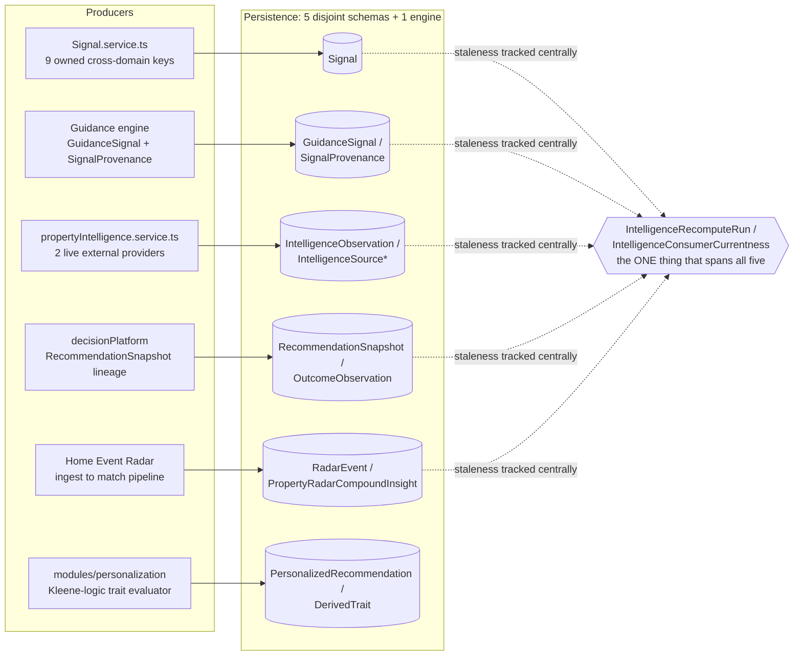
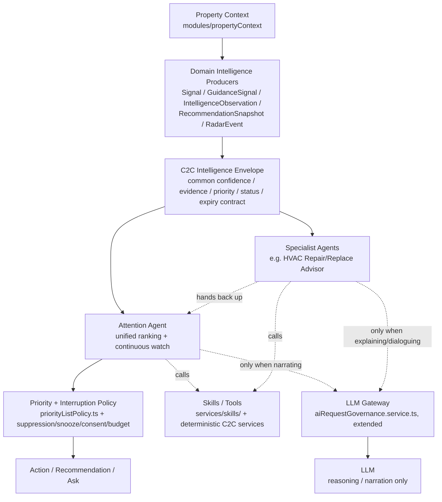

# ContractToCozy Agentic Readiness Audit

**Date:** 2026-08-25
**Scope:** Codebase-wide architecture and intelligence-readiness audit, run in two stages — (1) map and evaluate the current system, (2) assess its readiness for a future agentic AI architecture. No complete or final target architecture is designed here; the audit identifies constraints, candidate patterns, and prerequisite capabilities for that later design work (see [§12](#12-inputs-required-for-stage-3--c2c-intelligence--agentic-evolution-architecture)).
**Method:** Six research passes ran in parallel, each grounded in a pre-built knowledge graph of the repository (3,982 files, 42,104 nodes, 83,374 edges) and then verified line-by-line against source: frontend + Ask/chatbot + skill platform; backend core + domain services + rules engines; database schema + intelligence persistence + personalization; workers + cron + events + notifications; LLM usage + observability + external integrations; decision platform + shared context + the Radar ecosystem. Every finding below traces to a real file, model, or commit — documentation was deliberately not trusted at face value.
**Related:** [`CONTRACTTOCOZY_INTELLIGENCE_READINESS_AUDIT.md`](./CONTRACTTOCOZY_INTELLIGENCE_READINESS_AUDIT.md) (2026-08-22/23) scores the *current, shipped* homeowner-facing intelligence experience (48/100, "Intelligence Readiness"). This audit asks a narrower, forward-looking question — how ready is the underlying architecture for an *agentic* layer — and scores accordingly (~56/100, editorial — see [§5](#5-agentic-readiness-score) for the methodology caveat — "Agentic Readiness"). The two overlap in evidence but answer different questions; neither supersedes the other.

**Revisions (2026-08-25, after external review):** Three refinements accepted and folded into the sections below, each softening or sharpening a recommendation rather than overturning a finding — the underlying evidence is unchanged. (1) The event-bus gap ([§6](#6-gap-analysis), [§9](#9-recommended-foundation-before-agents)) is downgraded from an absolute prerequisite to a conditional one: prove the existing BullMQ/`DomainEvent` infrastructure can't meet real latency/reliability needs before building new event plumbing — nothing in the codebase's actual domains (weather alerts, refinance opportunities, maintenance) needs sub-minute reaction time. (2) The insight-unification recommendation ([§4](#4-component-classification-matrix), [§9](#9-recommended-foundation-before-agents)) is reframed from eventual schema consolidation to a **C2C Intelligence Envelope** — a common read-side contract (type · subject · source · confidence · severity · priority · evidence · freshness · expiry · status · provenance) that the five existing stores expose through, keeping their specialized persistence underneath. (3) The candidate-first-agents list ([§10](#10-candidate-first-agents)) is reordered: a **Home Intelligence Watcher / Attention Agent** — the unified priority-ranking engine already flagged Critical in [§6](#6-gap-analysis), specified today as a deterministic watcher service (a genuinely adaptive coordinator on top of it is optional future work, not yet specified — see [§10](#10-candidate-first-agents)'s honest-gap note) with an LLM added only for "why this, why now" narration — now leads, because it proves C2C's Job 1 ("tell me what needs my attention") rather than assisting a decision the homeowner already initiated. HVAC Repair/Replace Advisor becomes its first specialist consumer rather than the standalone first build. Stage 3 is retitled accordingly: **C2C Intelligence & Agentic Evolution Architecture**, not "Agent Architecture" — the missing piece this audit found is convergence and coordination, not agents per se.

**Second round (2026-08-25):** Added [§9.1](#91-the-execution-rule-context-first-deterministic-first-llm-as-escalation), an explicit rule requiring every future agent to exhaust internal C2C context, deterministic services, rules, and existing intelligence (a 4-level escalation ladder) before invoking an LLM — generalizing the discipline already visible in Ask into a rule Stage 3 must design against by default, rather than leaving it implicit.

**At a glance**

| | |
|---|---|
| Prisma models | 506 |
| Backend service files | 632 |
| Routes / Controllers | 127 / 106 |
| Worker jobs | 69 |
| Live LLM usage | 18 governed route IDs / 25 invocation sites (single provider: Gemini) |
| Parallel intelligence subsystems found | 5 |
| Overall agentic readiness score | **~56 / 100** (editorial synthesis — "Moderate, uneven readiness"; see [§5](#5-agentic-readiness-score)) |

---

## Table of Contents

1. [Current Architecture Map](#1-current-architecture-map)
2. [Current Intelligence Map](#2-current-intelligence-map)
3. [Existing Agentic Building Blocks](#3-existing-agentic-building-blocks) (incl. [3.2 What this audit means by "agent"](#32-what-this-audit-means-by-agent))
4. [Component Classification Matrix](#4-component-classification-matrix)
5. [Agentic Readiness Score](#5-agentic-readiness-score)
6. [Gap Analysis](#6-gap-analysis)
7. [Architectural Risks](#7-architectural-risks)
8. [Reuse Assessment](#8-reuse-assessment)
9. [Recommended Foundation Before Agents](#9-recommended-foundation-before-agents) (incl. [9.2 Autonomy levels and the consequential-action boundary](#92-autonomy-levels-and-the-consequential-action-boundary))
10. [Candidate First Agents](#10-candidate-first-agents)
11. [Final Conclusion](#11-final-conclusion)
12. [Inputs Required for Stage 3 — C2C Intelligence & Agentic Evolution Architecture](#12-inputs-required-for-stage-3--c2c-intelligence--agentic-evolution-architecture)
13. [Evidence & Confidence Appendix](#13-evidence--confidence-appendix)

---

## 1. Current Architecture Map

C2C is a four-tier monorepo: a Next.js frontend that is almost entirely a thin presentation layer, an Express backend carrying essentially all business logic across 600+ service files, a workers app that runs BullMQ queues and node-cron jobs against the same Postgres/Prisma schema, and a single-provider Gemini integration wrapped in a real (if partial) governance layer. The layering is mostly clean but not absolute — roughly 15% of controllers (`incidents`, `user`, `permitTracker`, and one-off reads in `property`/`inventory`/`provider`/`riskAssessment`/`homeDigitalTwin`) call Prisma directly instead of going through a service.

### 1.1 Frontend

Next.js App Router (`apps/frontend/src/app`), React Query for essentially all state — `src/store/` is an empty, dead directory despite being documented as holding client state, and `src/adapters/` is completely empty despite a claimed `orchestration.adapter.ts`. Both are stale-doc flags, not real infrastructure. The API client (`lib/api/client.ts`, 6,500+ lines) and ~30 domain API wrapper files are pure typed pass-throughs; the "policy" files inside `src/features/` (e.g. `capabilityQueryPolicy.ts`) are presentation-eligibility logic, not ranking or reasoning. **No client-side intelligence exists** — every score, rank, and recommendation the frontend renders was computed backend-side.

### 1.2 Backend core

Express, with Sentry/OpenTelemetry init, helmet, CORS, and a 756-line `index.ts` that mounts ~150 route modules directly — no central router registry. Domain services are organized in three coexisting styles: a large flat `services/*.service.ts` layer, ~35 purpose-built subfolders (`coverage/`, `decisionPlatform/`, `intelligence/`, `ownershipCosts/`…), and a newer `modules/*` convention (own controller/service/routes/contract per module — `modules/propertyContext`, `modules/homeEventRadar`, `modules/personalization`) that more complex features are migrating toward. This is a live, unfinished transition, not a settled pattern.

### 1.3 Background & scheduling

This is the single most mature layer in the codebase. Real BullMQ + Redis queues (property-intelligence, email/push/sms notification, plus durable radar-ingest and radar-match queues), scheduled by `node-cron` against a declarative `workerJobRegistry.ts` (66 entries) that **fails startup in production** if registry entries and handlers drift apart. A CAS-based distributed lease (`CronJobLock` Prisma model, consumed by `cronExecutionCoordinator.ts`) keeps the 2 k8s worker replicas from double-firing the same tick. Every job reports a structured `WorkerRunResult` (examined/created/updated/skipped/failed), feeding Prometheus metrics and an admin dashboard.

### 1.4 Database

506 Prisma models. Not a generic schema — it is deeply feature-specific, with entire model families dedicated to single domains (buyer journey: ~30 models; renovation: ~25; property tax: ~20; personalization: ~15). The intelligence-relevant slice of this schema is the subject of Section 2.

### 1.5 AI / LLM surface

Exactly one provider — Google Gemini via `@google/genai` — called through 18 distinct governed route IDs, but 25 actual `executeGovernedAIRequest(...)` invocation sites (some routes have more than one call site), all routed through `aiRequestGovernance.service.ts` (route allow-list, per-route rate limiting, circuit breaker, retry-with-backoff, Prometheus cost tracking). 23 of those 25 sites request structured JSON output; 2 are deliberately free-text: the Ask chat conversational reply (`gemini.service.ts`'s `sendMessage`, on the `ai:ask` route) and document full-text transcription (`documentIntelligence.service.ts`'s `extractFullText`, on the `ai:document-intelligence` route) — both routes also have a separate, structured call site, so the free-text exception is per-invocation, not per-route. Governance itself doesn't independently verify which mode a call is in — it trusts a caller-supplied `structuredOutputConfigured` flag rather than inspecting the actual request config, so this is a policy convention enforced by code review, not a runtime guarantee. No OpenAI, no Anthropic, anywhere in the repo. One dead code path was found: `propertyAppreciation.service.ts` calls an undefined global `google.search(...)` — a leftover from what looks like an agentic dev sandbox — which throws and is silently caught; the AI valuation call still runs afterward on the FHFA baseline and general market knowledge, so the concrete loss is the intended local-market search enrichment, not the feature as a whole. Full detail in Section 4.

---

## 2. Current Intelligence Map

The central question of this audit is whether C2C has one insight store or many. The honest answer: **there are five real, independently-populated intelligence subsystems**, plus a sixth personalization/recommendation engine, plus at least four independent risk-scoring computations — none vestigial, all with live writers and real callers, none sharing a schema.

Each subsystem individually looks like a working insight store for its own domain — `GuidanceSignal` alone carries confidence, severity, dedup keys, evidence, and expiry. What's missing is not the concept, it's the convergence: five conventions for the same idea, unified only by a freshness ledger that tracks staleness generically without unifying the shape underneath it.

### 2.1 The five intelligence subsystems

| Subsystem | Core models | Real writer | Character |
|---|---|---|---|
| Signal bus | `Signal` | `services/signal.service.ts` (1,825 lines) | Narrow (9 hardcoded keys), but genuinely cross-domain — 16+ services publish/consume it, versioned upsert with 5-factor confidence blend. |
| Guidance | `GuidanceSignal`, `SignalProvenance`, `SignalAttribution` | Guidance journey engine | Richest single record: intent family, severity score, confidence (Decimal 5,4), dedup key, expiry, missing-context flags. |
| Property Intelligence | `IntelligenceObservation`, `IntelligenceSource(Coverage/Run)` | `propertyIntelligence/propertyIntelligence.service.ts` | Real external-ingestion pipeline (revision chains, content-hash dedup) — but only 2 live providers (USGS hazard, NYC ZAP) feed it today. |
| Decision Platform | `RecommendationSnapshot`, `OutcomeObservation`, `CalibrationRelease` | `decisionPlatform/decisionThreadService.ts` | Most governance-mature: immutable lineage, supersession chains, content-addressed idempotency, multi-role calibration approval — scoped to one estimate family (HVAC) today. |
| Home Event Radar | `RadarEvent`, `PropertyRadarCompoundInsight`, `PropertyRadarAction` | `modules/homeEventRadar/services/*` | Compound-insight correlation across matched events, its own source-health circuit breaker — parallel to, not shared with, Property Intelligence's. |

### 2.2 A sixth, cleanly-separate engine: personalization

`modules/personalization/domain/evaluator.ts` runs a genuinely different mechanism — three-valued (Kleene) logic over a typed `RuleNode` AST, where "unknown" is coded to never count as eligible. It derives `DerivedTrait` rows from property facts, evaluates `RecommendationDefinition` rules against them, and writes idempotent `PersonalizedRecommendation` rows with structured `RecommendationExplanation`. It has its own incident/governance trail (`RecommendationIncident`, `RecommendationGovernanceReview`) independent of Decision Platform's. Well-built; simply the sixth wheel, not a seventh problem.

### 2.3 Isolated intelligence: risk & scoring

At least four independent computation paths produce a "how healthy/risky is this property" verdict, and none of them talk to each other:

- **RiskAssessment.service.ts** — deterministic, `riskCalculator.util.ts` + `risk-constants.ts`.
- **climateRiskPredictor.service.ts** — calls Gemini directly, shares nothing with the above.
- **homeScoreReport.service.ts** / **propertyScoreSnapshot.service.ts** — the one point of reuse: composes `RiskAssessmentService` for its `RISK` score type.
- **valueIntelligence.service.ts** / **appreciationIndex.service.ts** — own model, own caching, imports none of the above.

### 2.4 The Radar naming collision

"Radar" is a UX brand, not an architecture. `refinanceRadar/`, `modules/homeEventRadar/`, and `servicePriceRadar.*` are three fully independent pipelines — separate Prisma models, separate matchers, separate admin surfaces — that happen to share a name and a conceptual shape (external signal → property match → insight → user action). `services/intelligence/sourceRegistry.ts`, the file most likely to be a shared adapter registry, turns out to be a static declarative catalog for governance/observability, not a runtime dispatcher.

### 2.5 Duplication the code itself already admits to

> **Acknowledged in source, not inferred.** `decisionThreadService.ts` lines 209–226: the HVAC repair/replace verdict computed there and the one computed by `homeActionSourcePromotion.service.ts`'s separate lifespan engine **"can and do disagree"** — the code's own comment. Divergence is surfaced to users via a `SOURCE_CARD_VERDICT_DIVERGENCE` limitation code rather than resolved. This is the clearest single piece of evidence in the whole audit that convergent-naming/divergent-implementation is a live product risk today, not a hypothetical one an agentic layer might introduce.

---

## 3. Existing Agentic Building Blocks

Pieces already in the codebase that resemble what an agentic architecture needs — graded by how close each is to reusable as-is.

| Building block | What it is |
|---|---|
| **Shared context** — `modules/propertyContext` | A genuinely single, well-reused "everything we know about this property" assembler. Authorizes access, runs ~20 typed fact scopes in parallel, marks each fact KNOWN / UNKNOWN / STALE / CONFLICTED, computes a version hash. **27+ external call sites.** The strongest single agentic-readiness asset found in the whole audit. |
| **Orchestration primitive** — `decisionPlatform` | A real DecisionThread state machine (two independent, exhaustively-transition-tested lifecycles), an immutable RecommendationSnapshot lineage with change classification, and a formal `DecisionFamilyAdapter` registry. Depth is real in exactly one of 7 registered families (HVAC); the other 6 are thin snapshot wrappers. |
| **Tool registry seed** — `services/skills/` | 19 skills, each with a formal `SkillDefinition`: risk policy (effects, materiality, reversibility), authorization floor, a *context budget* (max facts/entities/documents/latency — a real resource governor), an evaluation suite, and a declared kill-switch. Structurally the closest existing analog to an agent-tool manifest. Each manifest's kill-switch is read and enforced at runtime by `askOperationalControls.ts`'s `skillEnabled()` — confirmed live, not dormant. |
| **LLM gateway seed** — `aiRequestGovernance.service.ts` | Every one of the 25 governed call sites (across 18 route IDs) routes through it. Real allow-list, per-route rate limiting, circuit breaker, retry/backoff, and Prometheus cost tracking in USD. Missing: provider abstraction (Gemini only), distributed rate-limit state, response caching, safety/content filtering. |
| **Background execution** — BullMQ + node-cron + `workerJobRegistry.ts` + `CronJobLock` | Durable queues, declarative job registry with startup parity enforcement, distributed cron leasing across replicas, structured per-run outcomes. Directly reusable as the scheduling substrate for autonomous agent ticks. |
| **Notification policy layer** — `priorityListPolicy.ts` + eligibility/suppression/snooze/kill-switch stack | A coherent, independently-testable "should this reach the user right now" gate, safety-floor-aware, budget-aware. Exactly the shape a future orchestrator needs for deciding when an agent's output should interrupt someone. |
| **Event handling (partial)** — `DomainEvent` + `processDomainEvents.job.ts` | A real CAS-claim poll queue (30s tick, exponential backoff, dead-letter after 8 attempts) with genuine consumers (refinance alerts, radar reconciliation, intelligence recompute). Not a push-based event bus — even the durable BullMQ radar pipeline degrades to a 10s poller at its final notification handoff. |
| **Ops console** — Admin platform | `adminWorkerJobs.service.ts` (live queue stats, manual triggers, dry-run), `adminIntelligenceRecompute.service.ts`, `releaseGate.service.ts` (KPI-gated cohort rollout for capabilities). Already shaped to double as an agent-rollout console with modest extension. |

### 3.1 The Ask orchestrator — a proto-orchestrator with almost no LLM in it

The 9,606-line `askOrchestrator.service.ts` and its ~35 supporting files (`askSemanticRouter.ts`, `askOperationRegistry.ts`, `askAnswerTrustPolicy.ts`…) form a mature, deterministic NLU pipeline: a hand-rolled local embedding (feature-hashed, not ML), lexical + trigram + synonym similarity blended into a calibrated confidence score, routed through a 5-stage cascade (`SAFETY → DETERMINISTIC → LOCAL_CLASSIFIER → CLARIFICATION → REMOTE_FALLBACK`). **The `REMOTE_FALLBACK` stage name exists but is not wired to any LLM call** — grep confirms zero connection to Gemini. The one real LLM touchpoint in the entire Ask subsystem is `askResultSynthesis.service.ts`, which rephrases already-computed, whitelisted JSON into prose under a strict system prompt and a post-hoc numeric-hallucination guard that throws if the model invents a number not present in its input. This is disciplined LLM use — for phrasing, not reasoning — and is the template worth preserving, not loosening, as agents are added.

### 3.2 What this audit means by "agent"

*Added after a third external review: earlier drafts of this audit sometimes used background/scheduled execution as a proxy for agenthood, which conflates two independent properties.*

An "agent" here is defined by **adaptive goal pursuit under bounded, governed autonomy** — it selects among multiple tools or actions to pursue a goal against state that isn't fully known upfront, and its state transitions are logged, budgeted, and revocable — not by whether it runs on a schedule, runs continuously, or executes in the background. A cron job that recomputes the same deterministic formula every tick is a **service**, no matter how often it fires; `workerJobRegistry.ts`'s 66 entries are overwhelmingly this kind of service, and nothing about their scheduling makes them agentic. This matters for [Section 10](#10-candidate-first-agents): several candidates there are agentic only in a specific judgment or hand-off step, while the computation surrounding that step remains — and should remain — a deterministic service. See §9.2 for how much autonomy each candidate is actually being asked to hold.

---

## 4. Component Classification Matrix

30 components, selected for evidence density rather than exhaustive coverage, classified against what they should become on the path to an agentic architecture.

**Legend:** `KEEP` = Keep as-is · `REFACTOR` = Refactor · `SHARED` = Shared platform capability · `TOOL` = Agent tool / capability · `ORCH` = Orchestrator capability · `GATEWAY` = LLM gateway capability · `AGENT` = Potential agent · `REPLACE` = Replace · `RETIRE` = Retire

| Component | Current responsibility | Class | Future role | Required change | Priority |
|---|---|---|---|---|---|
| `modules/propertyContext` | Assembles typed, versioned property facts across ~20 scopes; 27+ callers. | **SHARED** | Canonical Shared Home Context agents request scoped facts from. | Add a stable, versioned agent-facing read contract. | Critical |
| 5 Context wrappers (financial / projectCompliance / aggregation / planning / protection) | Feature-scoped views over propertyContext, each with its own `reconciliation.ts` staleness check. | **REFACTOR** | Same feature-scoped views, one shared staleness utility. | Extract the 3 near-identical reconciliation.ts files into one. | Important |
| `decisionPlatform` (DecisionThread) | Structured decision lifecycle, immutable lineage, commitment gating. | **ORCH** | Substrate for agent-driven, multi-step decision workflows. | Extend real composition beyond HVAC; wire dormant `homeIntelligenceGraph.ts`. | Critical |
| `decisionFamilyAdapterRegistry` | Registers 7 decision families; only HVAC does real context composition. | **REFACTOR** | All 7 families composing, or explicitly documented as thin by design. | Bring 6 snapshot-wrapper families to real composition, or scope down. | Important |
| `signal.service.ts` (Signal bus) | Cross-domain scored, versioned signal publication; 9 owned keys, 16+ callers. | **SHARED** | Reusable signal-bus pattern — the one genuine cross-domain success story. | Extend the key-ownership model past 9 hardcoded keys. | Important |
| `GuidanceSignal` / `SignalProvenance` | Richest single intelligence record: confidence, severity, dedup, expiry, evidence. | **SHARED** | Best reference shape for the C2C Intelligence Envelope's field set. | Expose through the shared envelope contract — not a physical merge with the other 4 stores. | Critical |
| `IntelligenceObservation` / `IntelligenceSource*` | External-data ingestion pipeline with governance; 2 live providers. | **SHARED** | The path agents subscribe to for external-signal awareness. | Onboard more providers behind the existing governance shape. | Important |
| `RecommendationSnapshot` / `OutcomeObservation` / `CalibrationRelease` | Immutable recommendation lineage, outcome attribution, governed calibration release. | **ORCH** | Foundation for confidence-calibrated agent recommendations. | Close the loop — outcomes are captured but not yet fed back into calibration (Phase 10B unbuilt). | Critical |
| Home Event Radar pipeline | BullMQ ingest → match, 10s poll to notification. | **AGENT** | Execution substrate for a background environmental-signal watcher agent. | Extract a generic adapter contract shared with the other two radars. | Important |
| `refinanceRadar` / `servicePriceRadar` | Independent bespoke pipelines, same conceptual shape as Home Event Radar. | **REFACTOR** | Converge onto one generic external-signal → match → insight engine. | High-effort consolidation; no shared adapter exists today. | Important |
| `compoundRuleRegistry.ts` | Declarative metadata registry of Home Action promotion rules (not itself executable). | **SHARED** | Pattern for declaring agent-eligible rules as governed metadata. | Extend coverage past Home Action promotion. | Optional |
| `hvacRepairReplaceEngine.service.ts` | Weighted scoring, DB-calibratable weights, governed release process. | **TOOL** | Textbook deterministic tool an agent calls — not a component to rebuild. | None beyond a thin agent-facing wrapper. | Critical (exemplar) |
| Competing HVAC verdicts (decisionThread vs. homeActionSourcePromotion) | Two engines that "can and do disagree" — acknowledged in source. | **REFACTOR** | One authoritative verdict, or an explicit, ranked precedence. | Reconcile before any agent reasons over "the" HVAC answer. | Critical |
| 3 independent priority-ranking engines | `radarPriority.ts`, `guidancePriority.service.ts`, `homeActions.service.ts`'s ranker — each its own weighted formula. | **REFACTOR** | One ranking service the orchestrator calls, domain-parameterized. | Consolidate; `priorityListPolicy.ts` currently wraps, not unifies, them. | Critical |
| `priorityListPolicy.ts` + eligibility/suppression/snooze/kill-switch stack | Deterministic notify/suppress/consent/budget policy layer. | **ORCH** | Reusable "should the agent interrupt this user" gate. | None — reuse directly. | Critical |
| Ask orchestrator + `askSemanticRouter` + `askOperationRegistry` | Deterministic hand-rolled NLU intent router; zero LLM in the routing path. | **TOOL** | Fast, cheap, safety-gated first pass in front of a real LLM fallback. | Wire the unwired `REMOTE_FALLBACK` stage to an actual model. | Important |
| `askResultSynthesis.service.ts` | LLM rephrases verified structured facts into prose, with a hallucination guard. | **KEEP** | The template for every future "LLM writes prose from verified data" call. | None. | Critical (exemplar) |
| Ask "Skills" registry (`services/skills/`) | 19 skills, versioned, risk-classified, context-budgeted, evaluation-linked; each manifest's `featureFlag`/`killSwitch` pair is read at runtime by `askOperationalControls.ts`'s `skillEnabled()` and enforced in the orchestrator's hierarchical skill routing — confirmed live, not dormant. | **TOOL** | The strongest existing analog to a formal agent-tool manifest. | None for activation wiring. Remaining gap is tagging each skill/operation with an autonomy level (§9.2) before any of them gain execute-not-just-recommend capability. | Important |
| Tool Discovery capability catalog | Recommends existing app features to users; has real, drill-tested kill-switches. | **SHARED** | Governance pattern to copy into the Skills registry above. | Reuse its drill/monitoring pattern (how kill-switch trips get exercised and observed) — not its activation wiring, since the Skills registry's own kill-switches are already wired and enforced at runtime. | Optional |
| `aiRequestGovernance.service.ts` | Route allow-list, rate limits, circuit breaker, retries, USD cost metrics — Gemini only. | **GATEWAY** | The literal seed of a centralized Intelligence / LLM Gateway. | Harden the interface itself first — distributed rate-limit state, safety filtering, caching, and independent (not caller-asserted) verification of structured-vs-free-text mode. A second provider is a separate, conditional item — see §9 item 4. | Critical (interface) / Optional (second provider) |
| `gemini.service.ts` | Single-provider client; 25 invocation sites across 18 governed routes (23 structured JSON, 2 free-text — Ask chat and document transcription; `ai:ask` and `ai:document-intelligence` each have both). | **REFACTOR** | Calls routed through the Gateway instead of the SDK directly. | Medium — mechanical once the Gateway exists. | Critical |
| `propertyAppreciation.service.ts` — `google.search()` | Calls an undefined global; throws; silently caught. The AI valuation call still runs afterward on the FHFA baseline and general market knowledge — the concrete loss is the intended local-market search enrichment, not the whole feature. | **REPLACE** | Wire a real search tool via the future Gateway, or delete the dead path. | Low effort — this is a live bug, not architecture debt. | Optional (bug; narrow blast radius) |
| BullMQ + node-cron + `workerJobRegistry` + `CronJobLock` | Durable scheduling, registry/handler parity checks, distributed lease. | **SHARED** | Direct substrate for scheduling autonomous agent background ticks. | None structurally; add agent-specific job types. | Critical |
| `DomainEvent` + poller | 30s CAS-claim poll table with real consumers, not just an audit log. | **SHARED** (seed) | Event-backbone candidate — needs a push mechanism for tight agent triggering. | Add a real event bus (Redis Streams / BullMQ events) alongside or instead of polling. | Important |
| Admin ops surface (worker jobs, recompute, release gate) | Live job health, recompute triggers, capability cohort/KPI gating. | **SHARED** | Ready-shaped console for agent rollout and health monitoring. | Extend to surface agent-specific run health. | Important |
| pino/Loki logging + `AuditLog` | Consistent structured logging; queryable audit trail with signature hashes. | **KEEP** | Reused directly for agent action audit trails. | None. | Important |
| Frontend API client | Thin typed REST wrapper; ~0 business logic client-side. | **KEEP** | Agent outputs surface through the same existing contract. | None. | Optional |
| Bespoke external adapters (weather, AQI, recalls, places, mortgage rates) | 6+ hardcoded one-off `fetch()` integrations, no shared retry/circuit-breaker. | **REFACTOR** | One external-data-provider interface, parallel to `aiRequestGovernance`. | Medium-to-high effort; no shared abstraction exists today. | Important |
| Permit / Tax Socrata+Accela adapters | Real multi-provider adapter abstraction — 2 of ~10 external integrations. | **KEEP** | The template to extend to the other bespoke integrations above. | None — this is the pattern to copy, not to change. | Optional |
| `homeIntelligenceGraph.ts` | Typed read wrapper over 4 hardcoded edge types; its own header says it is not wired into any call site. | **AGENT** (dormant) | Candidate backbone for a property knowledge-graph tool, once justified. | Wire into real call sites, or retire the abstraction. | Optional |

---

## 5. Agentic Readiness Score

Each dimension scored 0–100 against what was actually found in code, not against documentation or intent.

### Overall: ~56 / 100 (editorial) — Moderate, uneven readiness

A real, uneven foundation. Strongest where engineering discipline is oldest (background processing); weakest where five teams independently solved the same problem (intelligence reuse).

**Read this as an editorial synthesis grounded in code evidence, not a statistically independent measurement.** Each dimension below was scored against the same rough anchors — 0 = absent, 25 = a dormant or prototype-only implementation, 50 = present but partial/inconsistent, 75 = solid with named gaps, 100 = production-grade and unified — applied by the auditor's judgment against the evidence cited, not against a scripted checklist. The ten dimensions also aren't independent: **Intelligence reuse**, **Insight persistence**, **Orchestration readiness**, and **Extensibility** all substantially measure the same underlying fact (five parallel intelligence subsystems, three ranking engines, three Radar pipelines), so an unweighted average of all ten likely double-counts that one root cause more than it should. Treat 56 as a defensible order-of-magnitude read, not a precise composite — and before using it to gate a go/no-go decision, Stage 3 should replace the unweighted average with explicit weights tied to whichever [autonomy level](#92-autonomy-levels-and-the-consequential-action-boundary) is actually being targeted (e.g. Event readiness and Orchestration readiness matter far more once execute-tier agents are in scope than they do for observe/recommend-tier ones).

| Dimension | Score | Why |
|---|---:|---|
| Background processing | **78** | BullMQ + node-cron + declarative job registry with startup parity enforcement + distributed `CronJobLock` leasing + structured per-run outcomes + Prometheus metrics. The most mature layer in the codebase. |
| Shared context | **72** | `modules/propertyContext` is genuinely single-sourced, versioned, freshness-annotated, and reused by 27+ callers — the strongest agent-readiness asset found. |
| Observability | **68** | Consistent structured pino/Loki logging (post the earlier stdout-blind-spot fix), Prometheus metrics in the AI and worker layers, a real audit trail. Gap: no distributed tracing across the DomainEvent → job → service chain. |
| Domain separation | **60** | Services are well-named and mostly single-responsibility, but ~15% of controllers reach into Prisma directly, and the flat-services-vs-modules pattern is mid-migration, not settled. |
| Extensibility | **58** | Strong conventions everywhere (contracts, registries, kill-switches, governance reviews) make adding an N+1th instance of a pattern easy — the same strength is why unifying the existing N instances is hard. |
| LLM abstraction | **55** | `aiRequestGovernance.service.ts` covers all 25 invocation sites across 18 governed route IDs with rate limits, circuit breakers, and cost tracking — real, but single-provider, no caching, no distributed state, no safety filtering. |
| Orchestration readiness | **50** | `decisionPlatform` provides real thread lifecycle, lineage, and commitment gating — but only 1 of 7 registered decision families does real composition, and 3 competing ranking engines remain unmerged. |
| Insight persistence | **45** | Confidence, evidence, severity, and expiry fields all exist — richly, in places — but across five non-interoperable schemas with no common shape an agent could query generically. |
| Event readiness | **40** | Real consumers exist for `DomainEvent` and `RadarEvent`, but both are poll-based (30s / 10s ticks), not push. Three Radar pipelines don't even share an event contract with each other. |
| Intelligence reuse | **35** | Five parallel insight subsystems, a sixth personalization engine, four independent risk-scoring paths, three independent priority rankers, three independent Radar pipelines. The lowest score in the audit, and the one that matters most. |

---

## 6. Gap Analysis

| Status | Capability |
|---|---|
| ✅ Available | Background job scheduling & distributed locking (BullMQ + node-cron + `CronJobLock`) |
| ✅ Available | Shared home/property context primitive (`modules/propertyContext`) |
| ✅ Available | Structured logging + audit trail (pino/Loki + `AuditLog`) |
| ✅ Available | AI governance seed (`aiRequestGovernance.service.ts`) |
| ✅ Available | Decision lineage + commitment gating (`decisionPlatform`) |
| ✅ Available | Admin ops visibility (job health, capability grants, recompute triggers) |
| ✅ Available | Skill manifest contract (`services/skills/`) — versioned, risk-classified, with feature-flag/kill-switch pairs read and enforced at runtime |
| 🔴 Critical | A **C2C Intelligence Envelope** — a common read-side contract (confidence/evidence/priority/status/expiry/provenance) the 5 parallel intelligence stores expose through. *Revised: not a physical schema merge — see the 2026-08-25 revision note above.* |
| 🔴 Critical | LLM Gateway *interface* hardening — distributed rate-limit state, safety filtering, caching, independent structured-vs-free-text verification (today it trusts a caller-supplied flag) |
| 🔴 Critical | Unified priority-ranking service (3 competing implementations, wrapped not merged) — this is also the deterministic core the proposed Attention Agent needs |
| 🔴 Critical | Resolution of the two disagreeing HVAC decision engines — a live data-quality bug, not just a gap |
| 🔴 Critical | An explicit autonomy-level model and consequential-action boundary (§9.2) — nothing in the code today distinguishes an agent that recommends from one permitted to execute |
| 🟡 Important | Real event bus / pub-sub — *revised to conditional*: only build this if the existing BullMQ/`DomainEvent` poll infrastructure (10–30s latency) is shown not to meet a real domain's latency or reliability need; nothing found in this audit currently requires it |
| 🟡 Important | Generalized external-data-adapter interface (only permits/tax have one, of ~10 integrations) |
| 🟡 Important | Radar pipeline convergence (3 independent implementations of the same conceptual pipeline) — conditional on scale, since §10's External Signal Watcher candidate can scope to Home Event Radar alone first |
| 🟡 Important | Distributed tracing / OpenTelemetry across the async chain |
| 🟡 Important | Closing the calibration learning loop (outcomes are captured; calibration doesn't read them yet — Phase 10B unbuilt per code comment) |
| ⚪ Optional | `homeIntelligenceGraph.ts` activation — currently zero call sites |
| ⚪ Optional | Frontend `NEXT_PUBLIC_GEMINI_API_KEY` cleanup — unused, stale, never actually read by any browser code path |
| ⚪ Optional | Fix or delete the broken `google.search()` call in `propertyAppreciation.service.ts` — narrow blast radius, not a blocker |
| ⚪ Optional | A second LLM provider — no measured reliability, cost, or capability gap in this audit currently requires one; add only once one is found |

---

## 7. Architectural Risks

**Live today, not hypothetical**

- **Duplicated business logic.** Three ranking engines, three Radar pipelines, two disagreeing HVAC verdicts, eleven `*Reconciliation.service.ts` files with divergent (not shared) algorithms. This pattern is already the codebase's default failure mode — agents will reproduce it faster unless something gates new duplication.
- **Conflicting recommendations.** `SOURCE_CARD_VERDICT_DIVERGENCE` is a real, named, currently-shipping limitation code — the product already surfaces contradictory answers to users. More autonomous producers without a unification step will make this worse, not new.

**Real but partially mitigated**

- **Uncontrolled background execution.** Well-governed today (`CronJobLock`, registry parity checks, per-route kill-switches). The right move is extending this governance to agent ticks, not inventing a parallel control system.
- **Cost explosion.** `aiRequestGovernance` already tracks per-route USD cost. Extend to per-agent cost attribution before scaling agent count — the meter exists, it just isn't itemized that way yet.

**Emerging, visible in miniature**

- **Circular / coordinated dependencies.** No agents exist yet, but `homeActionDecisionLineage.ts`'s prefix-routing table and `homeActionProducerOwnership.ts`'s analogous table are already two parallel classification systems kept manually in sync for one feed. That's the coordination tax multiple agents will pay, in preview.

**Currently a strength**

- **Confidence/evidence tracking.** Not a gap — `GuidanceSignal` and `RecommendationSnapshot` already carry confidence, severity, and evidence as first-class fields. The actual task is unifying five good implementations, not inventing the concept.
- **Stale intelligence.** `IntelligenceConsumerCurrentness` already tracks staleness generically across subsystems. Reuse it rather than rebuilding a freshness ledger per agent.

**Watch, not yet present**

- **Agent proliferation & excessive LLM dependence.** Current LLM usage is disciplined — 18 governed routes (25 invocation sites), structured output by default with two narrowly registered free-text exceptions, one provider, one verified-summarization pattern reused deliberately. The risk is real only if agent expansion abandons that discipline; nothing in the code today suggests it will on its own.

**Gap, not yet mitigated**

- **Insufficient observability for orchestration.** Logging, metrics, and audit trail are solid individually, but there is no trace-level visibility across a full `DomainEvent → job → service` chain. An orchestrator coordinating multiple agents will need to debug decisions across exactly that chain — this needs to exist before, not after, agent count grows past one or two.

---

## 8. Reuse Assessment

An editorial reading of what the [30-row component classification matrix](#4-component-classification-matrix) — selected for evidence density, not random or exhaustive sampling — implies about the rest of the codebase. **These are qualitative bands, not a measured share of files, services, lines, or engineering effort;** there is no inventory or effort-estimation methodology behind them, and they should not be read as a budget input. Use them to gauge relative weight, not to size work.

| Band | Category | What's in it |
|---|---|---|
| **Large** | Remains unchanged | Frontend presentation layer, background scheduling substrate, permit/tax adapters, logging/audit, Ask trust/audience policy layer, notification policy stack. |
| **Moderate** | Refactored | Radar-triad convergence, ranking-engine unification, context-wrapper dedup, controller/service boundary cleanup, external-adapter generalization. |
| **Small** | Becomes shared intelligence infrastructure | The 5 intelligence schemas exposed through one C2C Intelligence Envelope via a thin adapter per store — not merged into a single physical table (see §9 item 1); `propertyContext` formalized as an agent-facing API; `aiRequestGovernance` hardened into a full Gateway interface. |
| **Small** | New development | Orchestrator-level agent coordination, an explicit autonomy-level/consequential-action model (§9.2), safety/content filtering, agent-specific admin surfaces, plus event-infrastructure enhancements *only if* validation shows the existing BullMQ/DomainEvent poll cadence is insufficient. |
| **Minimal** | Retired | The losing HVAC verdict engine (once reconciled), duplicate Radar code (once converged), dormant `homeIntelligenceGraph.ts` if left unwired, the broken `google.search()` path, the dead frontend `store/` and `adapters/` directories. |

---

## 9. Recommended Foundation Before Agents

The minimum architectural foundation — not the full agent ecosystem design, which is explicitly out of scope for this audit. **Not all eight items below are prerequisites for every candidate agent** — items 1, 2, and 5 are specific to the Attention Agent / HVAC specialist path ([§10](#10-candidate-first-agents) items 1–2); items 3, 4, 6, 7, and 8 are platform-wide and apply regardless of which candidate ships first. See [§12](#12-inputs-required-for-stage-3--c2c-intelligence--agentic-evolution-architecture)'s prerequisite tiers for the full breakdown by candidate.

1. **[Attention/HVAC-path-specific]** **Define a C2C Intelligence Envelope** — a common read-side contract (type · subject · source · confidence · severity · priority · evidence · freshness · expiry · status · provenance) that `Signal`, `GuidanceSignal`, `IntelligenceObservation`, `RecommendationSnapshot`, and `RadarEvent` each expose through, via a thin adapter per store. *Deliberately not* a physical schema migration — the five underlying models differ enough in real ways (e.g. `GuidanceSignal`'s decimal severity scoring vs. `RadarEvent`'s correlation shape) that forcing one table would lose fidelity. Consolidate the schemas later only if the envelope proves insufficient.
2. **[Attention/HVAC-path-specific]** **Converge the 3 priority-ranking engines into one deterministic ranking service.** This is not optional infrastructure — it is the actual computational core the [Attention Agent](#10-candidate-first-agents) needs, and today it's wrapped, not unified, by `priorityListPolicy.ts`.
3. **[Platform-wide]** **Treat the event backbone as conditional, not mandatory.** Test whether BullMQ + `DomainEvent`'s existing poll cadence (10–30s) meets every real domain's latency and reliability needs first. Only add push-based pub/sub where a specific need — most plausibly `SAFETY_EMERGENCY`-tier signals — demonstrably can't tolerate that latency.
4. **[Platform-wide]** **Harden `aiRequestGovernance.service.ts` into a real LLM Gateway interface** — distributed rate-limit state, safety/content filtering, caching, and independent (not caller-asserted) verification of structured-vs-free-text mode — before any agent is allowed to call a model directly. Treat **a second provider** as a separate, conditional item: this audit found no measured Gemini outage, cost ceiling, or capability gap showing single-provider operation blocks the narrow, narration-only LLM use the [candidate agents](#10-candidate-first-agents) propose. Add one only once a real reliability, cost, or capability requirement is measured.
5. **[Attention/HVAC-path-specific]** **Resolve the two disagreeing HVAC verdicts.** An agent must not inherit contradictions that are already baked into its own inputs.
6. **[Platform-wide]** **Extend `releaseGate.service.ts`'s cohort/KPI gating** — already proven on tool rollout — to cover agent rollout the same way, and tag every skill/operation with an autonomy level (§9.2) before any of them gain execute-not-just-recommend capability. *(The Skills registry's kill-switches are already wired at runtime — see the §4 correction — so this item is scoping and rollout gating, not activation plumbing.)*
7. **[Platform-wide]** **Give `propertyContext` a formal, versioned, agent-facing contract** rather than relying on internal service-to-service imports, so agents don't couple directly to backend internals.
8. **[Platform-wide]** **Add trace-level observability** across the `DomainEvent → job → service` chain, so an orchestrator's decisions remain debuggable as agent count grows.

### 9.1 The execution rule: context-first, deterministic-first, LLM as escalation

*Added 2026-08-25, after a second round of external review.* Everything above assumes agents pull intelligence primarily from C2C's own accumulated understanding of the home — not from asking a model what it thinks. This was implicit in the deterministic-first observations throughout this audit ([§3.1](#3-existing-agentic-building-blocks), [§4](#4-component-classification-matrix)'s `askResultSynthesis.service.ts` exemplar, Q6 of [§11](#11-final-conclusion)); it should be stated as an explicit rule Stage 3 is required to follow, not left implicit.

> **C2C agents must be context-first and deterministic-first. An LLM is an escalation capability, not the intelligence engine.** Agents must exhaust trusted C2C context, domain services, rules, tools, and existing intelligence before invoking an LLM. LLM-generated output must never become authoritative C2C state without validation and provenance.

### 9.2 Autonomy levels and the consequential-action boundary

*Added after a third external review: this audit's readiness model measured context, queues, persistence, and LLM infrastructure, but had no model at all for the risk that actually defines "agentic" — how much unsupervised action an agent is allowed to take. That gap is fixed here, not left to Stage 3 to discover on its own.*

Score and scope every candidate agent against where it sits on this ladder, not just against the ten dimensions in [Section 5](#5-agentic-readiness-score):

| Level | What the agent does | Reversibility | Example from §10 |
|---|---|---|---|
| 0 — Observe | Reads and monitors state; produces no output change a homeowner or another system sees. | N/A | A watcher's internal materiality check before it decides anything is worth surfacing. |
| 1 — Recommend | Surfaces or ranks items for a human to act on; never acts itself. | N/A (no action taken) | The Attention Agent's ranking + hand-off; the External Signal Watcher's surfacing. |
| 2 — Draft | Prepares a specific action, message, or document but does not send or commit it. | Fully — nothing has happened yet | An agent drafting a vendor message a homeowner must approve and send. |
| 3 — Execute (reversible, internal) | Performs an action inside C2C's own system that a human can undo. | High — undo path exists | Snoozing a reminder, updating a checklist item, re-running a recompute. |
| 4 — Execute (consequential or external) | Commits to something irreversible, external-facing, or materially costly. | Low or none | Submitting a claim, contacting a vendor on the homeowner's behalf, authorizing a purchase. |

**Level 4 is explicitly out of scope today**, not by omission but by existing product decision: the Ask FRD lists "an autonomous agent with permission to make material decisions or external commitments" as a non-goal, and "automatic provider, lender, insurer, or third-party data transmission without separately authorized workflows" as a separate non-goal (`docs/product/AI_HOME_CONCIERGE_ASK_REDO_FRD.md`, §6.2). The Skill Platform FRD independently requires that confirmation and authorization stay intact rather than being absorbed into the platform (`docs/product/CONTRACTTOCOZY_SKILL_PLATFORM_FRD.md`, §1). Every candidate in [Section 10](#10-candidate-first-agents) targets Level 0–2 today; none proposes Level 3 or 4.

What already exists covers Levels 0–2 reasonably well: the Skills registry's runtime-enforced kill-switches, Ask's confirmation/authorization layer, and `decisionPlatform`'s commitment gating. **The individual safety primitives Level 3+ needs are not absent from the codebase — they're not composed into one agent-runtime contract.** Concretely: `homeOperations`'s work-item transitions already require an `idempotencyKey` per mutation (`homeOperations.controller.ts`, `propertyRecord.adapter.ts`); `decisionPlatform` already treats execution and outcome recording as idempotent (`decisionThreadService.ts`'s executionId reuse, `outcomeObservationService.ts`'s `idempotencyKey` field); the Skills registry already declares both a `reversibility` field (`skill.contract.ts`) and, per adapter, an `idempotencyPolicy` (`skillAdapter.contract.ts`); `homeOperations`'s transition rules already reason explicitly about which closes are reversible; and Ask already has durable confirmation receipts (`AskConfirmationReceipt`) and per-operation authorization floors. **What's missing is not any one primitive — it's a single agent-runtime contract that composes and enforces all of them uniformly across every future agent**, plus a human-escalation hook for ambiguous or out-of-policy cases and audit-linked provenance connecting an action back to the specific context and decision that produced it. That composition is a genuine Stage 3 deliverable; the building blocks it would draw on already exist, scattered by domain rather than absent.

The default execution path, and the escalation ladder above it:

| Level | Source | What it covers | C2C precedent already in the code |
|---|---|---|---|
| **1 — Internal facts** | `modules/propertyContext`, documents, maintenance history, insurance, warranties, ownership lifecycle, personalization, already-ingested external data | Everything C2C already knows about this property and homeowner | 27+ real callers of `getPropertyContext`; `PropertyFactEvidence`'s KNOWN/UNKNOWN/STALE/CONFLICTED states |
| **2 — Internal intelligence** | Scoring/decision engines, rules, ranking, Skills, Radar, recommendations, historical outcomes | Deterministic computation over Level 1 facts | `hvacRepairReplaceEngine.service.ts`, `compoundRuleRegistry.ts`, the Signal bus, `RecommendationSnapshot` lineage |
| **3 — Agent coordination / reasoning** | Combining Level 1 + 2 outputs to decide what matters | The orchestration layer itself — still no LLM required | `decisionPlatform`'s DecisionThread lifecycle; `priorityListPolicy.ts` |
| **4 — LLM, only when necessary** | Ambiguous language understanding, complex explanation, unstructured-document reasoning, a genuinely novel question, or homeowner-friendly communication | The escalation tier — narrow, structured output by default with narrowly registered free-text exceptions validated on their own terms (see [§1.5](#15-ai--llm-surface)), provenance-tracked | `askResultSynthesis.service.ts`'s hallucination guard; `aiRequestGovernance`'s `AI_STRUCTURE_REQUIRED` enforcement; Ask's own 5-stage cascade (`SAFETY → DETERMINISTIC → LOCAL_CLASSIFIER → CLARIFICATION → REMOTE_FALLBACK`) already puts every deterministic option ahead of a model call |

This is not a new pattern to invent — it is the pattern already visible in Ask, generalized into a rule every future agent inherits by default rather than reproducing ad hoc. It is also the sharpest form of C2C's actual differentiation: the intelligence comes from the accumulated understanding of the home, and the LLM's role is to reason at the edges of that understanding and communicate it well — never to originate it.

---

## 10. Candidate First Agents

The 3–5 strongest candidates supported by what already exists — not an implementation plan, and not the full roster a mature ecosystem would eventually need. Ordered by strategic priority per the 2026-08-25 revision: the Attention Agent leads because it proves C2C's Job 1 — noticing something before the homeowner asks — rather than assisting a decision already in motion.

### 1. Home Intelligence Watcher / Attention Agent
*LLM: "why this, why now" narration only — the ranking itself stays deterministic*
**Autonomy level targeted: 0–1 (Observe → Recommend).** It watches and judges materiality, then hands off — it never acts on the homeowner's behalf.

- **Business value:** Directly answers C2C's core promise — "tell me what needs my attention" — proactively, across every domain at once, instead of per-feature.
- **Existing capabilities reused:** `homeActions.service.ts`'s ranker, `radarPriority.ts`, `guidancePriority.service.ts`, and `priorityListPolicy.ts`'s eligibility/suppression/consent/budget gate — the deterministic "what matters" computation already exists three times over.
- **Missing pieces:** This is the one candidate whose prerequisite work is itself [§9](#9-recommended-foundation-before-agents)'s foundation — the 3 ranking engines must converge into one service, and it needs the C2C Intelligence Envelope to consume `Signal`/`GuidanceSignal`/`RadarEvent`/etc. uniformly, before the agent has anything coherent to watch.
- **Why this is named an agent, with a caveat** (per the [§3.2](#32-what-this-audit-means-by-agent) definition — goal pursuit under governed autonomy, not scheduling, and *not* continuous or background execution): The unified ranker is a service, full stop — deterministic, no LLM needed for the ranking itself, and running it on a schedule doesn't change that. The candidate is *named* for what the materiality judgment across heterogeneous, changing state could become — deciding *whether* and *when* something newly crosses a threshold worth surfacing, then choosing to hand off — but as specified today, that judgment is itself a fixed policy, not adaptive; see the honest-gap note directly below for exactly what's missing to make it genuinely agentic. The LLM's only job, today and in any future version, is explaining the "why" in the same disciplined, verified-facts-only pattern as `askResultSynthesis.service.ts`.
- **Honest gap — this candidate is not yet specified as adaptive.** Threshold/materiality evaluation, deterministic ranking, and hand-off are each, individually, expressible as a deterministic policy — nothing forces genuine agency here. This audit does not specify: what goal or plan persists between ticks (today: none — each tick is a fresh evaluation); which tools it chooses among (today: none — ranking and hand-off are fixed, not selected); what new observation would change its plan rather than just its output; its stop condition or execution budget; or a concrete decision this candidate makes that *cannot* be represented as a deterministic policy. Until Stage 3 answers those, what's actually specified here is a well-governed **deterministic watcher service** — continuous execution and threshold judgment alone don't make it an agent, per [§3.2](#32-what-this-audit-means-by-agent). Treat the "agent" name as provisional: build the watcher as a service first, and treat a genuinely adaptive coordinator on top of it as optional future work, not a property this candidate already has.
- **How it composes with the specialist below:** When the Attention Agent surfaces an HVAC-related item, it hands off to the HVAC Repair/Replace Advisor Agent for the deeper, multi-step decision-support conversation — establishing the generalist-detects → specialist-advises hierarchy the rest of the agent roster should follow.

### 2. HVAC Repair/Replace Advisor Agent
*LLM: explanation & dialogue only*
**Autonomy level targeted: 1–2 (Recommend → Draft).** It compares options and can draft a recommendation for the homeowner; it does not commit to a repair, replacement, or vendor engagement itself.

- **Business value:** The highest-stakes, highest-friction homeowner decision already modeled end-to-end in the codebase; the natural first specialist the Attention Agent hands off to.
- **Existing capabilities reused:** Full DecisionThread lifecycle, calibrated weighted scoring engine, RecommendationSnapshot lineage, outcome attribution.
- **Missing pieces:** Resolve the two competing verdict engines first; wire the currently one-way outcome → calibration learning loop.
- **Why an agent, not a service:** The reasoning already spans multi-step context gathering, option comparison, and calibrated confidence — an agent can drive the conversational "gather missing context, compare, explain" loop a user currently has to drive manually. Multi-step tool selection under a goal, not the presence of a conversation, is what makes this agentic.

### 3. External Signal Watcher Agent
*LLM: optional, explanation only*
**Autonomy level targeted: 0–1 (Observe → Recommend).** It reconciles external sources and surfaces findings; it takes no external or committing action.

- **Business value:** Proactively surfaces refinance opportunities, price anomalies, and environmental/regulatory events without a user-initiated query.
- **Existing capabilities reused:** BullMQ ingest/match pipeline, Radar source-health governance, the full notification eligibility/suppression/consent/budget stack.
- **Missing pieces:** Full convergence of the 3 independent radar engines is conditional, not required to start — [§12](#12-inputs-required-for-stage-3--c2c-intelligence--agentic-evolution-architecture) allows scoping the initial agent to Home Event Radar alone and converging the other two later.
- **Why an agent, not a service:** Reconciling heterogeneous external sources and judging materiality across sources it doesn't fully control is a goal-directed, bounded-planning task — not because it runs continuously, but because *what to check next and whether it matters* isn't a fixed formula the way a single ranking calculation is.

### 4. Ask Concierge Agent
*LLM: fallback tier + clarification*
**Autonomy level targeted: 1–2 (Recommend → Draft), bounded by Ask's existing confirmation layer for anything that would otherwise reach Level 3+.**

- **Business value:** The product's actual chat surface, already carrying 65 operations, entity resolution, and trust/audience policy.
- **Existing capabilities reused:** `askOperationRegistry`, the trust/audience policy layer, the Skills registry (kill-switches already wired at runtime — see the §4 correction), the verified-summarization pattern from `askResultSynthesis`.
- **Missing pieces:** A real LLM-backed reasoning stage behind today's deterministic router (the `REMOTE_FALLBACK` stage name exists, unwired); each skill/operation this agent can reach should be tagged with an autonomy level (§9.2) before it's exposed.
- **Why an agent, not a service:** This is the one place the product already anticipated an agent shape — routing stages, confidence bands, an eval corpus. Extending it is lower-risk than building a new agent from nothing.

### 5. Document Intelligence Agent
*LLM: core — vision + language*
**Autonomy level targeted: 1–2 (Recommend → Draft).** It classifies, extracts, and flags; a human reviews before any extracted fact becomes authoritative property data.

- **Business value:** Every document upload (insurance, inspection, inventory, permits, tax, negotiation) currently reimplements its own OCR/extraction call.
- **Existing capabilities reused:** The shared `ExtractionEnvelope` contract, `documentPromotionAdapterRegistry`'s self-audit of adapter coverage, the `ExtractedFactCandidate` review workflow.
- **Missing pieces:** Consolidate the ~7 bespoke per-feature OCR/prompt implementations behind one shared extraction service before wrapping it in an agent.
- **Why an agent, not a service:** Document intake genuinely benefits from multi-step reasoning — classify, extract, cross-check against existing property facts, flag conflicts, route for review — not a single-shot OCR call.

### 6. Property Health Score Reconciler Agent *(lower priority)*
*LLM: explanation layer only*
**Autonomy level targeted: 1 (Recommend).** It reconciles conflicting scores into one explained verdict; it doesn't act on that verdict.

- **Business value:** 4 independent risk/scoring paths can produce inconsistent signals about the same property.
- **Existing capabilities reused:** `PropertyScoreSnapshot`, the Signal bus (already consumed by `riskPremiumOptimizer`), `IntelligenceRecomputeRun` for staleness.
- **Missing pieces:** None of the 4 scoring paths currently talk to each other — real integration work is needed first, making this the weakest near-term candidate.
- **Why included despite that:** Named explicitly to make the "not yet ready" case visible rather than silently omitting a plausible-sounding candidate — reconciling conflicting deterministic scores into one explained verdict is more judgment than any single engine does today, but the prerequisite integration work isn't done.

---

## 11. Final Conclusion

Contract to Cozy is not starting from zero, and it is not sitting on a ready-made agent platform either. It is a mature, feature-rich system that solved pieces of the agentic problem organically, multiple times, in different corners of the codebase — because it had to ship features, not because anyone was designing toward this. That's the honest starting point for what comes next.

**Q1 — Is C2C ready for an agentic architecture?**
Partially. Real building blocks exist — a genuinely shared context primitive, a working decision-lineage engine, a functioning AI governance seed, a mature background-scheduling substrate, a formal skill-manifest contract — but readiness is uneven: 78/100 on background processing against 35/100 on intelligence reuse is not a system that's "close," it's a system whose engineering effort landed unevenly across ten years of feature delivery.

**Q2 — How much architectural change is actually required?**
Moderate. The 30-row classification matrix splits roughly evenly between components that keep working as-is or with light extension, and components that need real convergence work — it is not dominated by either "leave it alone" or "rebuild it."

**Q3 — Major redesign, or incremental evolution?**
Incremental evolution is not just preferable here, it's what the evidence supports. Every candidate first agent above is scoped as "reuse this real subsystem, add this specific missing piece" — none of them require discarding working infrastructure to get started.

**Q4 — What existing investments should be preserved?**
`modules/propertyContext`, the decision-lineage and commitment-gating machinery in `decisionPlatform`, the BullMQ/cron/`CronJobLock` scheduling substrate, `aiRequestGovernance.service.ts`, the notification eligibility/suppression policy stack, the Skills manifest contract, and the disciplined logging/audit trail. These were built well, and an agentic layer should sit on top of them, not around them.

**Q5 — What foundational capabilities must exist before agents?**
The eight items in [Section 9](#9-recommended-foundation-before-agents) — most centrally, the C2C Intelligence Envelope, unified priority ranking, a genuine LLM Gateway, and validation that the existing event infrastructure (BullMQ + `DomainEvent`) actually meets agentic execution requirements before building anything new. None of these are green-field: each has a real seed in the current code that needs extending, not inventing.

**Q6 — What should explicitly not be changed?**
The deterministic-first discipline already visible in the Ask trust, audience, and synthesis layers — LLM calls used narrowly, for phrasing verified facts, with a hallucination guard that actually throws. That pattern should be the template every future agent follows, not a constraint an agentic redesign loosens. Also worth leaving alone: the frontend's thin-client design, and the background-job governance model, both of which are already agent-ready as they stand.

**Q7 — What evidence supports these conclusions?**
Six parallel research passes against a 42,104-node knowledge graph of the actual repository, cross-checked line-by-line against source — not documentation. Specific, citable evidence threads through this entire report: a code comment at `decisionThreadService.ts:209–226` that admits two engines disagree; all 25 Gemini invocation sites (across 18 governed routes) confirmed routed through one governance chokepoint; 27+ real call sites for `getPropertyContext`; a `CronJobLock` table built specifically to survive two Kubernetes replicas. This audit trusted what the code does, not what any document claimed it does.

---

## 12. Inputs Required for Stage 3 — C2C Intelligence & Agentic Evolution Architecture

*Retitled 2026-08-25, per external review: the missing piece this audit found is convergence and coordination, not agents per se — Stage 3 should be scoped and named as an intelligence-and-agentic exercise, not an "agent architecture" exercise, so the framing stays centered on homeowner intelligence rather than on agent proliferation for its own sake.*

What the next exercise — designing *Current C2C → Intelligence Foundation → Initial Agents → Orchestrator → Mature Agent Ecosystem* — should take as given, rather than re-deriving.

The shape the findings point toward, directly from this audit's own evidence:

> **Not a fixed topology — open for Stage 3.** The diagram above traces one common path, not a mandated pipeline. Locking a single directional flow here would itself be premature target-architecture design, which this audit's own scope excludes. At minimum, Stage 3 needs to design for interaction *patterns*, not one route: **Attention → Specialist** (attention detects something needing deeper analysis), **Specialist → Envelope → Attention** (a specialist independently surfaces something significant, and attention needs to know), and **User/Ask → Specialist directly** (the homeowner initiates the decision themselves, bypassing attention entirely). All three are equally real given what already exists in Ask and Decision Platform today.

**Reusable substrate**
`modules/propertyContext` as the shared-context API surface; BullMQ/cron/`CronJobLock` as the execution substrate; `aiRequestGovernance.service.ts` as the Gateway seed; `services/skills/` as the tool-manifest seed; the notification policy stack as the interruption gate.

**Platform-wide, applies to every candidate regardless of which one ships first**
The autonomy-level model and consequential-action boundary ([§9.2](#92-autonomy-levels-and-the-consequential-action-boundary)) — every candidate needs to be scoped against it before it ships, whichever one that is; the deterministic-first execution rule ([§9.1](#91-the-execution-rule-context-first-deterministic-first-llm-as-escalation)); the LLM Gateway interface hardening ([§9](#9-recommended-foundation-before-agents) item 4), since every candidate calls an LLM through it.

**Attention Agent + HVAC specialist path — required for that path, not for the others**
The 5 intelligence subsystems behind one C2C Intelligence Envelope (a read-side contract, not a physical schema merge — see the 2026-08-25 revision note at the top of this document); the 3 priority-ranking engines into one service (this is literally the Attention Agent's computational core — no Attention Agent exists without it); the 2 disagreeing HVAC verdicts (blocks the HVAC specialist specifically, not the other candidates). **A scoped Document Intelligence Agent or Ask Concierge Agent does not depend on any of these three** — each has its own narrower prerequisite instead (Document Intelligence: consolidating the ~7 bespoke OCR/prompt implementations behind one shared extraction service; Ask Concierge: wiring the `REMOTE_FALLBACK` stage and tagging exposed skills/operations with an autonomy level).

**Candidate-specific, optional convergence — can be scoped down to start**
Full convergence of the 3 Radar pipelines, needed only by the External Signal Watcher candidate. [§10](#10-candidate-first-agents)'s External Signal Watcher candidate explicitly allows starting scoped to Home Event Radar alone and converging `refinanceRadar`/`servicePriceRadar` later, once a second watcher domain actually needs them — this is important work, not a hard prerequisite for a first, narrower agent, and irrelevant to any candidate other than that one.

**Genuinely new**
LLM Gateway interface hardening (distributed rate-limit state, caching, independent structured-vs-free-text verification) and safety/content filtering; an orchestrator-level agent coordination layer; an explicit autonomy-level and consequential-action model (§9.2); distributed tracing across the async chain. A second LLM provider and a push-based event backbone both moved from this list to conditional — see below.

**Conditional, not assumed**
A real event bus / pub-sub — nothing in the domains this audit examined (weather alerts, refinance opportunities, maintenance, price benchmarks) needs sub-minute reaction time, and BullMQ + the `DomainEvent` poller already provide durable, governed 10–30s-latency delivery; test the existing infrastructure against real requirements — including any `SAFETY_EMERGENCY`-tier exception — before specifying new event plumbing. A second LLM provider — no measured Gemini outage, cost ceiling, or capability gap in this audit shows single-provider operation blocks the narration-only use §10 proposes; add one only once a real requirement is measured.

**Proven governance patterns to extend**
`releaseGate.service.ts`'s KPI-gated cohort rollout (proven on tool rollout) as the model for agent rollout; Tool Discovery's real, drill-tested kill-switches as the reference pattern for gating future execute-tier (Level 3+) capabilities the same way the Skills registry already gates recommend-tier ones at runtime; `workerJobRegistry.ts`'s startup parity enforcement as the model for agent-registration validation.

**Strongest first-agent candidates**
The Home Intelligence Watcher / Attention Agent leads — it's the unified ranking engine already required above, currently specified as a deterministic watcher service (a genuinely adaptive coordinator is optional future work — see [§10](#10-candidate-first-agents)'s honest-gap note), and it proves C2C's Job 1 (noticing something before being asked) rather than assisting an already-initiated decision. HVAC Repair/Replace Advisor is its first specialist hand-off target. Ask Concierge extends an existing, evidence-rich subsystem. Document Intelligence is the strongest multi-step-reasoning proof point.

**Governing rule (non-negotiable, [§9.1](#91-the-execution-rule-context-first-deterministic-first-llm-as-escalation))**
Every agent designed in Stage 3 is context-first and deterministic-first by default: exhaust Level 1 (internal facts) and Level 2 (internal intelligence — scoring/decision engines, rules, ranking, Skills, Radar, historical outcomes) before Level 3 (agent coordination over those outputs), and escalate to Level 4 (the LLM Gateway) only for ambiguous language, complex explanation, unstructured-document reasoning, a genuinely novel question, or homeowner-facing communication. LLM output never becomes authoritative C2C state without validation and provenance — the same discipline `askResultSynthesis.service.ts` already enforces today.

**Constraints to design within**
No production-user migration constraint (confirmed) — but real working code exists at every layer and should not be discarded. Preserve the frontend's thin-client boundary.

---

## 13. Evidence & Confidence Appendix

*Added after a third external review, which found two claims in earlier drafts that didn't match the code (see the 2026-08-26 correction notes throughout this document). A compact sample of this audit's highest-stakes claims, their source, how each was checked, and how confident this audit is in it — not exhaustive, but enough to spot-check the rest of the document's method.*

| Claim | Source | Method | Confidence |
|---|---|---|---|
| Skills registry kill-switches are read and enforced at runtime, not dormant | `askOperationalControls.ts:78-82` (`skillEnabled()`), wired into `askOrchestrator.service.ts`'s `resolveHierarchicalSkillRouting` call; covered by `tests/ask/skillPlatformFoundation.test.js` | Direct source read + grep for the call site + confirmed an existing test asserts the binding | High |
| `propertyAppreciation.service.ts` calls an undefined `google.search()`, which throws and is caught, but the AI valuation call still runs afterward | `propertyAppreciation.service.ts:143-153` (search block), `:156-166` (valuation call passes through regardless) | Direct source read of the full function body, not just the failing call | High |
| 23 of 25 Gemini invocation sites (across 18 governed route IDs) request structured JSON; 2 (Ask chat, document transcription — on the `ai:ask` and `ai:document-intelligence` routes, which each also have a separate structured call site) are deliberately free-text | `gemini.service.ts:140` (`sendMessage`, no schema), `documentIntelligence.service.ts:270` (`extractFullText`, no schema); other 23 sites confirmed via `structuredOutputRequired: true` at each site | `grep -c "executeGovernedAIRequest("` (25) vs distinct `routeId:` values (18), then spot-read each of the 25 for a schema/`structuredOutputRequired` flag | High |
| Governance trusts a caller-supplied `structuredOutputConfigured` flag rather than inspecting the actual request | `aiRequestGovernance.service.ts:122-131` — the check is `if (input.structuredOutputRequired && !input.structuredOutputConfigured)` against caller-passed booleans | Direct source read | High |
| The two HVAC decision engines can and do disagree — acknowledged in the code itself | `decisionThreadService.ts:209-226` | Direct source read of the comment and surrounding logic | High |
| `modules/propertyContext` has 27+ real call sites | grep across `apps/backend/src` for `getPropertyContext` imports/calls | Grep count, not a claimed exhaustive enumeration | Medium — an approximate count, not a verified unique-caller list |
| Ask FRD treats "an autonomous agent with permission to make material decisions or external commitments" as an explicit non-goal | `docs/product/AI_HOME_CONCIERGE_ASK_REDO_FRD.md`, §6.2 (line 305 area) | Direct doc read | High |
| Skill Platform FRD requires confirmation and authorization to stay intact, not be absorbed into the platform | `docs/product/CONTRACTTOCOZY_SKILL_PLATFORM_FRD.md`, §1 (line 32 area) | Direct doc read | High |
| `CronJobLock` exists specifically to stop the 2 k8s worker replicas from double-firing the same tick | `cronExecutionCoordinator.ts` + `CronJobLock` Prisma model usage | Direct source read | High |

For any claim not in this table, treat this audit's confidence as the same "read the actual code, not the docs" method described in [§11, Q7](#11-final-conclusion) — but without the explicit spot-check this appendix provides, verify before treating it as load-bearing for an implementation decision.

---

*Contract to Cozy — Agentic Readiness Audit. Stage 1 & Stage 2 only, per scope — no target architecture designed here. Built from a 6-way parallel codebase audit grounded in a 42,104-node knowledge graph, verified against source.*
