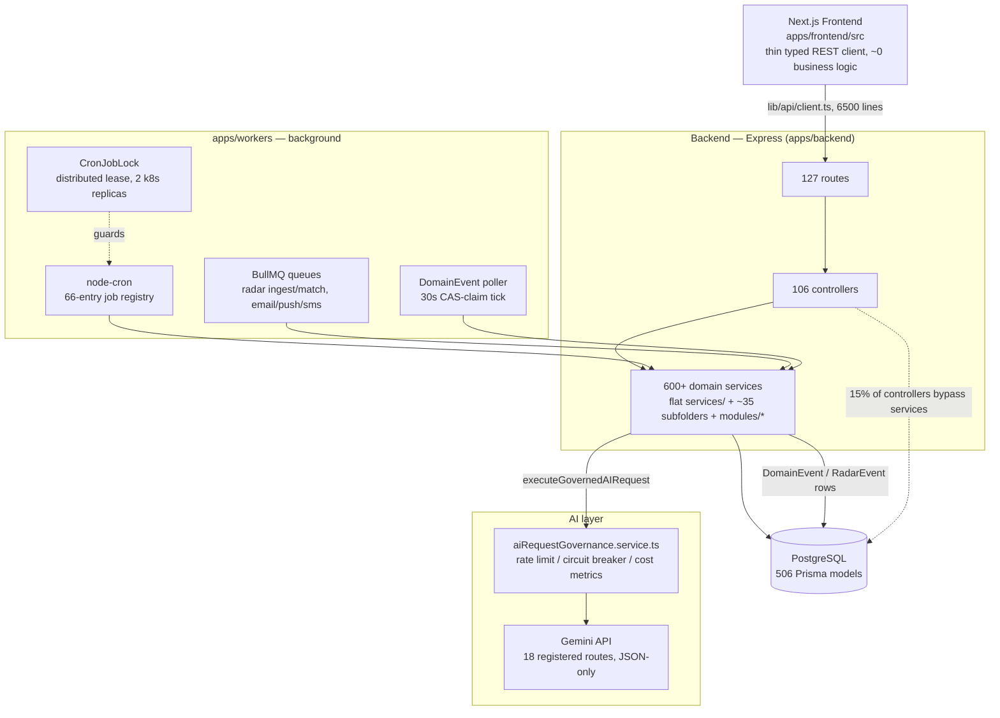
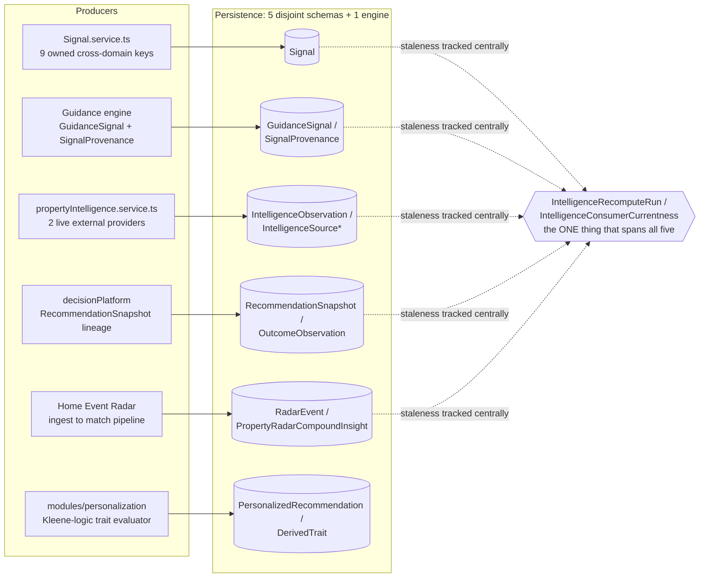

# ContractToCozy Agentic Readiness Audit

**Date:** 2026-08-25
**Scope:** Codebase-wide architecture and intelligence-readiness audit, run in two stages — (1) map and evaluate the current system, (2) assess its readiness for a future agentic AI architecture. No target architecture is designed here; that is explicitly out of scope (see [§12](#12-inputs-required-for-stage-3--c2c-agentic-evolution-architecture)).
**Method:** Six research passes ran in parallel, each grounded in a pre-built knowledge graph of the repository (3,982 files, 42,104 nodes, 83,374 edges) and then verified line-by-line against source: frontend + Ask/chatbot + skill platform; backend core + domain services + rules engines; database schema + intelligence persistence + personalization; workers + cron + events + notifications; LLM usage + observability + external integrations; decision platform + shared context + the Radar ecosystem. Every finding below traces to a real file, model, or commit — documentation was deliberately not trusted at face value.
**Related:** [`CONTRACTTOCOZY_INTELLIGENCE_READINESS_AUDIT.md`](./CONTRACTTOCOZY_INTELLIGENCE_READINESS_AUDIT.md) (2026-08-22/23) scores the *current, shipped* homeowner-facing intelligence experience (48/100, "Intelligence Readiness"). This audit asks a narrower, forward-looking question — how ready is the underlying architecture for an *agentic* layer — and scores accordingly (56/100, "Agentic Readiness"). The two overlap in evidence but answer different questions; neither supersedes the other.

**At a glance**

| | |
|---|---|
| Prisma models | 506 |
| Backend service files | 632 |
| Routes / Controllers | 127 / 106 |
| Worker jobs | 69 |
| Live LLM call sites | 18 (single provider: Gemini) |
| Parallel intelligence subsystems found | 5 |
| Overall agentic readiness score | **56 / 100** |

---

## Table of Contents

1. [Current Architecture Map](#1-current-architecture-map)
2. [Current Intelligence Map](#2-current-intelligence-map)
3. [Existing Agentic Building Blocks](#3-existing-agentic-building-blocks)
4. [Component Classification Matrix](#4-component-classification-matrix)
5. [Agentic Readiness Score](#5-agentic-readiness-score)
6. [Gap Analysis](#6-gap-analysis)
7. [Architectural Risks](#7-architectural-risks)
8. [Reuse Assessment](#8-reuse-assessment)
9. [Recommended Foundation Before Agents](#9-recommended-foundation-before-agents)
10. [Candidate First Agents](#10-candidate-first-agents)
11. [Final Conclusion](#11-final-conclusion)
12. [Inputs Required for Stage 3 — C2C Agentic Evolution Architecture](#12-inputs-required-for-stage-3--c2c-agentic-evolution-architecture)

---

## 1. Current Architecture Map

C2C is a four-tier monorepo: a Next.js frontend that is almost entirely a thin presentation layer, an Express backend carrying essentially all business logic across 600+ service files, a workers app that runs BullMQ queues and node-cron jobs against the same Postgres/Prisma schema, and a single-provider Gemini integration wrapped in a real (if partial) governance layer. The layering is mostly clean but not absolute — roughly 15% of controllers (`incidents`, `user`, `permitTracker`, and one-off reads in `property`/`inventory`/`provider`/`riskAssessment`/`homeDigitalTwin`) call Prisma directly instead of going through a service.

### 1.1 Frontend

Next.js App Router (`apps/frontend/src/app`), React Query for essentially all state — `src/store/` is an empty, dead directory despite being documented as holding client state, and `src/adapters/` is completely empty despite a claimed `orchestration.adapter.ts`. Both are stale-doc flags, not real infrastructure. The API client (`lib/api/client.ts`, 6,500+ lines) and ~30 domain API wrapper files are pure typed pass-throughs; the "policy" files inside `src/features/` (e.g. `capabilityQueryPolicy.ts`) are presentation-eligibility logic, not ranking or reasoning. **No client-side intelligence exists** — every score, rank, and recommendation the frontend renders was computed backend-side.

### 1.2 Backend core

Express, with Sentry/OpenTelemetry init, helmet, CORS, and a 756-line `index.ts` that mounts ~150 route modules directly — no central router registry. Domain services are organized in three coexisting styles: a large flat `services/*.service.ts` layer, ~35 purpose-built subfolders (`coverage/`, `decisionPlatform/`, `intelligence/`, `ownershipCosts/`…), and a newer `modules/*` convention (own controller/service/routes/contract per module — `modules/propertyContext`, `modules/homeEventRadar`, `modules/personalization`) that more complex features are migrating toward. This is a live, unfinished transition, not a settled pattern.

### 1.3 Background & scheduling

This is the single most mature layer in the codebase. Real BullMQ + Redis queues (property-intelligence, email/push/sms notification, plus durable radar-ingest and radar-match queues), scheduled by `node-cron` against a declarative `workerJobRegistry.ts` (66 entries) that **fails startup in production** if registry entries and handlers drift apart. A CAS-based distributed lease (`CronJobLock` Prisma model, consumed by `cronExecutionCoordinator.ts`) keeps the 2 k8s worker replicas from double-firing the same tick. Every job reports a structured `WorkerRunResult` (examined/created/updated/skipped/failed), feeding Prometheus metrics and an admin dashboard.

### 1.4 Database

506 Prisma models. Not a generic schema — it is deeply feature-specific, with entire model families dedicated to single domains (buyer journey: ~30 models; renovation: ~25; property tax: ~20; personalization: ~15). The intelligence-relevant slice of this schema is the subject of Section 2.

### 1.5 AI / LLM surface

Exactly one provider — Google Gemini via `@google/genai` — called from 18 registered routes, all enforced to request structured JSON output, all routed through `aiRequestGovernance.service.ts` (route allow-list, per-route rate limiting, circuit breaker, retry-with-backoff, Prometheus cost tracking). No OpenAI, no Anthropic, anywhere in the repo. One dead code path was found: `propertyAppreciation.service.ts` calls an undefined global `google.search(...)` — a leftover from what looks like an agentic dev sandbox — which throws and is silently swallowed by a try/catch, permanently degrading that feature to a static fallback. Full detail in Section 4.

---

## 2. Current Intelligence Map

The central question of this audit is whether C2C has one insight store or many. The honest answer: **there are five real, independently-populated intelligence subsystems**, plus a sixth personalization/recommendation engine, plus at least four independent risk-scoring computations — none vestigial, all with live writers and real callers, none sharing a schema.

Each subsystem individually looks like a working insight store for its own domain — `GuidanceSignal` alone carries confidence, severity, dedup keys, evidence, and expiry. What's missing is not the concept, it's the convergence: five conventions for the same idea, unified only by a freshness ledger that tracks staleness generically without unifying the shape underneath it.

### 2.1 The five intelligence subsystems

| Subsystem | Core models | Real writer | Character |
|---|---|---|---|
| Signal bus | `Signal` | `services/signal.service.ts` (1,825 lines) | Narrow (9 hardcoded keys), but genuinely cross-domain — 16+ services publish/consume it, versioned upsert with 5-factor confidence blend. |
| Guidance | `GuidanceSignal`, `SignalProvenance`, `SignalAttribution` | Guidance journey engine | Richest single record: intent family, severity score, confidence (Decimal 5,4), dedup key, expiry, missing-context flags. |
| Property Intelligence | `IntelligenceObservation`, `IntelligenceSource(Coverage/Run)` | `propertyIntelligence/propertyIntelligence.service.ts` | Real external-ingestion pipeline (revision chains, content-hash dedup) — but only 2 live providers (USGS hazard, NYC ZAP) feed it today. |
| Decision Platform | `RecommendationSnapshot`, `OutcomeObservation`, `CalibrationRelease` | `decisionPlatform/decisionThreadService.ts` | Most governance-mature: immutable lineage, supersession chains, content-addressed idempotency, multi-role calibration approval — scoped to one estimate family (HVAC) today. |
| Home Event Radar | `RadarEvent`, `PropertyRadarCompoundInsight`, `PropertyRadarAction` | `modules/homeEventRadar/services/*` | Compound-insight correlation across matched events, its own source-health circuit breaker — parallel to, not shared with, Property Intelligence's. |

### 2.2 A sixth, cleanly-separate engine: personalization

`modules/personalization/domain/evaluator.ts` runs a genuinely different mechanism — three-valued (Kleene) logic over a typed `RuleNode` AST, where "unknown" is coded to never count as eligible. It derives `DerivedTrait` rows from property facts, evaluates `RecommendationDefinition` rules against them, and writes idempotent `PersonalizedRecommendation` rows with structured `RecommendationExplanation`. It has its own incident/governance trail (`RecommendationIncident`, `RecommendationGovernanceReview`) independent of Decision Platform's. Well-built; simply the sixth wheel, not a seventh problem.

### 2.3 Isolated intelligence: risk & scoring

At least four independent computation paths produce a "how healthy/risky is this property" verdict, and none of them talk to each other:

- **RiskAssessment.service.ts** — deterministic, `riskCalculator.util.ts` + `risk-constants.ts`.
- **climateRiskPredictor.service.ts** — calls Gemini directly, shares nothing with the above.
- **homeScoreReport.service.ts** / **propertyScoreSnapshot.service.ts** — the one point of reuse: composes `RiskAssessmentService` for its `RISK` score type.
- **valueIntelligence.service.ts** / **appreciationIndex.service.ts** — own model, own caching, imports none of the above.

### 2.4 The Radar naming collision

"Radar" is a UX brand, not an architecture. `refinanceRadar/`, `modules/homeEventRadar/`, and `servicePriceRadar.*` are three fully independent pipelines — separate Prisma models, separate matchers, separate admin surfaces — that happen to share a name and a conceptual shape (external signal → property match → insight → user action). `services/intelligence/sourceRegistry.ts`, the file most likely to be a shared adapter registry, turns out to be a static declarative catalog for governance/observability, not a runtime dispatcher.

### 2.5 Duplication the code itself already admits to

> **Acknowledged in source, not inferred.** `decisionThreadService.ts` lines 209–226: the HVAC repair/replace verdict computed there and the one computed by `homeActionSourcePromotion.service.ts`'s separate lifespan engine **"can and do disagree"** — the code's own comment. Divergence is surfaced to users via a `SOURCE_CARD_VERDICT_DIVERGENCE` limitation code rather than resolved. This is the clearest single piece of evidence in the whole audit that convergent-naming/divergent-implementation is a live product risk today, not a hypothetical one an agentic layer might introduce.

---

## 3. Existing Agentic Building Blocks

Pieces already in the codebase that resemble what an agentic architecture needs — graded by how close each is to reusable as-is.

| Building block | What it is |
|---|---|
| **Shared context** — `modules/propertyContext` | A genuinely single, well-reused "everything we know about this property" assembler. Authorizes access, runs ~20 typed fact scopes in parallel, marks each fact KNOWN / UNKNOWN / STALE / CONFLICTED, computes a version hash. **27+ external call sites.** The strongest single agentic-readiness asset found in the whole audit. |
| **Orchestration primitive** — `decisionPlatform` | A real DecisionThread state machine (two independent, exhaustively-transition-tested lifecycles), an immutable RecommendationSnapshot lineage with change classification, and a formal `DecisionFamilyAdapter` registry. Depth is real in exactly one of 7 registered families (HVAC); the other 6 are thin snapshot wrappers. |
| **Tool registry seed** — `services/skills/` | 19 skills, each with a formal `SkillDefinition`: risk policy (effects, materiality, reversibility), authorization floor, a *context budget* (max facts/entities/documents/latency — a real resource governor), an evaluation suite, and a declared kill-switch. Structurally the closest existing analog to an agent-tool manifest. The declared kill-switches are not yet wired to runtime env checks. |
| **LLM gateway seed** — `aiRequestGovernance.service.ts` | Every one of the 18 known Gemini call sites routes through it. Real allow-list, per-route rate limiting, circuit breaker, retry/backoff, and Prometheus cost tracking in USD. Missing: provider abstraction (Gemini only), distributed rate-limit state, response caching, safety/content filtering. |
| **Background execution** — BullMQ + node-cron + `workerJobRegistry.ts` + `CronJobLock` | Durable queues, declarative job registry with startup parity enforcement, distributed cron leasing across replicas, structured per-run outcomes. Directly reusable as the scheduling substrate for autonomous agent ticks. |
| **Notification policy layer** — `priorityListPolicy.ts` + eligibility/suppression/snooze/kill-switch stack | A coherent, independently-testable "should this reach the user right now" gate, safety-floor-aware, budget-aware. Exactly the shape a future orchestrator needs for deciding when an agent's output should interrupt someone. |
| **Event handling (partial)** — `DomainEvent` + `processDomainEvents.job.ts` | A real CAS-claim poll queue (30s tick, exponential backoff, dead-letter after 8 attempts) with genuine consumers (refinance alerts, radar reconciliation, intelligence recompute). Not a push-based event bus — even the durable BullMQ radar pipeline degrades to a 10s poller at its final notification handoff. |
| **Ops console** — Admin platform | `adminWorkerJobs.service.ts` (live queue stats, manual triggers, dry-run), `adminIntelligenceRecompute.service.ts`, `releaseGate.service.ts` (KPI-gated cohort rollout for capabilities). Already shaped to double as an agent-rollout console with modest extension. |

### 3.1 The Ask orchestrator — a proto-orchestrator with almost no LLM in it

The 9,606-line `askOrchestrator.service.ts` and its ~35 supporting files (`askSemanticRouter.ts`, `askOperationRegistry.ts`, `askAnswerTrustPolicy.ts`…) form a mature, deterministic NLU pipeline: a hand-rolled local embedding (feature-hashed, not ML), lexical + trigram + synonym similarity blended into a calibrated confidence score, routed through a 5-stage cascade (`SAFETY → DETERMINISTIC → LOCAL_CLASSIFIER → CLARIFICATION → REMOTE_FALLBACK`). **The `REMOTE_FALLBACK` stage name exists but is not wired to any LLM call** — grep confirms zero connection to Gemini. The one real LLM touchpoint in the entire Ask subsystem is `askResultSynthesis.service.ts`, which rephrases already-computed, whitelisted JSON into prose under a strict system prompt and a post-hoc numeric-hallucination guard that throws if the model invents a number not present in its input. This is disciplined LLM use — for phrasing, not reasoning — and is the template worth preserving, not loosening, as agents are added.

---

## 4. Component Classification Matrix

30 components, selected for evidence density rather than exhaustive coverage, classified against what they should become on the path to an agentic architecture.

**Legend:** `KEEP` = Keep as-is · `REFACTOR` = Refactor · `SHARED` = Shared platform capability · `TOOL` = Agent tool / capability · `ORCH` = Orchestrator capability · `GATEWAY` = LLM gateway capability · `AGENT` = Potential agent · `REPLACE` = Replace · `RETIRE` = Retire

| Component | Current responsibility | Class | Future role | Required change | Priority |
|---|---|---|---|---|---|
| `modules/propertyContext` | Assembles typed, versioned property facts across ~20 scopes; 27+ callers. | **SHARED** | Canonical Shared Home Context agents request scoped facts from. | Add a stable, versioned agent-facing read contract. | Critical |
| 5 Context wrappers (financial / projectCompliance / aggregation / planning / protection) | Feature-scoped views over propertyContext, each with its own `reconciliation.ts` staleness check. | **REFACTOR** | Same feature-scoped views, one shared staleness utility. | Extract the 3 near-identical reconciliation.ts files into one. | Important |
| `decisionPlatform` (DecisionThread) | Structured decision lifecycle, immutable lineage, commitment gating. | **ORCH** | Substrate for agent-driven, multi-step decision workflows. | Extend real composition beyond HVAC; wire dormant `homeIntelligenceGraph.ts`. | Critical |
| `decisionFamilyAdapterRegistry` | Registers 7 decision families; only HVAC does real context composition. | **REFACTOR** | All 7 families composing, or explicitly documented as thin by design. | Bring 6 snapshot-wrapper families to real composition, or scope down. | Important |
| `signal.service.ts` (Signal bus) | Cross-domain scored, versioned signal publication; 9 owned keys, 16+ callers. | **SHARED** | Reusable signal-bus pattern — the one genuine cross-domain success story. | Extend the key-ownership model past 9 hardcoded keys. | Important |
| `GuidanceSignal` / `SignalProvenance` | Richest single intelligence record: confidence, severity, dedup, expiry, evidence. | **SHARED** | Best existing candidate schema to generalize into one Insight Store. | Schema unification across the 5 subsystems. | Critical |
| `IntelligenceObservation` / `IntelligenceSource*` | External-data ingestion pipeline with governance; 2 live providers. | **SHARED** | The path agents subscribe to for external-signal awareness. | Onboard more providers behind the existing governance shape. | Important |
| `RecommendationSnapshot` / `OutcomeObservation` / `CalibrationRelease` | Immutable recommendation lineage, outcome attribution, governed calibration release. | **ORCH** | Foundation for confidence-calibrated agent recommendations. | Close the loop — outcomes are captured but not yet fed back into calibration (Phase 10B unbuilt). | Critical |
| Home Event Radar pipeline | BullMQ ingest → match, 10s poll to notification. | **AGENT** | Execution substrate for a background environmental-signal watcher agent. | Extract a generic adapter contract shared with the other two radars. | Important |
| `refinanceRadar` / `servicePriceRadar` | Independent bespoke pipelines, same conceptual shape as Home Event Radar. | **REFACTOR** | Converge onto one generic external-signal → match → insight engine. | High-effort consolidation; no shared adapter exists today. | Important |
| `compoundRuleRegistry.ts` | Declarative metadata registry of Home Action promotion rules (not itself executable). | **SHARED** | Pattern for declaring agent-eligible rules as governed metadata. | Extend coverage past Home Action promotion. | Optional |
| `hvacRepairReplaceEngine.service.ts` | Weighted scoring, DB-calibratable weights, governed release process. | **TOOL** | Textbook deterministic tool an agent calls — not a component to rebuild. | None beyond a thin agent-facing wrapper. | Critical (exemplar) |
| Competing HVAC verdicts (decisionThread vs. homeActionSourcePromotion) | Two engines that "can and do disagree" — acknowledged in source. | **REFACTOR** | One authoritative verdict, or an explicit, ranked precedence. | Reconcile before any agent reasons over "the" HVAC answer. | Critical |
| 3 independent priority-ranking engines | `radarPriority.ts`, `guidancePriority.service.ts`, `homeActions.service.ts`'s ranker — each its own weighted formula. | **REFACTOR** | One ranking service the orchestrator calls, domain-parameterized. | Consolidate; `priorityListPolicy.ts` currently wraps, not unifies, them. | Critical |
| `priorityListPolicy.ts` + eligibility/suppression/snooze/kill-switch stack | Deterministic notify/suppress/consent/budget policy layer. | **ORCH** | Reusable "should the agent interrupt this user" gate. | None — reuse directly. | Critical |
| Ask orchestrator + `askSemanticRouter` + `askOperationRegistry` | Deterministic hand-rolled NLU intent router; zero LLM in the routing path. | **TOOL** | Fast, cheap, safety-gated first pass in front of a real LLM fallback. | Wire the unwired `REMOTE_FALLBACK` stage to an actual model. | Important |
| `askResultSynthesis.service.ts` | LLM rephrases verified structured facts into prose, with a hallucination guard. | **KEEP** | The template for every future "LLM writes prose from verified data" call. | None. | Critical (exemplar) |
| Ask "Skills" registry (`services/skills/`) | 19 skills, versioned, risk-classified, context-budgeted, evaluation-linked. | **TOOL** | The strongest existing analog to a formal agent-tool manifest. | Wire declared kill-switches to real runtime env checks — currently unread. | Critical |
| Tool Discovery capability catalog | Recommends existing app features to users; has real, drill-tested kill-switches. | **SHARED** | Governance pattern to copy into the Skills registry above. | Port its env-driven kill-switch wiring. | Important |
| `aiRequestGovernance.service.ts` | Route allow-list, rate limits, circuit breaker, retries, USD cost metrics — Gemini only. | **GATEWAY** | The literal seed of a centralized Intelligence / LLM Gateway. | Add provider abstraction, distributed rate-limit state, safety filtering, caching. | Critical |
| `gemini.service.ts` | Single-provider client; 18 registered, structured-output call sites. | **REFACTOR** | Calls routed through the Gateway instead of the SDK directly. | Medium — mechanical once the Gateway exists. | Critical |
| `propertyAppreciation.service.ts` — `google.search()` | Calls an undefined global; throws; silently caught; feature permanently degrades to a static fallback. | **REPLACE** | Wire a real search tool via the future Gateway, or delete the dead path. | Low effort — this is a live bug, not architecture debt. | Critical (bug) |
| BullMQ + node-cron + `workerJobRegistry` + `CronJobLock` | Durable scheduling, registry/handler parity checks, distributed lease. | **SHARED** | Direct substrate for scheduling autonomous agent background ticks. | None structurally; add agent-specific job types. | Critical |
| `DomainEvent` + poller | 30s CAS-claim poll table with real consumers, not just an audit log. | **SHARED** (seed) | Event-backbone candidate — needs a push mechanism for tight agent triggering. | Add a real event bus (Redis Streams / BullMQ events) alongside or instead of polling. | Important |
| Admin ops surface (worker jobs, recompute, release gate) | Live job health, recompute triggers, capability cohort/KPI gating. | **SHARED** | Ready-shaped console for agent rollout and health monitoring. | Extend to surface agent-specific run health. | Important |
| pino/Loki logging + `AuditLog` | Consistent structured logging; queryable audit trail with signature hashes. | **KEEP** | Reused directly for agent action audit trails. | None. | Important |
| Frontend API client | Thin typed REST wrapper; ~0 business logic client-side. | **KEEP** | Agent outputs surface through the same existing contract. | None. | Optional |
| Bespoke external adapters (weather, AQI, recalls, places, mortgage rates) | 6+ hardcoded one-off `fetch()` integrations, no shared retry/circuit-breaker. | **REFACTOR** | One external-data-provider interface, parallel to `aiRequestGovernance`. | Medium-to-high effort; no shared abstraction exists today. | Important |
| Permit / Tax Socrata+Accela adapters | Real multi-provider adapter abstraction — 2 of ~10 external integrations. | **KEEP** | The template to extend to the other bespoke integrations above. | None — this is the pattern to copy, not to change. | Optional |
| `homeIntelligenceGraph.ts` | Typed read wrapper over 4 hardcoded edge types; its own header says it is not wired into any call site. | **AGENT** (dormant) | Candidate backbone for a property knowledge-graph tool, once justified. | Wire into real call sites, or retire the abstraction. | Optional |

---

## 5. Agentic Readiness Score

Each dimension scored 0–100 against what was actually found in code, not against documentation or intent.

### Overall: 56 / 100

A real, uneven foundation. Strongest where engineering discipline is oldest (background processing); weakest where five teams independently solved the same problem (intelligence reuse).

| Dimension | Score | Why |
|---|---:|---|
| Background processing | **78** | BullMQ + node-cron + declarative job registry with startup parity enforcement + distributed `CronJobLock` leasing + structured per-run outcomes + Prometheus metrics. The most mature layer in the codebase. |
| Shared context | **72** | `modules/propertyContext` is genuinely single-sourced, versioned, freshness-annotated, and reused by 27+ callers — the strongest agent-readiness asset found. |
| Observability | **68** | Consistent structured pino/Loki logging (post the earlier stdout-blind-spot fix), Prometheus metrics in the AI and worker layers, a real audit trail. Gap: no distributed tracing across the DomainEvent → job → service chain. |
| Domain separation | **60** | Services are well-named and mostly single-responsibility, but ~15% of controllers reach into Prisma directly, and the flat-services-vs-modules pattern is mid-migration, not settled. |
| Extensibility | **58** | Strong conventions everywhere (contracts, registries, kill-switches, governance reviews) make adding an N+1th instance of a pattern easy — the same strength is why unifying the existing N instances is hard. |
| LLM abstraction | **55** | `aiRequestGovernance.service.ts` covers all 18 known call sites with rate limits, circuit breakers, and cost tracking — real, but single-provider, no caching, no distributed state, no safety filtering. |
| Orchestration readiness | **50** | `decisionPlatform` provides real thread lifecycle, lineage, and commitment gating — but only 1 of 7 registered decision families does real composition, and 3 competing ranking engines remain unmerged. |
| Insight persistence | **45** | Confidence, evidence, severity, and expiry fields all exist — richly, in places — but across five non-interoperable schemas with no common shape an agent could query generically. |
| Event readiness | **40** | Real consumers exist for `DomainEvent` and `RadarEvent`, but both are poll-based (30s / 10s ticks), not push. Three Radar pipelines don't even share an event contract with each other. |
| Intelligence reuse | **35** | Five parallel insight subsystems, a sixth personalization engine, four independent risk-scoring paths, three independent priority rankers, three independent Radar pipelines. The lowest score in the audit, and the one that matters most. |

---

## 6. Gap Analysis

| Status | Capability |
|---|---|
| ✅ Available | Background job scheduling & distributed locking (BullMQ + node-cron + `CronJobLock`) |
| ✅ Available | Shared home/property context primitive (`modules/propertyContext`) |
| ✅ Available | Structured logging + audit trail (pino/Loki + `AuditLog`) |
| ✅ Available | AI governance seed (`aiRequestGovernance.service.ts`) |
| ✅ Available | Decision lineage + commitment gating (`decisionPlatform`) |
| ✅ Available | Admin ops visibility (job health, capability grants, recompute triggers) |
| ✅ Available | Skill manifest contract (`services/skills/`) — versioned, risk-classified |
| 🔴 Critical | Unified insight/signal schema (currently 5 parallel, non-interoperable schemas) |
| 🔴 Critical | Real event bus / pub-sub (currently poll-based, 10–30s latency even in the durable BullMQ radar path) |
| 🔴 Critical | LLM Gateway provider abstraction (single-provider today, no fallback, no caching, no safety filter) |
| 🔴 Critical | Unified priority-ranking service (3 competing implementations, wrapped not merged) |
| 🔴 Critical | Resolution of the two disagreeing HVAC decision engines — a live data-quality bug, not just a gap |
| 🟡 Important | Generalized external-data-adapter interface (only permits/tax have one, of ~10 integrations) |
| 🟡 Important | Skill kill-switch wiring (declared in every manifest, read by nothing at runtime) |
| 🟡 Important | Radar pipeline convergence (3 independent implementations of the same conceptual pipeline) |
| 🟡 Important | Distributed tracing / OpenTelemetry across the async chain |
| 🟡 Important | Closing the calibration learning loop (outcomes are captured; calibration doesn't read them yet — Phase 10B unbuilt per code comment) |
| ⚪ Optional | `homeIntelligenceGraph.ts` activation — currently zero call sites |
| ⚪ Optional | Frontend `NEXT_PUBLIC_GEMINI_API_KEY` cleanup — unused, stale, never actually read by any browser code path |
| ⚪ Optional | Fix or delete the broken `google.search()` call in `propertyAppreciation.service.ts` |

---

## 7. Architectural Risks

**Live today, not hypothetical**

- **Duplicated business logic.** Three ranking engines, three Radar pipelines, two disagreeing HVAC verdicts, eleven `*Reconciliation.service.ts` files with divergent (not shared) algorithms. This pattern is already the codebase's default failure mode — agents will reproduce it faster unless something gates new duplication.
- **Conflicting recommendations.** `SOURCE_CARD_VERDICT_DIVERGENCE` is a real, named, currently-shipping limitation code — the product already surfaces contradictory answers to users. More autonomous producers without a unification step will make this worse, not new.

**Real but partially mitigated**

- **Uncontrolled background execution.** Well-governed today (`CronJobLock`, registry parity checks, per-route kill-switches). The right move is extending this governance to agent ticks, not inventing a parallel control system.
- **Cost explosion.** `aiRequestGovernance` already tracks per-route USD cost. Extend to per-agent cost attribution before scaling agent count — the meter exists, it just isn't itemized that way yet.

**Emerging, visible in miniature**

- **Circular / coordinated dependencies.** No agents exist yet, but `homeActionDecisionLineage.ts`'s prefix-routing table and `homeActionProducerOwnership.ts`'s analogous table are already two parallel classification systems kept manually in sync for one feed. That's the coordination tax multiple agents will pay, in preview.

**Currently a strength**

- **Confidence/evidence tracking.** Not a gap — `GuidanceSignal` and `RecommendationSnapshot` already carry confidence, severity, and evidence as first-class fields. The actual task is unifying five good implementations, not inventing the concept.
- **Stale intelligence.** `IntelligenceConsumerCurrentness` already tracks staleness generically across subsystems. Reuse it rather than rebuilding a freshness ledger per agent.

**Watch, not yet present**

- **Agent proliferation & excessive LLM dependence.** Current LLM usage is disciplined — 18 narrow, structured, single-purpose calls, one provider, one verified-summarization pattern reused deliberately. The risk is real only if agent expansion abandons that discipline; nothing in the code today suggests it will on its own.

**Gap, not yet mitigated**

- **Insufficient observability for orchestration.** Logging, metrics, and audit trail are solid individually, but there is no trace-level visibility across a full `DomainEvent → job → service` chain. An orchestrator coordinating multiple agents will need to debug decisions across exactly that chain — this needs to exist before, not after, agent count grows past one or two.

---

## 8. Reuse Assessment

Evidence-based estimate of what the classification matrix implies at the scale of the whole codebase, not just the 30 sampled rows.

| Share | Category | What's in it |
|---:|---|---|
| **35%** | Remains unchanged | Frontend presentation layer, background scheduling substrate, permit/tax adapters, logging/audit, Ask trust/audience policy layer, notification policy stack. |
| **30%** | Refactored | Radar-triad convergence, ranking-engine unification, context-wrapper dedup, controller/service boundary cleanup, external-adapter generalization. |
| **15%** | Becomes shared intelligence infrastructure | The 5 intelligence schemas generalized into one insight store; `propertyContext` formalized as an agent-facing API; `aiRequestGovernance` extended into a full Gateway. |
| **15%** | New development | A real event bus, orchestrator-level agent coordination, LLM provider abstraction, safety/content filtering, agent-specific admin surfaces. |
| **5%** | Retired | The losing HVAC verdict engine (once reconciled), duplicate Radar code (once converged), dormant `homeIntelligenceGraph.ts` if left unwired, the broken `google.search()` path, the dead frontend `store/` and `adapters/` directories. |

---

## 9. Recommended Foundation Before Agents

The minimum architectural foundation — not the full agent ecosystem design, which is explicitly out of scope for this audit.

1. **Unify the insight/signal shape.** Even as a thin common interface over the 5 existing tables before any schema migration — confidence, evidence, status, priority, and expiry as first-class, generically queryable fields.
2. **Upgrade the event backbone from poll to push** — or explicitly document poll latency (10–30s) as an accepted constraint — so agent-to-agent triggering doesn't depend on guesswork about timing.
3. **Extend `aiRequestGovernance.service.ts` into a real multi-provider LLM Gateway** before any agent is allowed to call a model directly. This is the literal capability the audit brief asks about, and the seed already exists.
4. **Resolve the two disagreeing HVAC verdicts and converge the 3 ranking engines.** An agent must not inherit contradictions that are already baked into its own inputs.
5. **Wire the Skills registry's kill-switches for real**, and extend `releaseGate.service.ts`'s cohort/KPI gating — proven on tool rollout — to cover agent rollout the same way.
6. **Give `propertyContext` a formal, versioned, agent-facing contract** rather than relying on internal service-to-service imports, so agents don't couple directly to backend internals.
7. **Add trace-level observability** across the `DomainEvent → job → service` chain, so an orchestrator's decisions remain debuggable as agent count grows.

---

## 10. Candidate First Agents

The 3–5 strongest candidates supported by what already exists — not an implementation plan, and not the full roster a mature ecosystem would eventually need.

### 1. HVAC Repair/Replace Advisor Agent
*LLM: explanation & dialogue only*

- **Business value:** The highest-stakes, highest-friction homeowner decision already modeled end-to-end in the codebase.
- **Existing capabilities reused:** Full DecisionThread lifecycle, calibrated weighted scoring engine, RecommendationSnapshot lineage, outcome attribution.
- **Missing pieces:** Resolve the two competing verdict engines first; wire the currently one-way outcome → calibration learning loop.
- **Why an agent, not a service:** The reasoning already spans multi-step context gathering, option comparison, and calibrated confidence — an agent can drive the conversational "gather missing context, compare, explain" loop a user currently has to drive manually.

### 2. External Signal Watcher Agent
*LLM: optional, explanation only*

- **Business value:** Proactively surfaces refinance opportunities, price anomalies, and environmental/regulatory events without a user-initiated query.
- **Existing capabilities reused:** BullMQ ingest/match pipeline, Radar source-health governance, the full notification eligibility/suppression/consent/budget stack.
- **Missing pieces:** Converge the 3 independent radar engines first, or scope the initial agent to Home Event Radar only.
- **Why an agent, not a service:** Genuinely continuous and autonomous — reconciling heterogeneous external sources and judging materiality is closer to a background daemon with judgment than a fixed cron job.

### 3. Ask Concierge Agent
*LLM: fallback tier + clarification*

- **Business value:** The product's actual chat surface, already carrying 65 operations, entity resolution, and trust/audience policy.
- **Existing capabilities reused:** `askOperationRegistry`, the trust/audience policy layer, the Skills registry, the verified-summarization pattern from `askResultSynthesis`.
- **Missing pieces:** A real LLM-backed reasoning stage behind today's deterministic router (the `REMOTE_FALLBACK` stage name exists, unwired); Skills kill-switches need real wiring first.
- **Why an agent, not a service:** This is the one place the product already anticipated an agent shape — routing stages, confidence bands, an eval corpus. Extending it is lower-risk than building a new agent from nothing.

### 4. Document Intelligence Agent
*LLM: core — vision + language*

- **Business value:** Every document upload (insurance, inspection, inventory, permits, tax, negotiation) currently reimplements its own OCR/extraction call.
- **Existing capabilities reused:** The shared `ExtractionEnvelope` contract, `documentPromotionAdapterRegistry`'s self-audit of adapter coverage, the `ExtractedFactCandidate` review workflow.
- **Missing pieces:** Consolidate the ~7 bespoke per-feature OCR/prompt implementations behind one shared extraction service before wrapping it in an agent.
- **Why an agent, not a service:** Document intake genuinely benefits from multi-step reasoning — classify, extract, cross-check against existing property facts, flag conflicts, route for review — not a single-shot OCR call.

### 5. Property Health Score Reconciler Agent *(lower priority)*
*LLM: explanation layer only*

- **Business value:** 4 independent risk/scoring paths can produce inconsistent signals about the same property.
- **Existing capabilities reused:** `PropertyScoreSnapshot`, the Signal bus (already consumed by `riskPremiumOptimizer`), `IntelligenceRecomputeRun` for staleness.
- **Missing pieces:** None of the 4 scoring paths currently talk to each other — real integration work is needed first, making this the weakest near-term candidate.
- **Why included despite that:** Named explicitly to make the "not yet ready" case visible rather than silently omitting a plausible-sounding candidate — reconciling conflicting deterministic scores into one explained verdict is more judgment than any single engine does today, but the prerequisite integration work isn't done.

---

## 11. Final Conclusion

Contract to Cozy is not starting from zero, and it is not sitting on a ready-made agent platform either. It is a mature, feature-rich system that solved pieces of the agentic problem organically, multiple times, in different corners of the codebase — because it had to ship features, not because anyone was designing toward this. That's the honest starting point for what comes next.

**Q1 — Is C2C ready for an agentic architecture?**
Partially. Real building blocks exist — a genuinely shared context primitive, a working decision-lineage engine, a functioning AI governance seed, a mature background-scheduling substrate, a formal skill-manifest contract — but readiness is uneven: 78/100 on background processing against 35/100 on intelligence reuse is not a system that's "close," it's a system whose engineering effort landed unevenly across ten years of feature delivery.

**Q2 — How much architectural change is actually required?**
Moderate. The 30-row classification matrix splits roughly evenly between components that keep working as-is or with light extension, and components that need real convergence work — it is not dominated by either "leave it alone" or "rebuild it."

**Q3 — Major redesign, or incremental evolution?**
Incremental evolution is not just preferable here, it's what the evidence supports. Every candidate first agent above is scoped as "reuse this real subsystem, add this specific missing piece" — none of them require discarding working infrastructure to get started.

**Q4 — What existing investments should be preserved?**
`modules/propertyContext`, the decision-lineage and commitment-gating machinery in `decisionPlatform`, the BullMQ/cron/`CronJobLock` scheduling substrate, `aiRequestGovernance.service.ts`, the notification eligibility/suppression policy stack, the Skills manifest contract, and the disciplined logging/audit trail. These were built well, and an agentic layer should sit on top of them, not around them.

**Q5 — What foundational capabilities must exist before agents?**
The seven items in [Section 9](#9-recommended-foundation-before-agents) — most centrally, a unified insight shape, a real event backbone, and a genuine LLM Gateway. None of these are green-field: each has a real seed in the current code that needs extending, not inventing.

**Q6 — What should explicitly not be changed?**
The deterministic-first discipline already visible in the Ask trust, audience, and synthesis layers — LLM calls used narrowly, for phrasing verified facts, with a hallucination guard that actually throws. That pattern should be the template every future agent follows, not a constraint an agentic redesign loosens. Also worth leaving alone: the frontend's thin-client design, and the background-job governance model, both of which are already agent-ready as they stand.

**Q7 — What evidence supports these conclusions?**
Six parallel research passes against a 42,104-node knowledge graph of the actual repository, cross-checked line-by-line against source — not documentation. Specific, citable evidence threads through this entire report: a code comment at `decisionThreadService.ts:209–226` that admits two engines disagree; 18 of 18 known Gemini call sites confirmed routed through one governance chokepoint; 27+ real call sites for `getPropertyContext`; a `CronJobLock` table built specifically to survive two Kubernetes replicas. This audit trusted what the code does, not what any document claimed it does.

---

## 12. Inputs Required for Stage 3 — C2C Agentic Evolution Architecture

What the next exercise — designing *Current C2C → Intelligence Foundation → Initial Agents → Orchestrator → Mature Agent Ecosystem* — should take as given, rather than re-deriving.

**Reusable substrate**
`modules/propertyContext` as the shared-context API surface; BullMQ/cron/`CronJobLock` as the execution substrate; `aiRequestGovernance.service.ts` as the Gateway seed; `services/skills/` as the tool-manifest seed; the notification policy stack as the interruption gate.

**Must unify first**
The 5 intelligence subsystems into one insight shape; the 3 priority-ranking engines; the 3 Radar pipelines; the 2 disagreeing HVAC verdicts. Stage 3 should treat these as prerequisites, not as things agents can route around.

**Genuinely new**
A push-based event backbone; multi-provider abstraction in the LLM Gateway; safety/content filtering; an orchestrator-level agent coordination layer; distributed tracing across the async chain.

**Proven governance patterns to extend**
`releaseGate.service.ts`'s KPI-gated cohort rollout (proven on tool rollout) as the model for agent rollout; Tool Discovery's real, drill-tested kill-switches as the model for the Skills registry's currently-unwired ones; `workerJobRegistry.ts`'s startup parity enforcement as the model for agent-registration validation.

**Strongest first-agent candidates**
HVAC Repair/Replace Advisor and Ask Concierge (both extend existing, evidence-rich subsystems); External Signal Watcher as the background-autonomy proof point; Document Intelligence as the multi-step-reasoning proof point.

**Constraints to design within**
No production-user migration constraint (confirmed) — but real working code exists at every layer and should not be discarded. Preserve the deterministic-first / LLM-for-phrasing-only discipline. Preserve the frontend's thin-client boundary.

---

*Contract to Cozy — Agentic Readiness Audit. Stage 1 & Stage 2 only, per scope — no target architecture designed here. Built from a 6-way parallel codebase audit grounded in a 42,104-node knowledge graph, verified against source.*
