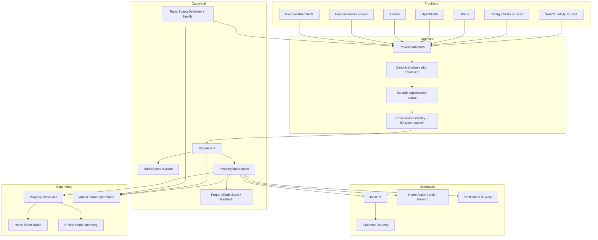

# Home Event Radar — Functional Requirements Document

| Field | Value |
| --- | --- |
| Status | Proposed |
| Version | 1.0 |
| Date | July 26, 2026 |
| Accountable product area | Protect & Monitor |
| Primary customer job | Stay Ahead |
| Secondary customer jobs | Decide With Confidence; Act Before Damage Escalates |
| Canonical capability ID | `home-event-radar` |
| Canonical route | `/dashboard/properties/:propertyId/tools/home-event-radar` |
| Implementation plan | [Home Event Radar — Implementation Plan](./HOME_EVENT_RADAR_IMPLEMENTATION_PLAN.md) |
| Current-state technical reference | [Home Event Radar](./HOME_EVENT_RADAR.md) |

---

## Table of Contents

1. [Executive Summary](#1-executive-summary)
2. [Product Decision](#2-product-decision)
3. [Current-State Assessment](#3-current-state-assessment)
4. [Problem Statement](#4-problem-statement)
5. [Goals, Non-Goals, and Success Measures](#5-goals-non-goals-and-success-measures)
6. [Product Principles](#6-product-principles)
7. [Users and Jobs to Be Done](#7-users-and-jobs-to-be-done)
8. [Terminology and Conceptual Model](#8-terminology-and-conceptual-model)
9. [Target Homeowner Experience](#9-target-homeowner-experience)
10. [Target Architecture](#10-target-architecture)
11. [Source and Coverage Strategy](#11-source-and-coverage-strategy)
12. [Canonical Event Contract](#12-canonical-event-contract)
13. [Matching, Impact, Confidence, and Priority](#13-matching-impact-confidence-and-priority)
14. [Event Lifecycle and Incident Promotion](#14-event-lifecycle-and-incident-promotion)
15. [Functional Requirements](#15-functional-requirements)
16. [API and DTO Requirements](#16-api-and-dto-requirements)
17. [Persistence Requirements](#17-persistence-requirements)
18. [Notifications and Household Controls](#18-notifications-and-household-controls)
19. [Administration and Operations](#19-administration-and-operations)
20. [Analytics and Measurement](#20-analytics-and-measurement)
21. [Security, Privacy, Trust, and Safety](#21-security-privacy-trust-and-safety)
22. [Non-Functional Requirements](#22-non-functional-requirements)
23. [Acceptance Criteria](#23-acceptance-criteria)
24. [Recommended Roadmap](#24-recommended-roadmap)
25. [Risks and Mitigations](#25-risks-and-mitigations)
26. [Open Product Decisions](#26-open-product-decisions)

---

## 1. Executive Summary

Home Event Radar shall be the single, property-aware monitoring surface for current, upcoming, and
recently resolved external events that may affect a homeowner's property.

The feature shall answer five questions clearly:

1. **What is happening?**
2. **Does the source actually cover my property?**
3. **Why might this matter to this specific home?**
4. **How certain is that conclusion?**
5. **What can I do next?**

The current implementation contains useful foundations:

- canonical `RadarEvent` records;
- deterministic property matching;
- property-specific impact factors and recommended actions;
- per-user save, dismiss, seen, and acted-on state;
- signal publication;
- `Incident` promotion and Guidance Engine hooks; and
- a property-scoped feed and detail experience.

It is not yet a production-grade live radar. The only real source connected to `RadarEvent` is tax
assessment, that job is disabled by the production worker policy, no tax jurisdictions are seeded,
and real weather flows to `Incident` without appearing in Radar. Utility and insurance source types
are presented in the UI without real providers. The resulting zero-event state is expected but is
communicated to the homeowner as though monitoring succeeded and no events occurred.

This FRD makes the following product and architecture decision:

> Every external event source writes through one canonical Radar ingestion contract. Radar owns
> source truth, coverage, matching, and the homeowner feed. `Incident` remains the actionable
> lifecycle projection for events that require acknowledgment or resolution.

Because there are no real users, implementation shall use a direct pre-launch cutover. It shall not
create a long-lived dual-read, dual-write, compatibility, or user-data migration path. Existing
development and synthetic Radar data may be reset.

---

## 2. Product Decision

### 2.1 Radar is a monitoring product, not another incident list

Radar and Incident have distinct responsibilities:

| Concept | Responsibility |
| --- | --- |
| Radar event | Authoritative external observation, provider lifecycle, geography, provenance |
| Property match | Why the event applies to one property, expected impact, confidence, priority |
| Incident | Actionable lifecycle for a material property match |
| Guidance journey | Multi-step resolution path for a promoted incident or other qualifying signal |
| Notification | Time-sensitive delivery of a new or materially changed property match |

Radar may show awareness-level events that do not become incidents. Every Radar event must have
source and coverage evidence. Every promoted incident must link back to exactly one property match.

### 2.2 Radar is the canonical current-event surface

Current and upcoming weather alerts, air-quality alerts, disaster declarations, tax changes, and
supported utility events shall appear in Radar when the property is in source coverage.

The product shall not require homeowners to understand that one provider writes to `Incident` and
another writes to `RadarEvent`.

### 2.3 Capability availability must reflect source availability

The capability may remain globally discoverable, but the property experience must disclose:

- which source families cover the property;
- when each family was last checked successfully;
- which source families are unavailable or not yet supported;
- whether an empty feed means confirmed clear, unavailable coverage, or a source error; and
- whether displayed information may be stale.

The feature shall not claim to monitor a category that has no active source for the property.

### 2.4 Pre-launch replacement rule

There are no real users and no production interaction history that must be preserved. Therefore:

- legacy Radar data does not require backfill;
- existing synthetic events and matches may be deleted in non-production or pre-launch production;
- frontend and backend contracts may be changed together;
- the weather pipeline may be refactored directly to canonical Radar ingestion;
- old public/internal Radar ingest routes may be removed instead of deprecated; and
- no permanent compatibility adapter shall be created.

Normal Prisma schema migrations remain required to deploy database changes. This rule excludes
user-data migration and compatibility work, not schema versioning.

---

## 3. Current-State Assessment

### 3.1 Existing strengths

| Area | Current strength |
| --- | --- |
| Matching | Deterministic, property-aware impact calculations exist for multiple event families |
| Personalization | Roof, HVAC, irrigation, drainage, foundation, heating, and system facts affect impact |
| Interaction state | New, seen, saved, dismissed, and acted-on states are persisted per user |
| Action recommendations | Structured action lists and affected systems are already modeled |
| Guidance | Moderate/high matches can promote into Incident and Guidance Journey |
| Frontend | Property-scoped feed, filter chips, detail sheet, loading, empty, and error states exist |
| Analytics | Feed, detail, state-change, and tool lifecycle telemetry exists |
| Worker platform | Registry, policy gates, job run history, metrics, and manual trigger framework exist |
| Weather source | A mature NWS severe-weather integration and freeze-risk job already exist |

### 3.2 Current blocking gaps

| Priority | Gap | Consequence |
| --- | --- | --- |
| P0 | Internal Radar event and match routes require only authentication | Any authenticated user can potentially create or mass-match false events |
| P0 | UI claims four monitored families without active property coverage | A zero feed is misleading and damages trust |
| P0 | Real weather bypasses Radar | The most valuable live events never appear in the feature |
| P1 | Tax ingest is disabled and has no configured jurisdictions | The only real Radar source produces no events |
| P1 | County and polygon matching return no matches | Common official provider geographies are unsupported |
| P1 | No property/event reconciliation | New or changed properties miss existing active events |
| P1 | No durable matching retry | Fire-and-forget or per-property failures can leave permanent gaps |
| P1 | Unknown facts can be treated as negative facts | Impact can be overstated |
| P1 | Source provenance and freshness are absent from homeowner UI | Users cannot verify or assess trust |
| P2 | Feed pagination contract is incorrect and frontend does not paginate | Larger feeds can skip records and counts are not authoritative |
| P2 | Recommendations are static text | The experience stops before execution |
| P2 | No source-health or coverage operations view | A broken feed can remain silently empty |
| P2 | Test coverage is concentrated in a tax normalizer | Critical end-to-end behavior is unprotected |

### 3.3 Root cause of the observed empty screen

The checked-in deployment state creates the following path:

```text
Real NWS weather jobs enabled
        └─ write Incident only
             └─ do not appear in Radar

Radar dummy ingestion disabled
        └─ correct for production

Tax assessment ingestion registered
        ├─ classified as external ingest
        ├─ WORKER_EXTERNAL_INGEST_ENABLED=false
        ├─ no per-job tax override
        └─ no seeded TaxAssessorDataSource rows

Result: no RadarEvent → no PropertyRadarMatch → empty feed
```

---

## 4. Problem Statement

### 4.1 Homeowner problem

Homeowners learn about relevant events from disconnected channels: weather apps, utility messages,
tax notices, local news, insurer mail, municipal bulletins, and neighbors. These sources describe
the event but rarely explain what it means for the homeowner's particular roof, HVAC, foundation,
drainage, insurance, budget, or maintenance state.

A useful home-event product must reduce uncertainty without creating unnecessary alarm.

### 4.2 Product problem

The current product exposes a polished event feed before it has:

- reliable source coverage;
- one canonical provider pipeline;
- complete geographic matching;
- a truthful coverage contract;
- source freshness and lifecycle controls;
- durable reconciliation;
- trustworthy unknown-data handling; or
- an execution path from recommendation to action.

### 4.3 Platform problem

External signal ingestion is distributed across `RadarEvent`, `Incident`, domain workers, and
Guidance Engine calls. The same source can create multiple projections without a single lineage
identifier. Resolution and retry semantics vary by worker.

---

## 5. Goals, Non-Goals, and Success Measures

### 5.1 Goals

Home Event Radar shall:

1. Surface verified current, upcoming, and recently resolved events for a property.
2. Distinguish confirmed-clear, uncovered, degraded, stale, and error states.
3. Normalize all providers through one canonical event contract.
4. Match by property, point, ZIP, city, county/FIPS, state, radius, and polygon as supported.
5. Explain provider severity, property impact, confidence, and priority separately.
6. Use only confirmed property facts to increase or decrease expected impact.
7. Promote material matches into exactly one Incident and, when applicable, one Guidance Journey.
8. Give each recommended action a concrete execution destination or an explicit informational label.
9. Notify households according to severity, relevance, and user preferences.
10. Provide source coverage, freshness, errors, throughput, and zero-match anomaly operations.
11. Be safe to retry, replay, update, supersede, retract, resolve, and archive.
12. Provide complete automated acceptance coverage from provider fixture to homeowner action.

### 5.2 Non-goals

The initial target does not:

- predict events without an authoritative or reviewed derived source;
- provide emergency dispatch or replace official emergency instructions;
- guarantee national utility-outage coverage;
- infer live insurance-market changes without a verified source;
- make coverage, legal, tax-appeal, or financial decisions for the homeowner;
- use a generative model to determine geography, severity, or eligibility;
- treat absence of a Radar event as proof that no hazard exists;
- preserve pre-launch synthetic Radar history;
- create a social/community event feed; or
- duplicate the full Incident resolution workspace inside Radar.

### 5.3 Launch success measures

| Measure | Launch target |
| --- | --- |
| Eligible properties with at least one active source family | 100% of launch cohort |
| Radar category claims backed by active property coverage | 100% |
| NWS active alert ingestion-to-feed latency, p95 | 5 minutes or less |
| Provider update/resolution propagation, p95 | 10 minutes or less |
| Active event matches with provenance and freshness | 100% |
| Promoted matches producing duplicate open incidents | 0 |
| Cross-tenant event mutation through homeowner credentials | 0 |
| Unknown property facts used as confirmed risk factors | 0 |
| Source failures distinguishable from confirmed-clear responses | 100% |
| Critical acceptance scenarios automated | 100% |
| Unexplained sustained zero-match period for covered properties | 0 |

### 5.4 Post-launch learning measures

- feed open rate after notification;
- useful-event rate;
- dismiss and “not relevant” rate by provider and event type;
- action-start and action-completion rate;
- time from alert to first protective action;
- notification opt-out rate;
- false-positive reports;
- provider freshness and availability;
- matching confidence distribution;
- percentage of active events promoted to incidents;
- percentage of events resolved by source lifecycle rather than timeout.

---

## 6. Product Principles

### 6.1 Truth before polish

The feature shall say what it knows, what it does not know, and which sources are active.

### 6.2 Calm urgency

Urgency must follow provider evidence and property impact. The UI shall not use alarmist language,
red styling, or push delivery merely to increase engagement.

### 6.3 Source severity is not property impact

A high-severity regional event may have low expected impact for a specific property. A moderate
event may have high property impact because of a confirmed vulnerability. Both dimensions must be
visible.

### 6.4 Unknown is not no

Missing roof, cooling, backup heat, drainage, or responsibility information shall reduce confidence
or request context. It shall not be silently interpreted as a vulnerable condition.

### 6.5 One observation, one lineage

Every provider event, property match, incident, journey, notification, state change, and action
must share traceable lineage.

### 6.6 Actionable when possible

Recommendations should start work, not merely describe work. Informational recommendations must be
explicitly labeled when no safe execution destination exists.

### 6.7 Conservative failure

Provider failure means “unknown,” never “clear.” A failed refresh shall not automatically resolve a
still-active event unless a documented stale-resolution policy applies.

---

## 7. Users and Jobs to Be Done

### 7.1 Primary homeowner

**Job:** “Tell me what is changing around my home, why it matters here, and what I should do before
the problem becomes expensive or dangerous.”

Needs:

- fast scanning;
- trustworthy sources;
- specific home relevance;
- appropriate urgency;
- clear next action;
- household coordination; and
- control over notifications.

### 7.2 Household collaborator

**Job:** “Help me understand and participate in protecting our shared home without changing
owner-only settings.”

Needs:

- shared event visibility where authorized;
- personal seen/saved/dismissed state;
- household action status;
- role-aware execution controls.

### 7.3 Platform operator

**Job:** “Know which sources are working, which properties are covered, and why a feed is empty.”

Needs:

- source health;
- geographic coverage;
- last success and failure;
- ingestion and matching metrics;
- replay and scoped smoke tests;
- safe kill switches;
- event lineage; and
- audit history.

### 7.4 Support/admin user

**Job:** “Explain a specific homeowner event without exposing another property or mutating global
state accidentally.”

Needs:

- read-only lineage view by default;
- capability-gated reprocess tools;
- no raw secrets or unnecessary provider payload exposure.

---

## 8. Terminology and Conceptual Model

| Term | Definition |
| --- | --- |
| Source family | Weather, air quality, disaster, utility, tax, insurance, or other reviewed domain |
| Source definition | Provider configuration, adapter type, coverage, schedule, health, and policy |
| Source observation | One payload received from a provider at a point in time |
| Canonical event | Deduplicated evolving event independent of a property |
| Event revision | Material provider update to a canonical event |
| Coverage | Evidence that a provider/source is capable of monitoring the property |
| Property match | Materialized application of a canonical event to one property |
| Provider severity | Urgency/seriousness declared or deterministically mapped from the source |
| Property impact | Expected consequence for the specific property |
| Match confidence | Confidence that the event geography and property facts support the match |
| Priority | Bounded ordering score derived from severity, impact, confidence, timing, and user state |
| Recommended action | Structured safe next step associated with a match |
| Incident promotion | Creation/update of an actionable Incident from a material property match |
| Confirmed clear | Source fetch succeeded and no relevant active event was returned |
| Uncovered | No active source supports the property/category |
| Degraded | Source is active but late, failing, or partially unavailable |
| Stale | Event or coverage data has exceeded its source-specific freshness objective |

---

## 9. Target Homeowner Experience

### 9.1 Page structure

The canonical page shall contain:

1. Property and monitoring status header.
2. Category coverage strip.
3. Feed status summary.
4. Time and category filters.
5. Event feed grouped into Now, Upcoming, and Recently Ended.
6. Event detail sheet/page with source and match explanation.
7. Notification and monitoring settings entry.
8. Related resolution surfaces when relevant.

### 9.2 Monitoring status header

The header shall show:

- selected property;
- overall state: Active, Partial Coverage, Degraded, Setup Needed, or Unavailable;
- most recent successful monitoring check;
- number of active sources and categories;
- link to “How monitoring works.”

### 9.3 Coverage strip

Each configured category shall display one of:

- Active;
- Partial coverage;
- Not available in this area;
- Coming later;
- Degraded;
- Setup needed.

A category filter shall not appear as fully active merely because an enum exists.

### 9.4 Feed states

The feed shall distinguish:

| State | Homeowner message |
| --- | --- |
| Active events | Ordered property matches |
| Confirmed clear | “No active events from the sources covering this home.” |
| Partial coverage | “No events detected by active sources. Some categories are not covered.” |
| Degraded | “Monitoring is delayed. Last successful check was …” |
| Uncovered | “Live monitoring is not yet available for this property.” |
| Setup needed | Explain the missing property location/context and offer correction |
| API error | Retry without presenting a successful empty state |

### 9.5 Event card

Each card shall show:

- event title and family;
- provider severity;
- property impact;
- confidence when below High;
- effective/expiration time;
- source name;
- New, Updated, Saved, or Action Started state;
- concise property-specific explanation;
- primary recommended action when safe.

### 9.6 Event detail

The detail experience shall show:

1. Official/provider description.
2. Effective, updated, and expiration times.
3. Source name and external source link where safe.
4. Geographic match explanation.
5. Property impact and confidence.
6. Confirmed factors that increased/decreased impact.
7. Missing facts that limit confidence.
8. Affected systems.
9. Recommended actions, timing, responsibility, and destinations.
10. Related Incident/Guidance status when promoted.
11. Save, dismiss, mark addressed, share to household, and report relevance controls.

### 9.7 Filters

Required filters:

- All;
- Now;
- Upcoming;
- Recently ended;
- Saved;
- Dismissed;
- source family;
- impact;
- provider severity.

Filters and pagination shall be server-backed. The URL shall preserve meaningful filters and an
optional selected match ID.

### 9.8 Actions

An action may:

- create a maintenance task;
- open a relevant system record;
- open Coverage Intelligence;
- open Service Price Radar;
- open provider search/booking;
- open Document Vault;
- create a reminder;
- mark an existing Incident or Guidance step;
- share with the household; or
- present official instructions.

“Mark done” shall represent a match-level acknowledgment only unless completion evidence exists.

---

## 10. Target Architecture



### 10.1 Architecture rules

1. Provider workers shall not write homeowner-facing events directly to `Incident`.
2. Provider workers shall produce a validated canonical observation.
3. Ingestion and matching shall be durably queued or executed under a retryable job claim.
4. Canonical event upsert and revision creation shall be idempotent.
5. Property matching shall be independently replayable.
6. Incident promotion shall be idempotent on `propertyRadarMatchId`.
7. Guidance creation shall originate from the promoted Incident, not independently from the worker.
8. Source resolution shall update canonical event state and downstream projections.
9. Provider failures shall update source health without resolving active events immediately.
10. The public homeowner API shall be read/property-action scoped; source ingestion shall use
    service identity or admin capability.

---

## 11. Source and Coverage Strategy

### 11.1 Launch source priority

| Priority | Source | Value | Launch recommendation |
| --- | --- | --- | --- |
| 1 | Existing NWS severe-weather alerts | Live, authoritative, point-addressable | Required |
| 1 | Existing freeze forecast | High homeowner actionability | Required |
| 2 | AirNow | Air quality and smoke | Recommended |
| 2 | USGS real-time feeds | Earthquake awareness | Recommended where material |
| 2 | OpenFEMA declarations | Disaster/recovery context | Recommended, lower-frequency |
| 2 | Validated tax jurisdiction | Financial/property notice | Pilot only |
| 3 | Utility outage provider | High value but fragmented | Territory-specific or paid decision |
| 4 | Insurance market feed | No verified uniform source | Do not claim until sourced |

### 11.2 Coverage contract

Each source definition shall declare:

- source family;
- provider;
- adapter;
- active/inactive/degraded state;
- coverage type;
- coverage geometry or normalized jurisdiction keys;
- supported event types;
- schedule or webhook behavior;
- freshness objective;
- timeout/retry policy;
- stale and resolution policy;
- data classification;
- source URL policy;
- notification eligibility;
- last successful fetch;
- last error;
- last non-empty response;
- rolling event/match counts.

### 11.3 Property coverage computation

Coverage shall be computed from:

- canonical property latitude/longitude;
- ZIP;
- city;
- county name and FIPS;
- state;
- provider service territory;
- provider polygon/radius;
- source-specific requirements.

Coverage is independent from active events. A source can cover a property and return confirmed clear.

### 11.4 Source truthfulness

Insurance and utility filters shall be hidden or labeled unavailable until a verified active source
covers the property. The event enum alone shall never activate a category claim.

### 11.5 Source resilience

Adapters shall support:

- request timeout;
- bounded retries;
- exponential backoff with jitter;
- `Retry-After` where supplied;
- response schema validation;
- payload-size limits;
- rate-limit-aware caching/batching;
- provider revision/supersession semantics;
- dead-letter or failed-claim visibility;
- source-specific circuit breaker;
- safe raw-payload retention.

---

## 12. Canonical Event Contract

### 12.1 Canonical observation input

Every adapter shall produce a `CanonicalRadarObservation` containing:

```typescript
interface CanonicalRadarObservation {
  sourceDefinitionId: string;
  providerEventId: string;
  providerRevisionId?: string | null;
  eventType: RadarEventType;
  eventSubType?: string | null;
  title: string;
  summary: string;
  instruction?: string | null;
  providerSeverity: RadarSeverity;
  providerUrgency?: 'immediate' | 'expected' | 'future' | 'past' | 'unknown';
  certainty?: 'observed' | 'likely' | 'possible' | 'unlikely' | 'unknown';
  effectiveAt: string;
  onsetAt?: string | null;
  expiresAt?: string | null;
  resolvedAt?: string | null;
  lifecycleStatus: 'active' | 'updated' | 'resolved' | 'expired' | 'retracted';
  geography: {
    type: 'property' | 'point' | 'radius' | 'zip' | 'city' | 'county' | 'state' | 'polygon';
    key?: string | null;
    geoJson?: GeoJSON.Geometry | null;
    latitude?: number | null;
    longitude?: number | null;
    radiusKm?: number | null;
  };
  sourceUrl?: string | null;
  dedupeHints?: string[];
  observedAt: string;
  rawPayload?: unknown;
}
```

### 12.2 Identity and deduplication

Identity shall use:

1. provider + provider event ID as the exact-source identity;
2. provider revision ID or payload fingerprint for revision idempotency;
3. reviewed cross-source correlation rules for duplicate reports of the same real-world event.

Cross-source correlation shall never merge events solely because titles are similar. It requires
compatible event family, overlapping geography and time, and a reviewed domain correlation rule.

### 12.3 Revisions

Material changes shall create an event revision and update the canonical event:

- severity increase/decrease;
- effective/onset/expiration change;
- geography change;
- instruction change;
- supersession;
- resolution;
- retraction.

Homeowner “Updated” state shall appear only for changes material to the property match.

### 12.4 Provenance

Canonical events must retain:

- provider label;
- source definition;
- provider event ID;
- received/observed time;
- provider-issued and updated times;
- normalized fields;
- source URL where permitted;
- payload fingerprint;
- adapter version;
- normalization version.

---

## 13. Matching, Impact, Confidence, and Priority

### 13.1 Matching stages

Matching shall occur in four deterministic stages:

1. **Coverage eligibility** — is the property monitored by the source?
2. **Geographic intersection** — does the event cover the property point/jurisdiction?
3. **Property relevance** — which confirmed home facts affect expected consequence?
4. **Presentation/action policy** — should the match be shown, promoted, or notified?

### 13.2 Geographic matching

Supported rules:

| Geography | Required behavior |
| --- | --- |
| Property | Exact property ID, internal sources only |
| Point | Distance from canonical property point |
| Radius | Point within radius |
| ZIP | Normalized five-digit ZIP match |
| City | Normalized city + state, with authoritative jurisdiction identity preferred |
| County | County FIPS match |
| State | State code match |
| Polygon | Point-in-polygon using a documented CRS |

Polygon matching shall use PostGIS or an equivalent indexed geospatial implementation. It shall not
perform broad unindexed application-layer scans.

### 13.3 Impact model

Property impact levels:

- none;
- watch;
- moderate;
- high.

Impact may be increased or decreased only by:

- confirmed property/system facts;
- confirmed responsibility/ownership context;
- verified active mitigation;
- verified current coverage;
- relevant prior incidents or unresolved issues under a reviewed rule.

### 13.4 Unknown-data handling

Missing facts shall:

- add a missing-fact explanation;
- reduce confidence where material;
- offer a correction/capture path;
- never be treated as confirmed absence or confirmed vulnerability.

Construction year may not be used as roof/HVAC installation year unless explicitly labeled as an
assumption and confidence is reduced. The preferred behavior is to omit that driver.

### 13.5 Confidence

Confidence shall combine bounded components:

- source confidence;
- geographic precision;
- event lifecycle freshness;
- property fact completeness;
- domain rule evidence.

Confidence bands:

- High;
- Medium;
- Low.

Low-confidence matches may be shown for awareness but shall not create high-urgency notifications
or high-severity incidents without a separate safety rule.

### 13.6 Priority

Priority is a feed-ordering construct, not a risk claim. It shall be derived from:

- provider severity;
- property impact;
- confidence;
- time to onset/expiration;
- new/materially updated state;
- active unresolved incident;
- explicit saved/action state.

All boosts shall be bounded. Ranking diagnostics shall be retained for operations but not expose raw
internal scores as scientific probability.

### 13.7 Reconciliation triggers

Matches shall be recomputed when:

- a canonical event is created or materially updated;
- a property is created;
- property location changes;
- relevant system/profile facts change;
- responsibility changes;
- mitigation/completion evidence changes;
- a matching-rule version changes;
- an operator requests a scoped replay.

---

## 14. Event Lifecycle and Incident Promotion

### 14.1 Canonical lifecycle

```text
received → active → updated → resolved/expired/retracted → archived
```

Rules:

- `resolved` follows an explicit provider clear/supersession when available.
- `expired` follows an authoritative expiration or source-specific TTL.
- `retracted` indicates provider withdrawal/correction.
- `archived` is a retention state, not an active-source state.
- a provider fetch failure does not imply resolution.

### 14.2 Property-match lifecycle

Property match visibility shall follow:

- event lifecycle;
- property geographic applicability;
- visible time window;
- source freshness;
- user state;
- retention policy.

Recently resolved/expired events remain visible for a bounded history window.

### 14.3 Incident promotion

A property match may promote when:

- property impact is moderate/high;
- confidence satisfies the domain threshold;
- the event is active or upcoming;
- the rule is eligible for an actionable lifecycle.

Promotion shall use `propertyRadarMatchId` as the canonical idempotency key. A material event update
updates the existing open Incident. Resolution/retraction flows through `IncidentService.setStatus`
so downstream guidance is reconciled.

### 14.4 Guidance

Guidance shall be created only from the Incident bridge. Provider workers and Radar matching shall
not separately create a second journey.

### 14.5 Retention

Initial recommended retention:

| Record | Retention |
| --- | --- |
| Normalized canonical event | Indefinite or platform retention policy |
| Raw provider payload | 30–90 days unless legal/source policy requires otherwise |
| Event revisions | Indefinite normalized history |
| Property match | Property lifetime or privacy deletion |
| Interaction state/action | Property/user lifetime or privacy deletion |
| Source health samples | 13 months aggregated; shorter raw history |

---

## 15. Functional Requirements

### 15.1 Source registration and coverage

| ID | Requirement |
| --- | --- |
| HER-FR-001 | The system shall register every active provider through a validated source definition. |
| HER-FR-002 | A source definition shall declare categories, geography, freshness, lifecycle, and retry policy. |
| HER-FR-003 | The system shall compute property/category coverage independently of active events. |
| HER-FR-004 | The homeowner API shall return Active, Partial, Degraded, Uncovered, or Setup Needed coverage. |
| HER-FR-005 | A UI category shall not claim active monitoring without active source coverage. |
| HER-FR-006 | Operators shall be able to disable one source without disabling unrelated external jobs. |
| HER-FR-007 | Source changes shall be audited. |

### 15.2 Ingestion and normalization

| ID | Requirement |
| --- | --- |
| HER-FR-010 | Every provider shall emit `CanonicalRadarObservation`. |
| HER-FR-011 | Observation ingestion shall be idempotent by provider event and revision identity. |
| HER-FR-012 | Schema-invalid observations shall not create homeowner events. |
| HER-FR-013 | Failed observations shall be visible to operations with bounded safe payload detail. |
| HER-FR-014 | Matching shall run through a durable retryable mechanism. |
| HER-FR-015 | Source failure shall update source health and shall not produce confirmed clear. |
| HER-FR-016 | Canonical events shall preserve normalized provenance and adapter versions. |
| HER-FR-017 | Material updates shall create a revision and re-evaluate affected matches. |

### 15.3 Matching and reconciliation

| ID | Requirement |
| --- | --- |
| HER-FR-020 | Matching shall support property, point, radius, ZIP, city, county/FIPS, state, and polygon. |
| HER-FR-021 | Matching shall use canonical property coordinates and normalized jurisdiction identifiers. |
| HER-FR-022 | Property fact enrichment shall distinguish unknown from false. |
| HER-FR-023 | Every impact factor shall identify its fact source and rule version. |
| HER-FR-024 | Every match shall include impact, confidence, geographic explanation, and priority. |
| HER-FR-025 | Property create/location/fact changes shall reconcile active events. |
| HER-FR-026 | Matching-rule changes shall support scoped replay. |
| HER-FR-027 | Per-property failure shall not abort the entire event batch. |
| HER-FR-028 | Reconciliation shall remove or resolve matches that are no longer geographically applicable. |

### 15.4 Feed and detail

| ID | Requirement |
| --- | --- |
| HER-FR-030 | The feed shall distinguish confirmed clear, uncovered, degraded, setup, and error states. |
| HER-FR-031 | Feed filters and pagination shall execute server-side. |
| HER-FR-032 | Cursor pagination shall be stable under concurrent inserts and updates. |
| HER-FR-033 | Feed totals shall be authoritative and not limited to the loaded page. |
| HER-FR-034 | Events shall be grouped into Now, Upcoming, and Recently Ended. |
| HER-FR-035 | Event cards shall show provider severity and property impact separately. |
| HER-FR-036 | Detail shall show provenance, freshness, geography, confidence, property factors, and actions. |
| HER-FR-037 | A selected event and active filters shall be deep-linkable. |
| HER-FR-038 | Detail fetch failure shall show an explicit retry state. |
| HER-FR-039 | Dismissed and saved views shall be recoverable and accessible. |

### 15.5 State, feedback, and actions

| ID | Requirement |
| --- | --- |
| HER-FR-040 | Seen, saved, dismissed, and addressed state shall be per user. |
| HER-FR-041 | Household action progress shall be separate from personal feed state. |
| HER-FR-042 | State transitions shall be idempotent and audited. |
| HER-FR-043 | Users shall be able to report wrong location, not relevant, duplicate, or stale. |
| HER-FR-044 | A recommended action shall have a destination, task/reminder operation, or informational classification. |
| HER-FR-045 | Action starts and verified completions shall preserve match/incident/journey lineage. |
| HER-FR-046 | Dismissing an event shall not resolve the canonical event or another household member's state. |

### 15.6 Incident and guidance

| ID | Requirement |
| --- | --- |
| HER-FR-050 | Moderate/high eligible matches shall promote idempotently to one Incident. |
| HER-FR-051 | Incident updates shall follow material event revisions. |
| HER-FR-052 | Source resolution/retraction shall reconcile the linked Incident. |
| HER-FR-053 | Guidance shall be created only through the Incident bridge. |
| HER-FR-054 | Awareness-only matches shall remain in Radar without forced Incident promotion. |

### 15.7 Notifications

| ID | Requirement |
| --- | --- |
| HER-FR-060 | Notification eligibility shall consider severity, impact, confidence, timing, and preferences. |
| HER-FR-061 | Duplicate provider revisions shall not create duplicate notifications. |
| HER-FR-062 | Material escalation may notify again according to policy. |
| HER-FR-063 | Quiet hours shall apply except for explicitly reviewed critical safety alerts. |
| HER-FR-064 | Every notification shall deep-link to the property match. |
| HER-FR-065 | Users shall control categories, channels, minimum impact, and digest/immediate mode. |

### 15.8 Unified Home product placement

| ID | Requirement |
| --- | --- |
| HER-FR-066 | Radar shall not render as an unconditional standalone card above ranked Unified Home actions. |
| HER-FR-067 | Eligible material matches shall reach Unified Home attention through the canonical Incident/Guidance/action-ranking path, without a duplicate Radar card. |
| HER-FR-068 | Awareness-only, initializing, active-clear, partial, and uncovered states shall remain discoverable through Radar and framework-owned Home Tools without displacing actionable work. |
| HER-FR-069 | Missing Radar geography shall use the shared Home Record setup path rather than a duplicate Radar-specific home-page alert. |

### 15.9 Administration and operations

| ID | Requirement |
| --- | --- |
| HER-FR-070 | Operators shall see source coverage, freshness, errors, rate limits, event counts, and match counts. |
| HER-FR-071 | Operators shall inspect event → revision → match → incident → journey lineage. |
| HER-FR-072 | Manual source runs/replays shall support dry run and approved property scope where feasible. |
| HER-FR-073 | Broad replay or source mutation shall require admin role, MFA, and integration capability. |
| HER-FR-074 | Sustained zero events/matches on a covered active source shall generate an operational anomaly. |
| HER-FR-075 | Source health shall distinguish successful empty fetch from failed fetch. |

---

## 16. API and DTO Requirements

### 16.1 Homeowner endpoints

Recommended canonical endpoints:

```text
GET    /api/properties/:propertyId/radar/overview
GET    /api/properties/:propertyId/radar/events
GET    /api/properties/:propertyId/radar/events/:matchId
PATCH  /api/properties/:propertyId/radar/events/:matchId/state
POST   /api/properties/:propertyId/radar/events/:matchId/feedback
POST   /api/properties/:propertyId/radar/events/:matchId/actions/:actionCode
GET    /api/properties/:propertyId/radar/preferences
PUT    /api/properties/:propertyId/radar/preferences
POST   /api/properties/:propertyId/radar/analytics-events
```

All property endpoints require property authorization. Mutation endpoints additionally enforce
household-role floors appropriate to the action.

### 16.2 Operations endpoints

Operations endpoints shall live under `/api/admin/radar` and require:

- authenticated Admin;
- MFA;
- `INTEGRATION_MANAGE` or a dedicated Radar operations capability;
- explicit audit logging.

Recommended endpoints:

```text
GET   /api/admin/radar/sources
GET   /api/admin/radar/sources/:sourceId
POST  /api/admin/radar/sources/:sourceId/test
POST  /api/admin/radar/sources/:sourceId/run
POST  /api/admin/radar/events/:eventId/replay
GET   /api/admin/radar/events/:eventId/lineage
GET   /api/admin/radar/health
```

There shall be no public authenticated endpoint for arbitrary canonical event creation.

### 16.3 Overview DTO

```typescript
interface RadarOverviewDTO {
  propertyId: string;
  monitoringState: 'ACTIVE' | 'PARTIAL' | 'DEGRADED' | 'UNCOVERED' | 'SETUP_NEEDED';
  lastSuccessfulCheckAt: string | null;
  coverage: RadarCategoryCoverageDTO[];
  counts: {
    active: number;
    new: number;
    upcoming: number;
    recentlyEnded: number;
    saved: number;
    dismissed: number;
  };
  propertyContext: PropertyContextEnvelope;
}
```

### 16.4 Feed DTO

```typescript
interface RadarFeedDTO {
  items: RadarFeedItemDTO[];
  pageInfo: {
    hasNextPage: boolean;
    endCursor: string | null;
  };
  totalCount: number;
  appliedFilters: {
    lifecycle: Array<'now' | 'upcoming' | 'recently_ended'>;
    sourceFamily: RadarSourceFamily[];
    severity: Array<'info' | 'low' | 'moderate' | 'high' | 'severe'>;
    impact: Array<'none' | 'low' | 'moderate' | 'high'>;
    confidence: Array<'low' | 'medium' | 'high' | 'verified'>;
    state: Array<'new' | 'seen' | 'saved' | 'dismissed' | 'acted_on'>;
    attention: Array<'new' | 'updated'>;
  };
  feedState: 'HAS_EVENTS' | 'CONFIRMED_CLEAR' | 'PARTIAL_COVERAGE' | 'DEGRADED' | 'UNCOVERED';
  asOf: string;
}
```

Cursor shall encode every ordering column: match lifecycle group, priority band, exact persisted
priority score, canonical effective time, and deterministic match ID. It shall also bind the
first-page snapshot and normalized filter scope. It shall not filter by ID alone while sorting by
another column.

Feed filters shall accept repeatable or comma-separated query values. The server shall normalize
their order, return the effective values in `appliedFilters`, bind the cursor to that normalized
filter scope, and calculate `totalCount` from the complete filtered snapshot before applying the
cursor boundary or page limit. `attention=updated` shall mean a material property-match update, not
merely the existence of a newer provider revision.

### 16.5 Detail DTO

Detail shall include:

- canonical event summary;
- provider/source projection;
- event revision/freshness;
- geographic explanation;
- impact/confidence/priority bands;
- confirmed drivers and missing facts;
- affected systems;
- actions and destinations;
- personal state;
- household action status;
- Incident/Guidance references;
- feedback options;
- property-context version;
- matching-rule version.

### 16.6 Error semantics

APIs shall provide stable error codes for:

- property unauthorized;
- context setup required;
- match not found;
- source degraded;
- unsupported action;
- invalid state transition;
- stale revision conflict;
- rate limited;
- integration disabled.

---

## 17. Persistence Requirements

### 17.1 Recommended model disposition

| Current model | Target disposition |
| --- | --- |
| `RadarEvent` | Retain and expand as canonical event |
| `PropertyRadarMatch` | Retain and expand as property projection |
| `PropertyRadarState` | Retain; preserve per-user state semantics |
| `PropertyRadarAction` | Retain/expand for action lineage |
| `RadarSourceConfig` | Replace or expand into canonical source definition and health fields |
| `TaxAssessorDataSource` | Fold into source definition or retain as adapter-specific config referenced by it |
| `Incident` | Retain as actionable projection; add direct unique match linkage |

### 17.2 New/expanded persistence concepts

Required concepts:

- source definition;
- source coverage geometry/jurisdiction;
- source health/run record;
- event revision;
- canonical cross-source correlation key;
- match confidence and explanation;
- match rule/context version;
- user feedback;
- Radar notification preferences;
- action execution linkage;
- unique Incident-to-match linkage.

### 17.3 Geospatial persistence

Properties require canonical coordinates and county/FIPS. Polygon source/event geography requires a
spatial column and index. GeoJSON may remain as a transport/debug representation but shall not be
the only production query representation.

### 17.4 Index requirements

At minimum:

- provider event identity;
- source + lifecycle status + effective/expiration;
- event type + lifecycle;
- spatial geography;
- property + active/visible + priority/effective ordering;
- property + user state;
- source run/freshness;
- event revision identity;
- unique property match to Incident.

### 17.5 Pre-launch data handling

No user-data migration is required. The implementation may:

1. Apply the new Prisma schema.
2. Delete existing synthetic/pre-launch Radar matches, states, actions, and events.
3. Seed only reviewed source definitions and test fixtures.
4. Run canonical source ingestion.
5. Recompute matches from the new pipeline.

No legacy event ID or frontend DTO compatibility guarantee is required.

---

## 18. Notifications and Household Controls

### 18.1 Preference model

Preferences shall support:

- enabled categories;
- minimum provider severity;
- minimum property impact;
- immediate versus digest;
- in-app, push, and email channel availability;
- quiet hours and timezone;
- household sharing default;
- critical safety override consent/policy.

### 18.2 Notification policy

Default recommended behavior:

| Match | Delivery |
| --- | --- |
| High impact + high/medium confidence + time-sensitive | Immediate in-app; push/email if enabled |
| Moderate impact + active/upcoming | In-app, optional immediate or digest |
| Watch/none | Feed only unless saved/category preference requests digest |
| Low confidence | Feed only, except reviewed official emergency policy |
| Source update without material property change | No new notification |
| Material escalation | Eligible for one escalation notification |
| Resolution | In-app update; optional digest, not interruptive |

### 18.3 Household behavior

- Personal notification preferences are per user.
- Canonical matches are per property.
- Personal seen/saved/dismissed state is per user.
- Shared actions/tasks follow household roles and existing task ownership.

---

## 19. Administration and Operations

### 19.1 Source operations view

Operators shall see:

- enabled status and worker policy decision;
- coverage area and property count;
- schedule/webhook;
- last attempted and successful fetch;
- successful-empty versus non-empty fetch;
- last error and rate-limit state;
- ingestion lag;
- canonical events created/updated/resolved;
- matches created/updated/skipped;
- notifications created;
- dead-letter/retry counts;
- source freshness objective.

### 19.2 Event lineage view

For a canonical event:

```text
Source definition
  → provider observations/revisions
  → canonical event
  → property matches
  → incidents
  → guidance journeys
  → notifications
  → user states/actions/feedback
```

### 19.3 Operational alerts

Alert conditions:

- source freshness objective breached;
- repeated fetch failure;
- schema validation spike;
- zero canonical events beyond reviewed expectation;
- non-zero events but zero matches;
- match failure rate threshold;
- duplicate Incident attempt;
- notification volume anomaly;
- stale active-event accumulation;
- property coverage unexpectedly drops.

### 19.4 Run controls

- source-specific kill switch;
- global Radar ingestion kill switch;
- notification-only kill switch;
- dry-run source test;
- allowlisted property smoke;
- scoped event replay;
- reviewed broad replay;
- event retract/resolve repair through audited admin operation.

---

## 20. Analytics and Measurement

### 20.1 Homeowner lifecycle events

Required:

- `RADAR_OPENED`;
- `RADAR_COVERAGE_VIEWED`;
- `RADAR_FEED_VIEWED`;
- `RADAR_FILTER_APPLIED`;
- `RADAR_EVENT_OPENED`;
- `RADAR_SOURCE_LINK_OPENED`;
- `RADAR_ACTION_STARTED`;
- `RADAR_ACTION_COMPLETED`;
- `RADAR_STATE_CHANGED`;
- `RADAR_FEEDBACK_SUBMITTED`;
- `RADAR_NOTIFICATION_OPENED`;
- `RADAR_PREFERENCES_UPDATED`;
- `RADAR_ERROR_SHOWN`.

### 20.2 Operational metrics

Required dimensions:

- source;
- event family/type;
- coverage type;
- provider severity;
- impact;
- confidence;
- lifecycle;
- adapter version;
- match rule version.

Metrics:

- fetch outcome and latency;
- observations received/rejected;
- events created/updated/resolved;
- matching latency and outcomes;
- feed query latency/errors;
- source freshness;
- covered properties;
- active matches;
- promoted incidents;
- notifications and suppressions;
- feedback categories.

### 20.3 Funnel

```text
Property covered
  → relevant event matched
  → event exposed
  → event opened
  → action started
  → action completed
  → incident/guidance resolved
```

Opening the page is not meaningful completion.

---

## 21. Security, Privacy, Trust, and Safety

### 21.1 Authorization

- Homeowner reads require property authorization.
- State changes require authorized household membership.
- Shared action creation follows household role floors.
- Source configuration, ingest testing, and replay require Admin + MFA + capability.
- Worker ingestion uses service identity/internal queue, not homeowner JWT.

### 21.2 Tenant isolation

Property filters shall be enforced server-side before event/match/state access. An event may be
global, but property impact, household action, and user state are tenant-scoped.

### 21.3 Provider payload safety

Raw payloads may contain verbose text, URLs, unexpected fields, or location data. The system shall:

- schema-validate normalized data;
- sanitize rendered text;
- allowlist external URL protocols/domains where appropriate;
- cap payload size;
- avoid exposing raw payloads to homeowners;
- redact secrets/tokens from logs and stored payloads.

### 21.4 Safety language

The UI shall:

- identify official emergency instructions;
- not contradict provider evacuation or shelter guidance;
- distinguish preventative home actions from emergency directions;
- disclose that Radar may not cover all hazards;
- direct emergencies to official/emergency channels without implying CtC dispatch.

### 21.5 Tax, insurance, and financial integrity

Tax and insurance signals are informational. The experience shall not state that:

- an assessment is incorrect;
- an appeal will succeed;
- coverage applies;
- a premium will change;
- a particular financial action is required;

unless a dedicated authoritative workflow supports that conclusion.

---

## 22. Non-Functional Requirements

### 22.1 Performance

| Operation | Objective |
| --- | --- |
| Radar overview API p95 | 500 ms excluding cold dependency recovery |
| Feed API p95 | 750 ms |
| Detail API p95 | 500 ms |
| NWS observation to match p95 | 5 minutes |
| Source resolution to UI p95 | 10 minutes |

### 22.2 Reliability

- All writes idempotent.
- Matching retryable without duplication.
- One property failure isolated.
- Provider failure conservative.
- Feed remains readable during source outage using freshness status.
- Incident/guidance promotion failures visible and retryable.

### 22.3 Scalability

- Provider requests cached/batched by geographic unit where supported.
- No one-request-per-property pattern for a shared jurisdiction source.
- Spatial queries indexed.
- Feed queries indexed and cursor-based.
- Source replay bounded and resumable.

### 22.4 Accessibility

- WCAG 2.2 AA target.
- Keyboard-operable filters, cards, sheet, actions, and preferences.
- Screen-reader labels include event title, severity, impact, and timing.
- Status is not conveyed by color alone.
- Mobile targets meet minimum size.
- Live updates do not unexpectedly steal focus.

### 22.5 Observability

- Structured logs include correlation, source, event, run, and match IDs.
- No PII-heavy raw payload in standard logs.
- Source health and job outcomes are queryable.
- Traces connect ingest, match, promotion, notification, and feed.

---

## 23. Acceptance Criteria

### 23.1 Critical end-to-end scenarios

1. NWS active alert at a covered property produces one canonical event, one property match, one
   eligible Incident, and one Guidance Journey.
2. Reprocessing the same provider revision produces no duplicates.
3. A material severity update creates a revision, updates the match/Incident, and sends at most one
   eligible escalation notification.
4. Provider resolution moves the event to Recently Ended and resolves the linked Incident/Guidance.
5. Provider fetch failure leaves the active event unresolved and marks monitoring degraded.
6. A property created after an event receives the active match through reconciliation.
7. A property location change removes old geographic applicability and evaluates the new location.
8. A county event matches by FIPS; a polygon event matches through point-in-polygon.
9. Unknown backup heat/cooling/roof age reduces confidence and is not presented as confirmed risk.
10. An uncovered property sees an uncovered state rather than “No events detected.”
11. A covered successful-empty source displays confirmed clear with last successful check.
12. An ordinary homeowner cannot create canonical events or invoke global matching.
13. Pagination returns every event exactly once under concurrent insert fixtures.
14. A recommended action opens/creates the declared destination and preserves lineage.
15. Dismissal affects only the acting user and never resolves the property event.

### 23.2 Required automated test layers

- provider adapter contract tests;
- canonical normalizer tests;
- lifecycle/dedup/revision tests;
- geospatial matching tests;
- impact/confidence tests including unknown facts;
- reconciliation tests;
- Incident/Guidance idempotency tests;
- route authorization and tenant-isolation tests;
- API contract and pagination tests;
- worker policy and source-health tests;
- frontend state/coverage/detail/action tests;
- Playwright desktop/mobile workflows;
- deployment smoke with a reviewed allowlisted property.

### 23.3 Launch gate

Launch is blocked unless:

- at least one real source covers every launch property;
- weather appears in Radar;
- unsupported category claims are removed;
- P0 ingestion routes are secured/removed;
- coverage-aware empty states are live;
- source health and freshness are observable;
- critical acceptance scenarios pass;
- synthetic dummy ingest is disabled in production;
- no duplicate Incident/Guidance path exists.

---

## 24. Recommended Roadmap

### Phase 0 — Truth and safety foundation

Outcome: the feature can no longer misrepresent coverage or accept unsafe global mutations.

- remove or admin-gate internal ingest/match endpoints;
- add category coverage contract and coverage-aware empty states;
- align capability copy with active sources;
- define canonical observation and source contracts;
- confirm the direct pre-launch cutover ADR;
- add critical authorization and empty-state tests.

### Phase 1 — Canonical live weather Radar

Outcome: the existing NWS and freeze signals appear correctly in Radar.

- refactor weather workers to canonical Radar ingestion;
- remove direct worker-to-Incident/guidance duplication;
- add durable matching and Incident promotion;
- implement revisions, supersession, expiration, and resolution;
- add provenance, freshness, and monitoring status UI;
- add source health and ingestion metrics.

This phase is the minimum credible product launch.

### Phase 2 — Matching and experience hardening

Outcome: matches are accurate, explainable, navigable, and reconcilable.

- canonical property coordinates and county/FIPS;
- county/radius/polygon matching;
- unknown-safe impact and confidence;
- property/event reconciliation;
- server-backed filters, stable pagination, authoritative totals;
- Now/Upcoming/Recently Ended;
- deep-linkable detail;
- feedback and missing-context capture.

### Phase 3 — Action and notification loop

Outcome: Radar helps the homeowner act before impact.

- executable action destinations;
- tasks/reminders and household sharing;
- per-category notification preferences;
- escalation and quiet-hour policy;
- action and resolution lineage;
- framework-aligned Unified Home attention and contextual-discovery integration.

### Phase 4 — Source expansion

Outcome: broader useful coverage without unsupported product claims.

- AirNow;
- USGS where material;
- OpenFEMA;
- one validated tax pilot;
- selected utility territory/aggregator;
- insurance only after a verified provider and governance review.

### Phase 5 — Best-in-class intelligence

Outcome: Radar moves beyond a provider-alert inbox.

- compound-event correlation;
- active mitigation and responsibility awareness;
- event-to-cost/coverage consequences where authoritative;
- feedback-informed relevance tuning with bounded reviewed rules;
- source confidence calibration;
- cross-event prevention insights;
- operational source-quality scorecards.

---

## 25. Risks and Mitigations

| Risk | Mitigation |
| --- | --- |
| Duplicate weather incidents during convergence | Direct cutover; one Incident bridge keyed by match |
| Empty feed remains ambiguous | Explicit coverage and source-health contract |
| Provider outage clears real alerts | Conservative failure; resolve only on success or reviewed stale policy |
| Missing property facts inflate urgency | Three-valued facts and confidence reduction |
| Polygon matching becomes slow | Canonical coordinates, PostGIS, spatial indexes |
| External provider cost/rate limits grow per property | Geographic batching/cache and provider-aware schedules |
| Tax address matching returns wrong parcel | Parcel/address validation, confidence, pilot jurisdiction acceptance |
| Users over-rely on Radar for emergencies | Coverage disclosure and official instruction hierarchy |
| Notification fatigue | Impact/confidence threshold, material-change dedup, preferences |
| Operational jobs report false success | Structured run outcomes and zero-result anomaly rules |
| Cross-source dedup merges unrelated events | Reviewed domain rules; no title-only merging |
| Scope expands into generic local news | Strict property consequence and source criteria |

---

## 26. Open Product Decisions

1. Which properties constitute the initial launch cohort?
2. Is NWS + freeze sufficient for first launch, or is AirNow required?
3. Which actions may bypass quiet hours, if any?
4. Should recently ended events remain visible for 7, 14, or 30 days by default?
5. Which household roles may create shared tasks or provider bookings?
6. Which utility territory or paid aggregator is commercially acceptable?
7. Which tax jurisdiction is the first validated pilot, and what parcel-match confidence is required?
8. Should low-confidence official alerts appear in Radar but remain notification-suppressed?
9. Should “Mark addressed” close only the Radar state, or request evidence for promoted incidents?
10. What raw-provider-payload retention period is approved?
