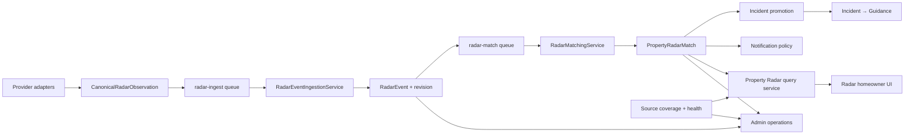
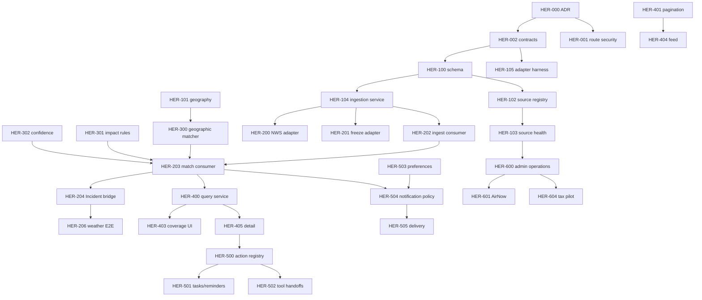

# Home Event Radar — Comprehensive Implementation Plan

| Field | Value |
| --- | --- |
| Status | In progress — HER-201 implemented |
| Version | 1.0 |
| Date | July 26, 2026 |
| Governing requirements | [Home Event Radar FRD](./HOME_EVENT_RADAR_FRD.md) |
| Current-state reference | [Home Event Radar](./HOME_EVENT_RADAR.md) |
| Delivery posture | Clean pre-launch cutover |
| User-data migration | Not required; there are no real users |

---

## Implementation Progress

| Work package | Status | Evidence |
| --- | --- | --- |
| HER-000 Architecture decision | Complete | `docs/architecture/adr-home-event-radar-canonical-pipeline.md` |
| HER-001 Secure operations routes | Complete | Homeowner routes are property-scoped; temporary writes/matching moved to capability-gated admin routes with audit records |
| HER-002 Canonical contracts | Complete for Phase 0 | Runtime-validated observation, geography, source, health, coverage, match, action, overview, feed, and detail contracts |
| HER-003 Product copy truth pass | Complete | Interim source availability, qualified empty state, and Incident handoff |
| HER-004 Critical baseline tests | Complete | Contract, route, authorization wiring, dummy-ingest, tax policy, and weather lifecycle guards |
| HER-100 Persistence schema | Complete; DB application pending | Source definitions/health/runs/coverage, event revisions, match explanation/confidence, feedback/preferences, and unique Incident bridge |
| HER-101 Canonical property geography | Complete; DB application pending | Normalized ZIP/FIPS, geocoding state/version, PostGIS geography columns and GIST indexes, location-change invalidation |
| HER-102 Source registry service | Complete; DB application pending | Validated registration, safe configuration projection, runtime policy, freshness, and jurisdiction/radius/polygon coverage |
| HER-103 Source run and health service | Complete; DB application pending | Idempotent attempts, explicit success/empty/partial/failed/skipped outcomes, health transitions, and zero-coverage skip |
| HER-104 Canonical ingestion service | Complete; DB application pending | Validated exact-source identity, immutable revisions, deterministic fingerprints, lifecycle/stale guards, provenance, serializable per-observation transactions, and idempotent match enqueue |
| HER-105 Source adapter harness | Complete | Shared conformance runner verifies canonical output, exact-source/revision identity, UTC dates, URL allowlisting, geography, lifecycle mappings, persistable evidence, and invalid-payload rejection |
| HER-106 Test-only fixture provider | Complete; DB application pending | Deterministic canonical fixtures use family-specific test sources, source-run health, immutable ingestion/revision, match enqueue, production rejection, bounded property scope, and explicit Test data labeling |
| HER-200 NWS adapter | Complete; DB application pending | NWS CAP alerts now use source runs and canonical ingestion with shared identity, polygon/MultiPolygon geography, full provider evidence, conservative health semantics, and no direct Incident/Guidance writes |
| HER-201 Freeze forecast adapter | Complete; DB application pending | Open-Meteo forecasts now use source runs and canonical property-scoped ingestion with stable identity, immutable refresh revisions, verified warm resolution, conservative failure semantics, and no direct Incident/Guidance writes |
| HER-202+ | Not started | Durable consumers, matching, homeowner APIs, actions, and operations remain |

Implementation constraint: Prisma schema changes may be committed in later phases, but migration
scripts will not be created by this implementation. The repository owner will perform database
migration/reset work. No real-user data migration or compatibility layer is required.

---

## Table of Contents

1. [Executive Summary](#1-executive-summary)
2. [Scope and Delivery Rules](#2-scope-and-delivery-rules)
3. [Current Repository Baseline](#3-current-repository-baseline)
4. [Target Technical Shape](#4-target-technical-shape)
5. [Workstreams](#5-workstreams)
6. [Phase 0 — Decisions, Safety, and Contracts](#6-phase-0--decisions-safety-and-contracts)
7. [Phase 1 — Source, Event, and Persistence Foundation](#7-phase-1--source-event-and-persistence-foundation)
8. [Phase 2 — Weather Convergence and Durable Processing](#8-phase-2--weather-convergence-and-durable-processing)
9. [Phase 3 — Matching, Lifecycle, and Reconciliation](#9-phase-3--matching-lifecycle-and-reconciliation)
10. [Phase 4 — Homeowner API and Experience](#10-phase-4--homeowner-api-and-experience)
11. [Phase 5 — Actions, Notifications, and Guidance](#11-phase-5--actions-notifications-and-guidance)
12. [Phase 6 — Additional Sources and Operations](#12-phase-6--additional-sources-and-operations)
13. [Testing Strategy](#13-testing-strategy)
14. [Deployment and Pre-Launch Cutover](#14-deployment-and-pre-launch-cutover)
15. [Observability and Operational Readiness](#15-observability-and-operational-readiness)
16. [Security Verification](#16-security-verification)
17. [Work Package Dependency Map](#17-work-package-dependency-map)
18. [Recommended Delivery Sequence](#18-recommended-delivery-sequence)
19. [Risk Register](#19-risk-register)
20. [Definition of Done](#20-definition-of-done)
21. [File-Level Implementation Map](#21-file-level-implementation-map)

---

## 1. Executive Summary

This plan converts the
[Home Event Radar FRD](./HOME_EVENT_RADAR_FRD.md)
into a direct pre-launch repository implementation.

The current feature already includes useful event, match, state, action, Incident-promotion, and
frontend components. The implementation shall reuse proven concepts but replace the split runtime
behavior in which real weather writes directly to `Incident` while Radar remains empty.

The program has six delivery outcomes:

1. **Truth and safety** — remove unsafe public ingestion and disclose actual property coverage.
2. **Canonical foundation** — one source and observation contract with event revisions and health.
3. **Live weather convergence** — existing NWS/freeze workers feed Radar and promote once.
4. **Correct matching** — geospatial, unknown-safe, retryable, and reconcilable.
5. **Complete homeowner loop** — source-aware feed, detail, actions, notifications, and feedback.
6. **Operational scale** — source operations, additional providers, metrics, and launch gates.

### 1.1 Recommended delivery shape

| Delivery model | Expected elapsed time | Notes |
| --- | ---: | --- |
| One cross-functional squad | 12–16 weeks | More sequential backend/frontend integration |
| Two coordinated squads | 8–12 weeks | Platform/source and experience/action work overlap after contracts freeze |

These are planning ranges. Phase exits depend on evidence, not elapsed time.

### 1.2 Required roles

- Product owner;
- backend/platform engineer;
- worker/integration engineer;
- frontend engineer;
- product designer;
- analytics/operations owner;
- security reviewer;
- domain reviewer for weather and each added source.

### 1.3 Clean-cutover advantage

There are no real users. Therefore the implementation shall not spend time on:

- legacy user-state backfill;
- old event ID preservation;
- long-lived DTO compatibility;
- dual-feed reads;
- dual-write reconciliation;
- gradual cohort migration;
- synthetic event-history preservation.

Database schema application/reset remains required, but the repository implementation will change
the Prisma schema only. Migration scripts and database execution are owned by the repository
owner. Existing pre-launch Radar data may be reset.

---

## 2. Scope and Delivery Rules

### 2.1 In scope

- canonical source-definition and observation contracts;
- secure internal/service ingestion;
- canonical event revision and lifecycle;
- durable ingestion/matching;
- NWS and freeze pipeline convergence;
- Incident/Guidance single-promotion path;
- source coverage and health;
- geographic matching including county and polygon;
- unknown-safe impact/confidence;
- property/event reconciliation;
- server-backed feed/filter/pagination;
- coverage-aware homeowner UX;
- provenance, feedback, actions, and notification preferences;
- source operations and anomaly detection;
- test fixtures, acceptance automation, and documentation;
- initial additional-source integrations selected by product.

### 2.2 Out of scope

- real-user migration;
- permanent legacy compatibility;
- national utility coverage without a provider decision;
- insurance-market alerts without an authoritative source;
- ML/LLM eligibility or severity scoring;
- emergency dispatch;
- generic local-news/community feed;
- rebuilding the entire Incident or Guidance Engine.

### 2.3 Delivery rules

1. A source worker writes canonical observations, not homeowner Incident rows.
2. Incident promotion occurs only from `PropertyRadarMatch`.
3. Guidance creation occurs only from the linked Incident bridge.
4. Unsupported source families are not marketed as active.
5. Unknown facts are not converted to negative facts.
6. Provider failure is never treated as confirmed clear.
7. All source/event/match writes are idempotent and retryable.
8. Public homeowner routes cannot create or globally match events.
9. Every phase must leave tests and source observability stronger than it found them.
10. No long-lived fallback architecture is permitted merely because the old code exists.

---

## 3. Current Repository Baseline

### 3.1 Backend files to reuse/refactor

| File | Current responsibility | Target |
| --- | --- | --- |
| `services/homeEventRadar.service.ts` | Feed, detail, state, analytics, manual event upsert | Split query/state from admin/source operations |
| `services/homeEventRadarMatcher.service.ts` | Location matching, impact, Signal and Incident publication | Extract rule engine; add confidence/geospatial/reconciliation |
| `controllers/homeEventRadar.controller.ts` | Public feed plus unsafe operations handlers | Keep property handlers; remove/move operations |
| `routes/homeEventRadar.routes.ts` | Public and operations routes | Public property routes only |
| `validators/homeEventRadar.validators.ts` | Event and property DTO validation | Replace manual ingest schema with new API contracts |
| `services/incidents/incident.service.ts` | Incident lifecycle and Guidance bridge | Reuse; add match linkage/update/resolve semantics |
| `services/severeWeatherAlert.service.ts` | NWS retrieval/normalization | Reuse retrieval; adapt to canonical observation |
| `services/taxAssessmentFetch.service.ts` | Tax jurisdiction lookup/fetch | Refactor after source foundation |

### 3.2 Worker files to reuse/refactor

| File | Current responsibility | Target |
| --- | --- | --- |
| `jobs/severeWeatherAlerts.job.ts` | NWS → Incident + Guidance | NWS → canonical Radar observation |
| `jobs/freezeRiskIncidents.job.ts` | Forecast → Incident + Guidance | Forecast → canonical Radar observation |
| `jobs/ingestTaxAssessmentEvents.job.ts` | Tax → Radar → match | Move onto shared source-run contract |
| `radar/upsertCanonicalRadarEvent.ts` | Canonical upsert | Replace with event ingestion/lifecycle service |
| `jobs/ingestRadarSignals.job.ts` | QA fixture ingest | Keep test-only through canonical contract |
| `worker.ts` | Scheduling and manual trigger | Register source jobs and durable consumers |
| `lib/metrics.ts` | Worker metrics | Add Radar pipeline metrics |

### 3.3 Frontend files to reuse/refactor

| File | Current responsibility | Target |
| --- | --- | --- |
| `HomeEventRadarPageClient.tsx` | Feed, client filters, counts, empty states | Overview + server filters/pagination + truthful states |
| `RadarFeedItem.tsx` | Basic event card | Add provenance, timing, confidence, primary action |
| `RadarDetailSheet.tsx` | Detail and personal state | Add error, source, geography, actions, feedback, Incident status |
| `RadarUtils.ts` | Labels/icons | Move contracts to typed domain helpers |
| `lib/api/client.ts` | Radar client methods | Replace with overview/feed/detail/preferences/action DTOs |
| `types/index.ts` | Broad Radar types | Prefer feature-local generated/narrow types |
| `MobileDashboardHome.tsx` | Radar summary | Consume canonical overview |

### 3.4 Deployment baseline

- `RADAR_DUMMY_INGEST_ENABLED=false` is correct and shall remain.
- `WORKER_EXTERNAL_INGEST_ENABLED=false` remains the safe group default.
- Source jobs shall use reviewed per-job overrides rather than enabling every external ingest.
- NWS/freeze per-job overrides already establish the intended pattern.
- Tax shall remain disabled until at least one validated source is configured.

---

## 4. Target Technical Shape



### 4.1 Proposed backend module boundaries

```text
apps/backend/src/modules/homeEventRadar/
  contracts/
    canonicalRadarObservation.ts
    radarApi.contracts.ts
    radarSource.contracts.ts
  domain/
    radarEventLifecycle.ts
    radarImpactRules.ts
    radarConfidence.ts
    radarPriority.ts
    radarActionRegistry.ts
  services/
    radarEventIngestion.service.ts
    radarSource.service.ts
    radarCoverage.service.ts
    radarMatching.service.ts
    radarReconciliation.service.ts
    radarIncidentBridge.service.ts
    radarNotificationPolicy.service.ts
    radarQuery.service.ts
    radarState.service.ts
  controllers/
    radar.controller.ts
    radarAdmin.controller.ts
  routes/
    radar.routes.ts
    radarAdmin.routes.ts
```

This modularization may be incremental, but the final implementation shall not leave two competing
Radar service authorities.

### 4.2 Queue model

Recommended queues:

- `radar-ingest-queue`;
- `radar-match-queue`;
- optional `radar-reconcile-queue`.

Each job carries:

- correlation ID;
- source definition ID;
- provider event/revision identity;
- canonical event ID when available;
- optional property scope;
- attempt and version metadata;
- smoke correlation ID for approved tests.

---

## 5. Workstreams

| Workstream | Scope |
| --- | --- |
| WS-A Security and governance | Route authorization, service identity, admin capability, audit |
| WS-B Source platform | Source definitions, coverage, health, adapter contract |
| WS-C Canonical event lifecycle | Identity, revisions, dedup, expiry, resolution |
| WS-D Matching and reconciliation | Geospatial, facts, impact, confidence, replay |
| WS-E Incident/Guidance | Idempotent promotion, updates, resolution |
| WS-F Homeowner API/UX | Overview, feed, detail, states, provenance, feedback |
| WS-G Actions/notifications | Destinations, tasks, preferences, delivery |
| WS-H Operations/analytics | Metrics, admin views, anomaly detection, smoke |
| WS-I Quality | Unit, integration, E2E, performance, security acceptance |

---

## 6. Phase 0 — Decisions, Safety, and Contracts

**Outcome:** unsafe operations are closed and the target contracts are frozen before deeper changes.

### HER-000 — Architecture decision record

Create an ADR recording:

- Radar is canonical external event truth;
- Incident is actionable projection;
- provider workers do not write direct Incident rows;
- direct pre-launch cutover;
- no real-user migration/compatibility requirement;
- source failure semantics;
- geospatial storage choice.

**Exit evidence**

- approved ADR;
- no unresolved ownership ambiguity between Radar, Incident, and Guidance.

### HER-001 — Secure/remove current operations routes

Remove the following from homeowner-authenticated routes:

- arbitrary event upsert;
- global event match trigger;
- canonical event debug read if not needed by homeowners.

If retained for operations, move under `/api/admin/radar`, requiring:

- `authenticate`;
- `requireMfa`;
- `requireRole(UserRole.ADMIN)`;
- `requireCapability('INTEGRATION_MANAGE')` or dedicated capability.

**Tests**

- homeowner receives 403/404;
- admin without capability receives 403;
- correctly authorized admin succeeds;
- cross-property/global mutation is audited.

### HER-002 — Canonical contracts

Implement Zod/TypeScript contracts for:

- `CanonicalRadarObservation`;
- source definition and health;
- coverage result;
- normalized geography;
- match explanation;
- recommended action;
- overview/feed/detail DTOs.

**Exit evidence**

- compile-time types;
- runtime schema tests;
- adapter golden fixtures.

### HER-003 — Product copy truth pass

Until source convergence lands:

- replace unconditional “monitors weather, insurance, utility, and tax” copy;
- add temporary partial/unavailable category status;
- prevent “No events detected” from implying full coverage.

This is an interim safety change; Phase 4 implements the final experience.

### HER-004 — Critical baseline tests

Before refactor, add tests that lock:

- public route security expectation;
- dummy production guard;
- worker policy decision for tax;
- existing NWS/freeze lifecycle behavior;
- current property authorization.

**Phase 0 exit gate**

- unsafe routes closed;
- target contracts and ADR approved;
- UI does not make unsupported monitoring claims;
- baseline tests pass.

---

## 7. Phase 1 — Source, Event, and Persistence Foundation

**Outcome:** every provider can use one validated, observable, idempotent event pipeline.

### HER-100 — Prisma schema design

Expand/refactor models to support:

- source definition and source family;
- coverage geometry/jurisdiction;
- source run/health;
- event provider identity and lifecycle;
- event revision;
- normalized spatial geography;
- match confidence/explanation/rule version;
- feedback;
- notification preferences;
- unique Incident match linkage.

Recommended Prisma concepts:

```text
RadarSourceDefinition
RadarSourceCoverage
RadarSourceRun
RadarEvent
RadarEventRevision
PropertyRadarMatch
PropertyRadarState
PropertyRadarAction
PropertyRadarFeedback
PropertyRadarNotificationPreference
```

`Incident` shall gain a nullable unique `propertyRadarMatchId` or equivalent unique bridge model.

**Pre-launch handling**

- update the Prisma schema without creating a migration script; the repository owner will apply
  the database migration/reset;
- no user-state backfill;
- permit reset of existing pre-launch Radar tables;
- do not write a legacy compatibility migration.

### HER-101 — Canonical property geography

Confirm/add:

- latitude;
- longitude;
- county;
- county FIPS;
- normalized ZIP;
- geocoding status/version.

Choose and configure PostGIS or an approved equivalent.

**Tests**

- coordinate bounds;
- ZIP normalization;
- FIPS normalization;
- point/polygon query fixtures;
- property update invalidates location-derived coverage/matches.

### HER-102 — Source registry service

Build one backend source authority providing:

- source validation;
- enabled/disabled/degraded state;
- worker policy decision;
- coverage;
- supported event types;
- schedules and freshness;
- adapter version;
- safe configuration access.

Remove or repurpose unused `RadarSourceConfig`.

### HER-103 — Source run and health service

Every source execution records:

- started/finished;
- success, successful-empty, partial, failed, skipped;
- observations received/rejected;
- events created/updated/resolved;
- properties/matches evaluated;
- retry/rate-limit information;
- last error;
- correlation ID.

The worker handler must return a structured `WorkerRunResult`; zero configured jurisdictions cannot
silently look like a meaningful successful ingest.

### HER-104 — Canonical ingestion service

Implement:

- observation validation;
- exact-source event identity;
- revision idempotency;
- canonical lifecycle transitions;
- provenance;
- payload fingerprint;
- match job enqueue;
- per-observation transaction boundaries.

Implementation note: `radarEventIngestion.service.ts` now validates each observation against its
registered source and active source run, persists exact-source event identity plus immutable
revision evidence, rejects conflicting/stale lifecycle changes, and enqueues a deterministic
revision-scoped match job. Batch ingestion intentionally commits or rejects each observation
independently. Queue submission is retry-safe: replaying a committed revision attempts the same
BullMQ job ID without creating another event or revision.

### HER-105 — Source adapter harness

Provide a shared test harness that asserts:

- valid canonical observation;
- stable event identity;
- revision identity;
- normalized dates/timezones;
- safe source URLs;
- geography contract;
- resolution/supersession mapping;
- invalid payload behavior.

Implementation note: `adapterConformance.ts` exercises adapters with the same canonical schema and
fingerprint/revision functions used by ingestion. A conforming adapter must provide explicit
resolution and supersession cases, reject declared invalid inputs, emit UTC timestamps and
normalized geography, keep exact-source identity stable across revisions, and restrict any
canonical source link to a reviewed HTTPS host. `canonicalDummyRadarAdapter.ts` is the first
conforming adapter and is now the normalization boundary used by the HER-106 fixture job.

### HER-106 — Test-only fixture provider

Refactor dummy Radar fixtures to use the same canonical observation and queues. Keep:

- production startup guard;
- explicit test source label;
- visual “Test data” marking outside production;
- allowlisted property scope.

Implementation note: `ingestRadarSignals.job.ts` no longer upserts `RadarEvent` or invokes the
legacy matcher directly. It registers family-specific `manual_import` test sources, begins and
completes source runs, normalizes deterministic 30-minute fixture revisions, and calls the
canonical ingestion service that enqueues revision-scoped matching. Every source, event title,
payload, and run carries explicit Test data provenance. The job rejects production independently
of the worker startup guard and bounds selection to explicit IDs or reviewed ZIP allowlists.
Reset and reseed procedures are documented in
`docs/operations/HOME_EVENT_RADAR_TEST_FIXTURES.md`.

**Phase 1 exit gate**

Satisfied in code; database schema application remains owner-managed:

- schema and source services implemented;
- one fixture source completes ingest → revision → match enqueue;
- source health distinguishes empty and failed;
- no public arbitrary ingest route;
- reset/reseed procedure documented.

---

## 8. Phase 2 — Weather Convergence and Durable Processing

**Outcome:** real NWS and freeze events populate Radar with one Incident/Guidance path.

### HER-200 — NWS adapter

Refactor `severeWeatherAlerts.job.ts`:

- retain efficient per-ZIP/point caching and conservative fetch outcome behavior;
- map each NWS alert to `CanonicalRadarObservation`;
- preserve NWS ID, references, severity, certainty, urgency, effective, onset, expiration, polygon,
  instructions, and source URL;
- enqueue canonical ingestion;
- remove direct `IncidentService.upsertIncident`;
- remove direct `guidanceJourneyService.ingestSignal`.

Implementation note: `nwsRadarAdapter.ts` passes the shared adapter conformance harness and
preserves CAP identity, revisions, references, severity, certainty, urgency, effective/onset/end
times, instructions, source URL, and Polygon/MultiPolygon geometry. The NWS job retains per-ZIP
fetch caching, deduplicates provider alerts across properties, records success/successful-empty/
partial/failed source outcomes, and sends accepted observations through canonical ingestion.
Provider failures never update freshness or project a false clear state. Direct Incident and
Guidance writes have been removed; those projections remain downstream responsibilities.

### HER-201 — Freeze forecast adapter

Refactor `freezeRiskIncidents.job.ts`:

- retain forecast timeout and property geo caching;
- create one canonical freeze event per property or geographic cell and forecast window;
- model forecast refresh as a revision;
- model no-longer-freezing after a successful forecast as resolution;
- remove direct Incident/Guidance writes.

Evaluate whether ZIP-shared canonical events are safe and more efficient than property-scoped events.
Prefer shared geography when forecast inputs and thresholds are identical.

Implementation note: `freezeRadarAdapter.ts` passes the shared adapter conformance harness and
preserves the forecast window, minimum temperature, coordinates, provider URL, threshold, and raw
hourly samples. The event identity is stable per property while every materially changed forecast
becomes an immutable revision. Property scope is intentional: Open-Meteo is queried at each
property's coordinates, so ZIP sharing could merge forecast inputs that are not identical and
could resolve one property's event from another property's warmer point forecast. The job retains
its eight-second provider timeout, in-run geography cache, and per-property failure isolation.
Only a successful warm forecast may resolve an existing active event; provider failure preserves
the prior lifecycle and does not advance freshness. Direct Incident and Guidance writes have been
removed.

### HER-202 — Durable ingest consumer

Implement BullMQ consumer with:

- idempotent observation handling;
- bounded retry/backoff;
- dead-letter/failure history;
- metrics;
- graceful shutdown;
- concurrency appropriate to database/provider workload.

### HER-203 — Durable match consumer

Implement matching consumer separately from ingestion:

- event/revision-driven match;
- per-property isolation;
- resumable pagination;
- retry of failed property scopes;
- structured outcome;
- no unbounded all-property transaction.

### HER-204 — Incident promotion bridge

Extract from the matcher into a dedicated service:

- unique `propertyRadarMatchId` linkage;
- create/update existing open Incident;
- map impact/confidence to Incident severity;
- preserve source/event/match provenance;
- use `IncidentService.setStatus` for resolution;
- permit only one Guidance bridge.

### HER-205 — Weather lifecycle convergence

Implement:

- NWS references/supersession;
- provider expiration;
- explicit resolution;
- conservative failure;
- stale safety net;
- canonical Recently Ended retention.

### HER-206 — Weather end-to-end acceptance

Fixtures:

- watch;
- warning;
- alert escalation;
- extended expiration;
- superseded alert;
- resolved alert;
- provider failed-empty;
- provider successful-empty;
- freeze starts/continues/ends.

Assert exact counts of:

- canonical events;
- revisions;
- property matches;
- incidents;
- journeys;
- notifications suppressed/eligible.

**Phase 2 exit gate**

- real weather appears in Radar;
- direct weather-to-Incident path removed;
- duplicate Incident/Journey count is zero;
- provider failure does not clear alerts;
- p95 test latency objective is met in representative fixtures.

---

## 9. Phase 3 — Matching, Lifecycle, and Reconciliation

**Outcome:** property relevance is accurate, explainable, and self-healing.

### HER-300 — Geographic matcher

Implement indexed rules for:

- exact property;
- point distance;
- radius;
- normalized ZIP;
- city/state;
- county FIPS;
- state;
- point-in-polygon.

Return an explanation:

```text
Matched because the property's canonical point is inside NWS polygon ...
Matched because property county FIPS equals ...
```

### HER-301 — Impact-rule refactor

Move event-family calculations into pure tested rules.

Requirements:

- no database calls in pure computation;
- unknown/false/true handled separately;
- no construction-year system-age fallback without explicit assumption;
- all driver codes stable;
- responsibility decisions applied;
- rule version recorded;
- input facts traceable.

### HER-302 — Confidence engine

Implement bounded components:

- source;
- geography;
- freshness;
- property completeness;
- domain evidence.

Return:

- numeric internal score;
- High/Medium/Low band;
- missing-fact reasons;
- homeowner explanation.

### HER-303 — Priority engine

Replace feed-time global signal blending with a documented bounded function.

Priority must:

- remain ordering-only;
- use time-to-onset;
- avoid stale global boosts;
- expose diagnostic components to operations;
- be deterministic;
- have stable tie-breakers.

### HER-304 — Match lifecycle

Implement:

- visible Now/Upcoming/Recently Ended status;
- material update detection;
- retraction;
- source-stale marker;
- event-to-match resolution;
- match no-longer-applicable handling.

### HER-305 — Property reconciliation

Trigger reconciliation on:

- property created;
- address/coordinates/FIPS changed;
- relevant property facts changed;
- responsibility changed;
- mitigation/completion changed.

Use event publication or a bounded job. Avoid synchronous full matching inside property update
requests.

### HER-306 — Scheduled safety-net reconciliation

Add a periodic job that:

- finds active events with incomplete/failed matching;
- finds covered properties missing expected source evaluation;
- retries failed claims;
- expires stale lifecycle records according to source policy;
- reports structured outcomes.

### HER-307 — Tax routing correction

Before tax pilot:

- route coverage based on `coverageType`;
- support county FIPS instead of city-only key construction;
- batch/cache data source lookup;
- add fetch timeout;
- escape/query-build safely;
- validate `datasetId` and field mapping;
- validate parcel/address confidence;
- add lifecycle/TTL rather than open-ended forever;
- return structured run results.

**Phase 3 exit gate**

- all geography types accepted by FRD have tests;
- unknown fact scenarios cannot inflate risk;
- property change fixtures reconcile matches;
- matching failures are retried and observable;
- tax remains disabled unless pilot source acceptance passes.

---

## 10. Phase 4 — Homeowner API and Experience

**Outcome:** the page communicates coverage and events truthfully and scales beyond one page.

### HER-400 — Query service

Create dedicated read/query service for:

- overview;
- coverage;
- counts;
- feed;
- detail;
- state views.

Do not refresh unrelated shared signals synchronously during every feed request. Source/match state
must already be materialized.

### HER-401 — Stable server pagination

Define ordering and cursor contract.

Recommended default order:

1. active before upcoming before recently ended;
2. priority band/score descending;
3. effective time descending;
4. ID deterministic tie-breaker.

Cursor encodes every ordering column. Add concurrency fixtures proving no skip/duplicate.

### HER-402 — Server-backed filters and totals

Implement filters for:

- lifecycle/time group;
- source family;
- provider severity;
- property impact;
- confidence;
- saved/dismissed;
- new/updated.

Return authoritative counts independent of the loaded page.

### HER-403 — Coverage-aware UI

Refactor `HomeEventRadarPageClient` to consume overview and feed:

- Active/Partial/Degraded/Uncovered/Setup states;
- per-category coverage;
- last successful check;
- no unsupported claims;
- retry/degraded messaging;
- source freshness.

### HER-404 — Event feed and card

Update card with:

- source label;
- effective/expiration timing;
- provider severity;
- property impact;
- confidence when limited;
- updated state;
- primary action;
- accessible label.

### HER-405 — Event detail

Add:

- official/provider details;
- source link;
- issued/updated/expires;
- geography explanation;
- impact factors;
- missing facts/correction paths;
- confidence;
- matched systems;
- actions/destinations;
- related Incident/Guidance;
- explicit detail error/retry.

### HER-406 — Deep links

Support URL state:

```text
?view=now&family=weather&matchId=<id>
```

Notification, Unified Home, Guidance, and support links must open the correct property/match.

### HER-407 — State and feedback

Implement:

- personal state mutation;
- restore dismissed;
- wrong location;
- not relevant;
- duplicate;
- stale;
- optional comment with bounded safe text.

### HER-408 — Frontend acceptance

Automate:

- every overview state;
- filters and pagination;
- mobile/desktop detail;
- keyboard and screen-reader behavior;
- deep-link open/close;
- error/retry;
- state isolation;
- feedback;
- unsupported category hidden/unavailable.

**Phase 4 exit gate**

- screenshot-observed zero feed becomes a truthful covered/uncovered/degraded state;
- all counts and filters are server authoritative;
- no detail error is silently presented as valid fallback content;
- supported browsers/mobile acceptance passes.

---

## 11. Phase 5 — Actions, Notifications, and Guidance

**Outcome:** relevant events lead to bounded, trackable homeowner action.

### HER-500 — Action registry

Define reviewed action codes with:

- label template;
- event families;
- minimum impact/confidence;
- destination type;
- target capability/route;
- required context;
- responsibility applicability;
- completion evidence;
- safety classification.

No unknown action code may become a generic unsafe link.

### HER-501 — Task/reminder integration

Support:

- create maintenance task;
- create reminder;
- link existing task;
- household assignee;
- due date derived from event onset/expiration when safe;
- lineage back to match.

### HER-502 — Tool and provider handoffs

Implement reviewed destinations:

- Coverage Intelligence;
- Service Price Radar;
- system/maintenance pages;
- Document Vault;
- provider search/booking;
- official provider instructions.

Preserve source/match/incident/journey launch context.

### HER-503 — Notification preference persistence

Add per-user/property preferences:

- categories;
- channels;
- minimum impact/severity;
- immediate/digest;
- quiet hours;
- timezone.

### HER-504 — Notification eligibility/dedup

Build deterministic policy:

- one notification per material event revision;
- escalation allowed;
- resolution non-interruptive;
- confidence floor;
- quiet hours;
- user preferences;
- channel availability;
- test/synthetic suppression.

### HER-505 — Notification delivery integration

Use existing Notification infrastructure. Create in-app notifications even when outbound channels
are disabled, where policy permits.

### HER-506 — Incident/Guidance UI continuity

Radar detail shall show:

- incident status;
- active guidance journey;
- current step;
- “Continue resolution” destination;
- resolution state.

Personal dismiss does not close the Incident.

### HER-507 — Unified Home summary

Use Radar overview/read model to show:

- active material event count;
- most urgent explainable match;
- monitoring degraded state when material;
- canonical deep link.

**Phase 5 exit gate**

- every surfaced primary action has a safe destination or explicit informational classification;
- duplicate notifications are prevented in escalation fixtures;
- quiet hours and preferences pass;
- action lineage reaches task/tool/Incident/Guidance completion.

---

## 12. Phase 6 — Additional Sources and Operations

**Outcome:** expand coverage deliberately and operate it safely.

### HER-600 — Admin source operations

Build:

- source list/detail;
- coverage map/count;
- health/run history;
- test fetch;
- scoped run;
- event lineage;
- replay;
- kill switch;
- anomaly view.

Enforce Admin + MFA + capability.

### HER-601 — AirNow adapter

Add:

- current/forecast AQI;
- smoke/particle event thresholds;
- point/geographic coverage;
- freshness;
- health;
- HVAC/filter action mapping.

### HER-602 — USGS adapter

Add only with reviewed materiality rules:

- real-time GeoJSON;
- magnitude/distance thresholds;
- point/radius matching;
- update lifecycle;
- non-alarmist copy for low-impact distant events.

### HER-603 — OpenFEMA adapter

Add:

- declaration lifecycle;
- county/state geography;
- slower-frequency monitoring;
- recovery/documentation guidance;
- clear distinction from immediate hazard alert.

### HER-604 — Tax pilot

Select one real jurisdiction and complete:

- source config;
- field map;
- query contract;
- parcel-match validation set;
- false-match review;
- assessment lifecycle/TTL;
- appeal-information governance;
- monitored property acceptance.

Only after acceptance add:

```text
WORKER_JOB_TAX_ASSESSMENT_INGEST_ENABLED=true
```

### HER-605 — Utility source decision

Produce a product/engineering decision covering:

- paid aggregator versus territory integrations;
- launch territories;
- licensing;
- API/SLA;
- service-territory mapping;
- outage restoration lifecycle;
- cost and rate limits.

Do not activate Utility category before implementation.

### HER-606 — Insurance source decision

Keep Insurance unavailable until:

- authoritative source identified;
- state/jurisdiction coverage understood;
- update frequency and filing semantics validated;
- homeowner copy reviewed;
- financial/commercial governance approved.

### HER-607 — Compound-event rules

After multi-source stability, add reviewed correlations such as:

- heavy rain + outage + no confirmed sump backup;
- smoke + aging/unknown HVAC filter state;
- freeze + electric heat + outage;
- severe weather + unresolved roof issue.

Compound rules cannot invent provider severity and must expose each source.

**Phase 6 exit gate**

- every activated category has real source coverage;
- source operations supports failure diagnosis;
- provider-specific acceptance fixtures pass;
- unsupported categories remain truthful.

---

## 13. Testing Strategy

### 13.1 Test pyramid

| Layer | Coverage |
| --- | --- |
| Pure unit | Normalization, lifecycle, dedup, impact, confidence, priority, action policy |
| Adapter contract | Provider fixtures → canonical observation |
| Service integration | Observation → event/revision → match → Incident/Guidance |
| Database integration | Constraints, spatial matching, pagination, tenant isolation |
| Worker integration | Queue retry, idempotency, run outcomes, failure semantics |
| API contract | Overview/feed/detail/state/feedback/preferences/admin auth |
| Frontend component | Coverage states, cards, detail, filters, actions |
| Playwright | Mobile/desktop homeowner journey and admin smoke |
| Performance | Feed query, spatial match, source batch, replay |
| Security | Authz, tenant access, URL/text sanitization, payload limits |

### 13.2 Required golden fixtures

Properties:

- complete profile;
- incomplete/unknown profile;
- rental/association responsibility;
- ZIP-only before geocoding;
- canonical point + county/FIPS;
- inside/outside polygon;
- newly created after active event;
- relocated property.

Events:

- property;
- ZIP;
- county;
- polygon;
- point/radius;
- active;
- upcoming;
- updated;
- superseded;
- resolved;
- expired;
- retracted;
- stale source;
- successful-empty source;
- failed source.

### 13.3 Exact-count invariant tests

For repeated input, assert exact counts:

```text
provider event: 1
canonical event: 1
material revisions: expected N
property match per property: 0 or 1
open Incident per match: 0 or 1
active Guidance Journey per promoted Incident/template: 0 or 1
notification per material revision/user policy: 0 or 1
```

### 13.4 Security tests

- authenticated homeowner cannot access admin Radar routes;
- homeowner A cannot read/mutate homeowner B property match;
- collaborator role limits shared actions;
- arbitrary provider URLs/scripts are not rendered unsafely;
- source config secrets are never returned;
- replay requires correct capability;
- broad operations are audited.

### 13.5 Regression command set

The final implementation shall document exact commands for:

- backend typecheck/unit/integration;
- workers typecheck/unit/integration;
- frontend typecheck/unit;
- targeted Playwright Radar suite;
- Prisma validation;
- Docker worker build/import-boundary check;
- deployment smoke.

---

## 14. Deployment and Pre-Launch Cutover

### 14.1 No user migration

There are no real users. Do not implement:

- legacy state transformation;
- event/match ID mapping;
- old/new feed merging;
- compatibility read;
- background historical backfill for users.

### 14.2 Cutover sequence

1. Merge contracts, schema, and source services behind a launch-closed Radar flag if necessary.
2. Apply Prisma migration.
3. Stop legacy Radar dummy/source jobs.
4. Clear existing pre-launch/synthetic Radar data using an explicit reviewed script.
5. Seed reviewed source definitions.
6. Deploy durable ingest/match consumers.
7. Deploy NWS/freeze canonical adapters with direct Incident writes removed.
8. Run allowlisted property smoke.
9. Verify exact event/match/Incident/Journey counts.
10. Deploy coverage-aware frontend.
11. Enable Radar capability for internal acceptance.
12. Exercise provider failure, resolution, rollback, and kill-switch drills.
13. Open pre-launch gate only after FRD acceptance passes.

### 14.3 Data reset order

The reset script shall target explicit Radar tables and follow foreign-key order. It shall not use a
broad schema/database reset in a shared environment.

Recommended reset scope:

- Radar notification/feedback/action/state;
- PropertyRadarMatch;
- RadarEventRevision;
- RadarEvent;
- source run history;
- test-only source definitions where reseeded.

Incident/Guidance cleanup shall target only records proven to originate from pre-launch Radar test
events.

### 14.4 Rollback

Before launch, rollback may:

- close the Radar capability;
- disable source-specific jobs;
- disable notification delivery;
- keep Incident and existing non-Radar Home experience functional;
- redeploy previous application/schema-compatible version if required.

No legacy Radar feed fallback is required.

---

## 15. Observability and Operational Readiness

### 15.1 Metrics

Add:

```text
radar_source_runs_total{source,outcome}
radar_source_fetch_duration_seconds{source}
radar_source_last_success_timestamp{source}
radar_observations_total{source,outcome}
radar_events_total{source,lifecycle}
radar_event_revisions_total{source,change_type}
radar_match_attempts_total{event_type,outcome}
radar_match_duration_seconds{event_type}
radar_active_matches{source,event_type,impact}
radar_incident_promotions_total{outcome}
radar_notifications_total{channel,outcome}
radar_feed_requests_total{outcome,feed_state}
radar_feed_duration_seconds
```

### 15.2 Structured log context

Every pipeline log should include as applicable:

- correlation ID;
- source definition ID;
- source run ID;
- provider event/revision ID;
- canonical event ID;
- property ID;
- match ID;
- Incident ID;
- Guidance Journey ID;
- rule/adapter version.

### 15.3 Dashboards

Required dashboards:

1. Source availability and freshness.
2. Ingest → event → match funnel.
3. Match → Incident → notification funnel.
4. Homeowner feed states and errors.
5. Feedback/false-positive quality.

### 15.4 Alerts

Required alert rules:

- source freshness breach;
- repeated source failure;
- queue backlog age;
- dead-letter growth;
- non-zero events/zero matches anomaly;
- covered properties reporting uncovered;
- duplicate Incident constraint failures;
- active stale-event growth;
- feed API error/latency breach;
- notification volume spike.

---

## 16. Security Verification

### 16.1 Required review points

- route middleware order;
- Admin/MFA/capability enforcement;
- service-to-worker trust boundary;
- property authorization;
- household action role;
- raw payload storage and redaction;
- provider source URL allowlisting;
- source config secret handling;
- audit completeness;
- replay/broad operation safeguards.

### 16.2 Security launch gate

Launch is blocked if:

- any homeowner token can create or globally match canonical events;
- any match detail is readable outside authorized property context;
- admin source operations omit MFA/capability;
- raw provider payload is rendered directly;
- provider secrets can be returned or logged;
- broad replay lacks an explicit audited operator action.

---

## 17. Work Package Dependency Map



---

## 18. Recommended Delivery Sequence

### 18.1 Two-squad sequence

| Weeks | Platform/source squad | Experience/action squad |
| --- | --- | --- |
| 1 | ADR, security, contracts | Copy truth pass, UX states/design |
| 2–3 | Schema, source registry, health, geography | Overview/feed/detail DTO client foundations |
| 3–5 | Ingestion/match queues, NWS/freeze adapters | Coverage UI, cards, detail, deep links |
| 5–7 | Geospatial matcher, impact/confidence, reconciliation | Server filters/pagination integration, feedback |
| 7–9 | Incident lifecycle, metrics, admin operations | Actions, preferences, notifications |
| 9–10 | Additional source pilot, performance | Unified Home, accessibility, E2E |
| 11–12 | Failure/rollback/security drills | Cross-browser acceptance and launch evidence |

### 18.2 Minimum credible launch scope

Do not wait for every source. Minimum credible launch is:

- secure operations;
- truthful coverage;
- NWS and freeze in Radar;
- durable matching;
- provider lifecycle/resolution;
- Incident/Guidance single path;
- provenance/freshness;
- stable server feed;
- source health;
- critical automated acceptance.

AirNow, tax, utility, insurance, compound intelligence, and richer action execution can follow.

---

## 19. Risk Register

| ID | Risk | Likelihood | Impact | Mitigation |
| --- | --- | --- | --- | --- |
| R-01 | Direct weather path remains and duplicates incidents | Medium | Critical | Delete direct writes; unique match linkage; exact-count E2E |
| R-02 | Source outage resolves active alerts | Medium | High | Successful-fetch flag; conservative lifecycle |
| R-03 | PostGIS/deployment support unavailable | Medium | High | Confirm in ADR/Phase 0 before schema; approved alternative |
| R-04 | Property coordinates/FIPS incomplete | High | High | Setup state, geocoding reconciliation, coverage diagnostics |
| R-05 | Unknown facts continue inflating impact | Medium | High | Pure three-valued rules and golden fixtures |
| R-06 | Queue adds operational complexity | Medium | Medium | Reuse BullMQ conventions, shared metrics/shutdown/lease patterns |
| R-07 | Tax parcel query false matches | High | High | Pilot validation, confidence threshold, parcel/address evidence |
| R-08 | Notification fatigue | Medium | High | Preferences, confidence floor, material-update dedup |
| R-09 | Unsupported filters remain visible | Medium | Medium | Coverage-driven category UI |
| R-10 | Source jobs false-green on zero work | High | Medium | Structured source-run outcomes and alerts |
| R-11 | Broad replay overloads DB | Medium | High | Bounded claims, cursor pagination, concurrency/kill switch |
| R-12 | Existing docs diverge | High | Low | Mark current-state doc as implementation reference; update after delivery |

---

## 20. Definition of Done

Home Event Radar is complete for launch only when:

1. All FRD P0/P1 acceptance scenarios pass.
2. Every launch property has at least one active real source.
3. NWS/freeze events appear in Radar.
4. No direct provider-to-Incident duplicate path remains.
5. Unsupported categories are not represented as monitored.
6. Coverage, last successful check, source, freshness, impact, and confidence are visible.
7. County/polygon matching works for sources that require it.
8. Unknown facts cannot increase impact as confirmed vulnerabilities.
9. Matching and promotion are durable, idempotent, replayable, and observable.
10. Property create/location/fact changes reconcile active events.
11. Feed pagination and totals are correct under concurrency tests.
12. Homeowner, tenant, Admin, MFA, and capability authorization tests pass.
13. Source failures are distinguishable from confirmed clear.
14. Critical event lifecycle and duplicate-count tests pass.
15. Production dummy ingest remains disabled.
16. Source-specific kill switches and rollback drills pass.
17. Documentation and runbooks reflect the shipped architecture.

---

## 21. File-Level Implementation Map

### 21.1 Expected new files

```text
apps/backend/src/modules/homeEventRadar/contracts/canonicalRadarObservation.ts
apps/backend/src/modules/homeEventRadar/contracts/radarApi.contracts.ts
apps/backend/src/modules/homeEventRadar/contracts/radarSource.contracts.ts
apps/backend/src/modules/homeEventRadar/domain/radarEventLifecycle.ts
apps/backend/src/modules/homeEventRadar/domain/radarImpactRules.ts
apps/backend/src/modules/homeEventRadar/domain/radarConfidence.ts
apps/backend/src/modules/homeEventRadar/domain/radarPriority.ts
apps/backend/src/modules/homeEventRadar/domain/radarActionRegistry.ts
apps/backend/src/modules/homeEventRadar/services/radarEventIngestion.service.ts
apps/backend/src/modules/homeEventRadar/services/radarSource.service.ts
apps/backend/src/modules/homeEventRadar/services/radarCoverage.service.ts
apps/backend/src/modules/homeEventRadar/services/radarMatching.service.ts
apps/backend/src/modules/homeEventRadar/services/radarReconciliation.service.ts
apps/backend/src/modules/homeEventRadar/services/radarIncidentBridge.service.ts
apps/backend/src/modules/homeEventRadar/services/radarNotificationPolicy.service.ts
apps/backend/src/modules/homeEventRadar/services/radarQuery.service.ts
apps/backend/src/modules/homeEventRadar/services/radarState.service.ts
apps/backend/src/modules/homeEventRadar/controllers/radar.controller.ts
apps/backend/src/modules/homeEventRadar/controllers/radarAdmin.controller.ts
apps/backend/src/modules/homeEventRadar/routes/radar.routes.ts
apps/backend/src/modules/homeEventRadar/routes/radarAdmin.routes.ts

apps/workers/src/jobs/radarSourceReconciliation.job.ts
apps/workers/src/jobs/radarMatchReconciliation.job.ts
apps/workers/src/radar/adapters/nwsRadar.adapter.ts
apps/workers/src/radar/adapters/freezeRadar.adapter.ts
apps/workers/src/radar/adapters/airNowRadar.adapter.ts
apps/workers/src/radar/consumers/radarIngest.consumer.ts
apps/workers/src/radar/consumers/radarMatch.consumer.ts

apps/frontend/src/features/homeEventRadar/api.ts
apps/frontend/src/features/homeEventRadar/types.ts
apps/frontend/src/features/homeEventRadar/queryKeys.ts
apps/frontend/src/features/homeEventRadar/radarUiState.ts
apps/frontend/src/features/homeEventRadar/components/RadarCoverageStrip.tsx
apps/frontend/src/features/homeEventRadar/components/RadarMonitoringStatus.tsx
apps/frontend/src/features/homeEventRadar/components/RadarEventCard.tsx
apps/frontend/src/features/homeEventRadar/components/RadarEventDetail.tsx
apps/frontend/src/features/homeEventRadar/components/RadarPreferences.tsx
```

### 21.2 Expected modified/retired files

```text
apps/backend/prisma/schema.prisma
apps/backend/src/index.ts
apps/backend/src/config/workerJobRegistry.ts
apps/backend/src/services/incidents/incident.service.ts
apps/backend/src/services/severeWeatherAlert.service.ts
apps/backend/src/services/taxAssessmentFetch.service.ts
apps/backend/src/routes/homeEventRadar.routes.ts              # retire/replace
apps/backend/src/controllers/homeEventRadar.controller.ts     # retire/replace
apps/backend/src/services/homeEventRadar.service.ts           # split/retire
apps/backend/src/services/homeEventRadarMatcher.service.ts    # split/retire
apps/backend/src/validators/homeEventRadar.validators.ts      # replace

apps/workers/src/worker.ts
apps/workers/src/jobs/severeWeatherAlerts.job.ts
apps/workers/src/jobs/freezeRiskIncidents.job.ts
apps/workers/src/jobs/ingestTaxAssessmentEvents.job.ts
apps/workers/src/jobs/ingestRadarSignals.job.ts
apps/workers/src/radar/upsertCanonicalRadarEvent.ts            # retire
apps/workers/src/lib/metrics.ts
apps/workers/tsconfig.docker.json or current shared-import packaging
infrastructure/kubernetes/base/configmap.yaml
infrastructure/kubernetes/apps/workers/deployment.yaml

apps/frontend/src/app/(dashboard)/dashboard/home-event-radar/HomeEventRadarPageClient.tsx
apps/frontend/src/components/features/homeEventRadar/RadarFeedItem.tsx
apps/frontend/src/components/features/homeEventRadar/RadarDetailSheet.tsx
apps/frontend/src/components/features/homeEventRadar/RadarUtils.ts
apps/frontend/src/lib/api/client.ts
apps/frontend/src/types/index.ts
apps/frontend/src/app/(dashboard)/dashboard/components/MobileDashboardHome.tsx

docs/functional/HOME_EVENT_RADAR.md
docs/functional/HOME_EVENT_RADAR_FRD.md
docs/functional/HOME_EVENT_RADAR_IMPLEMENTATION_PLAN.md
```

### 21.3 Required test areas/files

Add focused suites under:

```text
apps/backend/tests/unit/homeEventRadar/
apps/backend/tests/integration/homeEventRadar/
apps/workers/tests/unit/homeEventRadar/
apps/workers/tests/integration/homeEventRadar/
apps/frontend/src/features/homeEventRadar/__tests__/
apps/frontend/e2e/home-event-radar.spec.ts
```

The exact test layout may follow existing repository conventions, but all test categories in
Section 13 are mandatory.
