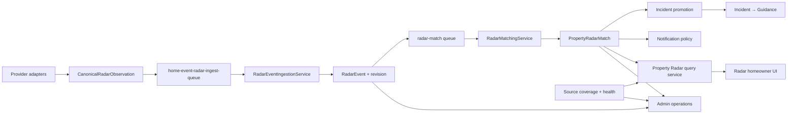
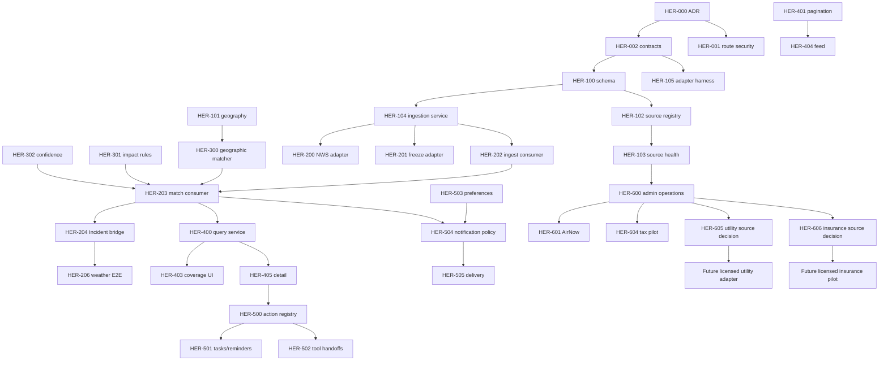

# Home Event Radar — Comprehensive Implementation Plan

| Field | Value |
| --- | --- |
| Status | In progress — HER-606 decision complete |
| Version | 1.0 |
| Date | July 26, 2026 |
| Governing requirements | [Home Event Radar FRD](./HOME_EVENT_RADAR_FRD.md) |
| Current-state reference | [Home Event Radar](./HOME_EVENT_RADAR.md) |
| Delivery posture | Clean pre-launch cutover |
| User-data migration | Not required; there are no real users |

---

## Implementation Progress

| Work package | Status | Evidence |
| --- | --- | --- |
| HER-000 Architecture decision | Complete | `docs/architecture/adr-home-event-radar-canonical-pipeline.md` |
| HER-001 Secure operations routes | Complete | Homeowner routes are property-scoped; temporary writes/matching moved to capability-gated admin routes with audit records |
| HER-002 Canonical contracts | Complete for Phase 0 | Runtime-validated observation, geography, source, health, coverage, match, action, overview, feed, and detail contracts |
| HER-003 Product copy truth pass | Complete | Interim source availability, qualified empty state, and Incident handoff |
| HER-004 Critical baseline tests | Complete | Contract, route, authorization wiring, dummy-ingest, tax policy, and weather lifecycle guards |
| HER-100 Persistence schema | Complete; DB application pending | Source definitions/health/runs/coverage, event revisions, match explanation/confidence, feedback/preferences, and unique Incident bridge |
| HER-101 Canonical property geography | Complete; DB application pending | Normalized ZIP/FIPS, geocoding state/version, PostGIS geography columns and GIST indexes, location-change invalidation |
| HER-102 Source registry service | Complete; DB application pending | Validated registration, safe configuration projection, runtime policy, freshness, and jurisdiction/radius/polygon coverage |
| HER-103 Source run and health service | Complete; DB application pending | Idempotent attempts, explicit success/empty/partial/failed/skipped outcomes, health transitions, and zero-coverage skip |
| HER-104 Canonical ingestion service | Complete; DB application pending | Validated exact-source identity, immutable revisions, deterministic fingerprints, lifecycle/stale guards, provenance, serializable per-observation transactions, and idempotent match enqueue |
| HER-105 Source adapter harness | Complete | Shared conformance runner verifies canonical output, exact-source/revision identity, UTC dates, URL allowlisting, geography, lifecycle mappings, persistable evidence, and invalid-payload rejection |
| HER-106 Test-only fixture provider | Complete; DB application pending | Deterministic canonical fixtures use family-specific test sources, source-run health, immutable ingestion/revision, match enqueue, production rejection, bounded property scope, and explicit Test data labeling |
| HER-200 NWS adapter | Complete; DB application pending | NWS CAP alerts now use source runs and canonical ingestion with shared identity, polygon/MultiPolygon geography, full provider evidence, conservative health semantics, and no direct Incident/Guidance writes |
| HER-201 Freeze forecast adapter | Complete; DB application pending | Open-Meteo forecasts now use source runs and canonical property-scoped ingestion with stable identity, immutable refresh revisions, verified warm resolution, conservative failure semantics, and no direct Incident/Guidance writes |
| HER-202 Durable ingest consumer | Complete; DB application pending | Versioned canonical jobs use deterministic same-run identity, bounded retries with jitter, retained failure history, payload limits, metrics, a global kill switch, bounded concurrency, and graceful shutdown; NWS, freeze, and test fixtures enqueue through it |
| HER-203 Durable match consumer | Complete; DB application pending | Versioned revision-driven scan jobs dispatch deterministic, independently retryable property scopes through bounded cursor pages; canonical property/postal/admin discovery, terminal outcomes, metrics, kill switch, bounded concurrency, retained failures, and graceful shutdown are wired |
| HER-204 Incident promotion bridge | Complete; DB application pending | One dedicated projection service owns match-linked create/update/close behavior, persists revision/source/provider provenance, maps impact and explicit confidence, resolves through IncidentService, and leaves Guidance exclusively on the idempotent Incident bridge |
| HER-205 Weather lifecycle convergence | Complete | NWS references resolve or retract prior canonical identities, provider end times expire events, failed fetches never imply resolution, stale fallback requires a fully successful run, and terminal matches remain in Recently Ended for 72 hours |
| HER-206 Weather end-to-end acceptance | Complete | Deterministic watch, warning, escalation, extended/replayed expiration, supersession, resolution, failed/successful empty, and freeze lifecycle fixtures assert exact event/revision/match/Incident/Journey/notification-decision totals and representative in-process p95 |
| HER-300 Geographic matcher | Complete; DB application pending | Exact property, bounded point/radius distance, normalized ZIP, city/state, county FIPS, state, and Polygon/MultiPolygon matching now use conservative canonical rules; spatial scans use indexed PostGIS queries and matches persist deterministic explanations |
| HER-301 Impact-rule refactor | Complete | Event-family calculations are pure and deterministic; nullable facts remain unknown, explicit system dates replace construction-year inference, driver codes are registered, responsibility redirects actions, and every output records rule/fact lineage |
| HER-302 Confidence engine | Complete | Five fixed bounded components score source, geography, freshness, relevant property completeness, and domain evidence; matches persist an internal score and band plus homeowner-readable evidence gaps, and low confidence remains Radar-only |
| HER-303 Priority engine | Complete; DB application pending | Seven fixed bounded ordering components replace global signal blending; match-level score, band, version, evaluation time, and diagnostics persist, while homeowner APIs expose only the band and use deterministic tie-breakers |
| HER-304 Match lifecycle | Complete; DB application pending | Revision-aware material updates, Now/Upcoming/Recently Ended state, source freshness, terminal retention, retraction/Incident closure, and explicit no-longer-applicable reconciliation are persisted and exposed safely |
| HER-305 Property reconciliation | Complete; DB application pending | Database-backed domain events durably reconcile property creation, geography, relevant facts, responsibility, Radar action state, and canonical completion changes through bounded active-event pages with shared retries and structured outcomes |
| HER-306 Scheduled safety-net reconciliation | Complete; DB application pending | Hourly leased sweeps resume revision/property cursors, retry capped Radar dead letters, materialize missing/stale coverage, expire visibility/material markers, support dry-run/property smoke scope, and report structured partial/failure outcomes |
| HER-307 Tax routing correction | Complete; DB application pending | Coverage-type-aware city/county-FIPS/state routing, one-load source caching, validated and timeout-bound Socrata queries, address-confidence evidence, finite TTL, durable canonical ingestion, structured outcomes, dry-run/property scope, and an explicit disabled-until-pilot gate are implemented |
| HER-400 Query service | Complete | Canonical property-scoped overview, coverage, authoritative counts, feed, pure-read detail, and user-state views consume materialized Radar projections without synchronous source refresh or reprioritization |
| HER-401 Stable pagination | Complete | Versioned property/state-bound base64url cursors encode the snapshot plus lifecycle, priority band/score, effective time, and ID; typed keyset predicates and concurrent-insert fixtures prove deterministic page boundaries |
| HER-402 Server filters/totals | Complete | Canonical repeatable filters cover lifecycle, source family, normalized provider severity, property impact, confidence, personal state, and material New/Updated attention; normalized filters bind cursors and the same predicate drives the page and authoritative total |
| HER-403 Coverage-aware UI | Complete | The page consumes canonical overview/events, distinguishes every monitoring and feed state, renders materialized category coverage/freshness and last success, disables unavailable filters, preserves errors as errors, and pages with the stable cursor |
| HER-404 Event feed and card | Complete | Canonical cards expose source provenance, exact effective/expiration timing, provider severity, property impact, limited confidence, freshness, material updates, and an accessible primary detail action |
| HER-405 Event detail | Complete | The canonical detail projection and sheet expose official source evidence, revision timing, geography, impact/confidence factors, missing-fact correction paths, systems, safe actions, Incident/Guidance continuity, and explicit retryable errors |
| HER-406 Deep links | Complete | URL-backed timing/family/match state restores exact property events; card history, invalid/missing match recovery, Unified Home, Guidance, worker notification, and property-route preservation use canonical links |
| HER-407 State and feedback | Complete; DB application pending | Property-authorized idempotent personal-state writes persist seen/save/dismiss/addressed transitions, explicitly restore dismissed matches, audit transitions, and capture one bounded structured feedback response per user/match |
| HER-408 Frontend acceptance | Complete | Fixture-gated production route exercises the real page and API client across Chromium, Firefox, WebKit, Pixel, and iPhone profiles; monitoring states, filters, pagination, detail, deep links, retries, state/feedback, and accessibility semantics are automated |
| HER-500 Action registry | Complete | Versioned fail-closed registry covers every emitted action code, validates capability routes and policy metadata, enforces family/impact/confidence eligibility, and projects only registry-owned informational/internal/official destinations with lineage |
| HER-501 Task/reminder integration | Complete; DB application pending | Reviewed Radar actions create or link canonical maintenance tasks, use bounded event-aware due-date policy, support household assignment, persist idempotent match/action/task lineage, and expose task continuity in event detail |
| HER-502 Tool/provider handoffs | Complete; DB application pending | Typed reviewed destinations cover Coverage Intelligence/options, Service Price Radar, maintenance, Document Vault upload, provider search/booking, and HTTPS official instructions while preserving bounded Radar/Incident/Guidance lineage |
| HER-503 Notification preference persistence | Complete; DB application pending | Property-authorized per-user preferences persist enabled categories, available channels, canonical minimum severity/impact, immediate/digest mode, normalized quiet hours, and validated IANA timezone |
| HER-504 Notification eligibility/dedup | Complete; DB application pending | Versioned pure policy and durable per-user revision decisions enforce materiality/escalation, confidence and preference thresholds, timing, channels, DST-aware quiet hours, opt-in critical override, terminal/test suppression, and exact deduplication without delivering |
| HER-505 Notification delivery integration | Complete; DB application pending | Eligible decisions idempotently materialize canonical in-app notifications and exact outbound rows; immediate/deferred delivery uses durable worker claims, retry release, transport gates, and canonical deep links |
| HER-506 Incident/Guidance UI continuity | Complete | Canonical detail normalizes Incident and Guidance resolution state, prefers an actionable journey over terminal history, exposes the current step and safe continuation link, renders terminal truth, and keeps personal dismiss separate from shared resolution |
| HER-507 Unified Home summary | Complete | Canonical overview projects the non-zero-impact active count and highest-priority explainable match; Unified Home renders monitoring truth, explicit failure/degraded states, and an exact property/match deep link |
| HER-600 Admin source operations | Complete; DB application pending | Admin + MFA + capability-gated source console exposes redacted source detail, coverage/counts, effective health, run history, dry-run tests, allowlisted scoped runs, replay, persistent audited pause/resume, event lineage API, and anomaly detection |
| HER-601 AirNow adapter | Complete; DB application and credentialed activation pending | New 2026 latitudeLongitude current/forecast services feed the canonical pipeline with AQI 101 materiality, bounded reporting-area radius, particle/smoke evidence, source freshness/health, ZIP request caching, dry-run/property scope, launch-closed policy, and HVAC/filter actions |
| HER-602 USGS adapter | Complete; DB application and production activation pending | Real-time v1.0 GeoJSON feed uses reviewed M2.5+ magnitude/distance bands, point/radius matching, stable event revisions, retraction/expiry lifecycle, source freshness/health, dry-run/property scope, and observational homeowner copy |
| HER-603 OpenFEMA adapter | Complete; DB application and production activation pending | OpenFEMA v2 declarations use exact county FIPS or literal statewide geography, deterministic hash revisions, closeout/18-month lifecycle, six-hour monitoring, assistance truthfulness, and recovery/documentation guidance |
| HER-604 Tax pilot | Complete; seed application and monitored-property production activation pending | NYC DOF Bronx Tax Class 1 uses the official current roll, exact borough/address/ZIP routing, parcel ambiguity suppression, latest-year republish deduplication, stable fiscal-year lifecycle, PII-minimized field projection, and governed appeal information |
| HER-605 Utility source decision | Complete; contract and adapter implementation pending | New Jersey electric pilot, licensed commercial aggregator path, territory/precision gates, conservative restoration lifecycle, SLA, quota, cost, privacy, and activation controls are recorded in `docs/architecture/adr-home-event-radar-utility-source.md` |
| HER-606 Insurance source decision | Complete; accepted no-go pending licensed structured source and governance | NJDOBI/SERFF is the authoritative evaluation system, but no approved automated/republication feed exists; Insurance remains unavailable under the source, semantics, carrier-match, review, financial-governance, and procurement gates in `docs/architecture/adr-home-event-radar-insurance-source.md` |
| HER-607 | Not started | Compound-event rules remain |

Implementation constraint: Prisma schema changes may be committed in later phases, but migration
scripts will not be created by this implementation. The repository owner will perform database
migration/reset work. No real-user data migration or compatibility layer is required.

---

## Table of Contents

1. [Executive Summary](#1-executive-summary)
2. [Scope and Delivery Rules](#2-scope-and-delivery-rules)
3. [Current Repository Baseline](#3-current-repository-baseline)
4. [Target Technical Shape](#4-target-technical-shape)
5. [Workstreams](#5-workstreams)
6. [Phase 0 — Decisions, Safety, and Contracts](#6-phase-0--decisions-safety-and-contracts)
7. [Phase 1 — Source, Event, and Persistence Foundation](#7-phase-1--source-event-and-persistence-foundation)
8. [Phase 2 — Weather Convergence and Durable Processing](#8-phase-2--weather-convergence-and-durable-processing)
9. [Phase 3 — Matching, Lifecycle, and Reconciliation](#9-phase-3--matching-lifecycle-and-reconciliation)
10. [Phase 4 — Homeowner API and Experience](#10-phase-4--homeowner-api-and-experience)
11. [Phase 5 — Actions, Notifications, and Guidance](#11-phase-5--actions-notifications-and-guidance)
12. [Phase 6 — Additional Sources and Operations](#12-phase-6--additional-sources-and-operations)
13. [Testing Strategy](#13-testing-strategy)
14. [Deployment and Pre-Launch Cutover](#14-deployment-and-pre-launch-cutover)
15. [Observability and Operational Readiness](#15-observability-and-operational-readiness)
16. [Security Verification](#16-security-verification)
17. [Work Package Dependency Map](#17-work-package-dependency-map)
18. [Recommended Delivery Sequence](#18-recommended-delivery-sequence)
19. [Risk Register](#19-risk-register)
20. [Definition of Done](#20-definition-of-done)
21. [File-Level Implementation Map](#21-file-level-implementation-map)

---

## 1. Executive Summary

This plan converts the
[Home Event Radar FRD](./HOME_EVENT_RADAR_FRD.md)
into a direct pre-launch repository implementation.

The current feature already includes useful event, match, state, action, Incident-promotion, and
frontend components. The implementation shall reuse proven concepts but replace the split runtime
behavior in which real weather writes directly to `Incident` while Radar remains empty.

The program has six delivery outcomes:

1. **Truth and safety** — remove unsafe public ingestion and disclose actual property coverage.
2. **Canonical foundation** — one source and observation contract with event revisions and health.
3. **Live weather convergence** — existing NWS/freeze workers feed Radar and promote once.
4. **Correct matching** — geospatial, unknown-safe, retryable, and reconcilable.
5. **Complete homeowner loop** — source-aware feed, detail, actions, notifications, and feedback.
6. **Operational scale** — source operations, additional providers, metrics, and launch gates.

### 1.1 Recommended delivery shape

| Delivery model | Expected elapsed time | Notes |
| --- | ---: | --- |
| One cross-functional squad | 12–16 weeks | More sequential backend/frontend integration |
| Two coordinated squads | 8–12 weeks | Platform/source and experience/action work overlap after contracts freeze |

These are planning ranges. Phase exits depend on evidence, not elapsed time.

### 1.2 Required roles

- Product owner;
- backend/platform engineer;
- worker/integration engineer;
- frontend engineer;
- product designer;
- analytics/operations owner;
- security reviewer;
- domain reviewer for weather and each added source.

### 1.3 Clean-cutover advantage

There are no real users. Therefore the implementation shall not spend time on:

- legacy user-state backfill;
- old event ID preservation;
- long-lived DTO compatibility;
- dual-feed reads;
- dual-write reconciliation;
- gradual cohort migration;
- synthetic event-history preservation.

Database schema application/reset remains required, but the repository implementation will change
the Prisma schema only. Migration scripts and database execution are owned by the repository
owner. Existing pre-launch Radar data may be reset.

---

## 2. Scope and Delivery Rules

### 2.1 In scope

- canonical source-definition and observation contracts;
- secure internal/service ingestion;
- canonical event revision and lifecycle;
- durable ingestion/matching;
- NWS and freeze pipeline convergence;
- Incident/Guidance single-promotion path;
- source coverage and health;
- geographic matching including county and polygon;
- unknown-safe impact/confidence;
- property/event reconciliation;
- server-backed feed/filter/pagination;
- coverage-aware homeowner UX;
- provenance, feedback, actions, and notification preferences;
- source operations and anomaly detection;
- test fixtures, acceptance automation, and documentation;
- initial additional-source integrations selected by product.

### 2.2 Out of scope

- real-user migration;
- permanent legacy compatibility;
- national utility coverage without a provider decision;
- insurance-market alerts without an authoritative source;
- ML/LLM eligibility or severity scoring;
- emergency dispatch;
- generic local-news/community feed;
- rebuilding the entire Incident or Guidance Engine.

### 2.3 Delivery rules

1. A source worker writes canonical observations, not homeowner Incident rows.
2. Incident promotion occurs only from `PropertyRadarMatch`.
3. Guidance creation occurs only from the linked Incident bridge.
4. Unsupported source families are not marketed as active.
5. Unknown facts are not converted to negative facts.
6. Provider failure is never treated as confirmed clear.
7. All source/event/match writes are idempotent and retryable.
8. Public homeowner routes cannot create or globally match events.
9. Every phase must leave tests and source observability stronger than it found them.
10. No long-lived fallback architecture is permitted merely because the old code exists.

---

## 3. Current Repository Baseline

### 3.1 Backend files to reuse/refactor

| File | Current responsibility | Target |
| --- | --- | --- |
| `services/homeEventRadar.service.ts` | Feed, detail, state, analytics, manual event upsert | Split query/state from admin/source operations |
| `services/homeEventRadarMatcher.service.ts` | Match persistence plus Signal and Incident publication | Keep as orchestration; add confidence and reconciliation |
| `modules/homeEventRadar/domain/radarImpactRules.ts` | Pure versioned impact rules, evidence trace, and responsibility-aware actions | Extend only through reviewed versioned rules |
| `controllers/homeEventRadar.controller.ts` | Public feed plus unsafe operations handlers | Keep property handlers; remove/move operations |
| `routes/homeEventRadar.routes.ts` | Public and operations routes | Public property routes only |
| `validators/homeEventRadar.validators.ts` | Event and property DTO validation | Replace manual ingest schema with new API contracts |
| `services/incidents/incident.service.ts` | Incident lifecycle and Guidance bridge | Reuse; add match linkage/update/resolve semantics |
| `services/severeWeatherAlert.service.ts` | NWS retrieval/normalization | Reuse retrieval; adapt to canonical observation |
| `services/taxAssessmentFetch.service.ts` | Tax jurisdiction lookup/fetch | Refactor after source foundation |

### 3.2 Worker files to reuse/refactor

| File | Current responsibility | Target |
| --- | --- | --- |
| `jobs/severeWeatherAlerts.job.ts` | NWS → Incident + Guidance | NWS → canonical Radar observation |
| `jobs/freezeRiskIncidents.job.ts` | Forecast → Incident + Guidance | Forecast → canonical Radar observation |
| `jobs/ingestTaxAssessmentEvents.job.ts` | Tax → Radar → match | Move onto shared source-run contract |
| `radar/upsertCanonicalRadarEvent.ts` | Canonical upsert | Replace with event ingestion/lifecycle service |
| `jobs/ingestRadarSignals.job.ts` | QA fixture ingest | Keep test-only through canonical contract |
| `worker.ts` | Scheduling and manual trigger | Register source jobs and durable consumers |
| `lib/metrics.ts` | Worker metrics | Add Radar pipeline metrics |

### 3.3 Frontend files to reuse/refactor

| File | Current responsibility | Target |
| --- | --- | --- |
| `HomeEventRadarPageClient.tsx` | Feed, client filters, counts, empty states | Overview + server filters/pagination + truthful states |
| `RadarFeedItem.tsx` | Basic event card | Add provenance, timing, confidence, primary action |
| `RadarDetailSheet.tsx` | Detail and personal state | Add error, source, geography, actions, feedback, Incident status |
| `RadarUtils.ts` | Labels/icons | Move contracts to typed domain helpers |
| `lib/api/client.ts` | Radar client methods | Replace with overview/feed/detail/preferences/action DTOs |
| `types/index.ts` | Broad Radar types | Prefer feature-local generated/narrow types |
| `MobileDashboardHome.tsx` | Radar summary | Consume canonical overview |

### 3.4 Deployment baseline

- `RADAR_DUMMY_INGEST_ENABLED=false` is correct and shall remain.
- `WORKER_EXTERNAL_INGEST_ENABLED=false` remains the safe group default.
- Source jobs shall use reviewed per-job overrides rather than enabling every external ingest.
- NWS/freeze per-job overrides already establish the intended pattern.
- Tax shall remain disabled until at least one validated source is configured.

---

## 4. Target Technical Shape



### 4.1 Proposed backend module boundaries

```text
apps/backend/src/modules/homeEventRadar/
  contracts/
    canonicalRadarObservation.ts
    radarApi.contracts.ts
    radarSource.contracts.ts
  domain/
    radarEventLifecycle.ts
    radarImpactRules.ts
    radarConfidence.ts
    radarPriority.ts
    radarActionRegistry.ts
  services/
    radarEventIngestion.service.ts
    radarSource.service.ts
    radarCoverage.service.ts
    radarMatching.service.ts
    radarReconciliation.service.ts
    radarIncidentBridge.service.ts
    radarNotificationPolicy.service.ts
    radarQuery.service.ts
    radarState.service.ts
  controllers/
    radar.controller.ts
    radarAdmin.controller.ts
  routes/
    radar.routes.ts
    radarAdmin.routes.ts
```

This modularization may be incremental, but the final implementation shall not leave two competing
Radar service authorities.

### 4.2 Queue model

Recommended queues:

- `home-event-radar-ingest-queue`;
- `home-event-radar-match-queue`;
- optional `radar-reconcile-queue`.

Each job carries:

- correlation ID;
- source definition ID;
- provider event/revision identity;
- canonical event ID when available;
- optional property scope;
- attempt and version metadata;
- smoke correlation ID for approved tests.

---

## 5. Workstreams

| Workstream | Scope |
| --- | --- |
| WS-A Security and governance | Route authorization, service identity, admin capability, audit |
| WS-B Source platform | Source definitions, coverage, health, adapter contract |
| WS-C Canonical event lifecycle | Identity, revisions, dedup, expiry, resolution |
| WS-D Matching and reconciliation | Geospatial, facts, impact, confidence, replay |
| WS-E Incident/Guidance | Idempotent promotion, updates, resolution |
| WS-F Homeowner API/UX | Overview, feed, detail, states, provenance, feedback |
| WS-G Actions/notifications | Destinations, tasks, preferences, delivery |
| WS-H Operations/analytics | Metrics, admin views, anomaly detection, smoke |
| WS-I Quality | Unit, integration, E2E, performance, security acceptance |

---

## 6. Phase 0 — Decisions, Safety, and Contracts

**Outcome:** unsafe operations are closed and the target contracts are frozen before deeper changes.

### HER-000 — Architecture decision record

Create an ADR recording:

- Radar is canonical external event truth;
- Incident is actionable projection;
- provider workers do not write direct Incident rows;
- direct pre-launch cutover;
- no real-user migration/compatibility requirement;
- source failure semantics;
- geospatial storage choice.

**Exit evidence**

- approved ADR;
- no unresolved ownership ambiguity between Radar, Incident, and Guidance.

### HER-001 — Secure/remove current operations routes

Remove the following from homeowner-authenticated routes:

- arbitrary event upsert;
- global event match trigger;
- canonical event debug read if not needed by homeowners.

If retained for operations, move under `/api/admin/radar`, requiring:

- `authenticate`;
- `requireMfa`;
- `requireRole(UserRole.ADMIN)`;
- `requireCapability('INTEGRATION_MANAGE')` or dedicated capability.

**Tests**

- homeowner receives 403/404;
- admin without capability receives 403;
- correctly authorized admin succeeds;
- cross-property/global mutation is audited.

### HER-002 — Canonical contracts

Implement Zod/TypeScript contracts for:

- `CanonicalRadarObservation`;
- source definition and health;
- coverage result;
- normalized geography;
- match explanation;
- recommended action;
- overview/feed/detail DTOs.

**Exit evidence**

- compile-time types;
- runtime schema tests;
- adapter golden fixtures.

### HER-003 — Product copy truth pass

Until source convergence lands:

- replace unconditional “monitors weather, insurance, utility, and tax” copy;
- add temporary partial/unavailable category status;
- prevent “No events detected” from implying full coverage.

This is an interim safety change; Phase 4 implements the final experience.

### HER-004 — Critical baseline tests

Before refactor, add tests that lock:

- public route security expectation;
- dummy production guard;
- worker policy decision for tax;
- existing NWS/freeze lifecycle behavior;
- current property authorization.

**Phase 0 exit gate**

- unsafe routes closed;
- target contracts and ADR approved;
- UI does not make unsupported monitoring claims;
- baseline tests pass.

---

## 7. Phase 1 — Source, Event, and Persistence Foundation

**Outcome:** every provider can use one validated, observable, idempotent event pipeline.

### HER-100 — Prisma schema design

Expand/refactor models to support:

- source definition and source family;
- coverage geometry/jurisdiction;
- source run/health;
- event provider identity and lifecycle;
- event revision;
- normalized spatial geography;
- match confidence/explanation/rule version;
- feedback;
- notification preferences;
- unique Incident match linkage.

Recommended Prisma concepts:

```text
RadarSourceDefinition
RadarSourceCoverage
RadarSourceRun
RadarEvent
RadarEventRevision
PropertyRadarMatch
PropertyRadarState
PropertyRadarAction
PropertyRadarFeedback
PropertyRadarNotificationPreference
```

`Incident` shall gain a nullable unique `propertyRadarMatchId` or equivalent unique bridge model.

**Pre-launch handling**

- update the Prisma schema without creating a migration script; the repository owner will apply
  the database migration/reset;
- no user-state backfill;
- permit reset of existing pre-launch Radar tables;
- do not write a legacy compatibility migration.

### HER-101 — Canonical property geography

Confirm/add:

- latitude;
- longitude;
- county;
- county FIPS;
- normalized ZIP;
- geocoding status/version.

Choose and configure PostGIS or an approved equivalent.

**Tests**

- coordinate bounds;
- ZIP normalization;
- FIPS normalization;
- point/polygon query fixtures;
- property update invalidates location-derived coverage/matches.

### HER-102 — Source registry service

Build one backend source authority providing:

- source validation;
- enabled/disabled/degraded state;
- worker policy decision;
- coverage;
- supported event types;
- schedules and freshness;
- adapter version;
- safe configuration access.

Remove or repurpose unused `RadarSourceConfig`.

### HER-103 — Source run and health service

Every source execution records:

- started/finished;
- success, successful-empty, partial, failed, skipped;
- observations received/rejected;
- events created/updated/resolved;
- properties/matches evaluated;
- retry/rate-limit information;
- last error;
- correlation ID.

The worker handler must return a structured `WorkerRunResult`; zero configured jurisdictions cannot
silently look like a meaningful successful ingest.

### HER-104 — Canonical ingestion service

Implement:

- observation validation;
- exact-source event identity;
- revision idempotency;
- canonical lifecycle transitions;
- provenance;
- payload fingerprint;
- match job enqueue;
- per-observation transaction boundaries.

Implementation note: `radarEventIngestion.service.ts` now validates each observation against its
registered source and active source run, persists exact-source event identity plus immutable
revision evidence, rejects conflicting/stale lifecycle changes, and enqueues a deterministic
revision-scoped match job. Batch ingestion intentionally commits or rejects each observation
independently. Queue submission is retry-safe: replaying a committed revision attempts the same
BullMQ job ID without creating another event or revision.

### HER-105 — Source adapter harness

Provide a shared test harness that asserts:

- valid canonical observation;
- stable event identity;
- revision identity;
- normalized dates/timezones;
- safe source URLs;
- geography contract;
- resolution/supersession mapping;
- invalid payload behavior.

Implementation note: `adapterConformance.ts` exercises adapters with the same canonical schema and
fingerprint/revision functions used by ingestion. A conforming adapter must provide explicit
resolution and supersession cases, reject declared invalid inputs, emit UTC timestamps and
normalized geography, keep exact-source identity stable across revisions, and restrict any
canonical source link to a reviewed HTTPS host. `canonicalDummyRadarAdapter.ts` is the first
conforming adapter and is now the normalization boundary used by the HER-106 fixture job.

### HER-106 — Test-only fixture provider

Refactor dummy Radar fixtures to use the same canonical observation and queues. Keep:

- production startup guard;
- explicit test source label;
- visual “Test data” marking outside production;
- allowlisted property scope.

Implementation note: `ingestRadarSignals.job.ts` no longer upserts `RadarEvent` or invokes the
legacy matcher directly. It registers family-specific `manual_import` test sources, begins and
completes source runs, normalizes deterministic 30-minute fixture revisions, and calls the
canonical ingestion service that enqueues revision-scoped matching. Every source, event title,
payload, and run carries explicit Test data provenance. The job rejects production independently
of the worker startup guard and bounds selection to explicit IDs or reviewed ZIP allowlists.
Reset and reseed procedures are documented in
`docs/operations/HOME_EVENT_RADAR_TEST_FIXTURES.md`.

**Phase 1 exit gate**

Satisfied in code; database schema application remains owner-managed:

- schema and source services implemented;
- one fixture source completes ingest → revision → match enqueue;
- source health distinguishes empty and failed;
- no public arbitrary ingest route;
- reset/reseed procedure documented.

---

## 8. Phase 2 — Weather Convergence and Durable Processing

**Outcome:** real NWS and freeze events populate Radar with one Incident/Guidance path.

### HER-200 — NWS adapter

Refactor `severeWeatherAlerts.job.ts`:

- retain efficient per-ZIP/point caching and conservative fetch outcome behavior;
- map each NWS alert to `CanonicalRadarObservation`;
- preserve NWS ID, references, severity, certainty, urgency, effective, onset, expiration, polygon,
  instructions, and source URL;
- enqueue canonical ingestion;
- remove direct `IncidentService.upsertIncident`;
- remove direct `guidanceJourneyService.ingestSignal`.

Implementation note: `nwsRadarAdapter.ts` passes the shared adapter conformance harness and
preserves CAP identity, revisions, references, severity, certainty, urgency, effective/onset/end
times, instructions, source URL, and Polygon/MultiPolygon geometry. The NWS job retains per-ZIP
fetch caching, deduplicates provider alerts across properties, records success/successful-empty/
partial/failed source outcomes, and sends accepted observations through canonical ingestion.
Provider failures never update freshness or project a false clear state. Direct Incident and
Guidance writes have been removed; those projections remain downstream responsibilities.

### HER-201 — Freeze forecast adapter

Refactor `freezeRiskIncidents.job.ts`:

- retain forecast timeout and property geo caching;
- create one canonical freeze event per property or geographic cell and forecast window;
- model forecast refresh as a revision;
- model no-longer-freezing after a successful forecast as resolution;
- remove direct Incident/Guidance writes.

Evaluate whether ZIP-shared canonical events are safe and more efficient than property-scoped events.
Prefer shared geography when forecast inputs and thresholds are identical.

Implementation note: `freezeRadarAdapter.ts` passes the shared adapter conformance harness and
preserves the forecast window, minimum temperature, coordinates, provider URL, threshold, and raw
hourly samples. The event identity is stable per property while every materially changed forecast
becomes an immutable revision. Property scope is intentional: Open-Meteo is queried at each
property's coordinates, so ZIP sharing could merge forecast inputs that are not identical and
could resolve one property's event from another property's warmer point forecast. The job retains
its eight-second provider timeout, in-run geography cache, and per-property failure isolation.
Only a successful warm forecast may resolve an existing active event; provider failure preserves
the prior lifecycle and does not advance freshness. Direct Incident and Guidance writes have been
removed.

### HER-202 — Durable ingest consumer

Implement BullMQ consumer with:

- idempotent observation handling;
- bounded retry/backoff;
- dead-letter/failure history;
- metrics;
- graceful shutdown;
- concurrency appropriate to database/provider workload.

Implementation note: `radarIngest.queue.ts` owns the versioned queue payload, validates the
canonical observation and provenance before Redis, rejects payloads above 512 KiB, and generates
a deterministic job ID from the source run plus exact-source revision identity. Jobs receive five
bounded exponential retries with jitter and inherit symmetric retention of the latest 500 failed
and completed jobs. `radarIngestConsumer.ts` revalidates every claimed payload and delegates to
the idempotent `RadarEventIngestionService`, which accepts started, successful, or partial source
runs so provider completion and queue claim ordering cannot race. Failed, skipped, and
successful-empty runs remain ineligible to gain events. The worker uses bounded configurable
concurrency, records lag/duration/outcome/retry/dead-letter metrics, retains exhausted jobs in
BullMQ failure history, sends the existing final-attempt alert, and closes both Worker and Queue
connections during graceful shutdown. Canonical event counters are incremented in the same
database transaction as the immutable revision, while provider-run completion uses increments so
consumer-before-completion and consumer-after-completion ordering produce the same totals.
`RADAR_INGEST_ENABLED=false` is the global fail-closed kill switch. NWS, freeze, and non-production
fixture producers now enqueue instead of writing canonical events synchronously.

### HER-203 — Durable match consumer

Implement matching consumer separately from ingestion:

- event/revision-driven match;
- per-property isolation;
- resumable pagination;
- retry of failed property scopes;
- structured outcome;
- no unbounded all-property transaction.

Implementation note: the durable consumer uses one versioned queue contract with two explicit
scope types. A revision-driven `scan` scope validates event/revision ownership, reads at most a
bounded cursor page of candidate property IDs, and dispatches deterministic `property` scopes plus
at most one continuation. Each property scope executes independently and throws on a property
failure so BullMQ retries only that property; replayed scans produce the same child job identities.
Canonical property, postal-code, state, and county identifiers are parsed without broadening or
guessing. At HER-203 completion, point, radius, and polygon scopes terminated as
`unsupported_geography`; HER-300 subsequently replaced that terminal path with indexed PostGIS
matching. The consumer has five exponential attempts with jitter,
retained completed/failed history, lag/duration/outcome/property/retry/dead-letter metrics, a
fail-closed `RADAR_MATCH_ENABLED` switch, bounded page-size and concurrency configuration, and
graceful Worker/Queue shutdown. No database schema change was required.

### HER-204 — Incident promotion bridge

Extract from the matcher into a dedicated service:

- unique `propertyRadarMatchId` linkage;
- create/update existing open Incident;
- map impact/confidence to Incident severity;
- preserve source/event/match provenance;
- use `IncidentService.setStatus` for resolution;
- permit only one Guidance bridge.

Implementation note: `RadarIncidentPromotionService` is now the only Radar-to-Incident projection
path. Every promoted Incident persists the schema's unique `propertyRadarMatchId`, uses that link
for create/update idempotency, and retains event, immutable revision, source run/definition,
provider, matcher, confidence, and correlation provenance without copying raw provider evidence.
Moderate/high matches map to Incident severity only when explicit confidence clears the reviewed
floor; low-confidence matches remain awareness-only. Unknown confidence remains null rather than
being invented during the pre-HER-302 rules period. Awareness-only matches do not create an
Incident, and an impact downgrade resolves an existing linked Incident. Resolved/retracted events
call `IncidentService.setStatus(..., RESOLVED)` and expired events call
`IncidentService.setStatus(..., EXPIRED)`, which archives downstream Guidance. Delayed active jobs
cannot reopen a terminal Incident. Match jobs pass revision context into the bridge and projection
failures now remain visible to the durable property-scope retry instead of being swallowed.
Guidance is still created only inside `IncidentService`; an explicit `incident:<id>` Guidance
dedupe key and the unique match link permit one bridge while preserving Radar provenance. The
required schema link already existed, so no Prisma schema or migration change was necessary.

### HER-205 — Weather lifecycle convergence

Implement:

- NWS references/supersession;
- provider expiration;
- explicit resolution;
- conservative failure;
- stale safety net;
- canonical Recently Ended retention.

Implementation note: NWS lifecycle reconciliation reads only active/updated events for the exact
source and emits new canonical terminal observations through the durable ingest queue; it never
mutates canonical events directly. CAP update references explicitly resolve the referenced
provider identity, CAP cancellations retract it, and authoritative provider end timestamps expire
it. Already-ended observations are normalized as expired on arrival. The 48-hour no-end-time
safety net is bounded by `RADAR_NWS_STALE_AFTER_HOURS` (6–168 hours) and is eligible only after a
fully successful fetch cycle; failed and partial cycles cannot infer absence. Reconciliation is
bounded and cursor-paged, preserves prior immutable raw evidence, and uses deterministic synthetic
provider revisions for replay safety. Terminal property matches retain visibility for 72 hours and
the homeowner feed now presents Now, Upcoming, and Recently Ended groups. No Prisma schema change
or migration was required.

### HER-206 — Weather end-to-end acceptance

Fixtures:

- watch;
- warning;
- alert escalation;
- extended expiration;
- superseded alert;
- resolved alert;
- provider failed-empty;
- provider successful-empty;
- freeze starts/continues/ends.

Assert exact counts of:

- canonical events;
- revisions;
- property matches;
- incidents;
- journeys;
- notifications suppressed/eligible.

**Phase 2 exit gate**

- real weather appears in Radar;
- direct weather-to-Incident path removed;
- duplicate Incident/Journey count is zero;
- provider failure does not clear alerts;
- p95 test latency objective is met in representative fixtures.

Implementation note: `homeEventRadarWeather.acceptance.test.js` drives the real NWS and Open-Meteo
normalizers, canonical identity/lifecycle functions, NWS supersession convergence, severe-weather
source-run empty/failure semantics, and the dedicated Incident promotion bridge through a
deterministic in-memory persistence boundary. The golden sequence asserts exactly three canonical
events, ten immutable revisions, three property matches, three Incidents, three Incident-owned
Guidance Journeys, four notification-eligible decisions, and seven suppressed decisions. It also
replays an identical provider revision, proves zero duplicate Incident/Journey identities, closes
all three projected Incidents, and enforces a five-second representative in-process p95 ceiling.
Run it with `npm run test:home-event-radar:acceptance` from `apps/workers`.

The acceptance trace found and fixed a real bridge defect: Radar-created Incidents previously
carried provenance only in `details`, so the Incident evaluator saw no authoritative weather
signal, assigned insufficient confidence, and never activated notification eligibility. Weather
promotion now attaches revision-scoped `WEATHER_ALERT_NWS` or
`WEATHER_FORECAST_MIN_TEMP` Incident signals while non-weather Radar promotion remains unchanged.
The provider jobs still have no direct Incident/Guidance path. No Prisma schema change or migration
was required.

---

## 9. Phase 3 — Matching, Lifecycle, and Reconciliation

**Outcome:** property relevance is accurate, explainable, and self-healing.

### HER-300 — Geographic matcher

Implement indexed rules for:

- exact property;
- point distance;
- radius;
- normalized ZIP;
- city/state;
- county FIPS;
- state;
- point-in-polygon.

Return an explanation:

```text
Matched because the property's canonical point is inside NWS polygon ...
Matched because property county FIPS equals ...
```

Implementation note: `radarMatchDiscovery.service.ts` now owns the conservative geographic query
contract. Exact property, normalized five-digit ZIP, city plus state, county FIPS, and state use
bounded Prisma queries. Point and radius use `ST_DWithin` against the existing GIST-indexed
`Property.locationPoint`; Polygon and MultiPolygon use `ST_Covers`, intentionally including
properties on an authoritative boundary. Point-only observations use a bounded
`RADAR_POINT_MATCH_DISTANCE_METERS` threshold (default 1,000 meters; allowed 1–100,000), while
explicit radii remain capped at 1,000,000 meters. Malformed spatial evidence, city without state,
county names without FIPS, and non-code state scopes fail closed. Each independently dispatched
property scope revalidates current canonical geography before matching, so geocoding changes
between scan and execution cannot create stale matches. Successful matches record
`geography-v1`, the property geography version, evaluation time, and a deterministic explanation
including distance where applicable. No Prisma schema change or migration script was required.
The existing owner-run schema-push job now idempotently enables the PostGIS extension before
`prisma db push`; this is required because Prisma cannot create PostgreSQL extensions from an
`Unsupported("geography(...)")` field declaration.

### HER-301 — Impact-rule refactor

Move event-family calculations into pure tested rules.

Requirements:

- no database calls in pure computation;
- unknown/false/true handled separately;
- no construction-year system-age fallback without explicit assumption;
- all driver codes stable;
- responsibility decisions applied;
- rule version recorded;
- input facts traceable.

Implementation note: event-family calculations now live in the I/O-free
`domain/radarImpactRules.ts` module and receive the evaluation clock explicitly. `impact-v1`
preserves the reviewed score thresholds and stable driver identifiers while removing construction
year as a fallback for roof, HVAC, or water-heater age. Nullable booleans are three-state:
confirmed `true` and `false` follow separate branches, while `null` records a missing-fact reason
and never increases impact. Every driver identifies the exact facts that support it, every
consumed fact is recorded with known/unknown state, and outputs include the rule version,
evaluation time, missing facts, and responsibility decisions. Canonical Property Responsibility
records now route owner/shared work directly and rewrite association/landlord work as coordination
without suppressing the underlying property impact. The database-owning matcher is reduced to
geographic revalidation, context loading, persistence, and downstream Signal/Incident projection;
its persisted matcher version combines `geography-v1+impact-v1`. No schema change or migration
script was required.

### HER-302 — Confidence engine

Implement bounded components:

- source;
- geography;
- freshness;
- property completeness;
- domain evidence.

Return:

- numeric internal score;
- High/Medium/Low band;
- missing-fact reasons;
- homeowner explanation.

Implementation note: the pure `domain/radarConfidence.ts` engine records `confidence-v1` and uses
five fixed weights that sum to one: source 25%, geography 25%, freshness 20%, relevant property
completeness 15%, and reviewed domain evidence 15%. Component values are individually bounded and
the four-decimal aggregate is an internal evidence diagnostic, not a probability of loss. Source
confidence uses the reviewed definition, operational health, and originating run; geography
preserves exact-property, polygon, bounded-radius, ZIP, city/state, county-FIPS, and state
precision; freshness decays only across the registered source window; property completeness reads
the exact `impact-v1` fact trace; and domain evidence distinguishes reviewed family rules from the
generic awareness fallback. Scores map to High at 0.80+, Medium at 0.60–0.7999, and Low below
0.60. Every component retains reason codes, while missing source/property/freshness evidence is
translated into calm homeowner copy. Match detail exposes the band and explanation; the numeric
score remains persisted for internal decisions and diagnostics. Matcher lineage is now
`geography-v1+impact-v1+confidence-v1`. Low-band matches stay visible in Radar but cannot create or
retain an Incident; the medium boundary is evaluated from the unrounded score. No schema change or
migration script was required.

### HER-303 — Priority engine

Replace feed-time global signal blending with a documented bounded function.

Priority must:

- remain ordering-only;
- use time-to-onset;
- avoid stale global boosts;
- expose diagnostic components to operations;
- be deterministic;
- have stable tie-breakers.

Implementation note: the pure `domain/radarPriority.ts` engine records `priority-v1` and combines
seven bounded components into an ordering-only 0–100 score: provider severity 25%, property impact
25%, confidence 15%, time to onset/expiration 15%, material update 5%, active unresolved Incident
10%, and explicit user state 5%. Scores map to Urgent at 80+, High at 60–79.999, Medium at
35–59.999, and Low below 35. Time changes only at documented onset/expiration windows; terminal
events receive no timing boost. Material-update boosts decay from full strength within 24 hours,
to half strength through 72 hours, then to zero. Material-update, Incident, and user-state
contributions have hard independent caps, and unknown labels receive conservative values. The match pipeline persists the
base score, band, component diagnostics, version, and evaluation time after Incident projection,
so the Incident contribution reflects the resulting lifecycle. Feed reads remove all global
`RISK_SPIKE`, cost, maintenance, accumulation, and interaction boosts, then recompute the bounded
user-state component at a single explicit request clock. Homeowner feed/detail payloads expose the
priority band but not the raw score or component diagnostics. Equal scores sort by effective time
ascending, creation time descending, and match ID; HER-401 remains responsible for encoding the
full ordering tuple into a stable server cursor. Prisma adds non-null priority band/score defaults,
the diagnostics fields, enum, and
property/feed ordering index; no migration script was created.

### HER-304 — Match lifecycle

Implement:

- visible Now/Upcoming/Recently Ended status;
- material update detection;
- retraction;
- source-stale marker;
- event-to-match resolution;
- match no-longer-applicable handling.

Implementation note: the pure `domain/radarMatchLifecycle.ts` engine records
`match-lifecycle-v1`. It derives persisted `now`, `upcoming`, `recently_ended`, and
`no_longer_applicable` match states at an explicit evaluation clock. Explicit provider
resolution, expiration, and retraction retain homeowner-visible history for 72 hours and continue
to close linked Incidents through the single Incident bridge. Source freshness is evaluated
independently as Fresh, Stale, or Unknown from the reviewed source window and latest evidence
anchor; a provider failure never manufactures a clear event, and a recent last success may remain
fresh while operations are degraded. The last matching evaluation is persisted for operations,
while feed and detail reads recompute the marker from current source health so a source can age
into Stale without waiting for a new provider event.

Materiality is intentionally narrower than immutable revision identity. Lifecycle, event family,
severity, effective/expiration timing, geography, title, or summary changes are material; raw
provider metadata changes are not. Each match stores the last evaluated event revision so retries
preserve the original material-update decision and timestamp instead of re-alerting or erasing it.
The durable scan now unions currently eligible properties with every prior match for the event.
Each property scope revalidates current canonical geography: a prior match outside the new scope is
hidden immediately, records `GEOGRAPHY_NO_LONGER_APPLIES`, and resolves its linked Incident without
changing the canonical event or other properties. Terminal scans visit prior matches only, avoiding
creation of historical matches for properties that were never affected. Prisma adds lifecycle,
source-freshness, material-update, revision-lineage, and inapplicability fields and indexes; no
migration script was created.

### HER-305 — Property reconciliation

Trigger reconciliation on:

- property created;
- address/coordinates/FIPS changed;
- relevant property facts changed;
- responsibility changed;
- mitigation/completion changed.

Use event publication or a bounded job. Avoid synchronous full matching inside property update
requests.

Implementation note: canonical property writes now publish the versioned
`RADAR_PROPERTY_RECONCILIATION_REQUESTED` event through the existing database-backed domain-event
outbox. Property creation, semantic address edits, relevant profile/context facts, responsibility
changes, Radar `acted_on` transitions, maintenance completion transitions, and orchestration
completion changes each use deterministic mutation identities. Property/context transactions write
their reconciliation request atomically with the canonical change.

Verified coordinate writes publish the same request in their property transaction. The worker
claims these events through the existing bounded retry/backoff/dead-letter processor,
loads only active/updated canonical Radar events in stable ID order, evaluates at most 25 events by
default (configurable from 1–100), and publishes at most one durable cursor continuation. Every
event is re-run through the existing property-scoped matcher with its latest immutable revision
provenance. A failed property/event evaluation fails the domain event so it remains observable and
retryable; successful outcomes persist evaluated, matched, no-longer-eligible, continuation, and
cursor counts in the domain-event payload.

Location changes continue invalidating disposable source coverage and the indexed point, but no
longer delete `PropertyRadarMatch`. Preserving prior matches lets HER-304 record
`no_longer_applicable`, close linked Incidents, and retain lifecycle history. Direct Property
Context city/state/ZIP capture applies the same geography invalidation contract. Prisma adds only
the domain-event enum value; no migration script was created.

### HER-306 — Scheduled safety-net reconciliation

Add a periodic job that:

- finds active events with incomplete/failed matching;
- finds covered properties missing expected source evaluation;
- retries failed claims;
- expires stale lifecycle records according to source policy;
- reports structured outcomes.

Implementation note: `radarSafetyNetReconciliationJob` is registered as the hourly
`radar-safety-net-reconciliation` leased cron, with an environment schedule override, bounded
configuration, admin trigger, dry-run, and allowlisted property smoke scope. Active/updated events
store revision-scoped safety-net status, property cursor, evaluation time, bounded failure count,
and last error. Each run processes at most 20 events and 100 property candidates per event by
default; cursor progress advances only after every required property claim in the page succeeds.
Current revision/geography matches are skipped, while missing, old-revision, unevaluated, or
old-geography claims re-enter the independently isolated property matcher. A property that becomes
applicable again can reactivate a prior `no_longer_applicable` match.

The same run evaluates at most 100 missing or source-freshness-expired
`PropertyRadarCoverage` projections, using the reviewed source registry's exact coverage and health
policy. It releases at most 25 Radar reconciliation dead letters older than one hour, resets the
normal claim-attempt budget, and records a maximum of three explicit safety-net retry cycles in the
payload. Exhausted claims remain dead-lettered. Finally, it hides at most 500 matches whose
reviewed `visibleUntil` has elapsed and removes material-update markers after 72 hours. It never
turns source staleness into event resolution or mutates canonical provider lifecycle.

The job returns a `WorkerRunResult` plus stage-level event, property-claim, coverage, retry,
lifecycle, and material-marker counts. The shared scheduler records success/partial/failure,
duration, lease contention, and run history, while stage failures remain isolated and logged with
canonical IDs. Prisma adds the safety-net status/cursor fields and index; no migration script was
created.

### HER-307 — Tax routing correction

Before tax pilot:

- route coverage based on `coverageType`;
- support county FIPS instead of city-only key construction;
- batch/cache data source lookup;
- add fetch timeout;
- escape/query-build safely;
- validate `datasetId` and field mapping;
- validate parcel/address confidence;
- add lifecycle/TTL rather than open-ended forever;
- return structured run results.

Implementation note: tax ingestion now resolves the exact normalized key required by each
`TaxAssessorDataSource.coverageType`: `US-{STATE}-{city-slug}` for `CITY`,
`US-{STATE}-COUNTY-{5-digit-FIPS}` for `COUNTY`, and `US-{STATE}` for `STATE`. Active source rows
are loaded and validated once per run, indexed in memory, and selected by most-specific coverage
(city, then county, then state). Identical source/address requests share one in-run provider call.
The canonical Radar source registration materializes matching city, county, and state coverage;
`RadarSourceCoverage` therefore adds reviewed `city`/`cityName` support. No migration script was
created.

`SocrataTaxAdapter` now rejects non-Socrata sources, non-HTTPS base URLs, malformed Socrata
dataset IDs, unsafe or incomplete field mappings, unsafe filter identifiers, non-scalar filters,
and invalid TTL controls before network access. Every resolved request also passes the shared SSRF
guard. SoQL values are escaped, identifiers are
allowlisted, requests and response-body reads share an eight-second abort timeout, pagination and
rate-limit retries remain bounded, and malformed response bodies fail closed. Returned records
must match the queried house number, address-token threshold, and postal code when the provider
supplies one. Accepted records persist `medium`/`high` match confidence and whether parcel evidence
was present; unmatched rows cannot become property-scoped events.

Tax observations now use the same immutable, durable `radarIngestQueueService` boundary and source
run accounting as weather rather than directly upserting `RadarEvent` and synchronously matching.
Each event has a reviewed 120-day default TTL (source-configurable only from 30 through 365 days);
already-stale assessments enter as `expired`, so no assessment remains active forever. Provider
failure preserves prior lifecycle. Runs distinguish success, verified empty, partial, failed, and
skipped, with exact jurisdiction, coverage, fetch, raw-record, queue, and rejection counts.
Dry-run and allowlisted property smoke scope perform validation/fetching without registry,
bookkeeping, queue, or canonical writes.

The job registry sets `defaultEnabledInBeta: false`, and the deployment continues to leave external
ingestion disabled. Enabling tax requires both an accepted real pilot source/configuration and an
explicit worker policy override; code completion alone does not activate the provider.

**Phase 3 exit gate**

- all geography types accepted by FRD have tests;
- unknown fact scenarios cannot inflate risk;
- property change fixtures reconcile matches;
- matching failures are retried and observable;
- tax remains disabled unless pilot source acceptance passes.

---

## 10. Phase 4 — Homeowner API and Experience

**Outcome:** the page communicates coverage and events truthfully and scales beyond one page.

### HER-400 — Query service

Create dedicated read/query service for:

- overview;
- coverage;
- counts;
- feed;
- detail;
- state views.

Do not refresh unrelated shared signals synchronously during every feed request. Source/match state
must already be materialized.

**Implemented:** `RadarQueryService` now owns canonical homeowner reads for overview, materialized
coverage, authoritative lifecycle/user-state counts, event feed, event detail, and state views.
These endpoints coexist with the legacy feed/detail API until HER-403 migrates the page. Canonical
GETs do not refresh sources, recompute priority or freshness, create action records, or implicitly
change user state. HER-401 superseded the temporary ID-only continuation cursor with the canonical
composite ordering cursor.

### HER-401 — Stable server pagination

Define ordering and cursor contract.

Recommended default order:

1. active before upcoming before recently ended;
2. priority band/score descending;
3. effective time descending;
4. ID deterministic tie-breaker.

Cursor encodes every ordering column. Add concurrency fixtures proving no skip/duplicate.

**Implemented:** feed and state-view pagination now use an opaque versioned base64url cursor bound
to the property and user-state view. It carries the first-page snapshot time plus lifecycle group,
priority band, exact persisted priority score, canonical event effective time, and match ID. Query
evaluation reuses the snapshot time and excludes later-created rows, while typed keyset predicates
mirror the database ordering exactly. Boundary, malformed/scope-mismatch, tie-breaker, last-page,
and concurrent-insert fixtures cover skip/duplicate behavior. Cursor decoding failures return the
stable `RADAR_CURSOR_INVALID` client error.

### HER-402 — Server-backed filters and totals

Implement filters for:

- lifecycle/time group;
- source family;
- provider severity;
- property impact;
- confidence;
- saved/dismissed;
- new/updated.

Return authoritative counts independent of the loaded page.

**Implemented:** canonical event and state-view queries accept repeated or comma-separated
`lifecycle`, `sourceFamily`, `severity`, `impact`, `confidence`, `state`, and `attention` values.
API severity (`moderate`, `severe`) and impact (`low`) values are translated to their persisted
projection enums before querying. `attention=updated` uses only `isMaterialUpdate`; it never treats
an immaterial provider revision as a homeowner update. Missing per-user state remains
authoritatively New. Filters are normalized into deterministic order, returned as
`appliedFilters`, and included in the cursor scope. The feed query and `totalCount` share the same
pre-pagination predicate, so the total is independent of loaded page size and continuation cursor.

### HER-403 — Coverage-aware UI

Refactor `HomeEventRadarPageClient` to consume overview and feed:

- Active/Partial/Degraded/Uncovered/Setup states;
- per-category coverage;
- last successful check;
- no unsupported claims;
- retry/degraded messaging;
- source freshness.

**Implemented:** `HomeEventRadarPageClient` now loads the canonical overview and cursor-backed
events APIs. Active, Partial, Degraded, Uncovered, and Setup Needed have explicit monitoring copy;
only Active plus `CONFIRMED_CLEAR` may present a covered-source empty state. Overview failures and
feed failures retain separate retry paths and never degrade into a successful empty result.
Materialized category rows drive availability cards and source-family filter enablement, including
last successful check and source freshness. Counts come from overview/feed authorities rather than
the loaded page, and the page loads additional event pages through the HER-401 cursor. Existing
cards use a narrow canonical-to-legacy compatibility projection until their intentional HER-404
replacement.

### HER-404 — Event feed and card

Update card with:

- source label;
- effective/expiration timing;
- provider severity;
- property impact;
- confidence when limited;
- updated state;
- primary action;
- accessible label.

**Implemented:** feed cards now consume `RadarCanonicalFeedItem` directly rather than the legacy
projection. Each card names the source/provider, renders explicit effective and expiration
timestamps, keeps provider severity separate from property impact, discloses low or medium
confidence and delayed sources, identifies New/Updated/Ended/Saved states, and provides a visible
View details or Review update action. The entire card is a minimum-size native button with a
descriptive accessible name containing the event, source, severity, impact, timing, confidence,
and freshness context. The narrow legacy adapter remains only at the HER-405 detail-sheet boundary.

### HER-405 — Event detail

Add:

- official/provider details;
- source link;
- issued/updated/expires;
- geography explanation;
- impact factors;
- missing facts/correction paths;
- confidence;
- matched systems;
- actions/destinations;
- related Incident/Guidance;
- explicit detail error/retry.

**Implemented:** the canonical `/radar/events/:matchId` read model now returns provider revision
timing, normalized missing facts with property correction paths, safe action destination
classification, persisted matcher/geography versions, and linked Incident/Guidance summaries. The
detail sheet consumes that contract directly and renders official descriptions and source links,
effective/provider-observed/material-update/expiration timing, geographic explanations, impact and
limited confidence, confirmed drivers, missing facts, affected systems, responsibility-aware
informational actions, and resolution destinations. Detail failures remain explicit with an
in-sheet retry and never fall back to fabricated evidence. The final legacy feed-to-detail adapter
and its compatibility test have been removed. No database schema change is required.

### HER-406 — Deep links

Support URL state:

```text
?view=now&family=weather&matchId=<id>
```

Notification, Unified Home, Guidance, and support links must open the correct property/match.

**Implemented:** the canonical property route now owns validated `view`, `family`, and `matchId`
query state. Timing and source-family changes update the URL without dropping Guidance or launch
context; selecting a card pushes a match URL so browser Back closes the detail, while explicit
close removes only the match selection. A match not present on the loaded feed is fetched through
the property-authorized canonical detail endpoint. Invalid IDs are removed safely, and inaccessible
or ended matches show retry/clear recovery without breaking the feed. Unified Home links its
highest-priority canonical event directly, Guidance exposes only its safe Radar match reference,
worker notification links have a typed Radar builder, and the legacy dashboard route preserves all
canonical state while resolving the property. No database change is required.

### HER-407 — State and feedback

Implement:

- personal state mutation;
- restore dismissed;
- wrong location;
- not relevant;
- duplicate;
- stale;
- optional comment with bounded safe text.

**Implemented:** the canonical homeowner event routes now own property-authorized state and
feedback mutations. Opening a new detail persists `seen`; save, dismiss, addressed, and restore
transitions are idempotent and write reviewed action records without accepting arbitrary state
metadata. Dismissed events can be shown and explicitly restored, while feed and overview queries
are refreshed after successful writes. Detail projects only the authenticated user's current
feedback. The feedback contract supports wrong location, not relevant, duplicate, stale, and other
with a trimmed 500-character comment that rejects unsupported control characters; the comment is
never included in analytics. One response per user/match is replaced idempotently. The Prisma
schema adds the exact feedback enum values, a restore audit action, and the one-response uniqueness
constraint. No migration script was created; database schema application remains owner-managed.

### HER-408 — Frontend acceptance

Automate:

- every overview state;
- filters and pagination;
- mobile/desktop detail;
- keyboard and screen-reader behavior;
- deep-link open/close;
- error/retry;
- state isolation;
- feedback;
- unsupported category hidden/unavailable.

**Implemented:** a fixture-gated production acceptance route renders the real
`HomeEventRadarPageClient`, property context, query cache, API client, event cards, and detail
sheet. The gate returns Not Found unless `HOME_EVENT_RADAR_ACCEPTANCE_FIXTURE=1`; deterministic
browser interception supplies canonical overview, feed, detail, state, feedback, CSRF, and
analytics responses without adding a production mock path. The runner builds a standalone
production bundle with its loopback API on the same origin.

Chromium acceptance covers all five monitoring states and their truthful zero-feed copy,
authoritative server filters and totals, stable cursor pagination, unavailable source categories,
deep-link restoration and close behavior, explicit overview/detail errors and retries, match-scoped
state/restore/feedback writes, and non-fabricated detail evidence. Chromium, Firefox, and WebKit
all exercise the keyboard-operated card/detail flow and return focus to the opening card. Pixel
and iPhone profiles verify no horizontal overflow, settled full-width bottom-sheet geometry,
44-pixel controls, feedback semantics, and the bounded comment field. Filter groups and monitoring
and source-availability regions now expose explicit accessible roles/names; empty-state titles are
headings and error/success messages use alert/status semantics. No database schema change or
migration script is required.

**Phase 4 exit gate**

- screenshot-observed zero feed becomes a truthful covered/uncovered/degraded state;
- all counts and filters are server authoritative;
- no detail error is silently presented as valid fallback content;
- supported browsers/mobile acceptance passes.

**Exit gate: met.** The production acceptance matrix passes with full Chromium behavioral
coverage, Firefox/WebKit core keyboard and detail semantics, and Chrome/WebKit mobile coverage.

---

## 11. Phase 5 — Actions, Notifications, and Guidance

**Outcome:** relevant events lead to bounded, trackable homeowner action.

### HER-500 — Action registry

Define reviewed action codes with:

- label template;
- event families;
- minimum impact/confidence;
- destination type;
- target capability/route;
- required context;
- responsibility applicability;
- completion evidence;
- safety classification.

No unknown action code may become a generic unsafe link.

**Implemented:** `radar-actions-v1` is the single reviewed registry for all 29 action codes emitted
by the deterministic impact rules. Every definition declares its homeowner label template,
eligible source families, minimum property impact and confidence, destination policy, canonical
capability/route when applicable, required property/match/event/responsibility/source context,
responsibility applicability, expected completion evidence, and safety classification. Registry
startup validation rejects duplicate/incomplete definitions, unsafe or non-dashboard internal
routes, missing required context, and destination/evidence mismatches. Tests prove every
impact-rule action has exactly one definition and every internal target matches the canonical
capability registry.

The homeowner detail read now resolves persisted action data through the registry instead of
spreading stored objects. Unknown codes, invalid priorities/labels, wrong-family actions, and
actions below their reviewed impact/confidence threshold fail closed. Persisted `href` or
destination fields are never trusted. Informational recommendations remain explicitly labeled;
internal destinations are constructed only from reviewed capability route templates and carry
encoded property, match, and event lineage; official-source actions permit HTTPS canonical source
URLs only and otherwise degrade to informational. The response exposes registry version,
completion-evidence policy, safety classification, and target capability, while the frontend
distinguishes internal continuation from a new-tab official-instructions link. No database schema
change or migration script is required.

### HER-501 — Task/reminder integration

Support:

- create maintenance task;
- create reminder;
- link existing task;
- household assignee;
- due date derived from event onset/expiration when safe;
- lineage back to match.

**Implemented:** Reviewed action definitions explicitly declare whether they support task creation,
reminder creation, and existing-task linking. Contributor-authorized, property-scoped endpoints
revalidate the action through the fail-closed registry, validate optional assignees against
household membership, and reject cross-property or cancelled maintenance tasks. Tasks and reminders
use the canonical `PropertyMaintenanceTask` workflow, including its reminder scheduler; one stable
action key and one match/action link make retries idempotent.

A pure bounded due-date policy accepts homeowner dates only from five minutes to one year ahead,
uses a future event onset within 90 days when safe, or chooses a priority-aware response window
capped by an active event's expiration within 30 days. Reminders fail explicitly when neither
provider timing nor a homeowner date is safe; ordinary tasks may remain undated. The new
`PropertyRadarTaskLink` projection persists operation, due-date provenance, actor, match, action,
and maintenance-task lineage. Event detail returns the durable link, and the homeowner sheet can
create tasks/reminders, select an optional household assignee, select an active task to link, and
continue into maintenance. The canonical reminder worker delivers assigned task reminders to that
household member and retains the primary-homeowner fallback for unassigned tasks. Prisma schema
changes are included without a migration script; the repository owner must apply the database
schema before runtime deployment.

### HER-502 — Tool and provider handoffs

Implement reviewed destinations:

- Coverage Intelligence;
- Service Price Radar;
- system/maintenance pages;
- Document Vault;
- provider search/booking;
- official provider instructions.

Preserve source/match/incident/journey launch context.

**Implemented:** The action registry now owns a typed destination purpose and homeowner CTA label
in addition to the route. Reviewed handoffs cover Coverage Intelligence and Coverage Options,
Service Price Radar with HVAC prefill, the open maintenance plan, Document Vault's upload flow,
roof-specialist provider search, and HTTPS-only official instructions. Capability routes must still
match the canonical capability registry; maintenance and provider routes use a separate exact
workflow allowlist. Unknown, mismatched, unsafe, and unavailable destinations continue to fail
closed as informational recommendations.

Internal handoffs carry a bounded launch contract containing property, Radar match/event, action
code and registry version, optional Incident and Guidance journey/step, launch surface, and an
encoded return link to the exact Radar event. External official URLs receive no property data.
The shared tool destination boundary understands Radar lineage, and provider search forwards only
an explicit allowlist through profile and booking. Completed bookings validate the source match
against the selected property and persist Radar match/event/Incident/action/launch lineage for
later completion and attribution. The detail sheet renders registry-owned CTA labels and records
handoff-open analytics. Booking schema fields are included without a migration script; the
repository owner must apply the schema before deployment.

### HER-503 — Notification preference persistence

Add per-user/property preferences:

- categories;
- channels;
- minimum impact/severity;
- immediate/digest;
- quiet hours;
- timezone.

**Implemented:** One canonical preference now exists per user/property, with a full-replacement,
idempotent `PUT` contract and a non-mutating `GET` that returns safe defaults when the user has not
saved a preference. The persisted schema uses canonical Radar source families and canonical
severity/impact thresholds, supports in-app/email/push channels, records immediate or digest
delivery, and stores quiet-hour boundaries as bounded local-day minutes rather than ambiguous
timestamps. Timezones are validated as IANA identifiers; a valid property timezone seeds the
default, otherwise UTC is explicit.

Both endpoints require authentication and property authorization. Input arrays are deduplicated
into stable policy order, at least one category and channel are required, unsupported channels and
unknown fields fail closed, and quiet hours require distinct 24-hour start/end times. Reading
defaults does not create a database row. The Radar page exposes an accessible, lazily loaded
settings card covering the complete contract and reports save/retry states. Prisma schema changes
are included without a migration script; the repository owner must apply the schema before runtime
deployment. Notification eligibility, deduplication, quiet-hour evaluation, and delivery remain
owned by HER-504/HER-505.

### HER-504 — Notification eligibility/dedup

Build deterministic policy:

- one notification per material event revision;
- escalation allowed;
- resolution non-interruptive;
- confidence floor;
- quiet hours;
- user preferences;
- channel availability;
- test/synthetic suppression.

**Implemented:** `radar-notification-policy-v1` is a pure, deterministic decision function. Initial
qualifying matches may be eligible once; later revisions must be material and must increase
severity, property impact, or timing urgency relative to the last eligible decision. Immutable
provider revisions that do not materially change homeowner meaning, repeated evaluations of the
same revision, and material updates without escalation cannot re-alert. Terminal, expired,
retracted, archived, and no-longer-applicable events are non-interruptive.

Eligibility applies a medium-confidence floor, the user's canonical severity and impact
thresholds, enabled source families, enabled state, immediate/digest choice, and the intersection
of requested channels with actual availability. In-app is always available; email requires a
verified address; push requires an active subscription. Far-future eligible events become digest
decisions. Immediate decisions inside quiet hours become deferred decisions with a DST-aware first
deliverable instant. A quiet-hours override is disabled by default and requires explicit opt-in
plus a production, observed, immediate, extreme weather/air-quality/disaster alert with verified
confidence and high property impact.

Every evaluated user receives an auditable `PropertyRadarNotificationDecision` keyed uniquely by
property match, immutable event revision, and user. The row records outcome, reason codes, eligible
channels, deferral, policy version, bounded evidence, and an optional future Notification link.
Retries reuse the same row, including when the match write completed before a decision write.
Matching evaluates active, terminal, and geographically inapplicable revisions. Non-production,
test, fixture, dummy, and synthetic sources are always suppressed. This slice intentionally does
not create canonical Notification or delivery rows; HER-505 owns that boundary. Prisma schema
changes are included without a migration script; the repository owner must apply the schema.

### HER-505 — Notification delivery integration

Use existing Notification infrastructure. Create in-app notifications even when outbound channels
are disabled, where policy permits.

**Implemented:** Every eligible HER-504 decision now idempotently materializes one canonical
`Notification`, linked back to the decision and protected by a deterministic unique deduplication
key. The notification uses bounded homeowner copy, the canonical property/match deep link, and
versioned event, revision, match, policy, timing, confidence, impact, and source lineage. Delivery
rows are created only for the policy-approved channels. In-app is marked sent immediately for
immediate, deferred, and digest decisions, so passive visibility does not depend on outbound
transport availability; suppressed decisions create nothing.

Immediate email/push rows and quiet-hours-deferred rows that have reached `deferredUntil` are
claimed by a dedicated worker poller. Claims use `enqueuedAt` as the durable handoff boundary,
stable BullMQ job IDs prevent duplicate queue work, and a failed queue write releases the claim for
retry. Email shares the canonical email worker and remains recoverable by the existing high-priority
poller. Push rows stay pending when the provider/worker transport flags are disabled. Digest email
rows retain canonical `DAILY_DIGEST` metadata for the existing digest worker rather than being sent
as immediate alerts. Matcher retries repair a decision whose notification link was not completed,
and concurrent materialization converges on the unique notification key.

The worker Docker context now explicitly includes the notification policy, preferences, decision,
and delivery modules imported through the shared backend boundary. The Prisma schema adds the
nullable unique notification deduplication key without a migration script; the repository owner
must apply the schema before deployment.

### HER-506 — Incident/Guidance UI continuity

Radar detail shall show:

- incident status;
- active guidance journey;
- current step;
- “Continue resolution” destination;
- resolution state.

Personal dismiss does not close the Incident.

**Implemented:** The canonical detail read now exposes typed Incident and Guidance statuses,
system-specific and combined resolution states, terminal timestamps, the active Guidance step, and
a property-scoped continuation destination. When multiple journeys reference the promoted Incident,
an `ACTIVE` or `NOT_STARTED` journey wins over newer terminal history; otherwise the newest terminal
journey remains visible as resolution evidence. Continuation links preserve both journey aliases and
the exact current step so the Guidance workspace resumes deterministically.

The detail sheet renders the combined resolution state, linked Incident status, Guidance journey
status, current step label/status, and a single `Start resolution` or `Continue resolution` action
only while the journey remains actionable. Completed/closed resolution remains visible without a
misleading CTA. The UI explicitly states that personal feed actions do not close the household
Incident or Guidance journey. The projection remains a pure read and requires no database schema
change or migration script.

### HER-507 — Unified Home summary

Use Radar overview/read model to show:

- active material event count;
- most urgent explainable match;
- monitoring degraded state when material;
- canonical deep link.

**Implemented:** The canonical Radar overview now includes a bounded Unified Home projection:
the count of currently visible `now` matches whose property impact is not `none`, plus the
highest-priority match that has a persisted property-specific impact explanation. The selected
match carries only homeowner-safe source, severity, impact, confidence, timing, and priority
fields. Its canonical property route restores the `now` view, source-family filter, exact match,
and `unified_home` launch surface.

Unified Home consumes this overview through one dedicated summary card. It shows the authoritative
active material count, most urgent explainable event, source and impact context, and exact event
handoff. Active monitoring with no material events receives qualified clear copy. Partial,
degraded, uncovered, and setup-needed states remain explicit; degraded and request-failure states
are never presented as an all-clear and retain retry or monitoring-detail paths. No database schema
change or migration script is required.

**Phase 5 exit gate**

- every surfaced primary action has a safe destination or explicit informational classification;
- duplicate notifications are prevented in escalation fixtures;
- quiet hours and preferences pass;
- action lineage reaches task/tool/Incident/Guidance completion.

---

## 12. Phase 6 — Additional Sources and Operations

**Outcome:** expand coverage deliberately and operate it safely.

### HER-600 — Admin source operations

Build:

- source list/detail;
- coverage map/count;
- health/run history;
- test fetch;
- scoped run;
- event lineage;
- replay;
- kill switch;
- anomaly view.

Enforce Admin + MFA + capability.

### HER-601 — AirNow adapter

Add:

- current/forecast AQI;
- smoke/particle event thresholds;
- point/geographic coverage;
- freshness;
- health;
- HVAC/filter action mapping.

Implemented against AirNow's 2026 `latitudeLongitude` service family rather
than the `latLong` endpoints scheduled for retirement on September 30, 2026.
Production activation remains fail-closed until `AIRNOW_API_KEY` exists in
`app-secrets`, `WORKER_JOB_AIRNOW_AIR_QUALITY_ENABLED=true`, and an
allowlisted property dry run verifies both current and forecast responses.

### HER-602 — USGS adapter

Add only with reviewed materiality rules:

- real-time GeoJSON;
- magnitude/distance thresholds;
- point/radius matching;
- update lifecycle;
- non-alarmist copy for low-impact distant events.

Implemented against the USGS production v1.0 `all_day.geojson` summary feed.
The reviewed monitoring bands are M2.5–3.4 within 25 km, M3.5–4.4 within
75 km, M4.5–5.4 within 200 km, M5.5–6.4 within 500 km, and M6.5+ within
1,000 km. These are relevance bounds, not predicted shaking or damage
contours. Production activation remains fail-closed until
`WORKER_JOB_USGS_EARTHQUAKES_ENABLED=true` after an allowlisted dry run
validates the feed, property geography, revision behavior, and homeowner copy.

### HER-603 — OpenFEMA adapter

Add:

- declaration lifecycle;
- county/state geography;
- slower-frequency monitoring;
- recovery/documentation guidance;
- clear distinction from immediate hazard alert.

Implemented against OpenFEMA v2 `DisasterDeclarationsSummaries`, queried once
per monitored property state on a six-hour schedule. County declarations
require an exact five-digit FIPS match. Because FEMA also uses county code
`000` for tribal and reservation designations, only the literal designated
area `Statewide` may broaden to state geography; other non-county designations
are ignored rather than overmatched. Provider hashes and `lastRefresh` drive
revisions, `disasterCloseoutDate` resolves declarations, and otherwise events
expire after an 18-month recovery-relevance window. Copy explicitly identifies
the record as recovery/assistance context, distinguishes public assistance
from homeowner assistance, and never implies property damage or eligibility.
Production activation remains fail-closed until
`WORKER_JOB_OPENFEMA_DECLARATIONS_ENABLED=true` after an allowlisted dry run
validates county/state matching and official FEMA links.

### HER-604 — Tax pilot

Select one real jurisdiction and complete:

- source config;
- field map;
- query contract;
- parcel-match validation set;
- false-match review;
- assessment lifecycle/TTL;
- appeal-information governance;
- monitored property acceptance.

Only after acceptance add:

```text
WORKER_JOB_TAX_ASSESSMENT_INGEST_ENABLED=true
```

Implemented as the NYC Department of Finance Bronx Tax Class 1 pilot against
the official Socrata dataset `8y4t-faws`. The seed is
`nyc-dof-bronx-tax-class-1`, with city coverage `US-NY-bronx` and provider
filters `boro=2`, `rectype=1`, and `curtaxclass=1`.

The reviewed field contract requests only:

- `parid`;
- `curacttot`;
- `pyacttot`;
- `year`;
- `housenum_lo`;
- `street_name`;
- `zip_code`.

This explicit `$select` excludes owner and mailing fields from the worker
response. Address matching requires the exact house number, normalized street
tokens, and five-digit ZIP. `parid` supplies parcel evidence. If one address
maps to more than one distinct parcel, the adapter suppresses all candidates
instead of guessing.

The dataset republishes historical years and may repeat identical rows. The
adapter orders by tax year, keeps only the maximum year, and collapses exact
republishes before ambiguity review. Current and prior actual assessed totals
drive the canonical revision. Assessed value is explicitly not represented as
market value or a final tax bill.

NYC tax year is treated as a fiscal-year lifecycle beginning July 1 of the
prior calendar year. Events have a 365-day TTL, producing stable effective and
expiration times across weekly refreshes. Appeal guidance links only to the
official NYC Department of Finance assessment page and requires the homeowner
to confirm the filing window and eligibility; Radar does not calculate or
promise an appeal deadline.

Production remains fail-closed:

```text
WORKER_JOB_TAX_ASSESSMENT_INGEST_ENABLED=false
TAX_ASSESSMENT_INGEST_CRON=0 6 * * 1
```

Before changing the worker flag to `true`, operators must:

1. apply the schema, then run `npm run seed:radar-tax-pilots` from
   `apps/backend` to idempotently upsert only the reviewed source configuration;
2. choose an allowlisted monitored Bronx Tax Class 1 property whose address
   and ZIP are known to match the official roll;
3. run the admin property-scoped job with `dryRun=true`;
4. confirm exactly one latest-year parcel candidate, no owner/mailing fields,
   and the official assessment values;
5. run the scoped job without dry-run and verify one canonical event/revision,
   one property match, accurate assessed-value copy, and the official appeal
   link;
6. review an intentionally ambiguous fixture and confirm that it produces no
   event;
7. enable the flag and monitor source health, empty runs, rejected
   observations, and unexpected candidate counts through at least two weekly
   runs.

### HER-605 — Utility source decision

**Status: Complete — implementation and commercial activation remain closed.**

The accepted decision is documented in
[`adr-home-event-radar-utility-source.md`](../architecture/adr-home-event-radar-utility-source.md).
The production path is a licensed commercial aggregator, with PowerOutage.us / FE
Bluefire preferred for contracting, and New Jersey electric service territories as
the first launch scope. Published PowerOutage.us terms do not permit the intended
homeowner display, so a negotiated commercial addendum is mandatory.

ODIN remains an evaluation/fallback candidate. Its current public status catalog
exposes JCP&L at county resolution but not the other searched New Jersey utilities;
county data cannot create a property-level outage match. Scraping utility outage maps
is explicitly rejected.

The decision defines:

- official, versioned service-territory polygon mapping and provider coverage joins;
- ZIP/point/polygon minimum outage precision and fail-closed boundary behavior;
- explicit restoration/retraction plus conservative two-snapshot disappearance;
- 2-minute batched polling, 15-minute stale cutoff, health and retry objectives;
- a minimum 25,000 monthly pilot polling-call allowance plus approved detail calls;
- contract, attribution, retention, spend, privacy, security, and acceptance gates.

The next utility implementation slice must complete contracting first, then add the
territory/reference schema and licensed adapter without a migration script. Do not
activate the Utility category or enable a utility until all ADR gates pass.

### HER-606 — Insurance source decision

**Status: Complete — accepted no-go; Insurance remains unavailable.**

The accepted decision is documented in
[`adr-home-event-radar-insurance-source.md`](../architecture/adr-home-event-radar-insurance-source.md).
NJDOBI records and public SERFF filings are authoritative for evaluating a New Jersey
homeowners pilot, but SERFF Filing Access is a state-selected, document-oriented public
search interface. No documented public third-party ingestion API, complete change
feed, service objective, or homeowner republication contract was identified.

The decision therefore:

- prohibits scraping SERFF or undocumented endpoints;
- rejects the Insurance Trend heuristic as Radar evidence;
- keeps `insurance_market` production coverage disabled;
- distinguishes submitted/requested filings from final dispositions;
- requires exact state, homeowners line, active policy, and NAIC legal-carrier matching;
- forbids individual premium predictions and filing-derived dollar estimates;
- defines approved/modified, withdrawn/rejected, correction, supersession, effective,
  stale, and terminal lifecycle semantics;
- requires a licensed structured feed, a 12-month completeness study, dual-review
  shadow mode, Legal/Compliance approval, and an approved budget before implementation.

The future implementation may evaluate a documented NJDOBI/NAIC export, a licensed
commercial filing-data provider, or a narrower official regulator notice feed. It must
start with an RFI and evidence sample, not production code or a paid trial integration.

### HER-607 — Compound-event rules

After multi-source stability, add reviewed correlations such as:

- heavy rain + outage + no confirmed sump backup;
- smoke + aging/unknown HVAC filter state;
- freeze + electric heat + outage;
- severe weather + unresolved roof issue.

Compound rules cannot invent provider severity and must expose each source.

**Phase 6 exit gate**

- every activated category has real source coverage;
- source operations supports failure diagnosis;
- provider-specific acceptance fixtures pass;
- unsupported categories remain truthful.

---

## 13. Testing Strategy

### 13.1 Test pyramid

| Layer | Coverage |
| --- | --- |
| Pure unit | Normalization, lifecycle, dedup, impact, confidence, priority, action policy |
| Adapter contract | Provider fixtures → canonical observation |
| Service integration | Observation → event/revision → match → Incident/Guidance |
| Database integration | Constraints, spatial matching, pagination, tenant isolation |
| Worker integration | Queue retry, idempotency, run outcomes, failure semantics |
| API contract | Overview/feed/detail/state/feedback/preferences/admin auth |
| Frontend component | Coverage states, cards, detail, filters, actions |
| Playwright | Mobile/desktop homeowner journey and admin smoke |
| Performance | Feed query, spatial match, source batch, replay |
| Security | Authz, tenant access, URL/text sanitization, payload limits |

### 13.2 Required golden fixtures

Properties:

- complete profile;
- incomplete/unknown profile;
- rental/association responsibility;
- ZIP-only before geocoding;
- canonical point + county/FIPS;
- inside/outside polygon;
- newly created after active event;
- relocated property.

Events:

- property;
- ZIP;
- county;
- polygon;
- point/radius;
- active;
- upcoming;
- updated;
- superseded;
- resolved;
- expired;
- retracted;
- stale source;
- successful-empty source;
- failed source.

### 13.3 Exact-count invariant tests

For repeated input, assert exact counts:

```text
provider event: 1
canonical event: 1
material revisions: expected N
property match per property: 0 or 1
open Incident per match: 0 or 1
active Guidance Journey per promoted Incident/template: 0 or 1
notification per material revision/user policy: 0 or 1
```

### 13.4 Security tests

- authenticated homeowner cannot access admin Radar routes;
- homeowner A cannot read/mutate homeowner B property match;
- collaborator role limits shared actions;
- arbitrary provider URLs/scripts are not rendered unsafely;
- source config secrets are never returned;
- replay requires correct capability;
- broad operations are audited.

### 13.5 Regression command set

The final implementation shall document exact commands for:

- backend typecheck/unit/integration;
- workers typecheck/unit/integration;
- frontend typecheck/unit;
- targeted Playwright Radar suite;
- Prisma validation;
- Docker worker build/import-boundary check;
- deployment smoke.

---

## 14. Deployment and Pre-Launch Cutover

### 14.1 No user migration

There are no real users. Do not implement:

- legacy state transformation;
- event/match ID mapping;
- old/new feed merging;
- compatibility read;
- background historical backfill for users.

### 14.2 Cutover sequence

1. Merge contracts, schema, and source services behind a launch-closed Radar flag if necessary.
2. Apply Prisma migration.
3. Stop legacy Radar dummy/source jobs.
4. Clear existing pre-launch/synthetic Radar data using an explicit reviewed script.
5. Seed reviewed source definitions.
6. Deploy durable ingest/match consumers.
7. Deploy NWS/freeze canonical adapters with direct Incident writes removed.
8. Run allowlisted property smoke.
9. Verify exact event/match/Incident/Journey counts.
10. Deploy coverage-aware frontend.
11. Enable Radar capability for internal acceptance.
12. Exercise provider failure, resolution, rollback, and kill-switch drills.
13. Open pre-launch gate only after FRD acceptance passes.

### 14.3 Data reset order

The reset script shall target explicit Radar tables and follow foreign-key order. It shall not use a
broad schema/database reset in a shared environment.

Recommended reset scope:

- Radar notification/feedback/action/state;
- PropertyRadarMatch;
- RadarEventRevision;
- RadarEvent;
- source run history;
- test-only source definitions where reseeded.

Incident/Guidance cleanup shall target only records proven to originate from pre-launch Radar test
events.

### 14.4 Rollback

Before launch, rollback may:

- close the Radar capability;
- disable source-specific jobs;
- disable notification delivery;
- keep Incident and existing non-Radar Home experience functional;
- redeploy previous application/schema-compatible version if required.

No legacy Radar feed fallback is required.

---

## 15. Observability and Operational Readiness

### 15.1 Metrics

Add:

```text
radar_source_runs_total{source,outcome}
radar_source_fetch_duration_seconds{source}
radar_source_last_success_timestamp{source}
radar_observations_total{source,outcome}
radar_events_total{source,lifecycle}
radar_event_revisions_total{source,change_type}
radar_match_attempts_total{event_type,outcome}
radar_match_duration_seconds{event_type}
radar_active_matches{source,event_type,impact}
radar_incident_promotions_total{outcome}
radar_notifications_total{channel,outcome}
radar_feed_requests_total{outcome,feed_state}
radar_feed_duration_seconds
```

### 15.2 Structured log context

Every pipeline log should include as applicable:

- correlation ID;
- source definition ID;
- source run ID;
- provider event/revision ID;
- canonical event ID;
- property ID;
- match ID;
- Incident ID;
- Guidance Journey ID;
- rule/adapter version.

### 15.3 Dashboards

Required dashboards:

1. Source availability and freshness.
2. Ingest → event → match funnel.
3. Match → Incident → notification funnel.
4. Homeowner feed states and errors.
5. Feedback/false-positive quality.

### 15.4 Alerts

Required alert rules:

- source freshness breach;
- repeated source failure;
- queue backlog age;
- dead-letter growth;
- non-zero events/zero matches anomaly;
- covered properties reporting uncovered;
- duplicate Incident constraint failures;
- active stale-event growth;
- feed API error/latency breach;
- notification volume spike.

---

## 16. Security Verification

### 16.1 Required review points

- route middleware order;
- Admin/MFA/capability enforcement;
- service-to-worker trust boundary;
- property authorization;
- household action role;
- raw payload storage and redaction;
- provider source URL allowlisting;
- source config secret handling;
- audit completeness;
- replay/broad operation safeguards.

### 16.2 Security launch gate

Launch is blocked if:

- any homeowner token can create or globally match canonical events;
- any match detail is readable outside authorized property context;
- admin source operations omit MFA/capability;
- raw provider payload is rendered directly;
- provider secrets can be returned or logged;
- broad replay lacks an explicit audited operator action.

---

## 17. Work Package Dependency Map



---

## 18. Recommended Delivery Sequence

### 18.1 Two-squad sequence

| Weeks | Platform/source squad | Experience/action squad |
| --- | --- | --- |
| 1 | ADR, security, contracts | Copy truth pass, UX states/design |
| 2–3 | Schema, source registry, health, geography | Overview/feed/detail DTO client foundations |
| 3–5 | Ingestion/match queues, NWS/freeze adapters | Coverage UI, cards, detail, deep links |
| 5–7 | Geospatial matcher, impact/confidence, reconciliation | Server filters/pagination integration, feedback |
| 7–9 | Incident lifecycle, metrics, admin operations | Actions, preferences, notifications |
| 9–10 | Additional source pilot, performance | Unified Home, accessibility, E2E |
| 11–12 | Failure/rollback/security drills | Cross-browser acceptance and launch evidence |

### 18.2 Minimum credible launch scope

Do not wait for every source. Minimum credible launch is:

- secure operations;
- truthful coverage;
- NWS and freeze in Radar;
- durable matching;
- provider lifecycle/resolution;
- Incident/Guidance single path;
- provenance/freshness;
- stable server feed;
- source health;
- critical automated acceptance.

AirNow, tax, compound intelligence, and richer action execution can follow.
Utility implementation follows only after the HER-605 commercial license, coverage,
precision, and budget gates are satisfied.
Insurance implementation follows only after the HER-606 licensed structured-source,
completeness, semantics, governance, and budget gates are satisfied.

---

## 19. Risk Register

| ID | Risk | Likelihood | Impact | Mitigation |
| --- | --- | --- | --- | --- |
| R-01 | Direct weather path remains and duplicates incidents | Medium | Critical | Delete direct writes; unique match linkage; exact-count E2E |
| R-02 | Source outage resolves active alerts | Medium | High | Successful-fetch flag; conservative lifecycle |
| R-03 | PostGIS/deployment support unavailable | Medium | High | Confirm in ADR/Phase 0 before schema; approved alternative |
| R-04 | Property coordinates/FIPS incomplete | High | High | Setup state, geocoding reconciliation, coverage diagnostics |
| R-05 | Unknown facts continue inflating impact | Medium | High | Pure three-valued rules and golden fixtures |
| R-06 | Queue adds operational complexity | Medium | Medium | Reuse BullMQ conventions, shared metrics/shutdown/lease patterns |
| R-07 | Tax parcel query false matches | High | High | Pilot validation, confidence threshold, parcel/address evidence |
| R-08 | Notification fatigue | Medium | High | Preferences, confidence floor, material-update dedup |
| R-09 | Unsupported filters remain visible | Medium | Medium | Coverage-driven category UI |
| R-10 | Source jobs false-green on zero work | High | Medium | Structured source-run outcomes and alerts |
| R-11 | Broad replay overloads DB | Medium | High | Bounded claims, cursor pagination, concurrency/kill switch |
| R-12 | Existing docs diverge | High | Low | Mark current-state doc as implementation reference; update after delivery |
| R-13 | Utility feed license forbids homeowner display or retention | High until contracted | Critical | Written commercial addendum; Legal gate; no credentials or activation under published terms |
| R-14 | Coarse utility geography creates false property outage claims | High | Critical | Require ZIP/point/polygon resolution; county-only awareness cannot match or notify |
| R-15 | Missing/failed utility snapshots falsely restore outages | Medium | High | Explicit provider terminal state or two complete successful missing snapshots at least 10 minutes apart |
| R-16 | Utility polling exceeds quota or creates unapproved spend | Medium | High | Batched polling, configured call budget, 70%/90% alerts, fail closed before overage |
| R-17 | Requested insurance filing is presented as an approved or personal premium change | High | Critical | Publish final dispositions only; preserve requested/final fields; prohibit premium predictions and dollar estimates |
| R-18 | Insurance brand or group is falsely matched to a policy legal entity/program | High | Critical | Confirmed active policy plus reviewed NAIC legal-company aliases; fail closed on ambiguity |
| R-19 | SERFF/public-record automation or reuse exceeds permitted access | High until licensed | High | No scraping; require documented API/export and automated-use, storage, display, and notification rights |
| R-20 | Partial insurance filing coverage is represented as market coverage | High | High | Twelve-month completeness study; explicit jurisdiction/line/entity/disposition coverage contract |

---

## 20. Definition of Done

Home Event Radar is complete for launch only when:

1. All FRD P0/P1 acceptance scenarios pass.
2. Every launch property has at least one active real source.
3. NWS/freeze events appear in Radar.
4. No direct provider-to-Incident duplicate path remains.
5. Unsupported categories are not represented as monitored.
6. Coverage, last successful check, source, freshness, impact, and confidence are visible.
7. County/polygon matching works for sources that require it.
8. Unknown facts cannot increase impact as confirmed vulnerabilities.
9. Matching and promotion are durable, idempotent, replayable, and observable.
10. Property create/location/fact changes reconcile active events.
11. Feed pagination and totals are correct under concurrency tests.
12. Homeowner, tenant, Admin, MFA, and capability authorization tests pass.
13. Source failures are distinguishable from confirmed clear.
14. Critical event lifecycle and duplicate-count tests pass.
15. Production dummy ingest remains disabled.
16. Source-specific kill switches and rollback drills pass.
17. Documentation and runbooks reflect the shipped architecture.

---

## 21. File-Level Implementation Map

### 21.1 Expected new files

```text
apps/backend/src/modules/homeEventRadar/contracts/canonicalRadarObservation.ts
apps/backend/src/modules/homeEventRadar/contracts/radarApi.contracts.ts
apps/backend/src/modules/homeEventRadar/contracts/radarSource.contracts.ts
apps/backend/src/modules/homeEventRadar/domain/radarEventLifecycle.ts
apps/backend/src/modules/homeEventRadar/domain/radarImpactRules.ts
apps/backend/src/modules/homeEventRadar/domain/radarConfidence.ts
apps/backend/src/modules/homeEventRadar/domain/radarPriority.ts
apps/backend/src/modules/homeEventRadar/domain/radarActionRegistry.ts
apps/backend/src/modules/homeEventRadar/services/radarEventIngestion.service.ts
apps/backend/src/modules/homeEventRadar/services/radarSource.service.ts
apps/backend/src/modules/homeEventRadar/services/radarCoverage.service.ts
apps/backend/src/modules/homeEventRadar/services/radarMatching.service.ts
apps/backend/src/modules/homeEventRadar/services/radarReconciliation.service.ts
apps/backend/src/modules/homeEventRadar/services/radarIncidentBridge.service.ts
apps/backend/src/modules/homeEventRadar/services/radarNotificationPolicy.service.ts
apps/backend/src/modules/homeEventRadar/services/radarQuery.service.ts
apps/backend/src/modules/homeEventRadar/services/radarState.service.ts
apps/backend/src/modules/homeEventRadar/controllers/radar.controller.ts
apps/backend/src/modules/homeEventRadar/controllers/radarAdmin.controller.ts
apps/backend/src/modules/homeEventRadar/routes/radar.routes.ts
apps/backend/src/modules/homeEventRadar/routes/radarAdmin.routes.ts

apps/workers/src/jobs/radarSourceReconciliation.job.ts
apps/workers/src/jobs/radarMatchReconciliation.job.ts
apps/workers/src/radar/adapters/nwsRadar.adapter.ts
apps/workers/src/radar/adapters/freezeRadar.adapter.ts
apps/workers/src/radar/adapters/airNowRadar.adapter.ts
apps/workers/src/radar/consumers/radarIngest.consumer.ts
apps/workers/src/radar/consumers/radarMatch.consumer.ts

apps/frontend/src/features/homeEventRadar/api.ts
apps/frontend/src/features/homeEventRadar/types.ts
apps/frontend/src/features/homeEventRadar/queryKeys.ts
apps/frontend/src/features/homeEventRadar/radarUiState.ts
apps/frontend/src/features/homeEventRadar/components/RadarCoverageStrip.tsx
apps/frontend/src/features/homeEventRadar/components/RadarMonitoringStatus.tsx
apps/frontend/src/features/homeEventRadar/components/RadarEventCard.tsx
apps/frontend/src/features/homeEventRadar/components/RadarEventDetail.tsx
apps/frontend/src/features/homeEventRadar/components/RadarPreferences.tsx
```

### 21.2 Expected modified/retired files

```text
apps/backend/prisma/schema.prisma
apps/backend/src/index.ts
apps/backend/src/config/workerJobRegistry.ts
apps/backend/src/services/incidents/incident.service.ts
apps/backend/src/services/severeWeatherAlert.service.ts
apps/backend/src/services/taxAssessmentFetch.service.ts
apps/backend/src/routes/homeEventRadar.routes.ts              # retire/replace
apps/backend/src/controllers/homeEventRadar.controller.ts     # retire/replace
apps/backend/src/services/homeEventRadar.service.ts           # split/retire
apps/backend/src/services/homeEventRadarMatcher.service.ts    # split/retire
apps/backend/src/validators/homeEventRadar.validators.ts      # replace

apps/workers/src/worker.ts
apps/workers/src/jobs/severeWeatherAlerts.job.ts
apps/workers/src/jobs/freezeRiskIncidents.job.ts
apps/workers/src/jobs/ingestTaxAssessmentEvents.job.ts
apps/workers/src/jobs/ingestRadarSignals.job.ts
apps/workers/src/radar/upsertCanonicalRadarEvent.ts            # retire
apps/workers/src/lib/metrics.ts
apps/workers/tsconfig.docker.json or current shared-import packaging
infrastructure/kubernetes/base/configmap.yaml
infrastructure/kubernetes/apps/workers/deployment.yaml

apps/frontend/src/app/(dashboard)/dashboard/home-event-radar/HomeEventRadarPageClient.tsx
apps/frontend/src/components/features/homeEventRadar/RadarFeedItem.tsx
apps/frontend/src/components/features/homeEventRadar/RadarDetailSheet.tsx
apps/frontend/src/components/features/homeEventRadar/RadarUtils.ts
apps/frontend/src/lib/api/client.ts
apps/frontend/src/types/index.ts
apps/frontend/src/app/(dashboard)/dashboard/components/MobileDashboardHome.tsx

docs/functional/HOME_EVENT_RADAR.md
docs/functional/HOME_EVENT_RADAR_FRD.md
docs/functional/HOME_EVENT_RADAR_IMPLEMENTATION_PLAN.md
```

### 21.3 Required test areas/files

Add focused suites under:

```text
apps/backend/tests/unit/homeEventRadar/
apps/backend/tests/integration/homeEventRadar/
apps/workers/tests/unit/homeEventRadar/
apps/workers/tests/integration/homeEventRadar/
apps/frontend/src/features/homeEventRadar/__tests__/
apps/frontend/e2e/home-event-radar.spec.ts
```

The exact test layout may follow existing repository conventions, but all test categories in
Section 13 are mandatory.
