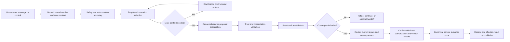

# Ask Cozy Product Reference

[Library home](README.md) · [Authority policy](AUTHORITY.md) · [Requirement ledger](requirements.csv) · [Cross Domain coverage](ASK_CROSS_DOMAIN_COVERAGE.md) · [Inline Workspace coverage](ASK_INLINE_COVERAGE.md)

**Reference baseline:** repository commit `32856fa7`, reviewed 2026-09-24

**Audience:** product managers, designers, engineers, reviewers, and future enhancement owners

**Purpose:** provide one current entry point for understanding Ask Cozy without flattening requirements, implementation evidence, and future intent into a single delivery claim

This document summarizes the Ask Cozy product and its current evidence. The linked FRDs remain the normative source for requirement wording. Code, schema, and executed tests establish delivery status. When this reference and a source disagree, follow [AUTHORITY.md](AUTHORITY.md), inspect the requirement ID in [requirements.csv](requirements.csv), and verify the affected implementation path.

## 1. Product definition

Ask Cozy is the conversational and interactive product surface for understanding a home, completing supported work, and continuing durable home workflows. It combines ordinary homeowner messages with structured results, declared controls, editable proposals, confirmations, receipts, and contextual workspaces.

The intended product outcome is that a homeowner can:

- ask a natural-language question without knowing the application's module structure;
- receive an answer grounded in authorized property and workflow context;
- understand the source, freshness, scope, uncertainty, and limitations of a result;
- refine, inspect, or continue work through declared controls;
- review and confirm consequential changes before canonical services execute them;
- retain the original response while seeing current state and reconciliation results;
- continue durable decisions and workflows across sessions; and
- open a traditional domain page when desired or when an approved exception requires it.

Ask Cozy is not a parallel source of truth for property records. Canonical domain services and records remain authoritative. Conversation state may preserve interaction continuity but does not replace property, workflow, decision, claim, task, or document identity.

## 2. Authority and reading order

| Order | Source | Governing scope |
|---:|---|---|
| 1 | [Inline Workspace FRD](../product/ASK_COZY_INLINE_WORKSPACE_FRD.md) | Current completion target: normal supported journeys complete inline in a responsive Ask workspace. Traditional navigation remains available. |
| 2 | [Interaction Model and UI FRD](../product/ASK_COZY_INTERACTION_MODEL_UI_FRD.md) | Result identity, freshness, actions, confirmation, reconciliation, accessibility, recovery, and the maintenance reference interaction. |
| 3 | [Cross Domain Rollout FRD](../product/ASK_COZY_CROSS_DOMAIN_INTERACTION_ROLLOUT_FRD.md) | Shared rollout rules and domain-specific requirements beyond maintenance. |
| 4 | [Message First FRD](../product/ASK_COZY_MESSAGE_FIRST_FRD.md) | Turn processing, routing, extraction, orchestration, capture, multi-turn state, and capability invocation. |
| 5 | [Audience Context Addendum](../product/AI_HOME_CONCIERGE_ASK_AUDIENCE_CONTEXT_ADDENDUM_FRD.md) | Account role, property journey, audience applicability, and persona-aware presentation. |
| 6 | [Trust Architecture Addendum](../product/AI_HOME_CONCIERGE_ASK_TRUST_ARCHITECTURE_ADDENDUM_FRD.md) | Safety routing, constrained operation selection, evidence policy, confidence, clarification, validation, and recovery. |
| 7 | [Ask Redo FRD](../product/AI_HOME_CONCIERGE_ASK_REDO_FRD.md) | Earlier platform baseline where later scoped documents do not revise it. |
| 8 | [Intelligence Incremental FRD](../product/AI_HOME_CONCIERGE_ASK_INTELLIGENCE_INCREMENTAL_FRD.md) | Longer-term intelligence, personalization, decision, graph, change-intelligence, and proactive-concierge targets. |
| Domain level | Relevant domain FRD, service, contract, and schema | Domain-specific authorization, data integrity, business rules, and consequential-action policy. |

The Inline Workspace FRD supersedes two earlier assumptions: routine handoff is no longer the normal completion mechanism, and a richer responsive workspace is now in scope. It does not supersede domain rules, trust constraints, confirmation requirements, or optional traditional navigation.

## 3. Product surfaces

### 3.1 Full Ask workspace

The full workspace combines conversation history, message input, structured responses, contextual detail, and supported controls. A substantive question produces a new response. A declared refinement updates its target result while retaining the homeowner's message and response history.

### 3.2 Contextual Ask surface

A feature or domain page may launch Ask with bounded property, task, record, or workflow context. The launch reference must resolve to an authorized canonical target. Missing or inaccessible context must be disclosed rather than silently converted into an unscoped request.

### 3.3 Structured response surface

Ask responses can contain validated presentation blocks such as summaries, grouped lists, comparisons, evidence, assumptions, progress, capture requests, confirmations, receipts, and limitations. Free text can explain an action but cannot be its only executable identity.

### 3.4 Inline workspace

Supported normal journeys should expose the detail, structured input, proposal, and completion controls within Ask. The workspace may promote or resize content for desktop and mobile. State must remain tied to the original property, execution, result, and canonical entities.

### 3.5 Traditional domain navigation

Direct pages and navigation remain valid user choices. Handoff is also appropriate for unsupported inline work, complex domain workflows, regulated or external steps, and destinations that require their own workspace. Handoff must preserve supported context, disclose unsupported context, and revalidate affected state on return.

## 4. End-to-end interaction contract

### 4.1 Context and audience

The effective audience derives from authenticated account data, property access, household role, and registered property-journey context. Unknown journey context may still permit safe general or read-only guidance. It cannot grant an operation, role, or property scope.

### 4.2 Routing and operation selection

Safety and unauthorized-scope checks precede ordinary semantic routing. Ask selects from registered operations and typed action contracts. Model output may assist classification or explanation but cannot create an operation, assign authorization, select an unrestricted write destination, or bypass confirmation policy.

### 4.3 Clarification and capture

Material ambiguity produces clarification rather than a guessed target. Structured capture preserves provenance, uncertainty, date precision, candidate identity, and relationships. A captured candidate becomes canonical only through the owning operation and service.

### 4.4 Results and evidence

An interactive result is scoped to its operation, property, execution, query or view, and canonical entities. Results should disclose freshness, coverage, missing sources, partial data, displayed versus total counts where meaningful, and the difference between facts, assumptions, estimates, and recommendations.

### 4.5 Actions and proposals

Every executable control declares its interaction type and target. Proposal fields are typed and validated by the server. Editing creates a new proposal or version and invalidates prior consent. Unsupported controls must fail visibly and safely.

### 4.6 Confirmation and execution

Consequential actions require the confirmation policy owned by the registered operation. Confirmation rechecks role, property access, operation availability, target ownership, relevant versions, and current inputs. Idempotency and canonical service rules prevent duplicate effects.

### 4.7 Receipts and reconciliation

A successful write returns a truthful receipt and refreshes or invalidates declared affected results. If the write succeeds and a read refresh fails, Ask retains the receipt, marks stale surfaces, and offers a read retry without recommending the write again.

### 4.8 Continuity and recovery

Durable workflows use canonical workflow identity rather than session identity. Property switching cannot retarget an existing result or proposal. Access loss removes actionable sensitive state. Deleted, merged, superseded, or inaccessible targets cannot be replaced with a similar record.

## 5. Current capability model

The committed Phase 0 Cross Domain audit classified **77 registered Ask operations** at its audit baseline. Later capability additions are recorded individually in the Inline Workspace FRD's Appendix C. The audited and subsequently added inventory includes:

- maintenance queries and task actions;
- inventory, document, property-summary, event, fact, warranty, and evidence capture;
- buyer plan, deadline, readiness, finding, task, move, and lifecycle operations;
- savings, ownership cost, refinance, reserve, and tax-readiness operations;
- coverage, incident, and claim operations;
- replacement, HVAC, quote, renovation, seller-preparation, and sell/hold/rent decisions;
- maintenance forecast, Home Actions, inspections, deadlines, changes, and intelligence-envelope queries;
- household invitation;
- capability discovery and grounded guidance; and
- emergency, unsafe, and out-of-scope boundaries.

Registration or handler presence is baseline evidence only. A capability is complete when its result, controls, state, confirmation, reconciliation, recovery, accessibility, and relevant acceptance scenarios are supported.

## 6. Domain coverage at the reference baseline

| Domain or contract | Current evidence | Known boundary |
|---|---|---|
| Maintenance reference | Static reference implementation with focused evidence | Cross-result reconciliation and some handoff context remain limited. |
| Buyer | All ten Cross Domain Buyer requirements are `IMPLEMENTED_STATIC` | No live database or browser acceptance is recorded by the consolidated review. |
| Financial and ownership | Six implemented-static, three partial | Property-state invalidation and context restoration across four operations remain incomplete. |
| Protection and claims | Five implemented-static, two partial, one unverified | Incident-read ambiguity, generic dismissal, and evidence-upload privacy need further evidence or implementation. |
| Decisions and projects | Six implemented-static, three partial | Item/scenario restoration, post-abandon recommendation suppression, and prospective-renovation routing remain incomplete. |
| Read-only Attention | Seven implemented-static requirements | Phase 9 controls are separate and incomplete. |
| Attention controls | Three targets plus one partial safety rule | `DISMISS`, `ALREADY_HANDLED`, and `REMIND_LATER` lack the required complete product policy and implementation. |
| Persistent goals | Three implemented-static, five partial, one target | Evidence is centered on sell/hold/rent; the additional Phase 10 goal family is not selected and delivered. |
| Household invitation | Three implemented-static, one unverified | Distinct duplicate, expired, revoked, and accepted outcomes need verification. |
| Records and capture | Ten unverified requirements | No dedicated R01–R08 acceptance verification exists. |
| Interaction quality harness | Ten unverified requirements | Full journey, viewport, keyboard, degraded-state, and measurement review has not been completed. |

See [ASK_CROSS_DOMAIN_COVERAGE.md](ASK_CROSS_DOMAIN_COVERAGE.md) for phase exits and requirement-level boundaries.

## 7. Requirement and evidence status

The consolidated Ask family contains **449 extracted requirements across nine documents** at the reference baseline.

| Status | Requirements | Meaning in this reference |
|---|---:|---|
| `VERIFIED_RUNTIME` | 17 | Relevant focused environment-independent tests or execution evidence exists. |
| `IMPLEMENTED_STATIC` | 47 | Current implementation paths were traced; runtime behavior was not independently exercised by the coverage review. |
| `PARTIAL` | 120 | Some acceptance criteria have evidence and the missing boundary is recorded. |
| `UNVERIFIED` | 259 | Sufficient requirement-level evidence has not been recorded. This is not proof that the behavior is absent. |
| `TARGET` | 5 | Approved intent without a verified implementation claim. |
| `DEFERRED` | 1 | An explicit decision defers the requirement. |

The largest unverified sources are Message First, Interaction Model, Ask Redo, and Intelligence Incremental. Their architecture prose remains useful, but future work must not translate it into a shipped claim without requirement-level evidence.

## 8. Product invariants for future enhancements

Every Ask Cozy enhancement must preserve these rules:

1. Canonical domain records and services own business state.
2. Property access, household role, target ownership, and operation policy are rechecked at consequential boundaries.
3. The operation and action registries bound executable behavior.
4. Material ambiguity prompts for clarification.
5. Facts, assumptions, estimates, recommendations, missing data, and uncertainty remain distinguishable.
6. Consequential actions show current inputs and effects before confirmation.
7. A successful write produces one durable effect and a truthful receipt.
8. Reconciliation failure cannot erase a successful write or invite duplication.
9. Conversation and view state cannot retarget a result to a different property or entity.
10. Access loss removes actionable sensitive content from the active client surface.
11. Safety boundaries and domain safeguards cannot be weakened by generic interaction behavior.
12. Traditional navigation remains available, while supported normal journeys aim to complete inline.

## 9. Known program gaps

The following items should be treated as open work rather than accepted functionality:

- complete requirement-level verification of Message First, Interaction Model, Ask Redo, and Intelligence Incremental;
- Records and Capture acceptance scenarios R01–R08;
- complete cross-result reconciliation beyond declared sibling maps;
- full context restoration for Financial and Decision handoffs;
- item and scenario restoration in decision workspaces;
- recommendation suppression after a decision is abandoned;
- a distinct prospective-renovation guidance route;
- Phase 9 policies and typed behavior for dismiss, already handled, and remind later;
- selection and implementation of the first additional persistent goal family;
- complete conversation-history management and accessibility evidence;
- measured performance baselines; and
- the full interaction quality harness across desktop, narrow viewport, keyboard, slow request, failed request, stale target, and property switching.

## 10. How to use this reference for an enhancement

1. Start here to identify the product surface, invariant, and likely capability family.
2. Open the governing FRD from §2 and identify the exact requirement IDs.
3. Check those IDs in [requirements.csv](requirements.csv) and read their evidence and open boundary.
4. Trace the operation registry, owning service, schema or contract, frontend renderer, and relevant focused tests.
5. Resolve any discrepancy using [AUTHORITY.md](AUTHORITY.md); do not select a winner from filename or document date alone.
6. Update the implementation and the affected FRD or decision record when approved behavior changes.
7. Update `requirement_status.csv` with acceptance criteria, evidence paths, checked commit/date, and the remaining limitation.
8. Rebuild and validate the library, then refresh Graphify.

## 11. Evidence map

| Need | Primary artifact |
|---|---|
| Requirement precedence | [AUTHORITY.md](AUTHORITY.md) |
| Requirement-level status | [requirements.csv](requirements.csv) |
| Manually reviewed evidence overrides | [requirement_status.csv](requirement_status.csv) |
| Inline Workspace evidence | [ASK_INLINE_COVERAGE.md](ASK_INLINE_COVERAGE.md) |
| Cross Domain evidence and phase exits | [ASK_CROSS_DOMAIN_COVERAGE.md](ASK_CROSS_DOMAIN_COVERAGE.md) |
| Document conflicts and stale material | [FLAGS.md](FLAGS.md) |
| Change documentation rules | [CHANGE_POLICY.md](CHANGE_POLICY.md) |
| Current code-oriented navigation | [Code-grounded wiki](../wiki/README.md) and Graphify |
| Phase verification records | `docs/architecture/ASK_COZY_PHASE*.md` |

## 12. Maintenance rule

Update this reference when a change alters Ask Cozy's authority order, product surfaces, end-to-end contract, capability inventory, domain coverage, program gaps, or status totals. Do not copy every requirement into this file. Preserve requirement identity and normative wording in the governing FRD and ledger so this remains a readable product reference rather than a second competing specification.
