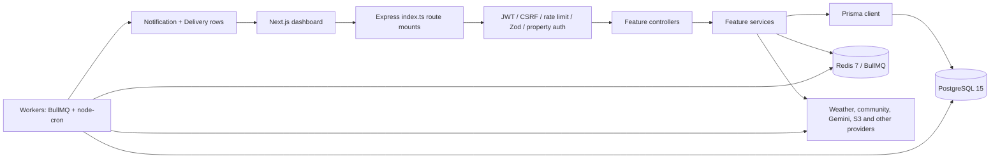
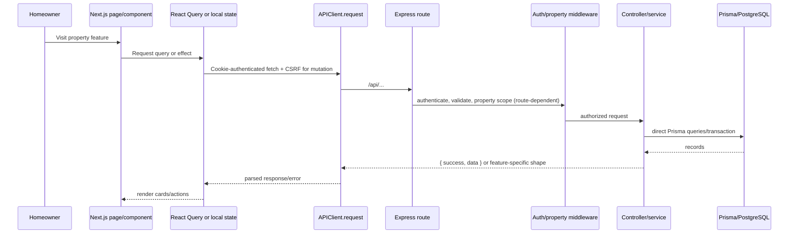
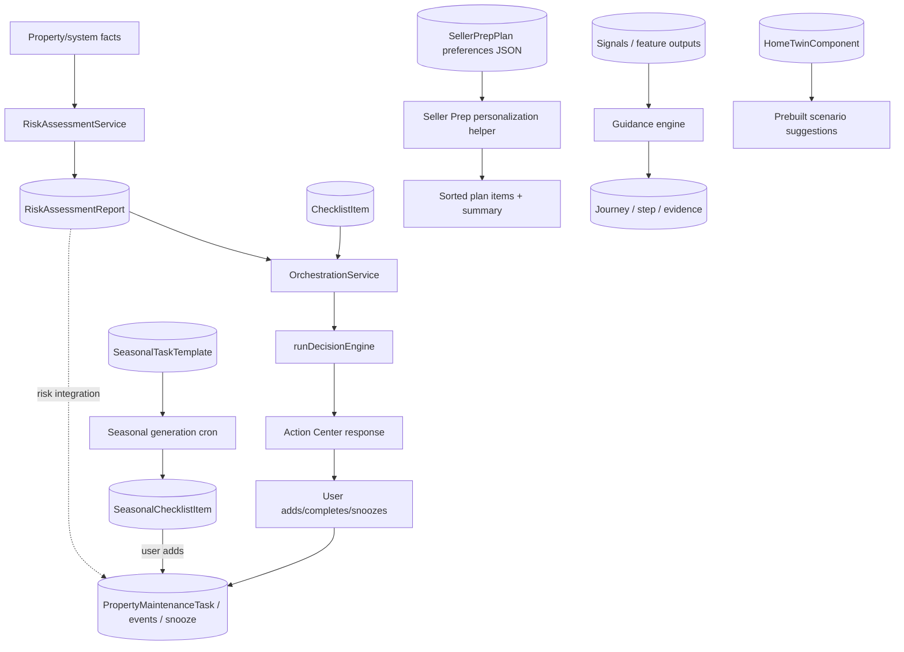
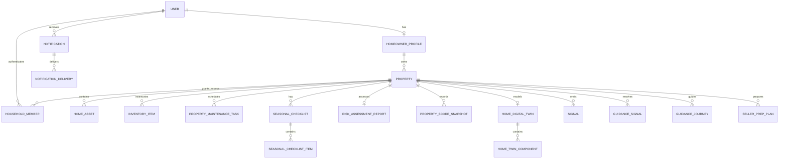
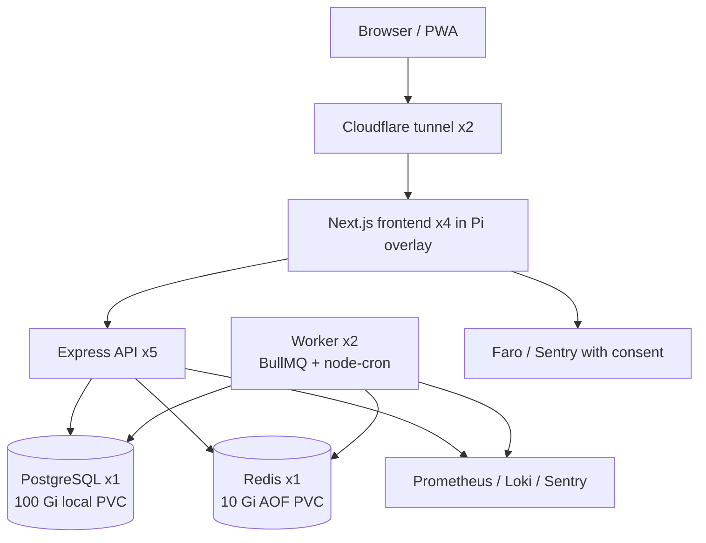

# 02 — Current-State Architecture

## System boundary

The maps below are **verified current state** unless annotated. They describe relevant paths, not every product feature.

## Backend component diagram

Business rules predominantly live in services and pure helper engines, with some ranking/presentation rules in frontend dashboard files. There is no shared personalization service.

## Frontend-to-backend request flow

Authentication uses httpOnly-cookie access/refresh flow; `APIClient.getToken()` intentionally returns null. Property selection is retained in `PropertyContext`. Not every page uses React Query: dashboard and several feature components issue their own parallel requests.

## Recommendation and task-generation flows

Key observations:

- `runDecisionEngine` is current closest analogue to centralized ranking but only consumes candidates built by orchestration and has a fixed tool vocabulary.
- Tasks can be produced through several paths. `actionKey` and unique indexes provide partial dedupe; legacy checklist and new task records coexist.
- Seller Prep, Daily Pulse, Room Plant Advisor, Digital Twin, Guidance and neighborhood features have separate recommend/rank/suppress implementations.

## Current data relationships

There is no `Household` profile entity and no pet, goal, lifestyle, trait definition/snapshot, recommendation definition, personalized recommendation, or recommendation feedback entity. `HouseholdMember` must remain an ACL/collaboration relation.

## How scores work today

| Score/rank | Inputs | Persistence | Rule location |
|---|---|---|---|
| Health score | Property fields, assets, warranties, documents, active bookings | Property fields and weekly `PropertyScoreSnapshot` | `utils/propertyScore.util.ts` |
| Risk | Property/system risk inputs | one `RiskAssessmentReport` per property | `services/RiskAssessment.service.ts` and constants |
| Financial efficiency | expenses/protection/property data | `FinancialEfficiencyReport`, score snapshots | financial services/workers |
| Decision ranking | urgency, financial impact, risk reduction, effort, confidence, freshness, reversibility | response diagnostics, not catalog instances | `services/decisionEngine.service.ts` |
| Neighborhood | impact, distance, confidence, freshness | property-event match | neighborhood services |
| Seller Prep | timeline, budget, goal, condition | preferences JSON and items | Seller Prep engines |
| Digital Twin quality | completeness/confidence by dimension | twin quality and computation runs | Digital Twin services |

## Notifications

Feature code creates `Notification` plus channel `NotificationDelivery` records. Workers deliver/batch email and mark delivery status. Current controls exist in both `HomeownerProfile.notificationPreferences` JSON and per-collaborator boolean fields, causing two preference sources. Feature jobs generally own their own dedupe and timing. There is no cross-feature notification budget or centralized fatigue score.

## Deployment diagram

The deployment manifest is evidence of intended topology, not measured available headroom. Five API pods each request 800 MiB, workers request 512 MiB each, frontend pods request 512 MiB each, and PostgreSQL requests 2 GiB. Personalization should therefore avoid per-request full-profile joins and unnecessary replicas/services.

## Starting point

Create `apps/backend/src/modules/personalization/` with adapters for `Property`, assets/inventory, `Signal`, climate/weather, tasks/history, and collaboration. Reuse the Decision Engine's pure patterns, Signal confidence/freshness, Guidance evidence, Digital Twin computation runs, and Notification delivery. Do not make any one of those feature-specific models the new aggregate.
