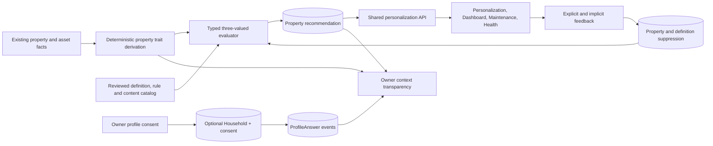

# 04 — Current Target Architecture

## Architecture decision

Keep personalization as a bounded module in the existing backend. Basic
guidance is derived from property data and available by default. Additional
household-profile facts are collected only after an owner separately consents.
Consumer modules reuse materialized recommendations; they do not query profile
tables or implement their own eligibility logic.



## Module layout

```text
apps/backend/src/modules/personalization/
  api/                 routes, controllers, authorization and DTO mapping
  application/         evaluation, materialization, profile and feedback flows
  domain/              typed AST, evaluator, profiling and feedback policies
  infrastructure/      narrow Prisma repositories
  adapters/            shared module placement and existing-domain actions
  catalog/             reviewed seed definitions and fixtures
```

Dependencies point inward. Feature modules receive stable recommendation DTOs.
They remain authoritative for property facts, maintenance tasks and specialist
calculations.

## Ownership and authorization

- `Property` owns traits, evaluation runs, recommendations and suppressions.
- `Household` owns only optional consent and profile-answer events. It is
  created lazily for an owner and linked to the selected property.
- The existing product `HouseholdMember` model remains an authenticated
  property-collaboration ACL and is not demographic profile data.
- VIEWER can read ordinary guidance. CONTRIBUTOR can refresh, provide feedback
  and invoke supported actions. OWNER alone can enable/reset optional profile
  collection and read the mixed context-transparency view.
- Optional-profile consent does not gate, hide or own basic property guidance.

## Property trait and rule system

The current implementation derives a small code-owned set of non-sensitive property traits from
existing property/asset records. A current known trait is stored as
`DerivedTrait`; the exact compact evaluation input/evidence is retained once in
`PersonalizationEvaluationRun.resultJson`.

Rules are validated JSON ASTs using allowlisted `trait`/`fact` comparisons and
bounded `all`, `any` and `not` nodes. Unknown data uses three-valued evaluation
(`TRUE`, `FALSE`, `UNKNOWN`) and never becomes eligible accidentally. History
and date operators remain safe `UNKNOWN` placeholders until a real source and
use case exist.

The initial catalog contains only:

- HVAC filter replacement check;
- smoke/CO detector battery check;
- dryer-vent cleaning reminder.

Definitions, rules and locale content are independently versioned. Only a
fully `ACTIVE`, in-window reviewed bundle materializes. Activation requires one
MFA-authenticated admin, records that admin as reviewer and writes an audit
event. Safety-sensitive activation adds an explicit confirmation, while a
global kill switch and per-definition pause remain authoritative at evaluation
and read.

## Recommendation lifecycle

There is one current recommendation per property/definition. Eligible results
create or refresh it; `FALSE`/`UNKNOWN` expires it. Explicit negative feedback
creates one property/definition suppression: `NOT_RELEVANT` is indefinite and
`DISMISSED` is time-bounded. Implicit non-engagement never suppresses.

The current implementation may store an optional score/confidence and derives a display
priority band with a fixed policy. It has no configurable weight model, score
breakdown, occurrence/dedupe dimension, behavioral affinity, automated tuning
or experimentation infrastructure.

Explanations use reviewed content plus structured reason codes and bounded
evidence. Raw optional-profile values are not copied into recommendations or
logs. Maintenance conversion delegates to the existing task service with an
idempotent action key; Dashboard and Health route to the authoritative action
surface.

## Optional progressive profile

The optional profile has one question surface and at most five active
questions. `ProfileQuestion.answerSchema` defines the allowed answer shape.
`ProfileAnswer` records an idempotent `ANSWERED`, `SKIPPED` or `SNOOZED` event;
`answerJson` is present only for an answer. Skip and snooze cooldowns plus an
impression cap control eligibility.

The answer event is the single profile-fact store. Separate composition, pet,
goal, preference and lifestyle tables are not justified without observed requirements.
The owner context map decodes only bounded known question shapes and excludes
database IDs, raw evidence and arbitrary nested JSON.

## Evaluation and serving

1. Verify catalog and kill-switch state.
2. Load existing property facts and derive the current trait snapshot.
3. Evaluate each of the three active definitions deterministically.
4. Apply property/definition suppression.
5. Materialize/expire property recommendations using active reviewed content.
6. Return at most three shared recommendation DTOs for the requested module.

Evaluation occurs on read/manual refresh. There is no database-wide nightly
sweep, personalization queue, dual-read path, percentage rollout or shadow
comparison pipeline.

## Measurement and future evolution

The current Phase 3 slice exposes aggregate counts/rates for manual review and
hard-disables online tuning. The current Phase 4 slice is a read-only
current-state transparency facade, not a retained household graph.

Experiments, inferred traits, timing/weight optimization, temporal household
history, graph infrastructure and simulations remain deferred. Introduce one
only after real-user evidence, a predeclared outcome and safety floor, privacy
approval, and a demonstrated query or product journey that the current
relational model cannot support.
