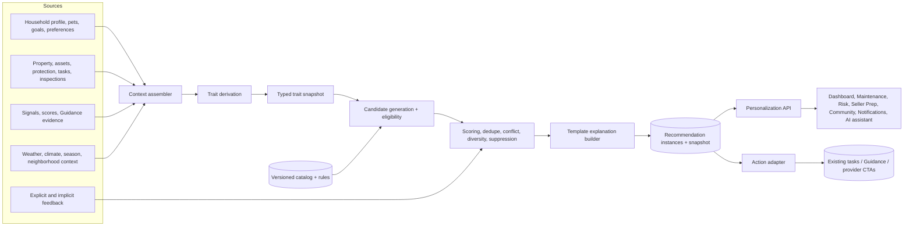

# 04 — Recommended Target Architecture

## Architecture decision

Build a bounded personalization module inside the existing backend. It owns household profile, traits, recommendation catalog/instances, evaluation, explanations, profiling questions, feedback and snapshots. Feature domains remain authoritative for property facts and specialist calculations.



## Module layout

```text
apps/backend/src/modules/personalization/
  api/                 routes, controllers, validators, DTOs
  application/         profile, question, evaluation, feedback use cases
  domain/              traits, rules, scores, explanations, policies
  infrastructure/      Prisma repositories, BullMQ publisher, cache
  adapters/            property, asset, task, signal, weather, module actions
  catalog/             reviewed seed definitions and golden fixtures
```

Dependencies point inward. Feature adapters translate current string/enums into stable personalization facts. No feature imports Prisma personalization tables directly.

## Ownership and scope model

- `Household` is a profile/consent aggregate, initially created for an OWNER and linkable to multiple properties.
- `HouseholdMemberSummary` represents non-account composition bands. It does not grant access and does not need names.
- Current `HouseholdMember` remains an authenticated property collaborator ACL.
- `HouseholdProperty` links household context to properties and records occupancy (`PRIMARY`, `SECONDARY`, `RENTAL`, `VACANT`) and effective dates.
- A recommendation is scoped to household + property unless explicitly property-only. A shared user can view it only if their property role and sensitivity policy permit.

## Profile domains

Use structured columns for common/high-value values and typed sparse attributes for extensibility:

- composition: adult/child/senior bands, broad child life stages, multi-generational flag;
- pets: type/count/size band, shedding, indoor/outdoor and yard/fence dependence;
- occupancy/lifestyle: work-from-home days band, travel/hosting frequency, home usage;
- life stage/future plan: first-time owner, new child (optional), empty nest, retirement, relocation, remodel, sell horizon;
- goals: safety, cost, comfort, air quality, efficiency, value, aging in place, automation, providers;
- preferences: DIY/hands-off, budget posture, repair/replace posture, channels/cadence, category interests/suppressions;
- property/context: adapted from current records, never duplicated as profile truth.

Pet intelligence is limited to home air quality, property wear/safety, fence/yard, emergency planning, coverage review, improvements and seller preparation. No feeding, medication, veterinary, training or social features.

## Trait system

Traits are typed facts with definition version, scope, value, source (`EXPLICIT`, `INFERRED`, `DERIVED`, `EXTERNAL`), confidence, evidence references, computed/valid times, privacy class and override state. Explicit values take precedence; user override blocks inference.

### MVP trait registry

| Trait | Inputs and derivation | Mode/confidence | Refresh/override | Privacy | Consumers |
|---|---|---|---|---|---|
| `hasPets` | active pet count > 0 | explicit-derived, 1.0 | pet CRUD; view/override via pets | personal | all |
| `hasDogs` / `hasCats` | active pet type exists | explicit-derived, 1.0 | pet CRUD; view | personal | maintenance, risk, seller, wellness |
| `hasLargeDog` | dog size band = large | explicit-derived, 1.0 | pet change; view/correct | personal | fence, yard, seller |
| `highSheddingPetLoad` | shedding weighted count ≥ configured threshold | derived, 0.8–1 | pet change; view/override | personal | HVAC, air quality, cleaning |
| `hasYoungChildren` | child stage infant/toddler/early school present | explicit-derived, 1.0 | summary change; view/override | sensitive | safety, risk |
| `hasTeenagers` | teen stage count > 0 | explicit-derived, 1.0 | summary change | sensitive | usage, safety |
| `hasSeniorHouseholdMember` | senior band count > 0 | explicit-derived, 1.0 | summary change | sensitive | safety/accessibility |
| `worksFromHome` | explicit WFH days band ≥1; later inferred only with consent | explicit 1.0/inferred ≤0.6 | answer/consented behavior; override | personal | comfort, energy, wellness |
| `travelsFrequently` | explicit frequency monthly+ | explicit 1.0 | answer/future-plan change | sensitive | security, leak, weather |
| `hasHighOccupancy` | occupants relative to property size threshold | derived 0.7–0.9 | composition/property size | personal | wear, HVAC, maintenance |
| `hasPool` / `hasFence` | confirmed property attribute/inventory/answer | explicit/derived 0.7–1 | property/profile update | operational | safety, maintenance |
| `ownsEV` / `hasSolar` | confirmed asset/property attribute | explicit/derived 0.8–1 | asset change | operational | energy, insurance |
| `isDIYOriented` | preference; later repeated DIY completion with consent | explicit 1/inferred ≤0.65 | preference/feedback | personal | maintenance, providers |
| `prefersHandsOffService` | service preference | explicit, 1.0 | preference | personal | providers, CTAs |
| `isBudgetFocused` | budget posture = budget conscious | explicit, 1.0 | preference | sensitive | scoring, savings |
| `isPreventiveMaintenanceFocused` | goal/preference enabled | explicit, 1.0 | goal/preference | personal | maintenance, risk |
| `hasAirQualityPriority` | air-quality goal enabled | explicit, 1.0 | goal | sensitive | HVAC, wellness |
| `hasPetEscapeRisk` | dog + yard access + fence missing/unknown/condition poor | derived, 0.5–0.95 | pet/fence/evidence/weather | sensitive | safety, questions |
| `hasAgingInPlacePriority` | explicit goal only | explicit, 1.0 | goal; always correctable | sensitive | accessibility, safety |
| `plansToSellSoon` | sell target within 12 months | explicit-derived, 1.0 | future-plan change/expiry | sensitive | Seller Prep, value |
| `isEnergyConscious` | efficiency/sustainability goal | explicit, 1.0 | goal | personal | energy, upgrades |
| `hasHighWeatherRisk` | active normalized hazard × property vulnerability threshold | external-derived, source confidence | context expiry | operational/sensitive location | risk, notification |

No trait should encode a medical diagnosis, wealth class, “luxury” label, protected-class inference, or exact household routine.

## Recommendation catalog

Use a hybrid model:

- relational definition/version/content metadata for querying, workflow and audit;
- validated JSON rule AST for eligibility;
- reviewed template content and structured explanation tokens;
- code adapters/guardrails for complex safety/domain computations.

A definition includes code/category/type, modules/channels, required/preferred/excluded traits, property/household/location/season/weather/risk conditions, goals/preferences, base priority/urgency/confidence, cost/savings/ROI/effort bands, frequency/expiry/suppression, evidence requirements, action/task/notification templates, rule/content versions, effective/review dates, status, sources and safety class.

Never store executable code. Definitions progress `DRAFT → REVIEW → ACTIVE → PAUSED → RETIRED`; historical instances retain exact rule/content versions and input snapshot hash.

## Rule AST

```ts
type RuleNode =
  | { op: 'all' | 'any'; children: RuleNode[] }
  | { op: 'not'; child: RuleNode }
  | { op: 'trait'; key: string; cmp: 'eq' | 'in' | 'gte' | 'lte' | 'exists'; value?: unknown }
  | { op: 'fact'; path: AllowedFactPath; cmp: Comparator; value?: unknown }
  | { op: 'history'; event: AllowedHistoryEvent; withinDays?: number; countCmp?: NumericCmp }
  | { op: 'date'; field: AllowedDatePath; cmp: 'before' | 'after' | 'withinDays'; value: string | number };
```

Validation limits depth, child count, operators, paths and values. Evaluator returns `eligible`, matched/failed condition IDs, confidence impacts and evidence references. Unknown data is three-valued (`TRUE`, `FALSE`, `UNKNOWN`); safety rules fail closed, while profiling rules can emit a question opportunity.

## Evaluation and scoring

1. Assemble immutable normalized context.
2. Derive current traits.
3. Prefilter active definitions by module/category/effective dates.
4. Evaluate hard eligibility and safety exclusions.
5. Score eligible candidates.
6. Merge semantic duplicates by dedupe key and choose strongest evidence.
7. Resolve conflicting intents.
8. Apply completion/dismiss/snooze/task/definition suppression.
9. Apply maximal-marginal-relevance-style diversity constraints (not ML): no more than two from a category in top five; reserve space for urgent safety.
10. Rank separately for dashboard, module and notification channels.

Suggested normalized score (0–100):

```text
0.18 base relevance + 0.12 property + 0.12 household
+ 0.10 goal + 0.06 preference + 0.08 seasonal/weather
+ 0.12 risk reduction + 0.08 financial value + 0.10 urgency
+ 0.08 confidence + 0.04 engagement affinity
- repetition - dismissal - fatigue - low-confidence penalties
```

Weights are versioned; critical safety uses policy floors/caps, never engagement optimization. Candidate score breakdown is persisted. Dashboard shows 3 by default/5 maximum; module endpoints default 10; notification channel requires a threshold, freshness and budget.

Recalculate on relevant profile/property/asset/task/goal/preference/context/feedback change, definition activation, or TTL. Do not recalculate all properties when unrelated content changes; index affected trait/fact dependencies.

## Explainability

Explanations are structured, not generated from scratch:

```ts
interface ExplanationData {
  headline: string;
  reasonCodes: Array<{ code: string; templateKey: string; params: Record<string, string | number> }>;
  evidence: Array<{ kind: string; label: string; sourceRef?: string; observedAt?: string }>;
  benefits: Array<{ type: 'RISK'|'COST'|'COMFORT'|'VALUE'; text: string }>;
  urgency: { level: string; reason: string };
  confidence: { score: number; band: string; limitations: string[] };
  ignoreImpact?: string;
  correctionLinks: Array<{ label: string; href: string }>;
}
```

Raw sensitive values are minimized in shared views. LLMs may paraphrase already-approved explanation data only; the structured template is always available.

## Progressive profiling

Question definitions specify prompt, why asked, answer schema/options, target field, affected traits/modules, privacy note, placement contexts, value score, effort score, cooldown, max impressions, skip and ask-later behavior. Rank by `(expected value × uncertainty reduction × current opportunity) / effort`, then apply sensitivity and frequency caps.

Good moments: onboarding, adding assets, completing/dismissing recommendations, Seller Prep, seasonal checklist, weather preparation and settings. Never interrupt urgent action. Ask at most one inline question/session and two/week by default. “Skip” suppresses 90 days; “ask later” suppresses 14 days; sensitive questions are never inferred from skipping.

## Feedback and learning

Separate explicit (`ACCEPTED`, `NOT_RELEVANT`, reason, rating, correction) from implicit (`VIEWED`, `EXPANDED`, `SAVED`, task/vendor clicks, ignored impression). Explicit signals outweigh implicit. MVP uses deterministic preference/category adjustments and bounded weight experiments, never autonomous rule creation. Event payloads store IDs and reason codes, not rendered sensitive explanations.

## Cross-module contract

Modules request recommendations using property, module/channel, limit and filters; they do not re-evaluate traits. They may contribute domain candidate facts and action handlers. Health/Risk calculations remain authoritative; personalization ranks next actions and supplies explanations. Maintenance converts via existing task service; Seller Prep migrates its catalog; notifications consume notification-eligible instances; AI assistant receives only consented, authorized snapshot fields with provenance.

## Household intelligence snapshot

Maintain a versioned precomputed snapshot with current trait values/confidence, active goals/preferences, context summary, top risks, channel-ranked recommendation IDs, profile completeness, data freshness and last evaluation. Refresh via coalesced jobs on relevant events; hard-expire weather facts, soft-expire general rankings, nightly reconcile, and retain only limited historical snapshots needed for audit/quality.
