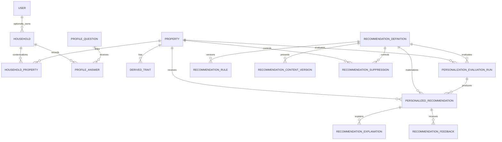

# 05 — Current Personalization Data Model

## Decision

Basic personalization is property-owned and available by default. Consent is
required only for the optional household profile. The greenfield pilot keeps a
small relational model and does not create migration scripts or backfill
properties. The user applies `apps/backend/prisma/schema.prisma` directly.

The existing product `HouseholdMember` model remains a property-collaboration
ACL. It is unrelated to the personalization `Household` profile aggregate.

## Implemented entities

| Entity | Purpose and ownership | Key constraints |
|---|---|---|
| `RecommendationDefinition` | Stable reviewed catalog identity | unique `code`; status/effective window; per-definition pause |
| `RecommendationRule` | Versioned validated eligibility AST | unique definition/version; authored/reviewed identities |
| `RecommendationContentVersion` | Versioned locale-specific reviewed copy | unique definition/locale/version |
| `PersonalizationEvaluationRun` | Bounded property evaluation record and compact input/evidence snapshot | indexed by property, definition and start time |
| `DerivedTrait` | Current code-derived property fact | unique property/trait key; no household or consent dependency |
| `PersonalizedRecommendation` | Current materialized property guidance | unique property/definition; rule and content versions retained |
| `RecommendationExplanation` | Structured reviewed reason/evidence | unique recommendation/version |
| `RecommendationFeedback` | Idempotent explicit or implicit event | unique event ID |
| `RecommendationSuppression` | Property/definition suppression from explicit negative feedback | unique property/definition; nullable `until` means indefinite |
| `RecommendationAction` | Existing idempotent conversion/action record | recommendation/action idempotency constraints |
| `PersonalizationAuditEvent` | Allowlisted operational/admin audit | append-only entity/actor indexes |
| `Household` | Optional profile and consent aggregate owned by one user | created lazily only after owner enablement |
| `HouseholdProperty` | Effective optional-profile link to a property | household/property/effective-from uniqueness |
| `ProfileQuestion` | Versioned optional question definition | unique code/version |
| `ProfileAnswer` | Single source of truth for answer, skip and snooze events | unique idempotency key; `answerJson` only for `ANSWERED` |

## Ownership boundaries

- Property guidance, derived property traits, evaluations, explanations and
  suppressions do not depend on a `Household` row.
- Only an owner can create/read/reset optional household profile facts.
- `ProfileAnswer.answerJson` is the only optional-profile fact store. Separate
  pet, composition, goal, preference and lifestyle tables are intentionally
  omitted until observed query or integrity requirements justify them.
- Profile reset deletes `Household`; database cascades remove its property links
  and profile answers. Property guidance remains available.
- Account deletion explicitly deletes owned personalization households because
  the application anonymizes rather than deletes the `User` row.

## ER diagram

## Deliberately omitted pilot schema

The following earlier design concepts are not part of the current schema:

- `HouseholdMemberSummary`, `PetProfile`, `HouseholdGoal`,
  `HouseholdPreference`, and `LifestyleAttribute`;
- trait registries, trait-snapshot history and model/weight registries;
- recommendation household ownership, occurrence/dedupe fields and score
  breakdowns;
- configurable rule score data and content template/source JSON;
- profile-question target-table and placement metadata;
- graph, experiment, inference and aggregate-feature tables.

These are not reserved future requirements. Add one only after pilot evidence
shows a concrete query, integrity, history or optimization need that the current
model cannot meet.

## Schema application

There is no application-owned migration sequence while the pilot database has
no data that must survive schema changes. Apply the desired Prisma schema using
the user's database process, then optionally run one idempotent catalog seed:

- `apps/backend/prisma/seedPersonalization.ts`, or
- `apps/backend/prisma/seedPersonalization.sql` in pgAdmin.

Run one seed form, not both. Seeds preserve existing lifecycle status and never
activate catalog content.

Conventional migrations become necessary only after a deployed database holds
data that must survive an incremental schema change. At that point, design the
specific migration from the then-current deployed schema; do not preserve the
discarded pre-pilot design as migration baggage.

## Privacy and retention

- Do not infer household facts or log raw answers/evidence.
- Optional answers remain consented, owner-visible and erasable.
- The context map exposes bounded semantic values without database/user IDs or
  arbitrary nested JSON.
- Evaluation snapshots are compact and operationally retained; introduce a
  formal retention window before real-user launch.
- Feedback comments and explicit profile values must never appear in aggregate
  quality responses.
