# 05 — Data-Model Design

## Modeling principles

Use relational ownership/lifecycle tables, a small typed sparse-attribute mechanism, and JSON only for validated rule ASTs/immutable snapshots. Do not add every trait as a column or store all profile data in one opaque JSON document. Current `HouseholdMember` remains an ACL record.

## Proposed entities

| Entity | Purpose/key fields | Relations, constraints, indexes | Growth/audit/delete | Phase |
|---|---|---|---|---|
| `Household` | profile aggregate: `id`, ownerUserId, displayName, status, consentVersion | owner User; unique active owner/default; index owner/status | low; audit changes; soft-delete then purge | MVP |
| `HouseholdProperty` | household↔property, occupancy/effective dates | unique active household/property; indexes both IDs | low; temporal audit | MVP |
| `HouseholdMemberSummary` | non-account composition band/type/count | household; unique household/type/lifeStage while active | low; sensitive; hard-delete on request | MVP |
| `PetProfile` | type/count/size/shedding/access/fence dependence; no medical data | household; optional property applicability; index household/status/type | low; audit/cascade | MVP |
| `HouseholdGoal` | typed goal, priority, horizon, source | unique active household/property?/goalCode; index goal/status | low; history/audit | MVP |
| `HouseholdPreference` | typed budget/service/repair/channel/category value | unique active scope/key; index scope/key | low; sensitive where financial | MVP |
| `LifestyleAttribute` | sparse typed explicit values, source/confidence | unique current scope/key; check exactly one typed value | low; allowlist keys; cascade | MVP |
| `TraitDefinition` | key/type/scope/derivation version/privacy/override policy/dependencies | unique key+version; index status | catalog-small; immutable versions | MVP |
| `DerivedTrait` | current effective trait value/source/confidence/evidence/validity/override | unique scope+key current; indexes property/household/key/validUntil | moderate churn; redact evidence | MVP |
| `TraitSnapshot` | immutable evaluation input trait set/hash/version | household/property/evaluation run; unique hash reuse | bounded history/TTL | MVP |
| `ProfileQuestion` | versioned question/value/effort/target/privacy/caps | code+version unique; status/context indexes | catalog-small | MVP |
| `ProfileAnswer` | answer, source, asked/answered/skipped/snoozed | question+household/property; indexes nextEligibleAt | moderate; sensitive; purge | MVP |
| `RecommendationDefinition` | stable code/taxonomy/safety/status/ownership | code unique; active/effective/category indexes | catalog-small; never hard-delete used definitions | MVP |
| `RecommendationRule` | definition version + validated AST/dependency keys | unique definition+version; status/effective indexes | catalog-small; immutable/audited | MVP |
| `RecommendationContentVersion` | locale/title/body/templates/sources/review date | unique definition+locale+version | catalog-small; immutable | MVP |
| `RuleVersion` | optional bundle/model weights and publish approval | version unique, effective dates | catalog-small | MVP |
| `RecommendationCandidate` | optional short-lived evaluation trace before instance | run/definition/scope/eligible/score JSON | index run/eligible; TTL 30–90d | Later (log only in MVP) |
| `PersonalizedRecommendation` | materialized user-facing instance/status/score/versions/dedupe/expiry | unique scope+definition+occurrence key; channel/status/score indexes | main growth; soft lifecycle, retain audit | MVP |
| `RecommendationExplanation` | structured reasons/evidence/benefit/confidence/corrections | one/version per instance; no raw secret values | proportional; cascade/purge with profile deletion | MVP |
| `RecommendationFeedback` | explicit/implicit event type/reason/channel | append-only; idempotency key unique; indexes instance/type/time | high; partition/retention later | MVP |
| `RecommendationAction` | task/Guidance/vendor action and idempotent result link | unique recommendation+actionType+idempotencyKey | moderate; audit | MVP |
| `RecommendationSuppression` | user/category/definition/dedupe scope and until/reason | active scope indexes; uniqueness by scope/key | moderate; purge with user unless legal audit | MVP |
| `ContextSnapshot` | normalized weather/season/local facts with provenance/validity | property+context type+observed; hash | bounded history; provider payload minimized | MVP |
| `PersonalizationSnapshot` | precomputed traits/goals/context/top IDs/completeness/freshness | unique current household+property+schemaVersion; computed index | 10–30KiB each current + limited history | MVP |
| `PersonalizationEvaluationRun` | status/trigger/versions/counts/duration/error code | scope/status/start indexes | operational; 30–90d | MVP |
| `PersonalizationAuditEvent` | actor/action/entity/version/reason; metadata allowlist | append-only; entity/time and actor/time indexes | medium; retention policy | MVP |

`LifestyleAttribute` should use `valueBoolean`, `valueNumber`, `valueText`, `valueCode`, `valueDate`, `valueJson` with a database/application check that exactly one is populated and the definition permits that type. JSON is reserved for bounded arrays/objects.

## ER diagram

```mermaid
erDiagram
  USER ||--o{ HOUSEHOLD : owns
  HOUSEHOLD ||--o{ HOUSEHOLD_PROPERTY : contextualizes
  PROPERTY ||--o{ HOUSEHOLD_PROPERTY : belongs_to
  HOUSEHOLD ||--o{ HOUSEHOLD_MEMBER_SUMMARY : summarizes
  HOUSEHOLD ||--o{ PET_PROFILE : has
  HOUSEHOLD ||--o{ HOUSEHOLD_GOAL : sets
  HOUSEHOLD ||--o{ HOUSEHOLD_PREFERENCE : sets
  HOUSEHOLD ||--o{ LIFESTYLE_ATTRIBUTE : describes
  TRAIT_DEFINITION ||--o{ DERIVED_TRAIT : defines
  HOUSEHOLD ||--o{ DERIVED_TRAIT : has
  PROPERTY ||--o{ DERIVED_TRAIT : has
  HOUSEHOLD ||--o{ PROFILE_ANSWER : answers
  PROFILE_QUESTION ||--o{ PROFILE_ANSWER : receives
  RECOMMENDATION_DEFINITION ||--o{ RECOMMENDATION_RULE : versions
  RECOMMENDATION_DEFINITION ||--o{ RECOMMENDATION_CONTENT_VERSION : presents
  HOUSEHOLD ||--o{ PERSONALIZED_RECOMMENDATION : receives
  PROPERTY ||--o{ PERSONALIZED_RECOMMENDATION : scopes
  RECOMMENDATION_DEFINITION ||--o{ PERSONALIZED_RECOMMENDATION : materializes
  PERSONALIZED_RECOMMENDATION ||--o{ RECOMMENDATION_EXPLANATION : explains
  PERSONALIZED_RECOMMENDATION ||--o{ RECOMMENDATION_FEEDBACK : receives
  PERSONALIZED_RECOMMENDATION ||--o{ RECOMMENDATION_ACTION : converts
  HOUSEHOLD ||--o{ RECOMMENDATION_SUPPRESSION : controls
  PROPERTY ||--o{ CONTEXT_SNAPSHOT : contextualizes
  HOUSEHOLD ||--o{ PERSONALIZATION_SNAPSHOT : snapshots
  PROPERTY ||--o{ PERSONALIZATION_SNAPSHOT : snapshots
  PERSONALIZATION_EVALUATION_RUN ||--o{ PERSONALIZED_RECOMMENDATION : produces
```



## Representative Prisma-compatible sketch

```prisma
model Household {
  id          String   @id @default(uuid())
  ownerUserId String
  displayName String?
  status      String   @default("ACTIVE")
  consentVersion String?
  consentedAt DateTime?
  deletedAt   DateTime?
  createdAt   DateTime @default(now())
  updatedAt   DateTime @updatedAt
  owner       User     @relation(fields: [ownerUserId], references: [id])
  properties  HouseholdProperty[]
  pets        PetProfile[]
  @@index([ownerUserId, status])
}

model HouseholdProperty {
  id String @id @default(uuid())
  householdId String
  propertyId String
  occupancyType String @default("PRIMARY")
  effectiveFrom DateTime @default(now())
  effectiveTo DateTime?
  household Household @relation(fields: [householdId], references: [id], onDelete: Cascade)
  property Property @relation(fields: [propertyId], references: [id], onDelete: Cascade)
  @@unique([householdId, propertyId, effectiveFrom])
  @@index([propertyId, effectiveTo])
}

model DerivedTrait {
  id String @id @default(uuid())
  householdId String
  propertyId String?
  traitKey String
  valueJson Json
  source String
  confidence Float
  definitionVersion Int
  evidenceJson Json?
  computedAt DateTime @default(now())
  validUntil DateTime?
  overriddenAt DateTime?
  @@unique([householdId, propertyId, traitKey])
  @@index([propertyId, traitKey])
  @@index([validUntil])
}

model RecommendationDefinition {
  id String @id @default(uuid())
  code String @unique
  category String
  safetyClass String
  status String @default("DRAFT")
  effectiveFrom DateTime?
  effectiveTo DateTime?
  reviewDueAt DateTime?
  createdAt DateTime @default(now())
  updatedAt DateTime @updatedAt
  rules RecommendationRule[]
  @@index([status, effectiveFrom, effectiveTo])
  @@index([category, status])
}

model RecommendationRule {
  id String @id @default(uuid())
  definitionId String
  version Int
  ruleAst Json
  dependencyKeys String[]
  scoreConfig Json
  status String @default("DRAFT")
  definition RecommendationDefinition @relation(fields: [definitionId], references: [id])
  @@unique([definitionId, version])
  @@index([status])
}

model PersonalizedRecommendation {
  id String @id @default(uuid())
  householdId String
  propertyId String
  definitionId String
  evaluationRunId String
  occurrenceKey String
  dedupeKey String
  status String @default("ACTIVE")
  score Float
  priorityBand String
  confidence Float
  scoreBreakdown Json
  ruleVersion Int
  contentVersion Int
  firstEligibleAt DateTime @default(now())
  lastEvaluatedAt DateTime @default(now())
  expiresAt DateTime?
  @@unique([householdId, propertyId, definitionId, occurrenceKey])
  @@index([propertyId, status, score(sort: Desc)])
  @@index([householdId, status, expiresAt])
  @@index([dedupeKey, status])
}
```

Exact Prisma enum names should be finalized during implementation; strings in the sketch reduce premature enum proliferation.

## Multiple properties and household members

One user may own multiple households and one household may contextualize multiple properties. Default migration creates one household for a homeowner and links all owned properties, but UI asks whether secondary/rental properties share the same household context. Property-level overrides (occupancy, pet applicability, goals) win over household defaults.

Non-account household members use count/life-stage summaries. Authenticated collaborators remain current `HouseholdMember` rows and are not automatically demographic members. Future shared household ownership can add `HouseholdUserAccess`, but MVP maps effective access through property roles.

## Migration sequence

1. Add empty household/profile/consent tables and audit/evaluation tables; no behavior change.
2. Backfill one default Household per eligible `HomeownerProfile`, link owned properties, record `BACKFILL` source; do not infer composition.
3. Add trait definitions/current traits and snapshots; derive only non-sensitive property traits.
4. Add catalog/rule/content and recommendation lifecycle tables; seed inactive definitions.
5. Dual-read behind flag, shadow evaluate, compare diagnostics.
6. Activate Maintenance/Health consumers; later migrate Seller Prep/notifications.

Backward compatibility: existing tasks, score APIs, dashboard calls and collaborator routes remain unchanged. Recommendation actions call current services. API clients opt in through new endpoints/flags.

Backfill is idempotent with stable keys and checkpointed batches. Rollback disables flags/jobs, stops dual write, and leaves additive tables; never attempt destructive down-migration after user profile collection. Data transforms must have count/checksum reports.

## Privacy deletion and retention

On personalization reset: revoke consent, delete profile answers/pets/member summaries/goals/preferences/overrides, current traits, snapshots, active recommendations/explanations/suppressions, and unlink household-property context as selected; retain minimal audit tombstones with opaque IDs if required. Feedback becomes de-identified aggregate or is deleted. Domain property/task records follow existing policies. A user account deletion workflow must enqueue and verify this erasure; current user anonymization alone is insufficient.
