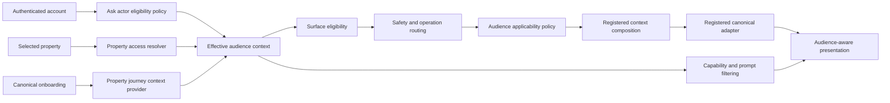

# AI Home Concierge Ask — Audience Context and Persona-Aware Guidance Addendum

**Product:** ContractToCozy — Ask Cozy  
**Document type:** Functional Requirements and Architecture Addendum  
**Status:** Proposed for implementation  
**Version:** 1.0  
**Date:** August 14, 2026  
**Applies to:** `AI_HOME_CONCIERGE_ASK_REDO_FRD.md`, `AI_HOME_CONCIERGE_ASK_INTELLIGENCE_INCREMENTAL_FRD.md`, and `CONTRACTTOCOZY_SKILL_PLATFORM_FRD.md`

---

## 1. Purpose

This addendum defines how Ask Cozy shall distinguish and serve account roles, household permissions, and property-lifecycle personas without weakening the existing property authorization model or introducing persona-specific branches into the core router.

The current implementation is property-grounded and household-role aware. It correctly distinguishes `OWNER`, `CONTRIBUTOR`, and `VIEWER` for property reads, writes, captures, and confirmations. It does not yet consistently use account role or property ownership lifecycle to determine:

- whether the Ask surface is available;
- which capabilities and operations apply;
- which landing prompts are shown;
- how guidance is framed;
- which calls to action are usable; or
- whether a buyer, recent owner, established owner, or transferring owner is receiving relevant guidance.

This document closes those gaps.

---

## 2. Relationship to the parent documents

This addendum is additive. It does not replace the parent Ask or Skill Platform requirements.

Where this document is more specific, it governs:

- Ask account-role eligibility;
- household-role presentation behavior;
- buyer and ownership-lifecycle applicability;
- audience-aware capability discovery;
- audience-aware prompt selection;
- persona-aware response framing and CTAs;
- audience-policy telemetry; and
- the related implementation and regression requirements.

The following parent principles remain authoritative:

1. Safety routing has precedence over personalization and applicability.
2. Property access is rechecked by the backend.
3. Deterministic canonical services own calculations and material decisions.
4. Skills obtain cross-domain context only through registered providers.
5. Effective permission is the restrictive intersection of all applicable policies.
6. No LLM call is required for deterministic work.
7. Material actions require the existing confirmation and idempotency controls.
8. New Skills shall not require hardcoded per-Skill branches in the core router.

---

## 3. Executive decision

Version 1 shall keep Ask Cozy a homeowner-facing product surface.

- `HOMEOWNER` accounts are eligible for Ask Cozy.
- `PROVIDER` accounts are not eligible for homeowner Ask Cozy.
- `ADMIN` accounts are not eligible for homeowner Ask Cozy.
- A future provider assistant shall be a separate governed consumer, not a provider mode inside homeowner Ask.
- A future administrator support mode shall require explicit, audited impersonation or support-session controls and is not part of this addendum.
- A buyer is not a separate account role. Buyer behavior is derived from canonical property onboarding and relationship context.

This decision prevents account role, household permission, and lifecycle stage from being incorrectly collapsed into a single `userType` field.

---

## 4. Current-state assessment

### 4.1 What is already solid

- Ask requires an authenticated user.
- Property-scoped execution checks current property access.
- Registered operations declare a household authorization floor.
- Viewer-readable operations remain accessible to `VIEWER` members.
- Registered writes require `CONTRIBUTOR` or `OWNER` as appropriate.
- Owner-only operations remain owner-only.
- Material confirmation rechecks current property access and role.
- Viewers are prevented from performing inline writes and profile captures.
- Results remain scoped to the selected property.
- The Skill Platform validates consumer, operation, adapter, provider, risk, and result-block policy.

### 4.2 Confirmed gaps

| Gap | Current behavior | Required behavior |
| --- | --- | --- |
| Account role | The controller supplies `userId`; Ask orchestration does not receive an authoritative account-role policy input | Resolve and enforce account-role eligibility on every Ask entry point |
| Provider access | The homeowner dashboard redirects providers, but the backend Ask boundary does not independently reject provider accounts | Backend rejection must be authoritative |
| Admin access | Admin behavior is incidental rather than governed | Exclude normal admin sessions from homeowner Ask |
| Buyer context | Canonical ownership states exist but are not a first-class Ask routing and presentation input | Resolve bounded journey context through a registered provider |
| Persona applicability | An operation can be authorized but still irrelevant to the user's lifecycle | Add declarative audience applicability |
| Landing prompts | Record-aware prompts exist, but lifecycle-specific prompt selection is incomplete | Add lifecycle-aware prompt selection while keeping four cards maximum |
| Response framing | Guidance primarily varies by property facts and household write permission | Add bounded lifecycle-aware framing and CTAs |
| Telemetry | Skill telemetry does not describe audience-policy outcomes | Emit bounded audience-policy dimensions |

---

## 5. Goals

### 5.1 Product goals

1. Give each eligible homeowner guidance appropriate to the selected property's current lifecycle.
2. Keep the Ask landing page clean, simple, and focused.
3. Prevent irrelevant or misleading capability prompts.
4. Make buyer guidance distinct from established-owner guidance.
5. Keep owner, contributor, and viewer permissions understandable.
6. Exclude providers and administrators intentionally at both UI and API boundaries.
7. Preserve exact property, Home Action, inventory-item, and Decision Thread context.

### 5.2 Architecture goals

1. Resolve audience context on the backend from canonical sources.
2. Keep account eligibility, household authorization, and lifecycle applicability as separate policy dimensions.
3. Add audience applicability declaratively through registered policy rather than router branches.
4. Reuse existing context-provider, versioning, telemetry, and kill-switch infrastructure.
5. Avoid database schema changes and migration scripts.
6. Maintain fail-closed behavior for property access, material actions, and stale contextual entities.

---

## 6. Non-goals

Version 1 does not include:

- a provider-facing conversational assistant;
- an administrator conversational assistant;
- administrator impersonation or support mode;
- a new user-role enum value for `BUYER`;
- inferred ownership status from free-form user wording;
- personality, demographic, income, health, family, or protected-class inference;
- persona-specific canonical calculations;
- a new database table or migration script;
- a user-facing persona selector on the Ask landing page;
- a second capability catalog or second Home Action ranking system;
- LLM-based audience classification; or
- internal approval gates that block beta development.

---

## 7. Terminology and policy dimensions

### 7.1 Account role

The authenticated platform account classification:

- `HOMEOWNER`
- `PROVIDER`
- `ADMIN`

Account role determines whether the user may enter the homeowner Ask surface. It does not grant access to a property.

### 7.2 Household role

The user's authorization level for one selected property:

- `OWNER`
- `CONTRIBUTOR`
- `VIEWER`

Household role determines what the user may read, capture, change, or confirm for that property. It is resolved independently for every property.

### 7.3 Ownership state

The canonical lifecycle state recorded in `PropertyOnboarding`:

- `SHOPPING`
- `UNDER_CONTRACT`
- `RECENT_OWNER`
- `ESTABLISHED_OWNER`
- `PREPARING_TRANSFER`
- `UNKNOWN`

Ownership state describes the relationship between the household journey and the selected property. It is not an authentication role.

### 7.4 Operating mode

A bounded, deterministic projection used for applicability and presentation:

- `BUYING`
- `OWNING`
- `SELLING`
- `UNKNOWN`

### 7.5 Property relationship

The authorized relationship through which the current user can access the property:

- `PRIMARY_OWNER`
- `HOUSEHOLD_MEMBER`
- `PROSPECTIVE_BUYER`
- `NONE`

`PROSPECTIVE_BUYER` shall be used only when an existing canonical product relationship and access policy supports it. It shall never be inferred solely from question text.

---

## 8. Persona model

| Persona | Canonical derivation | Primary need | Ask emphasis |
| --- | --- | --- | --- |
| Shopping buyer | `SHOPPING` | Evaluate and organize a potential purchase | Property understanding, records to request, broad risks, next due-diligence step |
| Under-contract buyer | `UNDER_CONTRACT` | Resolve findings before closing | Inspection follow-up, negotiation readiness, closing records, immediate post-close costs |
| Recent owner | `RECENT_OWNER` | Stabilize and set up the home | First 90 days, warranties, registrations, inspection follow-ups, first-year maintenance |
| Established owner | `ESTABLISHED_OWNER` | Operate and optimize the home | Maintenance, protection, savings, replacement planning, capital reserve |
| Preparing transfer | `PREPARING_TRANSFER` | Prepare an accurate and useful handoff | Sale readiness, record completeness, repairs, disclosures, buyer-ready documentation |
| Unknown | Missing or unknown canonical state | Obtain useful help without guessing | Safe property-grounded general guidance and optional context correction |

Household roles apply within every eligible persona. An under-contract `VIEWER` remains read-only; an established `OWNER` may use owner-only workflows.

---

## 9. Target architecture



### 9.1 Required order of enforcement

1. Authenticate the account.
2. Resolve and enforce Ask account eligibility.
3. Run safety and restricted-request interception.
4. Resolve the selected property when required.
5. Resolve current property access and household role.
6. Resolve the registered property journey context.
7. Resolve deterministic operation candidates.
8. Apply audience applicability to eligible candidates.
9. Apply existing Skill, consumer, operation, adapter, and provider policy.
10. Compose declared context.
11. Execute the canonical operation.
12. Filter CTAs by current household permission and applicability.
13. Persist bounded policy lineage and telemetry.

Safety shall never be suppressed because an ordinary operation is lifecycle-inapplicable.

---

## 10. Effective audience context contract

```ts
type AskAccountRole = 'HOMEOWNER' | 'PROVIDER' | 'ADMIN';
type AskHouseholdRole = 'OWNER' | 'CONTRIBUTOR' | 'VIEWER';
type AskOwnershipState =
  | 'SHOPPING'
  | 'UNDER_CONTRACT'
  | 'RECENT_OWNER'
  | 'ESTABLISHED_OWNER'
  | 'PREPARING_TRANSFER'
  | 'UNKNOWN';
type AskOperatingMode = 'BUYING' | 'OWNING' | 'SELLING' | 'UNKNOWN';
type AskPropertyRelationship =
  | 'PRIMARY_OWNER'
  | 'HOUSEHOLD_MEMBER'
  | 'PROSPECTIVE_BUYER'
  | 'NONE';

interface AskAudienceContext {
  schemaVersion: '1.0';
  accountRole: AskAccountRole;
  householdRole: AskHouseholdRole | null;
  ownershipState: AskOwnershipState;
  operatingMode: AskOperatingMode;
  propertyRelationship: AskPropertyRelationship;
  entryPath: string | null;
  sourceVersion: string | null;
  observedAt: string;
}
```

### 10.1 Trust rules

- The client shall not submit `accountRole`, `householdRole`, `ownershipState`, `operatingMode`, or `propertyRelationship` as authoritative values.
- Launch context may identify a surface or entity but shall not establish audience policy.
- Account role shall come from the current authenticated user.
- Household role and property relationship shall come from current property authorization.
- Ownership state and entry path shall come from canonical property onboarding context.
- Operating mode shall be derived deterministically.
- Missing journey context shall produce `UNKNOWN`; it shall not be guessed from language.

### 10.2 Operating-mode derivation

| Ownership state | Operating mode |
| --- | --- |
| `SHOPPING` | `BUYING` |
| `UNDER_CONTRACT` | `BUYING` |
| `RECENT_OWNER` | `OWNING` |
| `ESTABLISHED_OWNER` | `OWNING` |
| `PREPARING_TRANSFER` | `SELLING` |
| `UNKNOWN` or absent | `UNKNOWN` |

---

## 11. Account-role eligibility

### 11.1 Version 1 policy

| Account role | Ask landing page | Ask API | Property Ask | Non-property Ask |
| --- | --- | --- | --- | --- |
| `HOMEOWNER` | Allowed | Allowed | Allowed with property access | Allowed |
| `PROVIDER` | Hidden/redirected | Blocked | Blocked | Blocked |
| `ADMIN` | Hidden/redirected | Blocked | Blocked | Blocked |

### 11.2 Stable error

Backend rejection shall use:

- code: `ASK_ACCOUNT_ROLE_NOT_ELIGIBLE`
- HTTP status: `403`
- homeowner-safe message: `Ask Cozy is available from a homeowner account.`

The response shall not disclose property existence or membership.

### 11.3 Entry points covered

The account-role policy shall apply to:

- Concierge Home retrieval;
- initial execution creation;
- execution retrieval;
- session retrieval and deletion;
- continuation;
- property selection;
- clarification;
- context capture;
- confirmation and cancellation;
- corrections and feedback;
- pending-work retrieval; and
- monitor retrieval or modification through Ask.

---

## 12. Registered property journey context provider

### 12.1 Provider contract

The Skill Platform shall register:

- provider ID: `property.journey-context`
- version: `1.0.0`
- canonical owner: `PropertyOnboarding / Entry Context`
- minimum property role: `VIEWER`
- sensitivity: `STANDARD`
- required source fields: `entryPath`, `ownershipState`, `propertyOrigin`, `entryContextVersion`, `entryContextCapturedAt`

The provider may include a bounded active-trigger classification when an operation explicitly declares it. It shall not provide free-form trigger details by default.

### 12.2 Provider result states

- `AVAILABLE` — canonical lifecycle context exists.
- `UNKNOWN` — property is authorized but context is absent or incomplete.
- `UNAUTHORIZED` — current user cannot access the selected property.
- `STALE` — a version conflict or invalidated source prevents reliable use.
- `UNAVAILABLE` — the canonical dependency cannot currently respond.

### 12.3 Degraded behavior

- Missing optional journey context shall not prevent safe general property guidance.
- Inapplicable material calculations shall not run merely because journey context is missing.
- Unknown lifecycle shall use the explicit `UNKNOWN` policy defined for the operation.
- Required applicability context failure shall return a bounded explanation and correction route where available.

### 12.4 Performance and budgets

- The provider shall perform one bounded property-scoped read.
- The provider result shall be reused within an execution.
- Provider output shall remain below the standard Skill context byte and fact budgets.
- No adapter may independently re-query onboarding merely to reconstruct the same context.
- Provider latency shall be measured separately from canonical-operation latency.

---

## 13. Declarative audience applicability

### 13.1 Policy contract

```ts
interface AskAudiencePolicy {
  policyVersion: '1.0';
  eligibleAccountRoles: readonly AskAccountRole[];
  eligibleOperatingModes: readonly AskOperatingMode[];
  minimumHouseholdRole: AskHouseholdRole | null;
  unknownModeBehavior: 'ALLOW_GENERAL' | 'EXPLAIN' | 'BLOCK';
  ineligibleTypedRequestBehavior: 'EXPLAIN' | 'BLOCK';
  discoveryBehavior: 'SHOW' | 'HIDE';
}
```

### 13.2 Policy resolution

The effective operation permission shall be the restrictive intersection of:

- account-role eligibility;
- property access;
- household-role authorization floor;
- audience applicability;
- Skill consumer policy;
- Skill feature and kill-switch controls;
- domain control;
- operation control;
- adapter control;
- context-provider control;
- risk policy; and
- canonical-service authorization.

Audience policy shall never broaden an existing authorization floor.

### 13.3 Startup validation

Startup validation shall reject:

- an operation with no explicit audience policy or explicit safe default;
- unknown account roles, ownership states, or operating modes;
- an audience minimum role weaker than a mandatory operation role;
- discovery exposure when typed execution is prohibited without an explanation policy;
- lifecycle-dependent operations that do not declare the journey provider;
- unsupported policy versions; and
- conflicting policies for the same immutable operation version.

---

## 14. Version 1 capability and Skill applicability

The table defines default discovery behavior. A directly typed request may still receive an explanation even when the capability is hidden from discovery.

| Skill | Buying | Owning | Selling | Unknown |
| --- | --- | --- | --- | --- |
| Property Record | Show | Show | Show | Show |
| Maintenance | Show inspection/future-owner context | Show | Show only relevant readiness work | Show general read-only guidance |
| Repair or Replace | Explain when buyer lacks ownership/condition authority | Show | Show for sale-readiness decisions | Allow only with an exact supported item |
| Coverage | Show record/request guidance without asserting owned coverage | Show | Show sale-transition implications where supported | Show bounded record review |
| Capital Planning | Hide from generic buyer discovery; explain if directly asked | Show | Show only transfer-relevant obligations | Explain/context required |
| Savings | Show purchase and early-cost opportunities when supported | Show | Show transfer-relevant opportunities only | Show bounded discovery |
| Ownership Cost | Show estimated post-purchase costs with boundaries | Show | Show current and transition costs | Explain/context required |
| Property Tax | Show due-diligence and post-close readiness | Show | Show transfer-related status where supported | Show general sourced guidance |
| Sell / Hold / Rent | Hide | Show | Show | Explain/context required |
| Seller Preparation | Hide | Optional when a sale trigger exists | Show | Hide unless explicitly requested |
| Renovation | Show due-diligence readiness only | Show | Show completion/permit readiness | Explain/context required |
| Quote Comparison | Show only user-owned, authorized proposal workspaces | Show | Show | Show only exact authorized workspace |
| Household | Hide household administration | Show according to role | Show according to role | Hide owner-only discovery |
| Refinance | Hide and explain inapplicability | Show | Hide by default; explain if directly asked | Explain/context required |

Safety, emergency, unsafe/restricted, and out-of-scope boundaries are audience-independent and always evaluated first.

---

## 15. Household-role presentation rules

### 15.1 Viewer

- May receive authorized read-only guidance.
- Shall not see create, edit, complete, invite, save-profile, monitor-create, or material-confirmation CTAs.
- May see a read-only navigation CTA.
- When a write is needed, Ask shall explain that a contributor or owner is required without exposing hidden household details.
- Shall not enumerate private or owner-only preference values.

### 15.2 Contributor

- May use registered contributor-level property and maintenance writes.
- May propose shared context only where the existing policy permits it.
- Shall not receive owner-only household administration or sensitive shared-profile controls.
- Shall be told when owner confirmation is required.

### 15.3 Owner

- May use owner-only registered operations.
- May confirm material household administration and eligible shared-profile actions.
- Shall still be subject to safety, lifecycle applicability, consent, confirmation, and canonical-service rules.

---

## 16. Ask landing-page behavior

### 16.1 Design constraint

The page shall remain clean and simple:

- one primary Ask composer;
- no persona selector;
- no more than four featured prompt cards;
- one optional capability-exploration link; and
- property-grounded attention content below the primary interaction.

### 16.2 Prompt precedence

Featured prompts shall be selected in this order:

1. Exact active Decision Thread.
2. Exact actionable Home Action.
3. Exact supported inventory decision candidate.
4. Lifecycle-relevant capability prompt.
5. General capability-discovery fallback.

Exact contextual prompts shall preserve canonical entity IDs and take precedence over generic persona examples.

### 16.3 Diversity rules

- Maximum four prompts.
- Avoid duplicate operation intent.
- Prefer distinct outcome categories where meaningful.
- Do not manufacture a record-specific entity.
- Do not show a capability disabled by policy or runtime control.
- Do not show a write prompt that the current household role cannot complete.
- Do not show a lifecycle-inapplicable operation merely to fill all four positions.
- Fewer than four prompts is acceptable when the catalog cannot honestly provide four.

### 16.4 Recommended lifecycle prompts

#### Shopping or under contract

- What should I review before closing?
- Which inspection findings still need follow-up?
- What home records should I request?
- What could become an immediate cost after purchase?

#### Recent owner

- What should I handle in my first 90 days?
- Which warranties or systems should I register?
- What inspection findings still need attention?
- What maintenance should I schedule first?

#### Established owner

- What maintenance is coming due?
- Which items may need replacement planning?
- Which items may be missing coverage?
- Where could I reduce ownership costs?

#### Preparing transfer

- What should I address before listing?
- Which records should be ready for a buyer?
- What repairs may affect sale readiness?
- What property facts should I verify?

#### Unknown

- Give me a summary of this home record.
- What maintenance tasks are pending?
- Which items may be missing coverage?
- What should I plan for next?

---

## 17. Persona-aware focused guidance

### 17.1 Boundary

Persona context may affect:

- applicability;
- result ordering;
- narrative framing;
- missing-context questions;
- CTA selection;
- disclosure of limitations; and
- explanation of why an item matters now.

Persona context shall not alter:

- canonical facts;
- cost formulas;
- risk calculations;
- eligibility rules owned by canonical services;
- property access;
- household authorization;
- confirmation requirements; or
- professional and safety boundaries.

### 17.2 Example framing

| Persona | Example framing | Example CTA |
| --- | --- | --- |
| Under-contract buyer | “Before closing, confirm whether this inspection finding was resolved and retain the supporting record.” | Review inspection follow-up |
| Recent owner | “During the first months of ownership, address the items that affect safety, warranties, and recurring maintenance first.” | Create first-year plan |
| Established owner | “Based on the recorded condition and maintenance history, this item is appropriate for replacement planning.” | Review replacement plan |
| Preparing transfer | “Before sharing the home record, verify the source and current status of this item.” | Review sale readiness |
| Viewer | “You can review the recorded information, but a contributor or owner is required to update it.” | View home record |

### 17.3 Unknown context

Ask shall say when a recommendation is general because the lifecycle context is unknown. It may offer a correction or onboarding route, but the user must still be able to ask safe read-only questions without completing onboarding.

---

## 18. Provider and administrator boundaries

### 18.1 Provider

The provider dashboard redirect remains a convenience, not the security boundary. Backend Ask eligibility is authoritative.

A future provider assistant shall:

- use a distinct Skill consumer;
- be limited to assigned jobs and explicitly shared records;
- exclude household preferences, private financial context, unrelated property history, and owner-only operations;
- use independent routing, adapters, telemetry, and kill switches; and
- never obtain homeowner Ask access merely through an account-role override.

### 18.2 Administrator

An administrator account shall not receive implicit property access or ordinary homeowner Ask access.

A future support mode requires:

- a named admin capability;
- explicit case or support reason;
- visible support-mode indication;
- bounded duration;
- immutable audit events;
- current property-owner authorization or a separately governed legal/support basis;
- write restrictions; and
- immediate revocation.

These capabilities are deferred.

---

## 19. API requirements

| ID | Requirement |
| --- | --- |
| `ASK-AUD-FR-001` | Every Ask API entry point shall enforce current account-role eligibility. |
| `ASK-AUD-FR-002` | The backend shall derive audience context from authenticated and canonical sources. |
| `ASK-AUD-FR-003` | Client-supplied audience fields shall not be authoritative. |
| `ASK-AUD-FR-004` | Every property operation shall recheck current property access. |
| `ASK-AUD-FR-005` | Material confirmation shall recheck account eligibility, household role, and operation applicability. |
| `ASK-AUD-FR-006` | Provider and admin rejection shall not disclose property existence. |
| `ASK-AUD-FR-007` | Audience-inapplicable typed requests shall return a stable explanation or block, never silently execute. |
| `ASK-AUD-FR-008` | Audience-inapplicable operations shall be excluded from discovery prompts. |
| `ASK-AUD-FR-009` | Safety and restricted-request interception shall precede ordinary audience applicability. |
| `ASK-AUD-FR-010` | Audience context lineage shall be bounded and versioned. |

---

## 20. Frontend requirements

| ID | Requirement |
| --- | --- |
| `ASK-AUD-UX-001` | Ask navigation shall be hidden from provider and admin navigation. |
| `ASK-AUD-UX-002` | A direct ineligible route shall redirect or show an explicit unavailable state. |
| `ASK-AUD-UX-003` | The landing page shall show no more than four featured prompts. |
| `ASK-AUD-UX-004` | Prompts shall be filtered using backend-returned eligibility rather than client role guesses. |
| `ASK-AUD-UX-005` | Viewer results shall not display unusable mutation CTAs. |
| `ASK-AUD-UX-006` | Contextual prompt clicks shall retain entity and action IDs. |
| `ASK-AUD-UX-007` | The selected property's context shall govern prompts and responses. |
| `ASK-AUD-UX-008` | Missing journey context shall not create an onboarding wall for safe guidance. |

---

## 21. Telemetry and durable lineage

### 21.1 Bounded dimensions

Every initial Ask execution shall record:

- `accountRole`
- `householdRole`
- `operatingMode`
- `propertyRelationship`
- `audienceEligibilityOutcome`
- `audienceApplicabilityOutcome`
- `audiencePolicyVersion`
- `journeyContextStatus`
- selected Skill and operation lineage
- result status and stable error code

### 21.2 Prohibited telemetry

Telemetry shall not contain:

- raw question text;
- property address;
- user name, email, or phone;
- trigger detail;
- inspection narrative;
- preference values;
- financial details;
- entity titles; or
- unbounded identifiers as metric labels.

### 21.3 Persistence

- Use existing execution-event metadata for the bounded policy snapshot.
- Do not add database columns solely for this addendum.
- Persist the audience policy version that produced the result.
- Recheck live access and policy before material execution instead of trusting the persisted snapshot.

---

## 22. Operational controls

Version 1 shall include independent controls for:

- global audience-policy evaluation;
- account-role eligibility;
- journey-context provider availability;
- audience-aware discovery filtering; and
- audience-aware response presentation.

Disabling presentation personalization shall not disable authorization or account-role eligibility. Disabling journey-aware discovery shall fall back to safe general prompts. Disabling the journey provider shall never permit an otherwise inapplicable material operation.

---

## 23. Performance and sustainability

### 23.1 Performance requirements

- Account eligibility shall be resolved from authenticated server context or one bounded authoritative lookup.
- Property access and journey context shall be resolved once and reused within an execution.
- Independent context reads may run in parallel after authentication when safe.
- Audience filtering shall be in-process and deterministic.
- No LLM or embedding call is permitted for audience classification.
- Audience metadata shall remain bounded and shall not expand the remote-generation prompt by default.
- Skill-layer, context-provider, adapter, and canonical-operation latency shall remain separately observable.

### 23.2 Long-term extensibility

Adding a new lifecycle state, Skill, operation, or consumer shall require:

1. extending a versioned contract;
2. declaring an audience policy;
3. updating the evaluation package;
4. satisfying startup validation; and
5. adding relevant fixtures.

It shall not require a new branch in the core Ask router.

---

## 24. Implementation plan

### Slice 1 — Account-role eligibility

1. Add the account-role policy contract and stable error code.
2. Pass authenticated account context into Ask service entry points.
3. Apply eligibility to every Ask endpoint.
4. Hide Ask navigation and command-palette entries for excluded roles.
5. Add API and frontend route tests.

**Exit:** Provider and admin accounts cannot use homeowner Ask through UI or direct API calls.

### Slice 2 — Journey context provider

1. Add `property.journey-context@1.0.0`.
2. Register provider provenance, role floor, timeout, and budgets.
3. Add deterministic ownership-state to operating-mode derivation.
4. Declare the provider on lifecycle-dependent operations.
5. Add provider and composition tests.

**Exit:** Authorized property executions can consume bounded, versioned journey context without direct adapter queries.

### Slice 3 — Audience applicability registry

1. Add the versioned policy contract.
2. Add policies for every operation or an explicit safe default.
3. Integrate policy evaluation after safety and before canonical execution.
4. Add startup validation and evaluation fixtures.
5. Add stable inapplicability responses.

**Exit:** Lifecycle-inapplicable operations do not appear in discovery or execute silently.

### Slice 4 — Persona-aware landing prompts

1. Pass effective audience context into Concierge Home composition.
2. Add lifecycle prompt definitions.
3. Apply exact-context-first prompt precedence.
4. Filter prompts by role, applicability, and runtime availability.
5. Preserve the four-card maximum.

**Exit:** Each lifecycle receives relevant prompts without increasing landing-page clutter.

### Slice 5 — Persona-aware focused responses

1. Provide audience context to eligible adapters through composition.
2. Filter CTAs by household permission.
3. Add bounded lifecycle framing and missing-context disclosures.
4. Preserve canonical facts and calculations.
5. Add focused guidance fixtures.

**Exit:** Responses are lifecycle-relevant and role-usable without duplicating domain logic.

### Slice 6 — Telemetry, documentation, and full regression

1. Emit bounded policy dimensions and lineage.
2. Add the complete audience test matrix.
3. Run all Ask, Skill Platform, frontend build, and Ask E2E tests.
4. Update parent FRD implementation-status sections.
5. Update the Skill authoring guide with audience-policy requirements.

**Exit:** Implementation and documentation agree, and all required regression suites pass.

---

## 25. Test matrix

### 25.1 Primary acceptance cases

| Account | Household role | Ownership state | Expected behavior |
| --- | --- | --- | --- |
| Homeowner | Owner | Established owner | Full eligible homeowner experience |
| Homeowner | Contributor | Established owner | Reads and registered contributor writes |
| Homeowner | Viewer | Established owner | Read-only answers and CTAs |
| Homeowner | Owner | Under contract | Buyer-focused discovery and guidance |
| Homeowner | Viewer | Under contract | Read-only buyer guidance |
| Homeowner | Owner | Recent owner | Setup, warranty, inspection, and first-year prompts |
| Homeowner | Owner | Preparing transfer | Seller-preparation and record-readiness prompts |
| Homeowner | Owner | Unknown | Safe general fallback with optional correction path |
| Provider | Any | Any | `ASK_ACCOUNT_ROLE_NOT_ELIGIBLE` |
| Admin | Any | Any | `ASK_ACCOUNT_ROLE_NOT_ELIGIBLE` |
| Homeowner | None | Any | Existing property-access denial |

### 25.2 Required negative and security tests

- Client-submitted account role cannot elevate access.
- Client-submitted ownership state cannot change applicability.
- A provider cannot call non-property Ask directly.
- An admin cannot gain property access from account role.
- A viewer cannot obtain a hidden write through continuation.
- A stale execution cannot confirm after household access is removed.
- A stale execution cannot confirm after an applicable lifecycle transition makes the operation invalid.
- One property's onboarding state cannot affect another property.
- Safety guidance is not blocked by an unknown or inapplicable lifecycle.
- Private preferences do not appear in audience telemetry or viewer explanations.
- Contextual entity IDs must belong to the selected property.

### 25.3 Required automated suites

- audience-context unit tests;
- operating-mode derivation tests;
- account-role API tests;
- property and household-role authorization tests;
- audience-policy registry validation tests;
- routing and applicability golden tests;
- Concierge Home prompt tests;
- response and CTA presentation tests;
- execution continuation and confirmation recheck tests;
- cross-property isolation tests;
- desktop and mobile Ask E2E tests;
- full backend Ask regression suite;
- Skill Platform validation and performance smoke tests; and
- frontend production build.

---

## 26. Definition of done

This addendum is complete when:

1. Account role, household role, ownership state, operating mode, and property relationship are distinct versioned dimensions.
2. Every Ask entry point enforces current account-role eligibility.
3. Provider and admin exclusions are backend-enforced.
4. Buyer and owner lifecycle context comes from a registered canonical provider.
5. Every operation has explicit audience applicability or an explicit safe default.
6. Lifecycle-inapplicable capabilities are absent from discovery.
7. Directly typed inapplicable questions receive an honest explanation.
8. Landing prompts remain at four or fewer and are relevant to the selected property.
9. Household-role permission continues to govern writes, captures, and confirmations.
10. Viewer responses do not expose unusable write CTAs or protected context.
11. Persona framing never alters canonical facts or calculations.
12. Safety remains first in routing precedence.
13. Audience policy is observable through bounded telemetry and versioned lineage.
14. No database migration script is created.
15. Adding a new Skill does not require a core-router branch.
16. All required automated tests and builds pass.
17. Parent documentation reflects the delivered implementation status.

---

## 27. File-level implementation map

The exact names may be adjusted to repository conventions, but responsibilities shall remain separated.

| Area | Expected change |
| --- | --- |
| Ask controller/routes | Pass authenticated actor context and map stable eligibility errors |
| Ask orchestrator | Resolve effective audience context once and enforce ordered policy |
| Ask operation registry | Declare or reference versioned audience applicability |
| Skill contract/registry | Validate audience policy and lifecycle-provider declarations |
| Context provider registry | Register `property.journey-context@1.0.0` |
| Concierge Home contract/service | Return filtered, relevant featured prompts |
| Ask presentation | Remove unusable CTAs and apply bounded framing |
| Frontend dashboard navigation | Hide/redirect excluded account roles |
| Frontend Ask workspace | Render backend-selected prompts and stable unavailable states |
| Telemetry | Emit bounded audience-policy outcome and lineage |
| Ask/Skill tests | Add the complete account × household × lifecycle matrix |
| FRDs and Skill guide | Document delivered policy, extension steps, and implementation status |

---

## 28. Risks and mitigations

| Risk | Mitigation |
| --- | --- |
| Persona policy weakens authorization | Resolve applicability only after authentication and never let it broaden the household role floor |
| Scattered role conditionals become unmaintainable | Use one versioned audience policy registry with startup validation |
| Buyers receive ownership-only advice | Hide inapplicable discovery and explain direct requests |
| Unknown lifecycle blocks useful help | Allow safe general guidance with an explicit limitation |
| Provider/admin UI restriction is bypassed | Enforce the policy at every backend Ask entry point |
| Lifecycle context becomes stale | Record source version and recheck before material confirmation |
| Landing page becomes cluttered | Preserve one composer and a maximum of four featured prompts |
| Personalized text changes canonical results | Limit persona influence to applicability, framing, ordering, and CTAs |
| Extra queries degrade performance | Resolve once, reuse within execution, and use registered provider budgets |
| Analytics expose sensitive context | Emit only bounded enums and status codes |

---

## 29. Implementation-status template

The document shall be updated as each slice is delivered:

| Slice | Status | Evidence |
| --- | --- | --- |
| Account-role eligibility | Verified | All `/ask/*` routes use the homeowner account guard after fresh authentication; initial execution and Concierge Home also recheck the service boundary; provider/admin direct Ask routes are redirected before rendering; backend policy tests, frontend policy tests, backend TypeScript, frontend production build, and all 174 Ask tests pass |
| Journey context provider | Implemented | `property.journey-context@1.0.0` performs one bounded canonical onboarding read, derives `BUYING` / `OWNING` / `SELLING` / `UNKNOWN`, is registered as optional context on all 14 property Skills, is retained in successful execution parameters, and is exposed by Concierge Home with explicit `AVAILABLE` / `UNKNOWN` / `UNAVAILABLE` state; backend TypeScript and 21 focused Skill Platform tests pass |
| Audience applicability registry | Implemented | 30 immutable Skill-operation policies cover the registered property Skill catalog; startup validation rejects missing, conflicting, weak-role, unsupported-version, and journey-provider-invalid policies; execution evaluates policy after context composition and before adapter dispatch, material confirmation rechecks live applicability, and Concierge Home removes inapplicable discovery prompts server-side; backend TypeScript, registry validation, and 24 focused tests pass |
| Persona-aware landing prompts | Not started | Pending |
| Persona-aware focused responses | Not started | Pending |
| Telemetry and regression closure | Not started | Pending |

Statuses shall use `Not started`, `In progress`, `Implemented`, or `Verified`. A slice shall not be marked `Verified` until its automated acceptance evidence passes.

**Implementation update — August 14, 2026:** Slice 1 is verified. `HOMEOWNER` is the only eligible account role for homeowner Ask Cozy. A centralized router guard returns `ASK_ACCOUNT_ROLE_NOT_ELIGIBLE` for `PROVIDER` and `ADMIN`, and the two internally callable initial-composition services recheck the same policy when no trusted controller role is supplied. The dashboard prevents excluded roles from rendering the direct Ask workspace and redirects them to their dedicated destination. Property access and household-role authorization remain separate downstream controls.

Slice 2 is implemented. The registered `property.journey-context@1.0.0` provider reads the canonical `PropertyOnboarding` entry context once per composition, applies deterministic lifecycle derivation, and degrades to explicit unknown/unavailable states. All 14 property Skills declare the provider at Skill and operation scope while retaining Living Home Record identity as the required authorization-bearing provider. Ask executions preserve the bounded journey snapshot in their existing parameters lineage, and Concierge Home exposes the same governed context for later prompt applicability. No database schema or migration change was required. Backend TypeScript and 21 focused context, registry, and taxonomy tests pass; full verification remains part of Slice 6.

Slice 3 is implemented. A versioned `AskAudiencePolicy` registry defines account-role, operating-mode, household-role, unknown-context, typed-request, and discovery behavior for all 30 operations owned by the 14 registered property Skills. Startup validation fails closed for incomplete or inconsistent policy coverage. Initial execution evaluates applicability after authorization-bearing context composition and before adapter or canonical operation dispatch; confirmation rechecks current canonical journey context before claiming a material mutation. Inapplicable typed requests return stable `ASK_AUDIENCE_*` reasons with bounded alternatives, and Concierge Home filters featured and capability-exploration prompts using backend policy decisions. Safe general operations remain available when lifecycle is unknown. No database schema or migration change was required. Full policy-matrix and telemetry verification remains part of Slice 6.

---

## 30. Final architectural assessment

The existing Ask and Skill Platform architecture can support this enhancement without redesigning the router or canonical domain services. The correct extension is a governed audience-policy layer plus a registered property journey context provider.

This approach is sustainable because it:

- keeps authentication, authorization, applicability, and personalization separate;
- preserves the Skill Platform's declarative extension model;
- uses existing canonical onboarding state;
- keeps calculations and actions owned by their domain services;
- avoids schema and migration work;
- prevents provider and admin access from depending on frontend behavior; and
- allows future personas or consumers to be introduced through versioned contracts and policies rather than accumulated conditional logic.
