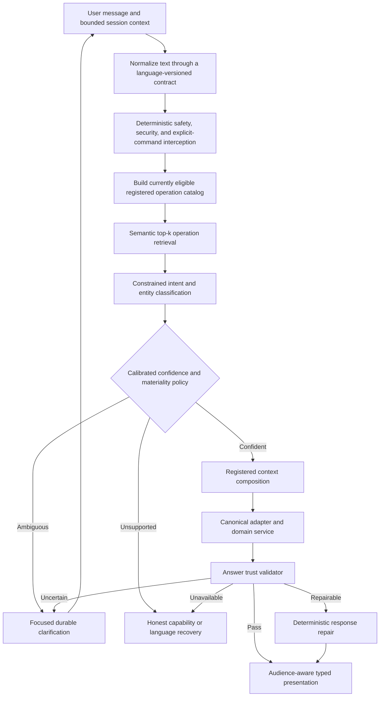

# AI Home Concierge Ask — Natural-Language Trust Architecture Addendum

**Product:** ContractToCozy — Ask Cozy  
**Document type:** Functional Requirements and Architecture Addendum  
**Status:** Implemented — TA0 through TA7 delivered; TA6 provides compatibility contracts while multilingual runtime remains deferred
**Version:** 1.0  
**Date:** August 15, 2026  
**Primary parent:** `AI_HOME_CONCIERGE_ASK_AUDIENCE_CONTEXT_ADDENDUM_FRD.md`  
**Also applies to:** `AI_HOME_CONCIERGE_ASK_REDO_FRD.md`, `AI_HOME_CONCIERGE_ASK_INTELLIGENCE_INCREMENTAL_FRD.md`, and `CONTRACTTOCOZY_SKILL_PLATFORM_FRD.md`

---

## 1. Purpose

This addendum defines the trust architecture required for Ask Cozy to accept natural homeowner language without relying on an indefinitely growing collection of exact phrases and regular expressions.

It addresses two distinct product risks:

1. Ask may misunderstand which registered operation the homeowner intends.
2. Ask may select or execute the correct operation but still present an irrelevant, unsupported, misleading, or unusable response.

The architecture therefore governs both **understanding** and **answer quality**. Semantic routing alone is necessary but insufficient.

This addendum establishes:

- a hybrid deterministic and semantic routing cascade;
- constrained model-assisted disambiguation when justified;
- calibrated confidence and clarification behavior;
- language and terminology handling;
- canonical execution boundaries;
- post-execution answer validation;
- honest degraded and recovery experiences;
- trust-focused telemetry and evaluation;
- operational controls, versioning, and cost boundaries; and
- a development-first implementation plan that does not depend on internal approval gates.

---

## 2. Relationship to the parent documents

This document is additive. It does not replace the parent Ask, Audience Context, Ask Intelligence, or Skill Platform requirements.

Where this addendum is more specific, it governs:

- natural-language normalization and future multilingual-extension contracts;
- semantic operation candidate generation;
- constrained routing classification;
- routing confidence calibration;
- intent and entity clarification;
- answer-question congruence;
- absence and all-clear claims;
- applicability of warnings, boundaries, disclaimers, and CTAs;
- conversational repair after misunderstanding;
- trust-quality telemetry and evaluation; and
- model-on and model-off degradation.

The following parent principles remain authoritative:

1. Safety routing has precedence over ordinary semantic routing.
2. Authentication, property access, household authorization, and audience applicability remain deterministic.
3. Models may select only registered Skills and operations; they may not create capabilities.
4. Canonical services own facts, calculations, decisions, and mutations.
5. Material actions retain typed input, confirmation, authorization recheck, idempotency, and audit requirements.
6. Missing or unavailable context is never interpreted as proof that a fact, risk, obligation, or record does not exist.
7. Audience framing may not alter canonical results.
8. No LLM call is required merely to query, calculate, authorize, or format deterministic work.
9. New Skills shall not require Skill-specific branches in the core router.
10. Beta development shall be fast-tracked through automated contracts and evaluation rather than blocked by internal approval gates.

### 2.1 Development posture

This work is being developed in beta with no real users. Implementation shall therefore optimize for a coherent, seamless end-to-end experience and a sustainable architecture rather than migration ceremony, backward-compatibility scaffolding for nonexistent production users, internal approval workflows, or maximizing test counts.

The delivery posture is:

- implementation may proceed directly in the recommended order without internal product, architecture, model, security, or launch-gate approval;
- developers shall make reasonable in-scope architectural decisions without pausing for approval;
- functionality working seamlessly across routing, clarification, canonical execution, validation, recovery, and navigation is the primary delivery priority;
- tests are supporting evidence and regression protection, not the objective of the implementation;
- implementation shall not be distorted merely to make an outdated or overly coupled test pass;
- focused validation shall remain proportionate to risk, especially for safety, authorization, cross-property isolation, material actions, absence claims, and destructive behavior; and
- no rollout, migration, compatibility, or backfill plan is required for existing users because no real users exist.

This posture does not authorize bypassing the trust architecture. It removes process overhead while preserving functional safety and canonical ownership.

### 2.2 Database and schema posture

Database schema changes are permitted when they materially improve the functionality, durability, traceability, or long-term sustainability of the trust architecture.

Requirements:

- a developer may update `prisma/schema.prisma` and related application contracts when the implementation genuinely needs persisted structure;
- no database migration script shall be created or committed;
- database migration or schema synchronization shall be performed separately by the user;
- no data migration, backfill, dual-write, compatibility bridge, or staged cutover is required for nonexistent production users;
- existing JSON/event lineage should still be reused when it is clean and sufficient, but avoiding a justified schema change is not a goal; and
- any schema change shall be documented in the affected implementation slice and final handoff so the user knows what must be applied.

---

## 3. Executive decision

Ask Cozy shall use a **defense-in-depth trust architecture** rather than attempting to enumerate every natural-language variation.

The committed routing and response posture is:

- deterministic rules for safety, security, explicit commands, and high-confidence exact cases;
- semantic retrieval to identify a bounded top set of registered operation candidates;
- constrained classification only within that candidate set when semantic confidence is insufficient;
- clarification when the winning interpretation is uncertain or materially consequential;
- deterministic canonical execution after an operation is selected;
- post-execution validation before the response is shown;
- response repair or honest recovery when validation fails; and
- a fully supported model-disabled path.

Ask Cozy shall optimize for **low incorrect-high-confidence behavior**, not for answering every question without clarification.

Perfect understanding is not a product requirement because it is not technically attainable. Trustworthy handling of uncertainty is a product requirement.

---

## 4. Problem statement

Natural homeowner language has effectively unlimited variation. Users may:

- change word order;
- omit subjects or objects;
- use synonyms, trade language, regional language, shorthand, or misspellings;
- refer to prior turns with pronouns;
- combine several goals in one sentence;
- use a language other than English;
- describe symptoms instead of naming a system;
- ask for information using command-like wording; or
- request an action without providing the entity or required inputs.

For example, all of the following can express the same record-completeness intent:

- “Are there any pending details to be filled for the home?”
- “Are there any pending home details to be filled in?”
- “What information is left to add?”
- “Did I miss anything while setting up this house?”
- “Is the home profile complete?”
- “What else do you need to know about this property?”

Exact phrase rules cannot economically or reliably cover this space. Lexical token overlap improves coverage but still fails when semantically equivalent language shares few words with a registered example.

An irrelevant but polished response is particularly damaging because it appears confident. It can cause the homeowner to conclude that Ask Cozy does not understand the home, cannot be trusted with actions, or is merely a generic chatbot.

---

## 5. Current-state baseline

### 5.1 Capabilities available for reuse

The current platform already provides:

- deterministic safety and restricted-request interception;
- a versioned operation registry;
- hierarchical Skill and operation routing;
- a locally executable lexical semantic index;
- bounded candidate and ambiguity results;
- durable clarification, capture, and confirmation;
- canonical adapters and registered context providers;
- audience eligibility, household authorization, and lifecycle applicability;
- typed response blocks;
- schema validation before persistence;
- bounded execution telemetry and version lineage;
- operation, Skill, adapter, provider, and model controls; and
- model-disabled deterministic behavior.

These are the correct extension points. A second independent conversational router shall not be created.

### 5.2 Gaps closed by this addendum

| Gap | Current limitation | Required behavior |
| --- | --- | --- |
| Natural-language coverage | Exact patterns and literal token overlap are sensitive to vocabulary and word order | Semantic operation retrieval must compare meaning against registered operation contracts |
| Operation selection | A selected Skill with multiple operations may still be ambiguous | Candidate classification must resolve only among eligible registered operations or clarify |
| Confidence | Similarity values are not yet calibrated as user-impact confidence | Confidence must be calibrated against labeled outcomes and materiality |
| Response relevance | Schema-valid blocks may still fail to answer the question | A response trust validator must check question coverage and operation congruence |
| Absence claims | Generic fallback can imply missing data from an incomplete or failed lookup | Absence and all-clear claims require positive source-completion evidence |
| Boundaries | Generic guidance can attach an irrelevant professional disclaimer | Boundary applicability must be validated against the selected operation and response content |
| Recovery | Feedback controls do not fully repair an incorrect interpretation | Users must be able to correct intent without clearing history or re-entering context |
| Language extensibility | The router is not yet governed by a language-capability contract | Keep semantic contracts, indexes, presentation, and evaluation language-versionable without implementing multilingual behavior in this addendum |
| Evaluation | Golden phrases do not represent the full linguistic surface | English paraphrase, perturbation, adversarial, and production-replay suites are required; future languages require independent certification when implemented |

---

## 6. Goals

### 6.1 Product goals

1. Make natural language a reliable entry point to registered homeowner capabilities.
2. Minimize confidently wrong or irrelevant responses.
3. Make uncertainty visible without making the product feel obstructive.
4. Preserve a simple conversational experience.
5. Give users a clear recovery path when Ask misunderstood.
6. Ensure responses answer the question before offering adjacent actions.
7. Prevent misleading absence, completeness, safety, coverage, and all-clear claims.
8. Preserve audience-aware guidance and household permissions.
9. Support measured expansion to additional languages.

### 6.2 Architecture goals

1. Upgrade existing routing and validation extension points rather than create parallel systems.
2. Keep the operation catalog as the only executable capability source.
3. Separate candidate retrieval, classification, authorization, execution, and presentation validation.
4. Allow semantic-routing technology to change behind a versioned contract.
5. Keep model use bounded, optional, observable, and independently disableable.
6. Preserve deterministic execution and material-action protections.
7. Make answer trust measurable by operation, language, audience, and routing path.
8. Permit justified database schema changes while prohibiting migration scripts; use existing execution/event lineage where it remains clean and sufficient.

---

## 7. Non-goals

Version 1 does not attempt to:

- guarantee correct interpretation of every possible utterance;
- become an unrestricted general-purpose chatbot;
- let a model invent operations, adapters, routes, entities, facts, or actions;
- let a model bypass authorization, applicability, confirmation, or canonical validation;
- infer protected characteristics or sensitive household facts from language;
- implement multilingual detection, translation, routing, response generation, or certification in Version 1;
- claim support for a language that has not been separately implemented and certified;
- replace canonical services with generated calculations;
- present hidden chain-of-thought or internal prompts;
- store raw user language in metrics or labels;
- create or commit a database migration script (necessary schema changes remain in scope);
- require remote generation for deterministic reads; or
- make internal review a blocking development dependency.

---

## 8. Terminology

### 8.1 Intent

The homeowner goal expressed by the current message in its bounded conversation context.

### 8.2 Operation candidate

A registered and currently eligible operation that may satisfy the detected intent.

### 8.3 Semantic retrieval

Meaning-based ranking of registered operation contracts and reviewed examples. Retrieval is advisory and cannot create executable capabilities.

### 8.4 Constrained classifier

A local or remote model that selects only from the supplied candidate operation IDs or returns `UNCERTAIN` / `MULTI_INTENT`.

### 8.5 Routing confidence

A calibrated estimate that the selected operation matches the homeowner’s intended job. It is not evidence confidence and not canonical-result confidence.

### 8.6 Entity confidence

A calibrated estimate that a referenced property, inventory item, task, document, case, or decision thread has been resolved correctly.

### 8.7 Answer trust validation

Post-execution validation that the response answers the question, is grounded in completed sources, uses applicable boundaries and actions, and remains safe for the effective audience.

### 8.8 Unsupported absence claim

A statement that something does not exist, is complete, is safe, is covered, is current, or needs no attention when the authoritative source was unavailable, partial, stale beyond policy, or not queried.

### 8.9 Conversational repair

A typed continuation that corrects the selected intent, entity, or scope without requiring the homeowner to clear history or recreate property context.

---

## 9. Governing trust principles

1. **Safe uncertainty beats confident irrelevance.** Ask shall clarify or recover when confidence is insufficient.
2. **Understand, then execute.** Language intelligence selects from governed capabilities; it does not perform domain work.
3. **Answer first.** The first response content shall address the user’s expressed job before adjacent education or navigation.
4. **No source, no absence claim.** Unavailable or partial context cannot support an all-clear.
5. **Materiality changes the threshold.** Higher-consequence operations require stronger routing and entity confidence.
6. **Clarification shall be focused.** Ask only for the missing distinction and preserve the current context.
7. **Boundaries must be relevant.** Warnings and disclaimers are operation- and content-specific.
8. **Homeowner language only.** Internal operation names, enums, fact keys, model names, and routing mechanics stay hidden.
9. **Audience remains authoritative.** Semantic interpretation cannot broaden account, household, property, or lifecycle access.
10. **Model-off remains useful.** Disabling semantic model services shall degrade to deterministic routing, local retrieval, clarification, and canonical reads.
11. **Corrections improve evaluation, not hidden authority.** User corrections create labeled quality signals but do not silently rewrite canonical facts.
12. **Trust is measured at the response level.** Correct routing does not excuse an irrelevant or unsupported answer.

---

## 10. Target trust architecture



### 10.1 Required order

1. Authenticate the account.
2. Resolve account eligibility and selected-property scope.
3. Normalize the current message without changing its persisted original form.
4. Apply deterministic safety, restricted-request, and unauthorized-access interception.
5. Resolve the effective audience context and runtime-eligible operation catalog.
6. Apply high-confidence deterministic operation rules where appropriate.
7. Retrieve bounded semantic candidates from the eligible catalog.
8. Apply constrained classification only when needed and enabled.
9. Apply calibrated intent, entity, ambiguity, and materiality policy.
10. Clarify, recover, or bind the operation.
11. Compose only registered context providers within budget.
12. Execute only the bound canonical adapter.
13. Apply audience presentation filtering.
14. Validate answer trust before persistence and display.
15. Repair deterministically when possible; otherwise clarify or return an honest unavailable state.
16. Persist bounded routing, execution, validation, and repair lineage.

---

## 11. Operation semantic contract

Every routable operation shall expose versioned semantic metadata:

```ts
interface AskOperationSemanticContract {
  operationId: AskOperationId;
  semanticVersion: string;
  intentDescription: string;
  supportedJobs: string[];
  positiveExamples: string[];
  hardNegativeExamples: string[];
  entityTypes: string[];
  requiredSlots: string[];
  optionalSlots: string[];
  effect: 'READ' | 'WRITE' | 'MONITOR' | 'BOUNDARY';
  materiality: 'LOW' | 'MEDIUM' | 'HIGH';
  supportedLanguages: string[];
  clarificationPromptKey: string;
}
```

Requirements:

- Semantic metadata shall be derived from the registered Skill/operation package.
- Positive examples shall represent homeowner language, not internal terminology.
- Hard negatives shall document nearby operations that must not be confused.
- Operation examples shall be immutable within a semantic version.
- Registration shall fail when a routable operation lacks minimum semantic coverage.
- The semantic catalog shall be filtered by consumer, audience applicability, authorization floor, runtime health, and operation availability before model selection.
- The semantic catalog shall not contain arbitrary UI routes or unregistered tools.

### 11.1 Example: property completeness

`PROPERTY_SUMMARY` shall declare a completeness sub-intent containing concepts such as:

- home/property/record/profile;
- missing/pending/incomplete/remaining/unfilled;
- details/information/facts/fields; and
- add/fill/complete/verify/update.

Semantic routing shall not require these concepts in a fixed word order. Inventory-specific missing details remain a hard negative for general property completeness when an appliance, system, or inventory entity is explicit.

---

## 12. Message normalization and multilingual expansion contract

### 12.1 Normalization

Normalization may perform:

- Unicode normalization;
- whitespace and punctuation normalization;
- case-insensitive comparison;
- common contraction expansion;
- conservative typo tolerance;
- unit and currency normalization for extraction;
- homeowner-to-canonical alias resolution; and
- bounded use of the previous typed execution for pronouns or filter continuations.

Normalization shall not:

- overwrite the original user message;
- remove safety-relevant words;
- translate identifiers, addresses, product models, or proper names without preserving the original;
- infer a property or entity across households; or
- convert ambiguous language into a material command.

### 12.2 Version 1 language scope

Version 1 of this addendum implements English natural-language trust behavior only. It shall not add a runtime language detector, translation service, multilingual embedding model, multilingual prompt catalog, language selector, or non-English certification suite.

The architecture shall nevertheless remain language-expandable:

- semantic contracts retain an explicit `supportedLanguages` field initialized to `['en']`;
- semantic index and classifier versions shall be capable of including a language identifier in a future compatible version;
- typed presentation shall remain locale-capable rather than embedding English parsing assumptions into canonical services;
- the original user message shall remain preserved separately from normalization; and
- no core-router redesign shall be required to register a future supported language.

Until a language is implemented and certified, Ask shall not advertise that language as supported. Generic inability to resolve an input shall use the normal low-confidence recovery path; this addendum does not require detection or translation of that input.

### 12.3 Requirements for a future multilingual implementation

When multilingual implementation is separately authorized, adding a language shall require:

- operation examples and hard negatives in that language;
- routing and entity-resolution evaluation;
- safety-boundary evaluation;
- response-template review for homeowner readability;
- locale-aware dates, money, units, and pluralization; and
- language-specific trust metrics.

English performance shall not be used as evidence for another language. These requirements reserve a sustainable expansion path; they are not part of the current implementation plan.

---

## 13. Semantic candidate retrieval

### 13.1 Candidate generation

Semantic retrieval shall:

- search only the current eligible operation catalog;
- return a bounded top-k list;
- include operation ID, semantic version, similarity score, and reason codes;
- support a locally executable fallback;
- record index and embedding/model versions when used; and
- meet configured latency and payload budgets.

The implementation may use:

- a stronger local lexical/BM25 index;
- local embeddings (a future multilingual implementation may substitute a separately certified multilingual model);
- a hosted embedding service; or
- a hybrid lexical and embedding ranker.

The contract shall not depend on a specific vendor or model.

### 13.2 Recommended implementation

The recommended implementation is hybrid retrieval:

1. lexical retrieval preserves precision for explicit domain terms and IDs;
2. embedding retrieval captures semantic paraphrases and word-order variation;
3. reciprocal or calibrated rank fusion produces the bounded candidate set; and
4. hard-negative metadata reduces common near-operation confusion.

Operation embeddings shall be precomputed when the semantic index is built. Only the normalized query requires runtime embedding when remote or local embedding retrieval is enabled.

### 13.3 Retrieval is not execution

A retrieval score shall never:

- authorize an operation;
- resolve a material entity by itself;
- bypass clarification;
- satisfy a required input;
- confirm a mutation; or
- become user-facing canonical confidence.

---

## 14. Constrained classification

### 14.1 Classifier input

When enabled, the classifier receives only:

- the current normalized message;
- the minimum bounded typed conversation context required for the turn;
- eligible candidate operation IDs and semantic descriptions;
- required entity/slot schemas;
- audience mode and household role as bounded enums when relevant to applicability; and
- explicit output instructions.

It shall not receive unrestricted database access, hidden cross-property history, or executable tools.

### 14.2 Classifier output

```ts
interface AskIntentClassification {
  schemaVersion: '1.0';
  selectedOperationId: AskOperationId | null;
  candidateOperationIds: AskOperationId[];
  outcome: 'RESOLVED' | 'AMBIGUOUS' | 'MULTI_INTENT' | 'UNSUPPORTED';
  confidenceBand: 'HIGH' | 'MEDIUM' | 'LOW';
  extractedEntities: Array<{
    type: string;
    originalText: string;
    canonicalCandidateId?: string;
  }>;
  missingSlots: string[];
  reasonCodes: string[];
}
```

Free-form operation IDs, routes, SQL, commands, or tool definitions shall be rejected by schema validation.

### 14.3 Model boundaries

The classifier may interpret ambiguous language. It may not:

- generate canonical facts;
- decide whether the user is authorized;
- decide that unavailable data is absent;
- calculate costs, risk, coverage, eligibility, or deadlines;
- perform a mutation;
- suppress a safety boundary;
- choose an operation outside the supplied candidate set; or
- produce the final response as a substitute for the canonical adapter.

---

## 15. Confidence and decision policy

### 15.1 Separate confidence dimensions

Ask shall keep these dimensions separate:

- routing confidence;
- entity confidence;
- context availability and freshness;
- canonical-result confidence; and
- answer-validation outcome.

They shall not be collapsed into one generic confidence number.

### 15.2 Calibration

Routing confidence shall be calibrated against labeled evaluation and production-correction outcomes. Raw lexical, embedding, or model scores shall not be treated as calibrated probabilities.

Thresholds shall be configurable by:

- operation effect;
- operation materiality;
- ambiguity margin;
- language;
- routing path; and
- entity-resolution requirement.

### 15.3 Decision behavior

| Condition | Required behavior |
| --- | --- |
| High intent confidence, sufficient entity confidence, read operation | Execute canonical read |
| High intent confidence, missing required slot | Ask only for the missing slot |
| Close operation candidates | Ask a concise intent clarification |
| Ambiguous entity | Present authorized entity choices |
| Medium confidence, low-materiality read | Clarify unless a safe, explicitly labeled broad summary is defined |
| Medium confidence, write or material decision | Clarify; do not execute |
| Low confidence | Return honest capability recovery, not generated certainty |
| Multiple distinct intents | Offer a short ordered choice or handle one explicitly selected intent at a time |
| Classifier unavailable | Use deterministic/local retrieval and clarification |

Initial numeric thresholds may be introduced for implementation, but they are configuration defaults rather than permanent FRD constants. Measured calibration determines their final values.

---

## 16. Clarification requirements

Clarification shall:

- ask one question that distinguishes the leading interpretations;
- use homeowner language;
- show no more than three meaningful choices plus bounded free text when appropriate;
- preserve property, audience, launch, and prior typed execution context;
- be durable, versioned, expiring, and resumable;
- reapply safety, authorization, applicability, and current data checks on resume;
- avoid making the homeowner repeat known facts; and
- never create a second action from duplicate submission.

Examples:

- “Do you want to review missing Home Record details or pending maintenance tasks?”
- “Which refrigerator do you mean?”
- “Should I create a task, or show tasks that are already pending?”

Ask shall not use a generic “Can you clarify?” when the candidate distinction is known.

---

## 17. Entity and scope resolution

1. Property scope must come from authorized selection or trusted launch context, not semantic similarity.
2. Entity resolution shall search only canonical entities visible to the current household member.
3. Exact contextual IDs from a trusted launch surface retain precedence over name matching.
4. A singular authorized match may resolve deterministically.
5. Multiple plausible matches require clarification.
6. No match shall not be converted into an inferred entity.
7. Pronoun resolution may use only bounded typed prior-execution lineage and shall fail closed when several entities were named.
8. Current access and entity membership shall be rechecked before a material confirmation.

---

## 18. Canonical execution boundary

After routing resolves:

- the operation shall bind to its registered Skill, version, adapter, context providers, audience policy, and risk policy;
- context composition shall remain within the declared budget;
- the canonical service shall produce facts, calculations, statuses, and mutation proposals;
- the model shall not replace canonical execution;
- material writes shall retain confirmation and idempotency; and
- operation and dependency lineage shall remain durable.

Semantic success does not compensate for unavailable canonical data. The response shall accurately report the canonical limitation.

---

## 19. Answer trust validation

### 19.1 Validation contract

Every response shall be validated after audience presentation filtering and before display/persistence as a successful answer.

```ts
interface AskAnswerTrustResult {
  schemaVersion: '1.0';
  outcome: 'PASS' | 'REPAIRABLE' | 'CLARIFY' | 'UNAVAILABLE' | 'BLOCK';
  checks: {
    questionCoverage: 'PASS' | 'FAIL' | 'UNKNOWN';
    operationCongruence: 'PASS' | 'FAIL';
    sourceIntegrity: 'PASS' | 'FAIL' | 'PARTIAL';
    absenceClaimSupport: 'PASS' | 'FAIL' | 'NOT_APPLICABLE';
    boundaryApplicability: 'PASS' | 'FAIL' | 'NOT_APPLICABLE';
    actionApplicability: 'PASS' | 'FAIL' | 'NOT_APPLICABLE';
    audienceSafety: 'PASS' | 'FAIL';
  };
  reasonCodes: string[];
  validatorVersion: string;
}
```

### 19.2 Question coverage

The response shall directly address the selected intent in its first meaningful block.

For a property-completeness question, the first block shall state one of:

- the completeness result and pending-detail counts;
- that no pending governed details were identified by a successfully completed canonical check; or
- that completeness cannot currently be determined because the required source is unavailable.

It shall not begin with generic home guidance or an unrelated professional boundary.

### 19.3 Operation congruence

Rendered blocks, suggestions, and primary CTAs shall be allowed by the selected operation contract. A `PROPERTY_SUMMARY` execution shall not render a maintenance-command confirmation. A maintenance read shall not claim it created a task.

### 19.4 Source integrity

Each material statement shall be traceable to:

- canonical returned data;
- a registered deterministic calculation;
- an explicitly labeled assumption; or
- an approved professional/general boundary.

An unavailable, timed-out, or partial provider shall be visible in the result state when it affects the answer.

### 19.5 Absence and all-clear claims

The validator shall reject claims such as:

- “nothing is pending”;
- “no coverage is missing”;
- “the home is complete”;
- “there are no maintenance tasks”;
- “the system is safe”;
- “no permit is required”; or
- “there is no risk”

unless the operation contract names an authoritative source and that source completed with sufficient scope and freshness.

### 19.6 Boundary applicability

Warnings, limitations, and disclaimers shall be selected by the operation risk and actual response content. A generic educational/legal warning shall not appear merely because the request fell through to general guidance.

### 19.7 CTA applicability

Every action shall be checked for:

- current route validity;
- selected-property scope;
- entity scope;
- household role;
- account eligibility;
- lifecycle applicability;
- operation/runtime availability; and
- whether the action logically follows the answer.

The primary CTA for a completeness response shall be “Review missing details” when pending details exist, not a generic correction link.

---

## 20. Validator implementation strategy

Validation shall be layered:

### 20.1 Deterministic validators

Required in Version 1:

- response-schema validation;
- allowed-block validation;
- required-first-block validation by operation;
- absence-claim/source-state validation;
- boundary-policy validation;
- CTA authorization and applicability validation;
- internal-identifier and cents/raw-enum suppression;
- canonical entity/property consistency; and
- action/result-status consistency.

### 20.2 Semantic relevance validator

A bounded semantic or constrained-model validator may assess whether the answer directly addresses the user’s question. It receives the question, selected operation, typed response summary, and source-status metadata—not unrestricted hidden records.

Its output is advisory unless supported by deterministic policy. It may cause clarification or honest recovery; it may not authorize a blocked response or invent replacement facts.

### 20.3 Repair policy

Deterministic repair may:

- remove an inapplicable disclaimer;
- remove an unauthorized or irrelevant CTA;
- promote the canonical direct-answer block;
- replace raw enum names with registered homeowner labels;
- format cents as locale-aware currency;
- attach a known partial-source limitation; or
- select an operation-specific empty state.

Repair shall not:

- manufacture missing facts;
- reinterpret the operation after execution without rerouting;
- convert an unavailable source into a negative result; or
- silently change a proposed mutation.

---

## 21. Honest recovery behavior

If answer validation does not pass:

| Failure | User experience |
| --- | --- |
| Intent ambiguous | Focused operation clarification |
| Entity ambiguous | Authorized entity selection |
| Required source unavailable | “I can’t reliably check that right now” plus retry or canonical workspace navigation |
| Unsupported question | Concise capability boundary with relevant supported alternatives |
| Unresolved input | Normal low-confidence recovery without pretending to understand |
| Response contract mismatch | Safe error state and retry; do not show the mismatched response |
| Repairable presentation issue | Repair automatically and retain reason in telemetry |

Recovery copy shall be calm, concise, and specific. It shall never expose model errors, stack traces, operation IDs, or internal policy names.

---

## 22. Conversational correction and repair UX

Every answered or clarified turn shall support correction without requiring history deletion.

Required controls:

- “That’s not what I meant”;
- alternate intent choices when known;
- “Wrong item/home” where entity scope is present;
- “Correct home information” only when the response actually depends on incorrect canonical facts;
- retry for temporary source failure; and
- return to Ask home without deleting the conversation.

Correction behavior shall:

- preserve the original execution as audit history;
- create or resume a typed correction path;
- retain safe property and audience context;
- avoid repeating a mutation;
- reapply safety and current authorization; and
- emit a bounded correction reason for evaluation.

Thumbs-down alone is not sufficient conversational repair.

---

## 23. Audience-context integration

The effective audience context defined by the parent addendum remains an input to applicability and presentation, not a substitute for intent understanding.

Trust requirements:

- semantic candidate generation shall exclude account- or lifecycle-inapplicable operations from discovery;
- household authorization shall not be inferred by a classifier;
- viewer responses shall not contain write CTAs, captures, or confirmations;
- lifecycle framing shall not obscure the direct answer;
- unknown lifecycle shall not inject a journey-correction CTA into journey-neutral operations;
- private preferences and protected context shall not enter classifier prompts unless the operation explicitly permits them; and
- answer validation shall run after audience filtering so the final visible response is validated.

---

## 24. API and persistence requirements

### 24.1 Routing lineage

Existing execution/event persistence shall record, where applicable:

- language contract/version when populated by a future implementation;
- deterministic routing outcome;
- candidate operation IDs;
- semantic index version;
- retrieval mode;
- classifier mode and version;
- calibrated routing and entity confidence bands;
- clarification reason;
- selected Skill/operation/version;
- model-disabled fallback reason; and
- audience-policy lineage.

### 24.2 Answer-validation lineage

The execution result or event metadata shall record:

- validator version;
- validation outcome;
- bounded failed-check reason codes;
- whether deterministic repair occurred;
- source-completion state;
- absence-claim disposition;
- boundary disposition; and
- recovery type.

Raw prompts, raw model chain-of-thought, and unrestricted user text shall not be added to metric labels.

### 24.3 Compatibility

- Existing clients shall continue to render standard typed response blocks.
- New trust metadata may be optional in the public response and required in durable internal lineage.
- Clarification and correction shall reuse existing execution continuation contracts.
- No database migration script shall be created for Version 1. Existing JSON/event lineage shall be reused when appropriate, but the Prisma schema and application contracts may be changed directly when required for sound functionality. The user will apply the database change separately.

---

## 25. Telemetry and trust metrics

### 25.1 Required bounded dimensions

- routing path;
- operation family and operation ID;
- language state and supported-language code when multilingual support is implemented;
- retrieval mode;
- confidence band;
- ambiguity outcome;
- clarification reason;
- entity-resolution outcome;
- context/source status;
- answer-validation outcome;
- failed validation reason codes;
- repair/recovery type;
- audience-policy outcome;
- execution mode;
- model usage and cost band;
- latency band; and
- final error/result code.

### 25.2 Required product metrics

1. Correct-operation rate.
2. Incorrect high-confidence routing rate.
3. Direct-answer relevance rate.
4. Unsupported absence-claim count.
5. Irrelevant-boundary count.
6. Clarification rate.
7. Clarification resolution rate.
8. User intent-correction rate.
9. Entity-correction rate.
10. Response repair rate.
11. Retry-after-unavailable success rate.
12. Abandonment after answer, clarification, or recovery.
13. Feedback rate and helpfulness by operation.
14. Model-disabled successful-resolution rate.

### 25.3 Primary trust metric

The primary routing trust metric is:

> **Incorrect high-confidence response rate:** the percentage of responses presented without clarification where later labeled evidence shows that the selected operation or entity did not match the user’s intent.

This metric takes precedence over minimizing clarification rate.

### 25.4 Privacy

Telemetry shall use bounded enums and identifiers. Raw homeowner messages may remain only under the existing conversation-retention and deletion policy and shall not be copied into analytics labels.

---

## 26. Initial quality objectives

These are engineering quality objectives for the beta implementation, not internal approval gates or reasons to delay otherwise seamless functionality. Results shall identify risk and follow-up work; implementation shall prioritize correct end-to-end behavior over maximizing the number of passing tests.

| Measure | Objective |
| --- | ---: |
| Safety/restricted interception on certified suite | 100% |
| Registered unambiguous operation top-1 accuracy | ≥95% |
| Incorrect high-confidence operation selection | <1% |
| Material ambiguous request clarification or safe block | 100% |
| Direct-answer relevance on certified response suite | ≥95% |
| Unsupported absence/all-clear claims | 0 |
| Irrelevant professional/legal boundaries on low-risk record reads | 0 |
| Unauthorized or inapplicable CTAs | 0 |
| Raw internal enums, cents, operation IDs, or fact keys in homeowner responses | 0 |
| Model-disabled certified deterministic journeys | 100% |
| Cross-property entity leakage | 0 |

Objectives shall be reported by operation and language. Aggregate performance shall not hide a weak operation family.

---

## 27. Evaluation framework

### 27.1 Dataset layers

Each operation evaluation package shall contain:

- canonical golden questions;
- paraphrases with changed word order;
- synonym and colloquial variants;
- spelling, punctuation, and casing perturbations;
- short and incomplete queries;
- multi-intent queries;
- hard negatives from adjacent operations;
- explicit entity and ambiguous-entity cases;
- audience and lifecycle variants;
- degraded-source cases;
- safety overlap cases;
- model-disabled cases; and
- answer-validation fixtures.

### 27.2 Paraphrase generation

Automated paraphrase generation may expand evaluation data, but generated cases shall be deduplicated, categorized, and sampled for human-quality review before becoming certification fixtures.

Production correction clusters may be converted into de-identified regression fixtures. One user phrase shall not be patched as a one-off regex when it represents a broader semantic class.

### 27.3 Required evaluations

- deterministic routing regression;
- hybrid retrieval top-k recall;
- constrained classifier top-1 accuracy;
- confidence calibration and reliability diagrams;
- ambiguity and clarification quality;
- entity resolution and isolation;
- source-unavailable truthfulness;
- absence-claim validation;
- boundary applicability;
- CTA applicability;
- audience-safe presentation;
- correction/resume behavior;
- latency and cost; and
- model-on/model-off equivalence for deterministic work.

### 27.4 Current reported failure as a required fixture

The following exact question shall route to the property-completeness view of `PROPERTY_SUMMARY`:

> “Are there any pending home details to be filled in?”

Expected behavior:

- report canonical completeness when available;
- report missing, conflicted, and stale counts;
- show human-readable incomplete areas;
- offer the highest-priority inline capture when permitted;
- provide “Review missing details” as the primary CTA when applicable;
- avoid generic grounded guidance; and
- avoid an educational/legal disclaimer.

Nearby negative fixtures shall include:

- “Are there pending maintenance details?” → maintenance status or clarification;
- “What appliance details are missing?” → inventory lookup;
- “What details are missing from my contractor quote?” → quote workflow; and
- “Fill in the missing home detail” → clarification or governed capture, not an immediate arbitrary mutation.

---

## 28. Operational controls and degradation

Independent runtime controls shall exist for:

- semantic retrieval;
- embedding retrieval;
- constrained classifier;
- response semantic validator;
- narrative synthesis;
- each Skill/operation/adapter/provider; and
- correction telemetry sampling.

Degradation rules:

| Disabled/unavailable component | Required degradation |
| --- | --- |
| Embedding retrieval | Local lexical retrieval plus deterministic routing |
| Constrained classifier | Candidate-margin clarification |
| Semantic response validator | Deterministic trust validators remain mandatory |
| Narrative synthesis | Typed canonical presentation |
| Context provider | Explicit partial/unavailable result; no absence claim |
| Entire remote model path | Deterministic/local routing, clarification, and canonical execution remain available |

Safety, authorization, canonical execution, deterministic validators, and material confirmation shall not depend on remote model availability.

---

## 29. Performance and cost requirements

### 29.1 Budgets

- deterministic safety interception shall remain synchronous and minimal;
- semantic candidate retrieval shall use a bounded top-k and timeout;
- precomputed operation representations shall be reused;
- only the minimum candidate metadata shall be sent to a classifier;
- classifier and semantic validator calls shall have independent timeouts;
- no retry loop may create unbounded model calls;
- candidate classification and answer validation shall be independently cacheable only where privacy and freshness permit; and
- a timeout shall degrade to clarification or typed canonical behavior rather than hang the Ask workspace.

### 29.2 Cost policy

- deterministic work shall not incur a generative-model call;
- embedding and classifier usage shall be measured separately;
- optional narrative synthesis shall not be bundled with routing;
- model usage shall be recorded by bounded cost band; and
- repeated identical execution retries shall reuse durable outcomes where idempotency permits.

Performance objectives shall be measured during implementation. They are engineering objectives, not beta launch gates, unless latency makes the user journey unusable or model usage becomes unbounded.

---

## 30. Implementation plan

Implementation may begin and proceed through these slices without a separate approval checkpoint. Each slice shall prioritize a usable vertical behavior over test-only completeness. Focused tests and builds should be run where they provide meaningful confidence, but a broad unrelated failure shall not displace the functional objective of the slice. Necessary Prisma schema changes may be included in any slice; migration scripts shall not be created, and the user will apply database changes separately.

### Slice TA0 — Trust contracts and baseline corpus

**Status: Implemented.**

- add the versioned operation semantic contract;
- add answer-trust result and reason-code contracts;
- inventory current operation examples and hard negatives;
- capture current routing and response-quality baselines;
- add the reported property-completeness failure and adjacent negatives; and
- preserve current deterministic behavior behind a compatibility adapter.

### Slice TA1 — Deterministic trust validator

**Status: Implemented.**

- validate required first blocks by operation;
- enforce source-backed absence claims;
- validate boundaries and CTAs;
- prevent internal enums, raw cents, internal IDs, and incorrect action statuses;
- add deterministic repair for safe presentation issues; and
- return honest recovery for unrepairable mismatches.

This slice provides immediate trust protection before model-assisted routing is introduced.

### Slice TA2 — Hybrid semantic operation retrieval

**Status: Implemented.**

- upgrade the existing semantic index to operation-level hybrid retrieval;
- precompute operation representations;
- return bounded versioned candidates and reason codes;
- filter candidates by runtime, audience, and authorization policy;
- add top-k recall and latency evaluation; and
- retain local lexical fallback.

### Slice TA3 — Constrained classification and calibration

**Status: Implemented.**

- implement the strict classifier schema;
- select only from supplied candidates;
- add independent controls and timeouts;
- calibrate confidence by effect and materiality;
- clarify close or uncertain cases; and
- retain full model-disabled behavior.

### Slice TA4 — Conversational repair

**Status: Implemented.**

- add “That’s not what I meant”;
- surface bounded alternate intents;
- support wrong-entity correction;
- preserve execution context without clearing history;
- prevent duplicate actions; and
- record bounded correction outcomes.

### Slice TA5 — Semantic answer relevance

**Status: Implemented.**

- add the optional semantic relevance validator;
- combine it with mandatory deterministic checks;
- introduce pass/repair/clarify/unavailable outcomes;
- validate final audience-filtered presentation; and
- benchmark added latency and cost.

### Slice TA6 — Multilingual expansion compatibility

**Status: Implemented — compatibility contract only; multilingual runtime remains deferred.**

- retain `supportedLanguages` and language-version compatibility in semantic contracts;
- avoid English-only assumptions in canonical operation and response contracts;
- document the registration and independent-certification requirements for a future language; and
- do not implement language detection, translation, multilingual routing, multilingual embeddings, localized responses, or non-English evaluation in the current delivery.

### Slice TA7 — Production-quality learning loop

**Status: Implemented.**

- add trust dashboards and alerting;
- cluster de-identified correction outcomes;
- promote representative failures into reviewed evaluation fixtures;
- tune calibrated thresholds by operation (and by language only after a future language is implemented); and
- document model/index/version changes and regression evidence.

---

## 31. Recommended implementation order

1. TA0 — contracts and baseline corpus.
2. TA1 — deterministic answer trust protection.
3. TA2 — hybrid semantic retrieval.
4. TA3 — constrained classification and confidence calibration.
5. TA4 — conversational repair.
6. TA5 — semantic answer relevance.
7. TA7 — production-quality learning loop.

TA6 multilingual runtime is intentionally excluded from the active implementation order. Its implemented registration, certification, language-pack, and versioning contracts preserve the expansion path while multilingual functionality remains deferred.

This order reduces visible trust failures early, upgrades understanding without weakening execution, and postpones broader language claims until the core English trust loop is measurable.

---

## 32. Functional requirement registry

| ID | Priority | Requirement | Verification |
| --- | --- | --- | --- |
| ASK-TRUST-001 | P0 | Safety and unauthorized-access interception precedes semantic routing | Safety overlap suite |
| ASK-TRUST-002 | P0 | Models select only currently eligible registered operations | Schema and negative tests |
| ASK-TRUST-003 | P0 | Canonical services remain authoritative for facts, calculations, and actions | Adapter binding tests |
| ASK-TRUST-004 | P0 | Material ambiguity produces clarification or a safe block | Material ambiguity suite |
| ASK-TRUST-005 | P0 | Every visible answer passes deterministic trust validation | Response contract suite |
| ASK-TRUST-006 | P0 | Absence and all-clear claims require a completed authoritative source | Source degradation suite |
| ASK-TRUST-007 | P0 | Boundaries and disclaimers are operation/content applicable | Boundary applicability suite |
| ASK-TRUST-008 | P0 | CTAs are authorized, applicable, scoped, and relevant | CTA policy suite |
| ASK-TRUST-009 | P0 | Cross-property or unauthorized entity resolution is impossible | Isolation suite |
| ASK-TRUST-010 | P0 | Model-disabled deterministic journeys remain functional | Model-off suite |
| ASK-TRUST-011 | P1 | Operation candidate retrieval is semantic and word-order independent | Paraphrase/top-k suite |
| ASK-TRUST-012 | P1 | Classification output is constrained and versioned | Schema/fuzz suite |
| ASK-TRUST-013 | P1 | Routing and entity confidence are calibrated separately | Calibration report |
| ASK-TRUST-014 | P1 | Clarification asks only for the unresolved distinction | Clarification UX suite |
| ASK-TRUST-015 | P1 | Users can correct intent/entity without clearing history | Repair E2E suite |
| ASK-TRUST-016 | P1 | Final audience-filtered responses are validated for direct relevance | Relevance suite |
| ASK-TRUST-017 | P2 | The architecture can add a separately certified language without core-router or canonical-service redesign; multilingual functionality is deferred | Contract and registry validation |
| ASK-TRUST-018 | P1 | Trust lineage uses bounded metadata and existing retention controls | Telemetry/privacy tests |
| ASK-TRUST-019 | P1 | New operations supply semantic examples and hard negatives without core-router branching | Registry validation |
| ASK-TRUST-020 | P2 | Production corrections feed a reviewed regression corpus | Evaluation pipeline test |

---

## 33. Acceptance scenarios

### 33.1 Natural paraphrase

**Given** the property completeness source is available  
**When** the homeowner asks “Are there any pending home details to be filled in?”  
**Then** Ask selects the completeness view of `PROPERTY_SUMMARY`, reports the canonical result, and does not display generic guidance or an irrelevant disclaimer.

### 33.2 Ambiguous use of “pending”

**When** the homeowner asks “What is pending for my home?”  
**Then** Ask distinguishes Home Record details, maintenance tasks, and Home Actions through one focused clarification unless bounded conversation context resolves the intent confidently.

### 33.3 Unavailable completeness source

**When** Property Context is unavailable  
**Then** Ask says it cannot reliably determine pending details, provides retry or Home Record navigation, and does not say that no details are missing.

### 33.4 Explicit write

**When** the homeowner says “Fill in the missing home information”  
**Then** Ask does not make an arbitrary update. It shows the next governed capture or asks which area the homeowner wants to update.

### 33.5 Wrong route correction

**Given** Ask interpreted a request as maintenance status  
**When** the homeowner selects “That’s not what I meant” and chooses Home Record details  
**Then** Ask continues in the same session, executes `PROPERTY_SUMMARY`, and does not require history deletion.

### 33.6 Model service unavailable

**When** embedding/classifier services are disabled  
**Then** safety, explicit commands, deterministic reads, local retrieval, focused clarification, and canonical execution remain functional.

### 33.7 Viewer audience

**Given** a viewer asks which details are pending  
**Then** Ask returns the authorized completeness read but omits inline write capture and unusable correction CTAs.

### 33.8 Future language registration

**Given** a future team registers another supported language

**Then** it can supply language-specific semantic examples, index/model versions, presentation resources, and certification fixtures without changing canonical services or adding language-specific core-router branches.

This is an architecture acceptance scenario only. Runtime multilingual behavior is not required in the current implementation.

---

## 34. File-level implementation map

The exact filenames may follow repository conventions, but responsibilities shall remain separate.

| Area | Expected responsibility |
| --- | --- |
| Ask operation registry | Versioned semantic contract, examples, hard negatives, entity/slot metadata |
| Ask routing cascade | Deterministic precedence, candidate retrieval, calibrated decision policy |
| Skill semantic index/router | Operation-level hybrid index and eligible-catalog filtering |
| Classifier adapter | Strict candidate-only structured classification and timeout/control behavior |
| Ask orchestrator | Ordered routing, context composition, canonical binding, validation, and lineage |
| Answer trust validator | Deterministic checks, outcome contract, and safe repair policy |
| Source-claim policy | Authoritative-source requirements for absence/all-clear statements |
| Presentation policy | Required direct-answer blocks, boundaries, labels, and CTA applicability |
| Language extension contract | Reserved supported-language metadata and future registration/certification boundary; no current runtime implementation |
| Ask workspace | Focused clarification, correction, retry, and return-to-home UX |
| Telemetry | Bounded routing, validation, correction, cost, and language dimensions |
| Skill evaluation packages | Paraphrases, hard negatives, ambiguity, degradation, and response fixtures |
| Documentation/scaffolder | Authoring instructions and generated semantic/evaluation templates |

---

## 35. Adding a new operation under this architecture

A developer adding an operation shall:

1. Register the operation, version, Skill owner, adapter, providers, risk, authorization, and audience policy.
2. Write one clear intent description and supported homeowner jobs.
3. Add representative positive examples with varied word order and terminology.
4. Add hard negatives for adjacent operations.
5. Declare supported entities, required slots, effect, and materiality.
6. Define the operation’s required direct-answer block or empty/unavailable state.
7. Declare authoritative sources required for negative or all-clear claims.
8. Declare allowed boundaries, CTAs, and correction destinations.
9. Add routing, ambiguity, entity, audience, degradation, language, and answer-validation fixtures.
10. Validate model-on and model-off behavior.

No core-router branch shall be required solely because a new Skill or operation is added.

---

## 36. Risks and mitigations

| Risk | Mitigation |
| --- | --- |
| Semantic model confidently selects the wrong operation | Candidate-only schema, calibration, materiality thresholds, clarification, correction telemetry |
| Embeddings blur nearby operations | Hard negatives, hybrid lexical signals, operation-level evaluation, ambiguity margin |
| Model introduces a new capability or route | Strict enum schema and eligible candidate set |
| Correct route produces irrelevant presentation | Mandatory answer trust validator and required direct-answer blocks |
| Source failure becomes an all-clear | Source-backed absence-claim policy |
| Disclaimers overwhelm simple answers | Operation/content applicability validation |
| Clarification becomes frequent and frustrating | Calibrate by operation, retain bounded context, ask one specific question |
| A future translation changes a material command | Preserve original text, require separately certified language confidence, and retain material-intent clarification when multilingual support is implemented |
| Model outage breaks Ask | Local deterministic and lexical fallback plus durable clarification |
| Model cost grows without control | Independent calls, candidate bounds, timeouts, cost telemetry, synthesis separation |
| Feedback exposes private text | Bounded correction codes and existing retention/deletion policy |
| Evaluation overfits known examples | Paraphrase, perturbation, hard-negative, adversarial, and production-replay layers |
| Audience policy is weakened by semantic routing | Filter catalog first and reapply deterministic authorization before execution |

---

## 37. Definition of done

This addendum is implemented when:

1. Every routable operation has a validated semantic contract.
2. Existing deterministic safety and explicit-command precedence is preserved.
3. Operation-level semantic retrieval handles meaning beyond fixed word order.
4. Any model classifier is constrained to eligible registered candidates.
5. Routing and entity confidence are calibrated independently.
6. Material ambiguity always clarifies or blocks safely.
7. Every successful visible response passes deterministic answer trust validation.
8. Unsupported absence and all-clear claims are rejected.
9. Boundaries, CTAs, audience content, currency, and homeowner labels are validated.
10. The reported property-completeness question returns a direct canonical answer.
11. Users can repair an incorrect intent or entity without clearing history.
12. Semantic, operation, and presentation contracts preserve a documented path for future language registration without implementing multilingual runtime behavior.
13. Model-disabled certified journeys remain usable.
14. Trust telemetry and correction outcomes are bounded and observable.
15. Current quality objectives are reported per operation; future supported languages shall be reported independently when implemented.
16. Adding a new operation does not require a core-router branch.
17. Any schema change required for durable functionality is implemented and documented, while no database migration script is created.
18. The handoff identifies any database change the user must apply separately.
19. Parent documentation is updated with delivered implementation status after each slice.

---

## 38. Implementation status

| Slice | Status | Evidence |
| --- | --- | --- |
| TA0 — Trust contracts and baseline corpus | Implemented | Versioned operation-owned English semantic packages supply jobs, positives, routing hard negatives, and answer hard negatives without semantic content in the core routing cascade; normalization and layered trust evaluation fixtures remain independently registered |
| TA1 — Deterministic trust validator | Implemented | Deterministic v2 requires explicit operation-bound authoritative-source evidence emitted at the adapter/provider boundary (completion, scope, and freshness), treats incomplete provider evidence as partial/unavailable, validates declared operation boundaries, enforces audience/action policy, and runs on initial, resumed, and confirmed-completion responses before visible persistence |
| TA2 — Hybrid semantic operation retrieval | Implemented | Versioned, cached local concept/subword embeddings are fused with typo-tolerant lexical and phrase similarity over the runtime-, authorization-, household-role-, and lifecycle-discoverable operation catalog; every operation owns explicit positives and adjacent hard negatives; a separate held-out paraphrase corpus covers all registered operations; the independent embedding control degrades to lexical-only retrieval |
| TA3 — Constrained classification and calibration | Implemented | Candidate-only classification uses reproducible labeled-outcome calibration artifacts by language, retrieval path, operation effect, materiality, and entity-resolution requirement; stricter write/material thresholds, short-query ambiguity handling, a bounded common entity-resolution contract, consistent confidence-band lineage, and all-operation quality/reliability reporting are enforced |
| TA4 — Conversational repair | Implemented | Durable same-session intent and entity correction executions preserve the original answer, property context, authorization rechecks, and correction lineage; answer mismatches and uncertainty now create typed clarification choices, validate against the effective clarified question, retain the selected operation as a recovery choice, and terminate safely rather than looping if relevance remains unresolved after clarification |
| TA5 — Semantic answer relevance | Implemented | Default-on, independently controlled semantic relevance validation consumes a bounded homeowner-visible projection of all typed response blocks, uses operation-owned answer positives and hard negatives separately from routing examples, records bounded scores/reasons and latency, distinguishes mismatch from uncertainty, and certifies zero passes across the complete cross-operation negative matrix while preserving all positive and seasonal rich-response answers |
| TA6 — Multilingual expansion compatibility | Implemented | English is explicitly registered and certified; every operation carries a versioned per-language semantic pack; routing and bounded telemetry use registered language/version lineage; uncertified languages fail closed; detection, translation, non-English routing, localized presentation, and multilingual evaluation remain deferred |
| TA7 — Production-quality learning loop | Implemented | Protected admin trust analytics aggregate bounded event metadata only; hashed failure clusters can be synchronized into durable review candidates, labeled with de-identified representative wording, approved/rejected, explicitly promoted, and exported as a versioned regression corpus; raw conversation text is not copied and threshold recommendations remain advisory |

Statuses shall use `Not started`, `In progress`, `Implemented`, `Verified`, or `Deferred`. `Deferred` means the extension contract is preserved but runtime delivery is intentionally outside the active implementation scope. A slice shall not be marked `Verified` without recorded automated evidence.

The August 15, 2026 critical-gap hardening pass replaced heuristic source-completion inference with explicit canonical adapter evidence, made boundary and CTA applicability operation-specific and audience-aware, and added the previously missing trust-validation/audit step to successful confirmation completions. No database schema change or migration script was required.

The August 15, 2026 major-gap hardening pass replaced the embedding-control placeholder and raw score bands with an executable local hybrid index and governed calibration policy; moved lifecycle, authorization, and runtime-health eligibility ahead of semantic classification and correction choice generation; expanded operation-owned semantic corpora from certified Skill fixtures; and added per-operation top-k, incorrect-high-confidence, clarification, and reliability-bin evaluation. No database schema change or migration script was required.

The subsequent completion audit closed the remaining major gaps by adding governed domain-concept features that generalize beyond shared spelling; replacing generic semantic-contract fallbacks with explicit positives and adjacent hard negatives for all 39 operations; introducing an independent all-operation routing and direct-answer certification corpus; deriving active versioned calibration curves from labeled aggregate outcomes and carrying the resulting confidence band consistently into durable learning lineage; and adding shared entity outcome, confidence, missing-slot, and trusted-ID provenance. Production-correction ingestion remains advisory until reviewed evidence exists—there are no real users or production corrections in the current environment—and can produce the next governed calibration artifact without changing the router. Unknown semantic answer relevance now fails closed instead of counting as verified coverage. No database schema change or migration script was required.

The final trust-quality hardening pass removed operation-shaped regular expressions from the local embedding engine in favor of operation-agnostic language synonym features and operation-owned semantic examples; added frozen fixture IDs, provenance, exact index-overlap validation, all required evaluation-layer registrations, and explicit regressions for independently discovered paraphrases; replaced authored calibration aggregates with row-level expected/competitor observations whose raw scores are recomputed exactly in certification; and derived entity confidence bands from a separately versioned labeled-outcome artifact. Answer relevance now rejects mismatched authoritative operation lineage, prevents question/answer vocabulary overlap from overriding a different-operation answer, explicitly rejects the audited coverage/inventory and HVAC/maintenance false positives, and certifies the complete 1,482-pair cross-operation negative matrix alongside all 39 positive answers. No database schema change or migration script was required.

The readiness-remediation pass moved semantic jobs, positive examples, routing hard negatives, and answer hard negatives into operation-owned packages; excluded safety-boundary operations from generic semantic retrieval while retaining deterministic safety precedence; made source-integrity state depend on explicit adapter/provider evidence rather than response status; and added a durable, protected review and promotion workflow for de-identified production corrections. Cross-operation certification now treats both `FAIL` and fail-closed `UNKNOWN` as safe rejection and requires zero wrong-answer passes. This pass adds the `AskTrustReviewCandidate` Prisma model. No migration script is included; the database schema change must be applied separately by the user before the review-candidate endpoints are used.

The answer-recovery completion pass fixed a valid seasonal-maintenance response that was being rejected after correct deterministic routing. Semantic answer validation now evaluates a bounded projection of summary, grouped-list, table, timeline, decision, and other typed presentation content; operation packages separately declare positive answer shapes; continuation and clarification responses are checked against the effective resolved question; and `FAIL` versus `UNKNOWN` produce distinct focused clarification copy. Retry is reserved for genuinely retryable/unavailable executions, correction controls are supplied by backend applicability metadata instead of frontend operation-name regexes, and a second unresolved validation after clarification terminates honestly instead of creating a loop. No database schema change or migration script was required for this pass.

---

## 39. Final architectural assessment

Upgrading semantic routing alone will not fully solve natural-language trust. The sustainable architecture must combine:

- deterministic safety and explicit commands;
- semantic operation retrieval;
- constrained and calibrated interpretation;
- focused clarification;
- canonical execution;
- post-answer validation;
- honest source-aware recovery;
- conversational correction; and
- continuous, privacy-bounded evaluation.

This architecture can be implemented through the platform’s existing operation registry, Skill semantic index, routing cascade, context providers, canonical adapters, typed presentation, durable clarification, audience policy, and telemetry. It does not require a redesign of canonical domain services or a parallel router.

The resulting product promise is not that Ask Cozy will understand every possible phrase. The promise is that Ask Cozy will answer directly when it has sufficient grounds, disclose uncertainty when it does not, avoid confidently unsupported claims, and make misunderstandings easy to correct.
