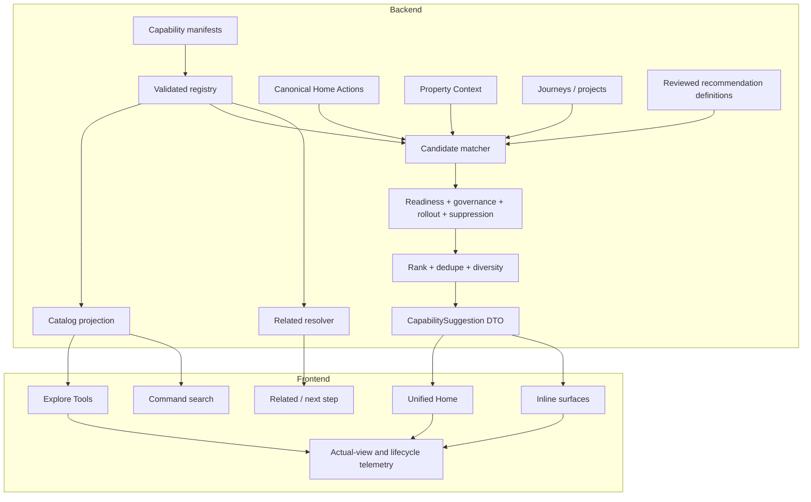

# Capability Discovery and Recommendation Platform — Implementation Plan

## Executive Summary

This plan converts the
[Capability Discovery and Recommendation Platform FRD](./CAPABILITY_DISCOVERY_AND_RECOMMENDATION_PLATFORM_FRD.md)
into an executable repository program.

The implementation will replace the current collection of frontend catalogs, recommendation
selectors, related-tool mappings, rollout aliases, and Knowledge Hub seed metadata with one
backend-owned capability registry. Canonical Home Actions, active journeys, Property Context, and
verified workflow completions will provide the contextual sources. A deterministic backend
evaluator will match those sources to registered capabilities, apply readiness and governance,
deduplicate existing action CTAs, rank and diversify candidates, and return bounded suggestions.

The delivery sequence deliberately separates:

1. **Registry convergence** — define and validate capabilities without changing user behavior.
2. **Catalog convergence** — move Explore Tools and command search onto the canonical registry.
3. **Recommendation convergence** — replace both handwritten selectors with one backend evaluator.
4. **Contextual distribution** — add related, inline, and post-completion suggestions.
5. **Operational hardening** — complete feedback, frequency, analytics, governance, and rollout.

The first release shall not require a Prisma schema change. Existing Product Analytics, rollout
configuration, Home Action lifecycle, Property Context, and personalization recommendation records
will be reused. A materialized property-capability state model shall be added only if measured
runtime volume or latency requires it.

### Recommended delivery shape

| Delivery model | Expected elapsed time | Notes |
| --- | ---: | --- |
| One cross-functional squad | 12–16 weeks | Sequential foundation with limited frontend/backend overlap |
| Two coordinated squads | 8–12 weeks | Platform/backend and experience/integration work can overlap after contract freeze |

These are planning ranges, not launch commitments. Each phase exits on evidence, not elapsed time.

### Required roles

- Product owner
- Backend/platform engineer
- Frontend engineer
- Product/design partner
- Analytics owner
- Domain reviewers for the initial capability tranche
- Trust/governance reviewer before real-user enforcement

### Implementation progress

Status as of July 24, 2026:

| Work package | Status | Evidence |
| --- | --- | --- |
| CAP-000 inventory generator | Complete | Repeatable 52-capability JSON and Markdown inventory |
| CAP-001 decision record | Complete | ADR-0001 establishes the backend-owned canonical registry |
| CAP-002 initial change guard | Complete | Generated inventory check is included in frontend QA gates |
| CAP-100 capability contract foundation | Complete | Zod contract covers framework, destination, recommendation, governance, readiness, and lifecycle metadata |
| CAP-101 registry foundation | Complete | Deterministic registry validates IDs, routes, rollout keys, and related references |
| CAP-102 availability adapter | Complete | Backend adapter preserves current rollout configuration and supports explicit beta-open and launch-closed failure modes |
| CAP-103 icon and route contracts | Complete | Backend allowlists icon names and route parameters; frontend registry resolves serialized icons |
| CAP-104 foundation tests | Complete | Product Framework suite includes focused capability contract tests |
| CAP-200 canonical definitions | Complete | All 52 capabilities are registered in backend-owned outcome-grouped definition files |
| CAP-201 recommendation classification | Complete | 24 contextual, one workflow-only, and 27 catalog-only definitions follow the conservative migration policy |
| CAP-202 legacy parity adapter | Complete | Test-only parity covers catalog identity, routes, rollout, lifecycle, and 31 related-tool mappings |
| CAP-203 completeness CI | Complete | Capability QA runs generated inventory validation and canonical registry parity tests |
| CAP-204 golden capability inventory | Complete | Nine fixtures cover every contextual definition and readiness reference |
| CAP-300 catalog projection service | Complete | Narrow serializable projection filters through canonical availability and resolves property-preserving destinations |
| CAP-301 authenticated catalog API | Complete | `GET /api/tool-capabilities` supports authorized property context, workflow inclusion, rollout filtering, cache variation, and registry version |
| CAP-302 frontend catalog client | Complete | Narrow frontend types, API wrapper, and query hook consume the canonical catalog contract |
| CAP-303 Explore Tools cutover | Complete | Canonical catalog drives outcome grouping, aliases, intent chips, readiness, beta badges, degraded state, and property-preserving links behind the rollback flag |
| CAP-304 command-search cutover | Complete | Homeowner command search uses the same catalog and indexes descriptions, aliases, outcome, job, destination, and supported context |
| CAP-305 actual-view impressions | Complete | Shared observer requires 50% visibility for 750 ms in an active document and deduplicates by session and registry version |
| CAP-306 ProductTool synchronization | Complete | Knowledge Hub projects all 52 canonical capabilities, preserves published stable keys and three platform/report entries, and performs non-destructive upserts |
| CAP-400 context source adapter | Complete | Privacy-safe evaluator input normalizes canonical actions, authorized fact quality, journeys, projects, personalization, completions, availability, and lifecycle without raw values or prose |
| CAP-401 candidate matcher | Complete | Deterministic structured matching applies reviewed precedence across action CTAs, definitions, trigger families, source/job, entities, journeys, projects, and completion relationships without free-text eligibility |
| CAP-402 readiness evaluator | Complete | Three-valued backend readiness evaluates property, facts, systems, coverage gaps, accepted/source context, and jurisdiction; only explicitly reviewed low-consequence capabilities may return safe partial value |
| CAP-403 governance and availability | Complete | Pre-ranking policy gates release state, permissions, safety tiers, approvals, context freshness, degraded responses, CTA availability, and structured-evidence disclosure |
| CAP-404 deduplication and suppression | Complete | Auditable suppression retains reason-coded diagnostics for CTA duplication, terminal/stale sources, dismissal cooldown, frequency caps, completion renewal, policy decisions, workflow compatibility, and deterministic equivalent-outcome deduplication |
| CAP-405 ranking and diversity | Complete | Deterministic 100-point ranking exposes six bounded diagnostic components, applies a useful-result threshold, caps Home at three, and enforces capability, source, and outcome diversity with stable tie-breaking |
| CAP-406 explanation builder | Complete | Narrow homeowner DTO uses reviewed templates and bounded structured context for why-now, outcome, readiness, authorized evidence, versions, source lineage, score band, and fully resolved same-origin launch paths without exposing raw ranking or policy diagnostics |
| CAP-407 evaluator API | Complete | Authenticated property-scoped GET endpoint composes CAP-400–406 for five bounded surfaces using canonical actions, authorized context, optional workflow sources, lifecycle history, rollout availability, source scoping, private no-store caching, and fail-closed dependency behavior |
| CAP-408 golden-home ranking fixtures | Complete | Nine deterministic homes cover every contextual capability and assert exact eligibility, needs-context behavior, bounded top sets, reviewed reasons, source lineage, governance state, and duplicate source-action suppression through the complete evaluator pipeline |
| CAP-500 Unified Home response | Complete | Unified Home evaluates a versioned, maximum-three suggestion envelope from its already-authorized action and Property Context snapshot, preserves source lineage and context version, honors the server cutover flag, and fails closed without breaking ranked Home Actions |
| CAP-501 Unified Home renderer | Complete | Unified Home renders only the bounded server suggestion envelope with reviewed why-now, outcome, readiness, server launch destination, actual-view impressions, full launch lineage, source-action open recording, and an Explore Tools fallback |
| CAP-502 property smart-context surface | Complete | Property detail requests the shared evaluator with the PROPERTY surface, renders a maximum of three server suggestions, records property-specific exposure and launch lineage, and retains the All Tools fallback on empty or failed responses |
| CAP-503 selector retirement | Complete | Both frontend recommendation selectors and their selector-only tests are deleted; inventory classification now reads canonical backend definition groups, CI prevents selector restoration or imports, and server evaluator plus render-contract tests own coverage |
| CAP-504 launch-context verification | Complete | A shared mapper and destination parser preserve source action, entity, context, journey, item, surface, reason, and recommendation version for every server source type; telemetry retains the same lineage and resume links are emitted only for authorized sources resolved from current responses |
| CAP-600 related resolver | Complete | Canonical manifest relationships, verified output compatibility, reviewed taxonomy similarity, and source context produce deterministic bounded results after release, readiness, governance, workflow-context, commercial, approval, and suppression gates |
| CAP-601 RelatedTools cutover | Complete | The property-authorized related-capabilities endpoint composes current Property Context, readiness, release, governance, workflow, and recent-completion state; RelatedTools consumes its versioned projection with viewport gating, actual-view lifecycle telemetry, safe launch attribution, and no empty failure container |
| CAP-602 inline suggestion primitive | Complete | Shared non-modal renderer consumes one server suggestion, preserves launch lineage and actual-view telemetry, and exposes dismiss or not-relevant controls only through caller-provided handlers |
| CAP-603 inline integration contract | Complete | Shared slot accepts only property, canonical source entity, optional action/journey, completion event, and placement context; it requests one server-selected capability and renders nothing for loading, failure, or empty results |
| CAP-604 post-completion resolver | Complete | Authenticated record-and-resolve endpoint validates canonical completion/output compatibility, awaits lifecycle persistence, evaluates against the exact output with action hierarchy and recent-completion suppression, and returns zero or one next step plus Explore Tools |
| CAP-605 first integration anchors | Complete | Eleven typed anchors cover the seven initial workflow families through one capability-agnostic adapter; every request delegates selection to the shared server evaluator and inherits its empty-state behavior |
| CAP-700 feedback endpoint | Complete | Property-authorized, source-bound feedback validates current capability identity and records idempotent opened, dismissed, not-relevant, snoozed, and completed events while delegating Home Action and personalization state changes to their canonical lifecycles |
| CAP-701 frequency policy | Complete | Evaluator lifecycle aggregation applies source/context-scoped actual-view caps, manifest dismissal cooldowns, renewed-evidence rules for not-relevant and completed feedback, and explicit snooze expiry from Product Analytics without new materialized state |
| CAP-702 lifecycle canonicalization | Complete | A versioned lifecycle envelope validates canonical capability and manifest identity, protects canonical metadata from caller overrides, carries recommendation and source lineage through contextual surfaces, and explicitly normalizes unattributed legacy/catalog events |
| CAP-703 admin analytics | Complete | The existing Tool Discovery Funnel now reports server-recorded eligibility, actual-view coverage, engagement and outcome stages, feedback, readiness, reasons, source mix, and repeated recommendation scopes from Product Analytics |
| CAP-704 operational controls | Complete | Availability now fails closed for configured registry or manifest mismatches, malformed rollback pins, known-broken routes, release-gate blocks, global or per-capability disables, missing cohorts, and paused recommendation definitions; Admin Release Gates exposes control and parity status |
| CAP-705 incident and support runbook | Complete | The capability platform runbook defines severity, evidence handling, containment, diagnosis, rollback, verification, escalation, and closure for all required discovery and recommendation incident classes |

Explore Tools and homeowner command search now use the canonical catalog by default. Set
`CAPABILITY_CATALOG_SOURCE=legacy` only for the temporary internal-beta rollback.

---

## 1. Scope and Delivery Rules

### 1.1 In scope

- Canonical capability contract and registry
- Existing tool inventory migration
- Registry completeness CI gate
- Authenticated capability catalog API
- Explore Tools and command-search convergence
- Homeowner-intent aliases
- Actual-view impression telemetry
- Backend contextual recommendation evaluator
- Unified Home suggestion convergence
- Related-capability resolver
- Inline and post-completion recommendation infrastructure
- Initial niche-tool activation tranche
- Feedback, cooldown, suppression, and lifecycle attribution
- Admin analytics extensions
- Rollout, kill-switch, incident, and rollback controls
- Documentation, fixtures, and acceptance automation

### 1.2 Out of scope

- New global navigation destinations
- Rewriting specialist tools
- Autonomous or LLM-based eligibility
- Online behavioral ranking optimization
- Provider or commerce ranking changes
- A general-purpose graph or vector store
- Long-lived dual-read or dual-write compatibility
- A database-backed capability authoring UI
- New notification channels
- Materialized property-capability state without measured need

### 1.3 Delivery rules

1. Canonical Home Actions remain the priority authority.
2. The backend registry becomes the only runtime capability authority.
3. Frontend eligibility and scoring logic is retired, not preserved as a fallback.
4. Existing routes remain stable during convergence.
5. A capability without reviewed eligibility defaults to `CATALOG_ONLY`.
6. Safety, release, permission, and governance are gates rather than ranking weights.
7. No existing source registry is deleted before automated parity passes.
8. Internal-beta feature flags may protect cutover, but no permanent parallel architecture is
   permitted.
9. Every phase must leave the default Home Action experience functional when capability services
   fail.
10. The implementation shall not create migration scripts; the repository owner applies any
    approved Prisma change separately.

---

## 2. Current-State Baseline

### 2.1 Existing sources to converge

| Current source | Responsibility today | Target disposition |
| --- | --- | --- |
| `mobileToolCatalog.ts` | AI and Home Tool presentation metadata | Retire as authority; UI projections consume API |
| `toolDiscoveryRegistry.ts` | Discoverability, readiness, rollout, route aliases, completion | Move to backend capability manifests |
| `toolRegistry.ts` | Legacy related-tool IDs and route construction | Retired in CAP-601 |
| `contextToolMappings.ts` | Manual related-tool adjacency | Retired in CAP-601 |
| `selectUnifiedHomeTools.ts` | Unified Home deterministic candidates | Retired in CAP-503 |
| `selectSmartContextTools.ts` | Property-page deterministic candidates | Retired in CAP-503 |
| `ProductTool` seed metadata | Knowledge Hub tool catalog | Synchronize as a projection of canonical registry |
| Backend analytics aliases | Canonicalize tool lifecycle identifiers | Generate or validate against registry |
| Rollout configuration | Release/cohort availability | Preserve; validate one-to-one registry parity |

### 2.2 Existing systems to reuse

- Canonical `HomeAction` contract and source adapters
- Unified Home read model and ranked action feed
- Property Context snapshot, context version, and JIT capture
- Personalization definition/rule/content lifecycle
- Recommendation governance and degraded-response contracts
- Tool launch-context boundary and destination prefill
- Tool discovery lifecycle ingestion and Admin Analytics funnel
- Existing cohort rollout registry and disabled-tool configuration
- Existing Knowledge Hub `ProductTool` relationships

### 2.3 Baseline evidence to capture before code changes

Create a checked-in inventory containing:

- active tool ID;
- canonical and alias routes;
- current catalog sources;
- rollout key;
- safety tier;
- workflow-only status;
- current related mappings;
- current recommendation selector coverage;
- current backend lifecycle alias;
- completion definition;
- Knowledge Hub key;
- current availability behavior; and
- proposed recommendation mode.

Proposed artifact:

```text
docs/product/capability-discovery/
  current-capability-inventory.json
  current-capability-inventory.md
```

The inventory generator shall be repeatable. Manually maintained counts are not sufficient exit
evidence.

---

## 3. Target Technical Shape



### 3.1 Code ownership

The proposed backend module boundary is:

```text
apps/backend/src/productFramework/capabilities/
  capability.contract.ts
  capabilityRegistry.ts
  capabilityAvailability.ts
  capabilityCatalog.service.ts
  capabilityRecommendation.service.ts
  capabilityRanking.policy.ts
  capabilityRelated.service.ts
  capabilityDestination.ts
  definitions/
```

Product Framework owns the contract and registry. Specialist feature modules continue to own:

- authoritative facts;
- domain calculations;
- workflow state;
- output creation; and
- meaningful completion emission.

### 3.2 Dependency direction

```text
Product Framework contracts
  <- capability manifests
  <- recommendation/catalog services
  <- route controllers
  <- frontend API consumers

Feature modules
  -> provide facts, source actions, output entities, and completion events
  -> do not own cross-product placement or ranking
```

The core Product Framework module shall not import frontend components. Icon names and route
templates shall be serializable.

---

## 4. Workstream and Dependency Map

| Workstream | Name | Depends on | Can overlap with |
| --- | --- | --- | --- |
| WS0 | Baseline and decision lock | None | None |
| WS1 | Capability contract and registry | WS0 | Initial fixture design |
| WS2 | Existing capability migration and CI | WS1 | WS3 API scaffolding |
| WS3 | Catalog API and frontend convergence | WS1, registry subset from WS2 | WS4 evaluator foundation |
| WS4 | Backend recommendation evaluator | WS1, WS2 | WS3 frontend convergence |
| WS5 | Unified Home and property-surface cutover | WS4 | WS6 related resolver |
| WS6 | Related, inline, and completion suggestions | WS2, WS4 | WS7 analytics hardening |
| WS7 | Feedback, telemetry, admin, and operations | WS3, WS4 | WS6 integrations |
| WS8 | Niche-tool activation tranche | WS5, WS6, WS7 | Tool-by-tool parallel work |
| WS9 | Real-user launch hardening | All prior | None |

### Critical path

```text
WS0 -> WS1 -> WS2 -> WS4 -> WS5 -> WS6 -> WS8 -> WS9
```

Catalog convergence in WS3 should ship before contextual recommendation cutover because it proves
the registry projection, release filtering, routes, icons, and search without changing the Home
recommendation hierarchy.

---

## 5. WS0 — Baseline and Decision Lock

### Objective

Establish the exact current inventory, freeze architectural decisions, and prevent new registry
drift while implementation is underway.

### Work packages

#### CAP-000: Inventory generator

Build a read-only script that extracts current IDs, routes, rollout keys, safety tiers, completion
kinds, and catalog membership.

Proposed path:

```text
apps/frontend/scripts/product-framework/inventory-tool-capabilities.mjs
```

Outputs:

- machine-readable JSON;
- human-readable Markdown;
- duplicate and missing-key warnings.

#### CAP-001: Decision record

Record the following decisions:

1. Backend code-owned manifests are authoritative for Phase 1.
2. `ProductTool` remains database-owned for article relationships but receives registry-owned
   capability metadata.
3. Contextual evaluation occurs in the backend.
4. Existing personalization definitions are referenced by code; no new rule datastore is created.
5. Actual-view impressions replace catalog-open bulk impressions.
6. No property-capability state table is created initially.
7. Capability UI uses allowlisted serialized icon names.
8. Capability routes do not change during migration.

Proposed path:

```text
docs/product/capability-discovery/adr-0001-canonical-capability-registry.md
```

#### CAP-002: Change guard

Add a temporary CI warning when a new route appears under a known tool route family without:

- an inventory entry;
- a rollout disposition; and
- a recommendation mode.

This warning becomes a blocking gate in WS2.

### Exit criteria

- Inventory artifacts are generated and checked in.
- Current duplicate IDs, aliases, and missing rollout mappings are documented.
- Architectural decisions are approved.
- No existing tool changes user-visible behavior.

### Validation

```bash
node apps/frontend/scripts/product-framework/inventory-tool-capabilities.mjs --check
git diff --check
```

---

## 6. WS1 — Capability Contract and Registry

### Objective

Create the validated backend capability definition and an authoritative registry with no frontend
behavior change.

### Work packages

#### CAP-100: Contract schema

Add a Zod contract covering:

- stable ID and version;
- owner;
- presentation and intent aliases;
- Product Framework jobs, destination, outcome, reads, and writes;
- route template, aliases, accepted context, and workflow-only behavior;
- recommendation mode, source kinds, trigger families, reviewed definition codes, reason copy,
  readiness, score, relationships, frequency, and cooldown;
- safety, release stage, rollout key, and commercial behavior; and
- expected output, completion kind, completion signal, and output entity types.

Proposed path:

```text
apps/backend/src/productFramework/capabilities/capability.contract.ts
```

Requirements:

- reuse `RecommendationSafetyTierSchema`;
- use existing Home Action source and job enums;
- use a bounded route template schema;
- reject non-serializable values;
- reject contextual mode without a reviewed contextual source;
- reject navigation-only completion;
- reject unknown related IDs after registry assembly.

#### CAP-101: Registry assembly

Implement:

- definition registration;
- duplicate detection;
- cross-reference validation;
- active and workflow-only filtering;
- ID and route lookup;
- route-alias matching;
- registry version/hash;
- startup assertion; and
- test fixture construction.

Proposed path:

```text
apps/backend/src/productFramework/capabilities/capabilityRegistry.ts
```

#### CAP-102: Availability adapter

Move the current discovery availability policy behind a backend adapter that:

- resolves global enablement;
- resolves disabled IDs;
- resolves release-gate enforcement;
- resolves per-tool rollout keys;
- fails open only under the current explicit beta policy; and
- fails closed before real-user launch.

Preserve the existing environment configuration names during this phase.

#### CAP-103: Icon and route contracts

Create allowlists for:

- serializable icon names;
- accepted destination context types; and
- route template parameters.

Add a frontend `capabilityIconRegistry.ts` that resolves icon names to components.

#### CAP-104: Contract tests

Tests shall cover:

- duplicate IDs;
- duplicate canonical routes;
- alias collision;
- missing primary job;
- contextual mode without eligibility;
- workflow-only general discovery;
- rollout-key absence;
- invalid governance;
- invalid completion;
- unknown related capability;
- deterministic registry hash; and
- serializable projection.

### Exit criteria

- Empty and fixture registries validate.
- Registry startup failure is actionable.
- No current frontend surface consumes the registry yet.
- Existing Product Framework contract tests remain green.

### Validation

```bash
node --test apps/backend/tests/unit/toolCapabilityContracts.test.js
npm -C apps/backend run build
```

---

## 7. WS2 — Existing Capability Migration and CI Gate

### Objective

Register every existing homeowner-facing capability and make completeness enforceable.

### Migration approach

Migrate by stable outcome group, not by source file:

1. Understand Home
2. Maintain and Prevent
3. Protect and Monitor
4. Decide and Compare
5. Plan and Budget
6. Save and Optimize
7. Workflow-only utilities

This ordering makes cross-reference validation possible while avoiding a single unreviewable
manifest file.

### Work packages

#### CAP-200: Definition files

Create one definition per capability or small domain-grouped files under:

```text
apps/backend/src/productFramework/capabilities/definitions/
```

Each definition shall be reviewed for:

- stable canonical ID;
- route parity;
- outcome category;
- Product Framework job and destination;
- release stage and rollout key;
- safety tier;
- minimum useful context;
- expected output;
- meaningful completion;
- catalog, contextual, or workflow-only mode; and
- current explicit related relationships.

#### CAP-201: Recommendation-mode classification

Use this conservative migration policy:

- `CONTEXTUAL`: only when an existing selector, Home Action CTA, reviewed recommendation
  definition, or documented signal mapping provides current evidence.
- `WORKFLOW_ONLY`: when launch is valid only within an existing workflow.
- `CATALOG_ONLY`: all other tools until rules are reviewed.

Do not create contextual eligibility merely to reach 100% recommendation coverage.

#### CAP-202: Legacy parity adapter

Create a temporary test-only projection that compares the canonical registry against:

- `MOBILE_HOME_TOOL_LINKS`;
- `MOBILE_AI_TOOL_CATALOG`;
- `toolDiscoveryRegistry`;
- `toolRegistry`;
- rollout-key mappings; and
- backend lifecycle aliases.

The adapter is not a runtime fallback.

#### CAP-203: Completeness CI

Add:

```text
apps/frontend/scripts/product-framework/check-tool-capabilities.mjs
```

The check shall fail for:

- active route without a capability;
- active capability without a route;
- duplicate ID or route;
- missing rollout key;
- missing lifecycle completion;
- unknown icon;
- workflow-only capability in general catalog;
- missing backend analytics canonicalization;
- unknown explicit relationship; or
- contextual capability without fixture coverage.

Expose through:

```json
"qa:product-framework:capabilities": "..."
```

Include it in the existing product-framework or QA gate.

#### CAP-204: Golden capability inventory

Create fixture definitions for:

- older home;
- sparse new home;
- property preparing for sale;
- completed renovation;
- minor inspection findings;
- HOA-governed renovation;
- important-document/trusted-contact state;
- plant-suitable room context; and
- insufficient material context.

At this stage, fixtures validate manifest classification and readiness only. Ranking expectations
arrive in WS4.

### Exit criteria

- 100% of active capability routes map exactly once.
- Every registered capability has release and lifecycle metadata.
- Current catalog routes and labels have reviewed parity.
- New unregistered tools fail CI.
- Runtime behavior remains unchanged.

### Validation

```bash
npm -C apps/frontend run qa:product-framework:capabilities
node --test apps/backend/tests/unit/toolCapabilityContracts.test.js
npm -C apps/backend run build
npx tsc --noEmit -p apps/frontend/tsconfig.json
```

---

## 8. WS3 — Catalog API and Frontend Convergence

### Objective

Prove the canonical registry through low-risk discovery surfaces before changing contextual
recommendations.

### Work packages

#### CAP-300: Catalog projection service

Return authorized, released, serializable capability metadata:

- ID and version;
- label and descriptions;
- icon name;
- outcome category;
- primary job and destination;
- intent aliases;
- readiness requirements;
- expected output;
- route template;
- workflow-only state; and
- release badges.

Internal rule AST, raw evidence, reviewer identity, and diagnostic scores shall not be exposed.

#### CAP-301: Catalog API

Add:

```text
GET /api/tool-capabilities
```

Support:

- property context;
- workflow-context inclusion;
- release filtering;
- cache headers appropriate to user/cohort variation;
- authenticated access; and
- registry version.

Reuse existing authorization and tool-discovery availability behavior.

#### CAP-302: Frontend API and types

Add a narrow client and query hook. Avoid duplicating backend contract fields that are not rendered.

Proposed paths:

```text
apps/frontend/src/features/tools/capabilityApi.ts
apps/frontend/src/features/tools/capabilityTypes.ts
apps/frontend/src/features/tools/useCapabilityCatalog.ts
apps/frontend/src/features/tools/capabilityIconRegistry.ts
```

#### CAP-303: Explore Tools cutover

Refactor `ExploreToolsCatalog.tsx` to consume the API.

Add:

- intent aliases;
- intent chips;
- recommended/continue/recent/new section placeholders where data exists;
- all-capability outcome grouping;
- explicit degraded state when contextual ranking is unavailable; and
- property-preserving links.

The initial release may keep the current visual treatment while replacing its source.

#### CAP-304: Command-search cutover

Refactor `DashboardCommandPalette.tsx` to consume the same catalog response.

Search terms shall include:

- label;
- descriptions;
- aliases;
- outcome;
- primary job; and
- supported context terms.

#### CAP-305: Actual-view impressions

Implement a shared visibility hook using:

- `IntersectionObserver`;
- at least 50% visibility;
- 750 ms continuous exposure;
- active document visibility;
- session and recommendation-version deduplication; and
- cleanup on unmount.

Replace bulk impression emission in Explore Tools and command search. Command search shall count
only items actually rendered and visible in the result viewport.

#### CAP-306: ProductTool synchronization

Replace manually duplicated capability metadata in the Knowledge Hub seed path with a registry
projection or generated registry snapshot.

Guardrails:

- preserve database-owned article and CTA relations;
- update only registry-owned fields;
- never delete a `ProductTool` solely because a capability is temporarily disabled;
- deprecate only through explicit capability status; and
- validate stable `key` parity.

### Cutover

Use an internal-beta flag:

```text
CAPABILITY_CATALOG_SOURCE=canonical
```

Allowed values during cutover:

- `legacy`
- `canonical`

Remove `legacy` after acceptance. This is a temporary UI-source flag, not a long-lived dual-read
system.

### Exit criteria

- Explore Tools and command search use the backend registry.
- Catalog and command routes match the legacy parity fixture.
- Homeowner-language search fixtures pass.
- Actual-view telemetry no longer marks the entire catalog as discovered.
- Knowledge Hub keys remain stable.
- Legacy catalogs have no remaining discovery consumers.

### Validation

```bash
npm -C apps/frontend test -- --runInBand toolDiscoveryRegistry
npm -C apps/frontend test -- --runInBand capability
npm -C apps/frontend run test:tool-discovery:e2e
npx tsc --noEmit -p apps/frontend/tsconfig.json
npm -C apps/backend run build
```

---

## 9. WS4 — Backend Recommendation Evaluator

### Objective

Replace hard-coded frontend candidate selection with a deterministic, explainable backend service.

### 9.1 Input contract

The evaluator receives:

- property ID and authorized Property Context snapshot;
- canonical ranked Home Actions;
- active major moment and journeys;
- active projects and relevant milestones;
- eligible reviewed personalization recommendations;
- current surface and optional source action/entity;
- capability availability;
- recent lifecycle summary where available; and
- result limit.

### 9.2 Candidate generation

Candidate matching shall use structured values in this order:

1. Explicit capability CTA relationship
2. Recommendation definition code
3. Signal-intent family
4. Home Action source kind and primary job
5. Source entity type
6. Active journey or project kind
7. Reviewed completion output relationship

Free-text matching shall not be the primary eligibility mechanism. Existing selector text regexes
may be used only as temporary parity fixtures and must be retired before phase exit.

### Work packages

#### CAP-400: Context source adapter

Create a normalized evaluator input from Unified Home and Property Context without copying
sensitive raw data.

#### CAP-401: Candidate matcher

Implement deterministic matching for:

- action source kind;
- job;
- signal-intent family;
- source entity;
- reviewed recommendation definition;
- active journey/project; and
- capability output relationship.

#### CAP-402: Readiness evaluator

Move current readiness semantics to the backend:

- property required;
- known facts;
- tracked systems;
- coverage gaps;
- accepted context type;
- jurisdiction;
- required source entity; and
- capability-specific safe partial-value policy.

Use `READY`, `NEEDS_CONTEXT`, and `UNAVAILABLE`.

#### CAP-403: Governance and availability

Before ranking:

- enforce release availability;
- enforce permissions;
- enforce recommendation safety tier;
- apply the degraded-response contract;
- validate context freshness;
- withhold material CTAs when required; and
- omit unsafe or unauthorized evidence from explanations.

#### CAP-404: Deduplication and suppression

Suppress:

- the same capability already present in a source action CTA;
- equivalent capability/outcome candidates for one source signal;
- completed, dismissed, superseded, or stale source actions;
- recently dismissed or frequency-capped suggestions;
- completed capabilities without renewed relevance; and
- unavailable or workflow-incompatible capabilities.

#### CAP-405: Ranking and diversity

Implement the FRD weights as named score components:

- relevance: 30;
- consequence/timing: 20;
- context fit: 15;
- expected value: 15;
- readiness: 10;
- novelty: 10.

Return a diagnostic breakdown internally. The homeowner DTO exposes only a bounded score band and
explanation.

Apply:

- maximum three on Home;
- outcome-category diversity;
- source-action diversity;
- deterministic tie-breaking; and
- one strong result instead of padded weak results.

#### CAP-406: Explanation builder

Build explanations from reviewed templates and structured parameters:

- reason code;
- why now;
- expected outcome;
- readiness;
- missing context;
- evidence summary;
- recommendation version;
- manifest version; and
- source lineage.

No generative model call is required.

#### CAP-407: Evaluator API

Add:

```text
GET /api/properties/:propertyId/capability-suggestions
```

Support Home, property, workflow, related, and completion surfaces through a bounded surface enum.

#### CAP-408: Golden-home ranking fixtures

For each golden home define:

- eligible capabilities;
- ineligible capabilities;
- `NEEDS_CONTEXT` capabilities;
- suppressed duplicates;
- expected top set;
- reason codes;
- source identity;
- readiness explanation; and
- governance state.

Implementation: `capabilityGoldenRanking.ts` runs all nine canonical homes
through CAP-400–407 with stable timestamps and structured sources. The
expectation contract covers all 24 contextual capabilities and deliberately
injects an unavailable capability plus a source-action CTA duplicate into every
home so both negative paths remain executable.

### Exit criteria

- Ranking is deterministic.
- Every result has a contextual source.
- No candidate duplicates a source action CTA.
- No more than three Home suggestions are returned.
- Existing selector outputs are reproduced where still valid or intentionally changed with a
  documented reason.
- Material and regulated failure fixtures fail safely.

### Validation

```bash
node --test apps/backend/tests/unit/toolCapabilityRecommendation.test.js
node --test apps/backend/tests/unit/capabilityGoldenRanking.test.js
npm -C apps/backend run build
```

---

## 10. WS5 — Unified Home and Property-Surface Cutover

### Objective

Make the backend evaluator the only authority for default contextual capability suggestions.

### Work packages

#### CAP-500: Unified Home response

Add `capabilitySuggestions` to the Unified Home DTO. Suggestions shall be produced in the same
authorized service flow as ranked actions so they share:

- source action IDs;
- context version;
- journey identity;
- release state; and
- deduplication context.

Implementation: the shared evaluator accepts an authorized source snapshot so
Unified Home does not reload its required actions or Property Context.
`capabilitySuggestions.status` distinguishes `AVAILABLE`, `DISABLED`, and
`UNAVAILABLE`; disabled or failed evaluation returns a versioned empty
Home-surface envelope while the rest of Unified Home remains available.

#### CAP-501: Unified Home renderer

Refactor `UnifiedHomeToolsSection.tsx` to render server-provided suggestions.

Preserve:

- maximum three;
- why now;
- expected outcome;
- readiness;
- property-aware link;
- launch attribution;
- source-action open recording; and
- Explore Tools fallback.

Remove local call to `selectUnifiedHomeTools`.

Implementation: `UnifiedHomeToolsSection` consumes only
`home.capabilitySuggestions`, limits defensively to three, and uses the shared
actual-view impression hook. Click attribution carries recommendation and
context versions plus action, entity, item, and journey lineage; empty,
disabled, and unavailable envelopes retain the Explore Tools path.

#### CAP-502: Property smart-context surface

Refactor `SmartContextToolsSection.tsx` to request the shared suggestion endpoint using the property
surface.

Remove local call to `selectSmartContextTools`.

Implementation: the section uses a property-scoped React Query request for
`surface=PROPERTY&limit=3`, renders reviewed server copy and readiness, and
records actual-view and click lifecycle events under the `property_detail`
surface. It no longer loads Guidance actions or references the local selector.

#### CAP-503: Selector retirement

After acceptance:

- delete or archive `selectUnifiedHomeTools.ts`;
- delete or archive `selectSmartContextTools.ts`;
- remove selector-specific tests;
- replace them with backend evaluator and frontend render-contract tests; and
- ensure no frontend code imports either selector.

Implementation: both selector modules and the remaining selector-specific test
are deleted. Capability inventory generation now reads recommendation modes
from the six canonical backend definition groups, and the capability QA gate
fails if either retired selector file or a frontend reference reappears.

#### CAP-504: Launch-context verification

Extend existing launch-context tests for all server suggestions:

- source action;
- source entity;
- context version;
- journey;
- item;
- surface;
- recommendation reason and version; and
- safe source-resume behavior.

Implementation: all server-rendered suggestion cards use one launch-context
mapper and destinations use its paired parser. Recommendation reason and
recommendation model version remain separate URL and lifecycle fields.
Table-driven contract tests cover all six server source kinds and both primary
surfaces. Source-action and journey resume links are withheld unless the
referenced source is resolved from the current authorized Home or journey
response; non-navigating entity prefill remains available.

### Cutover controls

Use:

```text
CAPABILITY_RECOMMENDATIONS_ENABLED=true|false
```

When false:

- ranked Home Actions remain unchanged;
- Explore Tools remains available;
- no legacy selector fallback is rendered after final cutover.

### Exit criteria

- Unified Home and property surfaces consume server suggestions.
- Both frontend selectors have no consumers.
- Default Home hierarchy remains action-first.
- No duplicate action/tool CTAs exist in acceptance fixtures.
- Capability service failure does not break Unified Home.

### Validation

```bash
npm -C apps/frontend test -- --runInBand UnifiedHomeToolsSection
npm -C apps/frontend test -- --runInBand SmartContextToolsSection
npm -C apps/frontend run test:tool-discovery:e2e
npx tsc --noEmit -p apps/frontend/tsconfig.json
npm -C apps/backend run build
```

---

## 11. WS6 — Related, Inline, and Post-Completion Suggestions

### Objective

Distribute relevant capabilities at the moment of need without creating modal promotion or manual
feature-by-feature mapping systems.

### Work packages

#### CAP-600: Related resolver

Implement:

1. explicit manifest relationships;
2. output-to-input compatibility;
3. shared trigger families;
4. shared job;
5. source entity compatibility;
6. destination and outcome similarity; and
7. release/readiness/governance filtering.

Return three by default and four at the absolute maximum.

Implementation: the backend resolver reads only canonical manifests and
caller-supplied authorized eligibility state. Explicit relationships lead in
their reviewed order, verified output-to-input matches lead derived fallbacks,
and the remaining score uses shared trigger family, primary job, source entity,
destination, and outcome. It fails closed for missing availability or
readiness, enforces permission, safety, approval, commercial, workflow-context,
and suppression gates, excludes the current capability, returns three by
default, and clamps all requests to four. Canonical manifests now declare
verified entity outputs for compatibility, and those relationship semantics
participate in the registry version hash.

#### CAP-601: RelatedTools cutover

Refactor `RelatedTools.tsx` to consume the resolver endpoint. Preserve viewport behavior and
lifecycle attribution.

Retire `contextToolMappings.ts` and the legacy `toolRegistry.ts` relationship authority after
parity passes.

Implementation: a bounded authenticated endpoint requires property
authorization and a canonical current capability, loads the current Property
Context, evaluates definition readiness, applies rollout and recently completed
suppression state, and returns server-owned presentation plus safe resolved
destinations. `RelatedTools` requests only when its configured viewport is
active, renders no loading/error/empty promotion, preserves the existing
related-tools analytics, and adds actual-view discovery impressions and
versioned click/launch attribution. The manual context mapping, selector
helper, selector tests, and legacy route/ID registry are deleted; canonical
registry tests keep the 31 reviewed relationship sets and prevent restoration
of the retired files.

#### CAP-602: Inline suggestion primitive

Create one shared component with:

- capability label and icon;
- why-now copy;
- expected outcome;
- readiness;
- open CTA;
- permitted dismiss/not-relevant controls;
- actual-view telemetry; and
- non-modal presentation.

Proposed path:

```text
apps/frontend/src/features/tools/InlineCapabilitySuggestion.tsx
```

Implementation: the shared client component renders only a server-projected
suggestion, resolves its canonical icon token, presents reviewed why-now,
outcome, and readiness copy, and appends the complete launch lineage to the
server destination. The enclosing non-modal article owns actual-view
impressions while the CTA records the versioned click and source-action open.
Dismiss and not-relevant controls are absent by default and appear only when
the integrating feature supplies the corresponding permitted handler; feedback
persistence remains outside the primitive until the canonical feedback
contract is delivered.

#### CAP-603: Inline integration contract

Feature modules provide only:

- property ID;
- source entity type and ID;
- source action or journey ID when present;
- completion/output event type; and
- placement surface.

Feature modules shall not hard-code the capability ID unless the relationship is an explicit,
reviewed workflow edge.

Implementation: a typed context adapter maps the feature-owned property,
canonical entity, optional action or journey, completion event, and placement
into a source-scoped evaluator request capped at one. The API client now
preserves every lineage field, and the authenticated evaluator validates and
uses completion-event scoping against the persisted output. A shared slot owns
the query and delegates successful server selections to the CAP-602 primitive;
loading, failed, and empty requests render no promotional container. The
integration prop contract intentionally has no capability-ID field.

#### CAP-604: Post-completion resolver

On meaningful completion:

- record completion first;
- obtain output entity identity;
- resolve next-capability compatibility;
- suppress current or recently completed capabilities;
- respect action hierarchy; and
- render at most one primary next step plus Explore Tools.

Implementation: a property-authorized POST endpoint accepts only a canonical
capability completion whose kind and durable output entity type match the
manifest. It awaits the existing analytics-backed lifecycle write before
requesting the shared evaluator with an exact COMPLETION source, limit one,
and preserved source-action lineage. The evaluator admits workflow-only
capabilities on verified completion surfaces, excludes the just-completed
capability through output compatibility, and applies existing recent
completion and source-action CTA suppression. The frontend exposes an
imperative completion mutation for use after the primary workflow commits and
a bounded renderer for one next step plus the server-provided Explore Tools
fallback.

#### CAP-605: First integration anchors

Add shared request points, without activating every candidate yet, to:

- Inspection Hub result and finding completion
- Project creation and completion
- Room detail/setup completion
- Inventory item and document ingestion completion
- Quote analysis result
- Seller-intent or active-major-moment surface
- Contractor selection or contract upload

Each anchor shall have a no-suggestion state with no empty promotional container.

Implementation: a named, typed adapter maps eleven meaningful workflow moments
across the seven initial feature families to canonical source entities, then
delegates to the CAP-603 shared slot. Inspection results and resolved findings,
project creation/completion, room setup, inventory and document ingestion,
quote results, active seller intent, contractor selection, and contract upload
now provide durable source identity without naming or selecting a destination
capability. Consequently, future registry capabilities inherit these request
points whenever the server evaluator deems them eligible. The shared slot
continues to return `null` for loading, failure, and no-suggestion responses, so
these anchors do not create empty promotional containers or block the owning
workflow.

### Exit criteria

- Related suggestions no longer require the manual context mapping.
- Inline surfaces request shared suggestions.
- No inline suggestion blocks workflow completion.
- Post-completion suggestions require verified output compatibility.
- All impressions use actual-view telemetry.

### Validation

```bash
node --test apps/backend/tests/unit/toolCapabilityRelated.test.js
npm -C apps/frontend test -- --runInBand RelatedTools
npm -C apps/frontend test -- --runInBand InlineCapabilitySuggestion
npx tsc --noEmit -p apps/frontend/tsconfig.json
```

---

## 12. WS7 — Feedback, Telemetry, Admin, and Operations

### Objective

Make contextual distribution measurable, controllable, suppressible, and safe to operate.

### Work packages

#### CAP-700: Feedback endpoint

Add idempotent feedback for:

- opened;
- dismissed;
- not relevant;
- snoozed; and
- completed.

Reuse canonical Home Action or personalization lifecycle when the suggestion is backed by those
records. Do not create contradictory state.

Implementation: the property-authorized feedback contract binds each event to
the exact suggestion, manifest, registry, recommendation, context, surface,
readiness, and source lineage that produced it. A PostgreSQL transaction-scoped
advisory lock serializes the client-generated event ID against the existing
append-only Product Analytics log, returning the original receipt for retries
without adding a materialized feedback table. Home Action-backed feedback
executes the existing interaction or command lifecycle, retaining supported
command and safety gates; personalization-backed feedback reuses the existing
idempotent recommendation feedback use case. The shared inline renderer records
opens automatically, and inline slots persist Dismiss and Not relevant before
removing a card from the current surface.

#### CAP-701: Frequency policy

Initial policy:

- no more than three actual-view impressions per capability/property in 30 days unless the source
  action or context version changes;
- explicit `NOT_RELEVANT` suppresses until a reviewed renewed-relevance condition;
- dismissal uses manifest cooldown;
- snooze uses explicit expiry;
- completion suppresses until new source evidence appears; and
- safety actions follow canonical Home Action safety lifecycle rather than optional tool-suggestion
  dismissal.

Use Product Analytics and existing lifecycle state initially. Add materialized state only after
measured need and a separate data-model review.

Implementation: actual-view events now preserve source action, source entity,
journey, and context lineage, and browser-session deduplication includes source
action plus context version so genuinely changed relevance can be measured.
The evaluator aggregates the latest 5,000 property/user lifecycle events into
bounded per-capability state, including 30-day impression scopes, dismissal,
not-relevant, snooze, and completion timestamps. Frequency suppression counts
only impressions with the candidate's current source action and context
version. Dismissal uses the capability manifest cooldown; not-relevant and
completion remain suppressed until the candidate has newer observed source
evidence; snooze remains suppressed until its explicit expiry. Home
Action-backed safety decisions continue through the CAP-700 canonical command
path, where unsupported safety dismissal or deferral is rejected before a
capability feedback event is recorded.

#### CAP-702: Lifecycle canonicalization

Ensure every stage carries:

- canonical capability ID;
- manifest version;
- recommendation version;
- source kind and bounded source ID;
- property and authorized user;
- surface;
- reason code;
- context version;
- readiness;
- rollout cohort; and
- completion kind.

Unknown capability IDs shall be rejected or quarantined from the capability funnel.

Implemented as the `capability-lifecycle-v2` envelope at the shared backend
analytics boundary. The boundary resolves every ID through the canonical
registry, rejects unknown IDs and supplied stale manifest versions, and writes
the current manifest and registry versions after caller metadata so canonical
identity cannot be overwritten. Recommendation reason/version, bounded source
kind/ID, context, readiness, rollout cohort, surface, and completion kind are
normalized for every event. Property and authorized-user ownership continue to
use the indexed Product Analytics columns.

Contextual Home and Property renderers now forward the complete server-issued
lineage for actual-view and launch events. Existing catalog and direct emitters
remain compatible: the backend derives a bounded catalog/direct source and
uses explicit `unattributed` or `UNKNOWN` values where no recommendation
decision exists. This keeps funnel queries structurally complete while
distinguishing genuine recommendation attribution from inferred compatibility
metadata.

#### CAP-703: Admin Analytics

Extend the existing Tool Discovery Funnel with:

- eligible homes;
- actual-view coverage;
- click-through;
- start;
- output;
- completion;
- abandonment;
- not-relevant;
- dismissal;
- readiness distribution;
- top reason codes;
- repetition rate; and
- contextual versus catalog-only source.

Do not replace the existing Product Analytics store.

Implemented as `capability-funnel-v2` on the existing admin analytics endpoint
and dashboard. Selected server recommendations emit canonical
`TOOL_ELIGIBLE` events before delivery; the public lifecycle ingestion route
rejects that server-owned stage. This establishes the eligible-home
denominator needed to distinguish recommendation availability from actual
viewport-qualified discovery.

The funnel reports unique-home eligibility, actual-view coverage,
click-through, starts, generated outputs, completions, abandonment,
not-relevant feedback, and dismissals. It also groups eligibility by readiness
and reviewed reason code, compares contextual and catalog-only actual views,
and measures repetition across the same property, capability, source, and
context scope. All queries continue to use `product_analytics_events`; no new
analytics table, schema change, or migration is required.

#### CAP-704: Operational controls

Verify:

- global enable/disable;
- per-capability disabled list;
- release-gate enforcement;
- rollout-key parity;
- recommendation-definition pause;
- broken-route suppression;
- version rollback; and
- governance enforcement.

Implemented through the canonical availability boundary and the existing Admin
Release Gates workspace. The control contract is:

- `TOOL_DISCOVERY_ENABLED` globally enables or disables discovery;
- `TOOL_DISCOVERY_DISABLED_IDS` suppresses individual canonical capabilities;
- `ENFORCE_TOOL_DISCOVERY_RELEASE_GATES` activates cohort and explicit
  release-gate enforcement;
- `TOOL_DISCOVERY_RELEASE_GATE_BLOCKED_IDS` suppresses capabilities held by an
  operator release decision;
- `TOOL_DISCOVERY_BROKEN_ROUTE_IDS` suppresses known-broken destinations while
  build-time inventory continues to reject missing canonical pages;
- `TOOL_DISCOVERY_EXPECTED_REGISTRY_VERSION` pins the deployment to the
  expected canonical registry hash; and
- `TOOL_DISCOVERY_MANIFEST_VERSIONS` accepts comma-separated
  `capability-id:version` pins for controlled deployment and rollback.

Registry, manifest, and malformed pin mismatches fail closed. A rollback is
performed by restoring the prior application artifact and its matching
registry/manifest pins; capabilities remain suppressed while code and
configuration disagree. Rollout-key parity is computed against all 52
canonical definitions and displayed to operators.

Paused, retired, or out-of-window recommendation definitions are filtered even
when an older generated recommendation remains active. Canonical governance
continues to block unavailable capabilities, disallowed safety tiers, missing
approvals, stale context, and withheld material actions before ranking. No
database schema change or migration is required.

#### CAP-705: Incident and support runbook

Create:

```text
docs/product/capability-discovery/CAPABILITY_PLATFORM_RUNBOOK.md
```

Cover:

- broken destination;
- incorrect contextual match;
- overexposure;
- lifecycle overcount;
- unauthorized evidence;
- material-governance bypass;
- rollout misconfiguration;
- registry startup failure; and
- emergency disable/rollback.

Implemented in
`docs/product/capability-discovery/CAPABILITY_PLATFORM_RUNBOOK.md`. The runbook
uses Admin Release Gates, Admin Analytics, the canonical catalog, bounded
lifecycle lineage, and API logs as its evidence sources. It provides narrow
per-capability containment, SEV-1 global shutdown, immutable-image rollback
with registry/manifest pin parity, post-containment checks, and a local release
gate for every required incident class. The CAP-704 runtime control keys are
also present in the tracked production ConfigMap so documented procedures map
to deployable configuration.

### Exit criteria

- Feedback is idempotent and cross-surface consistent.
- Frequency policy works for repeated requests.
- Actual-view funnel is available in Admin Analytics.
- Operators can disable one capability without removing canonical Home Actions.
- Incident paths are documented and tested.

### Validation

```bash
node --test apps/backend/tests/unit/toolCapabilityFeedback.test.js
node --test apps/backend/tests/unit/toolCapabilityAnalytics.test.js
npm -C apps/backend run build
npx tsc --noEmit -p apps/frontend/tsconfig.json
```

---

## 13. WS8 — Initial Niche-Tool Activation Tranche

### Objective

Prove automatic inheritance and contextual distribution across distinct homeowner situations.

### Activation order

The tranche should be activated in increasing consequence and dependency order.

| Order | Capability | Primary source moments | Initial mode |
| ---: | --- | --- | --- |
| 1 | Material Specs | Project completion, material document, room finish, repair match need | Contextual |
| 2 | Plant Advisor | Room/light context, maintenance context, seasonal relevance | Contextual |
| 3 | Home Digital Will | Critical documents, trusted contacts, transfer/emergency preparation | Contextual |
| 4 | DIY Project Center | Reviewed low-risk finding, high quote, eligible maintenance task | Contextual with safety gates |
| 5 | Seller Prep | Sale intent, moving timeline, valuation action, active seller journey | Contextual |
| 6 | Permit Tracker | Permit-relevant project or inspection finding | Workflow/contextual |
| 7 | HOA Compliance | HOA property plus approval-relevant project | Workflow/contextual |
| 8 | Inspection Hub | Inspection document or buyer/ownership journey | Contextual |
| 9 | Project Tracker | Contractor selection, contract upload, project start | Workflow/contextual |

### Per-capability checklist

Each capability requires:

1. Reviewed manifest
2. Stable route and accepted context
3. Intent aliases
4. Primary job and destination
5. Source action/signal/journey mapping
6. Readiness rules
7. Why-now templates
8. Expected outcome
9. Explicit and derived relationships
10. Safety and commercial review
11. Meaningful completion event
12. Living Home Record write-back
13. Golden-home fixtures
14. Inline placement fixture
15. Analytics verification
16. Rollout and rollback configuration

### Capability-specific acceptance

#### Material Specs

- “What paint did I use?” and equivalent queries return Material Specs.
- A completed project with finish/product data creates a valid suggestion.
- The suggestion pre-fills project or room context.
- Creating or updating a material record is meaningful completion.

**CAP-800 implementation status: Complete.** The versioned Material Specs manifest now owns reviewed
homeowner-language aliases, its durable Home Record read/write contract, and
`material_specification_saved` as an `ARTIFACT_CREATED` completion. Completed-renovation golden
fixtures provide the contextual project suggestion and lineage. Recommendation launches now open the
creation workflow with a validated `projectId` or `roomId`; the existing `MaterialSpec.projectId`
relation is used, so this slice requires no schema change or migration. Create and update APIs emit
canonical `TOOL_COMPLETED` lifecycle events with the material record output key, operation, source
lineage, and Home Record write identity. Rollout and rollback remain governed by `MATERIAL_SPECS`.

#### Plant Advisor

- A compatible room/light source can create a suggestion.
- Missing growing-space context is shown as `NEEDS_CONTEXT`, not guessed.
- Maintenance context can surface Plant Advisor without making it a maintenance priority.
- Generating a reviewed recommendation or care plan is meaningful completion.

**CAP-801 implementation status: Complete.** The versioned Plant Advisor manifest now owns
homeowner-language aliases, the room and plant records it reads and writes, a room output identity,
and `plant_recommendations_generated` as its `OUTPUT_GENERATED` completion. The plant-suitable-room
golden fixture continues to verify contextual eligibility, ranking, reason code, and room lineage.
Canonical recommendation launches now select the source room through the shared destination-context
contract while legacy room links remain compatible. Both the UI and service return
`NEEDS_CONTEXT` when room light is missing; the ranking engine does not guess this safety-critical
fit input. Successful non-empty recommendation generation emits canonical `TOOL_COMPLETED`
analytics with room lineage, output identity, recommendation IDs, and Home Record writes. The
existing room profile, recommendation, Home Plant, and care-plan models are reused, so no schema
change or migration is required. Rollout and rollback remain governed by `PLANT_ADVISOR`.

#### Home Digital Will

- Relevant trusted-contact or critical-document state can create a suggestion.
- Household-private and transferable property data remain separated.
- Viewer permissions do not expose restricted preparation context.
- Creating the governed handoff artifact is meaningful completion.

**CAP-802 implementation status: Complete.** The versioned Home Digital Will manifest now owns
reviewed homeowner-language aliases, its property/document/trusted-contact read model, governed
handoff writes, and `home_digital_will_published` as an `ARTIFACT_CREATED` completion. Golden-home
coverage continues to verify trusted-transfer eligibility, ranking, reason code, and source lineage.
Document-sourced launches focus the Critical Information section through the shared destination
context. Full preparation data now requires `CONTRIBUTOR`; trusted-contact scoped preview is
`OWNER`-only and strips the entire private contact roster, access-grant notes, email addresses, and
phone numbers from the transferable response. Publication is a dedicated governed operation that
requires an emergency instruction plus a reachable primary trusted contact; generic metadata
updates cannot bypass it. Successful publication activates and timestamps the artifact and emits
canonical `TOOL_COMPLETED` analytics. Existing Digital Will models are reused, so no schema change
or migration is required. Rollout and rollback remain governed by `HOME_DIGITAL_WILL`.

#### DIY Project Center

- Only reviewed low-risk tasks or findings qualify.
- Unknown safety context does not become DIY eligibility.
- High-risk electrical, gas, structural, active-water, regulated, or otherwise excluded work does
  not promote DIY.
- Recording a decision or creating an eligible DIY project is meaningful completion.

**CAP-803 implementation status: Complete.** The versioned DIY manifest now owns reviewed
homeowner-language aliases, maintenance/finding/quote/skill/template reads, DIY decision and project
writes, and `diy_decision_recorded_or_project_created` as a `DECISION_RECORDED` completion.
Contextual launches carry supported maintenance, incident, and inventory lineage into project
creation and prefill the custom-guide prompt from resolved Home context without guessing an issue
identifier's domain. A single server-side eligibility policy now gates template discovery, template
detail, template project creation, AI guide classification, and AI-backed project creation. It
fails closed when safety or permit context is unknown, admits only reviewed low-risk and
non-regulated work, and excludes hazardous electrical, gas, structural, active-water, and
hazardous-material work even if an upstream verdict is permissive. Decision scoring remains
available to produce an explicit hire outcome, while only eligible decisions can become DIY
projects. The reusable `requiresExplicitTrigger` manifest policy also prevents generic
source-kind or entity matches from promoting DIY without the reviewed
`LOW_RISK_DIY_ELIGIBLE` trigger. Canonical completion analytics are emitted for both a recorded DIY-or-hire decision and
creation of an eligible DIY project. `DiyAiGuide` now persists reviewed safety level and permit
status; the Prisma schema is updated without a migration script, per the project migration policy.
Rollout and rollback remain governed by `DIY`.

#### Seller Prep

- Sale intent or an active seller journey is required.
- Generic appreciation activity alone does not create a high-confidence seller recommendation.
- Seller Prep does not duplicate Sell/Hold/Rent when the latter is already the action CTA.
- Creating or materially advancing the prep plan is meaningful completion.

**CAP-804 implementation status: Complete.** The versioned Seller Prep manifest now owns
homeowner-language sale-preparation aliases, property/sale-intent/journey/open-work/market reads,
prep-plan and progress writes, and `seller_prep_plan_created_or_advanced` as a `PLAN_CREATED`
completion. A confirmed `core.propertyUse = FOR_SALE` Home Record fact is converted into the
reviewed `SELLER_SALE_INTENT_ACTIVE` recommendation source without exposing raw property facts to
the candidate matcher; an active reviewed seller journey remains the alternative trigger. Seller
Prep requires explicit trigger evidence, so generic appreciation, personalization, or project
activity cannot promote it. The reusable `sourceCtaExclusionCapabilityIds` manifest policy makes
Seller Prep defer when Sell/Hold/Rent is already the source action CTA. Contextual launches carry
action, journey, and project lineage into the durable prep plan. Saving the seller preferences
creates the meaningful plan completion, and completing a checklist item records material plan
advancement through canonical `TOOL_COMPLETED` analytics. `SellerPrepPlan` now persists source
lineage and enforces one plan per user/property; the Prisma schema is updated without a migration
script, per the project migration policy. Rollout and rollback remain governed by `SELLER_PREP`.

#### Permit Tracker and HOA Compliance

- Jurisdiction and HOA applicability are checked independently.
- Unknown jurisdiction or association responsibility yields safe readiness behavior.
- Neither tool promises legal compliance.
- Creating a tracked approval/permit record is meaningful completion.

**CAP-805 implementation status: Complete.** Versioned Permit Tracker and HOA Compliance
manifests now own homeowner-language discovery aliases, their respective Home Record reads and
writes, explicit reviewed triggers, and tracked-record completion signals. Project work types are
classified once and activate the tools independently: likely permit work can promote Permit
Tracker without an HOA, while HOA promotion additionally requires a known association and an
approval-relevant exterior or structural project. Unknown association state produces no HOA
promotion, and unknown jurisdiction leaves Permit Tracker unavailable until state context is
confirmed. Both tools describe record tracking and local verification without representing legal
compliance. Property-scoped redirects preserve the full recommendation query contract, and permit
or approval creation persists action, entity, and journey lineage. Creating either tracked record
emits canonical `TOOL_COMPLETED` analytics as `PLAN_CREATED`. The Prisma schema is updated without
a migration script, per the project migration policy. Rollout and rollback remain independently
governed by `PERMITS` and `HOA_COMPLIANCE`.

#### Inspection Hub

- Inspection document or inspection-led journey creates a valid suggestion.
- Uploading an unrelated document does not.
- Successful extraction into tracked findings is meaningful completion.

**CAP-806 implementation status: Complete.** The versioned Inspection Hub manifest now owns
homeowner-language aliases, inspection document/journey/report/finding reads, durable report,
finding, write-back, and resolution writes, and `inspection_findings_extracted` as an
`ARTIFACT_CREATED` completion. Recommendation generation creates a typed document source only for
`INSPECTION_REPORT` documents or an unconfirmed extracted report; receipts, invoices, contracts,
and other unrelated uploads cannot promote the tool. A bounded reviewed set of inspection-led
buyer and ownership journeys supplies the alternative contextual trigger, while
`requiresExplicitTrigger` prevents generic guidance, project, or document entity matches from
creating a suggestion. Property-scoped redirect, hub, and upload routes preserve the complete
recommendation query contract. Uploads persist action, document, and journey lineage on the
inspection report. Canonical `TOOL_COMPLETED` analytics are emitted only after extraction creates
at least one durable `InspectionFinding`; a PDF with zero findings is not counted as meaningful
completion. The Prisma schema is updated without a migration script, per the project migration
policy. Rollout and rollback remain governed by `INSPECTION_HUB`.

#### Project Tracker

- Contractor selection, contract upload, or explicit project creation creates a valid suggestion.
- A general maintenance reminder does not.
- Creating a project with at least one milestone or recording verified project progress is
  meaningful completion.

**CAP-807 implementation status: Complete.** The versioned Project Tracker manifest now owns
homeowner-language aliases, contractor/contract/journey/permit/finding reads, durable project
execution writes, and `project_created_with_milestone_or_progress_verified` as an
`ACTION_COMPLETED` completion. Every active `ProjectRecord` supplies the reviewed
`PROJECT_EXECUTION_STARTED` trigger, covering contractor selection, contract-backed handoff, and
explicit project creation before work reaches `IN_PROGRESS`. The reusable
`requiresExplicitTrigger` policy prevents generic maintenance, project-shaped entities, and
unrelated reminders from promoting the tool without an explicit tracked project or reviewed CTA.
Action, contract/entity, and journey lineage now flows through the project hub and creation form
and is persisted on the project record. A bare draft does not count as completion. Canonical
`TOOL_COMPLETED` analytics begin when a project has a durable milestone—at initial creation or
when the first milestone is added—and continue for authenticated milestone completion, including
whether required photo evidence was enforced. The Prisma schema is updated without a migration
script, per the project migration policy. Rollout and rollback remain governed by
`PROJECT_TRACKER`.

### Exit criteria

- All nine capabilities inherit catalog, search, contextual evaluation, related suggestions,
  release policy, launch context, and telemetry through manifests.
- No capability requires a new one-off dashboard selector.
- Every contextual suggestion has reviewed eligibility and fixtures.
- Safety and privacy acceptance passes.

---

## 14. WS9 — Real-User Launch Hardening

### Objective

Move from internal-beta technical completeness to enforced operational readiness.

### Required actions

1. Set capability release gates to fail closed.
2. Review every rollout key and disabled ID.
3. Complete required human policy approvals.
4. Validate material, regulated, safety, commercial, and privacy definitions.
5. Run authenticated smoke checks against representative properties.
6. Validate actual-view telemetry in supported browsers and mobile PWA behavior.
7. Confirm Admin Analytics denominators and filters synthetic QA.
8. Exercise per-capability and global kill switches.
9. Exercise rollback to catalog-only mode.
10. Review suggestion copy for calmness, comprehension, and non-promotional tone.
11. Run accessibility review for cards, search, chips, explanations, and feedback controls.
12. Complete the support and incident drill.

### Launch gates

The platform shall not admit real users when:

- any active tool route lacks a valid manifest;
- release enforcement is disabled;
- a material capability lacks required approval;
- a contextual rule has no golden-home fixture;
- actual-view telemetry still bulk-counts unseen catalog items;
- source-action deduplication is failing;
- Admin Analytics cannot distinguish contextual and catalog discovery;
- kill-switch behavior is unverified; or
- a privacy or authorization test is failing.

### Rollback levels

| Level | Action | User impact |
| --- | --- | --- |
| 1 | Disable one capability ID | Tool remains reachable only if explicitly permitted; no promotion |
| 2 | Set capability to catalog-only | Removes contextual and inline suggestions |
| 3 | Disable contextual recommendations | Home Actions and Explore Tools remain |
| 4 | Revert catalog source if still inside cutover window | Temporary internal-beta recovery only |
| 5 | Disable capability discovery globally | Canonical Home Actions remain operational |

### CAP-900: Fail-closed real-user availability

Implemented the first WS9 launch-hardening slice at the canonical availability
boundary:

- `TOOL_DISCOVERY_RELEASE_MODE` defaults to `REAL_USER_LAUNCH`; only the
  explicit value `INTERNAL_BETA` enables beta fail-open behavior;
- real-user mode suppresses every capability when release-gate enforcement is
  disabled, policy loading fails, or configuration integrity is invalid;
- the tracked Kubernetes configuration selects real-user mode and enables
  release-gate enforcement, while local Docker Compose explicitly selects
  internal beta;
- availability diagnostics expose the effective release mode, failure mode,
  launch readiness, and stable launch-blocker codes; and
- Admin Release Gates displays real-user readiness and the blocking controls so
  operators do not have to infer launch state from individual flags.

This slice does not declare the platform ready for real users. The remaining
WS9 human approvals, browser/PWA telemetry checks, accessibility validation,
kill-switch drills, representative-property smoke tests, and support incident
exercise remain required.

### CAP-901: Canonical capability launch review

Implemented a capability-centric launch review that automatically evaluates
every manifest in the canonical registry. Each capability receives one stable
state:

- `READY` when platform policy, rollout mapping, containment controls, manifest
  pins, and incident gates permit launch;
- `HELD` when an operator intentionally disables the capability or sets its
  rollout to zero; or
- `BLOCKED` when configuration, route, manifest, explicit release policy, or
  incident health prevents launch.

Admin Release Gates now reports all 52 capabilities with canonical ID, owner,
release stage, recommendation mode, safety tier, rollout key/cohort, incident
status, and stable blocker codes. Unknown IDs in disabled, broken-route, or
release-gate containment lists are configuration errors and fail closed rather
than being silently ignored. Because the review iterates the canonical
registry, a future manifest automatically inherits the launch review and its
rollout mapping is tested by the standard Product Framework suite.

This slice reviews technical rollout and containment readiness. Human approval
attestations and the policy-specific material, regulated, safety, commercial,
and privacy review remain separate WS9 gates.

### CAP-902: Capability human-policy attestations

Implemented persisted human-policy reviews for canonical capabilities:

- each attestation is keyed by capability ID, manifest version, policy version,
  and required review role;
- required roles are inherited from the canonical safety tier, with
  `COMMERCIAL_INTEGRITY` added for commercial actions;
- changing a manifest or governance policy version invalidates prior
  attestations automatically;
- enforced runtime recommendations load the approved capability set and block
  promotion when approval data is missing, rejected, or unavailable;
- Admin Release Gates reports required, approved, rejected, and missing roles
  per capability and allows an MFA-authenticated administrator with
  `SYSTEM_SETTINGS_MANAGE` to record a decision;
- each decision writes an allowlisted immutable governance audit event; and
- the tracked Kubernetes configuration now enforces human policy approvals,
  while local Docker development retains explicit advisory behavior.

The Prisma schema adds `CapabilityGovernanceReview` without a migration script,
per repository policy. No review rows are seeded: attestations must represent
real human decisions and cannot be manufactured as deployment data. The user
must apply the schema change before deploying this slice. Until the table is
available and current reviews are complete, recommendations and the aggregate
real-user launch gate fail closed.

This slice provides and enforces the approval mechanism; it does not claim that
the required product, domain, trust, legal/compliance, or commercial reviews
have been completed.

---

## 15. Repository Change Plan

### 15.1 New backend files

```text
apps/backend/src/productFramework/capabilities/
  capability.contract.ts
  capabilityRegistry.ts
  capabilityAvailability.ts
  capabilityCatalog.service.ts
  capabilityRecommendation.service.ts
  capabilityRanking.policy.ts
  capabilityRelated.service.ts
  capabilityDestination.ts
  capabilityExplanation.ts
  definitions/

apps/backend/src/controllers/
  toolCapability.controller.ts

apps/backend/src/routes/
  toolCapability.routes.ts
```

### 15.2 New frontend files

```text
apps/frontend/src/features/tools/
  capabilityApi.ts
  capabilityTypes.ts
  useCapabilityCatalog.ts
  useCapabilitySuggestions.ts
  capabilityIconRegistry.ts
  CapabilitySuggestionCard.tsx
  InlineCapabilitySuggestion.tsx
  CapabilityCatalog.tsx
  useActualCapabilityImpression.ts
```

### 15.3 New tests and scripts

```text
apps/frontend/scripts/product-framework/
  inventory-tool-capabilities.mjs
  check-tool-capabilities.mjs

apps/backend/tests/unit/
  toolCapabilityContracts.test.js
  toolCapabilityRecommendation.test.js
  toolCapabilityGoldenHomes.test.js
  toolCapabilityRelated.test.js
  toolCapabilityFeedback.test.js
  toolCapabilityAnalytics.test.js

apps/backend/tests/fixtures/productFramework/
  capabilityGoldenHomes.js

apps/frontend/src/features/tools/__tests__/
  CapabilitySuggestionCard.test.tsx
  InlineCapabilitySuggestion.test.tsx
  useActualCapabilityImpression.test.ts
```

### 15.4 Existing files expected to change

```text
apps/frontend/src/features/tools/ExploreToolsCatalog.tsx
apps/frontend/src/components/navigation/DashboardCommandPalette.tsx
apps/frontend/src/components/home/UnifiedHomeToolsSection.tsx
apps/frontend/src/app/(dashboard)/dashboard/properties/[id]/components/SmartContextToolsSection.tsx
apps/frontend/src/components/tools/RelatedTools.tsx
apps/frontend/src/features/tools/ToolLaunchContextBoundary.tsx
apps/frontend/src/lib/analytics/events.ts
apps/frontend/src/lib/api/client.ts
apps/frontend/src/types/index.ts

apps/backend/src/productFramework/index.ts
apps/backend/src/controllers/orchestration.controller.ts
apps/backend/src/routes/index.ts
apps/backend/src/services/adminAnalytics/
apps/backend/prisma/knowledgeHub.seed.ts
```

### 15.5 Existing files expected to retire

After parity and consumer checks:

```text
apps/frontend/src/features/tools/selectUnifiedHomeTools.ts
apps/frontend/src/features/tools/selectSmartContextTools.ts
apps/frontend/src/features/tools/contextToolMappings.ts
apps/frontend/src/features/tools/toolRegistry.ts
```

The first two selectors were retired in CAP-503. Relationship mappings and the
legacy route registry were retired in CAP-601.

`mobileToolCatalog.ts` and `toolDiscoveryRegistry.ts` may temporarily retain presentation helpers
while consumers migrate, but they shall not remain runtime data authorities.

---

## 16. Data and Migration Plan

### 16.1 Phase 1 database position

No Prisma schema change is required for:

- code-owned manifests;
- registry API;
- catalog convergence;
- backend recommendation evaluation;
- Unified Home suggestions;
- related resolver;
- existing lifecycle events; or
- initial frequency policy.

### 16.2 ProductTool projection

`ProductTool` synchronization shall:

- upsert by stable capability ID;
- update registry-owned presentation and route fields;
- preserve article/CTA relations;
- preserve Knowledge Hub administration fields not owned by the registry; and
- never treat temporary rollout disablement as deletion.

### 16.3 Deferred relationship

If code-based `recommendationDefinitionCodes` becomes difficult to govern, add a reviewed nullable
relationship from `RecommendationDefinition` to the capability key in a later phase.

Before doing so:

- confirm one-to-many cardinality;
- define retirement behavior;
- define admin activation validation;
- update launch-gate checks; and
- have the repository owner generate and apply the migration.

### 16.4 Deferred materialized state

Add property-capability state only if one of these is observed:

- evaluator p95 latency exceeds the agreed budget because of lifecycle history queries;
- analytics event volume makes frequency queries operationally expensive;
- cross-device cooldown consistency cannot be provided reliably; or
- product requirements demand efficient per-property capability state querying.

The decision shall be captured in a separate ADR.

---

## 17. Security, Privacy, and Authorization Plan

### 17.1 Authorization

- Catalog API requires authenticated access.
- Property-specific readiness and suggestions require property authorization.
- Source action, entity, journey, and project IDs must belong to the requested property.
- Role-based capability visibility follows existing property collaboration policy.
- Admin diagnostics remain behind ADMIN, MFA, and capability controls.

### 17.2 Data minimization

Suggestion DTOs shall not expose:

- raw rule AST;
- raw optional household-profile answers;
- unrestricted evidence JSON;
- internal reviewer notes;
- raw score breakdown;
- secrets, access details, or private Digital Will content; or
- unrelated property entities.

### 17.3 Logging

Logs may contain:

- capability ID and version;
- reason code;
- bounded source type;
- readiness state;
- failure code; and
- rollout status.

Logs shall not contain raw profile answers, document text, Digital Will contents, or arbitrary
request bodies.

### 17.4 Abuse and failure cases

Tests shall cover:

- cross-property source ID injection;
- unsupported route parameter injection;
- alias collision;
- unauthorized workflow-only discovery;
- stale source action replay;
- invalid context-version reuse;
- feedback replay without idempotency; and
- analytics events for unknown capability IDs.

---

## 18. Performance and Reliability Plan

### 18.1 Initial budgets

| Operation | Target |
| --- | ---: |
| Registry assembly at process start | Under 100 ms for current catalog size |
| Catalog API p95 excluding network | Under 150 ms |
| Capability evaluation added to Unified Home p95 | Under 100 ms |
| Related resolver p95 | Under 50 ms |
| Suggestion failure impact on Unified Home | No failed Home response |

These budgets shall be validated against the deployed environment and adjusted with evidence.

### 18.2 Caching

- Cache immutable registry projection by registry version.
- Cache release projection only when cohort and configuration identity are included.
- Do not cache property readiness across Property Context versions.
- Do not cache user-specific suppression without user/property identity.
- Invalidate suggestion results when the source action lifecycle or context version changes.

### 18.3 Failure isolation

Unified Home shall treat capability suggestion failure as additive diagnostic state:

- ranked actions still return;
- Home-at-a-glance still returns;
- active major moment still returns;
- catalog remains separately available when possible; and
- the failure is observable without exposing internal errors.

---

## 19. Validation Matrix

| Area | Unit | Contract | Integration | Acceptance |
| --- | --- | --- | --- | --- |
| Manifest schema | Yes | Yes | Startup | CI route inventory |
| Availability | Yes | Config parity | API | Disabled/rollout smoke |
| Catalog | Projection | DTO | API + frontend | Search and property continuity |
| Recommendation | Match/rank | Home Action/governance | Unified Home | Golden homes |
| Related | Score/filter | Context compatibility | Related endpoint | Tool workflow |
| Inline | Component | Suggestion DTO | Feature anchor | Non-modal completion |
| Feedback | Policy | Idempotency | API + source lifecycle | Cross-surface suppression |
| Analytics | Event mapping | Canonical IDs | Ingestion/report | Actual-view funnel |
| Privacy | Redaction | Authorization | Cross-property tests | Role fixtures |
| Rollback | Policy | Config | Deployed smoke | Incident drill |

### Required full gates before phase completion

```bash
npm -C apps/frontend run qa:product-framework:routes
npm -C apps/frontend run qa:product-framework:capabilities
npm -C apps/frontend run test:tool-discovery:e2e
npx tsc --noEmit -p apps/frontend/tsconfig.json
npm -C apps/backend run build
node --test apps/backend/tests/unit/productFrameworkContracts.test.js
node --test apps/backend/tests/unit/toolCapabilityContracts.test.js
node --test apps/backend/tests/unit/toolCapabilityRecommendation.test.js
node --test apps/backend/tests/unit/toolCapabilityGoldenHomes.test.js
node --test apps/backend/tests/unit/toolCapabilityRelated.test.js
```

Use the repository's actual test runner flags when individual package scripts differ. The plan does
not authorize weakening existing gates to make the new suite pass.

---

## 20. Delivery Milestones

### Milestone 1 — Registry ready

Includes WS0–WS2.

Evidence:

- complete inventory;
- approved ADR;
- validated registry;
- 100% route registration;
- blocking CI gate; and
- no user-visible behavior change.

### Milestone 2 — Catalog converged

Includes WS3.

Evidence:

- Explore Tools and command search use registry API;
- homeowner-intent search passes;
- actual-view telemetry passes;
- Knowledge Hub projection preserves relationships; and
- legacy catalog consumers are removed.

### Milestone 3 — Recommendations converged

Includes WS4–WS5.

Evidence:

- backend evaluator accepted;
- Unified Home and property surfaces use server suggestions;
- two handwritten selectors are retired;
- no duplicate action/tool CTA;
- no more than three Home suggestions; and
- golden-home ranking passes.

### Milestone 4 — Contextual distribution ready

Includes WS6–WS7.

Evidence:

- related resolver replaces manual mappings;
- inline primitive is active;
- post-completion relationship works;
- feedback and frequency policy work;
- Admin Analytics shows accurate lifecycle; and
- operational controls are tested.

### Milestone 5 — Niche tranche proven

Includes WS8.

Evidence:

- all nine initial capabilities use manifests;
- no one-off selector was introduced;
- every tool has contextual fixtures and meaningful completion;
- safety/privacy review passes; and
- end-to-end acceptance passes.

### Milestone 6 — Real-user ready

Includes WS9.

Evidence:

- release enforcement is fail-closed;
- approvals are complete;
- smoke, accessibility, privacy, analytics, and rollback drills pass; and
- launch owner signs the release checklist.

---

## 21. Ownership Matrix

| Deliverable | Product | Backend | Frontend | Analytics | Trust/domain |
| --- | --- | --- | --- | --- | --- |
| Capability outcome/job classification | A/R | C | C | C | C |
| Contract and registry | C | A/R | C | C | C |
| Existing tool manifests | A | R | C | C | R for governed tools |
| Catalog API | C | A/R | C | C | C |
| Explore and command UI | C | C | A/R | C | C |
| Recommendation evaluator | A | R | C | C | R for rule approval |
| Unified Home cutover | A | R | R | C | C |
| Inline integrations | A | C | R | C | R by domain |
| Lifecycle and Admin Analytics | C | R | C | A/R | C |
| Rollout and incident runbook | A | R | R | C | R |

Legend:

- A — Accountable
- R — Responsible
- C — Consulted

Named individuals shall be assigned before WS1 implementation begins.

---

## 22. Implementation Backlog Summary

| ID range | Workstream | Deliverable |
| --- | --- | --- |
| CAP-000–099 | Baseline | Inventory, ADR, change guard |
| CAP-100–199 | Foundation | Contract, registry, availability, tests |
| CAP-200–299 | Migration | Existing manifests, classification, parity, CI |
| CAP-300–399 | Catalog | API, Explore, command, actual-view, ProductTool |
| CAP-400–499 | Evaluation | Sources, matching, readiness, governance, rank, API |
| CAP-500–599 | Home cutover | Unified Home, property surface, selector retirement |
| CAP-600–699 | Distribution | Related, inline, completion, integration anchors |
| CAP-700–799 | Operations | Feedback, frequency, lifecycle, admin, controls |
| CAP-800–899 | Niche tranche | Tool-by-tool activation and acceptance |
| CAP-900–999 | Launch | Enforcement, smoke, accessibility, incident drill |

Every backlog ticket shall include:

- source FRD requirement IDs;
- capability or system scope;
- expected files;
- authorization impact;
- migration impact;
- telemetry;
- tests;
- rollout flag;
- rollback behavior; and
- acceptance evidence.

---

## 23. Definition of Program Completion

The Capability Discovery and Recommendation Platform is complete when:

1. every active homeowner capability has one valid manifest;
2. new unregistered capability routes fail CI;
3. Explore Tools, command search, contextual recommendations, related suggestions, availability,
   launch attribution, and lifecycle telemetry consume the canonical registry;
4. Unified Home and property surfaces use the backend evaluator;
5. the old frontend selectors and manual relationship authority are retired;
6. tool suggestions remain subordinate to canonical Home Actions;
7. no contextual suggestion exists without a reviewed source and reason;
8. actual-view impressions replace bulk catalog impressions;
9. feedback, cooldown, completion, and renewed relevance work consistently;
10. the initial niche-tool tranche passes end-to-end acceptance;
11. operators can disable and roll back capability promotion safely;
12. material, regulated, safety, commercial, privacy, and authorization gates are enforced; and
13. Admin Analytics can measure eligible exposure through meaningful completion without treating
    navigation as success.

Program completion does not require online behavioral tuning, a capability authoring UI, a new
database model, or proof that every capability should be contextually promoted. Those require
separate evidence and approval.
