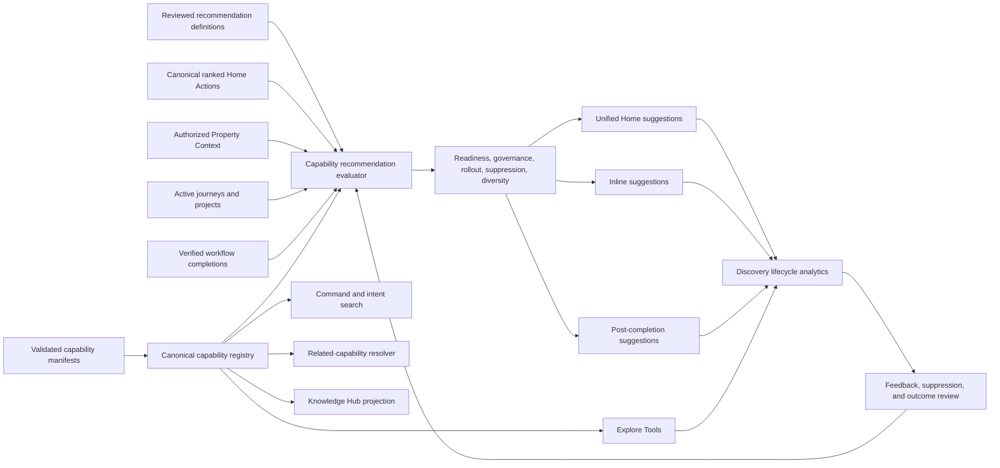

# Capability Discovery and Recommendation Platform

## Functional Requirements Document

| Field | Value |
| --- | --- |
| Status | Proposed |
| Version | 1.0 |
| Date | July 24, 2026 |
| Accountable product area | Homeowner Product |
| Technical owners | Product Framework, Unified Home, Personalization, Frontend Platform |
| Primary framework dependency | ContractToCozy Product Framework v1.0 |
| Primary customer jobs | Stay Ahead; Decide With Confidence; Navigate Major Moments |
| Implementation plan | [Capability Discovery and Recommendation Platform — Implementation Plan](./CAPABILITY_DISCOVERY_AND_RECOMMENDATION_IMPLEMENTATION_PLAN.md) |

---

## Table of Contents

1. [Executive Summary](#1-executive-summary)
2. [Decision and Relationship to the Product Framework](#2-decision-and-relationship-to-the-product-framework)
3. [Problem Statement](#3-problem-statement)
4. [Goals, Non-Goals, and Success Criteria](#4-goals-non-goals-and-success-criteria)
5. [Product Principles](#5-product-principles)
6. [Terminology and Conceptual Model](#6-terminology-and-conceptual-model)
7. [Recommended Product Experience](#7-recommended-product-experience)
8. [Target Architecture](#8-target-architecture)
9. [Canonical Capability Contract](#9-canonical-capability-contract)
10. [Recommendation Eligibility and Ranking](#10-recommendation-eligibility-and-ranking)
11. [Automatic Related-Capability Suggestions](#11-automatic-related-capability-suggestions)
12. [Functional Requirements](#12-functional-requirements)
13. [API and DTO Requirements](#13-api-and-dto-requirements)
14. [Persistence and Source-of-Truth Strategy](#14-persistence-and-source-of-truth-strategy)
15. [Analytics and Measurement](#15-analytics-and-measurement)
16. [Trust, Safety, Privacy, and Commercial Integrity](#16-trust-safety-privacy-and-commercial-integrity)
17. [Administration and Operations](#17-administration-and-operations)
18. [Migration and Rollout](#18-migration-and-rollout)
19. [Testing and Acceptance Criteria](#19-testing-and-acceptance-criteria)
20. [Risks and Mitigations](#20-risks-and-mitigations)
21. [Open Questions](#21-open-questions)
22. [Proposed Implementation Map](#22-proposed-implementation-map)

---

## 1. Executive Summary

ContractToCozy contains a broad set of valuable homeowner tools, including general-purpose
decision capabilities and niche capabilities such as Material Specs, Home Digital Will, DIY
Project Center, Plant Advisor, Permit Tracker, HOA Compliance, Inspection Hub, and Project
Tracker. The platform already provides a searchable tools catalog, command search, selected
dashboard recommendations, related-tool links, release gating, and lifecycle analytics.

The current implementation does not yet guarantee that every new tool automatically participates
in those systems. Tool metadata and recommendation logic are distributed across multiple frontend
catalogs, registries, selectors, mappings, route aliases, rollout keys, backend analytics aliases,
and Knowledge Hub records. A tool can therefore be fully implemented while remaining absent from
one or more discovery or recommendation surfaces.

This FRD defines one canonical **Capability Discovery and Recommendation Platform**. Every
homeowner-facing tool registers a validated capability manifest containing:

- its homeowner outcome and primary customer job;
- its product destination and launch context;
- the signals and property conditions that make it relevant;
- its readiness requirements and safe failure behavior;
- its recommendation safety and commercial-governance requirements;
- its expected output and meaningful completion definition; and
- the metadata needed for catalog search, related suggestions, release gating, and analytics.

After a manifest is registered and approved, the shared platform automatically provides:

- placement in Explore Tools;
- command and intent-based search;
- contextual recommendation eligibility;
- readiness and missing-context explanations;
- property-aware and journey-aware deep links;
- related and next-best capability suggestions;
- rollout and kill-switch enforcement;
- discovery-to-completion lifecycle telemetry; and
- validation through Product Framework launch gates.

The system does **not** automatically invent domain eligibility. A tool owner must declare reviewed
signals, rules, outcomes, and safety boundaries. The platform automates distribution and governance
after those declarations pass validation.

---

## 2. Decision and Relationship to the Product Framework

### 2.1 Documentation decision

This capability is specified in a dedicated FRD rather than by expanding the core Product
Framework.

Portfolio-quality and experience reviews are governed by the
[Capability Outcome and Experience Audit Framework](./CAPABILITY_OUTCOME_AND_EXPERIENCE_AUDIT_FRAMEWORK.md).
That framework determines whether a capability should remain independent and whether its
functionality, readiness, placement, and homeowner experience fulfill this platform contract.

The Product Framework remains the stable strategy and operating model. It defines:

- the three customer jobs;
- the Living Home Record;
- canonical Home Actions;
- the recognize-decide-act-learn loop;
- experience principles;
- recommendation trust and safety tiers;
- feature prioritization; and
- the feature and recommendation launch tests.

This FRD defines how tools inherit those principles in implementation. The Product Framework shall
link to this FRD as its operational specification for capability discovery and recommendation.

### 2.2 Governing framework rule

> Home Actions determine what matters. Registered capabilities help the homeowner resolve those
> actions. Tools do not create a parallel priority system.

The default Home experience shall remain action-first. A contextual tool suggestion is a projection
from a canonical Home Action, an active journey, a relevant Property Context change, or a verified
workflow completion. A tool without a valid contextual source remains discoverable in the catalog
but shall not be promoted as a priority recommendation.

### 2.3 Product destinations

Every capability shall declare one primary customer job and one primary product destination.
Capabilities shall not create new global-navigation destinations merely to gain visibility.

| Product destination | Purpose |
| --- | --- |
| Home | Attention, decisions, active work, and bounded contextual suggestions |
| Plan & Projects | Actions, decisions, projects, journeys, and major moments |
| Home Record | Systems, rooms, history, documents, materials, and durable property knowledge |
| Ask | Property-grounded questions, issue framing, and routing to authoritative capabilities |
| Profile & Settings | Household preferences, permissions, notification controls, and governance settings |

---

## 3. Problem Statement

### 3.1 Homeowner problem

Homeowners do not naturally think in ContractToCozy feature names. They think in situations:

- “What paint did I use in this room?”
- “Can I safely do this repair myself?”
- “What should my family know if I am unavailable?”
- “What should I fix before listing the home?”
- “Do I need a permit or HOA approval?”
- “Is this contractor quote reasonable?”

If a user must already know that Material Specs, Home Digital Will, DIY Project Center, Seller Prep,
or Permit Tracker exists, the product has transferred its information-architecture problem to the
homeowner.

### 3.2 Product problem

The current discovery system has several structural limitations:

1. A large static catalog makes a tool technically findable without making it salient.
2. Contextual selection is implemented in more than one selector with different candidate sets.
3. Newer niche tools do not all participate in the legacy related-tool registry.
4. Search depends primarily on product names and descriptions instead of homeowner intent.
5. Related-tool mappings require manual edits and do not have a taxonomy-derived fallback.
6. Catalog and command-palette impressions may count tools that were never actually viewed.
7. Adding a new tool requires edits across multiple files and systems, creating drift.

### 3.3 Business and platform consequence

Under-discovery reduces:

- homeowner time to first value;
- return on the cost of building specialist tools;
- differentiation from generic home-management products;
- Living Home Record enrichment;
- cross-workflow continuity;
- measurable tool adoption; and
- the platform's ability to learn which capabilities produce successful outcomes.

---

## 4. Goals, Non-Goals, and Success Criteria

### 4.1 Goals

The platform shall:

1. Establish one authoritative registration contract for every homeowner-facing capability.
2. Automatically distribute a valid registered capability to appropriate discovery surfaces.
3. Derive contextual suggestions from canonical Home Actions and shared Property Context.
4. Provide explainable “why now,” expected outcome, and readiness information.
5. Prevent duplicate promotion when a ranked Home Action already launches the same capability.
6. Generate safe related-capability suggestions using explicit workflow relationships and shared
   taxonomy.
7. Preserve action, entity, property-context, journey, and recommendation lineage through launch.
8. Measure actual exposure, engagement, meaningful output, completion, and abandonment.
9. Apply the Product Framework's safety, privacy, commercial, rollout, and incident controls.
10. Make missing capability registration a CI and launch-gate failure.

### 4.2 Non-goals

This FRD does not:

- replace canonical Home Actions with tool recommendations;
- add a new global “Tools” navigation destination;
- use a generative model to determine eligibility, urgency, safety, or ranking;
- allow behavioral engagement to override safety or evidence requirements;
- guarantee that every tool appears on the dashboard;
- treat opening a page as successful completion;
- create automatic provider, product, financing, insurance, legal, or tax recommendations without
  the applicable governance controls;
- require household-profile consent for ordinary property-based recommendations; or
- replace authoritative specialist calculations inside individual tools.

### 4.3 Initial success criteria

| Measure | Initial target |
| --- | --- |
| Active tools with valid capability manifests | 100% |
| Active tool routes represented exactly once | 100% |
| Contextual suggestions with a source action, journey, context signal, or completion | 100% |
| Suggestions showing why now, expected outcome, and readiness | 100% |
| Duplicate tool/action CTA rate on Unified Home | 0% |
| Actual-view impression accuracy | At least 95% in acceptance fixtures |
| Contextual suggestion click-through versus catalog-only baseline | Positive incremental lift |
| Eligible homes reaching meaningful tool value within 30 days | Establish baseline, then improve |
| Material or regulated suggestions passing governance gates | 100% |
| New-tool PRs passing capability completeness gate | 100% |

---

## 5. Product Principles

### 5.1 Situation first

Recommendations shall use homeowner situations and outcomes, not internal feature taxonomy, as the
primary explanation.

### 5.2 Action hierarchy before promotion

The platform shall not let tool promotion compete with urgent or important Home Actions.
Contextual tool suggestions are subordinate assistance.

### 5.3 Bounded choice

Default Home surfaces shall show no more than three capability suggestions. Inline surfaces should
normally show one primary suggestion and no more than two secondary suggestions.

### 5.4 Explainability

Every contextual suggestion shall answer:

- Why is this relevant now?
- What will I accomplish?
- What information is already available?
- What information would improve the result?
- What happens when I open it?

### 5.5 Progressive context

A capability shall remain launchable when it can safely provide partial value. Missing context
shall be explained and requested at the point where its benefit is clear.

### 5.6 One registration, multiple projections

Catalog cards, command search, contextual suggestions, related tools, release policy, and analytics
shall be projections of one capability definition rather than separately maintained inventories.

### 5.7 Deterministic eligibility

Eligibility, suppression, safety gates, and ranking inputs shall be deterministic and reviewable.
AI may help summarize or phrase an already-approved explanation but shall not change eligibility,
urgency, numbers, or calls to action.

### 5.8 Outcome over click

The platform shall optimize for meaningful homeowner value and verified completion, not page
visits or marketplace conversion.

---

## 6. Terminology and Conceptual Model

| Term | Definition |
| --- | --- |
| Capability | A homeowner-facing tool, workflow, report, or authoritative action surface registered with the platform |
| Capability manifest | The validated, versioned definition of a capability's presentation, framework alignment, destination, recommendation behavior, governance, and lifecycle |
| Home Action | The canonical Product Framework representation of something that matters and can be acted upon |
| Tool suggestion | A bounded recommendation that a registered capability can help resolve a contextual source |
| Contextual source | A Home Action, journey, project, property-context change, or workflow completion supporting a suggestion |
| Readiness | Whether a capability is ready, needs additional context, or is unavailable |
| Recommendation definition | Reviewed eligibility rule and content that may produce a property-specific recommendation |
| Related capability | A capability that is a useful adjacent or subsequent step |
| Meaningful completion | The capability-specific outcome defined in the manifest, not navigation alone |
| Actual-view impression | A recorded exposure after the suggestion or catalog item satisfies visibility requirements |

### 6.1 Action and capability relationship

```text
Property fact or event
  -> deterministic signal
    -> canonical Home Action or active journey
      -> matching registered capability
        -> explainable tool suggestion
          -> homeowner action and meaningful completion
            -> Living Home Record write-back and outcome lineage
```

### 6.2 Catalog-only capability

A capability may declare `recommendationMode: CATALOG_ONLY`. It will participate in Explore Tools,
search, release gating, deep linking, and lifecycle analytics but will not be contextually promoted.
This is the safe default for a capability without reviewed eligibility rules.

---

## 7. Recommended Product Experience

### 7.1 Layer 1: Tools for the current situation

Unified Home shall show no more than three high-confidence tool suggestions selected from the
current ranked actions, active major moment, and Property Context.

Each card shall show:

- capability label;
- why it is relevant now;
- expected homeowner outcome;
- readiness state;
- one primary CTA;
- optional “why this recommendation?” detail; and
- a dismiss or not-relevant control when permitted.

### 7.2 Layer 2: Embedded workflow suggestions

Capabilities shall be introduced next to the work that creates their relevance.

| Contextual moment | Suggested capability examples |
| --- | --- |
| Paint, tile, flooring, fixture, product receipt, or completed renovation recorded | Material Specs |
| Room setup includes window, light, or growing-space information | Plant Advisor |
| Inspection produces a low-risk repair finding | DIY Project Center |
| Inspection produces compliance or project findings | Permit Tracker, HOA Compliance, Project Tracker |
| Expensive service quote received | Service Price Radar, Quote Comparison, DIY Project Center |
| Trusted contacts or critical property documents recorded | Home Digital Will |
| Sale intent, listing timeline, moving plan, or valuation activity detected | Seller Prep |
| Contractor selected or contract uploaded | Project Tracker |
| Renovation scope requires local or association approval | Permit Tracker or HOA Compliance |
| Project completes with new finishes or products | Material Specs |

Inline suggestions shall not be modal interruptions. They shall be placed after a relevant result,
record save, milestone, or decision.

### 7.3 Layer 3: Personalized capability library

Explore Tools shall provide the following sections when data is available:

1. Recommended for this home
2. Continue where you left off
3. Recently used
4. Seasonal or newly relevant
5. New capabilities
6. All capabilities by homeowner outcome

The full catalog shall support intent-oriented filters such as:

- Save money
- Plan a project
- Maintain my home
- Prepare to sell
- Organize home information
- Handle a contractor
- Protect my family
- Understand a problem

### 7.4 Search behavior

Search shall match:

- capability name;
- short and long description;
- homeowner intent aliases;
- primary and secondary jobs;
- outcome category;
- supported entity types;
- common problem phrases; and
- approved Knowledge Hub synonyms.

For example, “what paint did I use” shall match Material Specs even when the user does not know the
feature name.

### 7.5 Post-completion suggestions

After meaningful completion, the platform may show the most useful next capability when:

- the current capability declares a valid output-to-input relationship;
- the next capability is released and eligible;
- the user has not recently dismissed or completed it; and
- the suggestion does not displace a higher-priority action.

---

## 8. Target Architecture



### 8.1 Architectural responsibilities

| Component | Responsibility |
| --- | --- |
| Capability contract | Validate every registered capability and reject incomplete definitions |
| Capability registry | Provide the authoritative active capability collection |
| Recommendation evaluator | Match contextual sources to eligible capabilities |
| Ranking policy | Score, suppress, deduplicate, diversify, and bound suggestions |
| Related resolver | Combine explicit workflow edges with taxonomy-derived adjacency |
| Availability policy | Enforce rollout, release stage, cohort, and kill-switch state |
| Unified Home adapter | Return bounded suggestions with canonical lineage |
| Frontend renderer | Render shared cards, catalog results, readiness, and explanations |
| Launch-context boundary | Preserve and validate action, entity, context-version, and journey continuity |
| Lifecycle telemetry | Record actual discovery, click, start, output, completion, and abandonment |

### 8.2 Authoritative service boundary

Recommendation evaluation shall occur in the backend. Frontend components shall not contain
independent eligibility or scoring rules.

The frontend may:

- render results;
- perform local search over an authorized capability response;
- record actual-view impressions;
- resolve serializable icon names to UI components; and
- apply presentation-only ordering within server-provided groups.

The frontend shall not independently determine that a tool is timely, safe, or eligible.

---

## 9. Canonical Capability Contract

### 9.1 Required schema

The platform shall introduce a shared validated contract equivalent to:

```ts
type ToolCapabilityDefinition = {
  id: string;
  version: number;
  owner: string;

  presentation: {
    label: string;
    shortDescription: string;
    longDescription: string;
    iconName: string;
    intentAliases: string[];
    outcomeCategory:
      | 'DECIDE_COMPARE'
      | 'PROTECT_MONITOR'
      | 'MAINTAIN_PREVENT'
      | 'PLAN_BUDGET'
      | 'SAVE_OPTIMIZE'
      | 'UNDERSTAND_HOME';
    badges: Array<'NEW' | 'BETA'>;
  };

  productFramework: {
    primaryJob: 'STAY_AHEAD' | 'DECIDE' | 'MAJOR_MOMENT';
    secondaryJobs: Array<'STAY_AHEAD' | 'DECIDE' | 'MAJOR_MOMENT'>;
    primaryDestination:
      | 'HOME'
      | 'PLAN_PROJECTS'
      | 'HOME_RECORD'
      | 'ASK'
      | 'PROFILE_SETTINGS';
    homeownerOutcome: string;
    expectedTimeToValue: string;
    livingHomeRecordReads: string[];
    livingHomeRecordWrites: string[];
  };

  destination: {
    routeTemplate: string;
    routeAliases: string[];
    navTarget: string;
    acceptedContext: Array<
      | 'PROPERTY'
      | 'HOME_ACTION'
      | 'INVENTORY_ITEM'
      | 'DOCUMENT'
      | 'PROJECT'
      | 'ROOM'
      | 'ISSUE'
      | 'SERVICE'
      | 'JOURNEY'
    >;
    workflowOnly: boolean;
  };

  recommendation: {
    mode: 'CONTEXTUAL' | 'CATALOG_ONLY' | 'WORKFLOW_ONLY';
    sourceKinds: HomeActionSourceKind[];
    jobs: Array<'STAY_AHEAD' | 'DECIDE' | 'MAJOR_MOMENT'>;
    triggerFamilies: string[];
    recommendationDefinitionCodes: string[];
    eligibleWhen?: RuleAst;
    suppressWhen?: RuleAst;
    reasonTemplates: Record<string, string>;
    expectedOutcome: string;
    readinessRequirements: ReadinessRequirement[];
    baseScore: number;
    explicitRelatedCapabilityIds: string[];
    maxImpressionsPer30Days: number;
    cooldownDaysAfterDismissal: number;
  };

  governance: {
    safetyTier:
      | 'LOW_CONSEQUENCE'
      | 'MATERIAL_FINANCIAL'
      | 'REGULATED_COVERAGE'
      | 'SAFETY_EMERGENCY';
    policyVersion: string;
    rolloutKey: string;
    releaseStage: 'ACTIVE' | 'BETA';
    commercialAction: boolean;
  };

  lifecycle: {
    expectedOutput: string;
    completionKind:
      | 'OUTPUT_VIEWED'
      | 'OUTPUT_GENERATED'
      | 'ARTIFACT_CREATED'
      | 'DECISION_RECORDED'
      | 'ACTION_INITIATED'
      | 'ACTION_COMPLETED'
      | 'PLAN_CREATED';
    completionSignal: string;
    outputEntityTypes: string[];
  };
};
```

### 9.2 Contract validation

Registration shall fail when:

- the ID is not unique;
- the route does not resolve;
- the primary job or destination is missing;
- contextual mode has no reviewed trigger, rule, or recommendation definition;
- a contextual reason template is missing;
- a rollout key is absent;
- safety governance is incomplete;
- a commercial capability lacks disclosure policy;
- completion is defined only as page navigation;
- an explicitly related capability does not exist;
- a route alias conflicts with another capability; or
- the manifest contradicts the Product Framework launch gate.

### 9.3 Serialization

The contract shall contain serializable values only. React component references shall not cross the
backend boundary. `iconName` shall be resolved through an allowlisted frontend icon map.

### 9.4 Versioning

Changes to eligibility, safety, recommendation copy, expected output, or completion definition
shall increment the manifest version. Analytics and recommendation lineage shall retain that
version.

---

## 10. Recommendation Eligibility and Ranking

### 10.1 Candidate generation

The evaluator shall generate candidates from:

- ranked open Home Actions;
- active major moments and journeys;
- active projects and milestones;
- relevant Property Context changes;
- verified capability completion outputs; and
- active reviewed personalization recommendations.

Catalog presence alone shall not create a contextual candidate.

### 10.2 Three-valued evaluation

Eligibility rules shall resolve to:

- `TRUE`: eligible;
- `FALSE`: not eligible; or
- `UNKNOWN`: insufficient evidence.

`UNKNOWN` shall not become eligible accidentally. A low-consequence capability may be returned as
`NEEDS_CONTEXT` only when its manifest explicitly allows safe partial value. Material, regulated,
and safety actions shall follow the recommendation-response failure contract.

### 10.3 Readiness states

| State | Meaning | Default presentation |
| --- | --- | --- |
| READY | Sufficient authorized context exists | Normal actionable suggestion |
| NEEDS_CONTEXT | Tool can safely provide partial value or request a bounded missing fact | Show missing-context explanation |
| UNAVAILABLE | Rollout, governance, permission, jurisdiction, or safety gate failed | Do not promote; optionally show approved unavailable state in catalog |

### 10.4 Deduplication

The evaluator shall suppress a candidate when:

- the same capability is already the primary or secondary CTA of the source Home Action;
- an equivalent capability has already been selected for the same signal and outcome;
- the related workflow is completed and no new evidence makes it relevant;
- the capability is disabled or outside its rollout cohort;
- the user has dismissed it within the active cooldown;
- the maximum impression frequency has been reached; or
- the source action is completed, dismissed, superseded, or no longer actionable.

### 10.5 Ranking inputs

The initial deterministic score shall use:

| Component | Weight | Description |
| --- | ---: | --- |
| Action relevance | 30% | Strength of the match to the source action, signal, or journey |
| Consequence and timing | 20% | Importance and proximity of the action window |
| Property-context fit | 15% | Availability and quality of relevant home facts |
| Expected homeowner value | 15% | Reviewed expected contribution to the outcome |
| Readiness | 10% | Ability to provide useful value without repetitive setup |
| Novelty | 10% | Useful new capability versus recently used or repeatedly shown capability |

The following are gates or penalties rather than positive weights:

- safety and governance eligibility;
- rollout availability;
- explicit suppression;
- frequency cap;
- duplicate CTA;
- category repetition; and
- recent abandonment.

### 10.6 Diversity

When more than three candidates qualify, the selected set shall:

- contain no more than two capabilities from the same outcome category unless no reasonable
  alternative exists;
- avoid repeating the same source action unless the capabilities represent a deliberate sequence;
- prioritize one high-confidence suggestion over several weak suggestions; and
- prefer a capability that can act now over one requiring extensive context, all else equal.

### 10.7 Explanation

Every suggestion shall contain:

- stable reason code;
- manifest and recommendation version;
- homeowner-facing why-now copy;
- expected outcome;
- readiness state and missing context;
- source kind and source identity;
- evidence summary appropriate to the user's authorization; and
- a safe launch URL.

---

## 11. Automatic Related-Capability Suggestions

### 11.1 Resolution strategy

Related capabilities shall be produced using:

1. explicit relationships declared in the manifest; then
2. output-to-input compatibility; then
3. taxonomy-derived similarity.

Explicit relationships take precedence where sequence or domain semantics matter.

### 11.2 Derived relationship score

The fallback related score may use:

| Relationship | Points |
| --- | ---: |
| Explicit related capability | +5 |
| Current output matches next capability input | +4 |
| Shared reviewed trigger family | +3 |
| Same primary customer job | +3 |
| Same source entity type | +2 |
| Same product destination | +1 |
| Same outcome category | +1 |
| Recently dismissed or completed without renewed relevance | Suppress |

### 11.3 Bounds

- Related surfaces shall show no more than three capabilities by default.
- The current capability shall never recommend itself.
- Unreleased, unavailable, or ineligible capabilities shall not appear.
- A workflow-only capability shall appear only when its required workflow context exists.
- Material and regulated suggestions shall still pass full governance checks.

### 11.4 Example sequence

```text
Inspection Hub
  -> DIY Project Center for safe minor findings
  -> Permit Tracker for permit-relevant findings
  -> HOA Compliance for association approval
  -> Project Tracker after scope or contractor selection
  -> Material Specs after completion
```

---

## 12. Functional Requirements

### 12.1 Registry and inheritance

| ID | Requirement |
| --- | --- |
| CAP-FR-001 | The system shall maintain one canonical capability registry. |
| CAP-FR-002 | Every active homeowner-facing tool route shall map to exactly one capability manifest. |
| CAP-FR-003 | A valid manifest shall automatically make the capability available to authorized catalog and command-search projections. |
| CAP-FR-004 | A contextual manifest shall automatically participate in the shared recommendation evaluator. |
| CAP-FR-005 | A valid manifest shall automatically inherit release gating, launch-context attribution, related-capability resolution, and lifecycle telemetry. |
| CAP-FR-006 | A tool without reviewed contextual eligibility shall default to `CATALOG_ONLY`. |
| CAP-FR-007 | Duplicate IDs, routes, aliases, rollout keys, or conflicting definitions shall fail startup validation and CI. |
| CAP-FR-008 | Registry consumers shall not maintain separate tool inventories. |

### 12.2 Product Framework alignment

| ID | Requirement |
| --- | --- |
| CAP-FR-010 | Every capability shall declare one primary customer job. |
| CAP-FR-011 | Every capability shall declare one primary product destination. |
| CAP-FR-012 | Every capability shall declare an observable homeowner outcome. |
| CAP-FR-013 | Every capability shall declare Living Home Record facts read and state written back. |
| CAP-FR-014 | Contextual suggestions shall reference a canonical source action, journey, project, context signal, or verified completion. |
| CAP-FR-015 | Tool suggestions shall remain subordinate to ranked Home Actions on default Home surfaces. |

### 12.3 Recommendation evaluation

| ID | Requirement |
| --- | --- |
| CAP-FR-020 | The backend shall evaluate capability eligibility deterministically. |
| CAP-FR-021 | The evaluator shall use authorized Property Context and canonical Home Action DTOs. |
| CAP-FR-022 | The evaluator shall support `TRUE`, `FALSE`, and `UNKNOWN` results. |
| CAP-FR-023 | The evaluator shall apply readiness, governance, release, permission, and suppression rules before ranking. |
| CAP-FR-024 | The evaluator shall deduplicate a capability already represented by an action CTA. |
| CAP-FR-025 | Unified Home shall return no more than three capability suggestions. |
| CAP-FR-026 | Suggestions shall expose why now, expected outcome, readiness, reason code, and version. |
| CAP-FR-027 | Suggestions shall preserve source action, entity, journey, item, and context-version lineage where applicable. |
| CAP-FR-028 | A changed Property Context version shall cause affected suggestions to refresh, expire, or display a freshness warning. |
| CAP-FR-029 | Safety and governance controls shall override ranking and engagement history. |

### 12.4 Catalog and search

| ID | Requirement |
| --- | --- |
| CAP-FR-030 | Explore Tools shall consume the canonical registry. |
| CAP-FR-031 | The catalog shall support recommended, continue, recent, seasonal/new, and all-capability sections when data exists. |
| CAP-FR-032 | The all-capability catalog shall remain organized by homeowner outcome. |
| CAP-FR-033 | Search shall match approved homeowner intent aliases. |
| CAP-FR-034 | Search results shall preserve selected property and authorized launch context. |
| CAP-FR-035 | Workflow-only capabilities shall be excluded from general discovery unless a compatible workflow context is present. |
| CAP-FR-036 | An unavailable capability shall not be promoted as ready. |

### 12.5 Inline and post-completion suggestions

| ID | Requirement |
| --- | --- |
| CAP-FR-040 | Existing workflows shall request suggestions from the shared service rather than hard-code tool cards. |
| CAP-FR-041 | Inline suggestions shall identify the source entity and reason. |
| CAP-FR-042 | Post-completion suggestions shall require output-to-input compatibility or an explicit relationship. |
| CAP-FR-043 | Inline suggestions shall be dismissible where safety policy permits. |
| CAP-FR-044 | Dismissal and not-relevant feedback shall affect future eligibility consistently across surfaces. |
| CAP-FR-045 | Inline suggestions shall not interrupt completion with an unsolicited modal. |

### 12.6 Related capabilities

| ID | Requirement |
| --- | --- |
| CAP-FR-050 | The system shall resolve related capabilities from the canonical registry. |
| CAP-FR-051 | Explicit relationships shall override taxonomy-derived ordering. |
| CAP-FR-052 | The current capability shall not recommend itself. |
| CAP-FR-053 | Related suggestions shall respect release, readiness, governance, workflow context, suppression, and frequency controls. |
| CAP-FR-054 | Related suggestions shall be limited to three by default and four at the absolute maximum. |

### 12.7 Lifecycle and feedback

| ID | Requirement |
| --- | --- |
| CAP-FR-060 | Discovery impressions shall be recorded only after actual visibility criteria are met. |
| CAP-FR-061 | The platform shall record discovered, clicked, started, output-generated, completed, and abandoned stages. |
| CAP-FR-062 | Every event shall use the canonical capability ID and manifest version. |
| CAP-FR-063 | Meaningful completion shall use the manifest completion definition. |
| CAP-FR-064 | The platform shall record launch surface, source action, source entity, reason code, context version, and journey where authorized. |
| CAP-FR-065 | Analytics metadata shall not contain raw sensitive household-profile answers. |

### 12.8 Failure behavior

| ID | Requirement |
| --- | --- |
| CAP-FR-070 | Registry or evaluator failure shall not remove canonical Home Actions. |
| CAP-FR-071 | During internal beta, availability may fail open only under the existing beta enforcement policy. |
| CAP-FR-072 | Before real-user launch, missing rollout or governance configuration shall fail closed. |
| CAP-FR-073 | Low-confidence material suggestions shall expose review, evidence, correction, or professional-escalation actions only. |
| CAP-FR-074 | A stale source action or context version shall not silently produce a current material recommendation. |
| CAP-FR-075 | Search and catalog shall remain usable when contextual evaluation is temporarily unavailable. |

---

## 13. API and DTO Requirements

### 13.1 Capability catalog

`GET /api/tool-capabilities`

Query parameters:

- `propertyId`
- `includeWorkflowOnly`
- `contextType`
- `contextId`

Response:

```ts
type ToolCapabilityCatalogResponse = {
  registryVersion: string;
  capabilities: ToolCapabilityCatalogItem[];
  availabilityEvaluatedAt: string;
};
```

The response shall include only metadata authorized for the current user and release cohort.

### 13.2 Contextual suggestions

`GET /api/properties/:propertyId/capability-suggestions`

Query parameters:

- `surface`
- `sourceActionId`
- `sourceEntityType`
- `sourceEntityId`
- `journeyId`
- `currentCapabilityId`
- `limit`

Response:

```ts
type CapabilitySuggestionDTO = {
  capabilityId: string;
  manifestVersion: number;
  label: string;
  description: string;
  iconName: string;
  href: string;

  source: {
    kind: 'HOME_ACTION' | 'JOURNEY' | 'PROJECT' | 'PROPERTY_CONTEXT' | 'COMPLETION';
    id: string;
    actionId?: string;
    entityType?: string;
    entityId?: string;
  };

  reasonCode: string;
  whyNow: string;
  expectedOutcome: string;
  scoreBand: 'HIGH' | 'MEDIUM';

  readiness: {
    state: 'READY' | 'NEEDS_CONTEXT';
    explanation: string;
    missingFacts: string[];
  };

  contextVersion?: string;
  recommendationVersion: string;
  safetyTier: RecommendationSafetyTier;
};
```

Raw ranking scores should remain diagnostic and need not be exposed to homeowners.

### 13.3 Related capabilities

`GET /api/properties/:propertyId/capabilities/:capabilityId/related`

The endpoint shall accept optional source context and return bounded, authorized suggestions using
the same DTO.

### 13.4 Feedback

`POST /api/properties/:propertyId/capability-suggestions/:capabilityId/feedback`

Supported actions:

- `OPENED`
- `DISMISSED`
- `NOT_RELEVANT`
- `SNOOZED`
- `COMPLETED`

The request shall require:

- idempotency key;
- recommendation or manifest version;
- source identity;
- surface; and
- bounded reason code where applicable.

### 13.5 Unified Home

The existing Unified Home response shall include a bounded `capabilitySuggestions` collection.
The frontend shall not independently re-evaluate or augment this collection.

---

## 14. Persistence and Source-of-Truth Strategy

### 14.1 Phase 1 source of truth

Capability manifests shall be code-owned, validated backend definitions. This provides:

- pull-request review;
- version control;
- deterministic startup and CI validation;
- safe coupling to routes and contracts; and
- no dependency on an unfinished admin authoring experience.

The backend registry shall be the runtime authority. Frontend catalogs shall consume a serialized
projection.

### 14.2 Relationship to `ProductTool`

The existing `ProductTool` model is used by Knowledge Hub content linking. It shall become a
projection of the canonical capability registry rather than an independently maintained tool
inventory.

Synchronization shall use the stable capability ID as `ProductTool.key`. Knowledge-specific fields
such as article associations remain database-owned.

### 14.3 Relationship to `RecommendationDefinition`

A reviewed `RecommendationDefinition` may optionally reference a destination capability ID.
One capability may be supported by multiple recommendation definitions, and one definition should
normally identify one primary destination capability.

The implementation may add a nullable logical relationship equivalent to:

```prisma
destinationCapabilityKey String?
```

The repository owner shall generate and apply any required database migration under the existing
database policy.

### 14.4 Suggestion state

Phase 1 should reuse:

- canonical Home Action lifecycle and suppression;
- personalization recommendation feedback where applicable; and
- Product Analytics lifecycle events for exposure history.

If production volume makes ranking-time event queries unsuitable, introduce a materialized
property-capability state model containing only:

- property ID;
- capability ID;
- last actual-view time;
- rolling impression count;
- last opened time;
- last meaningful completion time;
- dismissal or snooze expiry; and
- last recommendation version.

No raw recommendation evidence or optional household-profile answers shall be copied into this
state.

---

## 15. Analytics and Measurement

### 15.1 Lifecycle

The canonical lifecycle remains:

```text
DISCOVERED
  -> CLICKED
    -> STARTED
      -> OUTPUT_GENERATED
        -> COMPLETED

STARTED -> ABANDONED
```

### 15.2 Actual-view impression

An item shall count as discovered only when:

- at least 50% of the recommendation or catalog card is visible;
- visibility lasts at least 750 milliseconds;
- the browser tab is active; and
- the event has not already been recorded for the same property, capability, surface, source, and
  recommendation version within the deduplication window.

Opening a catalog or command palette shall not record all available capabilities as discovered.

### 15.3 Required dimensions

- capability ID and manifest version;
- property ID;
- user ID where authorized;
- launch surface;
- source kind and bounded source identity;
- reason code;
- recommendation version;
- context version;
- readiness state;
- lifecycle stage;
- journey ID where applicable;
- cohort and rollout key;
- completion kind; and
- event timestamp.

### 15.4 Primary measures

| Measure | Definition |
| --- | --- |
| Eligible exposure coverage | Eligible homes with an actual-view suggestion divided by eligible homes |
| Suggestion click-through | Homes clicking divided by homes with actual-view impressions |
| Start rate | Homes starting divided by homes clicking |
| Meaningful completion rate | Homes completing divided by homes starting |
| Thirty-day value rate | Eligible homes reaching the capability's meaningful value within 30 days |
| Incremental contextual adoption | Contextual adoption versus comparable catalog-only exposure |
| Repetition rate | Repeated impressions without click, completion, or changed context |
| Negative relevance rate | Dismissed or not-relevant divided by actual-view suggestions |
| Cross-capability continuation | Completed users who begin a valid next capability |

### 15.5 Guardrails

- Home Action completion shall not decline because tool suggestions compete for attention.
- Safety escalation shall not be delayed by optional capability promotion.
- Repeated non-critical impressions shall stay within frequency policy.
- Commercial conversion shall not be used as the primary recommendation-quality metric.
- No cohort shall receive materially lower safety or governance standards.

---

## 16. Trust, Safety, Privacy, and Commercial Integrity

### 16.1 Governance inheritance

Every capability suggestion shall inherit the existing recommendation safety tiers:

1. Low consequence
2. Material financial
3. Regulated / coverage
4. Safety / emergency

The capability contract shall be validated using the existing recommendation-governance and
recommendation-response contracts.

### 16.2 Evidence and confidence

Contextual suggestions shall:

- identify the reason they are shown;
- use evidence authorized for the viewer;
- distinguish verified, inferred, stale, conflicted, and missing facts;
- avoid claiming causality unless deterministic dependencies support it; and
- withhold material actions when confidence or required information is insufficient.

### 16.3 Privacy

- Ordinary property-based suggestions shall not require optional household-profile consent.
- Optional profile facts may influence suggestions only after applicable consent.
- Raw profile answers shall not appear in URLs, analytics, or Home Action evidence.
- Shared-property roles shall receive only suggestions and explanations authorized for that role.
- Transferable property history shall remain separate from non-transferable household data.

### 16.4 Commercial integrity

Capabilities involving providers, products, financing, insurance, or referral compensation shall:

- declare the commercial relationship;
- disclose whether compensation may occur;
- disclose whether ranking is influenced;
- state selection criteria;
- provide a non-commercial alternative; and
- keep analytical ranking separate from sponsored placement.

### 16.5 Emergency behavior

Safety and emergency guidance shall prioritize conservative escalation. Optional tools and catalog
promotions shall never obstruct or delay emergency instructions.

---

## 17. Administration and Operations

### 17.1 Admin visibility

Admin Analytics shall support:

- registry completeness;
- active, beta, paused, and disabled capabilities;
- contextual eligibility by capability;
- actual-view discovery funnel;
- click, start, output, completion, and abandonment;
- not-relevant and dismissal rates;
- top reason codes;
- readiness and missing-context distribution;
- cohort and rollout comparison; and
- capabilities with high eligible volume but low exposure or completion.

### 17.2 Operational controls

The platform shall support:

- global capability-discovery kill switch;
- per-capability disable list;
- per-rollout cohort flags;
- per-recommendation-definition pause;
- governance-policy enforcement mode;
- immediate suppression of a broken destination;
- version-aware rollback; and
- auditable admin actions.

### 17.3 Incident handling

An operational incident shall be raised when:

- an active capability route is broken;
- a manifest/route mismatch reaches a deployed environment;
- a material suggestion bypasses governance;
- a suggestion exposes unauthorized evidence;
- recommendation duplication exceeds the accepted threshold;
- lifecycle events use unknown capability IDs; or
- a completion definition materially overcounts success.

---

## 18. Migration and Rollout

### 18.1 Phase 0: Contract and inventory

1. Introduce `ToolCapabilityDefinitionSchema`.
2. Inventory every active homeowner capability and route.
3. Create manifests for all existing discoverable tools.
4. Mark tools without reviewed eligibility as `CATALOG_ONLY`.
5. Add registry completeness and uniqueness tests.

Exit criteria:

- every active tool route maps exactly once;
- every manifest passes Product Framework and governance validation; and
- no user-visible behavior changes are required.

### 18.2 Phase 1: Canonical catalog projection

1. Add authenticated capability catalog API.
2. Make Explore Tools consume the backend registry.
3. Make command search consume the same registry.
4. Resolve icons through serializable icon names.
5. Synchronize `ProductTool` from the registry.
6. Correct actual-view impression tracking.

Exit criteria:

- old and new catalogs have route parity;
- search supports intent aliases;
- workflow-only and rollout behavior are preserved; and
- catalog and command search do not maintain separate inventories.

### 18.3 Phase 2: Shared contextual evaluator

1. Implement the backend candidate evaluator and deterministic ranking.
2. Add capability suggestions to Unified Home.
3. Migrate rules from `selectUnifiedHomeTools`.
4. Migrate rules from `selectSmartContextTools`.
5. Remove duplicate frontend selection logic.
6. Preserve launch attribution and destination prefill.

Exit criteria:

- golden-home fixtures produce reviewed suggestions;
- no duplicate tool/action CTA appears;
- default Home shows no more than three suggestions; and
- unavailable or unsafe candidates fail correctly.

### 18.4 Phase 3: Inline and related suggestions

1. Replace manual related mappings with the shared resolver.
2. Add contextual request points to inspection, projects, rooms, inventory, documents, quotes,
   and seller-intent flows.
3. Implement post-completion suggestions.
4. Implement dismissal, not-relevant, and frequency policy.

Initial capability tranche:

- Material Specs
- Home Digital Will
- DIY Project Center
- Plant Advisor
- Seller Prep
- Permit Tracker
- HOA Compliance
- Inspection Hub
- Project Tracker

### 18.5 Phase 4: Optimization

1. Establish contextual versus catalog-only baselines.
2. Tune deterministic weights through reviewed experiments.
3. Add seasonal sections and “continue” behavior.
4. Consider materialized property-capability state only if runtime evidence justifies it.
5. Keep online autonomous tuning disabled until governance and data thresholds permit it.

---

## 19. Testing and Acceptance Criteria

### 19.1 Contract tests

- Every manifest parses successfully.
- Every active route has exactly one manifest.
- No duplicate ID, route, alias, or rollout key exists.
- Every explicit related capability exists.
- Every contextual capability has a rule or reviewed definition.
- Every capability has a meaningful completion definition.
- Every material, regulated, or safety capability passes governance validation.

### 19.2 Evaluator tests

- `TRUE`, `FALSE`, and `UNKNOWN` eligibility behave as specified.
- Missing facts do not become positive facts.
- Context changes refresh or expire suggestions.
- Existing action CTAs suppress duplicate tool suggestions.
- Completed and dismissed actions no longer generate stale suggestions.
- Frequency caps and cooldowns apply across surfaces.
- Ranking is deterministic for identical inputs.
- Diversity rules bound repeated categories.

### 19.3 Golden-home fixtures

The suite shall contain representative homes including:

- older home with aging systems;
- newer home with sparse history;
- storm-prone property;
- property preparing for sale;
- home with completed renovations and material records;
- home with minor inspection findings suitable for reviewed DIY consideration;
- HOA-governed home planning a renovation;
- property with important documents and trusted-contact setup;
- home with suitable room/light context for Plant Advisor; and
- property with insufficient context for material recommendations.

Each fixture shall define expected eligible, ineligible, needs-context, suppressed, and ranked
capabilities.

### 19.4 API and authorization tests

- Property access is enforced.
- Viewer, contributor, and owner behavior follows authorization policy.
- Optional profile evidence is not leaked.
- Invalid source action or entity context is rejected.
- Stale context versions are detected.
- Idempotent feedback does not create duplicate lifecycle state.

### 19.5 Frontend acceptance

- Unified Home renders no more than three server-provided suggestions.
- Every card displays why now, outcome, and readiness.
- Explore Tools preserves the selected property.
- Homeowner-language search terms return expected capabilities.
- Actual-view impressions fire only after visibility thresholds.
- Command palette does not count unseen capabilities as discovered.
- Deep links preserve safe source and journey context.
- Workflow-only capabilities are excluded from general browsing.
- Empty and failure states preserve access to canonical Home Actions and catalog search.

### 19.6 Definition of done for a new tool

A future tool is complete only when:

1. its feature brief names the homeowner outcome and primary job;
2. its capability manifest passes validation;
3. its route and accepted context are registered;
4. its recommendation mode is declared;
5. contextual eligibility has reviewed rules or the tool is explicitly catalog-only;
6. its readiness and failure behavior are defined;
7. governance and rollout configuration are complete;
8. meaningful completion is instrumented;
9. golden-home or relevant fixture coverage exists; and
10. capability CI and Product Framework launch gates pass.

---

## 20. Risks and Mitigations

| Risk | Impact | Mitigation |
| --- | --- | --- |
| Registry becomes another duplicate source | Continued drift | Backend registry is authoritative; other stores are projections |
| Too many contextual suggestions | Dashboard becomes promotional | Maximum three, action-first hierarchy, diversity and frequency caps |
| Weak rule authoring | Irrelevant recommendations | Reviewed deterministic rules, golden homes, not-relevant feedback |
| Engagement bias | Click-heavy tools crowd out important tools | Outcome-based value, safety gates, no autonomous behavioral tuning |
| Stale Property Context | Incorrect material suggestions | Context versioning, freshness checks, degraded-response contract |
| Taxonomy-only related suggestions are semantically poor | Confusing next steps | Explicit relationships override fallback; bounded results |
| New tool launch is slowed by contract requirements | Delivery friction | Templates, scaffolding, reusable defaults, actionable CI errors |
| ProductTool synchronization overwrites content metadata | Knowledge links regress | Registry owns capability fields only; article relationships remain DB-owned |
| Analytics overcounts exposure | Misleading adoption decisions | Intersection-based actual-view requirements and deduplication |
| Inline suggestions interrupt workflows | Lower completion | Non-modal placement after relevant results or milestones |
| Commercial incentives affect ranking | Loss of trust | Separate sponsored placement, disclosures, non-commercial alternatives |

---

## 21. Open Questions

1. Should Phase 1 capability manifests live entirely in backend source or in a shared generated
   package consumed by backend and frontend?
2. Which approved signal-intent taxonomy should be the long-term trigger-family authority?
3. Should low-consequence `UNKNOWN` eligibility ever appear as `NEEDS_CONTEXT`, or should each
   manifest explicitly opt in?
4. What production volume would justify materializing property-capability suggestion state?
5. Should “New capabilities” be global, cohort-specific, or personalized by eligibility?
6. Which inline surfaces should be included in the first experiment after Unified Home?
7. Should a Knowledge Hub article be allowed to provide additional intent aliases, or should
   aliases remain code-reviewed only?
8. What minimum sample and outcome evidence are required before changing ranking weights?
9. Which feedback controls should contributors and viewers have on shared properties?

---

## 22. Proposed Implementation Map

The following paths are proposed and may be refined during implementation:

```text
apps/backend/src/productFramework/
  toolCapability.contract.ts
  toolCapabilityRegistry.ts
  toolCapabilityAvailability.ts
  toolCapabilityRecommendation.service.ts
  toolCapabilityRelated.service.ts
  toolCapabilities/
    materialSpecs.capability.ts
    homeDigitalWill.capability.ts
    diy.capability.ts
    ...

apps/backend/src/controllers/
  toolCapability.controller.ts

apps/backend/src/routes/
  toolCapability.routes.ts

apps/frontend/src/features/tools/
  capabilityApi.ts
  capabilityTypes.ts
  CapabilitySuggestionCard.tsx
  CapabilityCatalog.tsx
  useActualCapabilityImpression.ts
  iconRegistry.ts

apps/frontend/scripts/product-framework/
  check-tool-capabilities.mjs

apps/backend/tests/unit/
  toolCapabilityContracts.test.js
  toolCapabilityRecommendation.test.js
  toolCapabilityRelated.test.js

apps/backend/tests/fixtures/productFramework/
  capabilityGoldenHomes.js
```

Existing systems to converge or retire as independent authorities:

- `apps/frontend/src/components/mobile/dashboard/mobileToolCatalog.ts`
- `apps/frontend/src/features/tools/toolDiscoveryRegistry.ts`
- `apps/frontend/src/features/tools/toolRegistry.ts`
- `apps/frontend/src/features/tools/contextToolMappings.ts`
- `apps/frontend/src/features/tools/selectUnifiedHomeTools.ts`
- `apps/frontend/src/features/tools/selectSmartContextTools.ts`
- manually duplicated Knowledge Hub `ProductTool` seed metadata

The migration shall preserve existing routes and behavior until parity tests pass. Removal of an
old registry is permitted only after all consumers use the canonical capability service.
