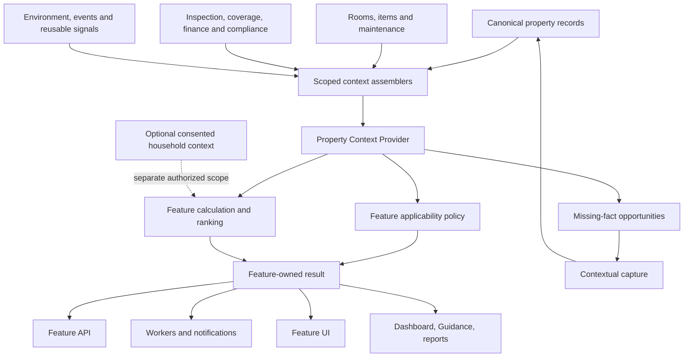

# Property Context Platform — Functional Requirements Document

**Version:** 1.0

**Date:** 2026-07-16

**Status:** Proposed greenfield implementation

**Audience:** Product, design, backend, frontend, workers, data, QA, security, and content operations
**Related decision:** Basic property-aware behavior is available by default; optional household-profile facts require separate consent.

---

## 1. Executive summary

ContractToCozy currently stores useful property context across `Property`, rooms,
assets, inventory, maintenance, inspections, climate, insurance, warranties,
finance, HOA, permits, projects, events, signals, incidents, and personalization
tables. Individual features read different subsets and frequently interpret the
same concept independently. Some feature rules refer to facts that do not exist
in the canonical schema, while other concepts are duplicated or conflated.

ContractToCozy shall introduce a **Property Context Platform** inside the existing
backend. It will provide authorized, typed, scoped, provenance-aware property
facts to every property-aware feature. Each feature will continue to own its
domain-specific applicability, calculation, ranking, wording, and actions.

The target relationship is:

```text
Canonical property-domain records
            ↓
Shared typed Property Context Provider
            ↓
Feature-owned applicability and decision policy
            ↓
Feature API, UI, workers, notifications and shared guidance
```

Property Context and Personalization are complementary:

- **Property Context** answers: “What is known about this property, how reliable
  is it, and what is unknown?”
- **Feature policy** answers: “What does this feature do with those facts?”
- **Personalization** answers: “Which applicable result is most relevant, how is
  it explained, and how does optional household context affect it?”

Property Context is the first dependency. Applicability correctness is the first
product outcome. Ranking and optional household personalization follow within
each vertical feature review.

## 2. Greenfield assumptions and implementation policy

This FRD is intentionally based on the following current conditions:

1. ContractToCozy has no real users.
2. The application is not live.
3. Existing test/demo data does not need production-grade preservation.
4. The target schema may be corrected directly rather than preserving an
   unsuitable design for backward compatibility.
5. The user will apply database schema changes.
6. Engineering shall not create migration scripts as part of this initiative.
7. Existing code must still be updated and tested against the target schema
   before database changes are applied.

Consequences:

- Do not create dual-read, dual-write, shadow, backfill, legacy compatibility,
  percentage rollout, or migration-rehearsal infrastructure.
- Do not retain ambiguous fields solely because existing demo rows use them.
- Prefer one clear canonical source over adapters that perpetuate duplicate
  ownership.
- Preserve useful feature behavior, not obsolete schema shape.
- Schema removal is allowed only after repository-wide reference analysis and
  successful tests prove that consumers use the replacement source.

## 3. Problem statement

### 3.1 User problem

A homeowner can receive irrelevant, contradictory, or generic results because
features do not consistently account for the selected property.

Examples include, but are not limited to:

- outdoor garden functionality shown for a property with no private outdoor
  space;
- tree, shrub, lawn, driveway, roof, or gutter work assigned to an owner whose
  association or landlord is responsible;
- maintenance suggested for an asset the property does not contain;
- repeated work suggested after a recent verified completion;
- insurance, renovation, financial, energy, and climate results using different
  interpretations of the same dwelling type;
- feature questions repeatedly collecting facts already known elsewhere.

### 3.2 Engineering problem

Property context is fragmented and its semantics are inconsistent:

- raw Prisma queries are repeated across services;
- features conflate `null`, `false`, missing, stale, inferred, and conflicted;
- property type mixes structural and investment/use concepts;
- asset identity and asset facts are represented across three model families;
- financial and preference concepts have overlapping owners;
- feature snapshots sometimes become accidental sources of truth;
- UI, API, worker, and notification paths can apply different rules;
- the existing Personalization Engine covers only its reviewed recommendation
  catalog and cannot serve as the domain policy engine for every feature.

## 4. Goals and success outcomes

### 4.1 Goals

- G1: Make every applicable property-scoped feature automatically aware of the
  selected property's current facts.
- G2: Ensure each feature owns one deterministic applicability and decision
  policy reused by its API, UI, workers, and notifications.
- G3: Capture a reusable property fact once and make it available to every
  authorized consumer.
- G4: Distinguish known, unknown, conflicted, stale, and not-applicable states.
- G5: Explain which property facts caused a feature result and where those facts
  can be corrected.
- G6: Prevent property facts from being mixed with optional household-profile
  data or collaborator authorization.
- G7: Correct the greenfield schema before feature-specific logic expands.
- G8: Review every existing property-aware feature and tune it against shared
  context through a controlled roadmap.
- G9: Avoid a speculative universal rules engine or giant all-tables query.
- G10: Preserve authoritative domain ownership and cross-feature consistency.

### 4.2 Desired outcomes

- Inapplicable results are not generated, persisted, notified, or displayed.
- A property edit produces consistent behavior across affected features.
- Missing facts lead to an explicit `UNKNOWN` result or a contextual question,
  never an unsupported assumption.
- The same feature result is consistent across its page, dashboard card,
  background jobs, notifications, reports, and Personalized Guidance.
- Features request only the context scopes they need.
- Optional household facts remain zero and unused until separately enabled.

### 4.3 Initial success measures without real users

Because population learning is impossible at this stage, success will be
measured through deterministic test matrices and demo archetypes:

- 100% of reviewed property features have a documented context dependency map.
- 100% of reviewed feature policies have `APPLICABLE`, `NOT_APPLICABLE`, and
  `UNKNOWN` tests.
- Zero known references remain to removed schema fields.
- Zero feature-specific duplicate prompts exist for a canonical shared fact.
- All worker/API/UI contract tests produce the same applicability decision.
- Representative homes produce visibly different but explainable outputs.

## 5. Scope and non-goals

### 5.1 In scope

- Canonical property fact taxonomy and ownership.
- Typed, scoped property-context assembly.
- Provenance, verification, freshness, conflicts, and corrections.
- Structural, exterior, system, safety, room, asset, maintenance, inspection,
  coverage, risk, finance, compliance, project, event, environment, and shared
  guidance context.
- Feature-owned applicability policies.
- Contextual capture of missing reusable property facts.
- Server-side enforcement for API, workers, and notifications.
- Context explanations and correction links.
- Integration with the existing Personalization Engine.
- Schema cleanup required to establish canonical ownership.
- Comprehensive review and tuning of existing property-aware features.

### 5.2 Out of scope

- Population-level learning or automatic weight optimization.
- Behavioral inference before real usage exists.
- A graph database, vector database, or new microservice.
- A generic runtime facts table replacing typed domain models.
- Central ownership of every feature's calculations or content.
- Optional household composition, pets, lifestyle, goals, or preferences without
  consent.
- Generic family, health, pet, or lifestyle management.
- Migration scripts, compatibility reads, or production data backfills.

## 6. Product and architecture principles

1. **Context first, decision second.** Facts must be reliable before ranking is
   sophisticated.
2. **Canonical typed ownership.** Stable facts live in their authoritative
   domain model, not arbitrary feature JSON.
3. **Feature-owned policy.** The feature that understands the domain owns its
   applicability and calculation.
4. **Shared semantics.** Every feature receives the same normalized meaning of
   dwelling type, responsibility, installed assets, and missing data.
5. **Unknown is first-class.** `null` is never silently treated as `false`.
6. **Backend authority.** UI hiding alone does not establish applicability.
7. **One policy per feature.** API, UI, worker, notification, dashboard, and
   report consumers reuse the same feature policy.
8. **Ask at the point of value.** A feature may ask for a missing fact when the
   answer changes an immediate result.
9. **Store once, reuse everywhere.** A reusable answer updates its canonical
   property domain, not feature-local state.
10. **Property and household separation.** Basic property facts do not require
    optional-profile consent; people, pets, preferences, and lifestyle do.
11. **Explainable by construction.** Decisions return used and missing fact keys.
12. **No speculative provider.** Add scopes and facts when one or more reviewed
    features demonstrate a need.

## 7. Definitions

| Term | Definition |
|---|---|
| Canonical fact | A current fact owned by a typed domain model, such as dwelling type or an installed item. |
| Derived fact | A deterministic value computed from canonical facts, such as roof age. |
| Context scope | A bounded group of facts requested by a feature. |
| Applicability | Whether a feature, section, template, recommendation, or action applies to a property. |
| Responsibility | The party responsible for acting on a property domain such as landscaping or roof maintenance. |
| Evidence | Source and verification metadata supporting a fact. |
| Feature policy | Deterministic feature-owned logic consuming Property Context. |
| Optional household context | Consented information about people, pets, goals, preferences, or lifestyle. |
| Projection | A computed feature output or snapshot; not automatically a canonical input. |

## 8. Current schema review

### 8.1 Review method

The schema review covered all Prisma enums and models and traced the primary
property relationships and known feature consumers. Particular attention was
given to:

- `Property`, `HomeownerProfile`, `HouseholdProperty`, and `HouseholdMember`;
- `InventoryRoom`, `InventoryItem`, `HomeAsset`, `HomeItem`, and status models;
- maintenance, seasonal, warranty, insurance, expense, and claims;
- climate, environment, signals, incidents, radar, guidance, and events;
- inspections, permits, HOA, projects, renovations, and materials;
- risk, score, capital, reserve, finance, equity, tax, and savings;
- `PreferenceProfile`, `AssumptionSet`, `ToolOverride`, feature preference JSON,
  and optional personalization answers;
- `Signal`, `GuidanceSignal`, `DerivedTrait`, risk reports, digital-twin
  components, and feature snapshots.

### 8.2 Existing reusable foundations

| Domain | Current useful source |
|---|---|
| Core property | `Property` |
| Rooms | `InventoryRoom` |
| Detailed inventory | `InventoryItem` |
| Cross-feature item identity | `HomeItem` |
| Maintenance execution | `PropertyMaintenanceTask` |
| Climate settings | `PropertyClimateSetting` |
| Timeline history | `HomeEvent` |
| Inspection truth | confirmed `InspectionReport` and `InspectionFinding` |
| Coverage | `InsurancePolicy`, `Warranty`, `Claim` |
| Compliance | `PropertyPermitRecord`, `PermitUnpermittedFlag`, `HoaAssociation`, `HoaApprovalRecord` |
| Projects | `ProjectRecord` and child workflow models |
| Reusable derived signals | `Signal` when it meets cross-feature criteria |
| Actionable issue state | `GuidanceSignal`, `Incident`, and their lifecycle models |
| Optional profile | `Household`, `HouseholdProperty`, `ProfileAnswer` |
| Authorization/collaboration | `HouseholdMember` and property authorization middleware |

### 8.3 Schema gaps and overlaps

#### 8.3.1 Structural type is conflated with use

Historical `Property.propertyType` used `PropertyType`, which contains structural values (`SINGLE_FAMILY`,
`TOWNHOME`, `CONDO`, `APARTMENT`, `MULTI_UNIT`) and
`INVESTMENT_PROPERTY`, which is a use/financial classification. Features cannot
reliably determine physical applicability from that enum.

**Resolved in Phase 8:** `Property.propertyType` was removed. The enum remains
only as a feature-specific benchmark/legacy-targeting dimension, with explicit
mapping from canonical `dwellingType` at those boundaries.

#### 8.3.2 Ownership and occupancy are ambiguous

Historical `Property.ownershipType` contained `OWNER_OCCUPIED` and `RENTED_OUT`, while
`HouseholdProperty.occupancyType` is a string containing concepts such as
primary, secondary, rental, and vacant. Structural ownership, property use,
current occupancy, and optional household linkage are separate concepts and
must not share one field.

**Resolved in Phase 8:** the Property field and its enum were removed after
consumers moved to `ownershipForm`, `propertyUse`, and `occupancyStatus`.

#### 8.3.3 Household information is stored on Property

`Property.occupantsCount` describes people rather than the structure. It should
not be part of default property context and must not bypass optional household
profile consent.

#### 8.3.4 Exterior applicability facts are incomplete

`Property` stores `lotSize`, `hasIrrigation`, and `hasDrainageIssues`, but lacks
canonical lawn, trees/shrubs, driveway, deck, patio, pool, fence, outdoor faucet,
private outdoor-space, and exterior-responsibility facts. Existing seasonal code
already checks several nonexistent fields. `lotSize > 0` is not proof of a lawn.

#### 8.3.5 Asset identity is split three ways

- `HomeAsset` stores system identity, installation year, service date, model,
  manufacturer, efficiency, and warranties.
- `InventoryItem` stores richer and overlapping identity, condition, service,
  cost, room, coverage, verification, and technical details.
- `HomeItem` wraps either record as a cross-feature identity.

This permits two records for one physical item and makes service history and
condition selection ambiguous.

#### 8.3.6 Financial truth is duplicated

Purchase price/date and mortgage context appear across `Property`,
`HomeownerProfile`, `PropertyFinanceSnapshot`, and
`PropertyFinancingProfile`. Tool snapshots and assumption JSON add further
copies. A current canonical value must be distinguishable from a run snapshot.

#### 8.3.7 Preferences have multiple owners

`PreferenceProfile`, `PropertyHabitPreference.personalizationJson`,
`RoomPlantProfile`, `SellerPrepPlan.preferences`, `ToolOverride`,
`AssumptionSet`, DIY skill information, and optional `ProfileAnswer` all store
different kinds of preferences or assumptions. They must not be merged into
ordinary property facts simply because a feature wants them.

#### 8.3.8 Derived intelligence has overlapping representations

`Signal`, `GuidanceSignal`, `DerivedTrait`, `RiskAssessmentReport`,
`PropertyScoreSnapshot`, `HomeTwinComponent`, incidents, radar matches, and
feature snapshots serve different lifecycles. Without explicit ownership, a
computed projection can be mistaken for canonical truth.

#### 8.3.9 Verification is inconsistent

Some models include `isVerified`, source, confidence, or timestamps; core
Property fields generally do not. The provider cannot explain conflicts or
freshness consistently without evidence metadata.

#### 8.3.10 Existing Personalization facts are too narrow

The original property trait repository loaded smoke-detector, roof-year, and a
small normalized asset set, while the rule AST allowed
`property.propertyType` without an assembled property fact map.

**Resolved in Phases 7–8:** Personalization evaluation consumes bounded
Property Context and the obsolete rule path and duplicate fact loader are
removed.

### 8.4 Canonical ownership decisions

| Concept | Target canonical owner | Explicit non-owner |
|---|---|---|
| Structure and location | `Property` plus typed profile extensions | feature snapshots |
| Exterior characteristics | `PropertyExteriorProfile` | seasonal/plant JSON |
| Responsibility | `PropertyResponsibility` | inference from HOA or dwelling type |
| Room | `InventoryRoom` | free-form room names in feature JSON |
| Physical item identity and facts | consolidated `InventoryItem`; `HomeItem` retained only if a separate cross-feature anchor remains demonstrably necessary | `HomeAsset` duplicate facts |
| Maintenance completion | `PropertyMaintenanceTask` and authoritative completion event | title-only inference when a linked item/task key exists |
| Coverage | `InsurancePolicy` and `Warranty` | savings/tool mirrors |
| Financing | `PropertyFinancingProfile`; `EquityPosition` for computed point-in-time equity | `PropertyFinanceSnapshot` and duplicated Property mortgage facts |
| Inspection condition | confirmed `InspectionFinding` | raw extraction or unconfirmed report |
| Current reusable derived fact | `Signal`, only when reused and time-bound | arbitrary snapshot JSON |
| Actionable issue | feature owner and/or `GuidanceSignal` lifecycle | `Signal` alone |
| Optional household fact | `ProfileAnswer` under Household consent | `Property` |
| Collaborator permission | `HouseholdMember` | optional personalization Household |

## 9. Target architecture



### 9.1 Runtime location

The provider shall be a bounded module in the existing backend. It does not
justify a separate service, datastore, or deployment.

Suggested module layout:

```text
apps/backend/src/modules/propertyContext/
  api/                 optional transparency and correction endpoints
  application/         scoped context assembly and capture use cases
  domain/              contracts, states, keys, merge/conflict policy
  infrastructure/      narrow Prisma readers by scope
  catalog/             fact definitions and correction metadata
  policies/            shared policy helpers, not feature decisions
```

Feature policies remain with their feature, for example:

```text
services/seasonal/applicabilityPolicy.ts
services/plantAdvisor/applicabilityPolicy.ts
services/coverage/contextPolicy.ts
```

## 10. Property-context contract

### 10.1 Fact envelope

```ts
type PropertyFactState = 'KNOWN' | 'UNKNOWN' | 'CONFLICTED' | 'STALE';

type PropertyFactSource =
  | 'USER_REPORTED'
  | 'DOCUMENT'
  | 'INSPECTION'
  | 'PUBLIC_RECORD'
  | 'INTEGRATION'
  | 'SYSTEM_DERIVED';

interface PropertyFact<T> {
  key: string;
  value: T | null;
  state: PropertyFactState;
  source: PropertyFactSource | null;
  verified: boolean;
  confidence: number | null;
  observedAt: string | null;
  validUntil: string | null;
  correctionPath: string | null;
}
```

### 10.2 Context response

```ts
interface PropertyContextSnapshot {
  propertyId: string;
  contextVersion: string;
  generatedAt: string;
  scopes: PropertyContextScope[];
  facts: Record<string, PropertyFact<unknown>>;
  warnings: Array<{
    code: 'CONFLICT' | 'STALE_SOURCE' | 'PARTIAL_SCOPE';
    factKeys: string[];
  }>;
}
```

### 10.3 Scoped reads

```ts
getPropertyContext(propertyId, actor, {
  scopes: ['CORE', 'EXTERIOR', 'RESPONSIBILITY', 'SYSTEMS'],
});
```

The provider shall not perform one unconditional include across the entire
Property relation graph.

## 11. Context scopes and fact inventory

The following is the target catalog. A fact enters implementation only when a
reviewed consumer needs it, but its semantics and owner must follow this
catalog.

### 11.1 CORE

- `core.dwellingType`
- `core.propertyUse`
- `core.occupancyStatus`
- `core.isPrimary`
- `core.yearBuilt`
- `core.propertySizeSqFt`
- `core.bedrooms`
- `core.bathrooms`
- `core.activationStatus`
- `core.homeownerSegment` as product eligibility, not physical property truth

### 11.2 LOCATION

- `location.city`, `location.state`, `location.zipCode`
- `location.timezone`
- `location.geocoded`
- exact coordinates only for authorized server-side consumers
- jurisdiction/county identifiers when resolved
- `location.climateRegion`
- coastal, flood, wildfire, radon, freeze, heat, drought, and storm exposure
  only with source, confidence, and validity

### 11.3 STRUCTURE

- roof type, replacement/install year, derived age, known condition
- foundation type and condition
- siding/exterior material
- electrical-panel age/type
- basement/crawlspace/attic/garage presence
- stories and attached/shared-wall characteristics when captured
- insulation/window attributes when verified

### 11.4 EXTERIOR

- lot size
- private outdoor-space presence and types
- lawn, trees/shrubs, driveway, deck, patio, pool/spa, fence
- irrigation and outdoor faucets
- drainage issues, grading, and known flood-entry points
- shared versus private exterior designation

### 11.5 RESPONSIBILITY

Responsibility is recorded independently for:

- roof;
- building exterior/envelope;
- landscaping/lawn;
- trees/shrubs;
- driveway/walkways;
- deck/patio/balcony;
- plumbing serving the unit;
- HVAC serving the unit;
- common safety equipment;
- snow/ice removal;
- pest control;
- shared/common systems.

Each entry reports `OWNER`, `ASSOCIATION`, `LANDLORD`, `SHARED`, or `UNKNOWN`.

### 11.6 SYSTEMS

- installed heating, cooling, ventilation, water-heating, plumbing, electrical,
  roofing, drainage, backup-power, sump-pump, solar, and other system items;
- install date/year, manufacturer/model, condition, service date, efficiency,
  expected life, verification, and room/location;
- explicit absence only when confirmed.

### 11.7 SAFETY

- smoke detectors, CO detectors, extinguishers, security system;
- sump-pump backup, generator/secondary heat;
- recalled items, safety inspection findings, active safety incidents;
- last inspection/test/service when linked authoritatively.

### 11.8 ROOMS

- canonical room ID, name, type, floor level;
- room-level items, signals, known environmental characteristics;
- room profile facts that describe the room;
- exclude optional people/pet preferences unless separately authorized.

### 11.9 INVENTORY

- canonical item ID, category, condition, installed/purchased/service dates;
- manufacturer/model/serial identifiers;
- verification and source;
- expected expiry and replacement cost;
- warranty, policy, recall, room, document, and project linkage summaries.

### 11.10 MAINTENANCE

- open/overdue/upcoming/completed/dismissed/snoozed state;
- recurring cadence and next due date;
- last authoritative completion by task key and item;
- actual cost and DIY/provider result where permitted;
- active duplicate action/task keys.

### 11.11 RECALLS

- open, confirmed, dismissed, and resolved matches;
- affected canonical item and authoritative recall identity;
- match method, confidence, rationale, and resolution;
- linked maintenance action and duplicate-prevention state.

### 11.12 INSPECTION

- latest confirmed report date/type;
- open findings by system, condition, severity, location, and cost range;
- resolved finding history and resolution evidence;
- unconfirmed extraction remains excluded or clearly provisional.

### 11.13 COVERAGE

- active insurance policy types and periods;
- verified deductible and high-level limits;
- active warranties and expiry;
- item-to-coverage linkage;
- open claims and follow-up state;
- raw policy numbers and private documents are not general context facts.

### 11.14 RISK

- current risk score and calculation freshness;
- active incidents and mitigation state;
- current risk drivers with source/confidence;
- active recalls, safety findings, environmental hazards, and unresolved
  guidance signals;
- feature calculations remain owned by Risk and are not recomputed by the
  provider.

### 11.15 FINANCIAL

- purchase basis, current appraised/estimated value, mortgage balance;
- current equity and LTV;
- reserve-fund posture and major upcoming capital exposure;
- property expenses and known recurring ownership costs;
- tool assumptions remain scenario-specific unless explicitly promoted to a
  canonical preference or finance record.

### 11.16 COMPLIANCE

- HOA/association presence;
- active architectural approvals and expiry;
- permits and inspection milestones;
- unresolved unpermitted-work flags;
- jurisdiction and source freshness;
- association presence alone does not imply maintenance responsibility.

### 11.17 PROJECTS

- active project type/status/timeline;
- affected systems;
- milestones, open issues, payments, warranty, and completion write-backs;
- completed project facts that supersede prior condition/install facts.

### 11.18 EVENTS

- authoritative repairs, replacements, purchases, incidents, claims, and
  verified resolutions;
- relevant event time window and confidence;
- analytics events and raw interaction telemetry are excluded.

### 11.19 ENVIRONMENT

- current and forecast heat, freeze, storm, precipitation, drought, AQI;
- flood, radon, hardiness, climate normals, and nearby hazard context;
- every time-sensitive fact includes `validUntil`;
- provider failure never becomes a false safe value.

### 11.20 GUIDANCE_STATE

- active, completed, suppressed, or expired guidance/recommendation identities;
- existing action destinations and dedupe keys;
- active incidents and tasks preventing duplicate generation;
- content and feature policy remain outside the provider.

### 11.21 PRODUCT_CONTEXT

- onboarding completeness;
- home-buyer versus existing-owner product segment;
- enabled feature/configuration state;
- permissions relevant to viewing/correcting facts;
- product context must not be confused with physical applicability.

### 11.22 OPTIONAL_HOUSEHOLD

Available only after explicit owner consent and separate authorization:

- household composition;
- occupant count;
- pets;
- aging-in-place goal;
- budget/service/DIY preferences;
- travel/lifestyle facts;
- future plans and other active bounded profile answers.

These facts may rank or add reviewed results but cannot be required for basic
property applicability.

## 12. Schema changes

The following changes are proposed after reviewing the current schema. Exact
Prisma changes require a code-reference audit and implementation plan, but the
target concepts are normative.

### 12.1 Required: separate dwelling, use, and occupancy

Replace the current mixed `PropertyType` and ambiguous `OwnershipType` usage:

```prisma
enum DwellingType {
  DETACHED_SINGLE_FAMILY
  ATTACHED_SINGLE_FAMILY
  TOWNHOUSE
  CONDO_UNIT
  APARTMENT_UNIT
  DUPLEX
  MULTI_FAMILY
  MANUFACTURED_HOME
  OTHER
  UNKNOWN
}

enum OwnershipForm {
  FEE_SIMPLE
  CONDOMINIUM
  COOPERATIVE
  LEASEHOLD
  OTHER
  UNKNOWN
}

enum PropertyUse {
  PRIMARY_RESIDENCE
  SECOND_HOME
  LONG_TERM_RENTAL
  SHORT_TERM_RENTAL
  VACANT
  UNDER_RENOVATION
  FOR_SALE
  OTHER
  UNKNOWN
}

enum OccupancyStatus {
  OWNER_OCCUPIED
  TENANT_OCCUPIED
  FAMILY_OCCUPIED
  MIXED
  VACANT
  UNKNOWN
}
```

Target `Property` fields:

```prisma
dwellingType   DwellingType
ownershipForm  OwnershipForm
propertyUse    PropertyUse
occupancyStatus OccupancyStatus
```

Actions:

- Remove `INVESTMENT_PROPERTY` from Property structural classification.
- Replace string `HouseholdProperty.occupancyType` with a typed relationship
  role only if still needed for optional household linkage.
- Remove `Property.ownershipType` after consumers use the new fields. **Done in Phase 8.**
- Move `occupantsCount` out of default Property and into consented household
  context.

### 12.2 Required: canonical exterior profile

Introduce a one-to-one typed profile rather than adding unrelated booleans to
feature tables:

```prisma
enum OutdoorSpaceType {
  PRIVATE_YARD
  BALCONY
  PATIO
  DECK
  GARDEN_BED
  SHARED_YARD
  ROOFTOP
}

model PropertyExteriorProfile {
  id                 String  @id @default(uuid())
  propertyId         String  @unique
  hasPrivateOutdoorSpace Boolean?
  outdoorSpaceTypes  OutdoorSpaceType[] @default([])
  lotSizeSqFt        Float?
  hasLawn            Boolean?
  hasTreesOrShrubs   Boolean?
  hasDriveway        Boolean?
  hasFence           Boolean?
  hasPoolOrSpa       Boolean?
  hasIrrigation      Boolean?
  hasOutdoorFaucets  Boolean?
  hasDrainageIssues  Boolean?
  updatedAt          DateTime @updatedAt
  property           Property @relation(fields: [propertyId], references: [id], onDelete: Cascade)
}
```

`null` means unknown. `false` means explicitly confirmed absent. Move existing
`lotSize`, `hasIrrigation`, and `hasDrainageIssues` into this profile rather
than keeping two owners. An empty `outdoorSpaceTypes` array does not by itself
mean that outdoor space is absent; `hasPrivateOutdoorSpace` carries the
known/unknown/absent state. Validation rejects private-space types when that
field is explicitly false.

### 12.3 Required: responsibility model

```prisma
enum PropertyResponsibilityScope {
  ROOF
  BUILDING_EXTERIOR
  LANDSCAPING
  TREES_SHRUBS
  DRIVEWAY_WALKWAYS
  DECK_PATIO_BALCONY
  PLUMBING
  HVAC
  COMMON_SAFETY
  SNOW_ICE
  PEST_CONTROL
  SHARED_SYSTEMS
}

enum ResponsibleParty {
  OWNER
  ASSOCIATION
  LANDLORD
  SHARED
  UNKNOWN
}

model PropertyResponsibility {
  id           String @id @default(uuid())
  propertyId   String
  scope        PropertyResponsibilityScope
  party        ResponsibleParty
  notes        String?
  updatedAt    DateTime @updatedAt
  property     Property @relation(fields: [propertyId], references: [id], onDelete: Cascade)
  @@unique([propertyId, scope])
}
```

Do not infer responsibility solely from condo/townhouse type or HOA presence.

### 12.4 Required: fact evidence and correction metadata

Typed domain fields remain canonical. A narrow evidence table records why a
fact is trusted without becoming the fact store:

```prisma
enum PropertyFactSourceType {
  USER_REPORTED
  DOCUMENT
  INSPECTION
  PUBLIC_RECORD
  INTEGRATION
  SYSTEM_DERIVED
}

model PropertyFactEvidence {
  id               String @id @default(uuid())
  propertyId       String
  factKey          String
  sourceType       PropertyFactSourceType
  sourceEntityType String?
  sourceEntityId   String?
  confidence       Float?
  observedAt       DateTime
  validUntil       DateTime?
  verifiedAt       DateTime?
  supersededAt     DateTime?
  property         Property @relation(fields: [propertyId], references: [id], onDelete: Cascade)
  @@index([propertyId, factKey, supersededAt])
}
```

The catalog allowlists `factKey`; arbitrary client keys are rejected.

### 12.5 Required decision before implementation: asset consolidation

The target must not continue three independent physical-item representations.
The preferred greenfield direction is:

1. Make `InventoryItem` the canonical physical item and detailed fact record.
2. Add any missing system fields currently exclusive to `HomeAsset`.
3. Use the `InventoryItem.id` as the cross-feature identity unless an audited
   consumer demonstrates that a separate `HomeItem` anchor is necessary.
4. If the anchor remains, make it one-to-one with `InventoryItem`; remove the
   `kind` union and `homeAssetId` branch.
5. Update warranties, maintenance, recalls, material specs, signals, and feature
   analyses to reference the canonical item.
6. Remove `HomeAsset` only after repository reference and test gates pass.

This decision is part of Phase 0 because building Property Context over all
three representations would institutionalize technical debt.

### 12.6 Required: financial source consolidation

- Use `PropertyFinancingProfile` as the current purchase/mortgage source.
- Use `EquityPosition` as an append-only computed equity snapshot.
- Retain tool/run snapshots only as historical inputs to that run.
- Remove or repurpose `PropertyFinanceSnapshot` after consumer review.
- Remove duplicated purchase price/date from `Property` once financing and
  non-financing consumers use the canonical source.
- Keep Home Buyer offer/closing workflow facts separate and explicitly named;
  do not reuse them as current owned-property financing truth.

### 12.7 Required: derived-data boundaries

- `Signal`: current/time-bound derived fact reusable by at least two features,
  with one owner and freshness policy.
- `GuidanceSignal`: actionable issue lifecycle, not a generic fact.
- `DerivedTrait`: Personalization Engine internal derived input, not a second
  canonical property record.
- `RiskAssessmentReport`, score reports, digital twin, radar matches, and other
  feature snapshots: feature projections. They may be exposed as scoped outputs
  but may not overwrite canonical facts.
- The provider shall not introduce another generic `PropertyContextFact` value
  table.

### 12.8 Required: preference boundaries

- Keep optional `ProfileAnswer` facts consented and separate.
- Treat `PreferenceProfile` as explicit decision/financial preference, not
  structure truth.
- Remove or replace untyped `PropertyHabitPreference.personalizationJson` when
  actual fields are justified.
- Keep `AssumptionSet` scenario-specific.
- Promote a repeated assumption to a canonical typed preference only after its
  semantics and correction surface are defined.
- `ToolOverride` must not silently become shared context.

### 12.9 No schema change required initially

The following existing models are suitable canonical owners with targeted
cleanup rather than replacement:

- `InventoryRoom`
- `PropertyMaintenanceTask`
- `PropertyClimateSetting`
- `HomeEvent`
- `InsurancePolicy`, `Warranty`, `Claim`
- `PropertyPermitRecord`, `PermitUnpermittedFlag`
- `HoaAssociation`, `HoaApprovalRecord`
- `InspectionReport`, `InspectionFinding`
- `ProjectRecord`
- `HouseholdMember` for collaboration ACL
- Personalization `Household` and `ProfileAnswer` for optional context

## 13. Functional requirements

| ID | Requirement | Priority | Acceptance |
|---|---|---:|---|
| PC-FR-001 | Provide an authorized property-scoped context snapshot. | Must | Unauthorized properties return no context. |
| PC-FR-002 | Support explicit requested scopes. | Must | Unrequested scopes cause no domain queries and return no facts. |
| PC-FR-003 | Return every fact in a typed state envelope. | Must | Known, unknown, conflict, and stale fixtures are distinguishable. |
| PC-FR-004 | Preserve canonical domain ownership. | Must | No provider write stores raw facts in a generic context table. |
| PC-FR-005 | Return provenance, freshness, verification, and correction metadata where available. | Must | UI can explain and route correction for every surfaced decision fact. |
| PC-FR-006 | Keep optional household facts behind separate consent and authorization. | Must | Default snapshot excludes all optional answers. |
| PC-FR-007 | Provide a stable context version/hash. | Must | Same sources produce same version; canonical change advances it. |
| PC-FR-008 | Define deterministic conflict precedence without silently deleting evidence. | Must | Conflicting fixtures return `CONFLICTED` unless an authoritative rule resolves them. |
| PC-FR-009 | Allow features to declare required and optional fact keys. | Must | Dependency can be statically reviewed and tested. |
| PC-FR-010 | Require feature policies to return applicability and reasons. | Must | All reviewed policies return the standard decision contract. |
| PC-FR-011 | Apply policies server-side before generation or persistence. | Must | Inapplicable output is absent from API, DB generation, workers, and notifications. |
| PC-FR-012 | Reconcile existing feature output when relevant context changes. | Must | Stale pending output expires/removes/updates according to feature policy. |
| PC-FR-013 | Expose missing fact opportunities. | Must | A feature can request a bounded question only when the answer changes a result. |
| PC-FR-014 | Persist reusable captured answers to their canonical domain. | Must | Another authorized feature sees the answer without re-entry. |
| PC-FR-015 | Never equate unknown with false or zero. | Must | Null/absence fixtures cannot produce confirmed-negative decisions. |
| PC-FR-016 | Retain safety floors for unknown applicability. | Must | Unknown safety context results in cautious guidance/question, not silent suppression. |
| PC-FR-017 | Support batch-safe worker reads. | Must | Workers request bounded scopes without N+1 per fact. |
| PC-FR-018 | Produce observability without logging private values. | Must | Metrics contain scope/key/status counts, not addresses or values. |
| PC-FR-019 | Let Personalized Guidance consume the same context contract. | Must | No separate conflicting property-fact loader remains for integrated facts. |
| PC-FR-020 | Require all property-aware features to complete the review gate. | Must | Feature inventory has owner, dependencies, tests, and disposition. |
| PC-FR-021 | Require every new property-scoped feature to declare context dependencies and policy ownership. | Must | Architecture review rejects a new feature with hidden raw fact reads or duplicated applicability logic. |

## 14. Feature policy contract

```ts
type ApplicabilityStatus =
  | 'APPLICABLE'
  | 'NOT_APPLICABLE'
  | 'UNKNOWN';

interface FeatureDecision {
  status: ApplicabilityStatus;
  reasonCodes: string[];
  usedFactKeys: string[];
  missingFactKeys: string[];
  conflictedFactKeys: string[];
  validUntil: string | null;
}
```

Policies may operate at several levels:

- entire feature;
- feature section or tab;
- template/checklist item;
- recommendation candidate;
- action or notification.

Example:

```text
Plant Advisor feature: APPLICABLE
Indoor recommendations: APPLICABLE
Balcony containers: APPLICABLE
Private garden zones: NOT_APPLICABLE

Seasonal feature: APPLICABLE
Smoke detector test: APPLICABLE
Tree trimming: NOT_APPLICABLE
Reason: TREES_NOT_PRESENT + ASSOCIATION_RESPONSIBLE
```

## 15. Contextual capture requirements

The detailed implementation contract for feature-triggered inline capture is
defined in
`docs/property-context/PROPERTY_CONTEXT_JUST_IN_TIME_CAPTURE_FRD.md`. The
requirements below remain the platform-level invariants.

1. A question appears only when its answer can change a current decision.
2. The feature identifies the fact key, rationale, allowed answer type, and
   canonical write owner.
3. The provider/catalog supplies consistent wording and correction routing for
   shared facts.
4. “Not sure” saves unknown only when useful; it never saves false.
5. Property facts do not display optional household consent language.
6. Household questions use the separate profile consent flow.
7. Saving a fact invalidates affected context scopes and reconciles subscribed
   feature outputs.
8. The homeowner can correct a fact from both the feature and property profile.
9. Captured source and time are recorded as evidence.

## 16. API and service design

### 16.1 Internal service

```ts
getPropertyContext(propertyId, actor, request): Promise<PropertyContextSnapshot>
```

This is the primary integration. Features should not call a public HTTP route
from the same backend.

### 16.2 Optional transparency API

```text
GET /api/properties/:propertyId/context?scopes=CORE,EXTERIOR
GET /api/properties/:propertyId/context/completeness
PATCH /api/properties/:propertyId/context/:factKey
GET /api/properties/:propertyId/context/:factKey/evidence
```

Only allowlisted writable fact keys are accepted. Existing domain endpoints may
remain the preferred correction route.

### 16.3 Feature subscription/impact registry

The provider catalog shall map fact keys to affected feature keys for cache
invalidation and reconciliation. This registry is operational metadata, not
business applicability logic.

## 17. Freshness, conflicts, and precedence

### 17.1 Default precedence

Precedence is fact-specific but follows this default order:

1. recent verified correction;
2. confirmed inspection/document;
3. recent explicit user report;
4. authoritative integration/public record;
5. system-derived value;
6. stale or unverified legacy source.

No general rule may allow a weak source to overwrite a stronger explicit fact.

### 17.2 Conflict handling

- Conflicts remain visible as evidence.
- A feature receives `CONFLICTED` unless the fact catalog defines a safe winner.
- Safety features use the more cautious supported interpretation or request
  confirmation.
- Corrections supersede evidence; they do not erase audit history.

### 17.3 Freshness

- Structural facts may have no expiry but can be marked for periodic review.
- Maintenance, coverage, project, risk, and financial facts use domain-specific
  freshness.
- Weather and environmental facts require `validUntil`.
- Expired external context is `STALE`, never current or safe.

## 18. Authorization, privacy, and security

- Existing property authorization applies to every scope.
- Scope access is additionally restricted by role and data classification.
- Exact address/coordinates, finance, policy, claim, and document details are
  not included unless the consumer is authorized and requires them.
- Optional household facts require owner consent and appropriate capability.
- `HouseholdMember` permissions remain separate from the optional profile
  `Household` aggregate.
- Provider and admin users do not receive homeowner context without an explicit
  authorized workflow.
- Logs contain property IDs only where operationally allowed; no optional
  answers, raw documents, serial numbers, policy numbers, or addresses.
- Public/shared reports use a separately designed redacted context projection.

## 19. Performance and reliability requirements

- Typical `CORE` plus two small scopes: p95 under 100 ms at expected pilot load.
- Broad interactive snapshot: p95 under 250 ms excluding external provider
  calls.
- External environment sources are resolved by their owning feature/cache, not
  synchronously fetched by every context read.
- Request-local batching prevents repeated reads in one operation.
- Short-lived caching is permitted by property, scope set, authorization class,
  and context version.
- Canonical writes invalidate affected scopes.
- The provider degrades per scope; one unavailable domain does not erase other
  facts.
- No new database or runtime service is required.

## 20. Existing-feature review framework

Every feature review must produce the following artifact:

| Review field | Required content |
|---|---|
| Feature owner | Code and product owner |
| User decision | What the feature helps decide/do |
| Current inputs | Actual fields, models, APIs, external sources |
| Existing assumptions | Defaults and inferred conditions |
| Applicability levels | Feature, section, template, candidate, action |
| Required context | Fact keys required to decide safely |
| Optional context | Facts improving ranking/wording only |
| Household context | Consented facts, if any |
| Missing schema | New canonical fact justified by the feature |
| Policy location | One server-side authoritative module |
| Output lifecycle | Generate, refresh, expire, reconcile, suppress |
| Cross-surfaces | UI, dashboard, worker, notification, report, guidance |
| Explanation | Used/missing facts and correction paths |
| Tests | Positive, negative, unknown, conflict, stale, authorization |
| Disposition | Integrate, retain generic, merge, defer, or remove |

### 20.1 Feature completion gate

A feature is context-complete only when:

1. its code paths and actual data reads were traced;
2. its required and optional facts are cataloged;
3. missing facts have canonical ownership;
4. one backend policy controls applicability;
5. policy is used by UI/API/workers/notifications;
6. stale generated output is reconciled;
7. context explanations and corrections exist;
8. representative archetype tests pass;
9. no optional household data is read without consent;
10. duplicated legacy logic is removed.

### 20.2 Which features must integrate

The initiative applies to every feature whose eligibility, calculations,
content, priority, action, or notification can change because the selected
property is different. This includes customer-facing pages, backend services,
workers, scheduled jobs, notifications, reports, and aggregate cards even when
the feature name does not mention personalization.

The following generally do not consume Property Context directly:

- authentication and account administration;
- provider business operations unrelated to a selected homeowner property;
- content/rule administration;
- worker-job administration and product analytics administration;
- static legal/support pages;
- global catalogs whose entries are filtered only when placed into a
  property-specific experience.

These surfaces are still checked during the inventory audit. A feature is
excluded only with a recorded reason; absence from the roadmap is not an
implicit exclusion.

## 21. Comprehensive feature-review roadmap

The order prioritizes incorrect or safety-relevant applicability, then high-value
decisions, then aggregators. A feature is reviewed before its logic is changed.

### 21.1 Initial feature-to-scope hypotheses

This matrix is an audit starting point, not permission to implement assumptions.
The feature review must confirm actual code paths and remove scopes it does not
need.

| Feature or feature family | Likely required scopes | Primary context decisions to audit |
|---|---|---|
| Property create/edit/workspace | CORE, LOCATION, STRUCTURE, EXTERIOR, RESPONSIBILITY, PRODUCT_CONTEXT | canonical capture, completeness, corrections |
| Rooms and Inventory | CORE, ROOMS, INVENTORY, SYSTEMS | room/item identity, installed versus absent, verification |
| Maintenance and Maintenance Setup | SYSTEMS, INVENTORY, MAINTENANCE, RESPONSIBILITY | applicable templates, cadence, dedupe, responsible party |
| Seasonal Maintenance | LOCATION, EXTERIOR, RESPONSIBILITY, SYSTEMS, SAFETY, MAINTENANCE, ENVIRONMENT | climate/task applicability, recent completion, responsibility |
| Habit Coach | CORE, SYSTEMS, MAINTENANCE, GUIDANCE_STATE | appropriate preventive habit, fatigue, completion state |
| Plant Advisor | CORE, EXTERIOR, RESPONSIBILITY, ROOMS, ENVIRONMENT | indoor/outdoor sections, private space, garden and weather care |
| Environment Report and Climate Risk | LOCATION, STRUCTURE, EXTERIOR, SYSTEMS, SAFETY, ENVIRONMENT, MAINTENANCE | property vulnerability, freshness, preparation actions |
| Energy Audit and Home Upgrades | CORE, STRUCTURE, SYSTEMS, INVENTORY, LOCATION, PROJECTS | applicable measures, baseline confidence, completed upgrades |
| DIY Project Center | STRUCTURE, SYSTEMS, INVENTORY, COMPLIANCE, PROJECTS | project applicability, safety/license/permit boundary |
| Emergency Help | LOCATION, STRUCTURE, SYSTEMS, SAFETY, RISK | relevant emergency instructions without false certainty |
| Home Score and Status Board | all required feature outputs plus GUIDANCE_STATE | aggregate authoritative results without duplicate rules |
| Risk Assessment and Risk Optimizer | STRUCTURE, EXTERIOR, SYSTEMS, SAFETY, INSPECTION, COVERAGE, ENVIRONMENT | current risk drivers, mitigation applicability, confidence |
| Incidents and Claims | SAFETY, COVERAGE, RISK, EVENTS, PROJECTS | active incident/coverage workflow and next action |
| Insurance, Coverage and Warranties | CORE, STRUCTURE, SYSTEMS, INVENTORY, COVERAGE, RISK | policy/item relevance, gaps, expiry, verified values |
| Recalls and Appliance Oracle | INVENTORY, SYSTEMS, MAINTENANCE, RECALLS, GUIDANCE_STATE | exact item match, resolution, duplicate action |
| Inspection Hub and Visual Inspector | STRUCTURE, SYSTEMS, INVENTORY, INSPECTION, PROJECTS | confirmed versus provisional condition and resolution |
| Event Radar and Risk Replay | LOCATION, STRUCTURE, SYSTEMS, RISK, EVENTS, ENVIRONMENT | property match, impact, visibility and time window |
| Renovation Advisor | CORE, STRUCTURE, RESPONSIBILITY, COMPLIANCE, PROJECTS, LOCATION | feasible work, HOA/permit/license/tax relevance |
| Permit and HOA Compliance | CORE, LOCATION, RESPONSIBILITY, COMPLIANCE, PROJECTS | jurisdiction, approval, responsibility, expiration |
| Project Tracker and Material Specs | SYSTEMS, INVENTORY, INSPECTION, COMPLIANCE, PROJECTS, EVENTS | affected facts, milestones, completion write-back |
| Provider, pricing, quote and negotiation tools | LOCATION, CORE, SYSTEMS, INVENTORY, PROJECTS, GUIDANCE_STATE | correct service/benchmark, open booking/quote dedupe |
| Repair/Replace and Capital Timeline | SYSTEMS, INVENTORY, MAINTENANCE, INSPECTION, PROJECTS, FINANCIAL | age/condition/history, cost horizon, completed replacement |
| Reserve, Budget, Do-Nothing and ownership-cost tools | CORE, FINANCIAL, SYSTEMS, MAINTENANCE, RISK, PROJECTS | current basis versus scenario assumptions, exposure |
| Sell/Hold/Rent, Seller Prep and Moving | CORE, FINANCIAL, INSPECTION, COMPLIANCE, PROJECTS, EVENTS | use/occupancy, open work, sale readiness, future state |
| Property Tax, Tax Appeal and Value | CORE, LOCATION, STRUCTURE, FINANCIAL, COMPLIANCE, PROJECTS | correct comparable class, assessed improvements, evidence |
| Refinance and Financing | FINANCIAL, CORE, PROJECTS | current mortgage/equity, project need, scenario separation |
| Hidden Asset Finder and Home Savings | CORE, LOCATION, SYSTEMS, COVERAGE, FINANCIAL | program/account applicability and verified opportunity |
| Neighborhood, Community and Local Updates | LOCATION, CORE, PROPERTY use where justified | geographic match and homeownership relevance |
| Timeline, Digital Will, Digital Twin and Reports | approved canonical scopes plus EVENTS | projection/share/redaction; never become source of truth |
| Dashboard, Action Center, Guidance, Gazette and Personalized Guidance | GUIDANCE_STATE plus authoritative feature outputs | ranking/dedupe/explanation without copying feature rules |
| Knowledge targeting | limited CORE/LOCATION and authorized outputs | relevant content without exposing private context |
| Notifications and workers | same scopes declared by owning feature policy | current applicability recheck before generation/send |

### 21.2 Phase 0 — Schema and contract foundation

**Objective:** establish a clean target before expanding behavior.

- Approve fact taxonomy, scopes, state envelope, and ownership rules.
- Correct dwelling/use/occupancy schema.
- Add exterior and responsibility models.
- Add evidence/provenance metadata.
- Decide and implement asset consolidation.
- Decide and implement finance-source consolidation.
- Remove invalid references to nonexistent property fields.
- Build the feature inventory and audit template.
- Define demo archetype matrix.
- Update property create/edit flows for new canonical facts.

**Exit gate:** target Prisma schema validates; repository compiles against it;
core property create/edit tests pass; no migration scripts are created.

### 21.3 Phase 1 — Provider foundation and property experience

**Features:** Property creation/editing, Property Workspace, Rooms, Inventory,
Documents, onboarding, property switcher.

- Implement CORE, LOCATION, STRUCTURE, EXTERIOR, RESPONSIBILITY, ROOMS,
  INVENTORY, and PRODUCT_CONTEXT assemblers.
- Add property context completeness and correction surfaces.
- Ensure room/item edits invalidate context.
- Ensure Document extraction cannot overwrite explicit facts without review.

**Exit gate:** all demo archetypes can be created entirely through supported UI;
context transparency matches canonical records.

### 21.4 Phase 2 — Preventive care and recurring action

**Features:** Maintenance, Maintenance Setup, Seasonal Maintenance, Habit Coach,
Plant Advisor, Environment Report, Energy Audit, Home Upgrades, DIY Project
Center, Emergency Help.

Primary tuning:

- installed-system and responsibility applicability;
- recent-completion and active-task dedupe;
- exterior/private-space applicability;
- climate and time-bound environmental relevance;
- DIY skill/safety separation from property applicability;
- unknown safety behavior.

**Exit gate:** condo, townhome, detached, rental, vacant, and association-managed
archetypes receive distinct correct task sets; no inapplicable task is generated
or notified.

### 21.5 Phase 3 — Protection, condition, and risk

**Features:** Home Score, Status Board, Risk Assessment, Guidance Overview,
Incidents, Claims, Coverage Intelligence, Coverage Options, Risk Premium
Optimizer, Insurance Hub/Trend, Warranties, Recalls, Inspection Hub, Visual
Inspector, Appliance Oracle, Climate Risk, Home Event Radar, Home Risk Replay.

Primary tuning:

- verified safety/condition inputs;
- active policy/warranty applicability;
- inspection and recall resolution state;
- environmental vulnerability and time validity;
- responsibility-aware actions;
- cross-feature issue/action dedupe;
- confidence and correction explanations.

**Exit gate:** risk/protection surfaces agree on installed items and open issues;
resolved or covered issues do not create contradictory guidance.

### 21.6 Phase 4 — Projects, compliance, and provider decisions

**Features:** Renovation Risk Advisor, Permit Tracker, HOA Compliance, Project
Tracker, Material Specs, Service Price Radar, Quote Comparison, Price
Finalization, Negotiation Shield, Providers and booking.

Primary tuning:

- dwelling, jurisdiction, HOA, responsibility, and permit applicability;
- affected systems and project state;
- local benchmark matching using correct dwelling/size/location;
- open project/quote/booking dedupe;
- contractor and DIY action appropriateness.

**Exit gate:** compliance and provider advice uses the same property/jurisdiction
context and never assumes HOA responsibility from HOA existence alone.

### 21.7 Phase 5 — Financial and ownership decisions

**Features:** Repair vs Replace, Capital Timeline, Reserve Fund, Do-Nothing
Simulator, Home Savings, Budget Planner, True Cost, Cost Growth, Cost Volatility,
Cost Explainer, Break-Even, Sell/Hold/Rent, Property Tax, Tax Appeal, Value
Tracker, Refinance Radar, Financing Center, Hidden Asset Finder.

Primary tuning:

- canonical item, condition, useful life, project, and maintenance history;
- canonical purchase/mortgage/equity facts;
- occupancy/use-aware calculations;
- location and dwelling benchmark matching;
- scenario assumptions kept distinct from canonical facts;
- confidence when financial inputs are missing or stale.

**Exit gate:** financial tools read one current financing source and clearly
separate canonical facts from scenario overrides.

### 21.8 Phase 6 — Planning, seller, neighborhood, and continuity

**Features:** Seller Prep, Home Buyer workflows, Moving Plan, Neighborhood Change
Radar, Community/Local Updates, Home Digital Will, Home Digital Twin, Home
Timeline, Reports, Document/Vault sharing.

Primary tuning:

- property use and future-state relevance;
- open condition/project/permit/coverage context;
- neighborhood and location relevance;
- redacted sharing projections;
- digital twin treated as a projection rather than canonical source.

**Exit gate:** planning/report outputs use current authoritative context and
shared reports expose only their approved redacted projection.

### 21.9 Phase 7 — Aggregation and cross-feature personalization

**Features:** Dashboard/Today, Action Center, Personalized Guidance, Home Gazette,
Knowledge Hub targeting, notifications, search/assistant entry points, report
summaries, workers.

- Replace duplicated aggregator rules with authoritative feature results.
- Connect the existing Personalization Engine to Property Context.
- Preserve optional household consent boundary.
- Reconcile ranking, suppression, and completion across surfaces.
- Ensure notifications call feature policy before send.
- Ensure workers use scoped batch context.

**Exit gate:** one feature decision has the same eligibility, explanation, and
lifecycle everywhere it appears.

### 21.10 Phase 8 — Final audit and cleanup

Implementation tracking: `PHASE8_IMPLEMENTATION_STATUS.md`. Evidence-backed
deferrals: `PHASE8_DEFERRED_EVIDENCE.md`. Financial, item, and persisted
projection decisions: `PHASE8_OWNERSHIP_AUDIT.md`. Live ten-archetype release
validation: `PHASE8_RUNTIME_ACCEPTANCE_RUNBOOK.md`.

- Re-scan backend, frontend, workers, tests, docs, and Prisma for old fields.
- Remove adapters, compatibility code, duplicate fact loaders, and obsolete
  schema.
- Validate all demo archetypes end to end.
- Update feature FRDs and operational documentation.
- Record deferred facts/features with evidence, not speculative models.

## 22. Demo archetype test matrix

At minimum, maintain UI-creatable test properties:

1. Detached owner-occupied home with owner-managed yard and aging systems.
2. Condo with association-managed exterior and no private outdoor space.
3. Condo with private balcony and unit-owned HVAC.
4. Townhouse with owner-managed yard.
5. Townhouse with association-managed roof/landscaping.
6. Long-term rental with landlord-managed structure and tenant-occupied status.
7. Vacant property under renovation.
8. Newer home with no overdue maintenance.
9. Older home with confirmed inspection findings and active warranties.
10. Storm/flood-exposed home with drainage vulnerabilities.

Each archetype shall assert applicable and inapplicable examples across every
reviewed feature group.

## 23. Testing strategy

### 23.1 Provider tests

- scope isolation and query-count tests;
- authorization by role;
- known/unknown/conflicted/stale normalization;
- source precedence and correction;
- context-version determinism;
- optional household consent boundary;
- redaction and logging tests.

### 23.2 Feature-policy tests

Every rule requires:

- positive applicability;
- negative applicability;
- unknown required fact;
- conflicted fact;
- stale external fact;
- responsibility variation;
- existing action/completion dedupe;
- safety behavior;
- optional household disabled/enabled where applicable.

### 23.3 Contract and integration tests

- feature API and worker call the same policy;
- frontend renders backend decision rather than reimplementing it;
- property changes reconcile generated output;
- notification send rechecks current applicability;
- dashboard/report consumes authoritative feature output;
- context capture writes the canonical domain and affects other features.

### 23.4 Schema tests

- Prisma validation;
- enum and nullability validation;
- no code references removed fields/models;
- foreign-key and uniqueness expectations;
- canonical item/finance ownership tests;
- database setup documentation updated without migration scripts.

## 24. Observability

Track operationally:

- context read count and latency by scope;
- unknown/conflict/stale counts by fact key;
- feature applicability distribution by demo archetype/test environment;
- missing-fact questions shown/answered/skipped;
- reconciliation counts and failures;
- worker decisions prevented by changed applicability;
- policy/version and context version, without raw values.

Do not treat pilot/demo events as real user learning or product evidence.

## 25. Risks and mitigations

| Risk | Mitigation |
|---|---|
| Giant context query | Required scopes and narrow assemblers |
| Central rules monolith | Feature-owned policies |
| Generic fact-store sprawl | Typed canonical models; evidence table stores provenance only |
| Schema cleanup breaks features | Repository-wide reference audit and feature gates before DB application |
| Condo/townhome stereotypes | Explicit outdoor-space and responsibility facts |
| Unknown interpreted as absence | First-class fact state and tests |
| Optional household privacy leak | Separate scope, consent, authorization, and logs |
| Snapshot becomes truth | Explicit canonical/projection ownership registry |
| Stale generated output | Context-version impact registry and reconciliation |
| Repeated questions | Canonical write and cross-feature reuse |
| Overbuilding before users | Add scopes/facts through reviewed feature requirements only |

## 26. Decisions and open questions

### 26.1 Decisions made

- Property Context is prioritized before advanced personalization.
- Feature policies remain feature-owned.
- Provider is a backend modular-monolith component.
- Property facts are default; optional household facts are consented.
- Applicability correctness precedes ranking optimization.
- Greenfield schema corrections are preferred over compatibility layers.
- No migration scripts are included.
- Asset and financial source duplication must be resolved during Phase 0.
- `InventoryItem` is the canonical physical-item identity. `HomeItem` is
  retained only as a one-to-one Status Board lifecycle projection.
- `PropertyFinancingProfile` is the sole current purchase and mortgage source;
  equity and tool outputs remain projections.

### 26.2 Questions to resolve during Phase 0

- Which public-record facts may override user reports, fact by fact.
- Whether responsibility requires effective dates for property-management
  transitions before launch.
- Which exact context facts can collaborators edit by role.
- Which existing feature snapshots are safe provider outputs versus internal
  implementation details.
- Whether `DwellingType` needs additional country/market-specific values before
  first launch geography is finalized.

## 27. Definition of done

The Property Context initiative is complete when:

1. the corrected schema has one documented canonical owner per shared concept;
2. the user has applied the target database changes;
3. the scoped provider is implemented and authorized;
4. every applicable existing feature has passed the review gate;
5. feature policies are reused across API/UI/workers/notifications;
6. stale output reconciles when context changes;
7. Personalized Guidance consumes the same property context;
8. optional household facts remain consent-controlled;
9. all demo archetypes pass end-to-end acceptance;
10. obsolete fields, adapters, duplicate readers, and documentation are removed;
11. no migration, rollout, or fake-learning infrastructure remains.

## 28. Repository evidence references

- `apps/backend/prisma/schema.prisma`
- `apps/backend/src/services/seasonalChecklist.service.ts`
- `apps/backend/src/services/plantCarePlanner.service.ts`
- `apps/backend/src/modules/personalization/`
- `apps/frontend/src/components/mobile/dashboard/mobileToolCatalog.ts`
- `docs/data-capture-mapping-pass3.md`
- `docs/schema-intelligence-pass1.md`
- `docs/ctc-unified-data-architecture-pass7.md`
- `docs/personalization/04-target-architecture.md`
- `docs/personalization/08-personalization-frd.md`
- `docs/personalization/personalization-usp-showcase-strategy.md`
- `docs/functional/ENVIRONMENT_REPORT_FRD.md`
- `docs/functional/PRODUCTION_READINESS_AUDIT_2026.md`
